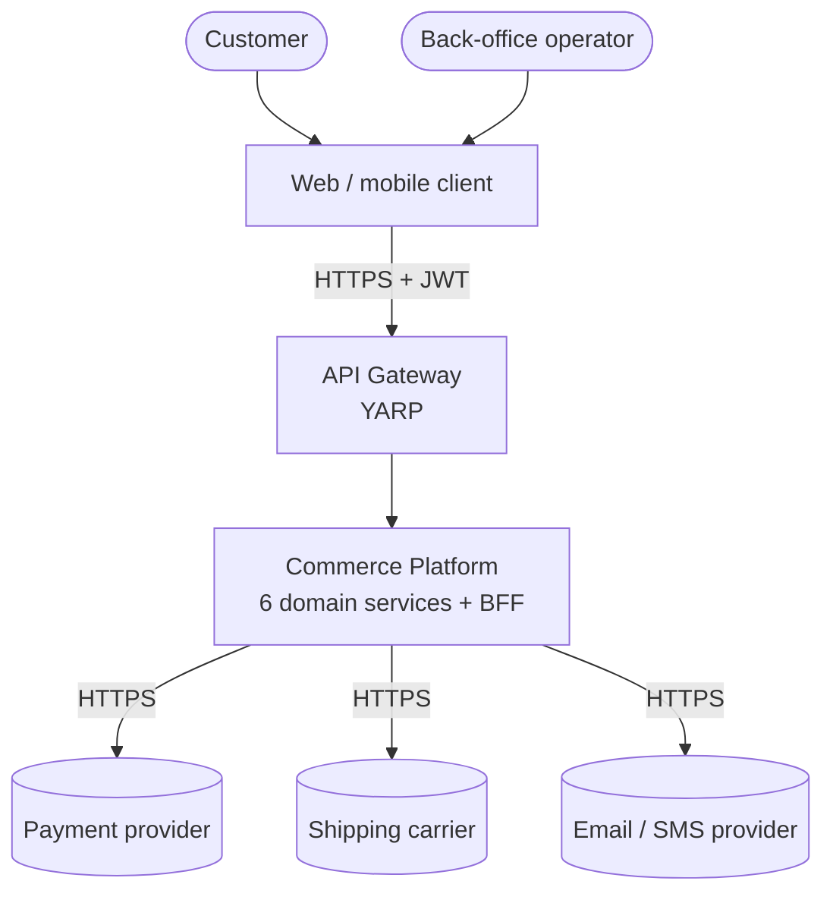
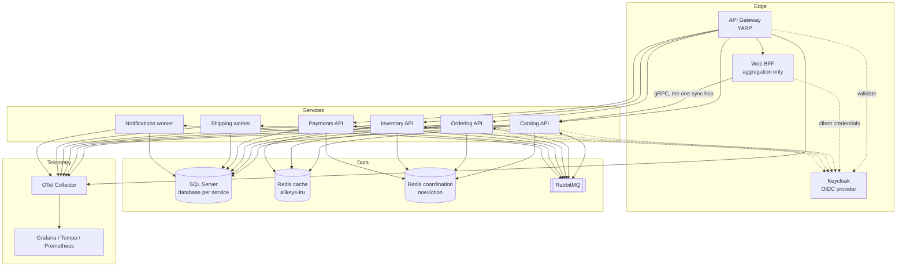

# 2. Architecture at a glance

## 2.1 System context

## 2.2 Container view

Three details in this picture are decisions, not layout:

- **Two Redis instances, not one.** Their eviction policies are incompatible
  ([§8.1](08-caching-redis.md)) — a shared instance under `allkeys-lru` will drop a held lock or a
  revoked token with no error. Payments reaches only the coordination instance:
  it takes idempotency keys (§8.5) and caches nothing.
- **Every service validates its own token**, not just the gateway. [§11.2](11-identity-authorization.md) treats
  the network as hostile, so a request arriving by any other path is still
  authenticated. A diagram showing only `GW -.-> IDP` would depict exactly the
  arrangement that section forbids relying on.
- **Migrators are absent deliberately.** They are Jobs, not long-running
  containers — but each holds a *second* SQL identity with DDL rights ([§7.1](07-persistence.md)),
  which is the part worth knowing that this view cannot show.

## 2.3 Principles

These are the load-bearing rules. Everything else in the document follows from
them.

| # | Principle | Consequence if violated |
|---|---|---|
| 1 | A service owns its data exclusively. No other service touches its database. | You have a distributed monolith with worse latency than a monolith. |
| 2 | One transaction never spans two services. | You need distributed transactions, which do not work at scale. |
| 3 | One transaction never spans two aggregates. Asserted at the transaction boundary ([§6.3](06-cqrs.md)). | Your aggregate boundaries are wrong; find the real ones. |
| 4 | Services communicate through events by default, synchronously only when a user is waiting on the answer. | Availability multiplies downwards: five services at 99.9% chained gives 99.5%. |
| 5 | The domain layer has no dependency on anything infrastructural. | You cannot unit test the domain, so you stop testing it. |
| 6 | Every integration event is idempotent on the consumer side. | At-least-once delivery corrupts data on the first redelivery. |
| 7 | Contracts are versioned and additive. | Any deploy becomes a lockstep deploy of everything. |

## 2.4 The consistency model

This is the single biggest adjustment for teams arriving from a monolith:

- **Inside an aggregate:** strongly consistent, enforced by a database
  transaction, always valid.
- **Between aggregates in one service:** eventually consistent, via domain
  events processed after commit.
- **Between services:** eventually consistent, via integration events and the
  outbox. Typical lag is milliseconds; the design must tolerate seconds.

Every screen, API and business rule must be designed with the knowledge that a
read may be stale. Where a rule genuinely cannot tolerate staleness, that is
strong evidence the data belongs inside a single aggregate.

> **Trap — the distributed monolith.** If deploying service A requires
> simultaneously deploying service B, you have not built microservices. You have
> built a monolith with network calls in the middle. The most common causes are a
> shared database, a shared "Common.Entities" assembly, and synchronous call
> chains three services deep.

---

---

[← §1 Purpose](01-purpose.md) · [Index](README.md) · [§3 Bounded contexts →](03-bounded-contexts.md)
