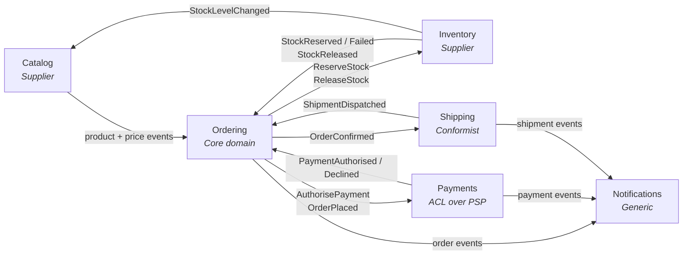

# 3. Bounded contexts and service decomposition

## 3.1 The context map

A bounded context is a boundary within which a term has one unambiguous meaning.
"Product" in Catalog is a rich marketing object with descriptions, images and
categories. "Product" in Inventory is a SKU and a number. These are not the same
concept and must not share a class.

**Every collaboration is a round trip, and the return leg is an event.**
Ordering sends a command and then waits — it does not call and block. The
return edges drawn above are what the fulfilment saga
([§9.6](09-messaging.md)) transitions on, and drawing only the outbound half
would depict the request/response topology ADR-002 and ADR-017 exist to reject.
The saga has a fourth round trip the map does not draw, because both of its
ends are Ordering: `ConfirmOrder` out to the aggregate and `OrderConfirmed`
back. It is asynchronous on exactly these terms, and the Consumes cell below is
where it is recorded.

| Context | Type | Why it is separate |
|---|---|---|
| **Ordering** | Core domain | This is where the business logic actually lives. Invest here. |
| **Catalog** | Supporting | Different read/write ratio (1000:1), different scaling, different team cadence. |
| **Inventory** | Supporting | Different consistency requirements — stock is the one place contention is real. |
| **Payments** | Supporting | Isolates a volatile third-party API behind an anti-corruption layer. Compliance boundary. |
| **Shipping** | Supporting | Conformist to carrier APIs; changes on the carrier's schedule, not yours. |
| **Notifications** | Generic | Not a differentiator. Would be replaced by an off-the-shelf product without regret. |

## 3.2 Service responsibilities

Each service is described by what it owns, what it publishes, and what it
listens to. This table is the contract summary for the whole platform.

Events are published to anyone interested; commands are sent to exactly one
owner (§9.6). The columns are separated because that distinction determines
whether a message uses `Publish` or `Send`, and getting it wrong means a second
subscriber silently executing your business commands.

| Service | Owns | Publishes (events) | Consumes (events) | Accepts (commands) |
|---|---|---|---|---|
| **Catalog** | Product, Category, Price | `ProductPublished`, `PriceChanged`, `ProductDiscontinued` | `StockLevelChanged` | — |
| **Ordering** | Order, OrderLine, the fulfilment saga | `OrderPlaced`, `OrderConfirmed`, `OrderCancelled` | `OrderPlaced` (its own — the saga starts on it), `OrderCancelled` (its own — the saga stops on it), `OrderConfirmed` (its own — the saga waits on it), `ProductPublished`, `PriceChanged`, `ProductDiscontinued`, `StockReserved`, `StockReservationFailed`, `StockReleased`, `PaymentAuthorised`, `PaymentDeclined`, `ShipmentDispatched` | `CancelOrder`, `ConfirmOrder`, `MarkOrderShipped`, `FlagOrderForReview` |
| **Inventory** | StockItem, Reservation | `StockReserved`, `StockReservationFailed`, `StockReleased`, `StockLevelChanged` | `OrderCancelled`, `ShipmentDispatched` | `ReserveStock`, `ReleaseStock` |
| **Payments** | PaymentIntent, Refund | `PaymentAuthorised`, `PaymentDeclined`, `PaymentRefunded` | `OrderPlaced`, `OrderCancelled` | `AuthorisePayment` |
| **Shipping** | Shipment, TrackingEvent | `ShipmentDispatched`, `ShipmentDelivered` | `OrderConfirmed` | — |
| **Notifications** | NotificationLog | — | `OrderPlaced`, `OrderConfirmed`, `OrderCancelled`, `PaymentDeclined`, `PaymentRefunded`, `ShipmentDispatched`, `ShipmentDelivered` | — |

Every cell enumerates. "All customer-relevant events" would be shorter and is
not a contract: it cannot be versioned, reviewed, or checked against what
publishers actually emit. Notifications is the clearest case: it publishes
nothing, so this row is the whole of its contract, and the delivery plan builds
it last for that reason ([Appendix C.1](appendix-c-delivery-plan.md#c1-service-build-order)) — every name in it belongs to a
service that has to exist first. A subscription list that grows silently is how
a consumer ends up bound to a type nobody meant to give it.

**The table closes in both directions, and the second one is easier to lose.**
Every name in a Consumes cell appears in exactly one Publishes cell — an event
nobody emits is a consumer waiting for ever. Less obviously, every name in a
Publishes cell appears in at least one Consumes cell: a published event with no
reader is a contract the platform is committed to versioning and nobody is
asking for, and it looks identical to the case where its consumer was
forgotten. `PaymentRefunded` was that row until Notifications claimed it. Both
directions are two set comparisons over this table, which is worth automating
precisely because neither failure produces a symptom.

The command column is entirely the saga's doing: Ordering's `OrderFulfilmentSaga`
is the only thing that sends commands, and each one lands on the queue of the
service that owns the decision. `CancelOrder` and `ConfirmOrder` route back to
Ordering itself — the saga coordinates, the aggregate decides (§9.6).

**Ordering subscribes to three of its own events, and every entry is the saga
rather than a duplication.** `OrderPlaced` starts the workflow. `OrderCancelled`
stops it, and it is in this cell because the *other* origin of a cancellation is
not a command at all: [§11.4](11-identity-authorization.md)'s customer endpoint
cancels the aggregate directly, which the saga can only learn about by
subscribing to the fact the aggregate publishes. Its absence here was the same
gap as its absence from the state machine — a workflow that went on reserving
stock and authorising payment for an order the customer had cancelled (§9.6).

**`OrderConfirmed` is in the cell for a different reason from the other two,
and the difference is worth having.** It is not a second origin: it is the
**acknowledgement of a command the saga itself sent**. `ConfirmOrder` goes to
the aggregate, and the aggregate's own event is the only evidence it
committed — so without this subscription the saga could only assume, which is
exactly what it used to do. A state named for a command's intent rather than
for its effect is what that assumption looked like in the machine
([#126](https://github.com/alexander-shamray/dotnet-ddd-blueprint/issues/126));
`AwaitingConfirmation` and this cell entry are one change.

**A round trip whose two ends are the same service is still a round trip**, and
this is the platform's only one. The context map above draws no Ordering
self-edge, which is a simplification rather than a claim: the collaboration is
real, it is asynchronous like every other, and it obeys the same rule that the
return leg is an event.

**Payments subscribes to `OrderPlaced` to build its own record of the order —
the payer, the total and the currency.** The payer is the one it cannot do
without, and
[ADR-028](adr/ADR-028-a-money-movement-command-carries-no-subject.md)
forbids `AuthorisePayment` from carrying one: the subject of a money-movement
decision is the deciding service's to derive, not the sender's to state, and a
subject on that command would transport an authority the receiver already
holds. The subject reaches Payments through the event instead, where it was
bound from a real principal at Ordering's endpoint (§11.4), and the command's
arrival is what makes it look the payer up.

**The other two fields are not incidental, which is why the record is of the
order rather than of the payer.** `OrderPlaced` carries `TotalAmount` and
`Currency` — §9.6's saga reads both off it — and holding them is what lets
Payments *disagree* with the `AuthorisePayment` it is handed rather than merely
obey it.

**That record also settles why the subject is omitted and the other two are
not, and it is not because only they can be checked.** Once the payer is in
the record, a supplied `CustomerId` would be just as checkable — so
checkability separates none of the three. The line ADR-028 draws is
**instruction versus authority**: the amount and the currency are what to do,
the sender decides them, and a mismatch is a consistency check; the subject is
on whose behalf, and a transported authority is a second source for a decision
that must have exactly one.

**The platform already does this twice, and the closer of the two is the price
projection.** [§6.4](06-cqrs.md)'s `PlaceOrder` reads
`ordering.ProductPrices` — a local projection of Catalog's price events, and
`IProductPriceReader` is documented as *never a remote call* — so a command
handler that needs another service's fact looks it up in a table Ordering owns.
That is exactly Payments' shape: a **write-path** lookup, on the path that
decides, against a record built from events.
[ADR-027](adr/ADR-027-the-order-summary-stores-product-ids-and-resolves-the-name-locally.md)
is the same mechanism on the read path, for product **names** rather than
prices — the two tables are deliberately distinct, and `ordering.ProductPrices`
has never carried a name.

What differs is what the local copy buys. There, a synchronous hop avoided;
here, an assertion nobody could verify replaced by a record the service owns.

> **The subscription is a precondition, not a decoration, and the ordering
> between the two messages is not guaranteed.** §9.4 orders nothing between two
> deliveries, so an `AuthorisePayment` can arrive at Payments before the
> `OrderPlaced` it would be resolved against — the same race the
> `ReleaseStock` bullet below records, one service over. **A missing
> record is a wait, not a decline.** Payments must not publish
> `PaymentDeclined`, which is a business verdict about a payer it has not yet
> identified.
>
> **What it must not do either is rely on the ordinary retry envelope, and an
> earlier version of this callout did.** §9.8's command policy is five
> exponential in-memory retries capped at a minute; a reorder outlasting that
> reaches the error queue [§13.6](13-observability.md) pages on, turning a
> routine race into an operational fault in about a minute. **A wait needs a
> mechanism that lasts as long as the wait.** Payments' command endpoint
> therefore needs **delayed redelivery** — ADR-021's delayed exchange is
> already on this broker — with a window reaching §9.6's fifteen-minute payment
> timeout, so an order whose `OrderPlaced` never arrives compensates on that
> timeout rather than paging long before it.

**A cell names a message; it does not say what the message means when there is
nothing to do.** `ReleaseStock` is where that gap was load-bearing, and it is
now closed here rather than assumed in the saga that sends it. Inventory owes
two guarantees, both recorded in
[ADR-024](adr/ADR-024-a-release-answers-for-the-order-not-for-the-reservation.md):

- **A `ReleaseStock` always publishes `StockReleased`**, including for a
  reservation that was never held or has already been released. The event
  reports the postcondition — no stock is held for this order — rather than a
  state change, so the sender gets an answer whatever the prior state was.
- **A `ReleaseStock` for an order whose `ReserveStock` has not arrived is
  remembered**, and the `ReserveStock` that follows is refused — answering with
  `StockReleased`, the same postcondition, rather than with
  `StockReservationFailed`, which means an out-of-stock decision and requires
  `UnavailableProductIds` a refusal of this kind does not have.
  [§9.4](09-messaging.md) orders nothing between two deliveries, so a
  cancellation can reach Inventory before the reservation it undoes; without
  this the reserve creates a hold for an order that is already cancelled and
  nobody is left waiting to notice.

**A pair of cells does not state a derivation either, and that is the same gap
one message over.** `OrderCancelled` sits in Inventory's Consumes column and
`StockReleased` in its Publishes column, and every reader has been joining the
two by hand. The join is now written down, because [§9.6](09-messaging.md)
stands every absorption of an early `StockReleased` on it, and one of those
absorptions is the only thing between a cancelled confirmed order and a fault:

- **Consuming `OrderCancelled` releases the stock and publishes
  `StockReleased`**, on the same terms as a `ReleaseStock` — the same
  postcondition, published whether or not a reservation was held. So one
  cancellation has **two** independent routes to the event, and §9.4 orders
  nothing between them.

> **The second producer is what the saga's absorption is for**, and citing this
> section for it was a mis-citation until this bullet existed. Payments'
> `OrderCancelled` → void is argued in prose in §9.6 for the same reason: a
> table can say which messages cross a boundary and cannot say that one causes
> another. Where such a derivation becomes load-bearing — and a pager path is
> as load-bearing as it gets — it belongs in a sentence rather than in the
> reader's head.

> **Decision — Inventory keeps `OrderCancelled`, and the second route is held
> deliberately rather than tolerated.** See
> [ADR-029](adr/ADR-029-inventory-releases-on-the-cancellation-not-on-the-sagas-word.md).
> Routing every release through `ReleaseStock` would tidy this cell and pay for
> it with a cancellation that releases nothing whenever no saga instance
> survives to send the command — §9.6 finalises down several branches before
> any despatch, and the reservation would then be held until a person noticed.
> The direct route is also the only evidence a cancellation gives the saga: an
> early `StockReleased` proves one reached Inventory, so the states that absorb
> it **record** that on the instance rather than discarding it, and guard their
> forward transitions on what they recorded.
>
> **The absence beside it is deliberate too.** Inventory has no
> `OrderConfirmed` subscription, so it cannot decline a release for an order it
> has seen confirmed, and a reservation already being picked is released like
> any other — §9.6 raises `cancelled_after_confirmation` and
> [`order-review.md`](../runbooks/order-review.md) has an operator reinstate it
> by hand. Closing that properly means adding a name to this row, which is
> Inventory's decision to take against a real picking process rather than this
> table's to anticipate.

> **Both guarantees exist because the saga's only alternative to an answer is a
> pager.** [§9.6](09-messaging.md)'s `Compensating` settles its stock half
> either on `StockReleased` or on a ten-minute timeout that raises a
> `stock_not_released` review for a human — the state itself leaves only once
> the payment half has settled too, which is a different question and does not
> change what the stock half costs. `StockReservationFailed` reaches
> that state having proved no reservation was ever taken, so under the other
> reading the *routine* path escalates, naming stranded stock that does not
> exist. This is a rule about a service nobody has written, which is exactly
> when it is cheapest to write down.

Note the shapes this produces. **Shipping** and **Notifications** expose no
public write API at all — they are pure event consumers. **Notifications** is
the simplest possible service and the last one built, and those two facts are
not in tension. It contains almost no domain logic, which is what makes it
cheap; it also publishes nothing and subscribes to seven events owned by other
services, which is what makes it impossible to exercise before they exist
([Appendix C.1](appendix-c-delivery-plan.md#c1-service-build-order)). Simple to write is not the same as ready to build.

## 3.3 Rules for creating a new service

Require **all four** before splitting:

1. It owns data no other service needs transactional access to.
2. It has a genuinely different scaling, availability or compliance profile.
3. A team can own it end-to-end.
4. Its interface can be expressed as events plus a small query API.

If only some hold, make it a module inside an existing service. Merging two
services later is straightforward; splitting one that shares a database is not.

## 3.4 What does not become a service

- **Shared business rules.** They belong in whichever context owns the decision.
- **A "common" or "core" service.** Everything depending on one service is a
  single point of failure with a coordination bottleneck attached.
- **An entity.** "UserService, OrderService, ProductService" is a database
  schema drawn as boxes, not a decomposition. Split by capability.
- **A database access layer.** If it has no behaviour, it is not a service.

---

[← §2 At a glance](02-architecture-at-a-glance.md) · [Index](README.md) · [§4 Solution structure →](04-solution-structure.md)
