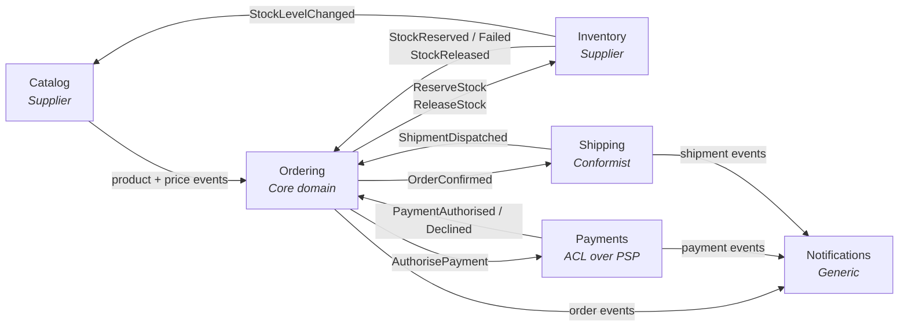

# 3. Bounded contexts and service decomposition

## 3.1 The context map

A bounded context is a boundary within which a term has one unambiguous meaning.
"Product" in Catalog is a rich marketing object with descriptions, images and
categories. "Product" in Inventory is a SKU and a number. These are not the same
concept and must not share a class.

**Every collaboration is a round trip, and the return leg is an event.**
Ordering sends a command and then waits — it does not call and block. The
return edges drawn above are what the fulfilment saga
([§9.6](09-messaging.md)) transitions on, and drawing only the outbound half
would depict the request/response topology ADR-002 and ADR-017 exist to reject.
The saga has a fourth round trip the map does not draw, because both of its
ends are Ordering: `ConfirmOrder` out to the aggregate and `OrderConfirmed`
back. It is asynchronous on exactly these terms, and the Consumes cell below is
where it is recorded.

| Context | Type | Why it is separate |
|---|---|---|
| **Ordering** | Core domain | This is where the business logic actually lives. Invest here. |
| **Catalog** | Supporting | Different read/write ratio (1000:1), different scaling, different team cadence. |
| **Inventory** | Supporting | Different consistency requirements — stock is the one place contention is real. |
| **Payments** | Supporting | Isolates a volatile third-party API behind an anti-corruption layer. Compliance boundary. |
| **Shipping** | Supporting | Conformist to carrier APIs; changes on the carrier's schedule, not yours. |
| **Notifications** | Generic | Not a differentiator. Would be replaced by an off-the-shelf product without regret. |

## 3.2 Service responsibilities

Each service is described by what it owns, what it publishes, and what it
listens to. This table is the contract summary for the whole platform.

Events are published to anyone interested; commands are sent to exactly one
owner (§9.6). The columns are separated because that distinction determines
whether a message uses `Publish` or `Send`, and getting it wrong means a second
subscriber silently executing your business commands.

| Service | Owns | Publishes (events) | Consumes (events) | Accepts (commands) |
|---|---|---|---|---|
| **Catalog** | Product, Category, Price | `ProductPublished`, `PriceChanged`, `ProductDiscontinued` | `StockLevelChanged` | — |
| **Ordering** | Order, OrderLine, the fulfilment saga | `OrderPlaced`, `OrderConfirmed`, `OrderCancelled` | `OrderPlaced` (its own — the saga starts on it), `OrderCancelled` (its own — the saga stops on it), `OrderConfirmed` (its own — the saga waits on it), `ProductPublished`, `PriceChanged`, `ProductDiscontinued`, `StockReserved`, `StockReservationFailed`, `StockReleased`, `PaymentAuthorised`, `PaymentDeclined`, `ShipmentDispatched` | `CancelOrder`, `ConfirmOrder`, `MarkOrderShipped`, `FlagOrderForReview` |
| **Inventory** | StockItem, Reservation | `StockReserved`, `StockReservationFailed`, `StockReleased`, `StockLevelChanged` | `OrderCancelled`, `ShipmentDispatched` | `ReserveStock`, `ReleaseStock` |
| **Payments** | PaymentIntent, Refund | `PaymentAuthorised`, `PaymentDeclined`, `PaymentRefunded` | `OrderCancelled` | `AuthorisePayment` |
| **Shipping** | Shipment, TrackingEvent | `ShipmentDispatched`, `ShipmentDelivered` | `OrderConfirmed` | — |
| **Notifications** | NotificationLog | — | `OrderPlaced`, `OrderConfirmed`, `OrderCancelled`, `PaymentDeclined`, `PaymentRefunded`, `ShipmentDispatched`, `ShipmentDelivered` | — |

Every cell enumerates. "All customer-relevant events" would be shorter and is
not a contract: it cannot be versioned, reviewed, or checked against what
publishers actually emit. Notifications is the clearest case: it publishes
nothing, so this row is the whole of its contract, and the delivery plan builds
it last for that reason ([Appendix C.1](appendix-c-delivery-plan.md#c1-service-build-order)) — every name in it belongs to a
service that has to exist first. A subscription list that grows silently is how
a consumer ends up bound to a type nobody meant to give it.

**The table closes in both directions, and the second one is easier to lose.**
Every name in a Consumes cell appears in exactly one Publishes cell — an event
nobody emits is a consumer waiting for ever. Less obviously, every name in a
Publishes cell appears in at least one Consumes cell: a published event with no
reader is a contract the platform is committed to versioning and nobody is
asking for, and it looks identical to the case where its consumer was
forgotten. `PaymentRefunded` was that row until Notifications claimed it. Both
directions are two set comparisons over this table, which is worth automating
precisely because neither failure produces a symptom.

The command column is entirely the saga's doing: Ordering's `OrderFulfilmentSaga`
is the only thing that sends commands, and each one lands on the queue of the
service that owns the decision. `CancelOrder` and `ConfirmOrder` route back to
Ordering itself — the saga coordinates, the aggregate decides (§9.6).

**Ordering subscribes to three of its own events, and every entry is the saga
rather than a duplication.** `OrderPlaced` starts the workflow. `OrderCancelled`
stops it, and it is in this cell because the *other* origin of a cancellation is
not a command at all: [§11.4](11-identity-authorization.md)'s customer endpoint
cancels the aggregate directly, which the saga can only learn about by
subscribing to the fact the aggregate publishes. Its absence here was the same
gap as its absence from the state machine — a workflow that went on reserving
stock and authorising payment for an order the customer had cancelled (§9.6).

**`OrderConfirmed` is in the cell for a different reason from the other two,
and the difference is worth having.** It is not a second origin: it is the
**acknowledgement of a command the saga itself sent**. `ConfirmOrder` goes to
the aggregate, and the aggregate's own event is the only evidence it
committed — so without this subscription the saga could only assume, which is
exactly what it used to do. A state named for a command's intent rather than
for its effect is what that assumption looked like in the machine
([#126](https://github.com/alexander-shamray/dotnet-ddd-blueprint/issues/126));
`AwaitingConfirmation` and this cell entry are one change.

**A round trip whose two ends are the same service is still a round trip**, and
this is the platform's only one. The context map above draws no Ordering
self-edge, which is a simplification rather than a claim: the collaboration is
real, it is asynchronous like every other, and it obeys the same rule that the
return leg is an event.

Note the shapes this produces. **Shipping** and **Notifications** expose no
public write API at all — they are pure event consumers. **Notifications** is
the simplest possible service and the last one built, and those two facts are
not in tension. It contains almost no domain logic, which is what makes it
cheap; it also publishes nothing and subscribes to seven events owned by other
services, which is what makes it impossible to exercise before they exist
([Appendix C.1](appendix-c-delivery-plan.md#c1-service-build-order)). Simple to write is not the same as ready to build.

## 3.3 Rules for creating a new service

Require **all four** before splitting:

1. It owns data no other service needs transactional access to.
2. It has a genuinely different scaling, availability or compliance profile.
3. A team can own it end-to-end.
4. Its interface can be expressed as events plus a small query API.

If only some hold, make it a module inside an existing service. Merging two
services later is straightforward; splitting one that shares a database is not.

## 3.4 What does not become a service

- **Shared business rules.** They belong in whichever context owns the decision.
- **A "common" or "core" service.** Everything depending on one service is a
  single point of failure with a coordination bottleneck attached.
- **An entity.** "UserService, OrderService, ProductService" is a database
  schema drawn as boxes, not a decomposition. Split by capability.
- **A database access layer.** If it has no behaviour, it is not a service.

---

[← §2 At a glance](02-architecture-at-a-glance.md) · [Index](README.md) · [§4 Solution structure →](04-solution-structure.md)
