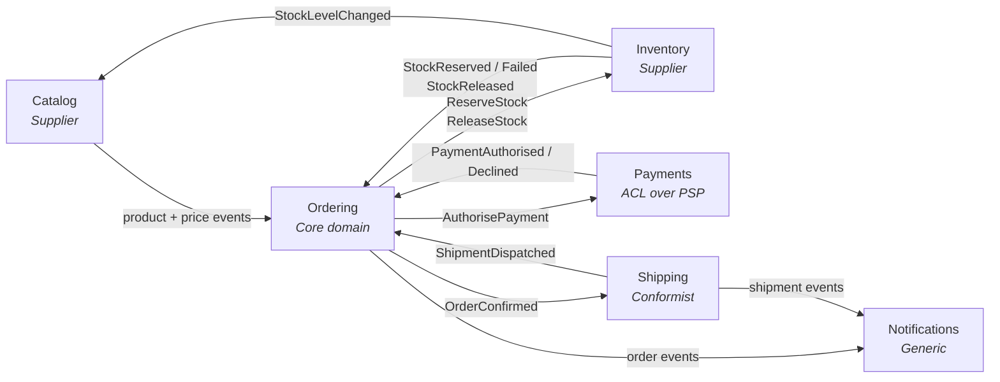

# 3. Bounded contexts and service decomposition

## 3.1 The context map

A bounded context is a boundary within which a term has one unambiguous meaning.
"Product" in Catalog is a rich marketing object with descriptions, images and
categories. "Product" in Inventory is a SKU and a number. These are not the same
concept and must not share a class.

**Every collaboration is a round trip, and the return leg is an event.**
Ordering sends a command and then waits — it does not call and block. The three
return edges are what the fulfilment saga ([§9.6](09-messaging.md)) transitions on, and drawing
only the outbound half would depict the request/response topology ADR-002 and
ADR-017 exist to reject.

| Context | Type | Why it is separate |
|---|---|---|
| **Ordering** | Core domain | This is where the business logic actually lives. Invest here. |
| **Catalog** | Supporting | Different read/write ratio (1000:1), different scaling, different team cadence. |
| **Inventory** | Supporting | Different consistency requirements — stock is the one place contention is real. |
| **Payments** | Supporting | Isolates a volatile third-party API behind an anti-corruption layer. Compliance boundary. |
| **Shipping** | Supporting | Conformist to carrier APIs; changes on the carrier's schedule, not yours. |
| **Notifications** | Generic | Not a differentiator. Would be replaced by an off-the-shelf product without regret. |

## 3.2 Service responsibilities

Each service is described by what it owns, what it publishes, and what it
listens to. This table is the contract summary for the whole platform.

Events are published to anyone interested; commands are sent to exactly one
owner (§9.6). The columns are separated because that distinction determines
whether a message uses `Publish` or `Send`, and getting it wrong means a second
subscriber silently executing your business commands.

| Service | Owns | Publishes (events) | Consumes (events) | Accepts (commands) |
|---|---|---|---|---|
| **Catalog** | Product, Category, Price | `ProductPublished`, `PriceChanged`, `ProductDiscontinued` | `StockLevelChanged` | — |
| **Ordering** | Order, OrderLine, the fulfilment saga | `OrderPlaced`, `OrderConfirmed`, `OrderCancelled` | `OrderPlaced` (its own — the saga starts on it), `ProductPublished`, `PriceChanged`, `ProductDiscontinued`, `StockReserved`, `StockReservationFailed`, `StockReleased`, `PaymentAuthorised`, `PaymentDeclined`, `ShipmentDispatched` | `CancelOrder`, `ConfirmOrder`, `MarkOrderShipped`, `FlagOrderForReview` |
| **Inventory** | StockItem, Reservation | `StockReserved`, `StockReservationFailed`, `StockReleased`, `StockLevelChanged` | `OrderCancelled`, `ShipmentDispatched` | `ReserveStock`, `ReleaseStock` |
| **Payments** | PaymentIntent, Refund | `PaymentAuthorised`, `PaymentDeclined`, `PaymentRefunded` | `OrderCancelled` | `AuthorisePayment` |
| **Shipping** | Shipment, TrackingEvent | `ShipmentDispatched`, `ShipmentDelivered` | `OrderConfirmed` | — |
| **Notifications** | NotificationLog | — | `OrderPlaced`, `OrderConfirmed`, `OrderCancelled`, `PaymentDeclined`, `PaymentRefunded`, `ShipmentDispatched`, `ShipmentDelivered` | — |

Every cell enumerates. "All customer-relevant events" would be shorter and is
not a contract: it cannot be versioned, reviewed, or checked against what
publishers actually emit, and Notifications is the service the delivery plan
says to build first ([Appendix C](appendix-c-delivery-plan.md).1). A subscription list that grows silently is
how a consumer ends up bound to a type nobody meant to give it.

**The table closes in both directions, and the second one is easier to lose.**
Every name in a Consumes cell appears in exactly one Publishes cell — an event
nobody emits is a consumer waiting for ever. Less obviously, every name in a
Publishes cell appears in at least one Consumes cell: a published event with no
reader is a contract the platform is committed to versioning and nobody is
asking for, and it looks identical to the case where its consumer was
forgotten. `PaymentRefunded` was that row until Notifications claimed it. Both
directions are two set comparisons over this table, which is worth automating
precisely because neither failure produces a symptom.

The command column is entirely the saga's doing: Ordering's `OrderFulfilmentSaga`
is the only thing that sends commands, and each one lands on the queue of the
service that owns the decision. `CancelOrder` and `ConfirmOrder` route back to
Ordering itself — the saga coordinates, the aggregate decides (§9.6).

Note the shapes this produces. **Shipping** and **Notifications** expose no
public write API at all — they are pure event consumers. **Notifications** is
the simplest possible service and is a good first one to build, because it
exercises the entire messaging and observability stack while containing almost
no domain logic.

## 3.3 Rules for creating a new service

Require **all four** before splitting:

1. It owns data no other service needs transactional access to.
2. It has a genuinely different scaling, availability or compliance profile.
3. A team can own it end-to-end.
4. Its interface can be expressed as events plus a small query API.

If only some hold, make it a module inside an existing service. Merging two
services later is straightforward; splitting one that shares a database is not.

## 3.4 What does not become a service

- **Shared business rules.** They belong in whichever context owns the decision.
- **A "common" or "core" service.** Everything depending on one service is a
  single point of failure with a coordination bottleneck attached.
- **An entity.** "UserService, OrderService, ProductService" is a database
  schema drawn as boxes, not a decomposition. Split by capability.
- **A database access layer.** If it has no behaviour, it is not a service.

---

---

[← §2 At a glance](02-architecture-at-a-glance.md) · [Index](README.md) · [§4 Solution structure →](04-solution-structure.md)
