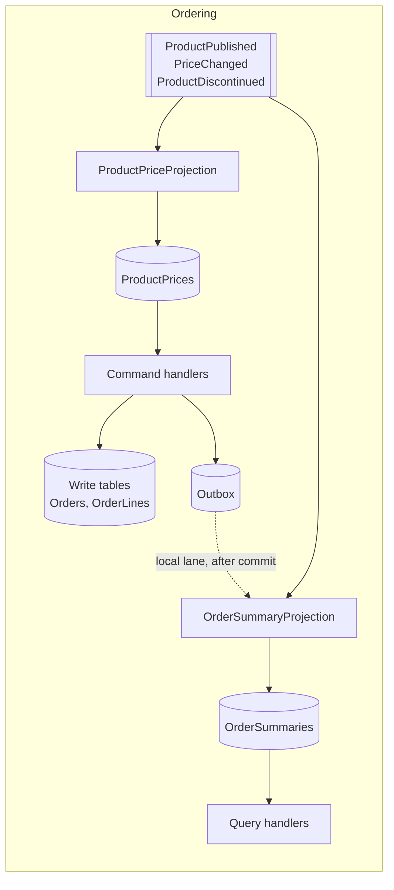

# 6. CQRS

## 6.1 What CQRS means here

Command Query Responsibility Segregation means the write path and the read path
use different models. It does not require different databases, event sourcing,
or eventual consistency. Those are options that CQRS *enables*, not requirements
it imposes.

The blueprint uses two levels and shows how to move between them:

| | Level 1 — Logical CQRS | Level 2 — Physical split |
|---|---|---|
| Write model | EF Core, aggregates | EF Core, aggregates |
| Read model | Dapper over the same tables/views | Dedicated denormalised tables or Redis |
| Store | One database | Write DB + read store |
| Sync | None needed | Projections from events |
| Consistency | Strong | Eventual |
| Used by | Catalog, Inventory, Payments, Shipping | Ordering (section 6.6) |

**Start at level 1.** It gives most of the benefit — the write model stays
clean, queries stay fast — at none of the operational cost. Escalate only where
measurement justifies it.

## 6.2 The dispatcher

MediatR is the conventional choice and moved to a commercial licence in 2025.
The functionality it provides here is roughly eighty lines. Writing them removes
a licence obligation, a dependency, and a layer of reflection-driven indirection
that makes stack traces harder to read.

```csharp
namespace Common.Application;

public interface ICommand<out TResult>;
public interface IQuery<out TResult>;

public interface ICommandHandler<in TCommand, TResult>
    where TCommand : ICommand<TResult>
{
    Task<TResult> HandleAsync(TCommand command, CancellationToken ct);
}

public interface IQueryHandler<in TQuery, TResult>
    where TQuery : IQuery<TResult>
{
    Task<TResult> HandleAsync(TQuery query, CancellationToken ct);
}

public delegate Task<TResult> NextDelegate<TResult>();

public interface IPipelineBehavior<in TRequest, TResult>
{
    Task<TResult> HandleAsync(TRequest request, NextDelegate<TResult> next, CancellationToken ct);
}

public interface IDispatcher
{
    Task<TResult> SendAsync<TResult>(ICommand<TResult> command, CancellationToken ct = default);
    Task<TResult> QueryAsync<TResult>(IQuery<TResult> query, CancellationToken ct = default);
}
```

The implementation caches one invoker instance per concrete request type,
result type and kind, so the reflection cost is paid once per combination
rather than per call.

```csharp
internal sealed class Dispatcher(IServiceProvider services) : IDispatcher
{
    // Keyed on all three parts of what the invoker closes over — see below.
    private static readonly ConcurrentDictionary<(Type Request, Type Result, Type Kind), object> Invokers = new();

    public Task<TResult> SendAsync<TResult>(ICommand<TResult> command, CancellationToken ct = default) =>
        GetInvoker<TResult>(command.GetType(), typeof(CommandInvoker<,>))
            .InvokeAsync(services, command, ct);

    public Task<TResult> QueryAsync<TResult>(IQuery<TResult> query, CancellationToken ct = default) =>
        GetInvoker<TResult>(query.GetType(), typeof(QueryInvoker<,>))
            .InvokeAsync(services, query, ct);

    private static Invoker<TResult> GetInvoker<TResult>(Type requestType, Type openInvoker) =>
        (Invoker<TResult>)Invokers.GetOrAdd(
            (requestType, typeof(TResult), openInvoker),
            static key => Activator.CreateInstance(key.Kind.MakeGenericType(key.Request, key.Result))!);

    private abstract class Invoker<TResult>
    {
        public abstract Task<TResult> InvokeAsync(IServiceProvider services, object request, CancellationToken ct);
    }

    private sealed class CommandInvoker<TCommand, TResult> : Invoker<TResult>
        where TCommand : ICommand<TResult>
    {
        public override Task<TResult> InvokeAsync(IServiceProvider services, object request, CancellationToken ct)
        {
            TCommand typed = (TCommand)request;
            ICommandHandler<TCommand, TResult> handler =
                services.GetRequiredService<ICommandHandler<TCommand, TResult>>();

            NextDelegate<TResult> pipeline = () => handler.HandleAsync(typed, ct);

            // Reversed so the first-registered behaviour is the outermost.
            foreach (IPipelineBehavior<TCommand, TResult> behavior in services
                .GetServices<IPipelineBehavior<TCommand, TResult>>()
                .Reverse())
            {
                NextDelegate<TResult> next = pipeline;
                pipeline = () => behavior.HandleAsync(typed, next, ct);
            }

            return pipeline();
        }
    }

    // QueryInvoker<TQuery, TResult> is identical but resolves IQueryHandler<,>.
}
```

> **The request type alone is not a key, and the two collisions it admits fail
> differently.** `ICommand<T>` is an ordinary generic interface, so one record
> may implement it twice under different results — and may implement
> `ICommand<T>` and `IQuery<T>` under the same one. The first case throws an
> `InvalidCastException` from inside the dispatcher, naming neither the request
> nor the reason. **The second throws nothing at all**: both invokers derive
> from `Invoker<TResult>`, so the cast succeeds and the query quietly runs the
> command's handler through the command's behaviours — a read inside a
> transaction, which is the defect §6.3 constrains `TransactionBehavior` to
> avoid. A three-part key costs a tuple hash on a path that was already doing a
> dictionary lookup.

`Dispatcher` is `internal`, so a service cannot name the type and cannot write
its own `AddScoped` line. `Common.Application` registers it:

```csharp
public static class DependencyInjection
{
    extension(IServiceCollection services)
    {
        public IServiceCollection AddDispatcher()
        {
            services.AddScoped<IDispatcher, Dispatcher>();
            return services;
        }
    }
}
```

A C# 14 **extension block**, not a `this`-parameter extension method. The
receiver is named once on the block and every member inside it reads
`services` directly, which is what makes the two registrations below worth
grouping — they extend the same type for the same reason, and the classic form
repeats `this IServiceCollection services` on each. Call sites are identical
either way: `services.AddDispatcher()` binds the same.

Scoped, because handlers are. A singleton dispatcher would capture the root
provider, and every request would share one handler instance — and one
`DbContext` behind it once [§7.2](07-persistence.md) puts one there. The
constructor takes an `IServiceProvider` and the scope it is resolved from is
the one it hands to the invokers, so the lifetime is not a preference.

Registration scans the assembly once at startup. Every pluggable interface must
be scanned — one that exists but is never registered resolves to an empty
collection or throws at first use, and neither failure points at the omission.

The list is declared **once**, in `Common.Application`, and both the scan and
the test below read it. That is the point: the previous version kept two copies,
and adding a fifth interface meant remembering both:

```csharp
namespace Common.Application;

/// <summary>
/// Every open generic the container is expected to discover by convention.
/// Adding a pluggable interface means adding it here — and nowhere else.
/// </summary>
public static class PluggableInterfaces
{
    public static readonly IReadOnlyList<Type> All =
    [
        typeof(ICommandHandler<,>),          // §6.2 — HTTP and message-borne
        typeof(IQueryHandler<,>),            // §6.5
        typeof(IProjectionHandler<>),        // §7.5 — local outbox lane
        typeof(IIntegrationEventHandler<>),  // §9.4 — broker lane
        typeof(ICommandMessageMapper<,>)     // §9.4 — wire contract → command

        // IPipelineBehavior<,> is deliberately absent. Registration order is
        // pipeline order (§6.3), and a scan gives no ordering guarantee —
        // behaviours are registered explicitly and asserted by a test.
    ];
}

/// <summary>Maps an inbound command contract to its application command.</summary>
public interface ICommandMessageMapper<in TMessage, out TCommand>
    where TMessage : class
{
    TCommand Map(TMessage message);
}
```

```csharp
// The second member of the same extension block as AddDispatcher above.
public IServiceCollection AddPluggableFrom(Assembly assembly) =>
    services.Scan(scan =>
    {
        IImplementationTypeSelector from = scan.FromAssemblies(assembly);

        foreach (Type contract in PluggableInterfaces.All)
        {
            from
                .AddClasses(c => c.AssignableTo(contract))
                .AsImplementedInterfaces()
                .WithScopedLifetime();
        }
    });
```

**Each layer scans itself.** Handlers do not all live in Application: the
projections in §6.6 write SQL, `PriceChangedCacheInvalidator` ([§8.4](08-caching-redis.md)) sits in
`Ordering.Infrastructure.Caching`, and the command mappers convert wire
contracts. Scanning one assembly registers some handlers and silently skips the
rest, which is the §6.2 trap with a wider blast radius — so both registration
methods call it:

```csharp
// Ordering.Application/DependencyInjection.cs
services.AddPluggableFrom(typeof(PlaceOrderCommand).Assembly);

// Ordering.Infrastructure/DependencyInjection.cs
services.AddPluggableFrom(typeof(OrderRepository).Assembly);
```

> **Trap — the handler that was never registered.** Nothing in C# requires an
> implemented interface to be resolvable. `GetServices<IProjectionHandler<T>>()`
> returning empty is indistinguishable from "this event has no projection", so
> the message is marked processed having done nothing and the monitoring stays
> green. [§9.4](09-messaging.md) closes this by throwing when a `Local` row finds no handler, and
> the registration test below catches it at build time instead.
>
> The trap has a second form worth naming, because this document fell into it:
> a *list* of interfaces duplicated between the registration and the test that
> guards it. Both copies drift together or not at all, and the guard silently
> stops covering whatever the newest interface is. One list, two readers.

Three mechanisms guard wiring, and none subsumes the others:

| | Catches | Misses |
|---|---|---|
| **`ValidateOnBuild`** ([§4.2](04-solution-structure.md)) | Anything *depended upon* but unregistered — ports, stores, clients — at startup, for the whole graph | A type nothing depends on. An unregistered `IProjectionHandler` breaks no constructor, so the container starts happily |
| **The registration test** below | An implementation of a scanned interface that never got registered, whether or not anything depends on it | Plain ports — not open generics, so not in `PluggableInterfaces` |
| **`ValidateOnStart`** ([§15.4](15-cicd-deployment.md)) | An options type that is never bound, or bound but missing a `[Required]` value | Anything that is not configuration |

They cover three different failure shapes, and the third is the least obvious:
`IOptions<T>` resolves whether or not it was bound, handing back an empty
instance. So a forgotten `AddOptions` satisfies `ValidateOnBuild`, passes the
registration test, starts the service, and fails as *behaviour* — an empty
Redis key prefix, a token request with no scope.

Worked examples of each: `IProductPriceReader` unregistered fails
`ValidateOnBuild`, because `PlaceOrderHandler` needs it. `ProductPriceProjection`
unregistered fails only the test — no constructor names it, so the container
starts as happily as ever. `ServiceIdentityOptions` unbound fails only
`ValidateOnStart` — the container resolves `IOptions<T>` happily and hands
back an empty instance.

**What "fails only the test" does *not* mean is that nothing notices at
runtime**, and the middle example is the one where that distinction became
real. While no endpoint bound Catalog's events, an unregistered
`ProductPriceProjection` was silent in the fullest sense: nothing resolved
`IIntegrationEventHandler<ProductPublished>`, so nothing missed it. Once
`ordering-catalog-events` binds those three types ([§9.8](09-messaging.md)),
`IntegrationEventConsumer<T>` resolves the handler list on every delivery and
**throws** on an empty one — §9.4's "the endpoint binds this type, so
something should handle it". So the registration test remains the only one of
the three *startup* guards that fires, which is what this row is about, and
the failure behind it moved from silence to a message on the error queue.

A guard's value is what it catches before deployment; how loudly the gap
announces itself afterwards is a separate axis. The two are easy to collapse
into one sentence, and this paragraph exists because they were.

```csharp
[Fact]
public void Every_handler_implementation_is_registered()
{
    // BuildProvider() — the real registration path, not a test-only container,
    // and the same helper §6.3 and §13.6 use rather than a second copy of the
    // three calls. It runs BOTH AddOrderingApplication and
    // AddOrderingInfrastructure, which is the property this test depends on:
    // a hand-rolled version that ran only the Application half would find the
    // Infrastructure handlers absent and report the layer it forgot to build
    // as an unregistered handler.
    //
    // Handlers are scoped; resolving them from the root provider throws.
    using IServiceScope scope = BuildProvider().CreateScope();

    // Every service assembly, not just Application. Building the provider above
    // has forced both to load, and deriving the set here means a new layer is
    // covered without editing this test — the same reason the interface list
    // is not duplicated either.
    IEnumerable<Assembly> assemblies = AppDomain.CurrentDomain
        .GetAssemblies()
        .Where(a => a.GetName().Name?.StartsWith("Ordering.") == true);

    // Same list the scan uses — a new interface is covered the moment it is
    // added to PluggableInterfaces, with no second place to remember.
    IEnumerable<(Type Implementation, Type Service)> implementations =
        assemblies
            .SelectMany(a => a.GetTypes())
            .Where(t => t is { IsAbstract: false, IsInterface: false })
            .SelectMany(t => t
                .GetInterfaces()
                .Where(i => i.IsGenericType &&
                    PluggableInterfaces.All.Contains(i.GetGenericTypeDefinition()))
                .Select(i => (Implementation: t, Service: i)));

    foreach (var (implementation, service) in implementations)
    {
        scope.ServiceProvider.GetServices(service).ShouldContain(
            s => s!.GetType() == implementation,
            $"{implementation.Name} implements {service.Name} but is not registered.");
    }
}
```

> **Decision — no mediator library.** See [ADR-004](appendix-a-adrs.md#adr-004--no-mediator-library).

## 6.3 Pipeline behaviours

Cross-cutting concerns are behaviours, registered once and applied to every
command. Order matters — they nest outermost-first.

```
Request
  → Logging          (correlation id, timing, outcome)
  → Validation       (FluentValidation; fails fast before any I/O)
  → Idempotency      (has this command id been processed?)
  → Transaction      (open, handle, dispatch domain events, commit)
      → Handler
```

**Behaviours are registered explicitly, in order, and are deliberately not part
of the §6.2 convention scan:**

```csharp
// In AddOrderingApplication, after AddPluggableFrom.
//
// Registration order IS pipeline order — the dispatcher reverses this list so
// the first registered ends up outermost (§6.2). A scan would register them in
// whatever order reflection returns types, which is unspecified, so this one
// interface is excluded from PluggableInterfaces on purpose.
services.AddScoped(typeof(IPipelineBehavior<,>), typeof(LoggingBehavior<,>));
services.AddScoped(typeof(IPipelineBehavior<,>), typeof(ValidationBehavior<,>));
services.AddScoped(typeof(IPipelineBehavior<,>), typeof(IdempotencyBehavior<,>));
services.AddScoped(typeof(IPipelineBehavior<,>), typeof(TransactionBehavior<,>));
```

> **Unregistered, this fails silently and completely.** `GetServices<IPipelineBehavior<…>>()`
> returning empty is indistinguishable from "no behaviours configured", so the
> dispatcher invokes the handler alone. `SaveChangesAsync` has exactly one call
> site — inside `TransactionBehavior` — so a missing registration means
> `PlaceOrderHandler` calls `orders.Add(order)`, returns `Result.Success`, and
> **nothing is ever written**: no order, no outbox row, no saga. The request
> returns 200.
>
> That is the argument for the ordered-registration test below rather than
> trusting four lines to survive a refactor.

```csharp
[Fact]
public void Command_behaviours_are_registered_in_the_documented_order()
{
    using IServiceScope scope = BuildProvider().CreateScope();

    Type[] actual =
    [
        .. scope.ServiceProvider
            .GetServices<IPipelineBehavior<PlaceOrderCommand, Result<Guid>>>()
            .Select(b => b.GetType().GetGenericTypeDefinition())
    ];

    actual.ShouldBe(
        [
            typeof(LoggingBehavior<,>),
            typeof(ValidationBehavior<,>),
            typeof(IdempotencyBehavior<,>),
            typeof(TransactionBehavior<,>)
        ],
        "outermost first — see the pipeline diagram above");
}
```

The generic constraints do the rest of the work, and they do not do the same
work: `IdempotencyBehavior` requires `IIdempotentCommand` **and**
`TResult : Result` ([§8.5](08-caching-redis.md)), where `TransactionBehavior`
requires `ICommand<TResult>` and nothing else. A **query** is dropped by all
three — §6.5's fails both of `IdempotencyBehavior`'s independently, declaring
no `IIdempotentCommand` and returning a `CursorPage<T>` that derives from
nothing — so it runs through neither behaviour. A **command that has not opted
in** is dropped by `IdempotencyBehavior` alone: `CancelOrderCommand` and
`ConfirmStockCommand` are `ICommand<Result>`, and `TransactionBehavior` still
wraps them, which is the whole reason its constraint is `ICommand` rather than
`IIdempotentCommand`. Neither behaviour needs to check.

**The `TResult` constraint is worth its cost, and the cost is silence.** What
needs it is the cast of a rebuilt `Result` back to `TResult` (§8.5) — not
reading `IsFailure`, which `TransactionBehavior` does with a pattern match and
no `TResult` constraint at all. What the constraint buys in the type
system it charges back at the container: a command that opts into
`IIdempotentCommand` and returns anything else is dropped here rather than
rejected, so the seat in the pipeline is simply empty. §8.5 carries a
reflection test over exactly that.

That skipping is a container feature, not a language one — `Microsoft.Extensions
.DependencyInjection` has honoured constraints on open generic registrations
since .NET 7, and on an older container the same registration throws when the
first query resolves rather than quietly omitting the behaviour. A blueprint
that leaves it at "the constraints do the work" is trusting a version note, so
the assertion above has a mirror:

```csharp
[Fact]
public void Queries_run_without_the_transaction_and_idempotency_behaviours()
{
    using IServiceScope scope = BuildProvider().CreateScope();

    Type[] actual =
    [
        .. scope.ServiceProvider
            // The query's own result type (§6.5) — CursorPage, not Result. A
            // closed IPipelineBehavior<,> asked for with the wrong TResult resolves
            // to an empty sequence, and an empty sequence passes any assertion
            // about what is absent.
            .GetServices<IPipelineBehavior<GetOrderSummariesQuery, CursorPage<OrderSummaryDto>>>()
            .Select(b => b.GetType().GetGenericTypeDefinition())
    ];

    // A query opening a transaction is the defect this catches: harmless in
    // a test, and a held connection per read under load.
    actual.ShouldBe(
        [
            typeof(LoggingBehavior<,>),
            typeof(ValidationBehavior<,>)
        ],
        "queries get logging and validation only — §6.3");
}
```

Validation:

```csharp
public sealed class ValidationBehavior<TRequest, TResult>(IEnumerable<IValidator<TRequest>> validators)
    : IPipelineBehavior<TRequest, TResult>
{
    public async Task<TResult> HandleAsync(TRequest request, NextDelegate<TResult> next, CancellationToken ct)
    {
        if (!validators.Any())
            return await next();

        // One context per validator, not one shared between them. See below.
        ValidationResult[] results = await Task.WhenAll(
            validators.Select(v => v.ValidateAsync(new ValidationContext<TRequest>(request), ct)));

        ValidationFailure[] failures = [.. results.SelectMany(r => r.Errors).Where(f => f is not null)];

        if (failures.Length > 0)
            throw new ValidationException(failures);

        return await next();
    }
}
```

> **A `ValidationContext<T>` is not a value to share across validators.** It
> carries the failure list, and every `ValidationResult` built from it reports
> that whole list as its own — so two validators over one context each come back
> holding both failures, `SelectMany` counts each twice, and the caller is told
> its one empty field is two empty fields. `Task.WhenAll` runs the validators
> concurrently besides, which makes the shared list a race as well as a
> duplication. A context per validator costs an allocation per rule set and
> removes both.
>
> This was written the other way first and a test found it — two validators, one
> empty string, four failures. It is the kind of defect that is invisible in the
> single-validator case every sample uses.

**The sequence is read twice — `Any()` and then `Select` — and that is not a
double resolution.** `Microsoft.Extensions.DependencyInjection` materialises an
`IEnumerable<T>` into an array while building the constructor's arguments, so
the validators exist before `HandleAsync` is entered and both reads walk the
same array. Materialising it again inside the method would buy nothing. This is
the same shape as the constraint note above — a library behaviour the code
leans on with nothing in the C# to say so — so it is pinned by a test rather
than left to be re-argued in review, which it has been once already.

Transaction — this is the behaviour that makes the domain-event and outbox
mechanism work, and it is the one worth reading closely.

It must not reference EF Core, because it lives in `Common.Application` and
§4.2 forbids it. The transaction boundary is therefore expressed as a port:

```csharp
namespace Common.Application;

/// <summary>
/// The command transaction boundary. Implemented in Infrastructure over the
/// service DbContext; Application never sees EF Core.
/// </summary>
public interface IUnitOfWork
{
    bool HasActiveTransaction { get; }

    /// <summary>
    /// Runs <paramref name="operation"/> inside one atomic unit, retrying the
    /// whole unit on transient faults. Persists aggregate changes, domain-event
    /// side effects and outbox rows together, or none of them.
    /// </summary>
    Task<TResult> ExecuteAsync<TResult>(Func<CancellationToken, Task<TResult>> operation, CancellationToken ct);

    Task<int> SaveChangesAsync(CancellationToken ct);
}
```

The behaviour depends only on that:

```csharp
public sealed class TransactionBehavior<TCommand, TResult>(IUnitOfWork unitOfWork, IDomainEventDispatcher domainEvents)
    : IPipelineBehavior<TCommand, TResult>
    where TCommand : ICommand<TResult>
{
    public async Task<TResult> HandleAsync(TCommand command, NextDelegate<TResult> next, CancellationToken ct)
    {
        // Already inside a transaction (nested dispatch) — do not open another.
        if (unitOfWork.HasActiveTransaction)
            return await next();

        return await unitOfWork.ExecuteAsync(
            async token =>
            {
                TResult result = await next();

                // A handler that returns a failed Result has rejected the command.
                // Returning here skips both the staging and the save, so the
                // transaction commits nothing and no outbox row announces a state
                // change that did not happen. Result<T> derives from Result, so one
                // pattern covers every command shape without reflection.
                if (result is Result { IsFailure: true })
                    return result;

                // Stages outbox rows only — no handler runs here (§7.5).
                // Reactions happen after commit, driven by the outbox.
                await domainEvents.DispatchAsync(token);

                // Principle 3 (§2.3), asserted rather than trusted — see below for
                // why it is here and not in a code review checklist. After
                // dispatch, so the staged rows of a legitimate single-root command
                // are already in the tracker and not miscounted.
                if (unitOfWork.ModifiedAggregateCount > 1)
                {
                    throw new InvariantViolationException(
                        $"{typeof(TCommand).Name} modified {unitOfWork.ModifiedAggregateCount} " +
                        "aggregate roots. One transaction, one aggregate (§2.3 principle 3) — " +
                        "the second aggregate should react to a domain event after commit (§7.5).");
                }

                await unitOfWork.SaveChangesAsync(token);

                return result;
            },
            ct);
    }
}
```

**This is the whole behaviour.** Nothing below adds to it. Every sample in this
document that shows part of a pipeline is an excerpt of something, and the one
place that matters is this one — because a behaviour assembled from fragments
loses whichever fragment the reader did not scroll to, and the missing piece is
silent in all three cases: no failure guard commits rejected commands, no
dispatch publishes nothing, no count check makes principle 3 advisory.

> **A rejected command must not have written anything, and one guard is not
> enough to promise that.** This one skips the staging and the save, which
> covers everything EF is tracking. It does nothing about a write that already
> reached the connection — `ExecuteRawAsync` (below) executes immediately, and
> no amount of not-calling-`SaveChanges` takes it back. That is why
> `EfUnitOfWork.ExecuteAsync` carries the *same* check before `CommitAsync`
> (§6.3): the two together mean a failed command commits nothing by either
> route.
>
> **Validate first, mutate second** remains the rule, because the guards make
> breaking it cost a discarded write rather than a committed lie — but a rule
> whose enforcement is two checks in two types is a rule worth testing. PR-09
> covers both: `SaveChanges` once on success and never on failure, and a
> handler that calls `ExecuteRawAsync` and then returns `Result.Failure` leaves
> no row behind.

> **Nothing inside this transaction may make a network call to another
> service.** The behaviour wraps the whole handler, so any remote call a handler
> makes is held open across the wire. With §9.7's 5-second client budget, a
> single slow peer can pin a SQL Server transaction — and its pooled connection
> — for five seconds per request. Under load that is connection-pool exhaustion
> and lock contention, and it converts "Catalog is slow" into "Ordering is
> down", which is precisely what ADR-002 exists to prevent.
>
> A command handler may therefore read only its **own** database. Data owned by
> another service must already be present locally, projected from that service's
> events (§6.6). §9.7 states the general rule; this is where violating it hurts
> most, because the transaction makes the coupling invisible at the call site.

### One aggregate per transaction

Principle 3 ([§2.3](02-architecture-at-a-glance.md)) says a transaction never spans two aggregates, and nothing
about `SaveChangesAsync` objects if a handler loads two — one save, one commit,
no complaint. The count in the behaviour above is what makes the rule
observable, and it needs two members on the port:

```csharp
public interface IUnitOfWork
{
    // ... as above

    /// <summary>Distinct aggregate roots with pending changes.</summary>
    int ModifiedAggregateCount { get; }

    /// <summary>
    /// Raw SQL on the transaction's own connection, for the rare table with no
    /// aggregate behind it (§9.6's OrderReviews). A command handler must not
    /// open its own connection — that write would commit outside this
    /// transaction.
    /// </summary>
    Task ExecuteRawAsync(string sql, object parameters, CancellationToken ct);
}
```

The EF implementation of both new members is in `EfUnitOfWork` below. Owned
children (`OrderLine`) do not count — they are part of their root, which is the
whole reason an aggregate is a consistency boundary rather than a table.

**Why a runtime check rather than an architecture test.** The violation is not
structural: nothing in a handler's *type* says how many aggregates it will
touch, and the second one is usually loaded conditionally, three calls deep.
An assertion at the transaction boundary catches it on the first execution that
does it — in a unit test, in CI, or on the developer's machine — with the
command name and the count in the message.

**When it fires, the fix is almost never to relax it.** A command that must
change two aggregates is describing a process, not a transaction: the second
aggregate reacts to the first one's domain event after commit (ADR-018), or the
two belong in one aggregate and the boundary is drawn in the wrong place. Both
are [§5.4](05-tactical-ddd.md) problems, and the exception says which sections to read.

Query handlers must never resolve `IUnitOfWork`. The behaviour is constrained to
`ICommand<TResult>` precisely so the read path cannot open a write transaction
or touch the outbox.

The EF Core implementation lives in Infrastructure:

```csharp
namespace Ordering.Infrastructure.Persistence;

internal sealed class EfUnitOfWork(OrderingDbContext db) : IUnitOfWork
{
    public bool HasActiveTransaction => db.Database.CurrentTransaction is not null;

    public async Task<TResult> ExecuteAsync<TResult>(
        Func<CancellationToken, Task<TResult>> operation,
        CancellationToken ct)
    {
        IExecutionStrategy strategy = db.Database.CreateExecutionStrategy();

        // The token-aware overload, so cancellation is observed by the strategy
        // itself. With the parameterless one the token reaches only the calls
        // inside the delegate, so a cancel during a retry backoff is not seen
        // until the delay elapses and the next attempt reaches one of them.
        return await strategy.ExecuteAsync(
            async token =>
            {
                // Every attempt starts from committed state. EF does not reset
                // the change tracker when a transaction rolls back, so without
                // this line a retry re-runs the domain method on attempt 1's
                // tracked, already-mutated aggregates out of the identity map,
                // and one SaveChanges commits the mutation twice.
                db.ChangeTracker.Clear();

                await using IDbContextTransaction tx =
                    await db.Database.BeginTransactionAsync(token);
                TResult result = await operation(token);

                // The commit decision belongs with the commit. §6.3's behaviour
                // declines to SaveChanges on a failed Result — but
                // ExecuteRawAsync writes on this transaction's connection
                // immediately, and only a rollback undoes that. Returning
                // without committing disposes the transaction, which rolls it
                // back.
                if (result is Result { IsFailure: true })
                {
                    // And the tracker goes with it, because a rollback that
                    // leaves the rejected mutations tracked is only half a
                    // rollback. This line was once unnecessary and this comment
                    // once said so: "declines to SaveChanges … which is enough
                    // for tracked changes" held while this behaviour was the
                    // ONLY caller of SaveChanges on the scope.
                    //
                    // §9.5's inbox filter is the second. It runs after the
                    // consumer returns and saves unconditionally — it has its
                    // own row to write — so anything a rejected handler left
                    // tracked would be persisted by it, outside the transaction
                    // just rolled back. A domain refusal committing its own
                    // mutations is the one outcome this boundary exists to
                    // prevent.
                    db.ChangeTracker.Clear();

                    return result;
                }

                await tx.CommitAsync(token);
                return result;
            },
            ct);
    }

    public Task<int> SaveChangesAsync(CancellationToken ct) => db.SaveChangesAsync(ct);

    // Owned children (OrderLine) are not roots and do not count — that is the
    // difference between an aggregate and a table (§6.3, principle 3).
    public int ModifiedAggregateCount => db.ChangeTracker
        .Entries()
        .Count(e => e.Entity is IAggregateRoot &&
                    e.State is EntityState.Added or EntityState.Modified or EntityState.Deleted);

    // The transaction's own connection and transaction, explicitly passed —
    // this is what makes a raw write part of the command rather than beside it.
    public Task ExecuteRawAsync(string sql, object parameters, CancellationToken ct)
    {
        // Not CurrentTransaction?.GetDbTransaction(). A null-conditional here
        // hands Dapper transaction: null, and a command with no transaction
        // autocommits — so the one call this member exists to prevent would
        // succeed silently, on its own connection, outside the unit the caller
        // believes it is in. Checked rather than trusted, for the reason the
        // aggregate count above is.
        IDbContextTransaction transaction = db.Database.CurrentTransaction ??
            throw new InvalidOperationException(
                "ExecuteRawAsync was called outside IUnitOfWork.ExecuteAsync. The write would commit " +
                "immediately on its own connection, outside the command's transaction (§6.3).");

        return db.Database.GetDbConnection().ExecuteAsync(
            new CommandDefinition(
                sql,
                parameters,
                transaction: transaction.GetDbTransaction(),
                cancellationToken: ct));
    }
}
```

Two details worth keeping:

**`CreateExecutionStrategy` is not optional.** With SQL Server retry-on-failure
enabled, EF Core refuses to retry a user-initiated transaction unless the whole
unit is wrapped in the strategy. Omitting it produces an exception the first
time a transient network fault occurs in production. Note that the operation may
therefore run **more than once** — it must not have side effects outside the
transaction, which is another reason the outbox exists.

Outside the transaction is only half of it: **in-memory state survives a
rollback too**, because EF does not reset the change tracker when a transaction
fails. Without the `ChangeTracker.Clear()` above, attempt 2's load returns
attempt 1's tracked, already-mutated aggregate from the identity map rather
than the committed row, the domain method runs again, and one `SaveChanges`
commits the mutation twice — the staged outbox rows survive and double-publish
the same way. Clearing at the top of each attempt is the fix that keeps retry
behind the port; a fresh `DbContext` per attempt would move it into the
dispatcher and cost the behaviour above the property that it depends on nothing
but `IUnitOfWork`.

**`DbContext` never leaves Infrastructure.** An `IApplicationDbContext`
interface exposing `DbSet<T>` is a common shortcut and is explicitly rejected
here: it puts EF Core types in the Application signature, which defeats the
boundary while appearing to respect it. Aggregates are reached through
repositories; the transaction through `IUnitOfWork`; nothing else.

## 6.4 A command

Commands are imperative, named for the business intent, and immutable.

```csharp
namespace Ordering.Application.Orders.PlaceOrder;

// IIdempotentCommand is what puts this command through IdempotencyBehavior
// (§8.5). Carrying a CommandId is not enough — the behaviour is constrained on
// the interface, so a command with the field and not the interface is
// unprotected, and a retried POST creates a second order.
//
// There is no CustomerId here, and the omission is the control. The subject of
// a write is bound from the principal and never from the request (§11.4) — a
// field carrying it is one any authenticated caller sets to somebody else's
// GUID, creating an order attributed to them, shipped where the caller chose.
// A validator does not catch that: NotEmpty() is true of a stranger's subject.
public sealed record PlaceOrderCommand(
    Guid CommandId,
    IReadOnlyList<PlaceOrderItem> Items,
    AddressDto ShippingAddress,
    string Currency) : ICommand<Result<Guid>>, IIdempotentCommand;

public sealed record PlaceOrderItem(Guid ProductId, int Quantity);

public sealed class PlaceOrderValidator : AbstractValidator<PlaceOrderCommand>
{
    // A business-shaped bound well inside SQL Server's 2,100 parameters — an
    // order with more lines than this is a data import, not a checkout.
    public const int MaxItems = 100;

    public PlaceOrderValidator()
    {
        // NotEmpty first: Matches alone skips null, and a JSON "currency":
        // null would reach the domain as a 500 rather than this 400. Letters,
        // not just length — Money.Of refuses "1$?" as a bug; this refuses it
        // as input (§5.7's division). \z, not $: .NET's $ matches before a
        // trailing newline, and "EUR\n" must fail here, not in the domain.
        RuleFor(x => x.Currency).NotEmpty().Matches(@"^[A-Za-z]{3}\z");
        // A maximum as well as a minimum. The reader expands the product ids
        // into one SQL parameter each and adds @Currency beside them; SQL
        // Server's limit is 2,100, so an unbounded list turns a well-formed
        // request into a 500 rather than a 400. Cascade(Stop) is load-bearing
        // rather than tidiness: FluentValidation runs every validator in a
        // rule by default, so on an explicit "items": null the NotEmpty
        // records its failure and the size predicate then dereferences the
        // null it just rejected.
        RuleFor(x => x.Items)
            .Cascade(CascadeMode.Stop)
            .NotEmpty()
            .Must(items => items.Count <= MaxItems)
            .WithMessage($"An order cannot contain more than {MaxItems} items.");
        RuleForEach(x => x.Items).ChildRules(item =>
        {
            item.RuleFor(i => i.ProductId).NotEmpty();
            item.RuleFor(i => i.Quantity).GreaterThan(0).LessThanOrEqualTo(999);
        });
    }
}

// ICurrentUser (§11.4) is the only source of the subject on this path. A
// command that reaches here is HTTP-borne — nothing publishes PlaceOrder as a
// message — so the principal is always present, and Id throwing on an
// unauthenticated call is the right failure rather than a case to guard.
public sealed class PlaceOrderHandler(
    IOrderRepository orders,
    IProductPriceReader prices,
    ICurrentUser currentUser,
    TimeProvider clock)
    : ICommandHandler<PlaceOrderCommand, Result<Guid>>
{
    public async Task<Result<Guid>> HandleAsync(PlaceOrderCommand command, CancellationToken ct)
    {
        // Distinct: two lines naming the same product are a legitimate basket,
        // and without it each repetition costs another SQL parameter against
        // the same 2,100 ceiling the validator's MaxItems is measured against.
        ProductId[] productIds =
            [.. command.Items.Select(i => new ProductId(i.ProductId)).Distinct()];
        IReadOnlyDictionary<ProductId, Money> priceList =
            await prices.GetAsync(productIds, command.Currency, ct);

        ProductId[] missing = [.. productIds.Where(id => !priceList.ContainsKey(id))];
        if (missing.Length > 0)
            return Result.Failure<Guid>(OrderErrors.ProductsUnavailable(missing));

        IEnumerable<(ProductId Product, int Quantity, Money UnitPrice)> items =
            command.Items.Select(i =>
            {
                var id = new ProductId(i.ProductId);
                return (id, i.Quantity, priceList[id]);
            });

        var order = Order.Place(
            new CustomerId(currentUser.Id),
            command.ShippingAddress.ToDomain(),
            items,
            command.Currency,
            clock.GetUtcNow());

        orders.Add(order);

        // No metric here. "Orders placed" is a count of orders that committed,
        // and this line runs inside a transaction that may still roll back —
        // or be replayed whole by EF's retrying execution strategy (§6.3),
        // which would count the same order once per attempt. It is recorded by
        // the projection instead (§13.3).
        return Result.Success(order.Id.Value);
    }
}
```

The handler is thin by design. It loads what the domain needs, calls one domain
operation, and returns. All the business rules — line merging, currency
consistency, minimum one line — live in `Order`. If a handler grows past about
forty lines, logic has usually leaked out of the aggregate.

Note the handler does not call `SaveChanges`. The transaction behaviour owns
that. And note `TimeProvider` — the .NET abstraction for the clock, which makes
`FakeTimeProvider` available in tests.

### Where the prices come from

`IProductPriceReader` is the one part of this handler worth dwelling on, because
the obvious implementation is wrong.

Prices are owned by **Catalog**. The tempting implementation calls Catalog over
gRPC — and it would run inside the write transaction (§6.3), holding a database
transaction open across a network call to another service.

Instead, `IProductPriceReader` reads a **local projection** in Ordering's own
database, kept current by all three of Catalog's product events —
`ProductPublished`, `PriceChanged` and `ProductDiscontinued` (§6.6). The third
is easy to leave off a list like this one and is what stops a withdrawn product
staying orderable:

```csharp
internal sealed class ProjectedPriceReader(IDbConnectionFactory connections)
    : IProductPriceReader
{
    private const string Sql =
        """
        SELECT ProductId, Amount, Currency
        FROM ordering.ProductPrices
        WHERE ProductId IN @ProductIds
            AND Currency = @Currency
            AND IsAvailable = 1;
        """;

    public async Task<IReadOnlyDictionary<ProductId, Money>> GetAsync(
        IReadOnlyCollection<ProductId> productIds,
        string currency,
        CancellationToken ct)
    {
        using IDbConnection connection = connections.Create();
        IEnumerable<PriceRow> rows = await connection.QueryAsync<PriceRow>(
            new CommandDefinition(
                Sql,
                // Upper-cased because the PROJECTION upper-cases on write
                // (§6.6) — not because Money.Of does, which is true of the
                // domain and not of the wire the projection reads from.
                // Comparing the caller's string as it arrived makes a valid
                // request depend on the server's collation.
                new
                {
                    ProductIds = productIds.Select(p => p.Value),
                    Currency = currency.ToUpperInvariant()
                },
                cancellationToken: ct));

        return rows.ToDictionary(r => new ProductId(r.ProductId), r => Money.Of(r.Amount, r.Currency));
    }
}
```

Three consequences, and the middle one is the point:

- **No network call inside the transaction.** The read is local, and a missing
  product is a domain rule rather than a timeout — `Error.Rule`, 422,
  `order.products_unavailable` (§10.5). Not a *validation* failure: the
  request was well-formed and the validator passed it, and §5.7 reserves that
  word for the 400 `ValidationBehavior` produces.
- **Catalog can be down and orders still get placed.** Availability stops
  multiplying, which is the whole argument of §2.3 principle 4 and ADR-002.
- **Prices can be stale by the projection's lag** — typically milliseconds.
  Where that is unacceptable, the order captures the price it used and payment
  reconciles against it; that is a business rule, not a reason to make the
  write path depend on another service being up.

§9.7's gRPC pricing client is a different caller: the **BFF**, reading prices to
render the order form before anything is submitted. A display read may be
synchronous and may fail with a spinner. The write path may not.

## 6.5 A query

Queries bypass the domain model entirely. There is no benefit to loading an
aggregate, enforcing its invariants, and mapping it to a DTO in order to display
a list.

```csharp
namespace Ordering.Application.Orders.GetOrderSummaries;

// Cursor and Limit are request-supplied; the customer is not, and that is the
// point of the omission. §11.4's subject rule applies to the read path exactly
// as it does to §6.4's write, and it matters more here: a subject a caller
// could name returns a page of somebody else's history rather than a single
// record. Customer IDs are GUIDs, but they appear in URLs, referrers, support
// tooling and prior responses — they are identifiers, not secrets.
public sealed record GetOrderSummariesQuery(string? Cursor, int Limit)
    : IQuery<CursorPage<OrderSummaryDto>>;

// Level 1. §6.6 rewrites this pair in place when the projection arrives —
// they are one slice at two points in its life, not two slices.
public sealed record OrderSummaryDto(
    Guid OrderId,
    string Status,
    decimal Total,
    string Currency,
    int LineCount,
    DateTimeOffset PlacedAt);

public sealed class GetOrderSummariesHandler(IDbConnectionFactory connections, ICurrentUser currentUser)
    : IQueryHandler<GetOrderSummariesQuery, CursorPage<OrderSummaryDto>>
{
    private const string Sql =
        """
        SELECT TOP (@Take)
            OrderId   = o.Id,
            Status    = o.Status,
            Total     = SUM(l.UnitPriceAmount * l.Quantity),
            Currency  = o.Currency,
            LineCount = COUNT(l.Id),
            PlacedAt  = o.PlacedAt
        FROM ordering.Orders o
        INNER JOIN ordering.OrderLines l
            ON l.OrderId = o.Id
        WHERE o.CustomerId = @CustomerId
            AND (@AfterPlacedAt IS NULL
                OR o.PlacedAt < @AfterPlacedAt
                OR (o.PlacedAt = @AfterPlacedAt AND o.Id < @AfterId))
        GROUP BY o.Id, o.Status, o.Currency, o.PlacedAt
        ORDER BY o.PlacedAt DESC, o.Id DESC;
        """;

    public async Task<CursorPage<OrderSummaryDto>> HandleAsync(GetOrderSummariesQuery query, CancellationToken ct)
    {
        int limit = Math.Clamp(query.Limit, 1, 100);
        (DateTimeOffset PlacedAt, Guid Id)? after = Cursor.Decode(query.Cursor);
        using IDbConnection connection = connections.Create();

        // Fetch one extra row to determine whether a next page exists,
        // without a second COUNT(*) over the whole table.
        List<OrderSummaryDto> rows = (await connection.QueryAsync<OrderSummaryDto>(
            new CommandDefinition(
                Sql,
                new
                {
                    // The one parameter that does not come from the query.
                    CustomerId = currentUser.Id,
                    Take = limit + 1,
                    AfterPlacedAt = after?.PlacedAt,
                    AfterId = after?.Id
                },
                cancellationToken: ct))).AsList();

        bool hasMore = rows.Count > limit;
        List<OrderSummaryDto> items = hasMore ? rows.GetRange(0, limit) : rows;
        string? next = hasMore && items.Count > 0
            ? Cursor.Encode(items[^1].PlacedAt, items[^1].OrderId)
            : null;

        return new CursorPage<OrderSummaryDto>(items, next);
    }
}
```

> **The total is summed from the lines because the write model stores none.**
> `Order.Total` is derived — `builder.Ignore(o => o.Total); // Computed, not
> stored.` in [§7.2](07-persistence.md) — so `ordering.Orders` has no
> `TotalAmount` column and selecting one is `Invalid column name`, not a slow
> query. The `GROUP BY` that `LineCount` already requires is what supplies it,
> which is the level-1 bargain in one line: every read re-derives what the
> write side chose not to keep.
>
> **A `TotalAmount` column does exist, one section down and on a different
> table.** §6.6's `OrderSummaries` stores it, written once at projection time,
> and that near-miss is why the rule is stated here rather than left to be
> inferred: the cheap-looking repair is to add the column to `ordering.Orders`,
> which contradicts §7.2 and gives the aggregate a second, storable total to
> disagree with its own.

> **Decision — cursor pagination is the default; `page`/`pageSize` is not.** See [ADR-016](appendix-a-adrs.md#adr-016--cursor-pagination-by-default).
> `OFFSET @n ROWS` requires SQL Server to produce and discard every skipped row,
> so page 500 costs roughly 500 times page 1. Worse, rows inserted while a user
> pages cause items to be skipped or repeated. A keyset cursor over
> `(PlacedAt DESC, Id DESC)` reads the same number of rows for every page and is
> stable under concurrent inserts.
>
> The cursor is **opaque** — base64 of the sort key plus the tiebreaker ID — so
> the sort strategy stays an implementation detail rather than a public contract.
> The tiebreaker is required: without it, rows sharing a `PlacedAt` value
> straddle the page boundary unpredictably.
>
> Offset pagination remains acceptable for a genuinely bounded admin list where
> jumping to an arbitrary page number is a real requirement. It is not the
> default.

Rules for the read side:

- **The subject is bound from the principal, never from the query.** A
  `CustomerId` on a query record or a query string is an IDOR with a page of
  results behind it; the rule and its two exceptions are stated once in
  [§11.4](11-identity-authorization.md).
- Dapper, not EF Core. No change tracking, no lazy loading, no accidental N+1.
- The query returns exactly the shape the caller needs. No generic DTO reused
  across six endpoints.
- Never `SELECT *`. Column lists are a contract.
- Pagination is mandatory on any collection endpoint whose size the **caller
  does not bound**, and cursor-based by
  default. There is no such thing as a small table in production.

  The exception is narrow and has exactly one instance: a query the caller
  bounds by *enumerating* what it wants — §9.7's `GetPrices`, which takes a
  list of product ids and returns one row each. A cursor there would paginate
  a set the caller already holds. What such a query owes instead is a **ceiling
  on the list**, enforced by its validator, because an unbounded `IN` list is
  the same unbounded read wearing a different hat.
- `limit` is clamped server-side. A client asking for 100,000 rows gets 100.
- Avoid `COUNT(*)` alongside a page. Fetching `limit + 1` rows answers "is there
  more?" without scanning the table. Return a total only where the UI genuinely
  displays one.
- Query handlers never mutate anything and never run inside the transaction
  behaviour.

## 6.6 The progression — escalating Ordering to a physical split

Level 1 stops working when one of these becomes true, and not before:

- The read query needs data the write model does not store in a queryable shape.
- Read load contends with write load on the same tables.
- The query joins across so many tables that it cannot be made fast.
- Reads and writes need to scale independently.

For **Ordering**, the trigger is the customer order history screen: it needs
product names and images, which live in Catalog and are not in the Ordering
database at all. Joining across services is impossible; calling Catalog per row
is an N+1 over the network.

The upgrade adds denormalised tables inside Ordering's own database, kept
current by projections. Two of them, serving different paths:

| Table | Fed by | Read by |
|---|---|---|
| `ordering.OrderSummaries` | Ordering's own `OrderPlacedDomainEvent` + Catalog's `ProductPublished` | The escalated history query, below — **not** §6.5's, which stays at level 1 |
| `ordering.ProductPrices` | Catalog's `PriceChanged`, `ProductPublished`, `ProductDiscontinued` | `IProductPriceReader`, on the **write** path (§6.4) |

The second is the more consequential. A read model that only backs a screen can
be stale with mild consequences; one that backs a command handler is what keeps
that handler from making a network call inside a transaction.



Note the direction of that last edge: `ProductPrices` feeds the **command**
side. It is the only read model in this design that a write path depends on,
which is why the next section treats its staleness as a business question
rather than a display one.

The read table carries denormalised copies of the fields it needs:

```sql
-- Only the three columns every event carries are NOT NULL. The rest arrive
-- with OrderPlaced, and §9.4 does not guarantee that OrderPlaced is claimed
-- first: a status event that beats it inserts a row identified only by id,
-- status and time. PlacedAt IS NULL is what marks such a row incomplete.
CREATE TABLE ordering.OrderSummaries
(
    OrderId         UNIQUEIDENTIFIER NOT NULL PRIMARY KEY,
    Status          VARCHAR(32)      NOT NULL,
    UpdatedAt       DATETIMEOFFSET   NOT NULL,

    CustomerId      UNIQUEIDENTIFIER NULL,
    TotalAmount     DECIMAL(19,4)    NULL,
    Currency        CHAR(3)          NULL,
    LineCount       INT              NULL,
    -- One JSON array of {id, name, thumb}, not three parallel arrays: the
    -- ProductPublished handler has to find the element for a given product id
    -- and update it in place, which needs the id alongside the copied fields.
    Products        NVARCHAR(MAX)    NULL,
    PlacedAt        DATETIMEOFFSET   NULL,

    -- Set when the order reaches those states. ConfirmedAt is what makes
    -- fulfilment duration measurable from the row rather than from whichever
    -- handler happened to see both ends; CancelReason is the metric's tag, and
    -- is worth a column anyway — "why was my order cancelled" is a question the
    -- history screen should answer.
    ConfirmedAt     DATETIMEOFFSET   NULL,
    CancelReason    VARCHAR(32)      NULL,

    -- Counted-once flags (§13.3). A business counter is not idempotent, so the
    -- fact that it fired is state like any other.
    PlacedCounted     BIT NOT NULL CONSTRAINT DF_Summaries_Placed     DEFAULT 0,
    CancelledCounted  BIT NOT NULL CONSTRAINT DF_Summaries_Cancelled  DEFAULT 0,
    FulfilmentCounted BIT NOT NULL CONSTRAINT DF_Summaries_Fulfilment DEFAULT 0
);

CREATE INDEX IX_OrderSummaries_Customer_PlacedAt
    ON ordering.OrderSummaries (CustomerId, PlacedAt DESC)
    INCLUDE (Status, TotalAmount, Currency, LineCount);
```

The price table is smaller and hotter — it is read on every `PlaceOrder`:

```sql
CREATE TABLE ordering.ProductPrices
(
    ProductId    UNIQUEIDENTIFIER NOT NULL,
    Currency     CHAR(3)          NOT NULL,
    Amount       DECIMAL(19,4)    NOT NULL,
    IsAvailable  BIT              NOT NULL DEFAULT 1,
    UpdatedAt    DATETIMEOFFSET   NOT NULL,
    CONSTRAINT PK_ProductPrices PRIMARY KEY (ProductId, Currency)
);

-- The withdrawal watermark, at product level because ProductDiscontinued
-- carries no currency (§9.1) and this table is keyed by one.
CREATE TABLE ordering.ProductWithdrawals
(
    ProductId    UNIQUEIDENTIFIER NOT NULL PRIMARY KEY,
    WithdrawnAt  DATETIMEOFFSET   NOT NULL
);
```

`IsAvailable` rather than deleting on `ProductDiscontinued`: an order already
placed must still be explicable months later, and a row that vanishes takes its
price history with it.

> **A withdrawal has to survive having no row to write to, and the first
> version of this section did not.** The obvious discontinue is a single
> `UPDATE` over `ProductPrices`, and it reaches only the rows that exist when
> it runs. [§9.4](09-messaging.md) guarantees no ordering, so a withdrawal can
> be claimed ahead of a publish still retrying behind it: the `UPDATE` matches
> nothing, the publish then takes the upsert's `NOT MATCHED` branch — the one
> branch no `UpdatedAt` comparison can cover, because there is no target row to
> compare against — and a discontinued product is back on sale. A stale price
> for a currency the withdrawal never saw does the same with no reordering at
> all.
>
> **This section already makes the argument one projection up.**
> `OrderSummaries` uses a `MERGE` rather than an `UPDATE` for its status
> events precisely so a
> `Cancelled` claimed before its `OrderPlaced` does not "match no row, change
> nothing, and be marked processed". A status event can carry its own row into
> existence because it knows the key; a withdrawal cannot, because the key
> includes a currency it does not have. `ProductWithdrawals` is where it puts
> the fact instead, and the upsert consults it on exactly the branch that has
> nothing else to consult.
>
> **`OccurredAt` is not a total order, and the tie rule only covers the pair
> that has a business answer.** A withdrawal and a price sharing a timestamp
> settle deterministically because there is a rule to appeal to — only a
> *later* price re-lists, so a tie is not later and the withdrawal wins. Two
> *prices* sharing one are a different matter: the publisher has said they
> happened at the same instant, so nothing in the data ranks them, and whichever
> reaches SQL first wins while the other is refused. Delivery order therefore
> decides the projected amount in that case.
>
> **Closing it is a §9.1 change, not a projection change**, which is why it is
> written down here rather than fixed in the `MERGE`: the ordering information
> has to come from the publisher, as a per-product sequence in the envelope
> every contract shares. That is a fourth envelope field for all six services,
> a versioning decision under §9.2, and a monotonic counter Catalog would have
> to persist. The narrower reading is that two distinct prices at one tick are
> a publisher saying they were simultaneous, and last-writer-wins is a
> defensible answer to that — but it is an answer nobody chose, so it is named
> rather than left to be discovered.
>
> A **watermark** rather than a flag, for the reason `UpdatedAt` is a
> comparison: a withdrawal must not make a product permanently unorderable.
> Catalog republishing at a later `OccurredAt` re-lists it, in currencies that
> have rows and in currencies that do not.
>
> **The upsert's read of that watermark needs its own `HOLDLOCK`, and taking
> it first is what stops the two statements deadlocking.** The answer that
> matters there is an *absence*, and at read committed the lock protecting it
> is released immediately — so a discontinuation can commit between the read
> and the insert, and the hole reopens one level down. `HOLDLOCK` on
> `ProductPrices` does not reach `ProductWithdrawals`; each table's lock is its
> own. The discontinue statement already takes the two in watermark-then-prices
> order, so the upsert takes them in that order as well, which is the whole of
> the deadlock argument.

```csharp
// Infrastructure, not Application: raw SQL and a connection factory. Registered
// by AddOrderingInfrastructure's scan (§6.2) — Application's scan would not
// see it. Public, because that scan is public-only: an internal handler is
// registered as nothing at all, silently, with the endpoint still bound.
namespace Ordering.Infrastructure.Projections;

public sealed class ProductPriceProjection(IDbConnectionFactory connections)
    : IIntegrationEventHandler<ProductPublished>,
      IIntegrationEventHandler<PriceChanged>,
      IIntegrationEventHandler<ProductDiscontinued>
{
    private const string UpsertSql =
        """
        -- WITH (HOLDLOCK) is not decoration. A bare MERGE takes no range lock
        -- over the key it failed to find, so two deliveries for one
        -- (ProductId, Currency) can both take the NOT MATCHED branch and the
        -- loser violates the primary key. The endpoint (§9.8) sets no
        -- ConcurrentMessageLimit, so deliveries can overlap and that is
        -- ordinary rather than contrived — and its retry would absorb it,
        -- which is the argument FOR closing it here: a correctness property
        -- repaired by a retry policy stops holding the day somebody tunes the
        -- retry policy.
        SET XACT_ABORT ON;
        BEGIN TRANSACTION;

        -- The second guard: a withdrawal newer than this event means Catalog
        -- has since pulled the product, whether or not a row for this currency
        -- existed when the withdrawal ran.
        --
        -- HOLDLOCK because the interesting answer is an ABSENCE, and at read
        -- committed that lock is released at once — a discontinuation can then
        -- commit between this read and the insert below and leave a withdrawn
        -- product available. HOLDLOCK on ProductPrices does not reach this
        -- table. FIRST because the discontinue statement takes the two tables
        -- in this order too: same order, no deadlock.
        DECLARE @IsAvailable bit =
            CASE
                WHEN EXISTS (
                    SELECT 1
                    FROM ordering.ProductWithdrawals WITH (HOLDLOCK)
                    WHERE ProductId = @ProductId
                        AND WithdrawnAt >= @OccurredAt)
                THEN 0
                ELSE 1
            END;

        MERGE ordering.ProductPrices WITH (HOLDLOCK) AS target
        USING (SELECT ProductId = @ProductId, Currency = @Currency) AS source
            ON target.ProductId = source.ProductId
            AND target.Currency = source.Currency
        -- NOT MATCHED is the branch no UpdatedAt comparison can cover, because
        -- there is no target row to compare against.
        WHEN NOT MATCHED THEN
            INSERT (ProductId, Currency, Amount, IsAvailable, UpdatedAt)
            VALUES (@ProductId, @Currency, @Amount, @IsAvailable, @OccurredAt)
        -- Same out-of-order guard as OrderSummaries: a retried stale event
        -- must not overwrite a newer price. Strict, unlike the withdrawal
        -- comparison above — the callout under the DDL says why the two ties
        -- break differently.
        WHEN MATCHED AND target.UpdatedAt < @OccurredAt THEN
            UPDATE SET Amount = @Amount, IsAvailable = @IsAvailable, UpdatedAt = @OccurredAt;

        COMMIT;
        """;

    private const string DiscontinueSql =
        """
        SET XACT_ABORT ON;
        BEGIN TRANSACTION;

        -- The watermark first, because it is the half that must survive having
        -- no price row to write to. Monotonic: a stale withdrawal must not
        -- move it back over a later one.
        MERGE ordering.ProductWithdrawals WITH (HOLDLOCK) AS target
        USING (SELECT ProductId = @ProductId) AS source
            ON target.ProductId = source.ProductId
        WHEN NOT MATCHED THEN
            INSERT (ProductId, WithdrawnAt)
            VALUES (@ProductId, @OccurredAt)
        WHEN MATCHED AND target.WithdrawnAt < @OccurredAt THEN
            UPDATE SET WithdrawnAt = @OccurredAt;

        -- Then the rows that already exist. The watermark covers the ones that
        -- do not, so between them every currency is reached.
        UPDATE ordering.ProductPrices
        SET IsAvailable = 0, UpdatedAt = @OccurredAt
        WHERE ProductId = @ProductId
            AND UpdatedAt <= @OccurredAt;

        -- One transaction, because the two halves are one fact: the watermark
        -- alone leaves existing prices orderable, the rows alone leave the
        -- hole. Redelivery repairs either, a message that exhausts §9.8's
        -- retries does not, and XACT_ABORT is what rolls the first statement
        -- back when the second fails.
        COMMIT;
        """;

    public Task HandleAsync(ProductPublished integrationEvent, CancellationToken ct) =>
        UpsertAsync(
            integrationEvent.ProductId,
            integrationEvent.Currency,
            integrationEvent.Amount,
            integrationEvent.OccurredAt,
            ct);

    public Task HandleAsync(PriceChanged integrationEvent, CancellationToken ct) =>
        UpsertAsync(
            integrationEvent.ProductId,
            integrationEvent.Currency,
            integrationEvent.Amount,
            integrationEvent.OccurredAt,
            ct);

    public Task HandleAsync(ProductDiscontinued integrationEvent, CancellationToken ct) =>
        ExecuteAsync(
            DiscontinueSql,
            new { integrationEvent.ProductId, integrationEvent.OccurredAt },
            ct);

    // The currency is upper-cased HERE, and in the reader (§6.4) as well.
    // Nothing between Catalog's Money and this statement normalises anything:
    // Currency crosses the wire as a string like any other, so what arrives is
    // whatever the publisher put in the contract. Under a case-sensitive
    // collation an unnormalised one writes a row the reader cannot find, and a
    // second primary-key row beside the one it can — so both sides normalise,
    // and neither call is redundant.
    private Task UpsertAsync(
        Guid productId,
        string currency,
        decimal amount,
        DateTimeOffset occurredAt,
        CancellationToken ct) =>
        ExecuteAsync(
            UpsertSql,
            new
            {
                ProductId = productId,
                Currency = currency.ToUpperInvariant(),
                Amount = amount,
                OccurredAt = occurredAt
            },
            ct);

    private async Task ExecuteAsync(string sql, object parameters, CancellationToken ct)
    {
        using IDbConnection connection = connections.Create();
        await connection.ExecuteAsync(new CommandDefinition(sql, parameters, cancellationToken: ct));
    }
}
```

`ProjectedPriceReader` (§6.4) filters on `IsAvailable = 1`, so a discontinued
product produces the same `ProductsUnavailable` failure as one that was never
published — which is what the customer experiences either way.

> **A projection with no publisher is worse than a remote call.** If Catalog has
> never emitted `ProductPublished` for a product, this table has no row for it
> and every order containing it fails — silently, with a 422
> `order.products_unavailable` and no error in any log. Silently is the word
> that matters: a rule rejection is a *correct* answer from a service with no
> prices, so nothing about it looks like a fault. Two mitigations, both worth having: Catalog
> republishes its full catalogue on demand (an operational task, not a code
> path), and the [§13.6](13-observability.md) alert on business volume catches the case where orders
> stop for a reason no technical metric shows.

> **This projection's rebuild procedure is Catalog's republish, and it does not
> exist yet.** The trap at the end of this chapter says to keep a rebuild
> script in source control from day one, and Ordering cannot hold one: it has
> no source of truth for prices to rebuild *from*. Everything published before
> `ordering-catalog-events` was first declared is simply absent — the broker
> drops what no queue is bound for — so a product Catalog listed last year is
> unorderable until somebody republishes it. That is the same silence the
> callout above describes, with a cause nobody can see from Ordering.
>
> **The republish must carry each product's original `OccurredAt`, and this is
> the part that is easy to get wrong.** A loop that re-emits `ProductPublished`
> stamped `now` would sail past every guard the projection has: the withdrawal
> watermark compares against the event's own timestamp, so a fresh one re-lists
> every product Catalog has ever discontinued. Rebuilding a read model is
> therefore not "replay the current state" but "replay the facts with the times
> they happened", which means Catalog has to have kept them. Naming that here
> is cheaper than discovering it during an incident, which is when a rebuild is
> reached for.

The projection reacts to two different sources, so it implements two different
interfaces (§9.4): `IProjectionHandler<T>` for this service's own events,
arriving after commit through the local outbox lane, and
`IIntegrationEventHandler<T>` for Catalog's events, arriving from the broker.

Both run **after** the originating transaction has committed, on their own
connection. That is deliberate — a projection must never run inside the write
transaction ([§7.5](07-persistence.md)), because it would deadlock against the locks that
transaction still holds and would turn a read-model bug into a write-path
failure. The cost is a few milliseconds of lag; the benefit is that a broken
projection can be fixed and replayed without touching the write path.

Both must therefore be idempotent:

```csharp
namespace Ordering.Infrastructure.Projections;

public sealed class OrderSummaryProjection(IDbConnectionFactory connections, OrderMetrics metrics)
    // Every lifecycle event, not just the first. A projection that handles
    // only creation shows a status frozen at whatever the aggregate was when
    // it was born — and the SQL still looks correct, because the UPDATE branch
    // exists and simply never fires.
    : IProjectionHandler<OrderPlacedDomainEvent>,
      IProjectionHandler<OrderStockConfirmedDomainEvent>,
      IProjectionHandler<OrderConfirmedDomainEvent>,
      IProjectionHandler<OrderShippedDomainEvent>,
      IProjectionHandler<OrderCancelledDomainEvent>,
      IIntegrationEventHandler<ProductPublished>  // Catalog's event, from the broker
{
    public async Task HandleAsync(OrderPlacedDomainEvent e, CancellationToken ct)
    {
        using IDbConnection connection = connections.Create();
        await connection.ExecuteAsync(
            """
            MERGE ordering.OrderSummaries AS target
            USING (SELECT OrderId = @OrderId) AS source
                ON target.OrderId = source.OrderId
            WHEN NOT MATCHED THEN
                INSERT (OrderId, CustomerId, Status, TotalAmount, Currency, LineCount, Products, PlacedAt, UpdatedAt)
                VALUES (@OrderId, @CustomerId, @Status, @Total, @Currency, @LineCount, @Products, @PlacedAt, @UpdatedAt)
            -- PlacedAt IS NULL, not an UpdatedAt guard: the row exists because
            -- a status event arrived first, and the descriptive columns have
            -- never been written. Matching on that condition fires exactly
            -- once — a redelivery finds PlacedAt set and does nothing, which
            -- is what keeps the counter below honest.
            WHEN MATCHED AND target.PlacedAt IS NULL THEN
                UPDATE SET
                    CustomerId  = @CustomerId,
                    TotalAmount = @Total,
                    Currency    = @Currency,
                    LineCount   = @LineCount,
                    Products    = @Products,
                    PlacedAt    = @PlacedAt,
                    -- The facts above are immutable and always safe to write.
                    -- Status is not: something later already set it, and this
                    -- event is the older one.
                    Status      = CASE WHEN target.UpdatedAt < @UpdatedAt
                                       THEN @Status ELSE target.Status END,
                    UpdatedAt   = CASE WHEN target.UpdatedAt < @UpdatedAt
                                       THEN @UpdatedAt ELSE target.UpdatedAt END;
            """,
            new
            {
                OrderId = e.OrderId.Value,
                CustomerId = e.CustomerId.Value,
                Status = nameof(OrderStatus.AwaitingStock),
                Total = e.Total.Amount,
                Currency = e.Total.Currency,
                LineCount = e.Lines.Count,
                // Ids are known now; name and thumbnail arrive with
                // ProductPublished and are patched in below.
                Products = JsonSerializer.Serialize(
                    e.Lines.Select(l => new { id = l.ProductId.Value, name = "", thumb = "" })),
                PlacedAt = e.OccurredAt,
                UpdatedAt = e.OccurredAt
            });

        // Not "if (applied > 0) metrics.Placed(...)". This row may have been
        // created by a status event that outran its OrderPlaced, in which case
        // a cancellation is already sitting on it uncounted — and an
        // OrderConfirmed may be too. One call records whatever is now true.
        await RecordPendingFactsAsync(connection, e.OrderId);
    }

    // The status transitions. One statement, because they differ only in the
    // value written — and because a per-event copy is how one of them ends up
    // missing the out-of-order guard.
    //
    // OrderStockConfirmed is handled here but deliberately absent from §9.3's
    // publish allow-list: AwaitingPayment is a state the customer sees on their
    // own history screen and no other service has any business knowing.
    public Task HandleAsync(OrderStockConfirmedDomainEvent e, CancellationToken ct) =>
        SetStatusAsync(e.OrderId, OrderStatus.AwaitingPayment, e.OccurredAt);

    public Task HandleAsync(OrderConfirmedDomainEvent e, CancellationToken ct) =>
        SetStatusAsync(e.OrderId, OrderStatus.Confirmed, e.OccurredAt, confirmedAt: e.OccurredAt);

    public Task HandleAsync(OrderShippedDomainEvent e, CancellationToken ct) =>
        SetStatusAsync(e.OrderId, OrderStatus.Shipped, e.OccurredAt);

    public Task HandleAsync(OrderCancelledDomainEvent e, CancellationToken ct) =>
        // The wire code, not the enum: a metric tag is a string either way, and
        // ToString() on an enum makes its member names the dimension values —
        // renaming a member would silently split the series in two (§13.3).
        SetStatusAsync(
            e.OrderId,
            OrderStatus.Cancelled,
            e.OccurredAt,
            cancelReason: CancellationReasons.ToCode(e.Reason));

    // Returns nothing. It used to return rows affected, for callers that
    // decided whether to count a metric from it — and that is precisely the
    // reasoning RecordPendingFactsAsync replaced. Handing the next reader an
    // `applied` on a status write is an invitation to write `if (applied > 0)`
    // again, which is the bug, not the fix.
    private async Task SetStatusAsync(
        OrderId orderId,
        OrderStatus status,
        DateTimeOffset occurredAt,
        DateTimeOffset? confirmedAt = null,
        string? cancelReason = null)
    {
        using IDbConnection connection = connections.Create();

        await connection.ExecuteAsync(
            """
            MERGE ordering.OrderSummaries AS target
            USING (SELECT OrderId = @OrderId) AS source
                ON target.OrderId = source.OrderId
            -- An UPDATE here would be the whole defect: §9.4 claims ordering
            -- is not required, and a Cancelled claimed before its OrderPlaced
            -- would match no row, change nothing, and be marked processed. The
            -- order would read AwaitingStock for ever, with no error anywhere.
            WHEN NOT MATCHED THEN
                INSERT (OrderId, Status, UpdatedAt, ConfirmedAt, CancelReason)
                VALUES (@OrderId, @Status, @OccurredAt, @ConfirmedAt, @CancelReason)
            -- The guard that makes this safe under at-least-once delivery:
            -- a redelivered Confirmed must not undo a Shipped that followed.
            WHEN MATCHED AND target.UpdatedAt < @OccurredAt THEN
                UPDATE SET
                    Status       = @Status,
                    UpdatedAt    = @OccurredAt,
                    -- COALESCE, not assignment: Shipped follows Confirmed and
                    -- passes NULL, and overwriting would erase the timestamp
                    -- the duration is measured from.
                    ConfirmedAt  = COALESCE(@ConfirmedAt,  target.ConfirmedAt),
                    CancelReason = COALESCE(@CancelReason, target.CancelReason);
            """,
            new { OrderId = orderId.Value, Status = status.ToString(), occurredAt, confirmedAt, cancelReason });

        await RecordPendingFactsAsync(connection, orderId);
    }

    /// <summary>
    /// Records every business fact the row now supports and has not yet been
    /// counted for. Called after each write, because any write can be the one
    /// that completes a pair.
    /// </summary>
    private async Task RecordPendingFactsAsync(IDbConnection connection, OrderId orderId)
    {
        // Each statement is an atomic claim: the flag flips and the values come
        // back in one UPDATE, so two dispatcher replicas racing the same order
        // record it once. This is the outbox's lease idiom (§9.4) applied to a
        // counter — a metric is not idempotent, so "it already fired" is state.
        var args = new { OrderId = orderId.Value };

        // PlacedAt is the predicate, but TotalAmount and Currency are what come
        // back — non-null only because the MERGE above writes all three in one
        // statement. Keep them in one statement: a future split that sets
        // PlacedAt earlier would hand this a NULL decimal, and PlacedFact has
        // nowhere to put it (Appendix D.5).
        PlacedFact? placed = await connection.QuerySingleOrDefaultAsync<PlacedFact>(
            """
            UPDATE ordering.OrderSummaries
            SET PlacedCounted = 1
            OUTPUT inserted.TotalAmount, inserted.Currency
            WHERE OrderId = @OrderId
                AND PlacedAt IS NOT NULL
                AND PlacedCounted = 0;
            """, args);

        // Money.Of, not new Money: the constructor is private (§5.3) and Of is
        // the normalising way in. CHAR(3) comes back space-padded, which is
        // exactly the input the factory exists to clean.
        if (placed is not null)
            metrics.Placed(Money.Of(placed.TotalAmount, placed.Currency.Trim()));

        // PlacedCounted = 1 in the predicate, not merely PlacedAt IS NOT NULL:
        // a cancellation must never be counted before the placement it belongs
        // to. Ordering is not guaranteed on the lane (§9.4), and `cancelled`
        // exceeding `placed` is a state the write model cannot reach — a
        // reconciliation that finds it should be finding a real defect.
        string? cancelled = await connection.QuerySingleOrDefaultAsync<string>(
            """
            UPDATE ordering.OrderSummaries
            SET CancelledCounted = 1
            OUTPUT inserted.CancelReason
            WHERE OrderId = @OrderId
                AND PlacedCounted = 1
                AND CancelReason IS NOT NULL
                AND CancelledCounted = 0;
            """, args);

        if (cancelled is not null)
            metrics.Cancelled(cancelled);

        FulfilmentFact? fulfilment =
            await connection.QuerySingleOrDefaultAsync<FulfilmentFact>(
                """
                UPDATE ordering.OrderSummaries
                SET FulfilmentCounted = 1
                OUTPUT inserted.PlacedAt, inserted.ConfirmedAt
                WHERE OrderId = @OrderId
                    AND PlacedAt IS NOT NULL
                    AND ConfirmedAt IS NOT NULL
                    AND FulfilmentCounted = 0;
                """, args);

        if (fulfilment is not null)
            metrics.Fulfilled(fulfilment.ConfirmedAt - fulfilment.PlacedAt);
    }

    public async Task HandleAsync(ProductPublished e, CancellationToken ct)
    {
        // Patch the element for this product in place, in every summary that
        // contains it. OPENJSON gives the array index; JSON_MODIFY needs it.
        // The UpdatedAt guard keeps a stale republish from overwriting a
        // newer name, as everywhere else in §6.6.
        using IDbConnection connection = connections.Create();
        await connection.ExecuteAsync(
            """
            UPDATE s
            SET
                s.Products  = JSON_MODIFY(
                    JSON_MODIFY(
                        s.Products,
                        '$[' + CAST(j.[key] AS varchar(10)) + '].name',
                        @Name),
                    '$[' + CAST(j.[key] AS varchar(10)) + '].thumb',
                    @Thumbnail),
                s.UpdatedAt = @OccurredAt
            FROM ordering.OrderSummaries s
            CROSS APPLY OPENJSON(s.Products) j
            WHERE JSON_VALUE(j.value, '$.id') = @ProductId
                AND s.UpdatedAt < @OccurredAt;
            """,
            new { ProductId = e.ProductId, Name = e.Name, Thumbnail = e.ThumbnailUrl, e.OccurredAt });
    }
}
```

> **This handler is the expensive one, and the reason to think twice before
> denormalising a name.** `OrderPlacedDomainEvent` writes one row; a single
> `ProductPublished` scans every summary that ever contained that product.
> Joining at read time is not an option — the products live in Catalog — so
> denormalisation moved the cost from every read to every rename. That is the
> right trade only while renames are rare, and this is the first thing that
> breaks if they stop being.

Three details that are easy to miss and expensive to discover later:

- **The `MERGE` is idempotent.** Redelivery of `OrderPlacedDomainEvent` inserts
  nothing new.
- **`UpdatedAt < @UpdatedAt` guards against out-of-order delivery.** Messages
  can and do arrive out of sequence, especially after a retry. Without this
  check a redelivered `AwaitingPayment` overwrites a `Confirmed` that already
  followed it — and because all five lifecycle events now feed this table
  (above), that is a sequence the projection genuinely sees rather than a
  hypothetical.
- **Every statement here inserts when the row is absent.** Redelivery and
  reordering are different problems, and the `UpdatedAt` guard only solves the
  first. An event that arrives *early* matches nothing, and an `UPDATE` would
  discard it in silence — no error, no retry, and a summary frozen at whatever
  state it reached. The `WHEN NOT MATCHED` branch is what lets §9.4 keep saying
  ordering is not required.

### Counting is a claim, not a call

The counters in `RecordPendingFactsAsync` deserve their own note, because the
shape looks like ceremony until the alternative is written out.

An event handler that increments a counter is recording *"this message
arrived"*. The business wants *"this order was placed"*, and those two coincide
only when delivery is exactly-once and ordered — which §9.4 states it is not.
Every simpler version of this code fails one of the two:

| Approach | Fails on |
|---|---|
| Count in the handler | Redelivery. Two messages, two increments, one order |
| Count on rows-affected | Reordering. A cancellation counted before the placement it belongs to, and permanently orphaned if that placement is later abandoned |
| Count on rows-affected, plus an ordering assumption | Nothing, until the assumption stops holding — silently, and only under the load that makes the metric interesting |

The claim pattern survives all three, because it asks the row rather than the
message. Its cost is honest and worth stating: **three extra statements per
projection write**, on the same connection, none of them indexed lookups beyond
the primary key. That is real, and it buys a number a finance team can reconcile
against the write model. If the write volume ever makes it not worth paying,
the thing to change is the frequency — a periodic sweep claiming in batches —
not the correctness.

**It does not survive everything, and the case it loses is worth naming.** The
cancellation claim requires `PlacedCounted = 1`. If the `OrderPlaced` row is
abandoned after `MaxAttempts` (§9.4 permits this and alerts on it), that flag
never flips, and the cancellation is never counted at all. A phantom
cancellation was traded for a missing one.

That is the right direction to fail in — `cancelled > placed` is a state the
write model cannot reach, and a metric that reports it is worse than one that
under-reports — but "the right direction" is not "no consequence", and a
permanent silent drop is the same defect §13.3 describes the old fulfilment
guard having. The difference is that this one is bounded by an alert that
already exists: a row reaches `MaxAttempts` only by failing ten times (§9.4),
across ten leases with a growing gap between them, which the abandoned-row
alert (§13.6) pages on. Ten dispatcher attempts, not the five of
`UseMessageRetry` (§9.8) — that limit governs a consumer redelivering a message
it already received, and a row that never left the outbox has not reached one. **The metric's correctness therefore
depends on that alert being answered**, which is a dependency worth stating out
loud rather than a property of the pattern.

Replaying an abandoned row after the fix is what closes it, and the claims make
that safe: replay flips `PlacedCounted`, the next write claims the cancellation
behind it, and nothing double-counts because every flag is already set.

### The read side, which is the point

A projection nothing queries is cost without benefit. §6.5's handler is the
level-1 version — it joins the write tables and returns no product data,
because it has none to return. Escalating replaces it:

```csharp
// EDITS the types in §6.5 — same namespace, same names. Escalating a query is
// a change to one slice, not a second slice alongside it. After this, the
// level-1 versions no longer exist.
namespace Ordering.Application.Orders.GetOrderSummaries;

// The fields §6.6 exists for. Level 1 could not return these at any price:
// the names and images live in Catalog.
public sealed record OrderSummaryDto(
    Guid OrderId,
    string Status,
    decimal Total,
    string Currency,
    int LineCount,
    DateTimeOffset PlacedAt,
    IReadOnlyList<SummaryProduct> Products);

public sealed record SummaryProduct(Guid Id, string Name, string Thumb);

public sealed class GetOrderSummariesHandler(IDbConnectionFactory connections, ICurrentUser currentUser)
    : IQueryHandler<GetOrderSummariesQuery, CursorPage<OrderSummaryDto>>
{
    // One table, no joins, no aggregation — the projection did that work once
    // at write time. Compare the level-1 query in §6.5, which groups over
    // OrderLines on every read.
    private const string Sql =
        """
        SELECT TOP (@Take) OrderId, Status, Total = TotalAmount, Currency, LineCount, PlacedAt, Products
        FROM ordering.OrderSummaries
        -- Also excludes incomplete rows: a summary created by a status event
        -- that outran its OrderPlaced has a NULL CustomerId and matches no
        -- customer, so a half-built order is never returned. It becomes
        -- visible the moment the MERGE above fills it in.
        WHERE CustomerId = @CustomerId
            AND (@AfterPlacedAt IS NULL
                OR PlacedAt < @AfterPlacedAt
                OR (PlacedAt = @AfterPlacedAt AND OrderId < @AfterId))
        ORDER BY PlacedAt DESC, OrderId DESC;
        """;

    public async Task<CursorPage<OrderSummaryDto>> HandleAsync(GetOrderSummariesQuery query, CancellationToken ct)
    {
        int limit = Math.Clamp(query.Limit, 1, 100);
        (DateTimeOffset PlacedAt, Guid Id)? after = Cursor.Decode(query.Cursor);
        using IDbConnection connection = connections.Create();

        List<SummaryRow> rows = (await connection.QueryAsync<SummaryRow>(
            new CommandDefinition(
                Sql,
                new
                {
                    // Bound from the principal, not the query — §11.4, and the
                    // same substitution as the level-1 handler in §6.5.
                    CustomerId = currentUser.Id,
                    Take = limit + 1,
                    AfterPlacedAt = after?.PlacedAt,
                    AfterId = after?.Id
                },
                cancellationToken: ct))).AsList();

        bool hasMore = rows.Count > limit;
        OrderSummaryDto[] items =
        [
            .. (hasMore ? rows.GetRange(0, limit) : rows)
                .Select(r =>
                    new OrderSummaryDto(
                        r.OrderId,
                        r.Status,
                        r.Total,
                        r.Currency,
                        r.LineCount,
                        r.PlacedAt,
                        JsonSerializer.Deserialize<SummaryProduct[]>(r.Products)!))
        ];

        string? next = hasMore && items.Length > 0
            ? Cursor.Encode(items[^1].PlacedAt, items[^1].OrderId)
            : null;

        return new CursorPage<OrderSummaryDto>(items, next);
    }
}
```

The index from the DDL above — `(CustomerId, PlacedAt DESC)` including the
scalar columns — serves the seek, the ordering and the cursor predicate. It is
**not** fully covering: `Products` is `NVARCHAR(MAX)` and is left out
deliberately, so each row costs a lookup. That is the right trade at a page of
twenty and the wrong one at a page of a thousand, which is another reason the
`limit` is clamped (§6.5).

The benefit being bought is visible in the shape of the query: one table, no
join, no `GROUP BY`, and a page size that bounds the work. Level 1 aggregates
`OrderLines` on every read and still cannot return a product name at any price.

The API must now expose the staleness rather than hide it — for example, by
returning the write-model status on the order detail endpoint (strongly
consistent, single-row read) while the list endpoint serves from the projection.

> **Trap — projecting everything by default.** Each projection is a second copy
> of the truth, with its own bugs, its own rebuild procedure and its own
> monitoring. Add one when a measurement demands it. Keep the rebuild script in
> source control from day one, because you will need it.

---

[← §5 Tactical DDD](05-tactical-ddd.md) · [Index](README.md) · [§7 Persistence →](07-persistence.md)
