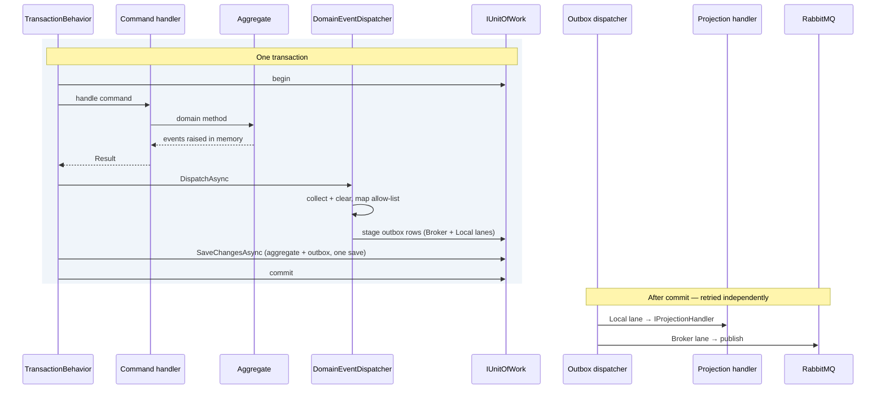

# 7. Persistence

## 7.1 Database per service

Each service owns a SQL Server database. No shared tables, no cross-database
joins, no views into another service's data, no shared read-only user.

For smaller deployments, one SQL Server instance hosting six databases is
acceptable — the isolation that matters is logical. Physical separation is a
scaling and blast-radius decision that can be made later, because nothing in the
code depends on it. Using *schemas* within one shared database instead is the
option to avoid: it makes cross-schema joins possible, and something will
eventually write one.

Each service uses its own SQL login with permissions to its database only. This
turns principle 1 from a convention into something the database enforces.

### Two identities per database

One login is not enough. Each service database has **two** principals with
different rights, used by different processes:

| Identity | Used by | Rights | Rationale |
|---|---|---|---|
| **Runtime** | The API and worker pods | `SELECT`/`INSERT`/`UPDATE`/`DELETE` on business, outbox and inbox tables. **No DDL.** | The application never alters schema, so it should be unable to. A SQL injection flaw or a compromised pod cannot drop a table |
| **Migrator** | The `*.Migrator` job only | DDL on its own database | Elevated rights exist for the seconds the job runs, in a process with no network listener and no user input |

The role grants are the same either way; **how the principal is created is not**,
and the difference is the one that stops a copy-pasted script at the first
semicolon. Managed environments:

```sql
-- Azure SQL / SQL Server with Entra auth: the principal exists in the
-- directory, the database only maps to it. No password anywhere.
CREATE USER [ordering-runtime]  FROM EXTERNAL PROVIDER;
CREATE USER [ordering-migrator] FROM EXTERNAL PROVIDER;
```

Compose, the CI service container, and any SQL Server without a directory behind
it ([§14.1](14-local-development.md)):

```sql
-- Server-level login, then a database user mapped to it.
CREATE LOGIN [ordering-runtime]  WITH PASSWORD = '$(OrderingRuntimePassword)';
CREATE LOGIN [ordering-migrator] WITH PASSWORD = '$(OrderingMigratorPassword)';
GO
USE [Ordering];
CREATE USER [ordering-runtime]  FOR LOGIN [ordering-runtime];
CREATE USER [ordering-migrator] FOR LOGIN [ordering-migrator];
```

```sql
-- Identical from here, and the only part worth reviewing.
-- Runtime: data plane only.
ALTER ROLE db_datareader ADD MEMBER [ordering-runtime];
ALTER ROLE db_datawriter ADD MEMBER [ordering-runtime];

-- Migrator: schema plane, used by the pre-deploy job only.
ALTER ROLE db_ddladmin   ADD MEMBER [ordering-migrator];
ALTER ROLE db_datawriter ADD MEMBER [ordering-migrator];   -- for data backfills
```

> **Do not let local convenience collapse the two keys.** Locally there is one
> `sa` account — [§14.2](14-local-development.md) states the simplification
> and [§12.4](12-test-strategy.md)'s fixture applies
> it — so the *permission* boundary is a cloud-side control, exercised where
> the seeding script above runs. What every local environment exercises is the
> *name* boundary: the migrator reads `ConnectionStrings__OrderingMigrator`
> and the host reads `ConnectionStrings__Ordering`, exactly as in production,
> and the integration suite proves a migrator handed only the runtime key
> refuses to run. Collapsing the keys locally "because they point at the same
> login anyway" is the mistake this callout exists for: the first environment
> where the logins differ then discovers every host reading the wrong name.

This means **two connection strings per service**, held in different secrets and
mounted into different workloads. The migrator's secret is never present in an
API pod. Configuration shape:

```
ConnectionStrings__Ordering           → runtime identity  (API, workers)
ConnectionStrings__OrderingMigrator   → migrator identity (Job only)
```

The split costs one extra secret and pays for itself the first time someone
reviews what an application-tier compromise could actually reach.

## 7.2 EF Core for the write side

`DbContext` is an implementation detail of Infrastructure. Configuration lives
in `IEntityTypeConfiguration<T>` classes, never in attributes on domain types —
attributes would put an EF Core dependency in the Domain project.

```csharp
internal sealed class OrderConfiguration : IEntityTypeConfiguration<Order>
{
    public void Configure(EntityTypeBuilder<Order> builder)
    {
        builder.ToTable("Orders", "ordering");
        builder.HasKey(o => o.Id);

        builder
            .Property(o => o.Id)
            .HasConversion(id => id.Value, value => new OrderId(value))
            .ValueGeneratedNever();

        builder
            .Property(o => o.CustomerId)
            .HasConversion(id => id.Value, value => new CustomerId(value));

        builder
            .Property(o => o.Status)
            .HasConversion<string>()
            .HasMaxLength(32);

        // Value object mapped as a complex type — columns on the same table,
        // no identity, exactly matching the domain semantics.
        builder.ComplexProperty(
            o => o.ShippingAddress,
            address =>
            {
                address.Property(a => a.Line1).HasColumnName("ShipToLine1").HasMaxLength(200);
                address.Property(a => a.Line2).HasColumnName("ShipToLine2").HasMaxLength(200);
                address.Property(a => a.City).HasColumnName("ShipToCity").HasMaxLength(100);
                address.Property(a => a.PostalCode).HasColumnName("ShipToPostalCode").HasMaxLength(20);
                address.Property(a => a.Country).HasColumnName("ShipToCountry").HasMaxLength(2);
            });

        // A related entity rather than an owned collection, and the reason is
        // ComplexProperty: an owned-collection builder does not offer it, so
        // Money on a line would have to be mapped a second way — two spellings
        // of one value object in one file, which is the drift this chapter's
        // convention block exists to prevent. The aggregate boundary is kept by
        // what is absent instead: no DbSet<OrderLine> on the context, and
        // OrderLine's factory internal to the domain assembly, so a line cannot
        // be reached or made except through Order. Reachability is the rule; the
        // mapping construct is one implementation of it.
        builder
            .HasMany(o => o.Lines)
            .WithOne()
            .HasForeignKey("OrderId")
            .IsRequired()
            .OnDelete(DeleteBehavior.Cascade);

        // Backing field, not the public read-only property.
        builder
            .Navigation(o => o.Lines)
            .HasField("_lines")
            .UsePropertyAccessMode(PropertyAccessMode.Field);

        // Optimistic concurrency — SQL Server maintains this automatically.
        builder.Property(o => o.Version).IsRowVersion();

        builder.HasIndex(o => o.CustomerId);
        builder.HasIndex(o => new { o.Status, o.PlacedAt });

        builder.Ignore(o => o.DomainEvents);
        builder.Ignore(o => o.Total);       // Computed, not stored.
    }
}
```

The line's own mapping is a second `IEntityTypeConfiguration`, which is what
the related-entity decision above costs — an owned collection would have been
configured inline:

```csharp
internal sealed class OrderLineConfiguration : IEntityTypeConfiguration<OrderLine>
{
    public void Configure(EntityTypeBuilder<OrderLine> builder)
    {
        builder.ToTable("OrderLines", "ordering");
        builder.HasKey(l => l.Id);

        builder
            .Property(l => l.Id)
            .HasConversion(id => id.Value, value => new OrderLineId(value))
            .ValueGeneratedNever();

        builder.ComplexProperty(
            l => l.UnitPrice,
            money =>
            {
                money.Property(m => m.Amount).HasColumnName("UnitPriceAmount").HasPrecision(19, 4);
                money.Property(m => m.Currency).HasColumnName("UnitPriceCurrency").HasMaxLength(3);
            });

        builder.Ignore(l => l.LineTotal);   // UnitPrice * Quantity, derived on read.
        builder.HasIndex("OrderId");
    }
}
```

Global conventions cover what would otherwise be repeated in every file:

```csharp
// The parameter name is the base declaration's, not a shorter one. CA1725
// makes a rename an error under ADR-019's TreatWarningsAsErrors, which is a
// good rule here and not a formality: a caller reading the framework's own
// documentation for ConfigureConventions is reading about
// `configurationBuilder`.
protected override void ConfigureConventions(ModelConfigurationBuilder configurationBuilder)
{
    configurationBuilder.Properties<decimal>().HavePrecision(19, 4);
    configurationBuilder.Properties<string>().HaveMaxLength(400);
    configurationBuilder.Properties<DateTimeOffset>().HaveColumnType("datetimeoffset(7)");
}
```

Unbounded `NVARCHAR(MAX)` columns are a common and avoidable source of both
storage bloat and index limitations; defaulting `string` to a bounded length
turns "someone forgot" into a compile-time-visible override.

## 7.3 Concurrency

Optimistic concurrency is the default and is enough for most aggregates. The
`rowversion` column means a stale write throws `DbUpdateConcurrencyException`,
which the API translates to `409 Conflict`.

Inventory is the exception. Stock reservation is genuinely contended — the same
SKU may be reserved by many concurrent orders — and optimistic retry loops
degrade badly under that load. There, use a targeted pessimistic update:

```sql
UPDATE inventory.StockItems
SET Available = Available - @Quantity, Reserved = Reserved + @Quantity, UpdatedAt = SYSDATETIMEOFFSET()
OUTPUT inserted.Available
WHERE ProductId = @ProductId
    AND Available >= @Quantity;
```

The `WHERE Available >= @Quantity` makes the check and the decrement a single
atomic statement. If it affects zero rows, there was not enough stock — no read,
no race, no retry loop.

## 7.4 Migrations

### What EF generates, and what you write by hand

Two kinds of table live in a service database, and they are authored
differently:

| Kind | Examples | Authored by |
|---|---|---|
| **Write model** | `Orders`, `OrderLines` | The EF model. `IEntityTypeConfiguration<T>` (§7.2) is the source of truth; `dotnet ef migrations add` produces the DDL |
| **Read models and technical tables** | `OrderSummaries`, `ProductPrices`, `OutboxMessages`, `InboxMessages`, `OrderReviews` | Hand-written DDL, because they are shaped for queries and index plans rather than for objects |

That is why [§6.6](06-cqrs.md) and [§9.4](09-messaging.md) show `CREATE TABLE` and §7.2 does not — the write
model's schema is a projection of the aggregate, and duplicating it as SQL would
create two definitions that drift.

**Both kinds ship in the same EF migration.** There is no second mechanism: the
migrator job runs `Database.Migrate()` and nothing else, so hand-written DDL
that is not inside a migration never executes.

```csharp
public partial class AddOrderSummaries : Migration
{
    protected override void Up(MigrationBuilder migrationBuilder)
    {
        // EF-generated operations for write-model changes appear here.

        // Hand-written DDL rides along, in the same transaction, applied by
        // the same job, versioned by the same migration history.
        migrationBuilder.Sql(
            """
            CREATE TABLE ordering.OrderSummaries ( /* §6.6 */ );
            CREATE INDEX IX_OrderSummaries_Customer_PlacedAt ...;
            """);
    }
}
```

`OrderFulfilmentStates` (§9.6) is the one table in both categories: MassTransit's
EF saga repository maps it, so EF can generate it — but the DDL is shown
explicitly because the alert in [§13.6](13-observability.md) and the stuck-saga runbook both query it
directly, and an index nobody declared is an index nobody has.

> **Decision — migrations never run at application startup.** See [ADR-007](appendix-a-adrs.md#adr-007--migrations-as-a-pre-deploy-job).

`Database.Migrate()` in `Program.cs` seems convenient and fails in exactly the
situations that matter: with three replicas starting simultaneously, three
processes race to apply the same migration; with a rolling deploy, old and new
code run against a half-migrated schema; and the application's runtime identity
needs DDL permissions it should not have.

Instead migrations run as a distinct step that must complete before new pods
receive traffic:

```yaml
apiVersion: batch/v1
kind: Job
metadata:
  name: ordering-migrate-{{ .Values.image.tag }}
  annotations:
    "helm.sh/hook": pre-install,pre-upgrade
    "helm.sh/hook-weight": "-5"
    "helm.sh/hook-delete-policy": before-hook-creation
spec:
  backoffLimit: 2
  template:
    spec:
      restartPolicy: Never
      containers:
        - name: migrate
          image: "{{ .Values.image.registry }}/{{ .Values.image.migrator }}:{{ .Values.image.tag }}"
          env:
            # The MIGRATOR identity (DDL), not the runtime one — §7.1.
            # This secret is mounted only here, never into an API pod.
            - name: ConnectionStrings__OrderingMigrator
              valueFrom:
                secretKeyRef:
                  name: ordering-migrator-secret
                  key: connection-string
```

Because migrations and application code deploy separately, **every migration
must be backward compatible with the currently running version**. Renaming a
column is therefore a multi-release operation: add the new column, write to
both, backfill, switch reads, stop writing the old one, drop it — one release
per step. This is tedious and it is the price of zero-downtime deploys.

## 7.5 The unit of work and domain event dispatch

**This section is the single normative description of how a domain event becomes
an integration event.** §6.3 shows where it is invoked and §9.3 shows the
translation rules; neither describes a separate mechanism.

Domain events are dispatched inside the transaction that persists the state
change, *after* the handler has finished mutating aggregates and *before*
`SaveChanges` — so that the outbox rows they produce commit atomically with the
state that raised them. **Dispatch stages rows; it runs no handlers** (ADR-018).
Nothing reacts to a domain event until the dispatcher picks that row up after
the commit.

The whole flow, and the only one this document describes: collect → map through
the §9.3 allow-list → stage `Broker` and `Local` outbox rows → one
`SaveChanges` → post-commit reaction driven by §9.4. An in-process handler
writing into the same save is exactly what ADR-018 rejects, because it is how a
transaction acquires a second aggregate, a second service's data, or a deadlock
that only appears under load.

### The collector port

The dispatcher needs to know which aggregates changed, which is EF Core's
change tracker — an Infrastructure concern. Application sees only a port:

```csharp
namespace Common.Application;

public interface IDomainEventCollector
{
    /// <summary>
    /// Returns the domain events raised by every tracked aggregate and clears
    /// them, so a second call after re-entrant work returns only new events.
    /// </summary>
    IReadOnlyList<IDomainEvent> CollectAndClear();
}
```

```csharp
namespace Ordering.Infrastructure.Persistence;

internal sealed class EfDomainEventCollector(OrderingDbContext db) : IDomainEventCollector
{
    public IReadOnlyList<IDomainEvent> CollectAndClear()
    {
        IHasDomainEvents[] aggregates =
        [
            .. db.ChangeTracker
                .Entries<IHasDomainEvents>()
                .Where(e => e.Entity.DomainEvents.Count > 0)
                .Select(e => e.Entity)
        ];

        IDomainEvent[] events = [.. aggregates.SelectMany(a => a.DomainEvents)];

        // Cleared as they are collected, so a nested dispatch (§6.3's
        // HasActiveTransaction path) sees only events raised since the last
        // call rather than staging these a second time.
        foreach (IHasDomainEvents aggregate in aggregates)
            aggregate.ClearDomainEvents();

        return events;
    }
}
```

### The dispatcher

```csharp
namespace Common.Application;

public interface IDomainEventDispatcher
{
    /// <summary>
    /// Collects raised domain events and stages outbox rows for them — the
    /// allow-listed ones on the Broker lane, those with projection handlers on
    /// the Local lane. Runs no handlers. Called by TransactionBehavior inside
    /// the transaction, before SaveChanges.
    /// </summary>
    Task DispatchAsync(CancellationToken ct);
}

/// <summary>
/// Answers whether an event type has any registered projection handler, so the
/// dispatcher does not stage Local rows nobody will consume.
/// </summary>
public interface IProjectionRegistry
{
    bool HasHandler(IDomainEvent domainEvent);
}

/// <summary>The memo, a singleton, so its lifetime is the container's.</summary>
internal sealed class ProjectionRegistryCache
{
    public ConcurrentDictionary<Type, bool> HasHandler { get; } = new();
}

internal sealed class ProjectionRegistry(IServiceProvider services, ProjectionRegistryCache cache)
    : IProjectionRegistry
{
    // Derived from the DI container rather than a hand-maintained list, so it
    // cannot drift from what is actually registered (§6.2).
    public bool HasHandler(IDomainEvent domainEvent) =>
        cache.HasHandler.GetOrAdd(
            domainEvent.GetType(),
            type => services.GetServices(typeof(IProjectionHandler<>).MakeGenericType(type)).Any());
}

internal sealed class DomainEventDispatcher(
    IDomainEventCollector collector,
    IIntegrationEventMapper mapper,
    IIntegrationEventPublisher publisher,
    IProjectionRegistry projections)
    : IDomainEventDispatcher
{
    public async Task DispatchAsync(CancellationToken ct)
    {
        IReadOnlyList<IDomainEvent> events = collector.CollectAndClear();
        if (events.Count == 0)
            return;

        // Broker lane: allow-listed events become integration events (§9.3).
        foreach (object integrationEvent in mapper.Map(events))
            await publisher.StageAsync(integrationEvent, OutboxLane.Broker, ct);

        // Local lane: events with a registered projection handler are staged
        // too, so the projection survives a crash immediately after commit.
        foreach (IDomainEvent domainEvent in events.Where(projections.HasHandler))
            await publisher.StageAsync(domainEvent, OutboxLane.Local, ct);
    }
}
```

Deriving the registry from the container matters: a `Local` row is staged
**only** when a handler is registered, and §9.4 throws if a staged `Local` row
then finds none. The two checks read the same source, so a handler that is
implemented but unregistered fails at the first assertion rather than becoming
an invisible no-op.

> **`ProjectionRegistry` must be registered scoped**, not singleton. Handlers are
> scoped (§6.2), and `GetServices` for a scoped service from the root provider
> throws *"Cannot resolve scoped service from root provider"*. The cache is safe
> across scopes because DI registrations do not change at runtime — it memoises
> a question about the container's shape, not about any instance.
>
> **Which is exactly why it is a singleton and not a `static` field.** That
> reasoning holds for one container and fails for a process holding several:
> two `WebApplicationFactory` hosts in one test assembly, or a host beside a
> bare `ServiceCollection`, would share whichever answer was computed first. A
> suite proving that an event with no handler stages no `Local` row would then
> poison the suite proving that one with a handler does, in whichever order
> they happened to run. Keyed to the container, the memo still answers a
> question about registrations — which is the property that made it safe.

Both implementations are internal to `Common.Application`, so a service cannot
write those two lines itself — the registration is an extension method, on the
same terms as §6.2's `AddDispatcher()`:

```csharp
// Common.Application, called by AddOrderingApplication (§4.2).
public IServiceCollection AddDomainEventDispatcher()
{
    // Singleton, and the one lifetime here that is not obvious: the memo is
    // keyed to the container rather than to the scope that first asked. A
    // static field would answer for the process, so a second host in the same
    // test assembly would inherit the first one's answer about registrations
    // it does not have.
    services.AddSingleton<ProjectionRegistryCache>();
    services.AddScoped<IProjectionRegistry, ProjectionRegistry>();
    services.AddScoped<IDomainEventDispatcher, DomainEventDispatcher>();
    return services;
}
```

**The dispatcher performs no I/O beyond staging rows.** It does not invoke a
single handler. That is the change that makes the rest of the design safe.

### Nothing reacts inside the transaction

> **Decision — all reactions to a domain event happen after commit, driven by
> the outbox. Nothing subscribes to a domain event inside the transaction.** See
> [ADR-018](appendix-a-adrs.md#adr-018--reactions-happen-after-commit).

The tempting alternative is to run projection handlers in-process before
`SaveChanges`, so the projection commits atomically with the aggregate. It
fails in three ways, and the third is the one that hurts:

1. **A projection that writes on its own connection is a second transaction.**
   It can commit while the aggregate rolls back — leaving a summary row for an
   order that does not exist — or the reverse.
2. **A projection that writes on the *same* `DbContext` is atomic but not
   retryable.** If the projection has a bug, the command fails. A read model
   defect becomes a write-path outage.
3. **Either version deadlocks.** The handler queries and updates the same tables
   the outer transaction still holds locks on, at exactly the moment those locks
   are held. It works under test and fails under load.

Staging to the outbox and reacting after commit costs a few milliseconds of
staleness and buys durability, independent retry, and no lock contention. The
read model was already eventually consistent ([§2.4](02-architecture-at-a-glance.md)); this makes the lag explicit
rather than pretending it is zero.

### The ordered flow



Stated as rules:

1. Aggregates raise domain events in memory and perform **no I/O**.
2. Command handlers never read `DomainEvents` and never publish anything.
3. `TransactionBehavior` calls the dispatcher **once**, after the handler
   returns successfully and before `SaveChanges`.
4. The dispatcher only **stages outbox rows** — allow-listed events to the
   broker lane (§9.3), events with projection handlers to the local lane.
5. `SaveChangesAsync` persists aggregate changes and outbox rows in **one**
   save; the commit makes both durable together.
6. **Everything else happens after commit**, driven by the outbox dispatcher
   (§9.4) and retried independently of the command that caused it.

Two designs are deliberately rejected:

**No `PendingDomainEvent` table populated by a `SaveChanges` interceptor.** The
interceptor necessarily runs *during* `SaveChanges`, which is too late to
influence that same save, and it duplicates what the outbox already does.

**No in-process domain event handlers.** Domain events are transient signals
within a transaction; the only thing that may consume one is the outbox, which
persists it. If something needs to react, it reacts to a durable row after
commit — not to an in-memory object mid-transaction.

---

[← §6 CQRS](06-cqrs.md) · [Index](README.md) · [§8 Caching →](08-caching-redis.md)
