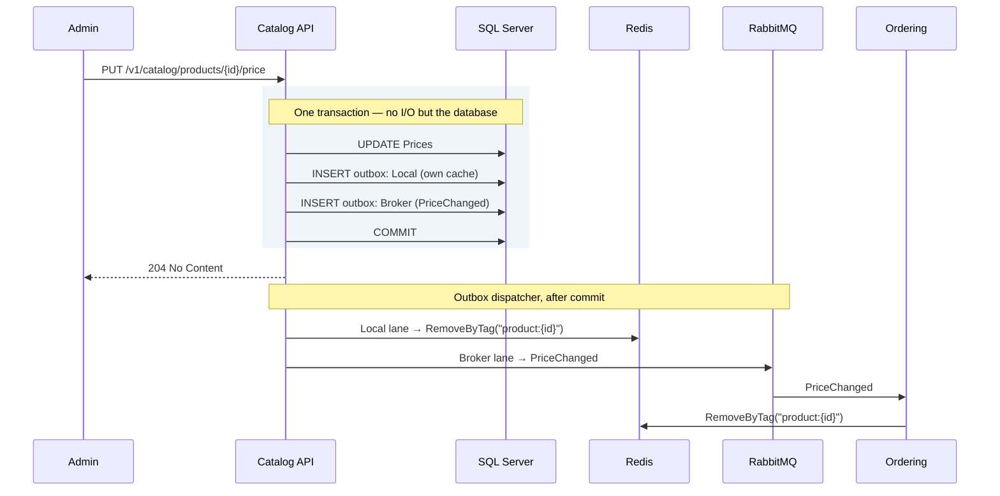

# 8. Caching with Redis

## 8.1 What Redis is used for

Redis serves four distinct purposes here. They are worth separating because
they have different failure semantics.

| Use | Pattern | If Redis is unavailable |
|---|---|---|
| Read-through cache | `HybridCache` over query results | Degrade to database; slower but correct |
| Idempotency keys | `SET key NX EX` | **Fail the request** — correctness depends on it |
| Distributed lock | `SET key NX PX` + token-checked release | Fail the operation; do not proceed unlocked |
| Rate limiting | Sliding window counter — **not built in v1** ([§10.3](10-api-gateway.md)) | Fail open or closed — an explicit policy decision |

Only the first tolerates Redis being down. Conflating them behind a single
"cache is optional" assumption produces duplicate charges the first time Redis
restarts.

The fourth row is here as a reserved keyspace rather than a description of
running code: the gateway limits in process, per replica. It is listed because
the decision of *which instance* a shared counter would use is the one worth
recording in advance — coordination, not cache — and because a `{service}:
ratelimit:` key appearing on the cache instance later would look reasonable and
be silently evictable.

### Eviction policy couples them — separate the keyspaces

This is the subtle one, and it is the reason the four uses need more than a
naming convention between them.

A cache instance is normally configured `maxmemory-policy allkeys-lru`, so that
memory pressure silently evicts cold entries. That policy applies to the
**entire keyspace** — including your distributed locks and your token denylist.
Under load, Redis will happily evict a held lock, and two workers will then both
believe they own it. A revoked token will quietly become valid again.

The failure has no error, no log line, and appears only under the memory
pressure that makes it hardest to reproduce.

| Keyspace | Eviction policy | Placement |
|---|---|---|
| `{service}:cache:` | `allkeys-lru` — eviction is the point | Shared cache instance |
| `{service}:lock:` | **`noeviction`** | Separate instance |
| `{service}:idem:` | **`noeviction`** | With the locks |
| `{service}:denylist:` | **`noeviction`** | With the locks |
| `{service}:ratelimit:` | `volatile-ttl` acceptable | Either |

A separate DB index on the shared instance is **not** an isolation option,
though it looks like one: `maxmemory-policy` is a server-level setting, every
database on an instance shares it, and a lock in DB 1 is exactly as evictable
as the cache in DB 0. Isolation means a second instance — which is what
§14.1's Compose file runs and §14.2's Aspire sample mirrors.

Production topology: a **shared Redis cluster with a per-service ACL user** and
a mandatory `{service}:` key prefix is the cost-effective default. What must
*not* be shared is the eviction policy between cache and coordination keys.

```
user ordering-svc on >REDACTED ~ordering:* +@read +@write +@keyspace -@dangerous
```

Two rules the helper library enforces rather than documents:

- **Every cache and lock key has a TTL.** A key without one is a memory leak
  with a slow fuse, and on a `noeviction` instance it eventually stops writes
  entirely. Enforced twice: `IDistributedLockFactory` refuses a non-positive
  duration before any I/O — there is no overload without one — and
  `AddRedisConnections`' HybridCache defaults (§8.2) give every entry an
  expiry.
- **No cross-service keys.** The ACL makes this impossible rather than
  discouraged, which is the right level of enforcement for something that
  otherwise gets violated once and never noticed. `RedisKeys` (§8.3) makes it
  unwritable as well: the prefix half of every key comes from
  `ApplicationName`, never from the call site.

## 8.2 HybridCache

.NET 9 introduced `HybridCache`, which supersedes hand-rolled
`IMemoryCache`+`IDistributedCache` combinations. It gives a two-tier cache (L1
in-process, L2 Redis) with **stampede protection** — concurrent misses for the
same key execute the factory once rather than N times.

Registered inside `AddRedisConnections` — the same helper that supplies the two
connections of §8.1 — rather than as a separate call somebody has to remember.
`PriceChangedCacheInvalidator` (§8.4) injects `HybridCache` and is registered by
the [§6.2](06-cqrs.md) scan, so an unregistered cache is a service that will not start:

```csharp
// Common.Infrastructure — called by each AddXInfrastructure (§4.2).
public static class DependencyInjection
{
    extension(IServiceCollection services)
    {
        public IServiceCollection AddRedisConnections(IConfiguration configuration)
        {
            // §8.1's two keyed IConnectionMultiplexer registrations — cache
            // and coordination, separate because the eviction policies cannot
            // be shared. Both connection strings are read eagerly, so a host
            // missing one fails at startup rather than at the first miss.

            // The CACHE connection (allkeys-lru); coordination keys use the
            // other. The factory hands the cache its keyed multiplexer — one
            // connection per instance, and the traced connection is then the
            // one the cache actually uses, not a private third.
            services.AddStackExchangeRedisCache(_ => { });
            services
                .AddOptions<RedisCacheOptions>()
                .Configure<IServiceProvider>((options, provider) =>
                {
                    // The §8.1 key prefix, spelled once, in RedisKeys (§8.3) —
                    // whose source is ApplicationName, the same single source
                    // §8.5 uses for idempotency keys. A literal here is a
                    // second place the service name lives (§15.4), and the two
                    // drift silently: §8.1's per-service ACL denies writes to
                    // a prefix the service does not own, so the symptom is a
                    // cache that never populates rather than an error naming
                    // the prefix.
                    options.InstanceName = provider.GetRequiredService<RedisKeys>().CacheInstanceName;
                    options.ConnectionMultiplexerFactory = () =>
                        Task.FromResult(provider.GetRequiredKeyedService<IConnectionMultiplexer>(RedisConnections.Cache));
                });

            services.AddHybridCache(options =>
            {
                options.DefaultEntryOptions = new HybridCacheEntryOptions
                {
                    Expiration = TimeSpan.FromMinutes(10),            // L2, Redis
                    LocalCacheExpiration = TimeSpan.FromMinutes(1)    // L1, in-process
                };
                options.MaximumPayloadBytes = 1024 * 1024;
            });

            // §13.2's Redis tracing lands here too, with both keyed
            // connections handed to it — the parameterless overload discovers
            // only an unkeyed multiplexer, which is why the call cannot live
            // in Common.Web. RedisKeys and the lock factory of §8.1 register
            // beside it; the full wiring is in the source.

            return services;
        }
    }
}
```

The short L1 expiry bounds how long one instance can serve data another instance
has already invalidated. One minute of possible staleness across instances is
usually an acceptable trade for eliminating most Redis round trips; adjust with
the domain in mind.

```csharp
public sealed class GetProductDetailHandler(HybridCache cache, IDbConnectionFactory connections)
    : IQueryHandler<GetProductDetailQuery, ProductDetailDto?>
{
    public async Task<ProductDetailDto?> HandleAsync(GetProductDetailQuery query, CancellationToken ct) =>
        await cache.GetOrCreateAsync(
            $"product:{query.ProductId}:v2",
            query,
            static async (q, token) =>
            {
                using IDbConnection connection = connections.Create();
                return await connection.QuerySingleOrDefaultAsync<ProductDetailDto>(ProductSql, new { q.ProductId });
            },
            tags: [$"product:{query.ProductId}", "catalog"],
            cancellationToken: ct);
}
```

The `static` lambda with the state parameter avoids allocating a closure per
call — a small thing that matters on a hot path.

## 8.3 Key naming

A convention, and the important thing about it is that **a call site writes only
half the key**. `RedisCacheOptions.InstanceName` (§8.2) contributes the
`{service}:cache:` prefix §8.1's keyspace table requires; the handler passes the
rest. Reading the two halves as one string is how a "cache key" ends up written
without the `cache:` segment and therefore outside the keyspace whose eviction
policy was the whole argument of §8.1:

```
{service}:cache:  {entity}:{id}:v{schema-version}
└── InstanceName  └── what the call site passes to HybridCache

catalog:cache:product:0195e4b2-...:v2
catalog:cache:product:0195e4b2-...:pricing:v1
ordering:cache:customer:0195e4c1-...:summaries:head:v1
```

So §8.2's handler passes `product:{id}:v2` and the key in Redis is
`catalog:cache:product:{id}:v2`. The helper exists to keep that true: a literal
prefix at a call site produces `catalog:catalog:cache:...` or, worse, a key that
skips the prefix entirely and is denied by the §8.1 ACL — which fails as a cache
that never populates rather than as an error naming the key.

The coordination namespaces get the same rule from `RedisKeys`, registered by
§8.2's helper: `Lock(name)`, `Idempotency(suffix)` and `Denylist(suffix)` each
return the full key with the `ApplicationName` prefix, so a call site cannot
write the wrong half because it never writes that half at all. The type has
deliberately **no `Cache(string)` method**: cache keys are prefixed by
`InstanceName` above, and a full-key builder would double-prefix the moment
somebody passed its result to `HybridCache` — it exposes the instance-name
string instead, so `:cache:` is spelled in exactly one place.

The trailing schema version is the important part of the half you do write: when
a DTO's shape changes, bump the version and old entries become unreachable and
expire naturally. Without it, a deploy that changes a cached type causes
deserialisation failures across the fleet until the TTL drains.

## 8.4 Invalidation

Cache invalidation is driven by events, never by timers alone.



**Catalog's own invalidation goes through the local outbox lane, not an inline
call after commit.** That is ADR-018: a `RemoveByTag` issued directly by the
handler is unretryable, so a process that dies between commit and the call
leaves a stale cache with nothing to fix it. Staged as a `Local` row, it gets
the same durability, retry accounting and alerting as everything else the
outbox carries.

Remote invalidation flows through the `Broker` lane as an ordinary integration
event. Both are needed — the local row keeps the writing service consistent
with itself, the event keeps every other service consistent shortly after — and
now both are the same mechanism.

This one lives in **Ordering** — a consumer of Catalog's event, invalidating
its own cached projections of Catalog data. It is the second of two handlers
Ordering registers for `PriceChanged`; the other is `ProductPriceProjection`
(§6.6), which updates the price table the write path reads. Both run through
the same `IntegrationEventConsumer<PriceChanged>` ([§9.4](09-messaging.md)), sequentially:

```csharp
namespace Ordering.Infrastructure.Caching;

public sealed class PriceChangedCacheInvalidator(HybridCache cache)
    : IIntegrationEventHandler<PriceChanged>
{
    public Task HandleAsync(PriceChanged e, CancellationToken ct) =>
        cache.RemoveByTagAsync($"product:{e.ProductId}", ct).AsTask();
}
```

## 8.5 Idempotency keys

Every non-idempotent write command carries a client-generated `CommandId`, and
the key is claimed atomically before any work happens.

**It is a field on the command, not an `Idempotency-Key` header**, and the
reason is the dependency rule rather than taste. `IdempotencyBehavior` runs in
`Common.Application`, which knows nothing about HTTP ([§4.2](04-solution-structure.md)) — it cannot read a
header, so the value has to be on the command by the time the pipeline sees
it. `PlaceOrderCommand` ([§6.2](06-cqrs.md)) declares it as its first field for
that reason.

A service that wants the REST convention can still have it: an endpoint may
bind `Idempotency-Key` into `CommandId` at the boundary, which is the only
layer permitted to know either name. Nothing in this document does, so no
endpoint here reads a header — the request body carries the value.

The behaviour lives in `Common.Application`, so — exactly as with
`IUnitOfWork` in §6.3 — it must not reference `StackExchange.Redis`. [§4.2](04-solution-structure.md) names
that package as forbidden and the architecture test enforces it. The store is a
port:

```csharp
namespace Common.Application;

public interface IIdempotencyStore
{
    /// <summary>Atomically claims the key. False if it is already held.</summary>
    Task<bool> TryClaimAsync(string key, TimeSpan retention, CancellationToken ct);

    Task<IdempotencyEntry?> GetAsync(string key, CancellationToken ct);
    Task CompleteAsync(string key, string payload, TimeSpan retention, CancellationToken ct);
    Task ReleaseAsync(string key, CancellationToken ct);
}

public sealed record IdempotencyEntry(bool InProgress, string? Payload);

/// <summary>
/// Opts a command into IdempotencyBehavior. Not an empty marker: the behaviour
/// reads CommandId to build its key, so the interface has to carry it.
///
/// The behaviour is constrained to this, which means a command that does not
/// declare it is simply never protected — no error, no warning, and a retry
/// creates a second order. Opting in is a decision; forgetting to is not
/// meant to look like one.
/// </summary>
public interface IIdempotentCommand
{
    Guid CommandId { get; }
}
```

```csharp
public sealed class IdempotencyBehavior<TCommand, TResult>(IIdempotencyStore store)
    : IPipelineBehavior<TCommand, TResult>
    where TCommand : ICommand<TResult>, IIdempotentCommand
{
    private static readonly TimeSpan Retention = TimeSpan.FromHours(24);

    public async Task<TResult> HandleAsync(TCommand command, NextDelegate<TResult> next, CancellationToken ct)
    {
        // Key shape only — the store owns the service prefix and namespace.
        string key = $"{typeof(TCommand).Name}:{command.CommandId}";

        if (!await store.TryClaimAsync(key, Retention, ct))
        {
            IdempotencyEntry? existing = await store.GetAsync(key, ct);

            if (existing is null || existing.InProgress)
                throw new ConcurrentRequestException(command.CommandId);

            return JsonSerializer.Deserialize<TResult>(existing.Payload!)!;
        }

        try
        {
            TResult result = await next();
            await store.CompleteAsync(key, JsonSerializer.Serialize(result), Retention, ct);
            return result;
        }
        catch
        {
            // Release the claim so the caller may legitimately retry.
            await store.ReleaseAsync(key, ct);
            throw;
        }
    }
}
```

The Redis implementation lives in Infrastructure and is where the two §8.1
constraints are satisfied — §8.3's `RedisKeys` supplies the `{service}:idem:`
prefix the ACL requires, and the **coordination** connection rather than the
cache connection, because idempotency keys must never be evicted:

```csharp
namespace Ordering.Infrastructure.Idempotency;

internal sealed class RedisIdempotencyStore(
    [FromKeyedServices(RedisConnections.Coordination)] IConnectionMultiplexer redis,
    RedisKeys keys)
    : IIdempotencyStore
{
    // keys.Idempotency(...) is {service}:idem:... — the ACL pattern
    // ~ordering:* from §8.1, prefixed from ApplicationName. Why that source
    // and no other is argued at RedisKeys (§8.3): it is also what §13.2
    // stamps on every trace, and a second source would let the Redis prefix
    // and the telemetry label disagree.
    public async Task<bool> TryClaimAsync(string key, TimeSpan retention, CancellationToken ct) =>
        await redis.GetDatabase().StringSetAsync(keys.Idempotency(key), InProgressMarker, retention, When.NotExists);

    // GetAsync / CompleteAsync / ReleaseAsync follow the same key shaping.
}
```

A behaviour constrained on a marker fails open: the command still executes, just
unprotected. That is the same silent shape as an unregistered handler (§6.2), so
it gets the same kind of test — one that reads intent from the shape of the
command rather than trusting the author to have opted in:

```csharp
[Fact]
public void Commands_carrying_a_CommandId_declare_IIdempotentCommand()
{
    IEnumerable<string> offenders = typeof(PlaceOrderCommand).Assembly
        .GetTypes()
        .Where(t =>
            t.GetInterfaces().Any(i =>
                i.IsGenericType && i.GetGenericTypeDefinition() == typeof(ICommand<>)))
        .Where(t => t.GetProperty("CommandId") is not null)
        .Where(t => !typeof(IIdempotentCommand).IsAssignableFrom(t))
        .Select(t => t.Name);

    offenders.ShouldBeEmpty(
        "a CommandId with no IIdempotentCommand is a command that looks protected " +
        "and is not — IdempotencyBehavior is constrained on the interface, not the field.");
}
```

> **Two connections, not one.** The cache multiplexer points at the instance
> running `allkeys-lru`; the coordination multiplexer points at the
> `noeviction` instance holding locks, idempotency keys and the denylist.
> Registering them as keyed services makes picking the wrong one a visible
> choice rather than an invisible default. This is the §8.1 rule expressed in
> wiring instead of prose.

## 8.6 Rules and traps

- **Cache read models, never aggregates.** A cached aggregate that someone
  mutates is a corruption bug that reproduces once a week.
- **Never make Redis the system of record.** It is a cache and a coordination
  primitive. Anything that must survive is in SQL Server.
- **Set an expiry on every key.** A key without a TTL is a memory leak with a
  slow fuse.
- **Do not cache per-user data under a shared key.** The classic incident: one
  customer sees another's basket.
- **Watch the payload size.** `MaximumPayloadBytes` exists because serialising
  large objects through Redis can be slower than the query it replaced.

---

[← §7 Persistence](07-persistence.md) · [Index](README.md) · [§9 Messaging →](09-messaging.md)
