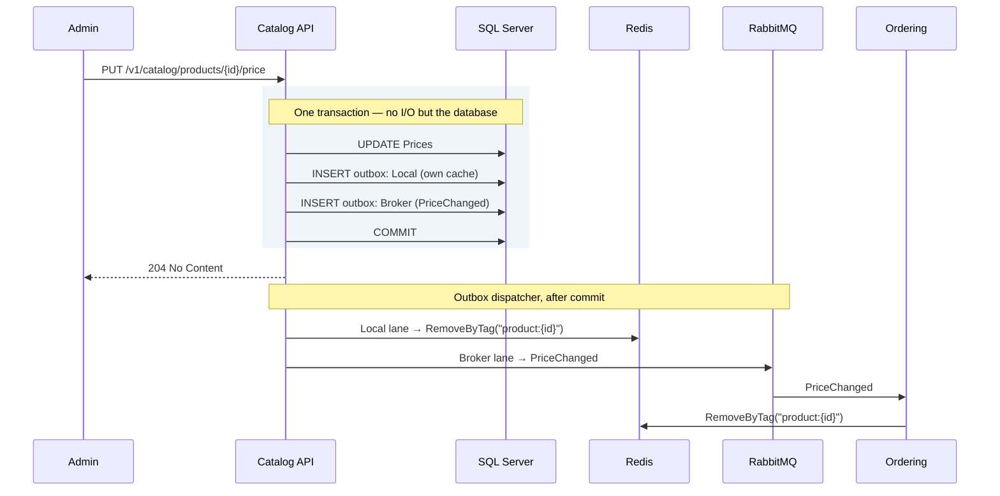

# 8. Caching with Redis

## 8.1 What Redis is used for

Redis serves four distinct purposes here. They are worth separating because
they have different failure semantics.

| Use | Pattern | If Redis is unavailable |
|---|---|---|
| Read-through cache | `HybridCache` over query results | Degrade to database; slower but correct |
| Idempotency keys | `SET key NX EX` | **Fail the request** — correctness depends on it |
| Distributed lock | `SET key NX PX` + token-checked release | Fail the operation; do not proceed unlocked |
| Rate limiting | Sliding window counter — **not built in v1** ([§10.3](10-api-gateway.md)) | Fail open or closed — an explicit policy decision |

Only the first tolerates Redis being down. Conflating them behind a single
"cache is optional" assumption produces duplicate charges the first time Redis
restarts.

The fourth row is here as a reserved keyspace rather than a description of
running code: the gateway limits in process, per replica. It is listed because
the decision of *which instance* a shared counter would use is the one worth
recording in advance — coordination, not cache — and because a `{service}:
ratelimit:` key appearing on the cache instance later would look reasonable and
be silently evictable.

### Eviction policy couples them — separate the keyspaces

This is the subtle one, and it is the reason the four uses need more than a
naming convention between them.

A cache instance is normally configured `maxmemory-policy allkeys-lru`, so that
memory pressure silently evicts cold entries. That policy applies to the
**entire keyspace** — including your distributed locks and your token denylist.
Under load, Redis will happily evict a held lock, and two workers will then both
believe they own it. A revoked token will quietly become valid again.

The failure has no error, no log line, and appears only under the memory
pressure that makes it hardest to reproduce.

| Keyspace | Eviction policy | Placement |
|---|---|---|
| `{service}:cache:` | `allkeys-lru` — eviction is the point | Shared cache instance |
| `{service}:lock:` | **`noeviction`** | Separate instance |
| `{service}:idem:` | **`noeviction`** | With the locks |
| `{service}:denylist:` | **`noeviction`** | With the locks |
| `{service}:ratelimit:` | `volatile-ttl` acceptable | Either |

A separate DB index on the shared instance is **not** an isolation option,
though it looks like one: `maxmemory-policy` is a server-level setting, every
database on an instance shares it, and a lock in DB 1 is exactly as evictable
as the cache in DB 0. Isolation means a second instance — which is what
§14.1's Compose file runs and §14.2's Aspire sample mirrors.

Production topology: **two shared Redis deployments — cache and coordination —
each with a per-service ACL user** and a mandatory `{service}:` key prefix are
the cost-effective default. Two, not one, because the paragraph above is as
true of a cluster as of an instance: `maxmemory-policy` is deployment-wide, so
a single shared cluster cannot run `allkeys-lru` and `noeviction` at once.
What the services share is each deployment; what the two deployments never
share is the eviction policy.

`{service}` throughout this chapter is the host's `ApplicationName`,
**verbatim**: `RedisKeys` (§8.3) writes it into every key, and the ACL below
is provisioned from the same value, so the two cannot disagree. The examples
here show hosts whose `ApplicationName` is the bare lowercase service name —
a host deployed as `Ordering.Api` takes `~Ordering.Api:*`, and provisioning
any other spelling is the silent-ACL failure §8.2 describes.

```
user ordering-svc on >REDACTED ~ordering:* +@read +@write +@keyspace +@connection +eval -@dangerous +client|setname +client|setinfo
```

Three of those grants are easy to leave off, and the line above is the one a
Testcontainers test proves rather than a first guess. `+eval` because the
lock's token-checked release is a Lua script and `EVAL` sits in `@scripting`,
which none of the data categories include — under the shorter grant this line
used to print, every release threw and the lock stood until its TTL.
`+@connection` because the client library's handshake needs `PING` and its
kin before it carries a single command. And the two `+client|` subcommands
because `StackExchange.Redis` names its connection on connect and
`-@dangerous` takes `CLIENT` away wholesale — the subcommand grants give back
the two harmless ones.

Two rules the helper library enforces rather than documents:

- **Every cache and lock key has a TTL.** A key without one is a memory leak
  with a slow fuse, and on a `noeviction` instance it eventually stops writes
  entirely. Enforced twice: `IDistributedLockFactory` refuses a non-positive
  duration before any I/O — there is no overload without one — and
  `AddRedisConnections`' HybridCache defaults (§8.2) give every entry an
  expiry. The enforcement sits at the sanctioned seams, not around every
  conceivable write: a handler that injects `IDistributedCache` directly, or
  issues a raw `SET` on a keyed multiplexer, has stepped off the §8.2 path —
  the same move as raw SQL around the unit of work (§6.3), and review's to
  catch on the same terms.
- **No cross-service keys.** The ACL makes this impossible rather than
  discouraged, which is the right level of enforcement for something that
  otherwise gets violated once and never noticed. `RedisKeys` (§8.3) makes it
  unwritable as well: the prefix half of every key comes from
  `ApplicationName`, never from the call site.

## 8.2 HybridCache

.NET 9 introduced `HybridCache`, which supersedes hand-rolled
`IMemoryCache`+`IDistributedCache` combinations. It gives a two-tier cache (L1
in-process, L2 Redis) with **stampede protection** — concurrent misses for the
same key execute the factory once rather than N times.

Registered inside `AddRedisConnections` — the same helper that supplies the two
connections of §8.1 — rather than as a separate call somebody has to remember.
`PriceChangedCacheInvalidator` (§8.4) injects `HybridCache` and is registered by
the [§6.2](06-cqrs.md) scan, so an unregistered cache is a service that will not start:

```csharp
// Common.Infrastructure — called by each AddXInfrastructure (§4.2).
public static class DependencyInjection
{
    extension(IServiceCollection services)
    {
        public IServiceCollection AddRedisConnections(IConfiguration configuration)
        {
            // §8.1's two keyed IConnectionMultiplexer registrations — cache
            // and coordination, separate because the eviction policies cannot
            // be shared. Both connection strings are read eagerly, so a host
            // missing one fails at startup rather than at the first miss.

            // The CACHE connection (allkeys-lru); coordination keys use the
            // other. The factory hands the cache its keyed multiplexer — one
            // connection per instance, and the traced connection is then the
            // one the cache actually uses, not a private third.
            services.AddStackExchangeRedisCache(_ => { });
            services
                .AddOptions<RedisCacheOptions>()
                .Configure<IServiceProvider>((options, provider) =>
                {
                    // The §8.1 key prefix, spelled once, in RedisKeys (§8.3) —
                    // whose source is ApplicationName, the same single source
                    // §8.5 uses for idempotency keys. A literal here is a
                    // second place the service name lives (§15.4), and the two
                    // drift silently: §8.1's per-service ACL denies writes to
                    // a prefix the service does not own, so the symptom is a
                    // cache that never populates rather than an error naming
                    // the prefix.
                    options.InstanceName = provider.GetRequiredService<RedisKeys>().CacheInstanceName;
                    options.ConnectionMultiplexerFactory = () =>
                        Task.FromResult(
                            provider.GetRequiredKeyedService<IConnectionMultiplexer>(RedisConnections.Cache));
                });

            services.AddHybridCache(options =>
            {
                options.DefaultEntryOptions = new HybridCacheEntryOptions
                {
                    Expiration = TimeSpan.FromMinutes(10),            // L2, Redis
                    LocalCacheExpiration = TimeSpan.FromMinutes(1)    // L1, in-process
                };
                options.MaximumPayloadBytes = 1024 * 1024;
            });

            // §13.2's Redis tracing lands here too, with both keyed
            // connections handed to it — the parameterless overload discovers
            // only an unkeyed multiplexer, which is why the call cannot live
            // in Common.Web. RedisKeys and the lock factory of §8.1 register
            // beside it; the full wiring is in the source.

            return services;
        }
    }
}
```

The short L1 expiry bounds how long one instance can serve data another instance
has already invalidated. One minute of possible staleness across instances is
usually an acceptable trade for eliminating most Redis round trips; adjust with
the domain in mind.

```csharp
public sealed class GetProductDetailHandler(HybridCache cache, IDbConnectionFactory connections)
    : IQueryHandler<GetProductDetailQuery, ProductDetailDto?>
{
    public async Task<ProductDetailDto?> HandleAsync(GetProductDetailQuery query, CancellationToken ct) =>
        await cache.GetOrCreateAsync(
            $"product:{query.ProductId}:v2",
            query,
            static async (q, token) =>
            {
                using IDbConnection connection = connections.Create();
                return await connection.QuerySingleOrDefaultAsync<ProductDetailDto>(ProductSql, new { q.ProductId });
            },
            tags: [$"product:{query.ProductId}", "catalog"],
            cancellationToken: ct);
}
```

The `static` lambda with the state parameter avoids allocating a closure per
call — a small thing that matters on a hot path.

## 8.3 Key naming

A convention, and the important thing about it is that **a call site writes only
half the key**. `RedisCacheOptions.InstanceName` (§8.2) contributes the
`{service}:cache:` prefix §8.1's keyspace table requires; the handler passes the
rest. Reading the two halves as one string is how a "cache key" ends up written
without the `cache:` segment and therefore outside the keyspace whose eviction
policy was the whole argument of §8.1:

```
{service}:cache:  {entity}:{id}:v{schema-version}
└── InstanceName  └── what the call site passes to HybridCache

catalog:cache:product:0195e4b2-...:v2
catalog:cache:product:0195e4b2-...:pricing:v1
ordering:cache:customer:0195e4c1-...:summaries:head:v1
```

So §8.2's handler passes `product:{id}:v2` and the key in Redis is
`catalog:cache:product:{id}:v2`. The helper exists to keep that true: a literal
prefix at a call site produces `catalog:catalog:cache:...` or, worse, a key that
skips the prefix entirely and is denied by the §8.1 ACL — which fails as a cache
that never populates rather than as an error naming the key.

The coordination namespaces get the same rule from `RedisKeys`, registered by
§8.2's helper: `Lock(name)`, `Idempotency(suffix)` and `Denylist(suffix)` each
return the full key with the `ApplicationName` prefix, so a call site cannot
write the wrong half because it never writes that half at all. The type has
deliberately **no `Cache(string)` method**: cache keys are prefixed by
`InstanceName` above, and a full-key builder would double-prefix the moment
somebody passed its result to `HybridCache` — it exposes the instance-name
string instead, so `:cache:` is spelled in exactly one place.

The trailing schema version is the important part of the half you do write: when
a DTO's shape changes, bump the version and old entries become unreachable and
expire naturally. Without it, a deploy that changes a cached type causes
deserialisation failures across the fleet until the TTL drains.

## 8.4 Invalidation

Cache invalidation is driven by events, never by timers alone.



**Catalog's own invalidation goes through the local outbox lane, not an inline
call after commit.** That is ADR-018: a `RemoveByTag` issued directly by the
handler is unretryable, so a process that dies between commit and the call
leaves a stale cache with nothing to fix it. Staged as a `Local` row, it gets
the same durability, retry accounting and alerting as everything else the
outbox carries.

Remote invalidation flows through the `Broker` lane as an ordinary integration
event. Both are needed — the local row keeps the writing service consistent
with itself, the event keeps every other service consistent shortly after — and
now both are the same mechanism.

This one lives in **Ordering** — a consumer of Catalog's event, invalidating
its own cached projections of Catalog data. It is the second of two handlers
Ordering registers for `PriceChanged`; the other is `ProductPriceProjection`
(§6.6), which updates the price table the write path reads. Both run through
the same `IntegrationEventConsumer<PriceChanged>` ([§9.4](09-messaging.md)), sequentially:

```csharp
namespace Ordering.Infrastructure.Caching;

public sealed class PriceChangedCacheInvalidator(HybridCache cache)
    : IIntegrationEventHandler<PriceChanged>
{
    public Task HandleAsync(PriceChanged e, CancellationToken ct) =>
        cache.RemoveByTagAsync($"product:{e.ProductId}", ct).AsTask();
}
```

## 8.5 Idempotency keys

Every non-idempotent write command carries a client-generated `CommandId`, and
the key is claimed atomically before any work happens.

**It is a field on the command, not an `Idempotency-Key` header**, and the
reason is the dependency rule rather than taste. `IdempotencyBehavior` runs in
`Common.Application`, which knows nothing about HTTP ([§4.2](04-solution-structure.md)) — it cannot read a
header, so the value has to be on the command by the time the pipeline sees
it. `PlaceOrderCommand` ([§6.4](06-cqrs.md)) declares it as its first field for
that reason.

A service that wants the REST convention can still have it: an endpoint may
bind `Idempotency-Key` into `CommandId` at the boundary, which is the only
layer permitted to know either name. Nothing in this document does, so no
endpoint here reads a header — the request body carries the value.

The behaviour lives in `Common.Application`, so — exactly as with
`IUnitOfWork` in §6.3 — it must not reference `StackExchange.Redis`. [§4.2](04-solution-structure.md) names
that package as forbidden and the architecture test enforces it. The store is a
port:

```csharp
namespace Common.Application;

public interface IIdempotencyStore
{
    /// <summary>Atomically claims the key. False if it is already held.</summary>
    Task<bool> TryClaimAsync(string key, TimeSpan retention, CancellationToken ct);

    Task<IdempotencyEntry?> GetAsync(string key, CancellationToken ct);
    Task CompleteAsync(string key, string payload, TimeSpan retention, CancellationToken ct);
    Task ReleaseAsync(string key, CancellationToken ct);
}

public sealed record IdempotencyEntry(bool InProgress, string? Payload);

/// <summary>
/// Opts a command into IdempotencyBehavior. Not an empty marker: the behaviour
/// reads CommandId to build its key, so the interface has to carry it.
///
/// The behaviour is constrained to this, which means a command that does not
/// declare it is simply never protected — no error, no warning, and a retry
/// creates a second order. Opting in is a decision; forgetting to is not
/// meant to look like one.
/// </summary>
public interface IIdempotentCommand
{
    Guid CommandId { get; }
}
```

```csharp
public sealed class IdempotencyBehavior<TCommand, TResult>(IIdempotencyStore store, ICurrentUser currentUser)
    : IPipelineBehavior<TCommand, TResult>
    where TCommand : ICommand<TResult>, IIdempotentCommand
    where TResult : Result
{
    private static readonly TimeSpan Retention = TimeSpan.FromHours(24);

    // "null" and not the empty string. IdempotencyEntry carries a Payload the
    // store has to tell apart from the in-progress marker it wrote on the
    // claim, and an empty string is the value an implementation is likeliest to
    // read as absent — which would replay every void-shaped command as
    // ConcurrentRequestException for a day. This is valid JSON and unambiguous.
    private const string NoValue = "null";

    // Result and Result<T> are the whole universe (Appendix D.5), and the two
    // members after this one depend on that. A static field on a generic type
    // has one instance per CLOSED type, so all three are resolved once per
    // (TCommand, TResult) pair rather than once per command, and they run in
    // declaration order.
    private static readonly Type? ValueType = ValueTypeOf();

    private static readonly PropertyInfo? ValueProperty =
        ValueType is null ? null : typeof(TResult).GetProperty(nameof(Result<object>.Value));

    // Result.Success<T>, closed over that value type. The factory and not the
    // constructor: the constructor is internal precisely so that nothing can
    // assemble a result reporting success while carrying an error
    // (Appendix D.5), and reflecting past it to save a MakeGenericMethod would
    // spend the guarantee the type exists for.
    private static readonly MethodInfo? SuccessOfValue = ValueType is null
        ? null
        : typeof(Result)
            .GetMethod(nameof(Result.Success), 1, [Type.MakeGenericMethodParameter(0)])!
            .MakeGenericMethod(ValueType);

    public async Task<TResult> HandleAsync(TCommand command, NextDelegate<TResult> next, CancellationToken ct)
    {
        // Key shape only — the store owns the service prefix and namespace.
        // The subject segment is not decoration: see "A claimed key belongs to
        // one subject" below.
        string key = $"{Subject()}:{typeof(TCommand).Name}:{command.CommandId}";

        if (!await store.TryClaimAsync(key, Retention, ct))
        {
            IdempotencyEntry? existing = await store.GetAsync(key, ct);

            if (existing is null || existing.InProgress)
                throw new ConcurrentRequestException(command.CommandId);

            return Replay(existing.Payload!);
        }

        TResult result;

        try
        {
            result = await next();
        }
        catch
        {
            // Release for a fault raised INSIDE next(), and nowhere else.
            // §6.3's ExecuteAsync disposes the transaction on the way out,
            // which rolls it back, so nothing this command wrote survives and
            // the caller may legitimately retry.
            await store.ReleaseAsync(key, CancellationToken.None);
            throw;
        }

        if (result.IsFailure)
        {
            // A refusal is rolled back by the same mechanism rather than by
            // §6.3 declining to save — see "A failed Result releases the claim"
            // below, which is where that distinction is argued.
            await store.ReleaseAsync(key, CancellationToken.None);
            return result;
        }

        await store.CompleteAsync(key, Capture(result), Retention, CancellationToken.None);
        return result;
    }

    // The claim belongs to one subject, bound from the principal and never from
    // the command (§11.4). IsAuthenticated is false for BOTH a message-borne
    // command and an anonymous HTTP request (Appendix D.1), so this segment is
    // shared rather than unique — which is a residual, argued below, not a
    // detail. It cannot collide with an authenticated subject: the alternative
    // is a Guid rendered "D", and no Guid spells a word.
    private string Subject() => currentUser.IsAuthenticated ? currentUser.Id.ToString() : "system";

    // Only a success is ever stored, and what is stored is its VALUE — never
    // the Result around it. What that type does and does not survive is
    // measured in "Trap — JSON round-tripping the Result itself".
    private static string Capture(TResult result) =>
        ValueType is null
            ? NoValue
            : JsonSerializer.Serialize(ValueProperty!.GetValue(result), ValueType);

    private static TResult Replay(string payload)
    {
        // (TResult)Result.Success() is legal C# under the constraint above and
        // throws InvalidCastException at run time for every TResult that is not
        // exactly Result — the compiler accepts it because Result is TResult's
        // effective base class, and the runtime refuses a base instance where a
        // derived one is required. The guard is what makes it safe, not an
        // optimisation, and removing it fails only at the first replay.
        if (ValueType is null)
            return (TResult)Result.Success();

        object? value = JsonSerializer.Deserialize(payload, ValueType);
        return (TResult)SuccessOfValue!.Invoke(null, [value])!;
    }

    private static Type? ValueTypeOf()
    {
        if (typeof(TResult) == typeof(Result))
            return null;

        if (typeof(TResult).IsGenericType && typeof(TResult).GetGenericTypeDefinition() == typeof(Result<>))
            return typeof(TResult).GetGenericArguments()[0];

        // Unreachable while Result<T> is sealed and Result's constructor is
        // private protected — a third shape could only be declared inside
        // Common.Application. Stated rather than assumed: the obvious body
        // indexes GetGenericArguments() directly, and on a third shape that
        // throws IndexOutOfRangeException from a static constructor, which
        // surfaces as a TypeInitializationException naming nothing useful.
        throw new NotSupportedException(
            $"{typeof(TResult).Name} is neither Result nor Result<T>, so no stored outcome " +
            "can be rebuilt for it. A third Result shape is a change to this behaviour.");
    }
}
```

> **A claimed key belongs to one subject, and that is the invariant rather than
> the key shape.** `CommandId` is client-generated, and §8.3's store prefix is
> `{service}:idem:` — shared by every caller of the service. A key built from
> the command type and that value alone is therefore entirely caller-controlled,
> so caller A can name victim B's key, deliberately or by deriving the value
> from a request-body hash, which is a common and recommended client
> implementation of an idempotency key. If B's command has completed, A takes
> the replay branch and is handed **B's result** — B's order id — and the
> handler never runs, so none of §11.4's checks run either: they live *inside*
> the handler this branch skips. If B's command is still in flight, A instead
> holds the key and B is denied a legitimate operation for the whole 24-hour
> retention. Neither path touches the caller's identity at any point.

> **The invariant holds for authenticated callers and for nobody else, and that
> is this section's largest residual.** `ICurrentUser.IsAuthenticated` is false
> for a message-borne command *and* for an anonymous HTTP request — the port
> says so in as many words (Appendix D.1), and §11.4's
> `IsAuthenticated => Caller is not null` is what implements it. So `"system"`
> is not one caller: it is every caller who is not one. Two consequences, and
> the first is a rule rather than an observation:
>
> - **An idempotent command's endpoint must require authentication.** On an
>   anonymous endpoint — and this platform has them, §10.2's listing is one —
>   the collision described above is fully reachable *between anonymous
>   callers*, which is the defect the subject segment was added to close,
>   surviving inside the fix for it.
> - **The message path shares one bucket by construction**, because §9.4's
>   broker has a single principal. Every sender of every command type claims
>   under `"system"`. That is not made worse by anything here, and it is not
>   made better either: §11.4 records the message path's subject as an open
>   question, and an exclusion from a rule is not a decision about what to do
>   instead. Naming a fixed segment is the smallest thing that keeps a
>   principal-less command from claiming under no subject at all.

> **Trap — JSON round-tripping the `Result` itself.** It is the obvious body for
> both halves and it cannot work in either direction. `System.Text.Json`
> serialises public get-only properties by default (`IgnoreReadOnlyProperties`
> is false), so it reads every accessor a `Result` has — and on a success
> `Error` throws by design (Appendix D.5) while on a failure `Value` does.
> Coming back is worse: `Result`'s constructor is `private protected` and
> `Result<T>`'s is `internal`, so there is nothing for the serialiser to call
> and it raises `NotSupportedException`.
>
> **Measured against the shipped type, not inferred from the documentation.** Of
> the four shapes a handler can return, exactly **one** survives
> `JsonSerializer.Serialize` — the non-generic *failure*, which is the one shape
> this behaviour never stores. `Result.Success()`, `Result.Success<T>(v)` and
> `Result.Failure<T>(e)` all throw `InvalidOperationException` carrying the
> accessor's own message. So the naive body fails on the ordinary success path
> rather than under an unusual fault, and it fails *after* §6.3 has committed:
> the caller sees 500 for an order that exists, and a retry of the same
> `CommandId` places a second one. **A protection that produces the duplicate
> write it was added to prevent.**
>
> Adding a `[JsonConstructor]` and non-throwing accessors to `Result` is the
> other way out and is refused: §5.3's always-valid argument and Appendix D.5's
> contract are what make the throwing accessors correct, and a public
> constructor would let a result report success while carrying an error.

> **The value is serialised with default options and no converters, which is a
> constraint on what an idempotent command may return.** §4.2 registers
> `MoneyJsonConverter` into `OutboxJson` precisely because `Money` has a private
> constructor and without it "deserialises to a zero amount and a null currency
> and nothing says so". This behaviour composes no options at all, so a
> `Result<Money>` would satisfy every constraint above, serialise, and replay a
> zero-amount `Money` on a path that answers 200. Return a primitive, a `Guid`
> or a DTO — never a domain value object. The reflection test below gates it.

**Release is decided per case, and the cases are not symmetrical.** The `try`
covers `next()` and nothing else, and the three store calls divide like this:

| | |
|---|---|
| `next()` throws | **Release.** §6.3's `ExecuteAsync` disposes the transaction on the way out, which rolls it back — so nothing survives and a retry is owed |
| Handler returns a failed `Result` | **Release**, for the same reason and not for the one §6.3's comment suggests — see below |
| `CompleteAsync` throws | **Hold.** The work is durable; the retry meets `ConcurrentRequestException` until the key expires, which is a delay rather than a duplicate |
| `TryClaimAsync` throws | **Nothing to decide, and this is the case with no good answer.** The `SET NX` may have succeeded on the server, so the key can be held for a day for work that never ran, and no retry gets past it |

The two `ReleaseAsync` calls and the `CompleteAsync` all pass
`CancellationToken.None`, and for two different reasons rather than one. After
`next()` returns, the caller's token stopped meaning anything the moment the
transaction committed, and passing it would abandon the store write at exactly
the moment it is owed. In the `catch` nothing committed — but the commonest
reason to be there at all is the caller's own cancellation, and honouring the
token would abandon the release and leak the claim for a day.

> **`ReleaseAsync` throwing is not handled, and the two sites fail
> differently.** In the `catch`, an exception from the release means `throw;`
> is never reached
> and the original fault is **destroyed rather than wrapped** — the caller sees
> a Redis error instead of the domain one. In the failure branch it turns a
> business refusal into a 500. Both are the store's failure mode surfacing
> through the behaviour, and both argue for the release being best-effort
> **in the implementation**, where there is a logger to say it happened; a
> swallowed exception here would be a silence with nothing to report it.

**A failed `Result` releases the claim, and that is a decision rather than
tidiness.** The reason is not the one §6.3's comment reaches for first.
Declining to `SaveChanges` is not by itself enough — `EfUnitOfWork` says so in
its own comment, because `ExecuteRawAsync` writes on the transaction's
connection immediately and only a rollback undoes that. What makes a refusal
safe is that `ExecuteAsync` disposes an uncommitted transaction, which rolls it
back. Given that, there is no outcome worth replaying, and holding the key
would replay a *refusal* — to the caller who fixed their request and retried
under the same `Idempotency-Key`, and after the condition that caused it
(`ProductsUnavailable`, say) has cleared. The cost accepted in exchange is that
a client hammering a failing command re-runs the work each time, which is safe
precisely because nothing commits.

> **One dispatch is outside every argument above, and it is named rather than
> assumed away.** §6.3 opens no transaction when one is already active, so on a
> nested dispatch it returns `next()` without reaching the `IsFailure` test and
> without calling `SaveChangesAsync` — the *outer* command's transaction decides
> what happens to the rows, and it is still open when this behaviour makes up
> its mind. Both sides break. A nested refusal may have written rows the outer
> command goes on to commit, so releasing lets a retry write them twice; and a
> nested *success* is completed here for 24 hours against work the outer
> transaction may still roll back, so a retry replays a success for an order
> that does not exist — which is worse than the duplicate, because the client
> cannot see it. `IdempotencyBehavior` is registered outside
> `TransactionBehavior` (§6.3), so a nested idempotent command genuinely lands
> inside its parent's transaction. Nothing in this blueprint dispatches a
> command from inside a **command** handler, so the case is **unreached rather
> than handled**.
>
> `StockReservedHandler` (Appendix D.4) is the near miss, and naming it is
> cheaper than letting a reader find it: it does dispatch
> `ConfirmStockCommand`, but it is an `IIntegrationEventHandler`, and §9.5's
> inbox filter opens no `IUnitOfWork` transaction — it writes its row on the
> `DbContext` directly, after the consumer. So `HasActiveTransaction` is false
> when that dispatch arrives and §6.3 opens a transaction of its own: an entry
> point, not a nested unit. A service that puts a dispatch inside a *command*
> handler needs this behaviour to decline nested dispatches outright, and this
> is the paragraph that changes when it does.

The Redis implementation lives in Infrastructure and is where the two §8.1
constraints are satisfied — §8.3's `RedisKeys` supplies the `{service}:idem:`
prefix the ACL requires, and the **coordination** connection rather than the
cache connection, because idempotency keys must never be evicted:

```csharp
namespace Ordering.Infrastructure.Idempotency;

internal sealed class RedisIdempotencyStore(
    [FromKeyedServices(RedisConnections.Coordination)] IConnectionMultiplexer redis,
    RedisKeys keys)
    : IIdempotencyStore
{
    // keys.Idempotency(...) is {service}:idem:... — the ACL pattern
    // ~ordering:* from §8.1, prefixed from ApplicationName. Why that source
    // and no other is argued at RedisKeys (§8.3): it is also what §13.2
    // stamps on every trace, and a second source would let the Redis prefix
    // and the telemetry label disagree.
    public async Task<bool> TryClaimAsync(string key, TimeSpan retention, CancellationToken ct) =>
        await redis.GetDatabase().StringSetAsync(keys.Idempotency(key), InProgressMarker, retention, When.NotExists);

    // GetAsync / CompleteAsync / ReleaseAsync follow the same key shaping.
}
```

A behaviour constrained on a marker fails open: the command still executes, just
unprotected. That is the same silent shape as an unregistered handler (§6.2), so
it gets the same kind of test — one that reads intent from the shape of the
command rather than trusting the author to have opted in:

```csharp
[Fact]
public void Commands_carrying_a_CommandId_declare_IIdempotentCommand()
{
    IEnumerable<string> offenders = typeof(PlaceOrderCommand).Assembly
        .GetTypes()
        .Where(t =>
            t.GetInterfaces().Any(i =>
                i.IsGenericType && i.GetGenericTypeDefinition() == typeof(ICommand<>)))
        .Where(t => t.GetProperty("CommandId") is not null)
        .Where(t => !typeof(IIdempotentCommand).IsAssignableFrom(t))
        .Select(t => t.Name);

    offenders.ShouldBeEmpty(
        "a CommandId with no IIdempotentCommand is a command that looks protected " +
        "and is not — IdempotencyBehavior is constrained on the interface, not the field.");
}
```

**The constraint on `TResult` is a second way to fail open, and it needs its own
test for the reason the first one does.** A container drops an open generic
whose constraints the closed type fails (§6.3). Measured on the pin this
platform uses: `GetServices` returns an **empty sequence** with no diagnostic —
as do `GetRequiredService<IEnumerable<T>>` and constructor injection — and
`ValidateOnBuild` stays silent about open generics entirely. So a command that
opts in and returns something else is not a build error and not a startup
error; it is a pipeline that runs one behaviour shorter, which is
indistinguishable from a pipeline that never had one.

```csharp
[Fact]
public void Idempotent_commands_return_a_replayable_Result()
{
    (Type Command, Type Result)[] candidates =
    [
        .. typeof(PlaceOrderCommand).Assembly
            .GetTypes()
            .Where(t => t is { IsClass: true, IsAbstract: false })
            .Where(typeof(IIdempotentCommand).IsAssignableFrom)
            .SelectMany(t => t
                .GetInterfaces()
                .Where(i => i.IsGenericType && i.GetGenericTypeDefinition() == typeof(ICommand<>))
                .Select(i => (Command: t, Result: i.GetGenericArguments()[0])))
    ];

    // The gate's own subject, asserted before anything it found. Both checks
    // below are ShouldBeEmpty, which is green when the chain above selected
    // NOTHING — the one reason a gate must never pass, and the failure this
    // repository repeats most often.
    candidates.ShouldNotBeEmpty(
        "no command in this assembly implements IIdempotentCommand, so this test is " +
        "looking at nothing — the interface has been renamed, moved, or not yet applied.");

    candidates
        .Where(pair => !typeof(Result).IsAssignableFrom(pair.Result))
        .Select(pair => $"{pair.Command.Name} -> {pair.Result.Name}")
        .ShouldBeEmpty(
            "IdempotencyBehavior is constrained to TResult : Result, and the container " +
            "silently omits an open generic whose constraints do not hold (§6.3) — so a " +
            "command opting in with any other result type is never protected, and nothing " +
            "says so at build time or at startup.");

    candidates
        .Where(pair => pair.Result.IsGenericType)
        .Select(pair => (pair.Command, Value: pair.Result.GetGenericArguments()[0]))
        .Where(pair => pair.Value.Assembly.GetName().Name!.EndsWith(".Domain"))
        .Select(pair => $"{pair.Command.Name} -> Result<{pair.Value.Name}>")
        .ShouldBeEmpty(
            "the stored payload is the success VALUE, serialised with default options and " +
            "no converters. Money has a private constructor, so it round-trips to a zero " +
            "amount and a null currency and nothing says so (§4.2) — an idempotent command " +
            "returns a primitive, a Guid or a DTO, never a domain value object.");
}
```

**The third assertion uses the same `.Domain` suffix predicate §12.6's
contract gate does**, and for the same reason: it names no service, so it
survives §4.5's scaffold renaming the template's name inside whatever it
renders. It is a proxy rather than a proof — a DTO with a private constructor
would pass it — but it catches the case that actually exists in this
repository, and a proxy that names its own limit beats a gate that reads as
complete.

> **Two connections, not one.** The cache multiplexer points at the instance
> running `allkeys-lru`; the coordination multiplexer points at the
> `noeviction` instance holding locks, idempotency keys and the denylist.
> Registering them as keyed services makes picking the wrong one a visible
> choice rather than an invisible default. This is the §8.1 rule expressed in
> wiring instead of prose.

## 8.6 Rules and traps

- **Cache read models, never aggregates.** A cached aggregate that someone
  mutates is a corruption bug that reproduces once a week.
- **Never make Redis the system of record.** It is a cache and a coordination
  primitive. Anything that must survive is in SQL Server.
- **Set an expiry on every key.** A key without a TTL is a memory leak with a
  slow fuse.
- **Do not cache per-user data under a shared key.** The classic incident: one
  customer sees another's basket.
- **Watch the payload size.** `MaximumPayloadBytes` exists because serialising
  large objects through Redis can be slower than the query it replaced.

---

[← §7 Persistence](07-persistence.md) · [Index](README.md) · [§9 Messaging →](09-messaging.md)
