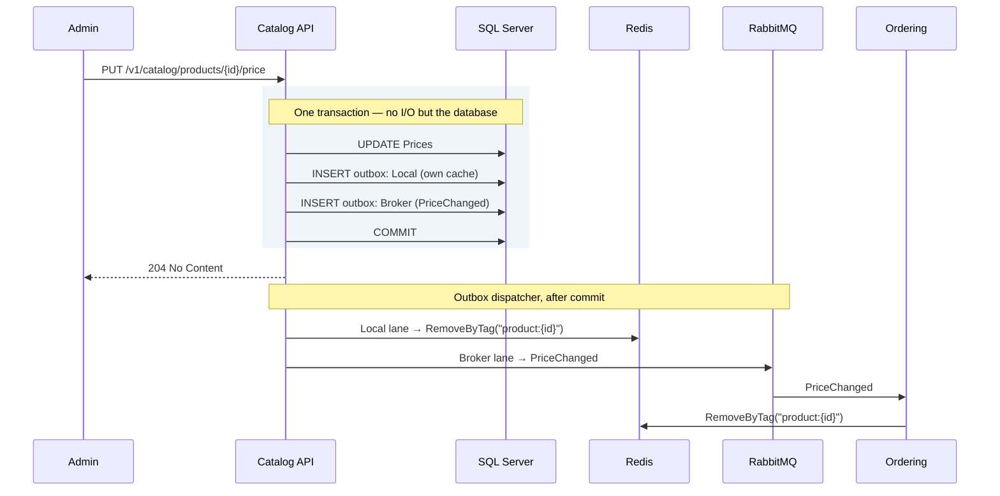

# 8. Caching with Redis

## 8.1 What Redis is used for

Redis serves four distinct purposes here. They are worth separating because
they have different failure semantics.

| Use | Pattern | If Redis is unavailable |
|---|---|---|
| Read-through cache | `HybridCache` over query results | Degrade to database; slower but correct |
| Idempotency keys | `SET key NX EX` | **Fail the request** — correctness depends on it |
| Distributed lock | `SET key NX PX` + token-checked release | Fail the operation; do not proceed unlocked |
| Rate limiting | Sliding window counter — **not built in v1** ([§10.3](10-api-gateway.md)) | Fail open or closed — an explicit policy decision |

Only the first tolerates Redis being down. Conflating them behind a single
"cache is optional" assumption produces duplicate charges the first time Redis
restarts.

The fourth row is here as a reserved keyspace rather than a description of
running code: the gateway limits in process, per replica. It is listed because
the decision of *which instance* a shared counter would use is the one worth
recording in advance — coordination, not cache — and because a `{service}:
ratelimit:` key appearing on the cache instance later would look reasonable and
be silently evictable.

### Eviction policy couples them — separate the keyspaces

This is the subtle one, and it is the reason the four uses need more than a
naming convention between them.

A cache instance is normally configured `maxmemory-policy allkeys-lru`, so that
memory pressure silently evicts cold entries. That policy applies to the
**entire keyspace** — including your distributed locks and your idempotency
keys. Under load, Redis will happily evict a held lock, and two workers will
then both believe they own it; evict an idempotency claim and the request that
wrote it is accepted a second time.

The failure has no error, no log line, and appears only under the memory
pressure that makes it hardest to reproduce.

> **A revoked token was one of the two examples here, and
> [ADR-033](appendix-a-adrs.md#adr-033--revocation-is-bounded-by-the-token-lifetime-and-no-denylist-exists)
> withdrew it.** There has never been a revoked-token entry to evict: nothing
> writes the `{service}:denylist:` keyspace, and
> [§11.3](11-identity-authorization.md) validates a token locally and consults
> no revocation list. An idempotency claim takes its place because it is a
> real occupant of the same instance with the same intolerance for eviction,
> so the rule is untouched and only the example moved. The withdrawn one was
> the more vivid of the two, which is how a keyspace with no reader read as a
> control for four PRs.

| Keyspace | Eviction policy | Placement |
|---|---|---|
| `{service}:cache:` | `allkeys-lru` — eviction is the point | Shared cache instance |
| `{service}:lock:` | **`noeviction`** | Separate instance |
| `{service}:idem:` | **`noeviction`** | With the locks |
| `{service}:denylist:` | **`noeviction`** | With the locks — **reserved, not built** ([ADR-033](appendix-a-adrs.md#adr-033--revocation-is-bounded-by-the-token-lifetime-and-no-denylist-exists)) |
| `{service}:ratelimit:` | `volatile-ttl` acceptable | Either |

**Two of those rows are reservations rather than descriptions of running
code**, and both are listed for the same reason: a key that appears later
should land where its own eviction policy already is, rather than on whichever
instance its first caller happened to be holding. `{service}:ratelimit:` is
the shared counter §10.3 does not build in v1. `{service}:denylist:` is a
token denylist this platform has decided **not to have** — ADR-033 bounds
revocation by the 300-second access-token lifetime and records that nothing
consults a list — so its row claims a *placement* and not a mechanism: if a
denylist is ever built, it must land somewhere a value cannot be evicted from
under it.

A separate DB index on the shared instance is **not** an isolation option,
though it looks like one: `maxmemory-policy` is a server-level setting, every
database on an instance shares it, and a lock in DB 1 is exactly as evictable
as the cache in DB 0. Isolation means a second instance — which is what
§14.1's Compose file runs and §14.2's Aspire sample mirrors.

Production topology: **two shared Redis deployments — cache and coordination —
each with a per-service ACL user** and a mandatory `{service}:` key prefix are
the cost-effective default. Two, not one, because the paragraph above is as
true of a cluster as of an instance: `maxmemory-policy` is deployment-wide, so
a single shared cluster cannot run `allkeys-lru` and `noeviction` at once.
What the services share is each deployment; what the two deployments never
share is the eviction policy.

`{service}` throughout this chapter is the host's `ApplicationName`,
**verbatim**: `RedisKeys` (§8.3) writes it into every key, and the ACL below
is provisioned from the same value, so the two cannot disagree. The examples
here show hosts whose `ApplicationName` is the bare lowercase service name —
a host deployed as `Ordering.Api` takes `~Ordering.Api:*`, and provisioning
any other spelling is the silent-ACL failure §8.2 describes.

```
user ordering-svc on >REDACTED ~ordering:* +@read +@write +@keyspace +@connection +eval -@dangerous +client|setname +client|setinfo
```

Three of those grants are easy to leave off, and the line above is the one a
Testcontainers test proves rather than a first guess. `+eval` because two
things here are Lua scripts and `EVAL` sits in `@scripting`, which none of the
data categories include — under the shorter grant this line used to print,
every release threw and the lock stood until its TTL.

**That reason named only the lock until §8.5's store grew scripts of its own,
and the grant is the same grant either way.** What changed is what a reader
may conclude from it: an explanation resting on one caller is a premise the
next caller falsifies, so both are named here and both have a test that
provisions this exact user and drives the real type through it. The store's
half needs the re-claim to say anything, because its release swallows a
`RedisException` by design — a missing grant there does not throw, it leaves
the claim standing for its whole retention.
`+@connection` because the client library's handshake needs `PING` and its
kin before it carries a single command. And the two `+client|` subcommands
because `StackExchange.Redis` names its connection on connect and
`-@dangerous` takes `CLIENT` away wholesale — the subcommand grants give back
the two harmless ones.

Two rules the helper library enforces rather than documents:

- **Every cache and lock key has a TTL.** A key without one is a memory leak
  with a slow fuse, and on a `noeviction` instance it eventually stops writes
  entirely. Enforced twice: `IDistributedLockFactory` refuses a non-positive
  duration before any I/O — there is no overload without one — and
  `AddRedisConnections`' HybridCache defaults (§8.2) give every entry an
  expiry. The enforcement sits at the sanctioned seams, not around every
  conceivable write: a handler that injects `IDistributedCache` directly, or
  issues a raw `SET` on a keyed multiplexer, has stepped off the §8.2 path —
  the same move as raw SQL around the unit of work (§6.3), and review's to
  catch on the same terms.
- **No cross-service keys.** The ACL makes this impossible rather than
  discouraged, which is the right level of enforcement for something that
  otherwise gets violated once and never noticed. `RedisKeys` (§8.3) makes it
  unwritable as well: the prefix half of every key comes from
  `ApplicationName`, never from the call site.

## 8.2 HybridCache

.NET 9 introduced `HybridCache`, which supersedes hand-rolled
`IMemoryCache`+`IDistributedCache` combinations. It gives a two-tier cache (L1
in-process, L2 Redis) with **stampede protection** — concurrent misses for the
same key execute the factory once rather than N times.

Registered inside `AddRedisConnections` — the same helper that supplies the two
connections of §8.1 — rather than as a separate call somebody has to remember.
`PriceChangedCacheInvalidator` (§8.4) injects `HybridCache` and is registered by
the [§6.2](06-cqrs.md) scan, so an unregistered cache is a service that will not start:

```csharp
// Common.Infrastructure — called by each AddXInfrastructure (§4.2).
public static class DependencyInjection
{
    extension(IServiceCollection services)
    {
        public IServiceCollection AddRedisConnections(IConfiguration configuration)
        {
            // §8.1's two keyed IConnectionMultiplexer registrations — cache
            // and coordination, separate because the eviction policies cannot
            // be shared. Both connection strings are read eagerly, so a host
            // missing one fails at startup rather than at the first miss.

            // The CACHE connection (allkeys-lru); coordination keys use the
            // other. The factory hands the cache its keyed multiplexer — one
            // connection per instance, and the traced connection is then the
            // one the cache actually uses, not a private third.
            services.AddStackExchangeRedisCache(_ => { });
            services
                .AddOptions<RedisCacheOptions>()
                .Configure<IServiceProvider>((options, provider) =>
                {
                    // The §8.1 key prefix, spelled once, in RedisKeys (§8.3) —
                    // whose source is ApplicationName, the same single source
                    // §8.5 uses for idempotency keys. A literal here is a
                    // second place the service name lives (§15.4), and the two
                    // drift silently: §8.1's per-service ACL denies writes to
                    // a prefix the service does not own, so the symptom is a
                    // cache that never populates rather than an error naming
                    // the prefix.
                    options.InstanceName = provider.GetRequiredService<RedisKeys>().CacheInstanceName;
                    options.ConnectionMultiplexerFactory = () =>
                        Task.FromResult(
                            provider.GetRequiredKeyedService<IConnectionMultiplexer>(RedisConnections.Cache));
                });

            services.AddHybridCache(options =>
            {
                options.DefaultEntryOptions = new HybridCacheEntryOptions
                {
                    Expiration = TimeSpan.FromMinutes(10),            // L2, Redis
                    LocalCacheExpiration = TimeSpan.FromMinutes(1)    // L1, in-process
                };
                options.MaximumPayloadBytes = 1024 * 1024;
            });

            // §13.2's Redis tracing lands here too, with both keyed
            // connections handed to it — the parameterless overload discovers
            // only an unkeyed multiplexer, which is why the call cannot live
            // in Common.Web. RedisKeys and the lock factory of §8.1 register
            // beside it; the full wiring is in the source.

            return services;
        }
    }
}
```

The short L1 expiry bounds how long one instance can serve data another instance
has already invalidated. One minute of possible staleness across instances is
usually an acceptable trade for eliminating most Redis round trips; adjust with
the domain in mind.

```csharp
public sealed class GetProductDetailHandler(HybridCache cache, IDbConnectionFactory connections)
    : IQueryHandler<GetProductDetailQuery, ProductDetailDto?>
{
    public async Task<ProductDetailDto?> HandleAsync(GetProductDetailQuery query, CancellationToken ct) =>
        await cache.GetOrCreateAsync(
            $"product:{query.ProductId}:v2",
            query,
            static async (q, token) =>
            {
                using IDbConnection connection = connections.Create();
                return await connection.QuerySingleOrDefaultAsync<ProductDetailDto>(ProductSql, new { q.ProductId });
            },
            tags: [$"product:{query.ProductId}", "catalog"],
            cancellationToken: ct);
}
```

The `static` lambda with the state parameter avoids allocating a closure per
call — a small thing that matters on a hot path.

## 8.3 Key naming

A convention, and the important thing about it is that **a call site writes only
half the key**. `RedisCacheOptions.InstanceName` (§8.2) contributes the
`{service}:cache:` prefix §8.1's keyspace table requires; the handler passes the
rest. Reading the two halves as one string is how a "cache key" ends up written
without the `cache:` segment and therefore outside the keyspace whose eviction
policy was the whole argument of §8.1:

```
{service}:cache:  {entity}:{id}:v{schema-version}
└── InstanceName  └── what the call site passes to HybridCache

catalog:cache:product:0195e4b2-...:v2
catalog:cache:product:0195e4b2-...:pricing:v1
ordering:cache:customer:0195e4c1-...:summaries:head:v1
```

So §8.2's handler passes `product:{id}:v2` and the key in Redis is
`catalog:cache:product:{id}:v2`. The helper exists to keep that true: a literal
prefix at a call site produces `catalog:catalog:cache:...` or, worse, a key that
skips the prefix entirely and is denied by the §8.1 ACL — which fails as a cache
that never populates rather than as an error naming the key.

The coordination namespaces get the same rule from `RedisKeys`, registered by
§8.2's helper: `Lock(name)` and `Idempotency(suffix)` each return the full key
with the `ApplicationName` prefix, so a call site cannot write the wrong half
because it never writes that half at all. The type has deliberately **no
`Cache(string)` method**: cache keys are prefixed by `InstanceName` above, and
a full-key builder would double-prefix the moment somebody passed its result to
`HybridCache` — it exposes the instance-name string instead, so `:cache:` is
spelled in exactly one place.

**There are two key builders and not three, and the missing one is the point.**
`Denylist(suffix)` existed until
[ADR-033](appendix-a-adrs.md#adr-033--revocation-is-bounded-by-the-token-lifetime-and-no-denylist-exists)
and was removed with it: §8.1's `{service}:denylist:` row is a reservation, no
code writes that keyspace, and revocation is bounded by the token's own
lifetime instead. A key builder is the strongest signal this chapter has that a
keyspace has an occupant — it is what a reader greps for when asking whether a
namespace is live — so a builder with no caller is a claim that a mechanism
exists, made by the one type whose whole job is to be authoritative about keys.
The two absences are therefore different in kind: `Cache(string)` is withheld
because the prefix comes from somewhere else, and `Denylist(suffix)` is absent
because there is nothing to prefix.

The trailing schema version is the important part of the half you do write: when
a DTO's shape changes, bump the version and old entries become unreachable and
expire naturally. Without it, a deploy that changes a cached type causes
deserialisation failures across the fleet until the TTL drains.

## 8.4 Invalidation

Cache invalidation is driven by events, never by timers alone.



**Catalog's own invalidation goes through the local outbox lane, not an inline
call after commit.** That is ADR-018: a `RemoveByTag` issued directly by the
handler is unretryable, so a process that dies between commit and the call
leaves a stale cache with nothing to fix it. Staged as a `Local` row, it gets
the same durability, retry accounting and alerting as everything else the
outbox carries.

Remote invalidation flows through the `Broker` lane as an ordinary integration
event. Both are needed — the local row keeps the writing service consistent
with itself, the event keeps every other service consistent shortly after — and
now both are the same mechanism.

This one lives in **Ordering** — a consumer of Catalog's event, invalidating
its own cached projections of Catalog data. It is the second of two handlers
Ordering registers for `PriceChanged`; the other is `ProductPriceProjection`
(§6.6), which updates the price table the write path reads. Both run through
the same `IntegrationEventConsumer<PriceChanged>` ([§9.4](09-messaging.md)), sequentially:

```csharp
namespace Ordering.Infrastructure.Caching;

public sealed class PriceChangedCacheInvalidator(HybridCache cache)
    : IIntegrationEventHandler<PriceChanged>
{
    public Task HandleAsync(PriceChanged e, CancellationToken ct) =>
        cache.RemoveByTagAsync($"product:{e.ProductId}", ct).AsTask();
}
```

## 8.5 Idempotency keys

Every non-idempotent write command carries a client-generated `CommandId`, and
the key is claimed atomically before any work happens. What that buys is **at
most one commit per key while the marker survives**.

**That sentence had an exception in it for as long as this section existed, and
the exception is what the marker removed.** It read *within `Retention`, except
across a lost commit acknowledgement*, and both qualifiers came from the same
place: a Redis claim is a write to a different system from the one the
transaction commits to. Every entry expires, so a retry arriving after the
retention claimed a free key and committed again with nothing having gone
wrong; and a commit whose acknowledgement was lost threw over durable work that
this code released the key for. **Two mechanisms answer the two halves and
neither answers the other's**: the claim is the atomic exclusion that makes a
concurrent duplicate fail early, and a row written *inside* the transaction —
[ADR-037](appendix-a-adrs.md#adr-037--the-idempotency-marker-is-a-row-in-the-commands-own-transaction) —
is what makes the ambiguous case decidable and outlives every TTL. The bound is
still real and is now the marker's retention window, which §9.5's purge sets
and `RetentionPolicy` refuses to put below the claim's own.

**What it does not buy is a *replay* for that whole time, and the difference
belongs here rather than in a footnote.** The recorded outcome lives in the
Redis entry, whose window runs from the claim and is never extended:
`CompleteAsync` preserves whatever the claim had left instead of re-arming a
fresh retention
([ADR-038](appendix-a-adrs.md#adr-038--the-marker-and-its-claim-are-ordered-by-construction-not-a-margin)).
So a command that ran for an hour has spent an hour of its own replay window,
and a retry arriving after it is *refused* rather than answered. That is the
price of the ordering, paid deliberately: the claim is taken before the marker
is stamped, so the marker outlives the claim for every window at least as long.

> **What holds by construction is the ordering of the two *start* events, and
> not that the two windows are counted by one clock.** Redis expires the claim
> after `Retention` elapsed by *Redis's* clock; §9.5's purge deletes the marker
> after `IdempotencyWindow` elapsed by *SQL Server's*. Nothing couples the two
> rates, so a forward step of the database's clock relative to Redis's — an NTP
> correction, a host migration, a resumed snapshot — can carry the cutoff past
> the marker while the claim is still live. What absorbs it is the handler's
> runtime plus whatever the window exceeds the floor by: six days on the
> shipped defaults, and nothing at all at the floor itself
> ([#171](https://github.com/alexander-shamray/dotnet-ddd-blueprint/issues/171)).
>
> **Reinstating an allowance is not the answer, which is why the floor is still
> the claim's window.** Five minutes never bounded a clock step either, and a
> step is bounded by nothing this repository can assert — so a number there
> would repeat in a third term the mistake
> [ADR-038](appendix-a-adrs.md#adr-038--the-marker-and-its-claim-are-ordered-by-construction-not-a-margin)
> removes from two. What closes it is one time source for both deadlines.

**It is a field on the command, not an `Idempotency-Key` header**, and the
reason is the dependency rule rather than taste. `IdempotencyBehavior` runs in
`Common.Application`, which knows nothing about HTTP ([§4.2](04-solution-structure.md)) — it cannot read a
header, so the value has to be on the command by the time the pipeline sees
it. `PlaceOrderCommand` ([§6.4](06-cqrs.md)) declares it as its first field for
that reason.

A service that wants the REST convention can still have it: an endpoint may
bind `Idempotency-Key` into `CommandId` at the boundary, which is the only
layer permitted to know either name. Nothing in this document does, so no
endpoint here reads a header — the request body carries the value.

The behaviour lives in `Common.Application`, so — exactly as with
`IUnitOfWork` in §6.3 — it must not reference `StackExchange.Redis`. [§4.2](04-solution-structure.md) names
that package as forbidden and the architecture test enforces it. The store is a
port:

```csharp
namespace Common.Application;

public interface IIdempotencyStore
{
    /// <summary>
    /// Atomically claims the key and returns the claim token. Null if it is
    /// already held.
    /// </summary>
    Task<string?> TryClaimAsync(string key, TimeSpan retention, CancellationToken ct);

    Task<IdempotencyEntry?> GetAsync(string key, CancellationToken ct);

    /// <summary>
    /// Records the outcome against a key this claim still owns, preserving the
    /// claim's remaining life rather than starting a new one.
    ///
    /// There is no retention parameter, and its absence is the contract rather
    /// than a simplification. This took one and re-armed the entry to a full
    /// window, which started the claim's life at the COMMIT — later than the
    /// marker §6.3 stamps inside the transaction that precedes it. Preserving
    /// what the claim had left starts the window at TryClaimAsync instead,
    /// which is earlier than the stamp by construction (ADR-038).
    /// </summary>
    Task CompleteAsync(string key, string claim, string payload, CancellationToken ct);

    Task ReleaseAsync(string key, string claim, CancellationToken ct);
}

public sealed record IdempotencyEntry(bool InProgress, string? Payload);

/// <summary>
/// The durable half. Both members run on the command transaction's own
/// connection, which is the whole contract rather than an implementation note:
/// a marker read or written anywhere else is another Redis claim in different
/// clothes. §6.3 is therefore the only caller, because it is the only code
/// holding the transaction open.
///
/// No retention here, and what is left of the asymmetry with the store above
/// is the point. Neither port takes one on completion any more — the claim
/// carries a single TTL, set when it is taken and never renewed — but a marker
/// is a row and carries none at all: what deletes it is §9.5's purge on a
/// window the service chooses. That is what makes the two expiries orderable
/// rather than merely comparable, and the ordering is the guarantee.
/// </summary>
public interface IIdempotencyMarkerStore
{
    Task<bool> ExistsAsync(string key, CancellationToken ct);
    Task MarkAsync(string key, CancellationToken ct);
}

/// <summary>
/// Carries the key §8.5 builds to the transaction that writes the marker under
/// it, for the one scope that dispatched the command. Scoped, like everything
/// else on the command path.
///
/// Carried rather than rebuilt, because §6.3 is constrained to neither
/// IIdempotentCommand nor ICurrentUser and would have to reach both by
/// reflection — two implementations of one key shape, one file apart.
/// </summary>
public sealed class IdempotencyContext
{
    public string? Key { get; private set; }

    public void Claim(string key) => Key = key;

    // Forgotten when the dispatch that claimed it unwinds, from the finally
    // below. A scope is not promised to serve one command — an endpoint or an
    // integration-event handler may dispatch twice — and a key left standing is
    // captured by the NEXT command's transaction, which either refuses a
    // command nobody protected or marks the wrong command's work.
    public void Clear() => Key = null;
}

/// <summary>
/// Opts a command into IdempotencyBehavior. Not an empty marker: the behaviour
/// reads CommandId to build its key, so the interface has to carry it.
///
/// The behaviour is constrained to this, which means a command that does not
/// declare it is simply never protected — no error, no warning, and a retry
/// creates a second order. Opting in is a decision; forgetting to is not
/// meant to look like one.
/// </summary>
public interface IIdempotentCommand
{
    // The operation's identity, declared rather than derived — see "Renaming a
    // command changes its keys" below, which is the defect this closes. A
    // static abstract member is what makes the decision unskippable: the
    // compiler refuses a command that supplies none, and a rename of the type
    // leaves the string alone. Give it a value the domain would recognise;
    // copying the CLR name back in reintroduces the coupling by convention.
    static abstract string OperationName { get; }

    Guid CommandId { get; }
}
```

```csharp
public sealed class IdempotencyBehavior<TCommand, TResult>(
    IIdempotencyStore store,
    ICurrentUser currentUser,
    IdempotencyContext idempotency)
    : IPipelineBehavior<TCommand, TResult>
    where TCommand : ICommand<TResult>, IIdempotentCommand
    where TResult : Result
{
    // From IdempotencyRetention, because RetentionPolicy reads the same value
    // to refuse a marker window shorter than it — a 24 in two files agrees
    // until one of them is edited.
    //
    // Passed once, on the claim, and the completion below does not extend it.
    // The window therefore runs from TryClaimAsync whatever the handler does,
    // which is what puts the claim's expiry after the marker's stamp by
    // construction rather than by a margin (ADR-038). A command that runs for
    // an hour spends an hour of its own replay window.
    private static readonly TimeSpan Retention = IdempotencyRetention.Window;

    // "null" and not the empty string. IdempotencyEntry carries a Payload the
    // store has to tell apart from the in-progress marker it wrote on the
    // claim, and an empty string is the value an implementation is likeliest to
    // read as absent — which would replay every void-shaped command as
    // ConcurrentRequestException for a day. This is valid JSON and unambiguous.
    private const string NoValue = "null";

    // Result and Result<T> are the whole universe (Appendix D.5), and the two
    // members after this one depend on that. A static field on a generic type
    // has one instance per CLOSED type, so all three are resolved once per
    // (TCommand, TResult) pair rather than once per command, and they run in
    // declaration order.
    private static readonly Type? ValueType = ValueTypeOf();

    private static readonly PropertyInfo? ValueProperty =
        ValueType is null ? null : typeof(TResult).GetProperty(nameof(Result<object>.Value));

    // Result.Success<T>, closed over that value type — and the factory rather
    // than the constructor for a weaker reason than it looks. The constructor
    // is INTERNAL and this behaviour is in the same assembly, so it is
    // reachable, and Success<T> guards nothing the constructor does not: it is
    // `=> new(value, null)`. What it is, is the type's stated construction API
    // (Appendix D.5), and that is the whole of the reason. The state invariant
    // needs neither: IsSuccess is defined as the absence of an error, so
    // success-carrying-an-error is unreachable by any route.
    private static readonly MethodInfo? SuccessOfValue = ValueType is null
        ? null
        : typeof(Result)
            .GetMethod(nameof(Result.Success), 1, [Type.MakeGenericMethodParameter(0)])!
            .MakeGenericMethod(ValueType);

    public async Task<TResult> HandleAsync(TCommand command, NextDelegate<TResult> next, CancellationToken ct)
    {
        // Key shape only — the store owns the service prefix and namespace.
        // Neither of the first two segments is decoration: the subject is
        // argued at "A claimed key belongs to one subject" below, and the
        // operation is declared on the command rather than read off the type
        // for the reason "Renaming a command changes its keys" gives.
        string key = $"{Subject()}:{TCommand.OperationName}:{command.CommandId}";

        // The token names THIS attempt, and every write below carries it.
        // A claim that expired under a long handler cannot then be completed
        // or released over its successor's.
        string? claim = await store.TryClaimAsync(key, Retention, ct);

        if (claim is null)
        {
            IdempotencyEntry? existing = await store.GetAsync(key, ct);

            if (existing is null || existing.InProgress)
                throw new ConcurrentRequestException(command.CommandId);

            return Replay(existing.Payload!);
        }

        // Handed to §6.3, which writes the durable marker under this key inside
        // the transaction and reads it back before anything runs. After the
        // claim rather than beside the key, so a command about to replay never
        // hands a key to a transaction it will not open.
        idempotency.Claim(key);

        TResult result;

        try
        {
            result = await next();
        }
        catch
        {
            // Release for a fault raised INSIDE next(), and nowhere else.
            // §6.3's ExecuteAsync disposes the transaction on the way out,
            // which rolls it back — for every fault this in-process code can
            // tell apart. The one it cannot is the lost commit acknowledgement,
            // where the work IS durable and this line frees the key for it.
            //
            // Releasing is still right, and it is now a decision rather than a
            // default: the retry it admits meets the durable marker §6.3 wrote
            // in that same transaction and is refused before a handler runs.
            await store.ReleaseAsync(key, claim, CancellationToken.None);
            throw;
        }
        finally
        {
            // The key lives for exactly the dispatch that claimed it. Neither
            // of the hazards above is reachable in this platform today, which
            // is what makes closing it here cheaper than resting on a premise
            // the next caller falsifies.
            idempotency.Clear();
        }

        if (result.IsFailure)
        {
            // A refusal is rolled back by the same mechanism rather than by
            // §6.3 declining to save — see "A failed Result releases the claim"
            // below, which is where that distinction is argued.
            await store.ReleaseAsync(key, claim, CancellationToken.None);
            return result;
        }

        // No retention here, and the omission is the fix rather than a shorter
        // call. Passing one re-armed the entry at the COMMIT, which is after
        // §6.3 stamped its marker inside the transaction — so the claim
        // outlived the marker by the commit's own tail, and the marker's
        // window had to carry a margin for a lag nothing bounds. The store now
        // keeps what the claim had left, so the outcome stays replayable for
        // the remainder of that window rather than for a fresh one (ADR-038).
        await store.CompleteAsync(key, claim, Capture(result), CancellationToken.None);
        return result;
    }

    // The claim belongs to one subject, bound from the principal and never from
    // the command (§11.4). IsAuthenticated is false for BOTH a message-borne
    // command and an anonymous HTTP request (Appendix D.1), so this segment is
    // shared rather than unique — which is a residual, argued below, not a
    // detail. It cannot collide with an authenticated subject: the alternative
    // is a Guid rendered "D", and no Guid spells a word.
    private string Subject() => currentUser.IsAuthenticated ? currentUser.Id.ToString() : "system";

    // Only a success is ever stored, and what is stored is its VALUE — never
    // the Result around it. What that type does and does not survive is
    // measured in "Trap — JSON round-tripping the Result itself".
    private static string Capture(TResult result) =>
        ValueType is null
            ? NoValue
            : JsonSerializer.Serialize(ValueProperty!.GetValue(result), ValueType);

    private static TResult Replay(string payload)
    {
        // (TResult)Result.Success() is legal C# under the constraint above and
        // throws InvalidCastException at run time for every TResult that is not
        // exactly Result — the compiler accepts it because Result is TResult's
        // effective base class, and the runtime refuses a base instance where a
        // derived one is required. The guard is what makes it safe, not an
        // optimisation, and removing it fails only at the first replay.
        if (ValueType is null)
            return (TResult)Result.Success();

        object? value = JsonSerializer.Deserialize(payload, ValueType);
        return (TResult)SuccessOfValue!.Invoke(null, [value])!;
    }

    private static Type? ValueTypeOf()
    {
        if (typeof(TResult) == typeof(Result))
            return null;

        if (typeof(TResult).IsGenericType && typeof(TResult).GetGenericTypeDefinition() == typeof(Result<>))
            return typeof(TResult).GetGenericArguments()[0];

        // Unreachable while Result<T> is sealed and Result's constructor is
        // private protected — a third shape could only be declared inside
        // Common.Application. Stated rather than assumed, though what it buys
        // is narrower than it looks: this runs from a static field
        // initialiser, so the CLR wraps it in a TypeInitializationException
        // exactly as it would wrap the IndexOutOfRangeException the obvious
        // body throws. The surface type is the same either way. What changes
        // is the InnerException — a sentence naming the type and the reason,
        // rather than an index that names neither — and moving the check off
        // the static path to get a direct throw would cost it on every
        // command instead of once per closed generic.
        throw new NotSupportedException(
            $"{typeof(TResult).Name} is neither Result nor Result<T>, so no stored outcome " +
            "can be rebuilt for it. A third Result shape is a change to this behaviour.");
    }
}
```

> **A claimed key belongs to one subject, and that is the invariant rather than
> the key shape.** `CommandId` is client-generated, and §8.3's store prefix is
> `{service}:idem:` — shared by every caller of the service. A key built from
> the command type and that value alone is therefore entirely caller-controlled,
> so caller A can name victim B's key, deliberately or by deriving the value
> from a request-body hash, which is a common and recommended client
> implementation of an idempotency key. If B's command has completed, A takes
> the replay branch and is handed **B's result** — B's order id.
>
> **What that skips is the handler, and only what the handler does — which is
> narrower than "authorisation" and is still the whole of §11.4's subject
> rule.** Authentication and the endpoint's permission policy have already run
> by the time the dispatcher is called, and they still run on a replay: A is a
> genuine authenticated caller holding `orders:write`, which is exactly why
> nothing refuses the request. What never happens is the handler binding
> `currentUser.Id` — and, on a command that has one, the resource-ownership
> check §11.4 describes. The subject is what goes missing, not the gate in
> front of it.
>
> **The in-flight case belongs to whoever claimed first, and that is the
> attacker.** `TryClaimAsync` is a `SET NX`, so the race has one winner and the
> loser meets `ConcurrentRequestException` — but `CommandId` is A's to choose,
> so A can take the key ahead of B and leave B, the legitimate caller, unable
> to place the order until A's entry completes or the retention expires. If A's
> entry does complete, B is then served **A's** result, which is the same
> disclosure with the roles reversed. Neither path touches the caller's
> identity at any point.

> **The invariant holds for authenticated callers and for nobody else, and that
> is this section's largest residual.** `ICurrentUser.IsAuthenticated` is false
> for a message-borne command *and* for an anonymous HTTP request — the port
> says so in as many words (Appendix D.1), and §11.4's
> `IsAuthenticated => Caller is not null` is what implements it. So `"system"`
> is not one caller: it is every caller who is not one. Two consequences, and
> the first is a rule rather than an observation:
>
> - **An idempotent command's endpoint must require authentication.** On an
>   anonymous endpoint — and this platform has them, §10.2's listing is one —
>   the collision described above is fully reachable *between anonymous
>   callers*, which is the defect the subject segment was added to close,
>   surviving inside the fix for it.
> - **The message path shares one bucket, and the reason is no longer the one
>   this bullet used to give.** Every sender of every command type claims under
>   `"system"` because `ICurrentUser.IsAuthenticated` is false on that path —
>   not because the broker has one principal. It had one when this was written;
>   [ADR-036](appendix-a-adrs.md#adr-036--the-broker-has-a-per-service-identity)
>   gave each service its own account and the bucket did not move, because
>   nothing binds a broker identity into `ICurrentUser`. **A cause that is
>   fixed while its effect survives is the most misleading kind of stale
>   sentence**, and this one also pointed at
>   [#44](https://github.com/alexander-shamray/dotnet-ddd-blueprint/issues/44)
>   in the future tense for a split that issue landed without performing.
>   Splitting the bucket means binding the consumer's authenticated identity
>   into the port §11.4 implements, which no chapter specifies today.
>   That is not made worse by anything here, and
>   [ADR-028](appendix-a-adrs.md#adr-028--a-money-movement-command-carries-no-subject)
>   does not make it better either, which is worth stating precisely because
>   that ADR *did* settle what §11.4 used to leave open. It rules that a
>   message-borne command carries no subject and that the receiving service
>   re-derives one from its own record — a rule about the **subject of the
>   decision**, resolved at the far end. The key's subject segment is a
>   different quantity: it identifies *the claimant* at the near end, and on
>   this path there is still exactly one. Naming a fixed segment remains the
>   smallest thing that keeps a principal-less command from claiming under no
>   subject at all.

> **Trap — JSON round-tripping the `Result` itself.** It is the obvious body for
> both halves and it cannot work in either direction. `System.Text.Json`
> serialises public get-only properties by default (`IgnoreReadOnlyProperties`
> is false), so it reads every accessor a `Result` has — and on a success
> `Error` throws by design (Appendix D.5) while on a failure `Value` does.
> Coming back is worse: `Result`'s constructor is `private protected` and
> `Result<T>`'s is `internal`, so there is nothing for the serialiser to call
> and it raises `NotSupportedException`.
>
> **Measured against the shipped type, not inferred from the documentation.** Of
> the four shapes a handler can return, exactly **one** survives
> `JsonSerializer.Serialize` — the non-generic *failure*, which is the one shape
> this behaviour never stores. `Result.Success()`, `Result.Success<T>(v)` and
> `Result.Failure<T>(e)` all throw `InvalidOperationException` carrying the
> accessor's own message. So the naive body fails on the ordinary success path
> rather than under an unusual fault, and it fails *after* §6.3 has committed:
> the caller sees 500 for an order that exists. **What the retry then does is
> the one thing in this trap the marker changed.** `Capture` still runs after
> `next()` returns, so the throw is still after the commit — but the marker
> committed with it, so the retry claims a free Redis key and meets
> `CommandAlreadyCommittedException` instead of placing a second order. The
> naive body still turns a succeeded command into a 500 and still loses the
> result; it no longer produces the duplicate write it was added to prevent.
>
> Adding a `[JsonConstructor]` and non-throwing accessors to `Result` is the
> other way out and is refused — though not for the reason that suggests
> itself first. A public constructor could **not** produce a result reporting
> success while carrying an error: `IsSuccess` is defined as the absence of
> one, so that state is unreachable however the type is built. What the change
> would actually cost is the rest of the design — non-throwing accessors turn
> `Value` on a failure from a loud error into a silent `default`, which is
> §5.3's always-valid argument giving way at the one place it is load-bearing,
> and a serialiser-constructible `Result` is one any consumer may assemble by
> hand. The throwing accessors are the contract (Appendix D.5), not an
> obstacle to route around.

> **The value is serialised with default options and no converters, which is a
> constraint on what an idempotent command may return.** §4.2 registers
> `MoneyJsonConverter` into `OutboxJson` precisely because `Money` has a private
> constructor and without it "deserialises to a zero amount and a null currency
> and nothing says so". This behaviour composes no options at all, so a
> `Result<Money>` would satisfy every constraint above, serialise, and replay a
> zero-amount `Money` on a path that answers 200. Return a primitive, a `Guid`
> or a DTO — never a domain value object. The reflection test below gates it.

**Release is decided per case, and the cases are not symmetrical.** The `try`
covers `next()` and nothing else, and the three store calls divide like this:

| | |
|---|---|
| `next()` throws | **Release** — including for the one fault this code still cannot tell apart, and that is now a decision rather than a default. §6.3's `ExecuteAsync` disposes the transaction on the way out, which rolls it back, so for every *distinguishable* fault nothing survives and a retry is owed; for the lost acknowledgement the work is durable, the retry this admits meets the marker §6.3 wrote in that same transaction, and it is refused before a handler runs |
| Handler returns a failed `Result` | **Release**, for the same reason and not for the one §6.3's comment suggests — see below. No marker survives either: §6.3 writes it after the failure guard |
| `CompleteAsync` throws | **Hold**, which postpones the *replay* and no longer postpones the duplicate. The work is durable and the entry is stuck `InProgress`, so every retry meets `ConcurrentRequestException` until it expires — and the one arriving after that claims a free key, meets the marker, and is refused with `CommandAlreadyCommittedException`. What the caller loses is the recorded outcome, which this branch is the failure to write |
| `TryClaimAsync` throws | **Nothing to decide, and it is still the case with the worst answer.** The `SET NX` may have succeeded on the server, so the key can be held for a day for work that never ran, and no retry gets past it. The marker does not help here and could not: nothing committed, so there is nothing for it to record |

The two `ReleaseAsync` calls and the `CompleteAsync` all pass
`CancellationToken.None`, and for two different reasons rather than one. After
`next()` returns, the caller's token stopped meaning anything the moment the
transaction committed, and passing it would abandon the store write at exactly
the moment it is owed. In the `catch` the commonest reason to be there at all
is the caller's own cancellation, and honouring the token would abandon the
release and leak the claim for a day — so `None` is right there too, whether or
not the transaction committed, which the next callout is about.

> **Renaming a command would change its keys, and a rolling deployment is
> where that costs a duplicate write — which is why the operation segment is
> declared and not derived.** The segment was `typeof(TCommand).Name` when this
> section was first written, so `PlaceOrderCommand` → `SubmitOrderCommand` was
> a new key for the same `CommandId`. During a rollout both versions serve: the
> old pods claim under the old name, the new pods under the new one, and a
> client retrying one `CommandId` is protected by neither — it places two
> orders. The window is not the rollout but the **retention**, because an entry
> written before the rename stays claimable for 24 hours after it.
>
> `IIdempotentCommand.OperationName` closes that, and the shape is the one this
> callout used to merely recommend: a `static abstract` member, which C# 14
> makes cheapest because the compiler then refuses a command that does not
> supply one. What it cannot refuse is a command that supplies its own type
> name back, so a per-service reflection gate asserts none does. `FullName` was
> the obvious alternative and is worth ruling out: it addresses a collision
> between two same-named commands in different namespaces — a real but
> different problem — while making the key *more* fragile by binding the
> namespace to it as well.
>
> **The stored payload has the same problem one field over, and it is worse
> because nothing throws.** `Capture` writes the success value with default
> options, so the entry carries an implicit schema for as long as it lives —
> up to the full 24 hours, since the window runs from the claim and a command
> that ran for a minute has spent a minute of it. Change the shape of a result
> DTO and a new pod reading an old
> pod's entry either fails to deserialise it — a 500 on a retry of work that
> committed — or, for an added or renamed member, **silently defaults it** and
> replays a success that is quietly wrong. Neither is visible to a rolling
> deployment's health checks. The same two routes apply: version what is
> stored, or state a compatibility procedure for result-shape changes. Until
> one is taken, **changing the shape of an idempotent command's result is a
> migration too**, on exactly the terms the rename is.
>
> **The operation half is closed and the payload half is not**, and the
> asymmetry is worth being explicit about: a discriminator was cheap to add
> while the interface had no implementors, and a stored-payload version is a
> change to what every completed entry holds. Until one is taken, **changing
> the shape of an idempotent command's result is a migration**, and this
> paragraph is the only thing saying so.

> **A claim carries a token, because a key names the work and only a token
> names the attempt.** `TryClaimAsync` returns one and both writes take it, and
> the store compares before it acts — one Lua script, exactly as
> `IDistributedLock`'s release does it and for the same reason: a check and an
> act that are two operations are two operations the claim can expire between.
> Without it every claim wrote the same marker, so neither write could tell
> *this* attempt's claim from a successor's, and an attempt outliving its own
> retention overwrote or deleted a live one. The delete is the worse half:
> overwriting corrupts the record of a duplicate, where deleting frees a
> successor's claim while that successor is still running and admits one.
>
> **What the token closes is corruption, not the overrun itself.** Nothing here
> bounds the retention against a handler's runtime — the behaviour passes 24
> hours, so no shipped path reaches it, and nothing in the port's contract
> stops a caller passing seconds. Past the claim's expiry a successor may claim
> and both attempts run; the loser now fails to write rather than writing over
> the winner. The store logs that refusal, because a write that silently did
> nothing is the shape this whole section is about.

> **The lost commit acknowledgement is the one fault the `catch` cannot
> recognise, and the answer is that nothing here has to.** If `CommitAsync`
> succeeds on the server and the connection drops before the acknowledgement,
> `next()` throws over work that is already durable — and no in-process tidying
> can tell that apart from a fault that rolled back, which is what
> `docs/pr-decision-log.md` recorded as knowingly open from PR-09. Releasing
> there frees the key for a command that committed. What stops the retry is not
> a better guess in this `catch`: it is that the committing attempt left a row
> behind, and §6.3 reads it before the retry's handler runs
> ([ADR-037](appendix-a-adrs.md#adr-037--the-idempotency-marker-is-a-row-in-the-commands-own-transaction)).
>
> **Redis could not have closed it, and that is worth keeping rather than
> deleting with the residual.** `IIdempotencyStore` is outside the transaction,
> so no claim it holds is atomic with the SQL commit — claim first and a lost
> acknowledgement releases a claim over durable work, commit first and the
> claim is not held while the work runs. The marker is not a cleverer use of
> this store; it is a write to the *same* system the transaction commits to,
> which is the only thing that can be atomic with it.
>
> **Holding the claim instead of releasing it was the other candidate, and it
> is worse in both directions.** The row above already says what holding buys
> against a `CompleteAsync` failure: every Redis entry has a TTL, so a held key
> expires and the attempt after that claims a free key and runs the command a
> second time — a postponement rather than a fix. It would also cost every
> ordinary fault its retry for whatever the claim had left, which on a fault
> raised early is very nearly the full retention and is a large availability
> price for a postponement. A row has no TTL; what deletes it is §9.5's purge
> on a window `RetentionPolicy` refuses to set below this store's own.
>
> **What the caller gets is a refusal and not a replay, and there are two ways
> to arrive at it — only one of which is the lost acknowledgement.** On that
> path the attempt threw before it returned, so nothing recorded an outcome to
> hand back. On the other, and it is the commoner one, the command succeeded
> and `CompleteAsync` recorded its payload; the claim then expired at
> `Retention` while the marker lived on, so a retry inside the marker's window
> finds the outcome *gone* rather than never written. **`Retention` is counted
> from the claim and not from the completion**, because the completion
> preserves the window rather than re-arming it (ADR-038) — so a command that
> ran slowly reaches this state sooner than a fast one, the handler's runtime
> having come out of the same window.
> `CommandAlreadyCommittedException` answers §10.5's 409 saying the command was
> applied and its result is no longer available — not that it was never
> recorded, which would be false on the path most callers take. Read the
> resource.
>
> **That second path is a change to what a late retry does, and it is the price
> of dropping the exception from this section's opening sentence.** Before the
> marker, a retry after the claim expired ran the command again — which is
> precisely why the guarantee was bounded by `Retention` and said so. It is now
> refused for as long as the marker survives, which on the shipped windows is
> **at least** six days longer — the claim runs 24 hours from the claim, the
> marker seven days from a stamp that is later, so the stretch between the two
> expiries is six days plus however long the command took to commit. That is a
> loss against both a replay and a re-run, and it is strictly better than the
> second order it replaces.
>
> **The residual it leaves is one this section already priced, and PR-14 is
> why.** With the outbox in place a re-run republishes the same fact, which is
> the at-least-once delivery §9.4 promises and §9.5's inbox absorbs. A
> duplicate **order** was never absorbed by either, and that is the one this
> closes.

> **`ReleaseAsync` throwing is not handled, and the two sites fail
> differently.** In the `catch`, an exception from the release means `throw;`
> is never reached
> and the original fault is **destroyed rather than wrapped** — the caller sees
> a Redis error instead of the domain one. In the failure branch it turns a
> business refusal into a 500. Both are the store's failure mode surfacing
> through the behaviour, and both argue for the release being best-effort
> **in the implementation**, where there is a logger to say it happened; a
> swallowed exception here would be a silence with nothing to report it.

**A failed `Result` releases the claim, and that is a decision rather than
tidiness.** The reason is not the one §6.3's comment reaches for first.
Declining to `SaveChanges` is not by itself enough — `EfUnitOfWork` says so in
its own comment, because `ExecuteRawAsync` writes on the transaction's
connection immediately and only a rollback undoes that. What makes a refusal
safe is that `ExecuteAsync` disposes an uncommitted transaction, which rolls it
back. Given that, there is no outcome worth replaying, and holding the key
would replay a *refusal* — to the caller who fixed their request and retried
under the same `Idempotency-Key`, and after the condition that caused it
(`ProductsUnavailable`, say) has cleared. The cost accepted in exchange is that
a client hammering a failing command re-runs the work each time, which is safe
precisely because nothing commits.

> **One dispatch is outside every argument above, and it is named rather than
> assumed away.** §6.3 opens no transaction when one is already active, so on a
> nested dispatch it returns `next()` without reaching the `IsFailure` test and
> without calling `SaveChangesAsync` — the *outer* command's transaction decides
> what happens to the rows, and it is still open when this behaviour makes up
> its mind. Both sides break. A nested refusal may have written rows the outer
> command goes on to commit, so releasing lets a retry write them twice; and a
> nested *success* is completed here for the remainder of its claim's window
> against work the outer transaction may still roll back, so a retry replays a
> success for an order
> that does not exist — which is worse than the duplicate, because the client
> cannot see it. `IdempotencyBehavior` is registered outside
> `TransactionBehavior` (§6.3), so a nested idempotent command genuinely lands
> inside its parent's transaction. Nothing in this blueprint dispatches a
> command from inside a **command** handler, so the case is **unreached rather
> than handled**.
>
> `StockReservedHandler` (Appendix D.4) is the near miss, and naming it is
> cheaper than letting a reader find it: it does dispatch
> `ConfirmStockCommand`, but it is an `IIntegrationEventHandler`, and §9.5's
> inbox filter opens no `IUnitOfWork` transaction — it writes its row on the
> `DbContext` directly, after the consumer. So `HasActiveTransaction` is false
> when that dispatch arrives and §6.3 opens a transaction of its own: an entry
> point, not a nested unit. A service that puts a dispatch inside a *command*
> handler needs this behaviour to decline nested dispatches outright, and this
> is the paragraph that changes when it does.
>
> **"Unreached" is a claim about an assembly, so a gate makes it, not this
> sentence.** `No_command_handler_dispatches_a_command` reads the constructor
> parameters of every `ICommandHandler<,>` in the service and refuses
> `IDispatcher` — one per service, beside the opt-in gates, and the day a
> handler takes one the build fails here rather than the hole opening in
> silence. Without it the paragraph above is a residual nothing re-checks,
> which this blueprint treats as a decision rather than a deferral. Its reach
> is the constructor: a handler that resolves `IServiceProvider` and asks it
> for a dispatcher is invisible to it, exactly as a forbidden-but-unused
> reference is invisible to §4.2's gates — late rather than absent.

### The durable marker

The marker is a row in the service's own schema, beside §9.4's outbox and
§9.5's inbox, keyed on the key this section already builds. Nothing reads it to
find out what a command returned — presence is the whole answer, exactly as it
is in the inbox one table over.

```csharp
// The default is what leaves CommittedAt to the database. The column carries a
// SYSDATETIMEOFFSET() default and EF omits a property still holding its
// sentinel from the insert, so new IdempotencyMarker(key) ages the row on the
// same clock the purge reads its cutoff from (ADR-038). Passing a value
// explicitly still writes it, which is what lets a fixture stage a marker at a
// controlled age; that is the only caller that should.
public sealed class IdempotencyMarker(string key, DateTimeOffset committedAt = default)
{
    public string Key { get; private set; } = key;

    public DateTimeOffset CommittedAt { get; private set; } = committedAt;
}
```

**What makes that default reachable is `ValueGenerated.OnAdd` over it, and the
mapping writes both calls rather than leaning on the one that implies the
other.** The service's `IEntityTypeConfiguration` writes
`.HasDefaultValueSql("SYSDATETIMEOFFSET()")` **and** `.ValueGeneratedOnAdd()`
on the property: the first supplies the DDL default, the second is what leaves
the column out of the insert while the property holds its sentinel and reads
the generated value back. **The second call is redundant and is made anyway**,
because EF's relational convention already infers `OnAdd` from a store default
— measured on this solution's own model snapshot, where
`ProductPrice.IsAvailable` is configured with `.HasDefaultValue(true)` and
nothing else and records `.ValueGeneratedOnAdd()` all the same. Writing it puts
the property on the record instead of resting on a convention the reader has to
already know. Both services carry a migration for the default, and §4.5's
scaffold ships it with the template.

**The key is the whole primary key, and it is already scoped by
construction** — `{subject}:{operation}:{commandId}` puts the caller, the
operation and the attempt inside one column. §9.5's composite key exists
because one service may bind one message type on two endpoints; there is no
second axis here, and a column that distinguishes nothing is what that entity's
own comment warns against.

**The column is `nvarchar(450)` with a binary collation, and both halves are
the inbox's arguments one table over.** 450 is exactly SQL Server's 900-byte
clustered-index limit at two bytes a character, so it is the widest this column
can be while the primary key stays clustered; the key spends 74 of those
characters on two GUIDs and two separators and leaves the declared operation
name the rest. Binary because this column is a key rather than text: the
default collation is case-insensitive, and two commands are the same command
only if their keys are the same bytes. A per-service gate asserts the operation
names a service declares fit, because a name too long fails neither the build
nor startup — SQL Server refuses the insert on the first dispatch of that
command, inside the transaction carrying the customer's order.

**The store writes through the service's own `DbContext`, and that is what puts
it in the transaction rather than beside it.** §9.5's filter already requires
each service to register
`AddScoped<DbContext>(sp => sp.GetRequiredService<XDbContext>())`, and the
alias is the whole mechanism: `AddScoped<DbContext, XDbContext>()` compiles,
resolves, and builds a *second* context in the same scope. A marker committed
in its own transaction is worse here than a stray inbox row is there — that
suppresses one redelivery, this refuses every later attempt at a command that
never committed.

```csharp
public sealed class EfIdempotencyMarkerStore(DbContext db) : IIdempotencyMarkerStore
{
    public Task<bool> ExistsAsync(string key, CancellationToken ct) =>
        db.Set<IdempotencyMarker>().AnyAsync(marker => marker.Key == key, ct);

    // No TimeProvider, and this type took one until the column default replaced
    // it. The row's age was then the purging pod's clock minus a timestamp the
    // writing pod stamped, across §15.3's three replicas — so the marker's
    // retention floor had to bound the skew between them rather than remove it.
    // Constructing the marker without a timestamp is what leaves the column to
    // its SYSDATETIMEOFFSET() default (ADR-038).
    public async Task MarkAsync(string key, CancellationToken ct) =>
        await db.Set<IdempotencyMarker>().AddAsync(new IdempotencyMarker(key), ct);
}
```

**`MarkAsync` stages and does not save**, which is what makes the row exactly as
durable as the aggregate: §6.3 calls `SaveChangesAsync` one line later inside
the transaction it opened, so the marker lands with the work or not at all.
`ExistsAsync` is a query and never the change tracker — this attempt stages its
own marker under the key it reads, so an implementation consulting local state
first would answer "already committed" to the attempt that is committing, and
§6.3's `ExecuteAsync` may run the whole unit again, which is exactly when that
would bite.

> **Dapper on `IUnitOfWork.ExecuteRawAsync` was the alternative and is not
> better.** That port is §6.3's sanctioned in-transaction raw write and would
> have kept the table out of the EF model — but it has no read, so closing the
> loop would have meant widening §6.3's port for one caller, and the table
> would then need hand-written DDL in a migration EF had no reason to emit.
> §7.2's rule is that an entity is mapped by an `IEntityTypeConfiguration`, and
> §7.4 already classifies the inbox and the outbox as technical tables mapped
> that way for exactly this reason.

**§9.5's retention purge gains a third table, and it is the only one of the
three whose window is a correctness setting.** A purged outbox row loses a
debugging record; a purged inbox row loses a suppression the broker will not
exercise again; a purged marker re-opens the duplicate. So
`RetentionPolicy.IdempotencyWindow` has a floor the other two do not — it reads
`IdempotencyRetention.MarkerFloor` and refuses anything shorter, because a
window below the claim's own life leaves a stretch in which the key is claimable
again and nothing remembers the commit. It reads the value rather than restating
it: two 24s in two files agree until one of them is edited.

**Its statement is the third the purge composes, and it is the one that does
not take a cutoff.** §9.4's and §9.5's are handed a `@Before` the service
computed from its registered `TimeProvider`; this one is handed the window as a
duration and works the cutoff out on the server:

```sql
-- Age alone, and for a stronger version of the inbox's reason: every row here
-- records a command that committed, so there is no unfinished state a
-- predicate could protect. What protects a live marker is the window.
--
-- The cutoff is computed HERE rather than handed in, which is the one place
-- this statement departs from the two above it. CommittedAt is written by a
-- SYSDATETIMEOFFSET() column default, so it is the server's own clock whichever
-- replica ran the command — and a cutoff computed from a pod's clock would then
-- age the row across two of them.
-- Seconds and not days because the window is a caller-supplied TimeSpan;
-- DATEADD takes an int, which the policy's ten-year ceiling clears.
DELETE TOP (@BatchSize) FROM ordering.IdempotencyMarkers
WHERE CommittedAt < DATEADD(second, -@WindowSeconds, SYSDATETIMEOFFSET());
```

> **The floor is the claim's window exactly, and it was the claim's window
> *plus* an allowance until both of the things that reordered the two expiries
> were closed.** Equality reads as the exact fit with no waste in it, and it
> was a knife-edge for two reasons that were independent of each other and of
> the numbers. Both are recorded here rather than deleted with the allowance,
> because a reader who does not know why it existed is a reader who re-adds it.
>
> **The windows did not start at the same event, and the completion is what
> closed that.** §6.3 stamps `CommittedAt` *inside* the transaction, before the
> commit; §8.5 re-armed the claim in `CompleteAsync`, which runs only after
> that transaction has returned. The claim's window therefore started later
> than the marker's by the commit's own tail — milliseconds ordinarily, and
> unbounded in principle, since a stall between those points stretches it — so
> Redis outlived the marker by exactly that lag even with perfect clocks.
> `CompleteAsync` now preserves what the claim had left, so the window starts
> at `TryClaimAsync`, which is *earlier* than the stamp by construction. **What
> that cost is the replay window**, and this section opens with it: an outcome
> stays replayable for the remainder of the claim's window rather than for a
> fresh one, so a slow command spends its own.
>
> **And they were not counted by the same clock, which the column default
> closed.** The marker's age was the purging pod's clock minus a timestamp the
> writing pod stamped, and §15.3 runs three replicas of each service; a purger
> leading the writer by δ deleted the marker δ early. `CommittedAt` now
> defaults to `SYSDATETIMEOFFSET()` and the statement above computes its cutoff
> in SQL, so both ends of the comparison are the database's own clock and there
> is no skew term left to bound. **What that cost is the substitutable clock**:
> this is the one retention window a test host cannot move by registering a
> fake `TimeProvider`, and its tests stage rows at explicit ages against the
> real clock instead — comfortably either side of the window, so what they
> assert is the predicate rather than arithmetic near a boundary.
>
> **What is left is an ordering that holds by construction rather than by a
> margin.** The claim is taken at `t0`, the marker is stamped at some `t1` no
> earlier than it, the claim expires at `t0 + Window`, and the marker survives
> until `t1 + IdempotencyWindow`. For any `IdempotencyWindow` at least as long
> as `Window` the marker outlives the claim whatever `t1` is, so equality is
> admitted rather than refused. `IdempotencyRetention.MarkerLeadAllowance` is
> gone and `MarkerFloor` is `Window` unchanged — still a separate member,
> because what it names is a *relationship* between two windows and not a
> duration, and the next change to either is a change to it. A margin left
> standing for two terms that no longer exist would be unexplained slack, which
> is the shape a later reader deletes for the wrong reason
> ([#167](https://github.com/alexander-shamray/dotnet-ddd-blueprint/issues/167),
> [#168](https://github.com/alexander-shamray/dotnet-ddd-blueprint/issues/168),
> ADR-038).

> **The uniqueness of the key is a backstop and not the mechanism.** Two
> attempts that somehow reach the write concurrently produce a constraint
> violation rather than two rows. What makes that case rare is the Redis claim;
> what makes it loud rather than quiet is the primary key. Neither is asked to
> do the other's job, and reading the row at the top of the transaction is what
> turns the ordinary case into a clean refusal instead of a rolled-back handler.

### The Redis claim

The Redis implementation lives in Infrastructure and is where the two §8.1
constraints are satisfied — §8.3's `RedisKeys` supplies the `{service}:idem:`
prefix the ACL requires, and the **coordination** connection rather than the
cache connection, because idempotency keys must never be evicted.

**It is `Common.Infrastructure`'s and not a service's, which is the one place
this section moved when it was built.** The obvious home is
`Ordering.Infrastructure.Idempotency`, beside the service that uses it; what
argues the other way is `RedisDistributedLockFactory`, which sits one file over
on the same connection with the same keying and the same `[FromKeyedServices]`
attribute. Two per-service copies of one Redis interaction drift the first time
either changes, and §4.3's one-assembly rule is not in play — every service
already references this building block. It is registered by
`AddRedisConnections` for the same reason the lock factory is: that method is
one call by design (§8.2), so a service either has Redis or does not:

```csharp
namespace Common.Infrastructure.Redis;

internal sealed class RedisIdempotencyStore(
    [FromKeyedServices(RedisConnections.Coordination)] IConnectionMultiplexer redis,
    RedisKeys keys)
    : IIdempotencyStore
{
    // keys.Idempotency(...) is {service}:idem:... — the ACL pattern
    // ~ordering:* from §8.1, prefixed from ApplicationName. Why that source
    // and no other is argued at RedisKeys (§8.3): it is also what §13.2
    // stamps on every trace, and a second source would let the Redis prefix
    // and the telemetry label disagree.
    // The stored value is "{claim}:{state}", where state is the marker above
    // or the recorded payload. The claim token is what CompleteAsync and
    // ReleaseAsync compare on, so neither can write over an entry this
    // attempt no longer owns.
    public async Task<string?> TryClaimAsync(string key, TimeSpan retention, CancellationToken ct)
    {
        string token = Guid.CreateVersion7().ToString("N");

        bool claimed = await redis
            .GetDatabase()
            .StringSetAsync(keys.Idempotency(key), $"{token}:{InProgressMarker}", retention, When.NotExists);

        return claimed ? token : null;
    }

    // Compare and act in ONE script, exactly as RedisDistributedLock's release
    // does and for the same reason: a check and an act that are two operations
    // are two operations the claim can expire between.
    //
    // KEEPTTL is where the ordering is actually bought. This wrote the value
    // with a fresh retention, which started the entry's window at the COMMIT
    // while §6.3 stamps its marker inside the transaction that precedes it —
    // so the claim outlived the marker by the commit's own tail. Preserving
    // what the claim had left starts the window at the claim, which is earlier
    // than the stamp by construction, and this term needs no margin at all
    // (ADR-038).
    private const string CompleteScript =
        """
        local current = redis.call('get', KEYS[1])
        if current == false or string.sub(current, 1, string.len(ARGV[1])) ~= ARGV[1] then
            return 0
        end
        redis.call('set', KEYS[1], ARGV[2], 'KEEPTTL')
        return 1
        """;

    // The same comparison, and the delete is the worse half of it to get
    // wrong: an unconditional one frees a SUCCESSOR's live claim rather than
    // corrupting the record of a duplicate.
    private const string ReleaseScript =
        """
        local current = redis.call('get', KEYS[1])
        if current ~= false and string.sub(current, 1, string.len(ARGV[1])) == ARGV[1] then
            return redis.call('del', KEYS[1])
        end
        return 0
        """;

    // GetAsync / CompleteAsync / ReleaseAsync follow the same key shaping, and
    // the last two evaluate the scripts above rather than writing directly. A
    // refused write is logged and never thrown: the caller is either already
    // reporting a fault or has already committed.
}
```

> **A value carrying no token is a previous release's entry, and it must read
> as a replay rather than as an unfinished claim.** The encoding above arrived
> after §8.5 had already shipped a store that wrote the marker or the payload
> as the *whole* value, so during a rolling deploy `GetAsync` meets entries
> with no `{claim}:` prefix and still inside their retention. An
> implementation that reported the whole unparseable class as in progress —
> which is the tidier-looking branch, and the one that shipped first — answers
> `ConcurrentRequestException` to a retry of work that **already committed**,
> for the rest of the retention, and then lets the command run a second time
> once the key expires. Both halves of the guarantee this section opens with,
> broken in the one window the encoding change creates.
>
> Read an untokened value by exactly the test the store used before the token
> existed: the marker means in progress, anything else is a recorded outcome.
> That test is as sound as it ever was, because the marker is deliberately not
> valid JSON. **The write side needs no matching case** — both scripts compare
> a token these values do not carry, so they no-op and log rather than
> clobbering. Plant both shapes the previous release actually wrote (`null`
> for a void success, a quoted GUID for `Result<Guid>`) and expect a replay;
> asserting only the marker leaves the half that matters unobserved.

A behaviour constrained on a marker fails open: the command still executes, just
unprotected. That is the same silent shape as an unregistered handler (§6.2), so
it gets the same kind of test — one that reads intent from the shape of the
command rather than trusting the author to have opted in:

```csharp
[Fact]
public void Commands_carrying_a_CommandId_declare_IIdempotentCommand()
{
    IEnumerable<string> offenders = typeof(PlaceOrderCommand).Assembly
        .GetTypes()
        .Where(t =>
            t.GetInterfaces().Any(i =>
                i.IsGenericType && i.GetGenericTypeDefinition() == typeof(ICommand<>)))
        .Where(t => t.GetProperty("CommandId") is not null)
        .Where(t => !typeof(IIdempotentCommand).IsAssignableFrom(t))
        .Select(t => t.Name);

    offenders.ShouldBeEmpty(
        "a CommandId with no IIdempotentCommand is a command that looks protected " +
        "and is not — IdempotencyBehavior is constrained on the interface, not the field.");
}
```

**The constraint on `TResult` is a second way to fail open, and it needs its own
test for the reason the first one does.** A container drops an open generic
whose constraints the closed type fails (§6.3). Measured on the pin this
platform uses: `GetServices` returns an **empty sequence** with no diagnostic —
as do `GetRequiredService<IEnumerable<T>>` and constructor injection — and
`ValidateOnBuild` stays silent about open generics entirely. So a command that
opts in and returns something else is not a build error and not a startup
error; it is a pipeline that runs one behaviour shorter, which is
indistinguishable from a pipeline that never had one.

```csharp
[Fact]
public void Idempotent_commands_return_a_result_shape_the_behaviour_rebuilds()
{
    (Type Command, Type Result)[] candidates =
    [
        .. typeof(PlaceOrderCommand).Assembly
            .GetTypes()
            .Where(t => t is { IsClass: true, IsAbstract: false })
            .Where(typeof(IIdempotentCommand).IsAssignableFrom)
            .SelectMany(t => t
                .GetInterfaces()
                .Where(i => i.IsGenericType && i.GetGenericTypeDefinition() == typeof(ICommand<>))
                .Select(i => (Command: t, Result: i.GetGenericArguments()[0])))
    ];

    // The gate's own subject, asserted before anything it found. Both checks
    // below are ShouldBeEmpty, which is green when the chain above selected
    // NOTHING — the one reason a gate must never pass, and the failure this
    // repository repeats most often.
    candidates.ShouldNotBeEmpty(
        "no command in this assembly implements IIdempotentCommand, so this test is " +
        "looking at nothing — the interface has been renamed, moved, or not yet applied.");

    // Exactly the two shapes ValueTypeOf accepts, not every subtype of Result.
    // The constraint is the container's question and IsAssignableFrom answers
    // that one; the behaviour asks a narrower one and throws on a third shape,
    // so a gate written to the constraint would pass a command the behaviour
    // cannot serve and leave it to fail on first use.
    candidates
        .Where(pair => pair.Result != typeof(Result) &&
            !(pair.Result.IsGenericType && pair.Result.GetGenericTypeDefinition() == typeof(Result<>)))
        .Select(pair => $"{pair.Command.Name} -> {pair.Result.Name}")
        .ShouldBeEmpty(
            "IdempotencyBehavior is constrained to TResult : Result and rebuilds only Result " +
            "or Result<T>. The container silently omits an open generic whose constraints do " +
            "not hold (§6.3), and ValueTypeOf refuses any third shape — so a command opting " +
            "in with anything else is either never protected or fails at its first dispatch, " +
            "and nothing says so at build time or at startup.");

    candidates
        .Where(pair => pair.Result.IsGenericType)
        .Select(pair => (pair.Command, Value: pair.Result.GetGenericArguments()[0]))
        .Where(pair => pair.Value.Assembly.GetName().Name!.EndsWith(".Domain", StringComparison.Ordinal))
        .Select(pair => $"{pair.Command.Name} -> Result<{pair.Value.Name}>")
        .ShouldBeEmpty(
            "the stored payload is the success VALUE, serialised with default options and " +
            "no converters. Money has a private constructor, so it round-trips to a zero " +
            "amount and a null currency and nothing says so (§4.2) — an idempotent command " +
            "returns a primitive, a Guid or a DTO, never a domain value object.");
}
```

**The third assertion uses the same `.Domain` suffix predicate §12.6's
contract gate does**, and for the same reason: it names no service, so it
survives §4.5's scaffold renaming the template's name inside whatever it
renders. It is a proxy rather than a proof — a DTO with a private constructor
would pass it — but it catches the case that actually exists in this
repository, and a proxy that names its own limit beats a gate that reads as
complete.

**The test is named for the shape, not for replayability, and the difference is
not pedantic.** It establishes that `TResult` is one of the two shapes
`ValueTypeOf` rebuilds and that the value type is not a domain object. It does
**not** establish that the value round-trips: a DTO with no deserialisable
constructor passes it, and so does `object`, which serialises and comes back a
`JsonElement`. Establishing the real property means round-tripping a sample of
every allowed value type, which is §12.6's
`Every_contract_round_trips_through_the_bus_serialiser` one layer over and is
owed if this list ever grows past the primitives §6.4 uses.

**Neither reflection test reaches the behaviour, and the integration tests
reach only part of it.** A third one crosses the replay path end to end —
`Catalog.Api.Tests` posts the same `CommandId` twice through a real Redis and
asserts one product and one identical response — but every integration
assertion here is still about the **success** path and about `Result<Guid>`:
the release decisions are unobserved, and so is the void-shaped replay. Moving
`CompleteAsync` back inside the `try` — undoing this section's answer to the
release question — leaves all of them green. So the behaviour gets its own
suite against a recording store, in `Common.Application.Tests` beside §6.3's,
where a store that fails on demand costs nothing:

```csharp
public class IdempotencyBehaviorTests
{
    // One record per outcome, rather than sentinel CommandIds: the key is
    // built from CommandId, so overloading it to select a handler would make
    // every key assertion depend on which branch the test wanted.
    //
    // Each declares OperationName because the interface's member is `static
    // abstract` — the compiler refuses a command that supplies none, which is
    // the whole point of declaring it there rather than reading it off the
    // type. A test double is not exempt from a constraint whose value is that
    // nobody can forget it, and these four are the shortest demonstration of
    // that in the chapter. Distinct values, for the same reason a service's
    // gate asserts distinctness: two of these sharing one would share a
    // keyspace across the suite.
    private sealed record Place(Guid CommandId) : ICommand<Result<Guid>>, IIdempotentCommand
    {
        public static string OperationName => "tests.place";
    }

    private sealed record Refuse(Guid CommandId) : ICommand<Result<Guid>>, IIdempotentCommand
    {
        public static string OperationName => "tests.refuse";
    }

    private sealed record Explode(Guid CommandId) : ICommand<Result<Guid>>, IIdempotentCommand
    {
        public static string OperationName => "tests.explode";
    }

    // The void shape is not a curiosity: it is the branch returning
    // (TResult)Result.Success() and the one storing the "null" sentinel, and
    // §12.4 has no command with it.
    private sealed record Cancel(Guid CommandId) : ICommand<Result>, IIdempotentCommand
    {
        public static string OperationName => "tests.cancel";
    }

    [Fact]
    public async Task A_successful_command_completes_the_claim_and_never_releases()
    {
        RecordingStore store = new();

        Result<Guid> result = await Dispatch<Result<Guid>>(store, new Place(Guid.CreateVersion7()));

        result.IsSuccess.ShouldBeTrue();
        store.Calls.ShouldBe(["claim", "complete"]);
    }

    [Fact]
    public async Task A_CompleteAsync_failure_leaves_the_claim_standing()
    {
        // §8.5's answer to the release question, and the only test that fails
        // when it is reversed. By the time CompleteAsync runs the work is
        // durable, so releasing here is what lets a retry write it twice —
        // and every §12.4 test stays green through that change.
        RecordingStore store = new() { FailOn = "complete" };

        await Should.ThrowAsync<StoreFailure>(
            () => Dispatch<Result<Guid>>(store, new Place(Guid.CreateVersion7())));

        store.Calls.ShouldBe(
            ["claim", "complete"],
            "no release: the transaction committed before CompleteAsync was called");
    }

    [Fact]
    public async Task A_thrown_handler_releases_the_claim_and_rethrows_the_original()
    {
        RecordingStore store = new();

        HandlerFailure thrown = await Should.ThrowAsync<HandlerFailure>(
            () => Dispatch<Result<Guid>>(store, new Explode(Guid.CreateVersion7())));

        thrown.Message.ShouldBe(
            HandlerFailure.Text,
            "a SUCCESSFUL release is followed by rethrowing the handler's own fault — a release " +
            "that throws destroys it instead, which is the residual above and is not tested here");
        store.Calls.ShouldBe(["claim", "release"]);
    }

    [Fact]
    public async Task A_failed_Result_releases_the_claim_and_is_returned_rather_than_thrown()
    {
        // Cancelled, because this release is the THIRD CancellationToken.None
        // call and the two tests below reach only the other two. Driven with
        // the default token, switching this one branch back to ct leaves every
        // assertion in the suite green.
        RecordingStore store = new();
        using CancellationTokenSource cancelled = new();
        await cancelled.CancelAsync();

        Result<Guid> result = await Dispatch<Result<Guid>>(
            store,
            new Refuse(Guid.CreateVersion7()),
            ct: cancelled.Token);

        result.IsFailure.ShouldBeTrue();
        store.Calls.ShouldBe(["claim", "release"]);
        store.Tokens["release"].ShouldBe(CancellationToken.None);
    }

    [Fact]
    public async Task A_void_shaped_command_replays_without_running_its_handler_twice()
    {
        RecordingStore store = new();
        CountingHandlers handlers = new();
        var command = new Cancel(Guid.CreateVersion7());

        Result first = await Dispatch<Result>(store, command, handlers: handlers);
        Result second = await Dispatch<Result>(store, command, handlers: handlers);

        first.IsSuccess.ShouldBeTrue();
        second.IsSuccess.ShouldBeTrue();
        handlers.CancelCount.ShouldBe(1, "the second dispatch is served by Replay, not by the handler");
        store.Calls.ShouldBe(["claim", "complete", "claim", "get"]);
    }

    [Fact]
    public async Task Every_store_write_after_next_ignores_the_caller_token()
    {
        // The three CancellationToken.None calls are the section's argument in
        // code, and nothing above observes them: a behaviour forwarding ct
        // satisfies every other test here. RecordingStore records the token it
        // was handed alongside the call name, which is what makes this
        // assertable at all.
        RecordingStore store = new();
        using CancellationTokenSource cancelled = new();
        await cancelled.CancelAsync();

        await Dispatch<Result<Guid>>(store, new Place(Guid.CreateVersion7()), ct: cancelled.Token);

        store.Tokens["complete"].ShouldBe(
            CancellationToken.None,
            "the caller's token stopped meaning anything once the transaction committed");
    }

    [Fact]
    public async Task A_release_ignores_the_caller_token_too()
    {
        // The catch is reached BY cancellation more often than by anything
        // else, so honouring ct here would abandon the release at exactly the
        // moment it is owed and leak the claim for the whole retention.
        RecordingStore store = new();
        using CancellationTokenSource cancelled = new();
        await cancelled.CancelAsync();

        await Should.ThrowAsync<HandlerFailure>(
            () => Dispatch<Result<Guid>>(store, new Explode(Guid.CreateVersion7()), ct: cancelled.Token));

        store.Tokens["release"].ShouldBe(CancellationToken.None);
    }

    [Fact]
    public async Task The_claimed_key_carries_the_subject()
    {
        RecordingStore store = new();
        Guid subject = Guid.CreateVersion7();

        await Dispatch<Result<Guid>>(store, new Place(Guid.CreateVersion7()), Authenticated(subject));

        store.LastKey.ShouldStartWith($"{subject}:");
    }

    [Fact]
    public async Task An_unauthenticated_caller_claims_under_the_system_segment()
    {
        RecordingStore store = new();

        await Dispatch<Result<Guid>>(store, new Place(Guid.CreateVersion7()), Anonymous);

        store.LastKey.ShouldStartWith("system:");
    }
}
```

`RecordingStore.Tokens` is what makes the three token assertions assertable —
the refusal, the completion and the thrown-handler cases, named rather than
counted, because the two subject tests were appended after this sentence was
first written and a positional pointer would already be wrong. The call name
maps to the token that call was handed, so "passes `None`" is a claim about the
argument rather than about the prose beside it. Without it the three
`CancellationToken.None` calls are unobserved, and an implementation forwarding
`ct` throughout passes every other test in the suite — which is this
repository's most-repeated failure wearing its narrowest disguise.

The doubles are all local to the suite, because
`Common.Application.Tests` references no service: `RecordingStore` is a
dictionary of entries plus a `Calls` list each member appends to, a `FailOn`
that throws `StoreFailure` from the named call, and `LastKey`;
`CountingHandlers` counts what ran; `Authenticated(subject)` and `Anonymous`
are two-line `ICurrentUser` stubs. `Dispatch` takes an optional `ct` so the two
cancellation cases can hand the pipeline a token that is already cancelled.
§12.4's `Principals` and `SeedData` are Ordering's and cannot be reached from
here — §4.3 permits one assembly across a service boundary and a test helper is
not it.

**Asserting on the sequence rather than on a count** is what §6.3's suite
already does with its `PipelineLog`, and it is what makes
`["claim", "complete"]` say that no release happened at all rather than that
one did not happen *twice*.

> **Two connections, not one.** The cache multiplexer points at the instance
> running `allkeys-lru`; the coordination multiplexer points at the
> `noeviction` instance holding locks and idempotency keys — the two things
> that are actually written there, §8.1's `{service}:denylist:` row being a
> reservation with no occupant (ADR-033). Registering them as keyed services
> makes picking the wrong one a visible choice rather than an invisible
> default. This is the §8.1 rule expressed in wiring instead of prose.

## 8.6 Rules and traps

- **Cache read models, never aggregates.** A cached aggregate that someone
  mutates is a corruption bug that reproduces once a week.
- **Never make Redis the system of record.** It is a cache and a coordination
  primitive. Anything that must survive is in SQL Server.
- **Set an expiry on every key.** A key without a TTL is a memory leak with a
  slow fuse.
- **Do not cache per-user data under a shared key.** The classic incident: one
  customer sees another's basket.
- **Watch the payload size.** `MaximumPayloadBytes` exists because serialising
  large objects through Redis can be slower than the query it replaced.

---

[← §7 Persistence](07-persistence.md) · [Index](README.md) · [§9 Messaging →](09-messaging.md)
