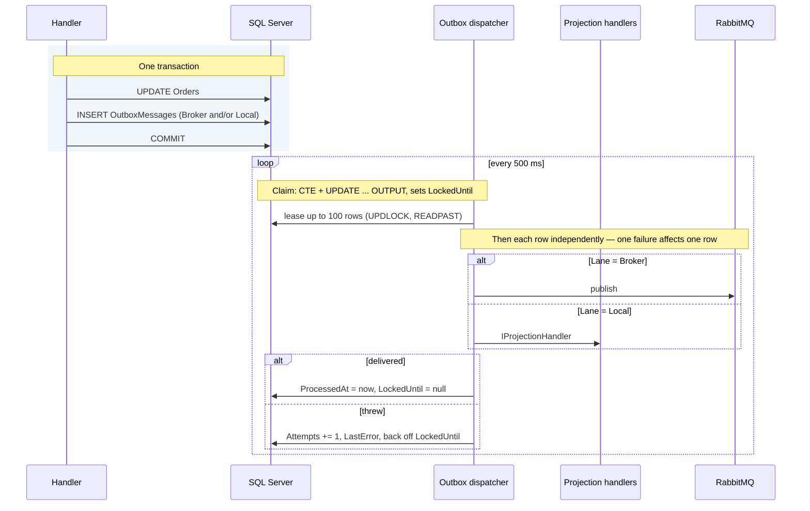
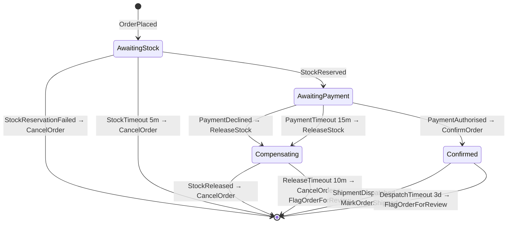

# 9. Messaging

## 9.1 Integration events

Integration events are the public contract of a service. They are published
facts about the past, and they must be boring: primitives, no domain types, no
behaviour, no assumptions about the consumer.

The three envelope fields every event carries are an interface, not a
convention — the consumer adapter needs `OccurredAt` to measure delivery lag
([§13.3](13-observability.md)) and cannot read it off an unconstrained type parameter:

```csharp
namespace Common.Contracts;

/// <summary>
/// Implemented by every integration event. No behaviour and no domain types —
/// three primitives, which is what keeps this legal under §9.6's rule that a
/// contract may not name a domain type.
/// </summary>
public interface IIntegrationEvent
{
    Guid MessageId { get; }
    Guid CorrelationId { get; }
    DateTimeOffset OccurredAt { get; }
}
```

> **`MessageId` here is *the* message id, not a second one.** The envelope's
> value is what `Stage` writes to the outbox row (§9.4), what the dispatcher
> puts on the transport, what MassTransit's header carries, and therefore what
> the inbox dedupes on (§9.5). Body, row, header and inbox key are one GUID.
>
> That has to be stated because the alternative is so easy to write and so hard
> to see: a `Guid.CreateVersion7()` in `Stage` would compile, work, and give
> every event two identities — one a consumer reads out of the payload, one the
> broker and the inbox use. Nothing fails. The cost arrives during an incident,
> when the id in the application log cannot be found in the inbox table, and
> the answer to "was this message processed?" becomes "which id do you mean?".
>
> `CorrelationId` follows the same rule for the same reason. The mapper decides
> it (§9.3 sets it from the order) precisely because a business correlation is
> more useful across a saga than an ambient request id, and a second value
> assigned at staging time would quietly replace that choice.

```csharp
namespace Common.Contracts.Ordering.V1;

public sealed record OrderConfirmed : IIntegrationEvent
{
    public required Guid MessageId { get; init; }
    public required Guid CorrelationId { get; init; }
    public required DateTimeOffset OccurredAt { get; init; }

    public required Guid OrderId { get; init; }
    public required Guid CustomerId { get; init; }
    public required decimal TotalAmount { get; init; }
    public required string Currency { get; init; }
    public required IReadOnlyList<ConfirmedLine> Lines { get; init; }
    public required ShippingAddressV1 ShippingAddress { get; init; }
}

public sealed record ConfirmedLine(Guid ProductId, int Quantity, decimal UnitPrice);
```

`OrderPlaced` is the other contract worth writing out, because it is what the
fulfilment saga starts on (§9.6) and what `ReserveStock` draws its lines from:

```csharp
namespace Common.Contracts.Ordering.V1;

public sealed record OrderPlaced : IIntegrationEvent
{
    public required Guid MessageId { get; init; }
    public required Guid CorrelationId { get; init; }
    public required DateTimeOffset OccurredAt { get; init; }

    public required Guid OrderId { get; init; }
    public required Guid CustomerId { get; init; }
    public required decimal TotalAmount { get; init; }
    public required string Currency { get; init; }
    public required IReadOnlyList<PlacedLine> Lines { get; init; }
}

public sealed record PlacedLine(Guid ProductId, int Quantity, decimal UnitPrice);
```

Catalog's three follow the same shape and the same interface — they are what
Ordering's projection endpoint consumes (§9.8), and `IntegrationEventConsumer<T>`
will not compile against a type that lacks it:

```csharp
namespace Common.Contracts.Catalog.V1;

public sealed record PriceChanged : IIntegrationEvent
{
    public required Guid MessageId { get; init; }
    public required Guid CorrelationId { get; init; }
    public required DateTimeOffset OccurredAt { get; init; }

    public required Guid ProductId { get; init; }
    public required decimal Amount { get; init; }
    public required string Currency { get; init; }
}

// ProductPublished and ProductDiscontinued repeat the same three envelope
// members and add their own — listed in Appendix D.5, because §6.6's
// projections read them and a member no declaration and no inventory covers
// is how a sample stops being checkable. The envelope is written out on every
// contract rather than inherited from a base record: a shared base is a shared
// versioning fate (§9.2), and three properties is a cheaper price than that.
```

> **The constraint is the enforcement, and no test is needed for it.** A new
> event without `IIntegrationEvent` fails to compile the moment somebody binds
> a consumer to it — which is the only moment it starts mattering. Commands
> (`CancelOrder`, `ReserveStock`) deliberately do not implement it: they are
> routed by `CommandConsumer` (§9.4), they carry no envelope in the body, and
> their `MessageId` is the transport's.

> **Each contract owns its line type.** `PlacedLine` and `ConfirmedLine` have
> identical shapes today, and sharing one record would be the obvious economy.
> It is the wrong one: a field added to `OrderConfirmed`'s lines would silently
> change `OrderPlaced`'s payload, and the two contracts would have to version
> together — the coupling §9.2 exists to prevent. Duplication between published
> contracts is deliberate, for the same reason duplication between bounded
> contexts is ([§4.3](04-solution-structure.md)).

**Design guidance for event payloads.** There is a real trade-off between thin
events (ID only, consumer calls back for detail) and fat events (everything a
consumer might need). Thin events keep the contract small but reintroduce
synchronous coupling on the consume path. Fat events are self-contained but
duplicate data and grow over time.

This blueprint uses **fat-enough events**: carry the data consumers actually
need to act, established by asking them, not by guessing. `OrderConfirmed`
includes the shipping address because Shipping cannot function without it and
should not call back to Ordering to get it.

## 9.2 Versioning

Contracts live in a versioned namespace: `Common.Contracts.Ordering.V1`.

**Additive changes** — new optional fields — do not require a version bump.
Consumers deserialising an unknown field ignore it.

**Breaking changes** — removing a field, renaming, changing a type, changing
semantics — require a new version. The publisher then emits both V1 and V2 for a
deprecation window, consumers migrate independently, and V1 is retired once
telemetry confirms no consumer remains on it.

There is no shortcut here. A "just this once" breaking change to a live contract
means a coordinated deploy, and coordinated deploys are the thing this
architecture exists to avoid.

## 9.3 Domain event → integration event: the allow-list mapper

[§5.5](05-tactical-ddd.md) states the principle — never publish a domain event to the bus. This is the
mechanism that makes it structural rather than aspirational.

Translation is **opt-in**. A mapper registry names each domain event type that
becomes an integration event, and how. Everything unregistered is local-only.

**Who calls this:** the mapper and publisher below are invoked by
`DomainEventDispatcher` ([§7.5](07-persistence.md)), not by command handlers. A handler that calls
either of them directly is a bug: the dispatcher runs at the single point where
every aggregate has finished changing, and a handler that stages earlier
serialises a snapshot the rest of the handler can still move on from. The
payload is written at `StageAsync` (the port below), not at commit, so a total adjusted
two lines later commits an outbox row that disagrees with the row beside it.
Both leave the transaction together and only one of them is right.

**The port is common; only the allow-list is per-service.** `DomainEventDispatcher`
([§7.5](07-persistence.md)) injects `IIntegrationEventMapper`, and common code cannot name a
per-service type — the same split this section already applies to
`IIntegrationEventPublisher` below.

```csharp
namespace Common.Application;

public interface IIntegrationEventMapper
{
    IReadOnlyList<object> Map(IReadOnlyList<IDomainEvent> domainEvents);
}
```

```csharp
namespace Ordering.Application.Integration;

internal sealed class OrderingIntegrationEventMapper : IIntegrationEventMapper
{
    // The allow-list. A domain event absent from this dictionary never
    // reaches the bus — by construction, not by review.
    private static readonly Dictionary<Type, Func<IDomainEvent, object>> Registry = new()
    {
        // Domain type in, contract type out. The suffix (§5.5) is what makes
        // that visible — with one name for both, this reads as identity.
        [typeof(OrderPlacedDomainEvent)] = e => ToContract((OrderPlacedDomainEvent)e),
        [typeof(OrderConfirmedDomainEvent)] = e => ToContract((OrderConfirmedDomainEvent)e),
        [typeof(OrderCancelledDomainEvent)] = e => ToContract((OrderCancelledDomainEvent)e),
        // OrderStockConfirmedDomainEvent is deliberately absent — internal only.
    };

    // V1.OrderPlaced, not OrderPlacedDomainEvent: Money is decomposed into a
    // decimal and an ISO code, because a contract may not carry domain types.
    private static V1.OrderPlaced ToContract(OrderPlacedDomainEvent e) => new()
    {
        MessageId = Guid.CreateVersion7(),
        CorrelationId = e.OrderId.Value,
        OccurredAt = e.OccurredAt,
        OrderId = e.OrderId.Value,
        CustomerId = e.CustomerId.Value,
        TotalAmount = e.Total.Amount,
        Currency = e.Total.Currency,
        // PlacedLine, not ConfirmedLine — OrderPlaced owns its own line type
        // so the two contracts can version independently (§9.1).
        Lines = [.. e.Lines.Select(l => new V1.PlacedLine(l.ProductId.Value, l.Quantity, l.UnitPrice.Amount))]
    };

    public IReadOnlyList<object> Map(IReadOnlyList<IDomainEvent> domainEvents)
    {
        List<object> mapped = [];

        foreach (IDomainEvent domainEvent in domainEvents)
        {
            if (!Registry.TryGetValue(domainEvent.GetType(), out Func<IDomainEvent, object> map))
                continue;                       // Unregistered → local-only. Not an error.

            mapped.Add(map(domainEvent));       // Registered and throwing → fails the command.
        }

        return mapped;
    }
}
```

The two failure semantics are deliberately different, and the distinction is the
whole point:

| Case | Behaviour | Why |
|---|---|---|
| Domain event **not** in the registry | Skipped silently. No bus message, no failure. | Most domain events are internal. Failing on them would force every new event to be published or explicitly suppressed |
| Registered mapper **throws** | The command fails and the transaction rolls back | Someone declared this event must be published. If it cannot be, the state change must not stand either |

There is deliberately **no `MustPublish` flag** on domain events. If it must
reach the bus, register it. One mechanism, one place to look.

### The publisher contract

`IIntegrationEventPublisher` is an Application port, and its implementation is
constrained normatively:

```csharp
namespace Common.Application;

public enum OutboxLane
{
    /// <summary>Published to the message broker. A public contract.</summary>
    Broker,

    /// <summary>Dispatched in-process after commit to IProjectionHandler&lt;T&gt;.
    /// Never leaves the service and is not a contract.</summary>
    Local
}

public interface IIntegrationEventPublisher
{
    /// <summary>
    /// Stages a message for delivery after the current transaction commits.
    /// </summary>
    Task StageAsync(object message, OutboxLane lane, CancellationToken ct);
}
```

The implementation **must**:

- Write an outbox row on the **same `DbContext`** the command handler is using,
  so it enlists in the same transaction.

The implementation **must not**:

- Call the broker transport directly — `IBus.Publish` inside a handler
  reintroduces the dual-write the outbox exists to eliminate.
- Introduce a **second** outbox table set alongside the existing one. Two outbox
  implementations means two dispatchers, two retention policies, two sets of
  ordering guarantees, and one of them will be the one nobody monitors.

All three are mistakes a competent developer makes in good faith, which is why
they are prohibitions rather than guidance.

**One exemption: sagas.** A MassTransit state machine (§9.6) sends and publishes
directly from its activities rather than through this port. That is correct and
deliberate — a saga is Infrastructure, it already runs inside a consume
transaction with `UseInMemoryOutbox` configured on its receive endpoint, so its
outgoing messages are deferred until the consumer completes and its state
persists. Routing saga output through the application-level outbox would add a
second staging hop with no additional guarantee. The prohibition applies to
**Application code**, which is where the dual-write risk actually lives.

## 9.4 The transactional outbox

The core problem: a handler must change the database *and* publish a message.
These are two systems. Without care, the process can crash between them — the
order is placed but nobody is told, or the message is sent and the transaction
rolls back.

The outbox makes them one atomic operation by writing the message to the same
database, in the same transaction, and dispatching it afterwards.



```sql
CREATE TABLE ordering.OutboxMessages
(
    Id             BIGINT IDENTITY(1,1) PRIMARY KEY,
    MessageId      UNIQUEIDENTIFIER NOT NULL UNIQUE,
    CorrelationId  UNIQUEIDENTIFIER NOT NULL,
    MessageType    VARCHAR(300)     NOT NULL,
    Payload        NVARCHAR(MAX)    NOT NULL,
    Lane           VARCHAR(16)      NOT NULL,   -- 'Broker' | 'Local'
    OccurredAt     DATETIMEOFFSET   NOT NULL,
    ProcessedAt    DATETIMEOFFSET   NULL,
    Attempts       INT              NOT NULL,
    LastError      NVARCHAR(2000)   NULL,
    LockedUntil    DATETIMEOFFSET   NULL     -- lease; also carries retry backoff
);

-- The shape, not a script: this table is generated by EF from the entity
-- configuration, so every column is written on insert and none carries a
-- database default. `Attempts INT NOT NULL DEFAULT 0` read better here and
-- was not what shipped — a difference that matters only to a hand-written
-- INSERT, which nothing in this design performs.

-- Filtered index: the dispatcher only ever scans unprocessed rows, and the
-- index stays small regardless of table size.
CREATE INDEX IX_Outbox_Unprocessed
    ON ordering.OutboxMessages (OccurredAt)
    INCLUDE (Lane, Attempts, LockedUntil)
    WHERE ProcessedAt IS NULL;
```

`Lane` is what makes one table serve both after-commit destinations (§7.5).
`Broker` rows are published; `Local` rows are handed to in-process projection
handlers. Both get the same durability, the same retry accounting and the same
monitoring — which is the argument against a second, separate mechanism for
local reactions.

**Two types map to this table, deliberately.** The staging path writes whole
rows through EF Core; the dispatcher reads a narrow projection of the columns
its claim returns. Collapsing them into one type produces a class whose
`ProcessedAt` is always null on the read path and whose `LastError` is never
populated on the write path — see [Appendix D](appendix-d-type-inventory.md):

| Type | Used by | Shape |
|---|---|---|
| `OutboxMessage` | EF entity, `db.OutboxMessages` | All columns |
| `OutboxClaim` | Dapper, the dispatcher's `OUTPUT` projection | Id, MessageId, CorrelationId, MessageType, Payload, Lane, Attempts, OccurredAt |

```csharp
namespace Common.Infrastructure.Outbox;

public sealed class OutboxMessage
{
    public long Id { get; private set; }
    public Guid MessageId { get; private set; }
    public Guid CorrelationId { get; private set; }
    public string MessageType { get; private set; } = null!;
    public string Payload { get; private set; } = null!;
    public OutboxLane Lane { get; private set; }
    public DateTimeOffset OccurredAt { get; private set; }
    public DateTimeOffset? ProcessedAt { get; private set; }
    public int Attempts { get; private set; }
    public string? LastError { get; private set; }
    public DateTimeOffset? LockedUntil { get; private set; }

    public static OutboxMessage Stage(
        object message, OutboxLane lane, Guid correlationId,
        DateTimeOffset now, MessageTypeMap types, OutboxJson json) => new()
    {
        // One identity, not two. An integration event already carries its
        // MessageId and CorrelationId in the envelope the mapper filled in
        // (§9.3), and DeliverAsync copies the row's values onto the transport —
        // so minting a second GUID here would give the body one id and the
        // broker header another. The inbox dedupes on the transport id (§9.5),
        // which would then disagree with the id a support tool reads out of the
        // payload, and the only way to notice is to compare two logs.
        //
        // A Local-lane row carries a domain event, which has no envelope and
        // never reaches a broker, so the row mints both.
        MessageId = message is IIntegrationEvent e ? e.MessageId : Guid.CreateVersion7(),
        CorrelationId = message is IIntegrationEvent c ? c.CorrelationId : correlationId,
        MessageType = types.NameOf(message.GetType()),
        Payload = JsonSerializer.Serialize(message, message.GetType(), json.Options),
        Lane = lane,
        OccurredAt = now
    };
}

/// <summary>
/// Dapper projection of the claim's OUTPUT clause. Read-only, and its members
/// must match that clause exactly — Dapper binds by name and leaves an
/// unmatched member at its default, so a column added here and not there is a
/// DateTimeOffset.MinValue nobody notices until a metric reads 55 years.
/// </summary>
public sealed record OutboxClaim(
    long Id,
    Guid MessageId,
    Guid CorrelationId,
    string MessageType,
    string Payload,
    string Lane,
    int Attempts,
    DateTimeOffset OccurredAt);
```

### The type name is a persisted contract

`MessageType` is written by one deployment and read by another. That makes the
obvious implementation — `AssemblyQualifiedName` out, `Type.GetType` back —
wrong in a way that only shows in production:

```
Ordering.Domain.Orders.OrderPlacedDomainEvent, Ordering.Domain,
Version=1.0.0.0, Culture=neutral, PublicKeyToken=null
```

Every row carries the assembly version that staged it. Bump it — which a release
pipeline does automatically — and `Type.GetType` returns `null` for every row
written before the deploy. The dispatcher then exhausts its attempts on a batch
of perfectly good messages and abandons them. Nothing is lost, nothing is
delivered, and the only symptom is outbox depth climbing after a release that
looked clean. Trimming, single-file publish and moving a type between assemblies
break it the same way.

The fix is a name the code chooses rather than one the runtime computes:

```csharp
namespace Common.Infrastructure.Outbox;

/// <summary>
/// The assemblies whose events may be staged. Mutable and resolved before the
/// map, so a test host can add its own without replacing the registration —
/// the production assemblies are always in the list (§4.2).
/// </summary>
public sealed class MessageTypeSource(params Assembly[] assemblies)
{
    private readonly List<Assembly> _assemblies = [.. assemblies];

    public IEnumerable<Assembly> Assemblies => _assemblies;

    public MessageTypeSource Add(Assembly assembly)
    {
        _assemblies.Add(assembly);
        return this;
    }
}

/// <summary>
/// Two-way map between a stageable type and its persisted name. Built from the
/// source above, so it cannot list a name for a type that no longer exists —
/// and, being a singleton built at startup, a duplicate name fails the host
/// rather than the first message.
/// </summary>
public sealed class MessageTypeMap
{
    private readonly FrozenDictionary<string, Type> _byName;
    private readonly FrozenDictionary<Type, string> _byType;

    public MessageTypeMap(IEnumerable<Assembly> assemblies)
    {
        // FullName, not AssemblyQualifiedName: namespace and type name, no
        // version and no assembly. For contracts the namespace is already
        // versioned (§9.2), so this IS the contract. For domain events it is
        // internal, and a rename is then a migration the team chose rather than
        // one a build number made for it.
        (string Name, Type Type)[] pairs =
        [
            .. assemblies
                .SelectMany(a => a.GetTypes())
                .Where(t => t is { IsClass: true, IsAbstract: false } &&
                    (t.IsAssignableTo(typeof(IIntegrationEvent)) ||
                        t.IsAssignableTo(typeof(IDomainEvent))))
                .Select(t => (Name: t.FullName!, Type: t))
        ];

        IGrouping<string, (string Name, Type Type)>? clash =
            pairs.GroupBy(p => p.Name).FirstOrDefault(g => g.Count() > 1);
        if (clash is not null)
            throw new InvalidOperationException(
                $"Two staged types share the name '{clash.Key}'. The outbox " +
                "column cannot distinguish them.");

        _byName = pairs.ToFrozenDictionary(p => p.Name, p => p.Type);
        _byType = pairs.ToFrozenDictionary(p => p.Type, p => p.Name);
    }

    public string NameOf(Type type) =>
        _byType.TryGetValue(type, out string? name) ? name
            : throw new InvalidOperationException(
                $"{type.Name} is not a stageable message type. Staging it would " +
                "write a row the dispatcher cannot resolve.");

    /// <summary>The Local lane's payload types — §12.4 round-trips each.</summary>
    public IEnumerable<Type> StageableDomainEvents =>
        _byType.Keys.Where(t => t.IsAssignableTo(typeof(IDomainEvent)));

    public Type Resolve(string name) =>
        _byName.TryGetValue(name, out Type? type) ? type
            : throw new InvalidOperationException(
                $"Unknown message type '{name}'. A type was renamed or removed " +
                "while rows naming it were still unprocessed — drain the outbox " +
                "before deleting a message type (§7.4).");
}
```

Both directions throw, and both throw at the point of the mistake. `NameOf`
fails when something unstageable is staged — in the transaction, so the command
fails rather than the outbox filling with rows nobody can deliver. `Resolve`
fails on the dispatcher, where the message that names a departed type is the one
that lands in the retry log with its own name in it.

> **A renamed message type is a migration.** The rule that follows from this map
> is the one nobody remembers under deadline: a type may not be renamed or
> deleted while unprocessed rows still name it. Deploy the rename in one release
> with both names resolving to the same type, drain, then remove the old name in
> the next — the same shape as every backward-compatible schema change (ADR-007).

### The payload is a persisted format too

The name is half of it. `Payload` is JSON written by one deployment and read by
another, and on the `Local` lane it holds a **domain event** — a type §5.5
explicitly describes as "free to change with the code". Both statements are
true and together they are a trap: a member renamed between the stage and the
deliver silently deserialises to its default, because that is what
`System.Text.Json` does with a property it cannot match.

Two rules, and one registration that makes the first checkable:

```csharp
namespace Common.Infrastructure.Outbox;

/// <summary>
/// One instance, registered as a singleton, resolved by both sides. Staging
/// and delivering must agree, and the way they stop agreeing is one of them
/// picking up a host-wide default that was changed for an API's benefit.
/// </summary>
public sealed class OutboxJson
{
    public OutboxJson(IEnumerable<JsonConverter> converters)
    {
        Options = new JsonSerializerOptions
        {
            // Explicitly the defaults that matter, rather than inherited ones:
            // property names as declared, numbers as numbers, no case-insensitive
            // rescue on the way back in — a payload that only round-trips because
            // matching is lenient is a payload that will not survive a rename.
            PropertyNamingPolicy = null,
            PropertyNameCaseInsensitive = false,
            NumberHandling = JsonNumberHandling.Strict
        };

        foreach (JsonConverter converter in converters)
            Options.Converters.Add(converter);

        // Frozen at construction, because the instance is reached from a
        // background service and from every command scope at once and
        // JsonSerializerOptions is only thread-safe once it is read-only.
        // populateMissingResolver, because freezing is a promise that nothing
        // more will be discovered — the reflection-based default has to be
        // attached here rather than on first use.
        Options.MakeReadOnly(populateMissingResolver: true);
    }

    public JsonSerializerOptions Options { get; }
}
```

**Domain events on the `Local` lane must round-trip through this instance**, and
that is asserted in [§12.4](12-test-strategy.md) — `Every_stageable_domain_event_round_trips_through_the_outbox_options`,
written out there with the other outbox tests. It does **not** join §12.6's
contract suite, which selects on the `Common.Contracts.` namespace and so can
never see a domain event, by the same rule that keeps domain types out of
contracts.

The assertion catches the private constructor, the computed-property-with-no-setter
and the interface-typed member on the day it is introduced rather than on the
day a deploy happens to land mid-batch.

> **A value object needs a converter, and the service's Infrastructure owes it.**
> §5.3's `Money` is a `readonly record struct` with a private constructor and
> two get-only properties, and `System.Text.Json` does not refuse that shape —
> a struct always has a parameterless constructor, so it builds the default,
> finds no setter to call, and returns `Amount = 0` with a null `Currency`.
> Every domain event carrying one deserialises to nonsense on this lane.
>
> The domain must not fix it. A `[JsonConstructor]` puts `System.Text.Json` in
> a domain assembly, which §4.2's allow-list gate forbids by name; making the
> constructor public gives up the always-valid principle §5.3 is built on, and
> does not even work — for a struct the implicit parameterless constructor
> wins, so a public parameterised one is never selected. What does work is a
> `JsonConverter<Money>` registered by the service's Infrastructure, beside the
> `ComplexProperty` mapping that already turns the same type into two columns.
> Same layer, same reason, and the domain type knows about neither.
>
> This is why `OutboxJson` takes its converters rather than declaring options
> and nothing else: the converters are half of what "both sides agree" means,
> and a static field could only ever have said the other half.

**And a renamed member is a migration, exactly as a renamed type is.** The drain
rule above covers both: unprocessed rows name types *and* describe shapes, and
the outbox is empty for a few seconds many times a day. Draining before a rename
costs nothing; discovering afterwards that yesterday's rows deserialise with a
`Total` of zero costs an afternoon and a corrected read model.

> **The alternative — stage a DTO instead of the domain type — was considered
> and rejected.** It would decouple the persisted shape from the domain, at the
> price of a second type per event, a mapper, and a place for the two to
> disagree. The `Local` lane is drained in seconds, which is what makes the
> cheaper option viable: the exposure is one batch, not one release cycle.
> That reasoning stops holding the moment the lane backs up for hours, so if the
> §13.6 outbox-age alert becomes routine rather than exceptional, revisit this
> before the backlog makes the decision for you.

The dispatcher runs as a background service in two phases: an atomic **claim**
that leases a batch of rows, then **per-row delivery** where each message
succeeds or fails on its own.

> **Every row is delivered and accounted for independently.** Wrapping a whole
> batch in one transaction is the obvious implementation and is wrong: a single
> failing projection would roll back the batch and block every healthy `Broker`
> row behind it, so a read-model bug in this service would stop publishing to
> every other service. The lanes can only be alerted on separately (§13.6) if
> they can actually fail separately.

The dispatcher lives in `Common.Infrastructure`, so its three statements
cannot name a schema — `ordering.` below is what the sample would be in
Ordering's assembly, and there is no such assembly. The schema is a registered
value instead:

```csharp
namespace Common.Infrastructure.Outbox;

/// <summary>
/// Where this service's outbox lives. Shape-checked on construction, because
/// the schema is interpolated into the statements below rather than
/// parameterised — a schema cannot be a parameter, and what cannot be a
/// parameter has to be a value the type refuses to hold wrongly.
/// </summary>
public sealed partial class OutboxTable
{
    public OutboxTable(string schema)
    {
        if (!Identifier().IsMatch(schema))
            throw new ArgumentException(
                $"'{schema}' is not a SQL identifier, and the schema is interpolated " +
                "into the dispatcher's statements rather than parameterised.",
                nameof(schema));

        QualifiedName = $"{schema}.OutboxMessages";
        Schema = schema;
    }

    public string Schema { get; }

    public string QualifiedName { get; }

    [GeneratedRegex(@"^[A-Za-z_][A-Za-z0-9_]*$")]
    private static partial Regex Identifier();
}
```

> **The alternative is a dispatcher per service, and that is §9.3's prohibition
> on a second outbox table set arriving by the back door.** Two dispatchers
> means two retention policies, two sets of ordering guarantees, and one of
> them being the one nobody monitors.

```csharp
public sealed class OutboxDispatcher : BackgroundService
{
    private const int MaxAttempts = 10;

    // Compiled once rather than parsed per call. CA1848 is enforced by ADR-019
    // and this loop runs twice a second — see §13.3's LoggingBehavior, which
    // takes the same shape for the same reason.
    private static readonly Action<ILogger, Exception?> ClaimFailed =
        LoggerMessage.Define(
            LogLevel.Error,
            new EventId(1, nameof(ClaimFailed)),
            "Outbox claim failed; retrying next tick.");

    private static readonly Action<ILogger, Guid, OutboxLane, int, int, Exception?> DeliveryFailed =
        LoggerMessage.Define<Guid, OutboxLane, int, int>(
            LogLevel.Error,
            new EventId(2, nameof(DeliveryFailed)),
            "Outbox message {MessageId} on lane {Lane} failed, attempt {Attempt} of {Max}.");

    private readonly IServiceScopeFactory _scopes;
    private readonly ILogger<OutboxDispatcher> _log;

    // Composed once from the registered table. Instance fields rather than
    // consts for that reason and no other.
    private readonly string _claimSql;
    private readonly string _completeSql;
    private readonly string _failSql;

    public OutboxDispatcher(IServiceScopeFactory scopes, OutboxTable table, ILogger<OutboxDispatcher> log)
    {
        _scopes = scopes;
        _log = log;

        // Atomic claim: selects and leases in one statement, so two replicas
        // cannot take the same row. READPAST skips rows another replica holds.
        _claimSql =
            $"""
            WITH claimable AS (
                SELECT TOP (100) *
                FROM {table.QualifiedName} WITH (UPDLOCK, READPAST, ROWLOCK)
                WHERE ProcessedAt IS NULL
                    AND Attempts < @MaxAttempts
                    AND (LockedUntil IS NULL OR LockedUntil < SYSDATETIMEOFFSET())
                ORDER BY OccurredAt
            )
            UPDATE claimable
            SET LockedUntil = DATEADD(second, 60, SYSDATETIMEOFFSET())
            OUTPUT
                inserted.Id,
                inserted.MessageId,
                inserted.CorrelationId,
                inserted.MessageType,
                inserted.Payload,
                inserted.Lane,
                inserted.Attempts,
                inserted.OccurredAt;
            """;

        _completeSql =
            $"""
            UPDATE {table.QualifiedName}
            SET ProcessedAt = SYSDATETIMEOFFSET(), LockedUntil = NULL
            WHERE Id = @Id;
            """;

        // Increments the attempt counter and backs off exponentially by
        // pushing the lease forward. This is what makes the cap — and the
        // abandoned-row alert in §13.6 — reachable.
        _failSql =
            $"""
            UPDATE {table.QualifiedName}
            SET
                Attempts    = Attempts + 1,
                LastError   = LEFT(@Error, 2000),
                LockedUntil = DATEADD(
                    second,
                    POWER(2, CASE WHEN Attempts > 8 THEN 8 ELSE Attempts END) * 5,
                    SYSDATETIMEOFFSET())
            WHERE Id = @Id;
            """;
    }

    // stoppingToken, not ct: CA1725 requires an override to keep the base's
    // parameter name (ADR-019 makes it an error), and a reader consulting
    // BackgroundService's documentation is reading about that one.
    protected override async Task ExecuteAsync(CancellationToken stoppingToken)
    {
        using PeriodicTimer timer = new(TimeSpan.FromMilliseconds(500));

        while (await timer.WaitForNextTickAsync(stoppingToken))
        {
            try
            {
                await ProcessBatchAsync(stoppingToken);
            }
            catch (Exception ex) when (ex is not OperationCanceledException)
            {
                // The claim itself failed — database unreachable. Next tick.
                ClaimFailed(_log, ex);
            }
        }
    }

    /// <summary>
    /// One claim-and-deliver pass. Returns the number of rows completed.
    /// Public so tests drive it directly instead of racing a timer — see §12.4.
    /// </summary>
    public async Task<int> ProcessBatchAsync(CancellationToken ct)
    {
        await using AsyncServiceScope scope = _scopes.CreateAsyncScope();
        IServiceProvider sp = scope.ServiceProvider;

        // Disposed every pass — the loop runs twice a second, so a leaked
        // connection here exhausts the pool within a minute.
        using IDbConnection connection =
            sp.GetRequiredService<IDbConnectionFactory>().Create();

        // OutboxClaim, not OutboxMessage — the claim projects only the columns
        // the OUTPUT clause returns. See Appendix D.
        List<OutboxClaim> claimed =
            [.. await connection.QueryAsync<OutboxClaim>(_claimSql, new { MaxAttempts })];

        int completed = 0;

        foreach (OutboxClaim message in claimed)
        {
            try
            {
                await DeliverAsync(sp, message, ct);
                await connection.ExecuteAsync(_completeSql, new { message.Id });
                completed++;
            }
            catch (Exception ex) when (ex is not OperationCanceledException)
            {
                // One bad message does not affect the other 99.
                await connection.ExecuteAsync(_failSql, new { message.Id, Error = ex.ToString() });

                DeliveryFailed(_log, message.MessageId, message.Lane, message.Attempts + 1, MaxAttempts, ex);
            }
        }

        return completed;
    }

    private static async Task DeliverAsync(IServiceProvider sp, OutboxClaim message, CancellationToken ct)
    {
        // Through the map, not Type.GetType: the column holds a name this code
        // chose, and it has to survive the version bump of the assembly that
        // wrote it.
        Type type = sp
            .GetRequiredService<MessageTypeMap>()
            .Resolve(message.MessageType);
        // The same registered instance Stage wrote through, converters
        // included — which is what "both sides must agree" means now that a
        // value object's shape depends on one.
        object payload = JsonSerializer.Deserialize(
            message.Payload,
            type,
            sp.GetRequiredService<OutboxJson>().Options)!;

        if (message.Lane is "Broker")
        {
            await sp.GetRequiredService<IPublishEndpoint>().Publish(payload, type, c =>
            {
                c.MessageId = message.MessageId;
                c.CorrelationId = message.CorrelationId;
            }, ct);
            return;
        }

        // Local lane: this service's own projection handlers, running safely
        // outside the write transaction that produced the event (§7.5).
        // OccurredAt comes from the row, not the payload: the invoker is
        // generic and unconstrained, so it has no typed access to a member the
        // payload may or may not have (§13.3). It is the time the aggregate
        // raised the event — Stage() is called inside the write transaction —
        // so the lag §13.7 measures includes the commit, which is the honest
        // reading of "how stale is this read model".
        await ProjectionInvoker.InvokeAllAsync(sp, payload, type, message.OccurredAt, ct);
    }
}
```

`ProjectionInvoker` resolves and calls the handlers for a runtime type. It uses
the same cached-delegate approach as the dispatcher in [§6.2](06-cqrs.md), so the reflection
cost is paid once per event type rather than once per message:

```csharp
internal static class ProjectionInvoker
{
    private static readonly ConcurrentDictionary<Type, Invoker> Cache = new();

    public static Task InvokeAllAsync(
        IServiceProvider sp,
        object payload,
        Type eventType,
        DateTimeOffset occurredAt,
        CancellationToken ct) =>
        Cache
            .GetOrAdd(eventType, static t => (Invoker)Activator.CreateInstance(typeof(Invoker<>).MakeGenericType(t))!)
            .InvokeAllAsync(sp, payload, occurredAt, ct);

    private abstract class Invoker
    {
        public abstract Task InvokeAllAsync(
            IServiceProvider sp, object payload,
            DateTimeOffset occurredAt, CancellationToken ct);
    }

    private sealed class Invoker<TEvent> : Invoker
    {
        public override async Task InvokeAllAsync(
            IServiceProvider sp, object payload,
            DateTimeOffset occurredAt, CancellationToken ct)
        {
            IProjectionHandler<TEvent>[] handlers = [.. sp.GetServices<IProjectionHandler<TEvent>>()];

            // A Local row is staged only when IProjectionRegistry found a
            // handler (§7.5). Finding none here means the handler was
            // implemented but never registered — fail loudly rather than
            // marking the row processed having done nothing.
            if (handlers.Length == 0)
                throw new InvalidOperationException(
                    $"No IProjectionHandler<{typeof(TEvent).Name}> is registered, " +
                    "but a Local outbox row was staged for it. Check the §6.2 scan.");

            // Sequential, not concurrent: two projections writing the same read
            // table in parallel is a deadlock waiting for load to find it.
            foreach (IProjectionHandler<TEvent> handler in handlers)
                await handler.HandleAsync((TEvent)payload, ct);

            // Raised-to-applied (§13.7), recorded after the handlers rather
            // than before: the SLO is about when the read model became
            // correct, not when work on it started. Resolved from sp because
            // this type is static and cached — it has no constructor to inject.
            sp.GetRequiredService<MessagingMetrics>().Projected(
                typeof(TEvent).Name,
                sp.GetRequiredService<TimeProvider>().GetUtcNow() - occurredAt);
        }
    }
}
```

If any handler throws, the exception propagates to the per-row `catch` above and
the whole row is retried — meaning **every** handler for that event runs again.
That is the reason §6.6 insists projections are idempotent; with more than one
handler per event it is not a theoretical concern.

Consequences of the per-row design worth stating explicitly:

- **A message that keeps failing reaches `Attempts = 10` and stops being
  claimed.** It stays in the table with `ProcessedAt` still `NULL` and its
  `LastError` populated, which is exactly what the abandoned-row alert (§13.6)
  detects and what `outbox-abandoned.md` tells the operator to read. Replaying
  it is a matter of resetting `Attempts` to zero.
- **The retention purge must delete only rows with `ProcessedAt IS NOT NULL`.**
  Purging on age alone would silently destroy the abandoned rows that the alert
  exists to surface.
- **Strict global ordering is not guaranteed.** Rows are claimed in `OccurredAt`
  order, but a failed message backs off while later ones proceed, and multiple
  replicas run concurrently. Consumers must not assume ordering — which the
  out-of-order guard in §6.6 already assumes they cannot.
- **The 60-second lease bounds crash recovery.** If a dispatcher dies mid-batch,
  its claimed rows become available again a minute later rather than being stuck
  behind a lock that no longer has an owner.

### Handler contracts

Three handler interfaces exist, and confusing them is the most likely mistake in
this area. They differ by where the message came from:

```csharp
namespace Common.Application;

/// <summary>
/// Reacts to this service's OWN events after commit, via the Local outbox lane.
/// Read-model projections, local cache invalidation. Never a public contract.
/// </summary>
public interface IProjectionHandler<in TEvent>
{
    Task HandleAsync(TEvent domainEvent, CancellationToken ct);
}

/// <summary>
/// Reacts to an integration event published by ANOTHER service, delivered by
/// the broker. Invoked by the consumer adapter below, behind the inbox filter.
/// </summary>
public interface IIntegrationEventHandler<in TEvent> where TEvent : class
{
    Task HandleAsync(TEvent integrationEvent, CancellationToken ct);
}
```

### Empty is a decision, not a default

Five places resolve handlers as a collection, and `GetServices<T>()` returning
nothing is the one failure this architecture cannot detect structurally — it
looks exactly like "nothing to do". Each site therefore states which it means:

| Site | Empty means | Behaviour |
|---|---|---|
| `ValidationBehavior` (§6.3) | most commands have no validator | proceed |
| `IProjectionRegistry` (§7.5) | this event has no projection — the question being asked | return false, stage no `Local` row |
| `ProjectionInvoker` (§9.4) | a `Local` row was staged, so a handler was found earlier | **throw** |
| `IntegrationEventConsumer` (§9.4) | the endpoint binds this type, so something should handle it | **throw** |
| `Dispatcher` (§6.2) | no behaviours — never valid, nothing would ever commit | prevented by explicit registration + test (§6.3) |

The two that throw are the two where an empty list is reachable only through
misconfiguration *and* where silence destroys data: an acked broker message is
suppressed by the inbox forever, and a completed `Local` row is never retried.

| Interface | Source | Delivery | Retry |
|---|---|---|---|
| `ICommandHandler<,>` | HTTP request | Dispatcher, in transaction | None — the caller retries |
| `ICommandHandler<,>` | Command **message** | Broker → `CommandConsumer` → dispatcher, in transaction | Broker redelivery |
| `IProjectionHandler<>` | Own domain event | Local outbox lane, after commit | Outbox `Attempts` |
| `IIntegrationEventHandler<>` | Another service's **event** | Broker → `IntegrationEventConsumer` → inbox | Broker redelivery |

`ICommandHandler` appears twice deliberately: a command is the same application
operation whether a user submitted it or a saga sent it, and it must not grow a
second implementation because of how it arrived.

The bridge from the broker to `IIntegrationEventHandler` is a single generic
MassTransit consumer. This is the only place a MassTransit type meets
application code, which is what ADR-014 depends on:

```csharp
namespace Ordering.Infrastructure.Messaging;

public sealed class IntegrationEventConsumer<TEvent>(
    IEnumerable<IIntegrationEventHandler<TEvent>> handlers,
    MessagingMetrics metrics,
    TimeProvider clock)
    : IConsumer<TEvent>
    where TEvent : class, IIntegrationEvent
{
    public async Task Consume(ConsumeContext<TEvent> context)
    {
        // Publish-to-consume lag, read straight off the message (§13.3). The
        // IIntegrationEvent constraint is what makes OccurredAt reachable here
        // — without it this method sees only `object`-shaped generics.
        metrics.Delivered(typeof(TEvent).Name, clock.GetUtcNow() - context.Message.OccurredAt);

        // Configuring this consumer for TEvent is a statement that something
        // handles TEvent. Zero handlers is a misconfiguration, and acking the
        // message would be worse here than anywhere else: the inbox filter
        // (§9.5) commits its row once Consume returns, so redelivery is
        // suppressed and the message is gone for good. Throwing sends it to
        // retry and then the error queue, which §13.6 alerts on.
        if (!handlers.Any())
            throw new InvalidOperationException(
                $"No IIntegrationEventHandler<{typeof(TEvent).Name}> is registered, " +
                $"but {typeof(TEvent).Name} is bound on this endpoint. Check the §6.2 scan.");

        // Duplicate suppression happens in the inbox filter (§9.5), which is
        // configured on the receive endpoint ahead of this consumer.
        foreach (IIntegrationEventHandler<TEvent> handler in handlers)
            await handler.HandleAsync(context.Message, context.CancellationToken);
    }
}
```

Commands need the mirror of this. They arrive on their own queue, they are not
integration events, and they dispatch into the **application** pipeline rather
than to a projection handler — so a command that arrives by message goes through
exactly the same behaviours (§6.3) as one that arrives by HTTP:

```csharp
namespace Ordering.Infrastructure.Messaging;

/// <summary>
/// Bridges an inbound command message to the application dispatcher. TMessage
/// is a wire contract; TCommand is the application command it maps to.
/// </summary>
public sealed class CommandConsumer<TMessage, TCommand>(
    IDispatcher dispatcher,
    ICommandMessageMapper<TMessage, TCommand> mapper,
    MessagingMetrics metrics,
    ILogger<CommandConsumer<TMessage, TCommand>> log)
    : IConsumer<TMessage>
    where TMessage : class
    where TCommand : ICommand<Result>
{
    // Compiled once per closed consumer. CA1848 (ADR-019) again, and required
    // for the same reason as §13.3's LoggingBehavior: a consumer runs on every
    // message that arrives.
    private static readonly Action<ILogger, string, string, string, Guid?, Exception?> DomainRejected =
        LoggerMessage.Define<string, string, string, Guid?>(
            LogLevel.Warning,
            new EventId(1, nameof(DomainRejected)),
            "{MessageType} rejected by the domain: {ErrorCode} {ErrorDescription}. " +
            "CorrelationId {CorrelationId}.");

    public async Task Consume(ConsumeContext<TMessage> context)
    {
        // Mapping is explicit: the wire type is a contract, the command is an
        // application type, and CancelOrder.Reason is a string that has to be
        // parsed back into CancellationReason (§9.6).
        TCommand command = mapper.Map(context.Message);

        Result result =
            await dispatcher.SendAsync(command, context.CancellationToken);

        // A domain rejection is an answer, not a delivery failure. The message
        // was received, understood and refused, and no redelivery changes that
        // — so it is acked, counted and logged rather than thrown (§9.8).
        //
        // This is the last place that can tell a rejection from a fault. An
        // exception from the dispatcher propagates and MassTransit retries it,
        // which is correct: that is a fault. Everything below is the other case.
        if (result.IsFailure)
        {
            metrics.Rejected(typeof(TMessage).Name, result.Error.Code);

            DomainRejected(
                log,
                typeof(TMessage).Name,
                result.Error.Code,
                result.Error.Description,
                context.CorrelationId,
                null);
        }
    }
}
```

```csharp
// Commands Ordering accepts — §3.2's "Accepts" column. The queue name must
// match Endpoints.OrderingQueue in §9.6, or the saga sends into a void.
cfg.ReceiveEndpoint("ordering-commands", e =>
{
    e.UseMessageRetry(r =>
    {
        // A malformed contract does not parse itself on the fourth attempt.
        // Retrying it burns a minute of backoff and delays every message
        // behind it before reaching the same error queue.
        //
        // Domain rejections are not here because they never throw — the
        // consumer acks them (§9.8). This list is for faults that are terminal
        // rather than for outcomes that are not faults at all.
        r.Ignore<ContractMappingException>();

        r.Exponential(5, TimeSpan.FromSeconds(1), TimeSpan.FromMinutes(1), TimeSpan.FromSeconds(2));
    });
    e.UseInMemoryOutbox();
    e.UseConsumeFilter(typeof(InboxFilter<>), context);

    // One per command in §3.2's Accepts column. The saga sends four; a type
    // missing here is sent into a queue that ignores it.
    e.ConfigureConsumer<CommandConsumer<CancelOrder, CancelOrderCommand>>(context);
    e.ConfigureConsumer<CommandConsumer<ConfirmOrder, ConfirmOrderCommand>>(context);
    e.ConfigureConsumer<CommandConsumer<MarkOrderShipped, MarkOrderShippedCommand>>(context);
    e.ConfigureConsumer<CommandConsumer<FlagOrderForReview, FlagOrderForReviewCommand>>(context);
});
```

Inventory and Payments declare `inventory-commands` and `payments-commands` the
same way, for `ReserveStock`/`ReleaseStock` and `AuthorisePayment`
respectively. **Three queues are addressed by the saga (§9.6) and each needs a
receive endpoint in its owning service** — a command sent to an undeclared queue
is not an error, it is silence.

```csharp
// Consumer wiring only — the complete endpoint, with retry and the inbox
// filter, is in §9.8.
cfg.ReceiveEndpoint("ordering-catalog-events", e =>
{
    // One registration per event type this service subscribes to. The list
    // must match Ordering's Consumes column in §3.2 — a handler with no
    // registration here is never invoked, and looks correct while doing
    // nothing.
    e.ConfigureConsumer<IntegrationEventConsumer<ProductPublished>>(context);
    e.ConfigureConsumer<IntegrationEventConsumer<PriceChanged>>(context);
    e.ConfigureConsumer<IntegrationEventConsumer<ProductDiscontinued>>(context);
});
```

The outbox guarantees **at-least-once** delivery, never exactly-once. A crash
between publishing and marking processed republishes the message. This is
correct and expected — which is why consumers must be idempotent.

Retain processed rows for a few days for debugging, then delete them on a
schedule. An outbox table nobody prunes grows without bound and eventually
degrades the filtered index scan.

```sql
-- ProcessedAt IS NOT NULL is load-bearing, not defensive. Purging on age
-- alone would delete the abandoned rows (Attempts >= 10, never processed)
-- that the §13.6 alert exists to surface — turning permanent data loss into
-- a clean, empty table.
DELETE TOP (5000) FROM ordering.OutboxMessages
WHERE ProcessedAt IS NOT NULL
    AND ProcessedAt < DATEADD(day, -7, SYSDATETIMEOFFSET());
```

## 9.5 Idempotent consumers — the inbox

The consumer-side counterpart. Before handling a message, record its ID; if it
is already recorded, skip.

The inbox table lives in the **service's own database** alongside the outbox —
database-per-service (§7.1) applies to technical tables as much as business
ones, and a shared inbox would couple every consumer's deployment together.

```sql
CREATE TABLE ordering.InboxMessages
(
    MessageId   UNIQUEIDENTIFIER NOT NULL,
    Endpoint    VARCHAR(300)     NOT NULL,   -- receive endpoint, not message type
    HandledAt   DATETIMEOFFSET   NOT NULL,
    CONSTRAINT PK_InboxMessages PRIMARY KEY (MessageId, Endpoint)
);
```

The second key column is the **receive endpoint**, and that choice is the whole
point of the composite key. One service can legitimately bind the same message
type on more than one endpoint — a normal-priority queue and a bulk/replay
queue, say — and each must process the message independently. Keying on
`MessageId` alone would let whichever finished first suppress the other.

It must **not** be the message type. A message has exactly one type, so
`(MessageId, MessageType)` is functionally `(MessageId)` — a composite key that
looks meaningful and distinguishes nothing.

It is also not the *handler*. `IntegrationEventConsumer<T>` (§9.4) runs every
registered `IIntegrationEventHandler<T>` for the message, and one inbox row
covers them all — which is correct, because they succeed or fail together and
are retried together. Ordering's two `ProductPublished` handlers
(`OrderSummaryProjection` and `ProductPriceProjection`) share one row.

Retention is the same story as the outbox, and needs the same purge — an inbox
nobody prunes grows for the life of the service and its composite-key index
degrades with it:

```sql
-- Older than the broker's maximum redelivery window. Pruning sooner would
-- let a late redelivery through as if it were new, which is exactly the
-- duplicate this table exists to stop.
DELETE TOP (5000) FROM ordering.InboxMessages
WHERE HandledAt < DATEADD(day, -7, SYSDATETIMEOFFSET());
```

The window is a real constraint, not a round number: it must exceed the
broker's longest possible redelivery delay, including time a message spends in
the error queue before being replayed. Seven days is a starting point to check
against RabbitMQ's configured limits, not a default to accept.

Both purges — inbox and outbox (§9.4) — run from the same hosted service on a
slow schedule, batched so neither holds a long lock.

```csharp
namespace Common.Infrastructure.Inbox;

public sealed class InboxMessage(Guid messageId, string endpoint, DateTimeOffset handledAt)
{
    public Guid MessageId { get; private set; } = messageId;
    public string Endpoint { get; private set; } = endpoint;
    public DateTimeOffset HandledAt { get; private set; } = handledAt;
}
```

```csharp
// The service DbContext — not a separate one. Same database, one migration
// history, and EF-based handlers can share its transaction.
public sealed class InboxFilter<T>(OrderingDbContext db) : IFilter<ConsumeContext<T>>
    where T : class
{
    public async Task Send(ConsumeContext<T> context, IPipe<ConsumeContext<T>> next)
    {
        Guid messageId = context.MessageId ??
            throw new InvalidOperationException("Message has no MessageId.");

        // The queue this message arrived on — the same type on a different
        // endpoint is a different unit of work.
        string endpoint =
            context.ReceiveContext.InputAddress.AbsolutePath.TrimStart('/');

        bool alreadyHandled = await db.InboxMessages
            .AnyAsync(m => m.MessageId == messageId && m.Endpoint == endpoint);

        if (alreadyHandled)
            return;   // Silently drop the duplicate.

        db.InboxMessages.Add(new InboxMessage(messageId, endpoint, DateTimeOffset.UtcNow));

        // Ordering matters: the handler runs FIRST, and the inbox row is only
        // committed if it succeeded. Recording before would mark a message
        // handled that never was, losing it permanently on the next delivery.
        await next.Send(context);
        await db.SaveChangesAsync();
    }
}
```

> **The inbox is duplicate *suppression*, and only sometimes an atomic
> guarantee.** Whether the handler's work and the inbox record commit together
> depends entirely on how the handler writes:
>
> | Handler style | Atomic with the inbox row? |
> |---|---|
> | Writes through the injected `OrderingDbContext` | **Yes** — one `SaveChangesAsync`, one transaction |
> | Writes through `IDbConnectionFactory` + Dapper, like the projection in §6.6 | **No** — separate connection, separate transaction |
>
> For the second kind, a crash between `next.Send` returning and
> `SaveChangesAsync` committing leaves the work done and the message
> unrecorded, so redelivery runs it again.
>
> That is acceptable — but only because handlers are idempotent anyway. The
> inbox removes the *common* duplicate, not every duplicate. Treating it as a
> universal correctness guarantee rather than a partial optimisation is how
> at-least-once delivery quietly becomes at-most-once thinking.

Idempotency is easier still when the operation is naturally idempotent —
`MERGE`, `SET status = 'Confirmed'`, or an aggregate method that returns early
when already in the target state. Prefer that where the domain allows it; use
the inbox where it does not.

## 9.6 The order fulfilment saga

A saga coordinates a workflow across services without a distributed
transaction. Each step has a compensating action, and the saga's state is
persisted so the workflow survives a restart.



The diagram has exactly the states the machine declares and no others. Earlier
it showed `Cancelled` and `Shipped` as states; they are terminal *outcomes*, and
`SetCompletedWhenFinalized()` deletes the instance at that point, so a state
for them would be one no saga is ever observed in. A picture that shows states
the code does not have is a specification the code silently fails to meet —
which is how the missing payment timeout survived: the diagram claimed it.

Commands are contracts too, owned by the service that accepts them ([§3.2](03-bounded-contexts.md)), and
each owns its payload types:

```csharp
namespace Common.Contracts.Inventory.V1;

public sealed record ReserveStock(Guid OrderId, IReadOnlyList<StockLine> Lines);
public sealed record ReleaseStock(Guid OrderId);

// Not PlacedLine. Reserving stock needs no price, and Inventory's command must
// not have to change because Ordering versioned an event (§9.1).
public sealed record StockLine(Guid ProductId, int Quantity);
```

```csharp
namespace Common.Contracts.Payments.V1;

public sealed record AuthorisePayment(Guid OrderId, Guid CustomerId, decimal Amount, string Currency);
```

```csharp
namespace Common.Contracts.Ordering.V1;

// Reason is a STRING code, not Ordering's CancellationReason enum. A published
// contract carrying a domain type drags Ordering.Domain into every service that
// references the contract assembly (§9.1, §4.3) — and pins the enum's member
// names as wire format, so renaming one becomes a breaking change to everybody.
public sealed record CancelOrder(Guid OrderId, string Reason);

// Despatch is Shipping's fact; recording it on the order is Ordering's
// decision, so the saga sends a command rather than Ordering subscribing to
// ShipmentDispatched directly. The aggregate still enforces the transition.
public sealed record MarkOrderShipped(Guid OrderId, string TrackingNumber);

// Escalation path for a wait with no automatic compensation (§9.6). This does
// NOT touch the Order aggregate: the order's own state has not changed, and
// "a human should look at this" is a fact about the process, not about the
// order. It lands in an operations table instead.
public sealed record FlagOrderForReview(Guid OrderId, string Reason);

public static class ReviewReasons
{
    public const string NotDespatched = "not_despatched";
    public const string StockNotReleased = "stock_not_released";
}

/// <summary>
/// The wire vocabulary for CancelOrder.Reason. Ordering's handler parses these
/// back into CancellationReason; the mapping is one method in one place, and
/// an unknown code fails loudly rather than defaulting.
/// </summary>
public static class CancelReasons
{
    public const string OutOfStock = "out_of_stock";
    public const string StockTimeout = "stock_timeout";
    public const string PaymentDeclined = "payment_declined";
    // A declined payment and one that never answered compensate identically
    // and mean opposite things: the first is the customer's bank saying no,
    // the second is the PSP saying nothing. They are one dimension value apart
    // on orders.cancelled (§13.3) and a different incident.
    public const string PaymentTimeout = "payment_timeout";
    public const string CustomerRequest = "customer_request";
}

// Likewise a string: PaymentReference is Ordering's value object, and the
// reference itself originates in Payments as an opaque provider token.
public sealed record ConfirmOrder(Guid OrderId, string PaymentReference);
```

> **A contract may not name a domain type.** It is the easiest rule in this
> document to break, because the domain type is always right there and always
> more expressive. The test is mechanical: if the contract assembly needs a
> project reference to any `*.Domain`, the contract is wrong. Enums are the
> most common offender — they look like primitives and are not.

Endpoint addresses are declared once so the saga reads as intent rather than as
string handling:

```csharp
namespace Ordering.Infrastructure.Messaging;

internal static class Endpoints
{
    // "queue:" is MassTransit's short-address form, resolved against the
    // configured transport. Names must match the ReceiveEndpoint declarations
    // in each owning service.
    public static readonly Uri InventoryQueue = new("queue:inventory-commands");
    public static readonly Uri PaymentsQueue = new("queue:payments-commands");
    public static readonly Uri OrderingQueue = new("queue:ordering-commands");
}
```

> The alternative is `EndpointConvention.Map<ReserveStock>(...)` at startup,
> which lets activities call `.Send(ctx => ...)` with no address. It reads more
> cleanly and fails at runtime rather than compile time if a mapping is missed.
> Explicit addresses are used here because a blueprint should show where the
> message goes.

```csharp
using static Ordering.Infrastructure.Messaging.Endpoints;

public sealed class OrderFulfilmentSaga : MassTransitStateMachine<OrderFulfilmentState>
{
    // Every state in the §9.6 diagram, including the ones a saga could
    // technically skip by finalising early. Confirmed exists because the order
    // is not done at payment — it is waiting for despatch, and a wait the
    // machine cannot represent is a wait it cannot time out.
    public State AwaitingStock { get; private set; } = null!;
    public State AwaitingPayment { get; private set; } = null!;
    public State Confirmed { get; private set; } = null!;
    public State Compensating { get; private set; } = null!;

    public Event<OrderPlaced> OrderPlaced { get; private set; } = null!;
    public Event<StockReserved> StockReserved { get; private set; } = null!;
    public Event<StockReservationFailed> StockReservationFailed { get; private set; } = null!;
    public Event<PaymentAuthorised> PaymentAuthorised { get; private set; } = null!;
    public Event<PaymentDeclined> PaymentDeclined { get; private set; } = null!;
    public Event<StockReleased> StockReleased { get; private set; } = null!;
    public Event<ShipmentDispatched> ShipmentDispatched { get; private set; } = null!;

    // One schedule per wait. "Every wait has a timeout" is a rule the machine
    // must be able to express, not a habit to remember at each transition.
    public Schedule<OrderFulfilmentState, StockReservationExpired> StockTimeout { get; private set; } = null!;
    public Schedule<OrderFulfilmentState, PaymentAuthorisationExpired> PaymentTimeout { get; private set; } = null!;
    public Schedule<OrderFulfilmentState, DespatchExpired> DespatchTimeout { get; private set; } = null!;
    public Schedule<OrderFulfilmentState, StockReleaseExpired> ReleaseTimeout { get; private set; } = null!;

    public OrderFulfilmentSaga()
    {
        InstanceState(x => x.CurrentState);

        Event(() => OrderPlaced, x => x.CorrelateById(m => m.Message.OrderId));
        Event(() => StockReserved, x => x.CorrelateById(m => m.Message.OrderId));
        // ... remaining correlations

        Schedule(() => StockTimeout, x => x.StockTimeoutTokenId, s =>
        {
            s.Delay = TimeSpan.FromMinutes(5);
            s.Received = e => e.CorrelateById(m => m.Message.OrderId);
        });

        // Payment authorisation involves a third party and is the wait most
        // likely to hang. Longer than stock because a PSP retry is normal.
        Schedule(() => PaymentTimeout, x => x.PaymentTimeoutTokenId, s =>
        {
            s.Delay = TimeSpan.FromMinutes(15);
            s.Received = e => e.CorrelateById(m => m.Message.OrderId);
        });

        // Despatch is measured in days, and unlike the other two it has no
        // automatic compensation — payment is taken and stock is gone. The
        // timeout escalates to a human instead. A wait with no compensating
        // action still needs a bound; "no timeout" is not the alternative.
        Schedule(() => DespatchTimeout, x => x.DespatchTimeoutTokenId, s =>
        {
            s.Delay = TimeSpan.FromDays(3);
            s.Received = e => e.CorrelateById(m => m.Message.OrderId);
        });

        // Compensation is a wait like any other. Stock that is never released
        // is stock nobody can sell, and a saga stuck mid-compensation is the
        // worst place to be stuck — the order is already failing.
        Schedule(() => ReleaseTimeout, x => x.ReleaseTimeoutTokenId, s =>
        {
            s.Delay = TimeSpan.FromMinutes(10);
            s.Received = e => e.CorrelateById(m => m.Message.OrderId);
        });

        Initially(
            When(OrderPlaced)
                .Then(ctx =>
                {
                    ctx.Saga.OrderId = ctx.Message.OrderId;
                    ctx.Saga.CustomerId = ctx.Message.CustomerId;
                    ctx.Saga.Total = ctx.Message.TotalAmount;
                    ctx.Saga.Currency = ctx.Message.Currency;
                    ctx.Saga.StartedAt = ctx.Message.OccurredAt;
                })
                .Schedule(StockTimeout, ctx => new StockReservationExpired(ctx.Saga.OrderId))
                // Send, not Publish — these are commands with one owner.
                // Mapped, not forwarded: ReserveStock owns its line type, so
                // versioning OrderPlaced does not version Inventory's command.
                .Send(InventoryQueue, ctx =>
                    new ReserveStock(
                        ctx.Saga.OrderId,
                        [.. ctx.Message.Lines.Select(l => new StockLine(l.ProductId, l.Quantity))]))
                .TransitionTo(AwaitingStock));

        During(
            AwaitingStock,
            When(StockReserved)
                .Unschedule(StockTimeout)
                // Currency travels with the amount — a bare decimal is a
                // charge waiting to be made in the wrong denomination.
                .Send(PaymentsQueue, ctx =>
                    new AuthorisePayment(
                        ctx.Saga.OrderId,
                        ctx.Saga.CustomerId,
                        ctx.Saga.Total,
                        ctx.Saga.Currency))
                // Arm the next wait in the same activity that begins it.
                .Schedule(PaymentTimeout, ctx => new PaymentAuthorisationExpired(ctx.Saga.OrderId))
                .TransitionTo(AwaitingPayment),

            When(StockReservationFailed)
                .Unschedule(StockTimeout)
                // String codes, not the domain enum — see the contracts above.
                .Send(OrderingQueue, ctx =>
                    new CancelOrder(ctx.Saga.OrderId, CancelReasons.OutOfStock))
                .Finalize(),

            When(StockTimeout.Received)
                .Send(OrderingQueue, ctx =>
                    new CancelOrder(ctx.Saga.OrderId, CancelReasons.StockTimeout))
                .Finalize());

        During(
            AwaitingPayment,
            When(PaymentAuthorised)
                .Unschedule(PaymentTimeout)
                .Send(OrderingQueue, ctx =>
                    new ConfirmOrder(ctx.Saga.OrderId, ctx.Message.Reference))
                // Not Finalize: the order is confirmed, not finished. It is now
                // waiting on Shipping, and that wait needs a state to live in.
                .Schedule(DespatchTimeout, ctx => new DespatchExpired(ctx.Saga.OrderId))
                .TransitionTo(Confirmed),

            When(PaymentDeclined)
                .Unschedule(PaymentTimeout)
                // Why we are compensating, recorded on entry. Both exits from
                // Compensating below are shared, and by the time one runs the
                // triggering event is gone — so the reason has to be state, not
                // something re-derived from the transition that is finishing.
                .Then(ctx => ctx.Saga.CancelReason = CancelReasons.PaymentDeclined)
                // Compensate: stock was reserved and must be released.
                .Send(InventoryQueue, ctx => new ReleaseStock(ctx.Saga.OrderId))
                .Schedule(ReleaseTimeout, ctx => new StockReleaseExpired(ctx.Saga.OrderId))
                .TransitionTo(Compensating),

            When(PaymentTimeout.Received)
                // Same compensation as a decline — an answer that never came
                // and an answer of "no" leave the same stock reserved. Not the
                // same reason: the stock branch above already distinguishes
                // out_of_stock from stock_timeout, and collapsing the payment
                // pair would make the PSP going quiet indistinguishable from
                // customers being declined on the one dashboard that asks.
                .Then(ctx => ctx.Saga.CancelReason = CancelReasons.PaymentTimeout)
                .Send(InventoryQueue, ctx => new ReleaseStock(ctx.Saga.OrderId))
                .Schedule(ReleaseTimeout, ctx => new StockReleaseExpired(ctx.Saga.OrderId))
                .TransitionTo(Compensating));

        During(
            Confirmed,
            When(ShipmentDispatched)
                .Unschedule(DespatchTimeout)
                .Send(OrderingQueue, ctx =>
                    new MarkOrderShipped(ctx.Saga.OrderId, ctx.Message.TrackingNumber))
                .Finalize(),

            When(DespatchTimeout.Received)
                // Escalation, not compensation. The saga finalises because it
                // has nothing further to coordinate; a human now owns the order.
                .Send(OrderingQueue, ctx =>
                    new FlagOrderForReview(ctx.Saga.OrderId, ReviewReasons.NotDespatched))
                .Finalize());

        During(
            Compensating,
            When(StockReleased)
                .Unschedule(ReleaseTimeout)
                // The reason recorded on entry, not a literal: this transition
                // is reached from a decline and from a timeout alike.
                .Send(OrderingQueue, ctx =>
                    new CancelOrder(ctx.Saga.OrderId, ctx.Saga.CancelReason))
                .Finalize(),

            When(ReleaseTimeout.Received)
                // Cancel the order regardless — the customer must not be left
                // waiting on Inventory. The stranded reservation is escalated
                // separately, because it is Inventory's to resolve.
                .Send(OrderingQueue, ctx =>
                    new CancelOrder(ctx.Saga.OrderId, ctx.Saga.CancelReason))
                .Send(OrderingQueue, ctx =>
                    new FlagOrderForReview(ctx.Saga.OrderId, ReviewReasons.StockNotReleased))
                .Finalize());

        SetCompletedWhenFinalized();
    }
}
```

> **Commands are sent; events are published.** §9.1 defines an integration event
> as a published fact with any number of interested consumers, and `Publish` is
> the fan-out that matches. `ReserveStock`, `AuthorisePayment`, `CancelOrder`
> and `ConfirmOrder` are **commands** — imperative, addressed to exactly one
> owning service. `Publish`ing them delivers to every subscriber, so a second
> service that binds the type for any reason starts silently executing your
> business commands. Use `Send` with an explicit destination.
>
> The events the saga *reacts* to — `StockReserved`, `PaymentDeclined` — are
> genuine events and are published by their owners in the normal way.

### Where an escalation lands

`FlagOrderForReview` is the one command here that changes no business state. Its
handler writes an operations row and stops — no aggregate is loaded, because
nothing about the order has changed. What changed is that the *process* stalled,
and that is not a fact the domain model should carry:

```sql
-- A work queue, not a log. A row means "a human still needs to look at this";
-- resolving one deletes it. There is no ResolvedAt, because a nullable
-- timestamp nothing sets is an alert that fires once and never clears — and
-- because "resolved" and "gone" are the same state for a queue.
CREATE TABLE ordering.OrderReviews
(
    OrderId  UNIQUEIDENTIFIER NOT NULL,
    Reason   VARCHAR(64)      NOT NULL,
    RaisedAt DATETIMEOFFSET   NOT NULL,
    CONSTRAINT PK_OrderReviews PRIMARY KEY (OrderId, Reason)
);

CREATE INDEX IX_OrderReviews_RaisedAt ON ordering.OrderReviews (RaisedAt);
```

> The audit trail of *what was escalated and when* lives in the event history,
> not here (§9.6) — so deleting the row loses nothing. Keeping a resolved row
> would mean building the back-office surface to set the flag, which this
> document does not have and does not need for the escalation to work.

```csharp
public sealed class FlagOrderForReviewHandler(IUnitOfWork unitOfWork)
    : ICommandHandler<FlagOrderForReviewCommand, Result>
{
    public async Task<Result> HandleAsync(FlagOrderForReviewCommand command, CancellationToken ct)
    {
        // Written through the unit of work, not a second Dapper connection.
        // Every command runs inside TransactionBehavior (§6.3); a handler that
        // opens its own connection commits outside that transaction, so its
        // write survives a command that failed. Harmless for an idempotent
        // escalation row, and a data-corruption bug the first time the pattern
        // is copied to a handler that is not.
        await unitOfWork.ExecuteRawAsync(
            """
            IF NOT EXISTS (SELECT 1 FROM ordering.OrderReviews
                           WHERE OrderId = @OrderId
                               AND Reason = @Reason)
                INSERT INTO ordering.OrderReviews (OrderId, Reason, RaisedAt)
                VALUES (@OrderId, @Reason, SYSDATETIMEOFFSET());
            """,
            new { command.OrderId, command.Reason }, ct);

        return Result.Success();
    }
}
```

> **The rule this illustrates: a command handler writes through `IUnitOfWork`
> and nothing else.** Repositories for aggregates, `ExecuteRawAsync` for the
> occasional table that has no aggregate — both land in the one transaction the
> behaviour opened. `IDbConnectionFactory` belongs to *queries* (§6.5) and to
> *projections*, which run after commit by design (ADR-018). Its appearance in a
> command handler means a write outside the transaction, which is exactly the
> case §6.3's boundary was drawn to prevent.

This table is alerted on in §13.6 — an outstanding review is a stalled order
the saga has already given up on, so nothing else will surface it.

Saga design rules:

- **Every forward step has a compensating action.** If you cannot describe the
  compensation, the step is not safe to take.
- **Every wait has a timeout** — and where no compensation exists, the timeout
  escalates instead. A saga waiting forever for a message that will never
  arrive is an order stuck in limbo and a support ticket.
- **The saga holds only coordination state**, never business logic. Deciding
  *whether* an order can be cancelled is `Order.Cancel`'s job; the saga only
  decides *when* to ask.
- **Compensation is not rollback.** Releasing stock is a new business fact, not
  an undo. The reservation happened, and both facts belong in the audit trail —
  which is the *event* history, not the saga. `SetCompletedWhenFinalized()`
  deletes the instance on completion, and the outbox purges processed rows after
  a week, so anything that must be explicable months later is a domain event on
  the aggregate (`OrderCancelledDomainEvent` carries its `CancellationReason`), never a
  saga row.
- **Persist saga state in SQL Server**, in the service's own database. Not for
  atomicity — the saga's effects reach other services as messages and never
  share a transaction with them (ADR-002, §9.7). The reasons are operational:
  one database per service to back up, one migration history, one connection
  pool, and the saga table sits next to the orders it coordinates when someone
  is debugging at 03:00.

### Saga state

The instance carries only what the transitions need. Every field in §9.6's
state machine, and nothing else:

```csharp
public sealed class OrderFulfilmentState : SagaStateMachineInstance
{
    // MassTransit correlates on this. CorrelateById(m => m.Message.OrderId)
    // in §9.6 means it always holds the order's id.
    public Guid CorrelationId { get; set; }

    public string CurrentState { get; set; } = null!;

    // Same value as CorrelationId, kept as a named property because eight call
    // sites read better as ctx.Saga.OrderId than as ctx.Saga.CorrelationId.
    // Assigned once in Initially; never written again.
    public Guid OrderId { get; set; }

    public Guid CustomerId { get; set; }
    public decimal Total { get; set; }
    public string Currency { get; set; } = null!;
    public DateTimeOffset StartedAt { get; set; }

    // Set on entry to Compensating, read by both exits from it. `null!` like
    // CurrentState and Currency above: the state machine guarantees it is
    // written before any transition reads it, so the property is not nullable
    // even though the column is — a saga that never compensates stores NULL,
    // and that is a fact about the row rather than a case the code handles.
    public string CancelReason { get; set; } = null!;

    // One token per schedule — Unschedule needs the specific token, so two
    // waits cannot share a field.
    public Guid? StockTimeoutTokenId { get; set; }
    public Guid? PaymentTimeoutTokenId { get; set; }
    public Guid? DespatchTimeoutTokenId { get; set; }
    public Guid? ReleaseTimeoutTokenId { get; set; }
}
```

No `RowVersion`. The repository below runs `ConcurrencyMode.Pessimistic`, which
takes row locks rather than comparing a version column — carrying one anyway
would imply an optimistic strategy the saga does not use.

```sql
CREATE TABLE ordering.OrderFulfilmentStates
(
    CorrelationId        UNIQUEIDENTIFIER NOT NULL PRIMARY KEY,
    CurrentState         VARCHAR(64)      NOT NULL,
    OrderId              UNIQUEIDENTIFIER NOT NULL,
    CustomerId           UNIQUEIDENTIFIER NOT NULL,
    Total                DECIMAL(19,4)    NOT NULL,
    Currency             CHAR(3)          NOT NULL,
    StartedAt              DATETIMEOFFSET   NOT NULL,
    -- Why the saga is compensating; NULL until it is. VARCHAR because it holds
    -- a CancelReasons code (§9.6), the same vocabulary the wire uses.
    CancelReason           VARCHAR(32)      NULL,
    StockTimeoutTokenId    UNIQUEIDENTIFIER NULL,
    PaymentTimeoutTokenId  UNIQUEIDENTIFIER NULL,
    DespatchTimeoutTokenId UNIQUEIDENTIFIER NULL,
    ReleaseTimeoutTokenId  UNIQUEIDENTIFIER NULL
);

-- Backs the "unfinalised saga" alert (§13.6) and the stuck-saga runbook.
-- Without it that alert is a query with no table.
CREATE INDEX IX_OrderFulfilmentStates_StartedAt
    ON ordering.OrderFulfilmentStates (StartedAt)
    INCLUDE (CurrentState);
```

```csharp
// In AddMassTransitMessaging (§4.2). The repository is not optional:
// MassTransit throws at startup without one, and the in-memory repository
// used in tests (§12.5) discards every in-flight order on restart.
cfg
    .AddSagaStateMachine<OrderFulfilmentSaga, OrderFulfilmentState>()
    .EntityFrameworkRepository(r =>
    {
        r.ExistingDbContext<OrderingDbContext>();
        // Pessimistic: two events for the same order can arrive concurrently
        // (StockReserved and a timeout), and optimistic retry on a state
        // machine replays transitions that already ran.
        r.ConcurrencyMode = ConcurrencyMode.Pessimistic;
    });
```

Because the repository shares `OrderingDbContext`, the saga table lives in the
service's own database and its migrations travel with the service's — which is
what "in the service's own database" above buys, and what the in-memory
repository in §12.5 deliberately trades away for test speed.

## 9.7 Synchronous calls

Some interactions genuinely need an answer now — the order form must show a
price before the customer submits. For those, use gRPC between services rather
than HTTP+JSON: it is faster, and the generated client and contract-first
`.proto` remove a category of drift.

Note which caller this is. The example below belongs to the **BFF**, rendering
a form: if Catalog is slow the user sees a spinner. The *command* path never
calls Catalog — it reads a local price projection (§6.4), because a write that
depends on another service being up is a write that inherits its downtime.
"Needs an answer now" is a property of a screen, not of a transaction.

### The hop budget

> **Decision — maximum one synchronous downstream hop per inbound request.** See [ADR-017](appendix-a-adrs.md#adr-017--one-synchronous-hop).

`Client → Gateway → A → B` is permitted. `A → B → C` is **not**, and neither is
any deeper chain. Stated as a number rather than as advice, because "avoid long
chains" is unenforceable in code review while "one hop" is checkable.

**The budget is depth, not fan-out.** A service may call two or three peers
concurrently and still be within budget — what it may not do is call a service
that itself calls another. Depth multiplies latency and failure probability;
concurrent fan-out costs only the slowest call. That is the rule; [§10.1](10-api-gateway.md)'s
two-BFF diagram illustrates it, and is a picture of the pattern rather than of
this platform.

**Here the budget is barely spent.** The BFF makes exactly one call — the
pricing hop to Catalog below — and Catalog calls nobody, so the deepest chain
in the platform is `Client → Gateway → BFF → Catalog`. The allowance for
fan-out is stated because it is the rule the next reviewer will need, not
because anything uses it yet.

That said, fan-out is not free — each additional call adds a failure mode and
another dependency to the caller's availability. Beyond about three, the data
should be arriving by event and being projected locally instead.

The arithmetic is why. Each hop multiplies availability and adds its full
latency to the caller's p99. Four services at 99.9% chained give 99.6% — from
43 minutes of monthly downtime to nearly three hours, with no single service
having failed its own SLO.

> **Synchronous calls inside message consumers are forbidden by default.** A
> consumer that calls another service converts a durable, retryable, queued
> operation into one that fails when the callee is down — discarding the main
> reason to have used a broker. Where it is genuinely unavoidable, it requires a
> written architecture-review exception recorded as an ADR, not a code comment.

If you find yourself needing a second hop, the answer is almost always that the
data should have arrived by event and been projected locally.

### Timeout hierarchy

Timeouts must **decrease** at every level inwards. If an inner timeout exceeds
an outer one, the outer layer abandons the request while the inner work
continues — consuming a connection and a thread for an answer nobody will read.

| Layer | Typical | Constraint |
|---|---|---|
| Gateway request timeout | 30–60 s | Highest |
| Service operation total | 10–30 s | < gateway |
| Outbound client total (incl. retries) | 3–5 s | < service operation |
| Outbound per-attempt | 1–2 s | (× attempts) **+ backoff** ≤ client total |

The values are configuration and will differ per system. **The ordering is the
invariant** — that part is not negotiable, and it is what to assert in a
configuration-validation test at startup.

### Rules for every synchronous call

1. **Timeout.** One to two seconds per attempt, per the table above; never
   infinite. Where in that band is decided by the arithmetic below, not by
   taste — the attempts plus their backoff have to fit the client total.
2. **Circuit breaker.** After a threshold of failures, fail fast rather than
   queueing threads against a dead service.
3. **A fallback.** Cached data, a degraded response, or a clear error — decided
   in advance, not improvised during an incident.
4. **Retry only idempotent operations.** Retrying a `POST` that creates a
   payment creates two payments. `GET` and explicitly idempotent endpoints only.
5. **Within the hop budget.** See above.

The configuration below satisfies the table rather than merely gesturing at it,
and the budget is worked out including the waiting: 3 × 1.4 s of attempts plus
150 ms + 300 ms of backoff is 4.65 s, which fits inside the 5 s ceiling with
room for jitter to widen the delays:

```csharp
// Web.Bff/Program.cs (§4.1). Not Ordering's — see the paragraph above, and
// §4.2's helper, which deliberately registers none of this. The BFF is the
// only host in this blueprint that calls a peer synchronously, which makes it
// the only one holding client credentials (§11.5).
services.AddTransient<ClientCredentialsHandler>();
services.AddSingleton<ITokenCache, CachingTokenClient>();
services
    .AddOptions<ServiceIdentityOptions>()
    .BindConfiguration("Identity:Client")
    .ValidateDataAnnotations()
    .ValidateOnStart();

services
    // http, not https: TLS terminates at the ingress and traffic inside the
    // cluster is plain (§10.1). The host is the Service name YARP also routes
    // to (§10.2) — "catalog" resolves to nothing.
    .AddGrpcClient<Pricing.PricingClient>(o =>
        o.Address = new Uri("http://catalog-api:8080"))
    // Resilience is registered FIRST so it sits outermost, and the credential
    // handler runs inside it. That ordering matters: a retry then re-attaches
    // a token, which is what recovers the case where the first attempt failed
    // because the token expired in flight. Registered the other way round, all
    // three attempts would reuse the same dead token.
    .AddStandardResilienceHandler(options =>
    {
        // Outermost bound. Defaults to 30s, which would breach the hierarchy.
        options.TotalRequestTimeout.Timeout = TimeSpan.FromSeconds(5);

        options.Retry.MaxRetryAttempts = 2;            // 3 attempts in total
        options.Retry.BackoffType = DelayBackoffType.Exponential;
        options.Retry.UseJitter = true;
        options.Retry.Delay = TimeSpan.FromMilliseconds(150);

        // 3 × 1.4 s + 150 ms + 300 ms = 4.65 s. The delays are part of the
        // budget, not an extra on top of it — see the trap below.
        options.AttemptTimeout.Timeout = TimeSpan.FromSeconds(1.4);

        options.CircuitBreaker.FailureRatio = 0.5;
        options.CircuitBreaker.MinimumThroughput = 10;
        options.CircuitBreaker.BreakDuration = TimeSpan.FromSeconds(15);
    })
    // Registered AFTER resilience, so it sits inside it (§11.5).
    .AddHttpMessageHandler<ClientCredentialsHandler>();
```

> **Trap — `TotalRequestTimeout` left at its default.** It defaults to 30
> seconds, which is longer than most services' own operation budget and longer
> than some gateway timeouts. Every resilience handler in the system must set it
> explicitly.
>
> **And the sum that has to fit inside it includes the backoff.** The obvious
> budget is `AttemptTimeout × (MaxRetryAttempts + 1)`; the real one adds the
> delays *between* those attempts, which for exponential backoff is
> `Delay × (2ⁿ − 1)`. Leave the delays out and the arithmetic clears the ceiling
> while the configuration does not: at 1.5 s and a 200 ms base the attempts
> alone come to 4.5 s against a 5 s total and look fine, but the two waits push
> the real worst case to 5.1 s — so the third attempt is cancelled part-way and
> the request fails having never completed the retry that was meant to save it.
> The failure looks like a slow dependency rather than a misconfigured client,
> which is why it needs an assertion and not a review.

Assert this at startup rather than trusting review:

```csharp
[Fact]
public void Resilience_timeouts_respect_the_hierarchy()
{
    HttpStandardResilienceOptions o = GetConfiguredOptions();

    TimeSpan attempts =
        o.AttemptTimeout.Timeout * (o.Retry.MaxRetryAttempts + 1);

    // The waits between attempts, not just the attempts. Exponential backoff
    // from a base d over n retries sums to d × (2ⁿ − 1); a linear or constant
    // policy would be d × n. Omitting this term is what lets a configuration
    // that overruns its own ceiling pass a test written to prevent exactly that.
    TimeSpan backoff = o.Retry.BackoffType switch
    {
        DelayBackoffType.Exponential =>
            o.Retry.Delay * ((1 << o.Retry.MaxRetryAttempts) - 1),
        _ => o.Retry.Delay * o.Retry.MaxRetryAttempts
    };

    (attempts + backoff)
        .ShouldBeLessThanOrEqualTo(
            o.TotalRequestTimeout.Timeout,
            "the last attempt must be able to finish inside the total budget, " +
            "otherwise it is cancelled part-way and the retry never had a chance " +
            "to help (§9.7).");

    o.TotalRequestTimeout.Timeout
        .ShouldBeLessThan(ServiceOptions.OperationTimeout);
}
```

## 9.8 Failure handling

| Failure | Handling |
|---|---|
| Transient (network, deadlock, timeout) | Retry with exponential backoff and jitter, 3–5 attempts |
| Persistent (bad data, bug) | Move to the error queue after retries; alert |
| Poison message | Never redeliver indefinitely; cap attempts and quarantine |
| Consumer down | Messages queue in the broker; monitor queue depth |
| Broker down | Outbox holds messages; they flush on reconnect |

Retry and idempotency are configured per receive endpoint, and Ordering has
three, each with a different policy. The **projection** endpoint from §9.4,
carrying Catalog's events into local read models:

```csharp
cfg.ReceiveEndpoint("ordering-catalog-events", e =>
{
    e.UseMessageRetry(r =>
        r.Exponential(
            retryLimit: 5,
            minInterval: TimeSpan.FromSeconds(1),
            maxInterval: TimeSpan.FromMinutes(1),
            intervalDelta: TimeSpan.FromSeconds(2)));

    // Defers any Publish/Send until the consumer completes, so a retry does
    // not re-emit messages the failed attempt already sent.
    e.UseInMemoryOutbox();

    // Duplicate suppression — §9.5. On this endpoint and on ordering-commands,
    // and on any endpoint added later: at-least-once delivery is a property of
    // the broker, not of the message type or of what the consumer does with it.
    // The saga endpoint below is the one exception, and says why.
    e.UseConsumeFilter(typeof(InboxFilter<>), context);

    e.ConfigureConsumer<IntegrationEventConsumer<ProductPublished>>(context);
    e.ConfigureConsumer<IntegrationEventConsumer<PriceChanged>>(context);
    e.ConfigureConsumer<IntegrationEventConsumer<ProductDiscontinued>>(context);
});
```

And the **saga** endpoint, which receives the fulfilment events (§9.6):

```csharp
cfg.ReceiveEndpoint("ordering-fulfilment-saga", e =>
{
    e.UseMessageRetry(r =>
        r.Exponential(
            retryLimit: 5,
            minInterval: TimeSpan.FromSeconds(1),
            maxInterval: TimeSpan.FromMinutes(1),
            intervalDelta: TimeSpan.FromSeconds(2)));

    e.UseInMemoryOutbox();

    // No InboxFilter here. The saga is idempotent by construction: a redelivered
    // StockReserved finds the instance already past AwaitingStock and the
    // transition is simply not applicable. Adding an inbox row would suppress
    // legitimate redelivery after a mid-transition crash.
    e.ConfigureSaga<OrderFulfilmentState>(context);
});
```

> **The inbox is the default; the saga is the documented exception.** Every
> receive endpoint applies `InboxFilter<>` — the projection endpoint above and
> `ordering-commands` (§9.4) both do, and what the consumer dispatches to is not
> the criterion: a redelivered command is as duplicable as a redelivered event.
> State machines opt out because their state *is* the idempotency check. Any
> other opt-out needs the same kind of written justification, in the endpoint
> that takes it.

And the **command** endpoint, `ordering-commands` (§9.4), which is the one whose
retry policy is not the plain exponential five:

```csharp
e.UseMessageRetry(r =>
{
    // A malformed contract does not become well-formed on the fourth attempt.
    r.Ignore<ContractMappingException>();
    r.Exponential(5, TimeSpan.FromSeconds(1), TimeSpan.FromMinutes(1), TimeSpan.FromSeconds(2));
});
```

**A domain rejection is not on that list because it never throws.** §9.4's
consumer acks it, counts `command.domain_rejected` and logs it at warning. The
reasoning took a correction worth recording, because the intermediate position
was wrong in a way that looked careful:

| Position | Problem |
|---|---|
| Retry it | A shipped order is still shipped on the fifth attempt. Five backoffs, then the error queue anyway |
| Throw, exclude from retry | Reaches the error queue **once** instead of after a minute — but a routine outcome now sits in a queue whose depth alert pages a human |
| Ack, count, log | The queue holds only faults, so depth > 0 stays a page worth answering |

The middle option was the previous revision of this document. It fixed the
backoff and left the alert, which is the half-fix that reads as done: the
message arrives faster at a place it should never have been.

The objection to acking was that a swallowed command disappears. That was true
when there was nothing else recording it, and stopped being true once the
counter and the log existed. **An outcome with a metric and a log line is not
silent**; a message in a queue nobody drains is closer to it.

> **A saga must not wait on a command succeeding.** Acking means the sender
> learns nothing from the rejection — by design, since a reply channel would put
> the saga back into synchronous coupling with the receiver (§9.7). Every saga
> step therefore has a timeout that fires whether the command was refused, never
> delivered, or is still in flight (§9.6), and `command.domain_rejected` is where
> a person finds out *which*. A command that fails often enough to need a
> happy-path answer is a command that should be an event the saga subscribes to.

The distinction generalises: **retry is for faults that time might fix.** A
broker blip, a deadlock, an expired token — retry those. A message the receiver
cannot interpret will be rejected identically five times and hold the queue open
while it happens, so it belongs in the error queue on the first attempt. A
command the domain refused belongs in neither: it is not a fault, and the queue
is not where answers go.

**Alert on error-queue depth greater than zero.** A message in the error queue
is a business process that stopped. It needs a human, and the alert is how they
find out before the customer does.

**That alert is only defensible because domain rejections do not land there.**
An expected outcome sharing a queue with genuine faults makes depth > 0 routine,
and an alert that fires routinely trains its recipients to close it — which
costs more than the noise it was meant to surface. Keeping the queue to faults
is what lets the threshold stay at zero, which is the only threshold nobody has
to interpret.

Rejections get their own instrument instead. `MessagingMetrics.Rejected`
(§13.3) writes `command.domain_rejected`, tagged with the message type and the
`Error.Code` (§10.5) — a closed vocabulary, so the tag cannot explode. It
belongs on a dashboard rather than on a pager: a spike in
`order.already_shipped` is usually a saga bug, and a spike in
`order.products_unavailable` means Catalog stopped publishing (§6.6). Neither
is an incident at 3am, and both are invisible without the counter.

> **The tag is an `Error.Code` and nothing else.** It is tempting to reach for a
> cancellation reason here — `payment_declined` reads like something worth
> counting, and it *is* counted, on `orders.cancelled` (§13.3). But the two
> vocabularies describe opposite events. A payment-declined cancellation is a
> command the domain **accepted**: the saga sent `CancelOrder`, the aggregate
> allowed the transition, the handler returned success. It can never appear on
> a counter of commands the domain refused.
>
> Mixing them produces a series that looks meaningful and measures nothing, and
> the mistake is invisible in a dashboard — both are lowercase snake_case
> strings on a counter tagged `error`. [§11.4](11-identity-authorization.md) keeps `CancelReasons` and
> `OrderErrors` apart in code for the same reason; the metric has to keep them
> apart too.

The rule the two encode together: **the error queue is a work list, not a
metric.** Anything that routinely lands there needs a fix, a counter, or
somewhere else to go — and a queue nobody drains to zero has stopped being an
alert.

---

[← §8 Caching](08-caching-redis.md) · [Index](README.md) · [§10 API Gateway →](10-api-gateway.md)
