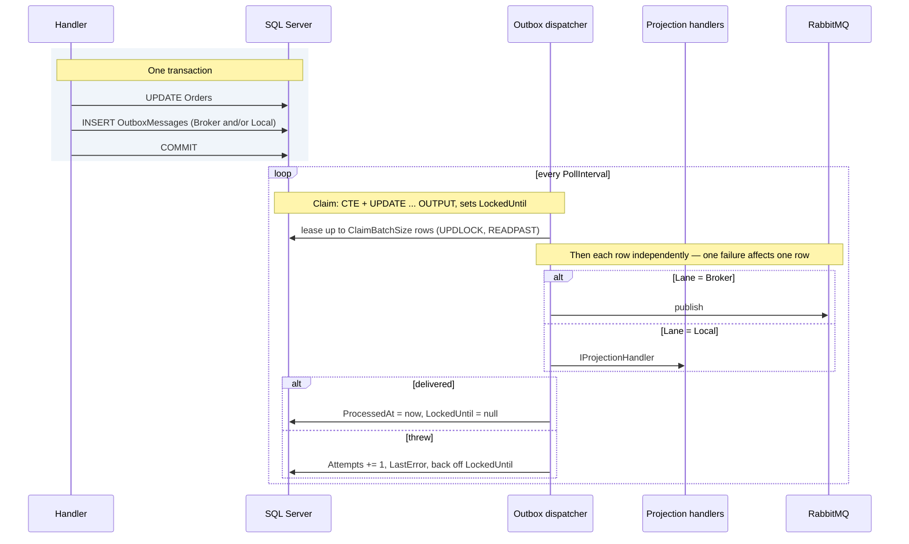
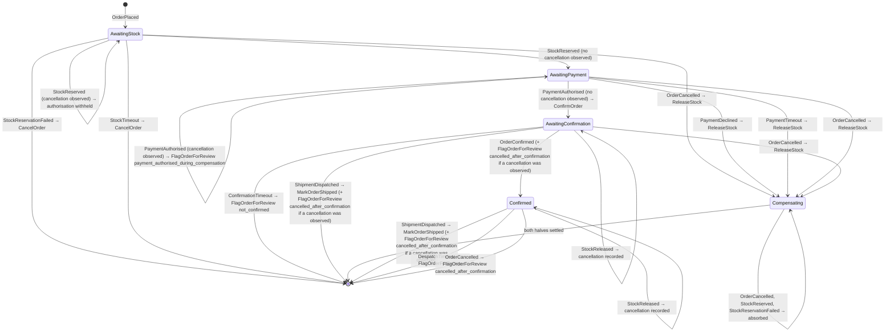

# 9. Messaging

## 9.1 Integration events

Integration events are the public contract of a service. They are published
facts about the past, and they must be boring: primitives, no domain types, no
behaviour, no assumptions about the consumer.

The three envelope fields every event carries are an interface, not a
convention — the consumer adapter needs `OccurredAt` to measure delivery lag
([§13.3](13-observability.md)) and cannot read it off an unconstrained type parameter:

```csharp
namespace Common.Contracts;

/// <summary>
/// Implemented by every integration event. No behaviour and no domain types —
/// three primitives, which is what keeps this legal under §9.1's rule that a
/// contract may not name a domain type.
/// </summary>
public interface IIntegrationEvent
{
    Guid MessageId { get; }
    Guid CorrelationId { get; }
    DateTimeOffset OccurredAt { get; }
}
```

> **`MessageId` here is *the* message id, not a second one.** The envelope's
> value is what `Stage` writes to the outbox row (§9.4), what the dispatcher
> puts on the transport, what MassTransit's header carries, and therefore what
> the inbox dedupes on (§9.5). Body, row, header and inbox key are one GUID.
>
> That has to be stated because the alternative is so easy to write and so hard
> to see: a `Guid.CreateVersion7()` in `Stage` would compile, work, and give
> every event two identities — one a consumer reads out of the payload, one the
> broker and the inbox use. Nothing fails. The cost arrives during an incident,
> when the id in the application log cannot be found in the inbox table, and
> the answer to "was this message processed?" becomes "which id do you mean?".
>
> `CorrelationId` follows the same rule for the same reason. The mapper decides
> it (§9.3 sets it from the order) precisely because a business correlation is
> more useful across a saga than an ambient request id, and a second value
> assigned at staging time would quietly replace that choice.

```csharp
namespace Common.Contracts.Ordering.V1;

public sealed record OrderConfirmed : IIntegrationEvent
{
    public required Guid MessageId { get; init; }
    public required Guid CorrelationId { get; init; }
    public required DateTimeOffset OccurredAt { get; init; }

    public required Guid OrderId { get; init; }
    public required Guid CustomerId { get; init; }
    public required decimal TotalAmount { get; init; }
    public required string Currency { get; init; }
    public required IReadOnlyList<ConfirmedLine> Lines { get; init; }
}

public sealed record ConfirmedLine(Guid ProductId, int Quantity, decimal UnitPrice);
```

`OrderPlaced` — the event the fulfilment saga starts on (§9.6) and what
`ReserveStock` draws its lines from — has the same shape with its own
`PlacedLine`, and Catalog's three (`ProductPublished`, `PriceChanged`,
`ProductDiscontinued`) repeat the three envelope members and add their own.
All of them live under `Common.Contracts`, one file per contract, where §6.6's
projections read them and the compiler answers for every member a sample
names. The envelope is written out on every contract rather than inherited
from a base record: a shared base is a shared versioning fate (§9.2), and
three properties is a cheaper price than that.

> **The constraint is the enforcement, and no test is needed for it.** A new
> event without `IIntegrationEvent` fails to compile the moment somebody binds
> a consumer to it — which is the only moment it starts mattering. Commands
> (`CancelOrder`, `ReserveStock`) deliberately do not implement it: they are
> routed by `CommandConsumer` (§9.4), they carry no envelope in the body, and
> their `MessageId` is the transport's.

> **Each contract owns its line type.** `PlacedLine` and `ConfirmedLine` have
> identical shapes today, and sharing one record would be the obvious economy.
> It is the wrong one: a field added to `OrderConfirmed`'s lines would silently
> change `OrderPlaced`'s payload, and the two contracts would have to version
> together — the coupling §9.2 exists to prevent. Duplication between published
> contracts is deliberate, for the same reason duplication between bounded
> contexts is ([§4.3](04-solution-structure.md)).

**Design guidance for event payloads.** There is a real trade-off between thin
events (ID only, consumer calls back for detail) and fat events (everything a
consumer might need). Thin events keep the contract small but reintroduce
synchronous coupling on the consume path. Fat events are self-contained but
duplicate data and grow over time.

This blueprint uses **fat-enough events**: carry the data consumers actually
need to act, established by asking them, not by guessing. `OrderConfirmed`
carries its `Lines` and `TotalAmount` because a consumer that has to act on the
order cannot do so from an identifier alone, and calling back for them would
reintroduce exactly the synchronous coupling the fat side of the trade-off is
bought to avoid.

> **"Fat enough" is bounded by [§11.7](11-identity-authorization.md), and the
> bound is not a matter of degree.** That section's rule — integration events
> carry identifiers, not personal data — is not one more consideration to weigh
> against a consumer's convenience; it decides the question before the
> trade-off above is reached. A broadcast event sits in the broker, survives in
> outbox rows that §9.4's retention purge deliberately does not delete — its
> `ProcessedAt IS NOT NULL` predicate is load-bearing, so an abandoned row keeps
> its payload indefinitely and a test pins that it does — and is copied into
> whatever each consumer persists from what it received. A field placed on a
> broadcast event is a field erasure cannot reach.
>
> **The inbox is not one of those copies, and the distinction is worth keeping
> exact.** §9.5's `InboxMessage` records a message id, an endpoint and a
> handling time; it stores no payload, so a consumer holds an address only
> where its own projection, read model or log put one. The broker and the
> abandoned outbox row are enough on their own.
>
> **So `OrderConfirmed` carries no shipping address**, even though Shipping
> cannot function without one and should not call back to get it. The first
> half is true and a field on the event is the wrong remedy:
> [ADR-035](adr/ADR-035-an-integration-event-carries-identifiers-not-personal-data.md)
> records the rule and leaves the delivery mechanism to Shipping's own PR,
> where the code that needs the address will be in front of whoever chooses it.
> A postal address is personal data under GDPR Art. 4, and §11.7's erasure
> choreography has no way to reach it on any of those three surfaces.

## 9.2 Versioning

Contracts live in a versioned namespace: `Common.Contracts.Ordering.V1`.

**Additive changes** — new optional fields — do not require a version bump.
Consumers deserialising an unknown field ignore it.

**"Optional" is doing more work in that sentence than it looks, because
[§12.6](12-test-strategy.md)'s gate forbids an optional member — with one
exemption, which is the rest of this paragraph.** Every member of a live
contract here is `required` unless that gate's additive-member list names it,
and the rule is enforced rather than observed. A member added as `required` is
therefore **not** an additive change whatever this section calls it:
`System.Text.Json` refuses a payload missing one, so the new build faults every
message the old build staged and has not yet published. So an added member
ships **optional first and stays optional for the life of that contract
version**; it is listed in §12.6's suite by name, and the listing goes when the
version does. Not merely until the rollout ends: a payload predating the field
has no bound on how long it can arrive — the error queue holds a message until
somebody handles it, outliving even its outbox row — so tightening the member
to `required` later would fail deserialisation on every retained one, before
any consumer branch could read the absent value. That is a breaking change,
and the paragraph below sends those to a new version.

**That tolerance is about fields and does not extend to anything else that can
be added.** A consumer ignores a field it does not know because the
deserialiser is built to; it does not ignore a *message type* it has no
consumer for, and it does not ignore a *member* of a closed vocabulary it does
not recognise. Both of those are additive by every ordinary reading and neither
is safe on its own, which is what makes this the sentence to be careful with
rather than the breaking-change paragraph below.

> **Consumer capability ships first, producer second, as two releases.**
> Anything a consumer must be able to *recognise* — a new message type, a new
> binding on an existing endpoint, a new value in a closed vocabulary — is
> deployed everywhere before the release that starts emitting it. Not a
> coordinated deploy: two ordinary releases in an order, which is
> [§7.4](07-persistence.md)'s expand/contract rule applied to a contract
> instead of a schema.
>
> **The two failure modes are opposite and only one is loud**, which is why
> the rule is stated rather than left to judgement. A new *binding* on a shared
> queue fails quietly: the broker hands the message to a replica whose build
> declares no consumer for it, MassTransit parks it in `<queue>_skipped`, and
> nothing threw. A new *vocabulary member* fails loudly and immediately: the
> mapper refuses a code it does not know, and [§9.8](09-messaging.md) excludes
> `ContractMappingException` from retries precisely so a malformed contract
> does not burn a minute of backoff — correct for a genuinely malformed
> message, wrong for a well-formed one from a newer producer, and the
> escalation reaches the error queue on the first attempt.
>
> **The vocabulary case is closed by ordering alone; the binding case costs a
> release.** Teach the mapper the new codes, deploy everywhere, then enable the
> transitions that emit them — the two halves are already in different builds,
> so the rule is free. A binding is harder because the consumer and the
> producer are in the *same* build: whatever declares `Event<T>` is what starts
> publishing `T`, so ordering the deploy separates nothing and the change has
> to be **split across two releases** before there is an order to impose.
> [§15.5](15-cicd-deployment.md) carries that and the alternative to it.
>
> **`<queue>_skipped` is alerted on from [§13.6](13-observability.md).** The
> rule above is checkable rather than a hope, because a message skipped during
> a rollout is meant to page someone rather than to vanish. What the alert
> depends on is stated in
> [ADR-026](adr/ADR-026-consumer-capability-is-a-release-ahead-of-the-producer-that-uses-it.md)
> rather than assumed here: per-queue broker metrics are a deployment
> prerequisite this repository does not configure, so the enforcement is
> owed a cluster that has.

**Breaking changes** — removing a field, renaming, changing a type, changing
semantics — require a new version. The publisher then emits both V1 and V2 for a
deprecation window, consumers migrate independently, and V1 is retired once
telemetry confirms no consumer remains on it.

There is no shortcut here. A "just this once" breaking change to a live contract
means a coordinated deploy, and coordinated deploys are the thing this
architecture exists to avoid.

> **A contract with no consumer is not live, and that is the one exception —
> stated here so it is a rule rather than an argument made at each site.**
> The deprecation window above exists to let consumers migrate independently.
> Where a version has none — no service deserialises it, and the service that
> will has not been built — there is nobody to migrate, and a V2 buys a window
> for an audience of nobody. The contract may then be changed in place.
>
> **Two conditions, both required.** No **service** in the solution may consume
> the version — a fact about which consumers are registered, not a judgement;
> and the change must be recorded in an ADR, so that "there was no consumer" is
> something a later reader can check rather than take on trust.
>
> **A test is not a consumer, and the distinction has to be stated or the
> condition is unusable.** §12.6's suite round-trips every contract through the
> bus serialiser, so *something* deserialises every version this platform
> owns — but a test moves with the contract in the same commit, which is
> precisely what a deprecation window exists to make unnecessary. What the
> window protects is a deployable that ships on its own schedule. The moment a
> consumer exists the rule above binds with no exception, and the window for
> the cheap edit has closed — which is the same observation §9.1 makes from the
> other direction: the PR that becomes a contract's first producer is the last
> one that can fix its shape for free.
>
> **A service that consumes its own contract is not an independent deployable
> with respect to itself**, and the condition has to be read that way or it
> refuses every edit to an event a saga binds. §9.6's saga binds
> `Event<OrderConfirmed>`, which makes Ordering a registered consumer of a
> contract Ordering also produces — and a bound consumer deserialises the whole
> payload, so a `required` member's removal faults it whatever the transition
> reads. Producer and consumer ship in the same build, so no deployable is
> stranded; what the change costs instead is the overlap within that one
> service's rollout, which is
> [ADR-026](adr/ADR-026-consumer-capability-is-a-release-ahead-of-the-producer-that-uses-it.md)'s
> subject rather than this section's, and the ADR recording the edit says so.
> [ADR-035](adr/ADR-035-an-integration-event-carries-identifiers-not-personal-data.md)
> is the one use of the exception, and it is on those terms.
>
> **For one class of change the deprecation window is not merely useless but
> harmful**, and it is worth naming because it inverts the rule's intent. When
> the point of the change is that a field *must not be on the wire* —
> [ADR-028](adr/ADR-028-a-money-movement-command-carries-no-subject.md)
> removing the subject from `AuthorisePayment` is the worked case, and ADR-035
> is another — emitting V1 alongside V2 keeps the offending shape published,
> and consumable, for the length of the window. The standard remedy would
> re-arm the defect it was asked to fix.

## 9.3 Domain event → integration event: the allow-list mapper

[§5.5](05-tactical-ddd.md) states the principle — never publish a domain event to the bus. This is the
mechanism that makes it structural rather than aspirational.

Translation is **opt-in**. A mapper registry names each domain event type that
becomes an integration event, and how. Everything unregistered is local-only.

**Who calls this:** the mapper and publisher below are invoked by
`DomainEventDispatcher` ([§7.5](07-persistence.md)), not by command handlers. A handler that calls
either of them directly is a bug: the dispatcher runs at the single point where
every aggregate has finished changing, and a handler that stages earlier
serialises a snapshot the rest of the handler can still move on from. The
payload is written at `StageAsync` (the port below), not at commit, so a
total adjusted two lines later commits an outbox row that disagrees with the
row beside it. Both leave the transaction together and only one of them is
right.

**The port is common; only the allow-list is per-service.**
`DomainEventDispatcher` ([§7.5](07-persistence.md)) injects
`IIntegrationEventMapper`, and common code cannot name a per-service type —
the same split this section already applies to `IIntegrationEventPublisher`
below.

```csharp
namespace Common.Application;

public interface IIntegrationEventMapper
{
    IReadOnlyList<object> Map(IReadOnlyList<IDomainEvent> domainEvents);
}
```

Ordering's implementation is `OrderingIntegrationEventMapper` in
`Ordering.Application/Integration`, and the allow-list is the whole of it:

```csharp
// The allow-list. A domain event absent from this dictionary never
// reaches the bus — by construction, not by review.
private static readonly Dictionary<Type, Func<IDomainEvent, object>> Registry = new()
{
    // Domain type in, contract type out. The suffix (§5.5) is what makes
    // that visible — with one name for both, this reads as identity.
    [typeof(OrderPlacedDomainEvent)] = e => ToContract((OrderPlacedDomainEvent)e),
    [typeof(OrderConfirmedDomainEvent)] = e => ToContract((OrderConfirmedDomainEvent)e),
    [typeof(OrderCancelledDomainEvent)] = e => ToContract((OrderCancelledDomainEvent)e),
    // OrderStockConfirmedDomainEvent is deliberately absent — internal only.
};

// V1.OrderPlaced, not OrderPlacedDomainEvent: Money is decomposed into a
// decimal and an ISO code, because a contract may not carry domain types.
private static V1.OrderPlaced ToContract(OrderPlacedDomainEvent e) => new()
{
    MessageId = Guid.CreateVersion7(),
    CorrelationId = e.OrderId.Value,
    OccurredAt = e.OccurredAt,
    OrderId = e.OrderId.Value,
    CustomerId = e.CustomerId.Value,
    TotalAmount = e.Total.Amount,
    Currency = e.Total.Currency,
    // PlacedLine, not ConfirmedLine — OrderPlaced owns its own line type
    // so the two contracts can version independently (§9.1).
    Lines = [.. e.Lines.Select(l => new V1.PlacedLine(l.ProductId.Value, l.Quantity, l.UnitPrice.Amount))]
};
```

`Map` walks the events, skips any type the registry does not hold, and calls
the registered function for the rest. The two failure semantics are
deliberately different, and the distinction is the whole point:

| Case | Behaviour | Why |
|---|---|---|
| Domain event **not** in the registry | Skipped silently. No bus message, no failure. | Most domain events are internal. Failing on them would force every new event to be published or explicitly suppressed |
| Registered mapper **throws** | The command fails and the transaction rolls back | Someone declared this event must be published. If it cannot be, the state change must not stand either |

There is deliberately **no `MustPublish` flag** on domain events. If it must
reach the bus, register it. One mechanism, one place to look.

### The publisher contract

`IIntegrationEventPublisher` is an Application port, and its implementation is
constrained normatively:

```csharp
namespace Common.Application;

public enum OutboxLane
{
    /// <summary>Published to the message broker. A public contract.</summary>
    Broker,

    /// <summary>Dispatched in-process after commit to IProjectionHandler&lt;T&gt;.
    /// Never leaves the service and is not a contract.</summary>
    Local
}

public interface IIntegrationEventPublisher
{
    /// <summary>
    /// Stages a message for delivery after the current transaction commits.
    /// </summary>
    Task StageAsync(object message, OutboxLane lane, CancellationToken ct);
}
```

The implementation **must**:

- Write an outbox row on the **same `DbContext`** the command handler is using,
  so it enlists in the same transaction.

The implementation **must not**:

- Call the broker transport directly — `IBus.Publish` inside a handler
  reintroduces the dual-write the outbox exists to eliminate.
- Introduce a **second** outbox table set alongside the existing one. Two outbox
  implementations means two dispatchers, two retention policies, two sets of
  ordering guarantees, and one of them will be the one nobody monitors.

All three are mistakes a competent developer makes in good faith, which is why
they are prohibitions rather than guidance. Each service's `OutboxPublisher`
in its Infrastructure assembly is the implementation, and it is a thin call to
`OutboxMessage.Stage` (§9.4) on the service's own `DbContext`.

**The third has exactly one recorded exception, and recording it is what keeps
it an exception.**
[ADR-032](adr/ADR-032-the-sagas-outbox-is-masstransits-in-the-sagas-own-transaction.md)
admits MassTransit's Entity Framework outbox on §9.6's saga receive endpoint,
which brings a second table set into the `ordering` schema. It is that endpoint
and no other: the platform's three ordinary receive endpoints keep
`UseInMemoryOutbox`, and every application-level integration event still goes
through §9.4's `OutboxMessages` and its dispatcher. The bullet's cost is paid
rather than dodged — there really are two retention policies now, and the ADR
says which job prunes which table and why folding them together would be worse.

**One exemption: sagas.** A MassTransit state machine (§9.6) sends and publishes
directly from its activities rather than through this port. That is correct and
deliberate — a saga is Infrastructure, and its outgoing messages are staged by
the outbox configured on its receive endpoint rather than by this port's,
committing in the transaction that persists the instance (ADR-032).

**Routing saga output through the application-level outbox is not an
alternative, and the objection is availability rather than cost.** The saga's
waits are scheduled messages, the delay is a transport feature
([ADR-021](adr/ADR-021-saga-timeouts-are-scheduled-by-the-broker.md)),
and no dispatcher of ours can replay a delay it never held — so an application
outbox would carry `AuthorisePayment` and not `PaymentTimeout`, closing half the
window and leaving the half with no bound at all.

The prohibition applies to **Application code**, which is where the dual-write
risk actually lives.

## 9.4 The transactional outbox

The core problem: a handler must change the database *and* publish a message.
These are two systems. Without care, the process can crash between them — the
order is placed but nobody is told, or the message is sent and the transaction
rolls back.

The outbox makes them one atomic operation by writing the message to the same
database, in the same transaction, and dispatching it afterwards.



```sql
CREATE TABLE ordering.OutboxMessages
(
    Id             BIGINT IDENTITY(1,1) PRIMARY KEY,
    MessageId      UNIQUEIDENTIFIER NOT NULL UNIQUE,
    CorrelationId  UNIQUEIDENTIFIER NOT NULL,
    MessageType    NVARCHAR(300)    NOT NULL,   -- MessageTypeMap.MaxNameLength; a FullName is not ASCII
    Payload        NVARCHAR(MAX)    NOT NULL,
    Lane           VARCHAR(16)      NOT NULL,   -- OutboxMessage.LaneMaxLength; 'Broker' | 'Local'
    OccurredAt     DATETIMEOFFSET   NOT NULL,
    ProcessedAt    DATETIMEOFFSET   NULL,
    Attempts       INT              NOT NULL,
    LastError      NVARCHAR(2000)   NULL,       -- OutboxMessage.LastErrorMaxLength; the fail statement truncates to it
    LockedUntil    DATETIMEOFFSET   NULL     -- lease; also carries retry backoff
);

-- The shape, not a script: this table is generated by EF from the entity
-- configuration, so every column is written on insert and none carries a
-- database default — a difference that matters only to a hand-written
-- INSERT, which nothing in this design performs.

-- Filtered index: the dispatcher only ever scans unprocessed rows, and the
-- index stays small regardless of table size.
CREATE INDEX IX_Outbox_Unprocessed
    ON ordering.OutboxMessages (OccurredAt)
    INCLUDE (Lane, Attempts, LockedUntil)
    WHERE ProcessedAt IS NULL;

-- And its complement, for the retention purge. The two filters are opposites,
-- so the index above cannot serve the delete below by construction — it
-- excludes every row that delete targets. Without this one the purge scans
-- the whole table, and it is the processed rows that make the table
-- large, so the scan grows exactly as the purge starts to matter.
CREATE INDEX IX_Outbox_Processed
    ON ordering.OutboxMessages (ProcessedAt)
    WHERE ProcessedAt IS NOT NULL;
```

`Lane` is what makes one table serve both after-commit destinations (§7.5).
`Broker` rows are published; `Local` rows are handed to in-process projection
handlers. Both get the same durability, the same retry accounting and the same
monitoring — which is the argument against a second, separate mechanism for
local reactions.

**Two types map to this table, deliberately.** The staging path writes whole
rows through EF Core; the dispatcher reads a narrow projection of the columns
its claim returns. Collapsing them into one type produces a class whose
`ProcessedAt` is always null on the read path and whose `LastError` is never
populated on the write path:

| Type | Used by | Shape |
|---|---|---|
| `OutboxMessage` | EF entity, `db.OutboxMessages` | All columns |
| `OutboxClaim` | Dapper, the dispatcher's `OUTPUT` projection | Id, MessageId, CorrelationId, MessageType, Payload, Lane, Attempts, OccurredAt |

Both live in `Common.Infrastructure/Outbox`. `OutboxMessage.Stage` is the one
constructor, and its guards are what make §9.3's allow-list structural rather
than a convention — `Map` returns `object` and the type map admits domain
events and contracts alike, so a mapper that returned the event it was handed
would otherwise stage it here and the dispatcher would publish it, the leak
§5.5 forbids:

```csharp
if (lane is OutboxLane.Broker && message is not IIntegrationEvent)
{
    throw new InvalidOperationException(
        $"{message.GetType().Name} is not an {nameof(IIntegrationEvent)} and cannot be " +
        "staged on the Broker lane. A domain event reaching the broker is the leak the " +
        "§9.3 allow-list exists to prevent — map it to a contract first.");
}

if (lane is OutboxLane.Local && message is not IDomainEvent)
{
    throw new InvalidOperationException(
        $"{message.GetType().Name} is not an {nameof(IDomainEvent)} and cannot be staged " +
        "on the Local lane, which carries this service's own events to its projection " +
        "handlers (§7.5).");
}

return new OutboxMessage
{
    // One identity, not two (§9.1): an integration event's envelope is the
    // row's id and correlation. A Local-lane row carries a domain event,
    // which has no envelope, so the row mints its own id and takes the
    // caller's correlation — one value per scope, so rows staged by the
    // same command correlate with each other.
    MessageId = message is IIntegrationEvent e ? e.MessageId : Guid.CreateVersion7(),
    CorrelationId = message is IIntegrationEvent c ? c.CorrelationId : correlationId,
    MessageType = types.NameOf(message.GetType()),
    Payload = JsonSerializer.Serialize(message, message.GetType(), json.Options),
    Lane = lane,
    OccurredAt = message is IIntegrationEvent o
        ? o.OccurredAt
        : ((IDomainEvent)message).OccurredAt
};
```

`OccurredAt` is the message's own timestamp, never a staging clock: §13.3
defines `projection.lag` as event raised to projection applied and §13.7 sets
its target, and a row stamped when `Stage` ran would drop the interval between
the two. Before the lane checks, in the same file, a lane that is neither
member of the enum is refused, because C# does not confine an enum to its
declared members, and a type implementing both `IDomainEvent` and
`IIntegrationEvent` is refused before either lane check, because such a type
satisfies both. `OutboxClaim` is the read side, a Dapper projection whose
members must match the claim's `OUTPUT` clause exactly — Dapper binds by name
and leaves an unmatched member at its default, so a column added to one and
not the other is a `DateTimeOffset.MinValue` nobody notices until a metric
reads 55 years.

### The type name is a persisted contract

`MessageType` is written by one deployment and read by another. That makes the
obvious implementation — `AssemblyQualifiedName` out, `Type.GetType` back —
wrong in a way that only shows in production:

```
Ordering.Domain.Orders.Events.OrderPlacedDomainEvent, Ordering.Domain,
Version=1.0.0.0, Culture=neutral, PublicKeyToken=null
```

Every row carries the assembly version that staged it. Bump it — which a release
pipeline does automatically — and `Type.GetType` returns `null` for every row
written before the deploy. The dispatcher then exhausts its attempts on a batch
of perfectly good messages and abandons them. Nothing is lost, nothing is
delivered, and the only symptom is outbox depth climbing after a release that
looked clean. Trimming, single-file publish and moving a type between assemblies
break it the same way.

The fix is a name the code chooses rather than one the runtime computes.
`MessageTypeMap` in `Common.Infrastructure/Outbox` is a two-way map between a
stageable type and its persisted name, built at startup from a
`MessageTypeSource` — the assemblies whose events may be staged, plus the
`Alias` and `WriteAs` overrides the rename procedure below needs — so that a
duplicate name fails the host rather than the first message. The name is the
type's `FullName`:

```csharp
// FullName, not AssemblyQualifiedName: namespace and type name, no
// version and no assembly. For contracts the namespace is already
// versioned (§9.2), so this IS the contract. For domain events it is
// internal, and a rename is then a migration the team chose rather than
// one a build number made for it.
(string Name, Type Type)[] pairs =
[
    .. assemblies
        .SelectMany(a => a.GetTypes())
        // Not IsClass: neither interface carries a class constraint,
        // so a `readonly record struct` domain event compiles, raises
        // and dispatches like any other — and an IsClass filter drops
        // it here in silence, leaving NameOf to throw inside the
        // transaction that staged it.
        .Where(t => t is { IsAbstract: false, IsInterface: false } &&
            (t.IsAssignableTo(typeof(IIntegrationEvent)) ||
                t.IsAssignableTo(typeof(IDomainEvent))))
        .Select(t => (Name: t.FullName!, Type: t))
];
```

Both directions throw, and both throw at the point of the mistake. `NameOf`
fails when something unstageable is staged — in the transaction, so the command
fails rather than the outbox filling with rows nobody can deliver. `Resolve`
fails on the dispatcher, where the message that names a departed type is the one
that lands in the retry log with its own name in it. The map also refuses, at
construction, a name longer than the column holds — `MaxNameLength` lives on
the map rather than beside the EF configuration that spells it, because the
map is what decides a type is stageable, so the map is what has to refuse a
name the column cannot keep — and two types sharing one name.
`MessageTypeMapValidator`, the hosted service §4.2 registers beside the map,
is what resolves it at startup, so every one of those refusals fails the host
rather than the first message.

> **A renamed message type is a migration, and it takes three releases.** The
> rule that follows from this map is the one nobody remembers under deadline: a
> type may not be renamed or deleted while unprocessed rows still name it. It
> is expand and contract, the same shape as every backward-compatible schema
> change (ADR-007) — and both directions are live, which is the half that is
> easy to miss.
>
> During a rolling deploy the two versions share the table. An **alias** lets a
> replaced instance resolve the name its predecessors write. It does nothing
> about the other direction: a replaced instance also *writes* the new name
> immediately, and the instances still running cannot resolve that, so their
> dispatchers burn the attempt cap on rows that are perfectly good. Fixing one
> direction and calling the rename safe is how the procedure loses messages
> while looking careful.
>
> So `WriteAs` pairs with `Alias`, and **both calls name the old name** — the
> renamed type's current name is derived, and aliasing a name the map already
> derives is what the collision guard exists to refuse:
>
> ```csharp
> // Release 1 — the type is now OrderPlacedDomainEvent; rows in flight say
> // OrderPlaced. Resolve both, write the one every instance can read.
> services.AddSingleton(
>     new MessageTypeSource(typeof(V1.OrderPlaced).Assembly, typeof(Order).Assembly)
>         .Alias("Ordering.Domain.Orders.Events.OrderPlaced", typeof(OrderPlacedDomainEvent))
>         .WriteAs(typeof(OrderPlacedDomainEvent), "Ordering.Domain.Orders.Events.OrderPlaced"));
> ```
>
> **The registration is half the procedure.** §4.2 builds the map from
> `source.Assemblies`, `source.Aliases` and `source.WrittenNames` — all three.
> A factory passing only the assemblies drops both calls above on the floor:
> the host starts, every guard below passes vacuously because there is nothing
> to guard, and the rename proceeds to abandon rows exactly as it would have
> with no procedure at all. Two overrides recorded on an object nobody reads
> is worse than none, because the call sites read as the fix.
>
> **Release 2** drops the `WriteAs`: the new name is written, and release one's
> instances resolve it because they already carry the renamed type — derived,
> not aliased, which is why nothing has to be added for them. **Release 3**
> drops the `Alias`, once no unprocessed row still names the old one — the
> deletion the drain rule above is about.
>
> The guards that keep the pair honest each fail the host rather than a
> message. An alias that **shadows a live type name** is refused, on the
> duplicate-name argument one indirection over: two types would answer to one
> name and which resolves is not decidable. An alias **onto a type the map does
> not carry** is refused, because the dispatcher trusts the row's `Lane` rather
> than re-deriving it — an old `Broker` name pointed at a domain event would
> publish that domain event, reopening the leak `Stage`'s guards close. An
> alias **longer than the column** is refused, since no row can ever carry it.
> A `WriteAs` naming something **the map cannot resolve** is refused, because
> that instance would stage rows it could not itself deliver. And a `WriteAs`
> naming **another type** is refused, which is the quiet one: the row is
> written, claimed and delivered, and the payload is deserialised as something
> it never was — a substitution rather than a failure, and the only one of
> them with no symptom to notice.

### The payload is a persisted format too

The name is half of it. `Payload` is JSON written by one deployment and read by
another, and on the `Local` lane it holds a **domain event** — a type §5.5
explicitly describes as "free to change with the code". Both statements are
true and together they are a trap: a member renamed between the stage and the
deliver silently deserialises to its default, because that is what
`System.Text.Json` does with a property it cannot match.

Two rules, and one registration that makes the first checkable. `OutboxJson`
in `Common.Infrastructure/Outbox` is one instance, registered as a singleton
and resolved by both sides — staging and delivering must agree, and the way
they stop agreeing is one of them picking up a host-wide default that was
changed for an API's benefit:

```csharp
Options = new JsonSerializerOptions
{
    // Explicitly the defaults that matter, rather than inherited ones:
    // property names as declared, numbers as numbers, no case-insensitive
    // rescue on the way back in — a payload that only round-trips because
    // matching is lenient is a payload that will not survive a rename.
    PropertyNamingPolicy = null,
    PropertyNameCaseInsensitive = false,
    NumberHandling = JsonNumberHandling.Strict
};

foreach (JsonConverter converter in converters)
    Options.Converters.Add(converter);

// Frozen at construction, because the instance is reached from a
// background service and from every command scope at once and
// JsonSerializerOptions is only thread-safe once it is read-only.
Options.MakeReadOnly(populateMissingResolver: true);
```

**Domain events on the `Local` lane must round-trip through this instance**, and
that is asserted in [§12.4](12-test-strategy.md) — `Every_stageable_domain_event_round_trips_through_the_outbox_options`,
written out there with the other outbox tests. It does **not** join §12.6's
contract suite, which selects on the `Common.Contracts.` namespace and so can
never see a domain event, by the same rule that keeps domain types out of
contracts.

The assertion catches the private constructor, the
computed-property-with-no-setter and the interface-typed member on the day it
is introduced rather than on the day a deploy happens to land mid-batch.

> **A value object needs a converter, and the service's Infrastructure owes
> it.** §5.3's `Money` is a `readonly record struct` with a private
> constructor and two get-only properties, and `System.Text.Json` does not
> refuse that shape —
> a struct always has a parameterless constructor, so it builds the default,
> finds no setter to call, and returns `Amount = 0` with a null `Currency`.
> Every domain event carrying one deserialises to nonsense on this lane.
>
> The domain must not fix it. A `[JsonConstructor]` puts `System.Text.Json` in
> a domain assembly, which §4.2's allow-list gate forbids by name; making the
> constructor public gives up the always-valid principle §5.3 is built on, and
> does not even work — for a struct the implicit parameterless constructor
> wins, so a public parameterised one is never selected. What does work is a
> `JsonConverter<Money>` registered by the service's Infrastructure, beside the
> `ComplexProperty` mapping that already turns the same type into two columns.
> Same layer, same reason, and the domain type knows about neither.
>
> This is why `OutboxJson` takes its converters rather than declaring options
> and nothing else: the converters are half of what "both sides agree" means,
> and a static field could only ever have said the other half.

**And a renamed member is a migration, exactly as a renamed type is.** The drain
rule above covers both: unprocessed rows name types *and* describe shapes, and
the outbox is empty for a few seconds many times a day. Draining before a rename
costs nothing; discovering afterwards that yesterday's rows deserialise with a
`Total` of zero costs an afternoon and a corrected read model.

> **The alternative — stage a DTO instead of the domain type — was considered
> and rejected.** It would decouple the persisted shape from the domain, at the
> price of a second type per event, a mapper, and a place for the two to
> disagree. The `Local` lane is drained in seconds, which is what makes the
> cheaper option viable: the exposure is one batch, not one release cycle.
> That reasoning stops holding the moment the lane backs up for hours, so if the
> §13.6 outbox-age alert becomes routine rather than exceptional, revisit this
> before the backlog makes the decision for you.

The dispatcher runs as a background service in two phases: an atomic **claim**
that leases a batch of rows, then **per-row delivery** where each message
succeeds or fails on its own.

> **Every row is delivered and accounted for independently.** Wrapping a whole
> batch in one transaction is the obvious implementation and is wrong: a single
> failing projection would roll back the batch and block every healthy `Broker`
> row behind it, so a read-model bug in this service would stop publishing to
> every other service. The lanes can only be alerted on separately (§13.6) if
> they can actually fail separately.

The dispatcher lives in `Common.Infrastructure`, so its three statements
cannot name a schema — `ordering.` above is what the sample would be in
Ordering's assembly, and there is no such assembly. The schema is a registered
value instead:

```csharp
namespace Common.Infrastructure.Outbox;

/// <summary>
/// Where this service's outbox lives. Shape-checked on construction, because
/// the schema is interpolated into the statements below rather than
/// parameterised — a schema cannot be a parameter, and what cannot be a
/// parameter has to be a value the type refuses to hold wrongly.
/// </summary>
public sealed class OutboxTable
{
    public OutboxTable(string schema)
    {
        QualifiedName = SqlSchema.Qualify(schema, "OutboxMessages", nameof(schema));
        Schema = schema;
    }

    public string Schema { get; }

    public string QualifiedName { get; }
}
```

`SqlSchema.Qualify`, in `Common.Infrastructure`, is the one place a schema is
checked and delimited: it refuses anything but a SQL identifier of at most the
128 characters `sysname` holds, and brackets the result, because the pattern
admits reserved words and a service may legitimately be called `User`, whose
`FROM user.OutboxMessages` SQL Server cannot read.

> **The check is shared, and that is the whole reason it is a separate type.**
> `InboxTable` in `Common.Infrastructure/Inbox` is this class with one word
> changed, and [§8.5](08-caching-redis.md)'s marker table has a third,
> `IdempotencyMarkerTable` in `Common.Infrastructure/Idempotency`, with one
> more, so a reader who copies the constructor above rather than calling
> `SqlSchema` gets several answers to one question — the 128-character bound,
> the reserved-word argument and the bracket-quoting, maintained once per copy.
> Each service builds **every** one of them from **one** schema literal (§4.2),
> which is what keeps them from naming different schemas; sharing the guard is
> what keeps them from disagreeing about what a schema may be.

> **The alternative is a dispatcher per service, and that is §9.3's prohibition
> on a second outbox table set arriving by the back door.** Two dispatchers
> means two retention policies, two sets of ordering guarantees, and one of
> them being the one nobody monitors.
>
> **That argument is untouched by
> [ADR-032](adr/ADR-032-the-sagas-outbox-is-masstransits-in-the-sagas-own-transaction.md),
> and the difference is what makes the exception one.** The ADR admits
> MassTransit's outbox on the saga's receive endpoint, which stages what the
> **state machine** sends inside the consume transaction — a job this
> dispatcher does not do and cannot be given, since a scheduled message's
> delay is a transport feature
> ([ADR-021](adr/ADR-021-saga-timeouts-are-scheduled-by-the-broker.md))
> that no dispatcher of ours could replay. A second dispatcher for *these*
> rows would be a second answer to the question this one already answers,
> which is exactly what the paragraph above refuses.

`OutboxDispatcher` in `Common.Infrastructure/Outbox` composes its three
statements once from the registered table. **No quantity the loop runs on is
written as a number twice.** `ClaimBatchSize`, `LeaseSeconds`,
`BackoffBaseSeconds` and `BackoffAttemptCap` are declared on that class beside
`MaxAttempts` and interpolated into the statements below; `PollInterval` is
declared there too and feeds the timer rather than any statement; and the one
quantity that is not the dispatcher's — the width `LastError` is truncated to —
belongs to `OutboxMessage`, which the fail statement names. So this section can
cite each by name and stay true when one is tuned. The claim selects and
leases in one statement, so two replicas cannot take the same row, and
`READPAST` skips rows another replica holds:

```sql
WITH claimable AS (
    SELECT TOP ({ClaimBatchSize}) *
    FROM {table.QualifiedName} WITH (UPDLOCK, READPAST, ROWLOCK)
    WHERE ProcessedAt IS NULL
        AND Attempts < @MaxAttempts
        AND (LockedUntil IS NULL OR LockedUntil < SYSDATETIMEOFFSET())
    ORDER BY OccurredAt
)
UPDATE claimable
SET LockedUntil = DATEADD(second, {LeaseSeconds}, SYSDATETIMEOFFSET())
OUTPUT
    inserted.Id,
    inserted.MessageId,
    inserted.CorrelationId,
    inserted.MessageType,
    inserted.Payload,
    inserted.Lane,
    inserted.Attempts,
    inserted.OccurredAt;
```

A completed row gets `ProcessedAt` set and its lease cleared. A failed one has
its attempt counter incremented and its lease pushed forward exponentially,
which is what makes the cap — `OutboxDispatcher.MaxAttempts`, public because
§13.6's abandoned-rows gauge counts exactly the rows the claim skips — and
the abandoned-row alert reachable:

```sql
UPDATE {table.QualifiedName}
SET
    Attempts    = Attempts + 1,
    LastError   = LEFT(@Error, {OutboxMessage.LastErrorMaxLength}),
    LockedUntil = DATEADD(
        second,
        POWER(2, CASE WHEN Attempts > {BackoffAttemptCap}
                      THEN {BackoffAttemptCap}
                      ELSE Attempts END) * {BackoffBaseSeconds},
        SYSDATETIMEOFFSET())
WHERE Id = @Id;
```

The truncation and the column are one decision read twice: `LEFT` writes what
`LastError` holds, so `OutboxMessage` states the width, the statement above
interpolates it and each service's entity configuration passes it to
`HasMaxLength`. A `LEFT` narrower than the column silently shortens the one
diagnostic an abandoned row carries, and a wider one fails the very update that
was recording why a delivery failed.

`ProcessBatchAsync` is the one claim-and-deliver pass, public so tests drive
it directly instead of racing the timer (§12.4). Its per-row loop is the
design:

```csharp
foreach (OutboxClaim message in claimed)
{
    try
    {
        // A scope per row, and this is what makes per-row isolation
        // true rather than intended: projection handlers are scoped
        // and so is the DbContext behind them, so one scope for a
        // whole batch hands the next row a half-mutated tracker.
        await using AsyncServiceScope delivery = _scopes.CreateAsyncScope();

        await DeliverAsync(delivery.ServiceProvider, message, ct);

        await connection.ExecuteAsync(
            new CommandDefinition(_completeSql, new { message.Id }, cancellationToken: ct));
        completed++;
    }
    catch (Exception ex) when (!ct.IsCancellationRequested)
    {
        // One bad message does not affect the rest of the batch.
        //
        // The filter asks the token, not the exception type. A handler
        // enforcing its own deadline throws OperationCanceledException
        // while ct is still live, and a type test would let that row
        // escape with no attempt recorded and every row behind it left
        // leased — a delivery failure disguised as a shutdown.
        await connection.ExecuteAsync(
            new CommandDefinition(
                _failSql, new { message.Id, Error = ex.ToString() }, cancellationToken: ct));

        DeliveryFailed(_log, message.MessageId, message.Lane, message.Attempts + 1, MaxAttempts, ex);
    }
}
```

`DeliverAsync` resolves the type through the map, not `Type.GetType`,
deserialises through the same registered `OutboxJson` that `Stage` wrote
through, and branches on the lane: a `Broker` row is published with the row's
`MessageId` and `CorrelationId` copied onto the transport, a `Local` row goes
to `ProjectionInvoker` with the row's `OccurredAt`, and a lane that is neither
throws, leaving the row for §13.6's abandoned-row alert with its own lane
value in `LastError`. Both lanes re-check the payload's interface before
delivering — the lane arrives from a column and the type from a name in
another column, so nothing about the pair was validated by the process about
to publish it, and the last place able to enforce §5.5 is the one that
publishes. `OccurredAt` comes from the row rather than the payload because the
invoker is generic and unconstrained (§13.3); the row carries the instant the
aggregate raised the event, so the lag §13.3 records and §13.7 targets spans
the raise, the commit and the poll, which is the honest reading of "how stale
is this read model".

`ProjectionInvoker` resolves and calls the handlers for a runtime type. It uses
the same cached-delegate approach as the dispatcher in [§6.2](06-cqrs.md), so the reflection
cost is paid once per event type rather than once per message. The body of its
closed invoker is two decisions:

```csharp
IProjectionHandler<TEvent>[] handlers = [.. sp.GetServices<IProjectionHandler<TEvent>>()];

// A Local row is staged only when IProjectionRegistry found a
// handler (§7.5). Finding none here means the handler was
// implemented but never registered — fail loudly rather than
// marking the row processed having done nothing.
if (handlers.Length == 0)
{
    throw new InvalidOperationException(
        $"No IProjectionHandler<{typeof(TEvent).Name}> is registered, " +
        "but a Local outbox row was staged for it. Check the §6.2 scan.");
}

// Sequential, not concurrent: two projections writing the same read
// table in parallel is a deadlock waiting for load to find it.
foreach (IProjectionHandler<TEvent> handler in handlers)
    await handler.HandleAsync((TEvent)payload, ct);
```

It records raised-to-applied (§13.3) after the handlers rather than before:
the SLO is about when the read model became correct, not when work on it
started.

If any handler throws, the exception propagates to the per-row `catch` above and
the whole row is retried — meaning **every** handler for that event runs again.
That is the reason §6.6 insists projections are idempotent; with more than one
handler per event it is not a theoretical concern.

Consequences of the per-row design worth stating explicitly:

- **A message that keeps failing reaches `MaxAttempts` and stops being
  claimed.** It stays in the table with `ProcessedAt` still `NULL` and its
  `LastError` populated, which is exactly what the abandoned-row alert (§13.6)
  detects and what `outbox-abandoned.md` tells the operator to read. Replaying
  it is a matter of resetting `Attempts` to zero.
- **The retention purge must delete only rows with `ProcessedAt IS NOT NULL`.**
  Purging on age alone would silently destroy the abandoned rows that the alert
  exists to surface.
- **Strict global ordering is not guaranteed.** Rows are claimed in `OccurredAt`
  order, but a failed message backs off while later ones proceed, and multiple
  replicas run concurrently. Consumers must not assume ordering — which the
  out-of-order guard in §6.6 already assumes they cannot.
- **The lease bounds crash recovery.** If a dispatcher dies mid-batch, its
  claimed rows become available again when the lease expires rather than
  being stuck behind a lock that no longer has an owner.
- **And it can expire while the batch is still being delivered, which is a
  known residual rather than an oversight.** A claim leases a batch and
  delivers it one row at a time; a batch slower than the lease lets a second
  replica reclaim the rows this one has not reached yet, and the complete and
  fail statements match on `Id` alone, so the slow worker can then write over
  a lease it no longer holds. Every outcome is a **duplicate delivery**, which
  is exactly what at-least-once already promises and what §9.5's inbox and
  §6.6's idempotent projections already absorb — so nothing here is unsound,
  and the cost is a redelivery rather than a lost or double-applied message.

  Closing it properly means a claim token: the claim returns the
  `LockedUntil` it set, and completion carries `AND LockedUntil = @Claimed` so
  a stale worker's update matches no row. That is a change to the claim
  protocol and to every test that drives it, and it belongs with the §13.6
  work that alerts on this table. Until then the mitigation is operational and
  stated: a lane whose delivery approaches a second per row wants a smaller
  `TOP` or a longer lease, and §13.6's outbox-age alert is what makes that
  visible.

### Handler contracts

Three handler interfaces exist, and confusing them is the most likely mistake in
this area. They differ by where the message came from:

> **All three are invariant, and the missing `in` is a decision.** Declaring
> them contravariant would advertise that an
> `IProjectionHandler<IDomainEvent>` handles every concrete event — and
> nothing here delivers on it. The §6.2 scan registers each implementation
> under the exact interface it implements, the registry and the invoker both
> ask for the closed type, and the built-in container does no variance lookup:
> `GetServices` matches the closed type or nothing. A broad handler would be
> registered, invisible and silent — the registry finds none, no `Local` row
> is staged, and the projection never runs while the dashboards stay green.
> That is exactly the failure the "empty is a decision" table below exists to
> rule out, so the signatures state the exact-match semantics the container
> actually has.

```csharp
namespace Common.Application;

/// <summary>
/// Reacts to this service's OWN events after commit, via the Local outbox lane.
/// Read-model projections, local cache invalidation. Never a public contract.
/// </summary>
public interface IProjectionHandler<TEvent>
{
    Task HandleAsync(TEvent domainEvent, CancellationToken ct);
}

/// <summary>
/// Reacts to an integration event published by ANOTHER service, delivered by
/// the broker. Invoked by the consumer adapter below, behind the inbox filter.
/// </summary>
public interface IIntegrationEventHandler<TEvent> where TEvent : class
{
    Task HandleAsync(TEvent integrationEvent, CancellationToken ct);
}
```

### Empty is a decision, not a default

Five places resolve handlers as a collection, and `GetServices<T>()` returning
nothing is the one failure this architecture cannot detect structurally — it
looks exactly like "nothing to do". Each site therefore states which it means:

| Site | Empty means | Behaviour |
|---|---|---|
| `ValidationBehavior` (§6.3) | most commands have no validator | proceed |
| `IProjectionRegistry` (§7.5) | this event has no projection — the question being asked | return false, stage no `Local` row |
| `ProjectionInvoker` (§9.4) | a `Local` row was staged, so a handler was found earlier | **throw** |
| `IntegrationEventConsumer` (§9.4) | the endpoint binds this type, so something should handle it | **throw** |
| `Dispatcher` (§6.2) | no behaviours — never valid, nothing would ever commit | prevented by explicit registration + test (§6.3) |

The two that throw are the two where an empty list is reachable only through
misconfiguration *and* where silence destroys data: an acked broker message is
suppressed by the inbox forever, and a completed `Local` row is never retried.

| Interface | Source | Delivery | Retry |
|---|---|---|---|
| `ICommandHandler<,>` | HTTP request | Dispatcher, in transaction | None — the caller retries |
| `ICommandHandler<,>` | Command **message** | Broker → `CommandConsumer` → dispatcher, in transaction | Broker redelivery |
| `IProjectionHandler<>` | Own domain event | Local outbox lane, after commit | Outbox `Attempts` |
| `IIntegrationEventHandler<>` | Another service's **event** | Broker → `IntegrationEventConsumer` → inbox | Broker redelivery |

`ICommandHandler` appears twice deliberately: a command is the same application
operation whether a user submitted it or a saga sent it, and it must not grow a
second implementation because of how it arrived.

The bridge from the broker to `IIntegrationEventHandler` is a single generic
MassTransit consumer, `IntegrationEventConsumer<TEvent>` in
`Common.Infrastructure/Messaging`. With `CommandConsumer<,>` beside it, this
is the only place a MassTransit type meets application code, which is what
ADR-014 depends on:

> **Both consumers are common code, and the per-service half is the binding.**
> Nothing in either is specific to a service: the closed generic is built by the
> container, the handler list comes from the §6.2 scan, and the metrics are
> `Common.Infrastructure`'s. What *is* per-service is which endpoint binds which
> contract, and that lives in each service's `AddMassTransitMessaging` where
> §9.8 configures it. This is `OutboxTable`'s finding one type over — common
> code that names one service's schema, or one service's namespace, is common
> code that has quietly stopped being common.

Its `Consume` records publish-to-consume lag off the message (§13.3) — the
`IIntegrationEvent` constraint is what makes `OccurredAt` reachable — and
then makes the one decision the table above assigns it:

```csharp
// Configuring this consumer for TEvent is a statement that something
// handles TEvent. Zero handlers is a misconfiguration, and acking the
// message would be worse here than anywhere else: the inbox filter
// (§9.5) commits its row once Consume returns, so redelivery is
// suppressed and the message is gone for good. Throwing sends it to
// retry and then the error queue, which §13.6 alerts on.
//
// Materialised once, and asked once. `handlers` is a lazily resolved
// enumerable, so counting it and then iterating it asks the container
// for a SECOND set of scoped instances.
IIntegrationEventHandler<TEvent>[] resolved = [.. handlers];

if (resolved.Length == 0)
{
    throw new InvalidOperationException(
        $"No IIntegrationEventHandler<{typeof(TEvent).Name}> is registered, " +
        $"but {typeof(TEvent).Name} is bound on this endpoint. Check the §6.2 scan.");
}

// Duplicate suppression happens in the inbox filter (§9.5), which is
// configured on the receive endpoint ahead of this consumer.
foreach (IIntegrationEventHandler<TEvent> handler in resolved)
    await handler.HandleAsync(context.Message, context.CancellationToken);
```

Commands need the mirror of this. They arrive on their own queue, they are not
integration events, and they dispatch into the **application** pipeline rather
than to a projection handler — so a command that arrives by message goes through
exactly the same behaviours (§6.3) as one that arrives by HTTP.
`CommandConsumer<TMessage, TCommand>` bridges a wire contract to the
application command it maps to, and its `Consume` is three decisions:

```csharp
// Mapping is explicit: the wire type is a contract, the command is an
// application type, and CancelOrder.Reason is a string that has to be
// parsed back into CancellationReason (§9.6).
TCommand command = mapper.Map(context.Message);

Result result = await dispatcher.SendAsync(command, context.CancellationToken);

// Unavailable is a fault that time might fix, arriving as a returned
// value rather than a thrown one — §10.5 answers it over HTTP with a 503
// so the caller retries, and this path has no caller to do that.
if (result.IsFailure && result.Error.Type == ErrorType.Unavailable)
    throw new UnavailableResultException(result.Error);

// A domain rejection is an answer, not a delivery failure. The message
// was received, understood and refused, and no redelivery changes that
// — so it is acked, counted and logged rather than thrown (§9.8).
if (result.IsFailure)
{
    metrics.Rejected(typeof(TMessage).Name, result.Error.Code);

    DomainRejected(
        log,
        typeof(TMessage).Name,
        result.Error.Code,
        result.Error.Description,
        context.CorrelationId,
        null);
}
```

This is the last place that can tell a rejection from a fault. An exception
from the dispatcher propagates and MassTransit retries it, which is correct:
that is a fault. Everything below the dispatch is the other case.

One mapper per command contract, in Ordering's
`Ordering.Infrastructure/Messaging/CommandMappers.cs`. This is the whole of
the `CancelOrder` one, and it does two things the consumer above deliberately
does not: it parses the wire vocabulary, and it declares the origin.

```csharp
public sealed class CancelOrderMapper : ICommandMessageMapper<CancelOrder, CancelOrderCommand>
{
    public CancelOrderCommand Map(CancelOrder message)
    {
        // The same parse the endpoint uses (§11.4), failing differently: a
        // sibling service sending a code we do not know is a deployment
        // problem, so this throws and §9.8's retry policy ignores the type,
        // sending the message straight to the error queue.
        if (!CancellationReasons.TryParse(message.Reason, out CancellationReason reason))
        {
            throw new ContractMappingException(
                $"Unknown cancellation reason '{message.Reason}' on {nameof(CancelOrder)}.");
        }

        // CommandOrigin.System, written here and nowhere else. The message
        // carries no origin field, so nothing a peer sends can forge one —
        // arriving on this service's command queue is what earns it (§11.4).
        return new CancelOrderCommand(message.OrderId, reason, CommandOrigin.System);
    }
}
```

> **Queue arrival is exactly as strong a boundary as the broker's
> authorisation.** No part of the payload can claim `System` — that is the whole
> reason the contract has no origin field — but what *earns* the stamp is
> arrival on `ordering-commands`, so the stamp is worth whatever the broker's
> permissions are worth. With one shared principal it is worth nothing:
> anything that can reach the broker can publish onto that queue and be
> mapped as system-initiated.
>
> **So each service authenticates as itself, and `write` is scoped to what its
> own code addresses** ([ADR-036](adr/ADR-036-the-broker-has-a-per-service-identity.md)).
> `catalog-svc` has no `write` matching `ordering-commands` or
> `Common.Contracts.Ordering.V1:*`, so a compromised Catalog can neither send
> `ConfirmOrder` nor forge an `OrderPlaced` — and
> `deploy/compose/rabbitmq/check_permissions.py` asserts, from each service's
> own source, that no service's `write` covers another's command endpoint or
> contracts, so the property is gated rather than remembered.
> `CommandOrigin` therefore closes §11.4's
> failure rather than narrowing it: it stops a caller-less command inheriting
> an owner's privileges, and the broker says who may publish.
>
> **What it does not buy is `configure` exclusivity**, and that is structural
> rather than an omission. A consumer declares the exchange it binds, so
> Ordering's `configure` reaches `Common.Contracts.*` including Catalog's, and
> it could delete an exchange it does not own. Closing that needs a topology
> where producers pre-declare and consumers only bind, which MassTransit does
> not offer. **Nor is `read` on a peer's command endpoint avoidable**: a send
> to `queue:inventory-commands` declares and binds it, `queue.bind` takes
> `read` on the exchange, and a RabbitMQ permission pattern cannot tell a queue
> from an exchange — so granting the bind grants the consume.

**A command reachable both ways has exactly two mappings of its origin**, and
both are literals: `CommandOrigin.User` at the endpoint, `CommandOrigin.System`
here. A third — an origin read from a message, a header or a request body —
re-opens the failure §11.4 describes, because it moves the choice to the caller.

The command endpoint is declared in Ordering's `AddMassTransitMessaging`
(`Ordering.Infrastructure/Messaging/DependencyInjection.cs`), which holds
each queue name once as a constant, and the consumers it binds are §3.2's
"Accepts" column, one line each:

```csharp
// The queue name must match Endpoints.OrderingQueue in §9.6, or the saga
// sends into a void.
public const string CommandsQueue = "ordering-commands";

cfg.ReceiveEndpoint(
    CommandsQueue,
    e =>
    {
        e.UseMessageRetry(r =>
        {
            // A malformed contract does not parse itself on the fourth attempt.
            // Domain rejections are not here because they never throw — the
            // consumer acks them (§9.8).
            r.Ignore<ContractMappingException>();

            // The ladder itself is RetryPolicy's, shared with the three
            // endpoints that add no exclusion. §9.8 says what it holds.
            RetryPolicy.Standard(r);
        });
        // The inbox goes OUTSIDE the in-memory outbox — a correctness rule
        // rather than a preference; §9.8's trap says what the other order costs.
        e.UseConsumeFilter(typeof(InboxFilter<>), context);
        e.UseInMemoryOutbox(context);

        // One per command in §3.2's Accepts column. A type missing here is
        // sent into a queue that ignores it.
        e.ConfigureConsumer<CommandConsumer<CancelOrder, CancelOrderCommand>>(context);
        e.ConfigureConsumer<CommandConsumer<ConfirmOrder, ConfirmOrderCommand>>(context);
        e.ConfigureConsumer<CommandConsumer<MarkOrderShipped, MarkOrderShippedCommand>>(context);
        e.ConfigureConsumer<CommandConsumer<FlagOrderForReview, FlagOrderForReviewCommand>>(context);
    });
```

Inventory and Payments declare `inventory-commands` and `payments-commands` the
same way, for `ReserveStock`/`ReleaseStock` and `AuthorisePayment`
respectively. **Three queues are addressed by the saga (§9.6) and each needs a
receive endpoint in its owning service** — a command sent to an undeclared queue
is not an error, it is silence.

The event endpoints take the same shape, with one `ConfigureConsumer` line per
event type the service subscribes to; §9.8 prints them. The list must match
the service's Consumes column in §3.2 — a handler with no line there is never
invoked, and looks correct while doing nothing. Each type also needs an
`x.AddConsumer<T>()` in the enclosing `AddMassTransit` callback: registering a
consumer and binding it are two statements, `ConfigureConsumer` resolves what
`AddConsumer` registered, and nothing fails at startup if a type gets one and
not the other.

The outbox guarantees **at-least-once** delivery, never exactly-once. A crash
between publishing and marking processed republishes the message. This is
correct and expected — which is why consumers must be idempotent.

Retain processed rows for a few days for debugging, then delete them on a
schedule. An outbox table nobody prunes grows without bound and eventually
degrades the filtered index scan.

```sql
-- ProcessedAt IS NOT NULL is load-bearing, not defensive. Purging on age
-- alone would delete the abandoned rows (never processed, at the attempt
-- cap) that the §13.6 alert exists to surface — turning permanent data loss
-- into a clean, empty table.
--
-- The cutoff arrives as a parameter and is not computed on the server:
-- RetentionPurgeService works @Before out from the registered TimeProvider,
-- which is the clock a test host substitutes. §8.5's marker pass is the one
-- that departs from this, and says why.
DELETE TOP (@BatchSize) FROM ordering.OutboxMessages
WHERE ProcessedAt IS NOT NULL
    AND ProcessedAt < @Before;
```

## 9.5 Idempotent consumers — the inbox

The consumer-side counterpart. Check the message's ID first and skip if it is
already recorded; otherwise handle it and record the ID **afterwards**, so a
handler that threw leaves no row claiming it succeeded.

That ordering is stated here rather than left to the filter below, because
"record, then handle" is the obvious reading of an inbox and is wrong twice
over — the trap under the sample says why.

The inbox table lives in the **service's own database** alongside the outbox —
database-per-service (§7.1) applies to technical tables as much as business
ones, and a shared inbox would couple every consumer's deployment together.

```sql
CREATE TABLE ordering.InboxMessages
(
    MessageId   UNIQUEIDENTIFIER NOT NULL,
    -- The receive endpoint, not the message type. Binary collation because
    -- this column is half a key: SQL Server's default is case-insensitive and
    -- a broker's queue names are not, so `orders` and `Orders` are two
    -- endpoints that the default would treat as one — and a message that
    -- arrived on the second would be suppressed as a duplicate of a delivery
    -- it never received. BIN2 rather than CS_AS: an endpoint address is
    -- matched exactly, and linguistic comparison has no meaning over it.
    --
    -- NVARCHAR for the same reason one rule earlier. AMQP 0-9-1 gives a queue
    -- name up to 255 bytes of UTF-8, so under VARCHAR two legal endpoints
    -- differing outside the code page both store as the same run of `?` and
    -- collide in the key below — the collation compares faithfully what the
    -- column already lost.
    -- InboxMessage.EndpointMaxLength, which both services' configurations
    -- read; the entity states the width and this shape cites it.
    Endpoint    NVARCHAR(300) COLLATE Latin1_General_BIN2 NOT NULL,
    HandledAt   DATETIMEOFFSET   NOT NULL,
    CONSTRAINT PK_InboxMessages PRIMARY KEY (MessageId, Endpoint)
);

-- The shape, not a script: this table is generated by EF from the entity
-- configuration, exactly as the outbox above is.

-- The purge's predicate, and the only column it filters on. Neither filtered
-- nor covering, unlike the outbox's: every row here is handled by
-- construction, so there is no unprocessed subset to narrow to, and the delete
-- already has the key from the clustered primary key. Without it the purge
-- scans the whole inbox to find a row past its window.
CREATE INDEX IX_Inbox_HandledAt ON ordering.InboxMessages (HandledAt);
```

The second key column is the **receive endpoint**, and that choice is the whole
point of the composite key. One service can legitimately bind the same message
type on more than one endpoint — a normal-priority queue and a bulk/replay
queue, say — and each must process the message independently. Keying on
`MessageId` alone would let whichever finished first suppress the other.

It must **not** be the message type. A message has exactly one type, so
`(MessageId, MessageType)` is functionally `(MessageId)` — a composite key that
looks meaningful and distinguishes nothing.

It is also not the *handler*. `IntegrationEventConsumer<T>` (§9.4) runs every
registered `IIntegrationEventHandler<T>` for the message, and one inbox row
covers them all — which is correct, because they succeed or fail together and
are retried together. Ordering's `ProductPriceProjection` and the
`OrderSummaryProjection` §6.6 specifies beside it both handle
`ProductPublished`, and share one row.

Retention is the same story as the outbox, and needs the same purge — an inbox
nobody prunes grows for the life of the service and its composite-key index
degrades with it:

```sql
-- Older than the broker's maximum redelivery window. Pruning sooner would
-- let a late redelivery through as if it were new, which is exactly the
-- duplicate this table exists to stop.
--
-- Batch size and cutoff are parameters, for the reason §9.4's sample states:
-- the window is a registered RetentionPolicy value and @Before comes from the
-- registered TimeProvider a test host can substitute.
DELETE TOP (@BatchSize) FROM ordering.InboxMessages
WHERE HandledAt < @Before;
```

The window is a real constraint, not a round number: it must exceed the
broker's longest possible redelivery delay, including time a message spends in
the error queue before being replayed. `RetentionPolicy.InboxWindow`'s default
is a starting point to check against RabbitMQ's configured limits, not a value
to accept.

**The purges — inbox, outbox (§9.4) and §8.5's idempotency markers — run from
the same hosted service, and they are not every messaging table in the
database.** Ordering's saga endpoint takes MassTransit's own outbox
([ADR-032](adr/ADR-032-the-sagas-outbox-is-masstransits-in-the-sagas-own-transaction.md)),
whose three tables are kept in three different ways and not one of them is
this service's.

- **`ordering.OutboxMessage`** is written in the consume transaction and its
  rows are removed by MassTransit's outbox middleware once the message has
  reached the transport. The table drains as a consequence of *delivery*, not
  of housekeeping, and nothing is on a timer.
- **`ordering.InboxState`** is written in the same transaction, and its rows
  are removed by the hosted `InboxCleanupService<OrderingDbContext>` that
  `AddEntityFrameworkOutbox` registers, once the duplicate-detection window has
  elapsed. That service is scoped to this one table — the package's own
  documentation says it "is responsible for removing `InboxState` entries after
  the expiration window timeout has elapsed", and nothing else.
- **`ordering.OutboxState`** belongs to the *bus-side* outbox, which is
  `UseBusOutbox()`, and this platform deliberately does not call it. **In this
  configuration nothing writes, reads or prunes that table.** The migration
  creates it because `OutboxMessage.OutboxId` carries a foreign key to it and
  the model would not build otherwise — an operator reading the schema should
  be told that outright rather than left to work it out.

So the second retention policy is one library-owned cleanup timer beside this
service's, not a second sweep of three tables. That is still the cost §9.3's
prohibition names; the ADR takes it rather than folding the two together,
because deleting an `InboxState` row whose outbox messages have not been
delivered turns housekeeping into the message loss the decision exists to
close.

Both run on a slow schedule, batched so neither holds a long lock.
`RetentionPurgeService` in `Common.Infrastructure.Messaging` is that service:
it composes the statements each registered table needs, takes its windows and
its batch size from a registered `RetentionPolicy`, and exposes `PurgeAsync`
publicly so tests drive one pass rather than racing a timer — the seam
`OutboxDispatcher.ProcessBatchAsync` already offers, for the same reason.

**It purges a third table, and that one is not housekeeping.**
[§8.5](08-caching-redis.md)'s `IdempotencyMarkers` is the durable half of the
command idempotency key, composed against a registered `IdempotencyMarkerTable`
on the same terms as the pair above. What it costs to purge is different in
kind: a purged outbox row loses a debugging record and a purged inbox row
loses a suppression the broker will not exercise again, where a purged marker
loses the row that refuses a retry of a command that already committed. That
is why `RetentionPolicy.IdempotencyWindow` is the one window with a **floor** —
it may not be shorter than the Redis claim it backs up
([ADR-037](adr/ADR-037-the-idempotency-marker-is-a-row-in-the-commands-own-transaction.md)),
and matching the claim exactly is admitted, because the claim is taken before
the marker is stamped, so the marker outlives it for every window at least as
long
([ADR-038](adr/ADR-038-the-marker-and-its-claim-are-ordered-by-construction-not-a-margin.md)).
What the floor bounds is how long the guarantee lasts rather than whether it
holds: keeping the marker alive while the claim is, is the purge's job rather
than the window's, and §8.5 owns that argument.

**Its pass is two statements where the other two are one, and the cutoff it
computes for itself *selects* rather than decides.** The two above are handed
a `@Before` this service worked out from the registered `TimeProvider` and
delete everything past it. The marker's subtracts its window from
`SYSDATETIMEOFFSET()` to find *candidates*, asks
`IIdempotencyStore.UnheldAsync` which of those keys the claim store has already
let go of, and deletes only those
([ADR-039](adr/ADR-039-the-markers-purge-asks-the-claim-rather-than-out-counting-it.md)).
Deciding on the window alone would put Redis's clock on one side of a
comparison and SQL Server's on the other with nothing coupling their rates;
asking replaces the comparison with the fact it was standing in for. The
cutoff still comes from the server rather than from a pod, because
`CommittedAt` is written by a column default and is therefore the database's
own clock whichever replica ran the command. [§8.5](08-caching-redis.md)
prints both statements and argues the trade: the outbox's and the inbox's
windows are housekeeping, where a clock a test host can move is worth more
than one nothing can, and the marker's window is a correctness property, where
one clock on both ends is worth more than a substitutable one.

**The second statement names its rows by a `rowversion`.** A key identifies a
*command*, so a retry can commit a fresh marker under a key this pass has
already selected — and with [§15.3](15-cicd-deployment.md)'s replicas a second
purger's delete can arrive after that replacement exists. The `SELECT`
therefore carries a version out beside each key and the `DELETE` joins on
both, which makes the pair the row's identity **by constraint**: SQL Server's
counter is unique, monotonic per database, and carried unchanged for the life
of a row nothing updates. `(Key, CommittedAt)` would hold only by
construction, since nothing enforces uniqueness on a `datetimeoffset(7)`
([ADR-041](adr/ADR-041-the-markers-delete-identifies-a-row-by-a-rowversion-not-a-timestamp.md)).
The column is an EF **shadow property**, declared by each service's own
`IEntityTypeConfiguration` beside the schema and named from the entity, so the
mapping and the two statements cannot drift apart. `CommittedAt` keeps its
column default and its index and goes on ageing the candidate `SELECT`; what
it does not do is say *which row is which*.

**That pass also has a second way to stop, and the other two do not need
one.** A batch the claim store **releases nothing from** would be returned
unchanged by the next `SELECT` — the candidates come back oldest first and
nothing about those rows has moved — so it stops there rather than re-reading
and re-asking for no deletions, and an interval later the claim they are
waiting on has ordinarily gone.

> **The condition is the store's answer rather than the database's, because
> the two nearby rules are wrong.** Stopping on a merely *partial* batch
> assumes such a batch comes back unchanged: it does not, because `TOP`
> refills the deleted slots with the next-oldest candidates, so one held key
> at the head would end a pass after about one batch. Stopping on *nothing
> deleted* reads a zero from the wrong side of a race:
> [§15.3](15-cicd-deployment.md) ships more than one replica, so another
> purger may have deleted the selected rows first, and that zero is progress
> rather than a wall
> ([ADR-039](adr/ADR-039-the-markers-purge-asks-the-claim-rather-than-out-counting-it.md)).

**What the carve-out costs is smaller than it reads.** No retention test here
substitutes the clock at all: every one of them reaches a window by *ageing a
row* instead, which is simpler and closer to what the table actually looks
like. The marker's do the same, at ages far enough either side of the window
that nothing rests on the staging clock and the server's agreeing to the
second. So what the marker gives up is a seam nothing currently uses. The
argument for keeping it on the other two is that theirs are the windows this
chapter tells a reader to check against their broker — not that a test is
exercising the substitution today.

Two of its details are decisions rather than defaults. It **logs and swallows**
a failed pass, because an exception out of `ExecuteAsync` stops the host and a
database blip during housekeeping must not take the service down. And it stops
after `RetentionPolicy.MaxBatchesPerPass` batches per table per pass, so a
first run against a table nobody has ever purged drains over several passes
instead of holding a connection until it is empty.

**The claim store reaches the first of those, and the direction it fails in is
the reason it is a constructor argument.** `RetentionPurgeService` takes
`IIdempotencyStore`, so a service that has markers and no store fails to
resolve at startup rather than running a pass that deletes what it should have
asked about. An unreachable store then throws out of `UnheldAsync` into the
same `catch`, which logs, deletes nothing and retries next interval — so a
Redis outage costs the marker pass rather than a guarantee, and no more than
that, since the outbox and the inbox are deleted before `UnheldAsync` is called
and those deletions stand — and markers accumulate while it lasts. That is the
outbox's failure mode borrowed for an interval, and it is the safe direction
to fail in for a table whose window is a correctness property.

> **That ceiling is a real throughput bound, and it is below the dispatcher's.**
> `MaxBatchesPerPass × BatchSize` rows per table per `Interval` is well under
> what §9.4's claim can process at its full rate — a full batch at every poll
> interval, both `OutboxDispatcher`'s — so a service that sustained its full
> delivery rate would create
> processed rows several times faster than this reclaims them. The two
> numbers are not in competition at any ordinary load, because a row is only
> purgeable a window after it was processed and a window of backlog is what
> the window is for. They are in competition at sustained peak, and the
> resolution is operational rather than structural: a service whose
> steady-state throughput approaches that figure wants a shorter interval or a
> larger ceiling, and §13.6's outbox-growth alert is what makes the need
> visible before the table does.

> **The windows are registered rather than `const`, and the inbox one is why.**
> A number this chapter tells the reader to check against their broker's
> configured limits has to be a number the service can change without editing
> common code. The outbox window is softer and travels with it for symmetry;
> the outbox *predicate* is not soft at all and stays in the statement.

```csharp
namespace Common.Infrastructure.Inbox;

public sealed class InboxMessage(Guid messageId, string endpoint, DateTimeOffset handledAt)
{
    // The width both services' configurations map Endpoint to, stated here
    // because the entity is the one thing they share.
    public const int EndpointMaxLength = 300;

    public Guid MessageId { get; private set; } = messageId;
    public string Endpoint { get; private set; } = endpoint;
    public DateTimeOffset HandledAt { get; private set; } = handledAt;
}
```

`InboxFilter<T>` beside it is common code: it takes `DbContext` rather than
`OrderingDbContext` and reaches the entity through `Set<InboxMessage>()`, so
one implementation serves every service. Its `Send` is the ordering this
section opened with:

```csharp
public async Task Send(ConsumeContext<T> context, IPipe<ConsumeContext<T>> next)
{
    Guid messageId = context.MessageId ??
        throw new InvalidOperationException("Message has no MessageId.");

    // The queue this message arrived on — the same type on a different
    // endpoint is a different unit of work.
    string endpoint = context.ReceiveContext.InputAddress.AbsolutePath.TrimStart('/');

    bool alreadyHandled = await db
        .Set<InboxMessage>()
        .AnyAsync(
            m => m.MessageId == messageId && m.Endpoint == endpoint,
            context.CancellationToken);

    if (alreadyHandled)
    {
        // Drop the duplicate — but say so. A bare `return;` here makes the
        // one path on which this platform loses a message on purpose the
        // only path with no signal at all. The MessageId is on the log line
        // and never on the counter, because it is unbounded (§13.3).
        metrics.Suppressed(typeof(T).Name, endpoint);
        Suppressed(log, typeof(T).Name, messageId, endpoint, null);
        return;
    }

    // Ordering matters: the handler runs FIRST, and the inbox row is only
    // written if it succeeded. Recording before would mark a message
    // handled that never was, losing it permanently on the next delivery.
    await next.Send(context);

    // Added AFTER the consumer, not before it — see the trap below. The
    // registered clock, never DateTimeOffset.UtcNow: the purge computes
    // this table's cutoff from TimeProvider, and two clocks for one window
    // make a new row look expired or an old one immortal.
    db.Set<InboxMessage>().Add(new InboxMessage(messageId, endpoint, clock.GetUtcNow()));
    await db.SaveChangesAsync(context.CancellationToken);
}
```

One clock per window is the rule; *which* clock is a choice, and the marker
table makes the other one — its window is a correctness property rather than
housekeeping, so both ends of its own comparison are the database's (§8.5,
ADR-038). Here a substitutable clock is worth more, because nothing about the
inbox breaks when a test moves it.

> **Trap — staging the row before the consumer runs.** It reads better there,
> beside the check it follows from, and it silently disables the inbox for
> every message-borne command. The row would be a *tracked* entity on a context
> the consumer also uses, and a command reaches §6.3's `TransactionBehavior`,
> whose `EfUnitOfWork.ExecuteAsync` opens every attempt with
> `db.ChangeTracker.Clear()` — so that a transient-fault retry cannot re-commit
> the previous attempt's mutations ([§7.5](07-persistence.md)). The clear takes
> the pending inbox row with it, `SaveChangesAsync` writes nothing, and no
> command is ever recorded. Nothing throws and nothing logs; the table simply
> stays empty and every redelivery is reprocessed.
>
> Two mechanisms this document already had, correct on their own and in
> tension where they meet. Neither can give way — the clear is what makes the
> retry safe, and the row is what makes the redelivery safe — so the ordering
> is what moves. A consumer that does no work will not show this, which is why
> the test that covers it drives one that clears the tracker.

That `DbContext` has to be **the service's own instance**, and each service
registers the alias that makes it one:

```csharp
services.AddScoped<DbContext>(sp => sp.GetRequiredService<OrderingDbContext>());
```

> **The delegate is load-bearing and its absence is silent.**
> `AddScoped<DbContext, OrderingDbContext>()` compiles, resolves, and builds a
> **second** context in the same scope — so the inbox row commits in its own
> transaction and the "Yes" row of the table below quietly becomes the "No" row.
> Nothing fails; the guarantee just stops holding, which is why a test asserts
> that both resolutions return one instance rather than leaving it to review.

> **The inbox is duplicate *suppression*, and only sometimes an atomic
> guarantee.** Whether the handler's work and the inbox record commit together
> depends entirely on how the handler writes:
>
> | Handler style | Atomic with the inbox row? |
> |---|---|
> | Writes through the injected `OrderingDbContext`, leaving the save to the filter | **Yes** — one `SaveChangesAsync`, one transaction |
> | Writes through `IDbConnectionFactory` + Dapper, like the projection in §6.6 | **No** — separate connection, separate transaction |
> | A **command**, through `CommandConsumer` and the §6.3 pipeline | **No** — `TransactionBehavior` has already committed by the time the filter writes |
>
> For the second and third kinds, a crash between `next.Send` returning and
> `SaveChangesAsync` committing leaves the work done and the message
> unrecorded, so redelivery runs it again.
>
> The third row is a consequence of the trap above rather than a separate
> decision: staging the row earlier would make it atomic on paper and lose it
> entirely in practice. An inbox row written in its own transaction after a
> committed command is worth having; one discarded by the change tracker is
> not.
>
> That is acceptable — but only because handlers are idempotent anyway. The
> inbox removes the *common* duplicate, not every duplicate. Treating it as a
> universal correctness guarantee rather than a partial optimisation is how
> at-least-once delivery quietly becomes at-most-once thinking.

> **The key this suppresses on is chosen by whoever published the message.**
> §9.1 makes the envelope `MessageId` and the transport header one GUID, so a
> publisher controls both — and the inbox is therefore only as trustworthy as
> the set of principals that may publish to the endpoint. A junk message
> carrying the id a legitimate one will use pre-claims the slot, and the real
> message is dropped when it arrives: a `CancelOrder`, a `PriceChanged`, or any
> of the events Notifications consumes, gone for good on §9.4's own terms.
>
> **This is why the drop is counted and logged rather than silent.** A
> suppression cannot be told from a redelivery *inside* the filter — both are
> an id already recorded — so what the signal buys is that the class is
> measurable at all, and a suppression rate that does not match the redelivery
> rate is the thing worth looking at. The counter is
> `messaging.inbox.suppressed` (§13.3); the `MessageId` is on the log line
> rather than on the series, because it is unbounded.
>
> **The per-service broker credential is what bounds that set of
> principals** ([ADR-036](adr/ADR-036-the-broker-has-a-per-service-identity.md)):
> `write` on an exchange is scoped to the service whose code addresses it, so
> a collision is between publishers the broker already admits. Recording the
> publisher's identity alongside the id would be the next narrowing, and it is
> not taken.

Idempotency is easier still when the operation is naturally idempotent —
`MERGE`, `SET status = 'Confirmed'`, or an aggregate method that returns early
when already in the target state. Prefer that where the domain allows it; use
the inbox where it does not.

## 9.6 The order fulfilment saga

A saga coordinates a workflow across services without a distributed
transaction. Each step has a compensating action, and the saga's state is
persisted so the workflow survives a restart.



**The diagram names each wait and does not price it.** `OrderFulfilmentSaga`
declares a delay per wait and each `Schedule` arms one, so a label here
carrying a duration would be a second copy in the one artefact nobody
re-derives — and a wait may be drawn on more than one transition, so the copies
would multiply inside the drawing:

| Wait | Delay | Bounds |
|---|---|---|
| `StockTimeout` | `StockTimeoutDelay` | Inventory answering `ReserveStock` |
| `PaymentTimeout` | `PaymentTimeoutDelay` | Payments returning a verdict — longer, because a PSP retry is normal |
| `ConfirmationTimeout` | `ConfirmationTimeoutDelay` | Ordering acknowledging its own `ConfirmOrder` — the one wait whose far end is this same service |
| `ReleaseTimeout` | `ReleaseTimeoutDelay` | A `ReleaseStock` this saga sent while compensating |
| `DespatchTimeout` | `DespatchTimeoutDelay` | Despatch, once the order is confirmed — days, because the far end is a warehouse |

`ConfirmationTimeoutDelay` is the one set against this repository's own
mechanisms rather than against a peer — `RetryPolicy`'s ladder on
`ordering-commands` and §9.4's dispatcher backoff. Which of the two decides it,
and why it is deliberately not long enough to outlast the second, is argued
below and at the schedule that arms it.

> **`Compensating` is the one state whose exit is a join rather than an
> event**, which is why the diagram gives it a single unlabelled arrow to
> `[*]` and a self-loop for every arrival. It is reached from
> `AwaitingPayment` with `AuthorisePayment` already sent and unanswered, so
> two services owe it an answer — Inventory for the reservation, Payments for
> the verdict — and §9.4 orders nothing between them. Each arrival records
> what it settles; the instance ends when both halves are settled, whichever
> lands last
> ([ADR-025](adr/ADR-025-a-saga-state-that-waits-on-two-services-finalises-on-neither-alone.md)).
>
> **Finalising on the stock half alone loses the money.** Inventory answering
> promptly while a PSP is slow is the expected interleaving, not the
> degenerate one; an unconditional exit on `StockReleased` deletes the
> instance, and the authorisation still in flight then correlates to nothing —
> consumed cleanly, with no `payment_authorised_during_compensation` row and
> nothing on [§13.6](13-observability.md)'s pager. The money moves and nobody
> is told.
>
> **Settled does not mean succeeded.** `ReleaseTimeout` gives up on the
> release and raises `stock_not_released`; that settles the stock half
> exactly as `StockReleased` does, because what the join needs is that the
> half has come to rest rather than that it went well. The same is true of
> the payment side, where the timeout is the bound and not a verdict — so one
> order can carry a `stock_not_released` row and a
> `payment_authorised_during_compensation` row at once.

`OrderPlaced`, `OrderCancelled` and `OrderConfirmed` are all arrows coming from
this service — [§3.2](03-bounded-contexts.md) lists all three in Ordering's
own Consumes column, for the same reason: a fact Ordering publishes is also a
fact its workflow has to react to. `Compensating` writes each of them out, so
the machine has a branch for them in every state it can reach one in. They
are named rather than counted, because the property the sentence is about is
self-subscription, not arity.

The diagram has exactly the states the machine declares and no others.
`Cancelled` and `Shipped` are terminal *outcomes*, not states:
`SetCompletedWhenFinalized()` deletes the instance at that point, so a state
for either would be one no saga is ever observed in. A picture that shows
states the code does not have is a specification the code silently fails to
meet.

> **A state is entered on a fact, never on an intention.** `Confirmed` is
> entered on the aggregate's own `OrderConfirmed`, not in the activity that
> *sends* `ConfirmOrder`; `AwaitingConfirmation` is the state between. Entered
> on the send, `Confirmed` would mean "a command is in flight" while the
> diagram, the review vocabulary and every branch read it as "the aggregate
> confirmed and Shipping has been told" — and those diverge for exactly as
> long as one local command takes. A cancellation arriving inside that window
> would take the `Confirmed` branch: withhold `ReleaseStock` on the argument
> that a reservation being picked must not be dropped, for a picking nobody
> had requested, and raise `cancelled_after_confirmation` for an order that
> was never confirmed.
>
> **The acknowledgement costs no new contract.** `Order.ConfirmPayment`
> raises `OrderConfirmedDomainEvent`, §9.3's mapper turns it into
> `OrderConfirmed`, and §6.3's `TransactionBehavior` stages it on the outbox in
> the same transaction that sets the status. The evidence is published on the
> ordinary path; the saga binds it.
>
> **The test for the general shape is whether anything outside the machine
> could contradict the name** — here the aggregate can, so the state waits
> for it. It is worth recognising away from this saga.

Commands are contracts too, owned by the service that accepts them ([§3.2](03-bounded-contexts.md)), and
each owns its payload types. They live under `Common.Contracts`, one file per
owning service:

```csharp
namespace Common.Contracts.Inventory.V1;

public sealed record ReserveStock(Guid OrderId, IReadOnlyList<StockLine> Lines);
public sealed record ReleaseStock(Guid OrderId);

// Not PlacedLine. Reserving stock needs no price, and Inventory's command must
// not have to change because Ordering versioned an event (§9.1).
public sealed record StockLine(Guid ProductId, int Quantity);
```

```csharp
namespace Common.Contracts.Payments.V1;

// No subject, and the omission is the control (ADR-028). This command decides
// whose instrument is charged, and that subject is Payments' to derive rather
// than the sender's to state: it resolves the payer from its own record of the
// order, built from the OrderPlaced it consumes (§3.2). A CustomerId here
// would transport an authority the receiver already holds — a second source
// for a decision that must have one. Amount and Currency stay because they are
// the instruction rather than the authority.
public sealed record AuthorisePayment(Guid OrderId, decimal Amount, string Currency);
```

> **An instruction travels; an authority is derived — and that is why this
> contract narrowed rather than emptied.**
> [ADR-028](adr/ADR-028-a-money-movement-command-carries-no-subject.md)
> carries the argument. `Amount` and `Currency` say *what to do*: the sender
> decides them, so they travel, and Payments may refuse a mismatch against its
> own record as a consistency check. A subject says *on whose behalf*, which is
> the deciding service's to derive.
>
> **It is not that only one of them is checkable.** Payments holds the order —
> payer included — so a supplied `CustomerId` would be as checkable as the
> amount. What decides it is stronger: a transported authority is a second
> source for a decision that must have exactly one, a check that exists is not
> a check that is performed, and the field that is absent cannot be the one a
> later code path reads instead of the record.
> [§11.4](11-identity-authorization.md)'s subject rule reaches the message
> path on those terms rather than excluding it.

```csharp
namespace Common.Contracts.Ordering.V1;

// Reason is a STRING code, not Ordering's CancellationReason enum. A published
// contract carrying a domain type drags Ordering.Domain into every service that
// references the contract assembly (§9.1, §4.3) — and pins the enum's member
// names as wire format, so renaming one becomes a breaking change to everybody.
public sealed record CancelOrder(Guid OrderId, string Reason);

// Despatch is Shipping's fact; recording it on the order is Ordering's
// decision, so the saga sends a command rather than Ordering subscribing to
// ShipmentDispatched directly. The aggregate still enforces the transition.
public sealed record MarkOrderShipped(Guid OrderId, string TrackingNumber);

// Escalation path for work this workflow cannot finish itself — a wait that
// ran out, or money authorised against an outcome of cancellation. It does
// NOT touch the Order aggregate: "a human should look at this" is a fact
// about operations rather than about the order, and it lands in an
// operations table instead. The vocabulary is argued under "Where an
// escalation lands" below.
public sealed record FlagOrderForReview(Guid OrderId, string Reason);

public static class ReviewReasons
{
    public const string NotDespatched = "not_despatched";
    public const string StockNotReleased = "stock_not_released";
    public const string PaymentAuthorisedDuringCompensation = "payment_authorised_during_compensation";
    public const string CancelledAfterConfirmation = "cancelled_after_confirmation";
    public const string NotConfirmed = "not_confirmed";
}

/// <summary>
/// The wire vocabulary for CancelOrder.Reason. Ordering's handler parses these
/// back into CancellationReason; the mapping is one method in one place, and
/// an unknown code fails loudly rather than defaulting.
/// </summary>
public static class CancelReasons
{
    public const string OutOfStock = "out_of_stock";
    public const string StockTimeout = "stock_timeout";
    public const string PaymentDeclined = "payment_declined";
    // A declined payment and one that never answered compensate identically
    // and mean opposite things: the first is the customer's bank saying no,
    // the second is the PSP saying nothing. They are one dimension value apart
    // on orders.cancelled (§13.3) and a different incident.
    public const string PaymentTimeout = "payment_timeout";
    public const string CustomerRequest = "customer_request";
}

// The wire vocabulary for OrderCancelled.Origin — who asked, which the
// reasons above deliberately do not say. Two members and no third, because
// the question is a partition rather than a list: the saga asks one thing of
// this field, so every origin that is not Workflow answers the same way, and
// a member per ingress would invite a consumer to switch on it and forget
// one.
public static class CancelOrigins
{
    public const string User = "user";           // §11.4's endpoint
    public const string Workflow = "workflow";   // §9.6's saga compensating
}

// Likewise a string: PaymentReference is Ordering's value object, and the
// reference itself originates in Payments as an opaque provider token.
public sealed record ConfirmOrder(Guid OrderId, string PaymentReference);
```

> **A contract may not name a domain type.** §9.1 states it of events, in the
> sentence that says a contract is primitives; it is restated here because
> commands are where it is easiest to break, and because the reason is
> different — an event carrying a domain type is a leak, where a *command*
> carrying one pins that type's member names as wire format for everybody who
> sends the command. It is the easiest rule in this
> document to break, because the domain type is always right there and always
> more expressive. The test is mechanical: if the contract assembly needs a
> project reference to any `*.Domain`, the contract is wrong. Enums are the
> most common offender — they look like primitives and are not.

Endpoint addresses are declared once so the saga reads as intent rather than as
string handling:

```csharp
namespace Ordering.Infrastructure.Messaging;

internal static class Endpoints
{
    // "queue:" is MassTransit's short-address form, resolved against the
    // configured transport. Names must match the ReceiveEndpoint declarations
    // in each owning service.
    public static readonly Uri InventoryQueue = new("queue:inventory-commands");
    public static readonly Uri PaymentsQueue = new("queue:payments-commands");
    public static readonly Uri OrderingQueue = new("queue:ordering-commands");
}
```

> **Explicit addresses, not `EndpointConvention.Map`, because a blueprint
> should show where a message goes.** The convention, mapped at startup, lets
> activities call `.Send(ctx => ...)` with no address; it reads more cleanly
> and fails at runtime rather than compile time if a mapping is missed.

The machine is `OrderFulfilmentSaga` in
`Ordering.Infrastructure/Messaging`, and the diagram above is its
specification: every state, event and schedule the file declares is an arrow
there, and every arrow is a transition in the file. What the excerpts below
carry is the rules the file is built on rather than its transitions, which
the diagram already states.

**One schedule per wait.** "Every wait has a timeout" is a rule the machine
must be able to express, not a habit to remember at each transition, so each
of the five waits — stock, payment, confirmation, despatch, release — declares
a `Schedule<OrderFulfilmentState, T>` with its own expiry message type. The
expiry types are Ordering's own and deliberately not contracts: they are sent
by this saga to itself, carry no envelope, and no peer may bind them. One
record per wait rather than one carrying a discriminator, because MassTransit
correlates a schedule by message *type*. The confirmation wait is the only one
whose far end is this same service, so its delay is set by two of this
repository's own mechanisms rather than by a peer: §9.8's retry envelope on
`ordering-commands` is a floor it must clear, because a wait inside it fires
while the command is still legitimately being retried, and §9.4's dispatcher
backoff is the larger term and the one that decides the delay — chosen so that
an outbox stuck long enough for §13.6's abandoned-row alert escalates rather
than being waited through quietly, and matching the release wait for the same
reason, both being waits on a message this service has already sent. The
`ConfirmationTimeout` schedule in `OrderFulfilmentSaga` argues the number. The
despatch wait has no automatic compensation, so it escalates to a human
instead, because a wait with no compensating action still needs a bound.

**Nothing catches an unhandled event, and the missing-instance policy is
per event.** The machine keeps MassTransit's default for an event reaching a
state with no transition for it — the trap below says why — and states, for
each event, what a missing instance means:

```csharp
// Faulted when no instance exists, and it is the one event here ALWAYS
// treated that way. Payments produces PaymentAuthorised, so it can never be
// this service's own echo: every state that can receive one has a
// transition for it, so an authorisation correlating to nothing means the
// machine stopped waiting while Payments was still going to answer, and
// money moved on an order this saga cancelled. The arrival reaches the
// error queue §13.6 pages on, with the message retained.
Event(
    () => PaymentAuthorised,
    x =>
    {
        x.CorrelateById(m => m.Message.OrderId);
        x.OnMissingInstance(m => m.Fault());
    });

// Discarded when no instance exists ONLY for the arrivals this service can
// account for, and faulted otherwise. The routine case is the echo: the
// OrderCancelled the aggregate publishes after a CancelOrder this saga sent.
// A customer's cancellation overtaking its own OrderPlaced has to be loud.
Event(
    () => OrderCancelled,
    x =>
    {
        x.CorrelateById(m => m.Message.OrderId);
        x.OnMissingInstance(m => m.ExecuteAsync(NoInstanceForCancellation));
    });
```

```csharp
// An allow-list of two, because the other shape passes every spelling
// nobody thought of: CancelOrigins.Workflow is the echo, and a null Origin
// is an instance publishing from before the field existed — permanent for
// this contract version (§9.2). It throws what Fault() would have thrown,
// so the error-queue entry reads identically to PaymentAuthorised's.
private static Task NoInstanceForCancellation(ConsumeContext<OrderCancelled> context)
{
    if (context.Message.Origin is null or CancelOrigins.Workflow)
        return Task.CompletedTask;

    throw new SagaException(
        $"An OrderCancelled with origin '{context.Message.Origin}' correlated to no saga instance.",
        typeof(OrderFulfilmentState),
        typeof(OrderCancelled),
        context.Message.OrderId);
}
```

**Commands are sent, mapped rather than forwarded.** The initial transition
is the shape every forward step takes: record what the instance needs, arm
the next wait in the same activity that begins it, send to one owner:

```csharp
Initially(
    When(OrderPlaced)
        .Then(ctx =>
        {
            ctx.Saga.OrderId = ctx.Message.OrderId;
            ctx.Saga.Total = ctx.Message.TotalAmount;
            ctx.Saga.Currency = ctx.Message.Currency;
            ctx.Saga.StartedAt = ctx.Message.OccurredAt;
        })
        .Schedule(StockTimeout, ctx => new StockReservationExpired(ctx.Saga.OrderId))
        // Send, not Publish — these are commands with one owner.
        // Mapped, not forwarded: ReserveStock owns its line type, so
        // versioning OrderPlaced does not version Inventory's command.
        .Send(
            InventoryQueue,
            ctx => new ReserveStock(
                ctx.Saga.OrderId,
                [.. ctx.Message.Lines.Select(l => new StockLine(l.ProductId, l.Quantity))]))
        .TransitionTo(AwaitingStock));
```

**An obligation is recorded where it is incurred, and every exit asks about
the other half.** `PaymentVerdictOutstanding` is set in the activity that
sends `AuthorisePayment` and cleared by the first `PaymentAuthorised` or
`PaymentDeclined` to arrive in any state — never by a timeout, which ends the
wait rather than the obligation. `Compensating`'s stock exits then finalise
conditionally:

```csharp
// The first of Compensating's two stock exits; ReleaseTimeout.Received is
// the other, and it raises stock_not_released beside the same CancelOrder.
When(StockReleased)
    .Unschedule(ReleaseTimeout)
    .Then(ctx => ctx.Saga.StockReleaseSettled = true)
    // The reason recorded on entry, not a literal: this transition
    // is reached from a decline and from a timeout alike.
    .Send(
        OrderingQueue,
        ctx => new CancelOrder(ctx.Saga.OrderId, ctx.Saga.CancelReason))
    // The order is cancelled either way — that command goes now
    // and does not wait on Payments. What waits is the instance.
    .If(
        ctx => !ctx.Saga.PaymentVerdictOutstanding,
        settled => settled.Finalize())
```

The payment timeout out of `AwaitingPayment` leaves the obligation set and
arms the wait a second time: a PSP that has not answered has not declined, and
the authorisation it may still complete is what
`payment_authorised_during_compensation` is for. One further window rather
than an unbounded number — the `Compensating` branch that receives the
second expiry stops asking for good. And a customer's cancellation out of
`AwaitingPayment` does **not** unschedule the payment wait: it cancels while
Payments still owes an answer, so the wait armed with `AuthorisePayment` runs
on into `Compensating`, which receives it.

**A cancellation in flight is recorded before its own copy arrives, and every
forward transition asks.** Inventory consumes `OrderCancelled` directly
([ADR-029](adr/ADR-029-inventory-releases-on-the-cancellation-not-on-the-sagas-word.md)),
so a `StockReleased` arriving in a state that sent no release proves a
cancellation reached Inventory before the saga's own copy landed. The four
states that can be holding an instance when it does — `AwaitingStock`,
`AwaitingPayment`, `AwaitingConfirmation` and `Confirmed` — record it as
`CancellationObserved` rather than discarding it, and every forward
transition in them reads the flag: `StockReserved` withholds the
authorisation, `PaymentAuthorised` escalates instead of confirming,
`OrderConfirmed` raises `cancelled_after_confirmation` on the way through,
and both despatch branches raise the row beside the `MarkOrderShipped` they
still send. That is
[ADR-025](adr/ADR-025-a-saga-state-that-waits-on-two-services-finalises-on-neither-alone.md)'s
rule applied to a fact instead of a join: an obligation the machine carries
rather than an event it waits for. It narrows the window rather than closing
it — a cancellation Inventory has not consumed yet leaves no trace at all,
and nothing short of ordering Ordering's own outbox per aggregate reaches
that.

**The event's reason, not a literal, on every cancellation branch.** §11.4
parses the whole `CancellationReasons` map, so a caller may cancel with any
code and a literal here would overwrite what the aggregate reported. The
decline and timeout branches keep their literals because those transitions
*are* the decline and the timeout.

> **Commands are sent; events are published.** §9.1 defines an integration event
> as a published fact with any number of interested consumers, and `Publish` is
> the fan-out that matches. `ReserveStock`, `AuthorisePayment`, `CancelOrder`
> and `ConfirmOrder` are **commands** — imperative, addressed to exactly one
> owning service. `Publish`ing them delivers to every subscriber, so a second
> service that binds the type for any reason starts silently executing your
> business commands. Use `Send` with an explicit destination.
>
> The events the saga *reacts* to — `StockReserved`, `PaymentDeclined` — are
> genuine events and are published by their owners in the normal way.

> **Trap — "not applicable" is a default that throws.** A state machine really
> is idempotent against a redelivered non-initial event: the instance is past
> the state that handled it and the transition no longer applies. What is easy
> to miss is that MassTransit's way of saying "no transition applies" is
> `UnhandledEventException`, so the message the design considers correctly
> absorbed is retried to exhaustion and filed in the error queue
> [§13.6](13-observability.md) pages on. So a comment calling such an event
> harmless describes the opposite of what the code does unless something is
> written to make it true.
>
> **`OnUnhandledEvent(x => x.Ignore())` is the obvious answer and this
> blueprint does not take it.** A catch-all cannot tell its arrivals apart — a
> genuine duplicate the redelivery brought back, and a misroute — so it
> answers both the way only the first wants, and the second is a configuration
> fault worth the retries and one error-queue message. A log line in front of
> an ignore does not soften it: §13.6 pages on the **error queue**, which is
> precisely what ignoring keeps the event out of, so a warning moves the case
> from silent to searchable and no further.
>
> **What makes the comment true is enumeration**: every event that
> legitimately arrives in a state with no work for it gets its own `Ignore`,
> or a recording branch where something is learnt, and a structural test
> partitions the machine's declared next-events so a new one cannot be
> forgotten.
>
> **Timeouts are not the exposure, and that is measured.** A scheduled
> message carries the token id the schedule was armed with, and MassTransit
> discards one that no longer matches the instance — before the state machine
> is asked. So ADR-021's uncancellable timeouts are harmless, and what
> actually reaches the machine is a redelivery §9.5's inbox never saw. Not a
> republished row with a new message id — the outbox row persists the
> integration event's own id and the dispatcher restores it onto every
> publish, so the completed redelivery is suppressed. The one that is not is
> the redelivery whose inbox row was never written — the filter adds its row
> *after* the inner pipe returns (§9.5), so a crash between the saga state
> committing and that write leaves the event unrecorded and the next delivery
> finds the instance already moved on.
>
> **That redelivery is a genuine duplicate only because the sends commit with
> the instance**, which is
> [ADR-032](adr/ADR-032-the-sagas-outbox-is-masstransits-in-the-sagas-own-transaction.md).
> The endpoint takes `UseEntityFrameworkOutbox<OrderingDbContext>(context)`,
> and the repository above it is configured with
> `ExistingDbContext<OrderingDbContext>` — so the sends are written to
> MassTransit's own outbox table on the same `DbContext`, in the same
> transaction as the instance, and delivered after it commits. Either both are
> durable or neither is. With an in-memory outbox instead, the buffered sends
> flush after the repository has committed, and a crash between the two
> leaves the instance advanced and its commands — the rescuing timeout
> included — never sent: permanent silent loss, and a redelivery that is the
> last thing able to notice, which a catch-all would swallow.

> **A missing instance is a different mechanism, and it is silent by
> default.** The unhandled-event path governs an event that reaches an
> instance in a state that does not handle it — and faults. An event that
> correlates to **no instance at all** never reaches the machine, and
> MassTransit's default for a non-initial event there is to consume it
> cleanly — no transition, no fault, no error-queue entry, so §13.6's
> threshold-at-zero alert never sees it. Measured rather than read.
>
> **The default is right for an arrival this service can prove is its own
> echo, and for nothing else — and "prove" has to be mechanical.** A
> cancellation the saga caused is echoed by the aggregate, and reaches a
> deleted instance whenever the `CancelOrder` that caused it also finalised;
> since `Compensating`'s stock exits finalise only once the payment half is
> settled, the echo can equally land on a live instance and be absorbed
> there. Either way the order is cancelled. ADR-024 has `StockReleased`
> answered for every release including a no-op one, so it keeps the default
> outright. `PaymentAuthorised` cannot make the claim at all — Payments
> produces it — so it takes `OnMissingInstance(m => m.Fault())` and reaches
> the error queue instead. `OrderCancelled` is the one in between: **some** of
> its arrivals are the echo and some are not, so it takes neither and asks.
>
> **What it asks is `Origin`, and that field exists because `Reason` cannot
> answer.** §11.4's endpoint parses the whole `CancellationReasons` map, so a
> caller may send `payment_declined` as readily as `customer_request`, and
> the saga's own compensation carries `customer_request` whenever that is
> what it forwarded. The reason is what somebody asserted.
> `OrderCancelled.Origin` is a `CancelOrigins` code written as a literal from
> `CommandOrigin` at the handler — never bound from a request, which is what
> keeps it from being a value a caller can claim — and §9.2 makes a new
> **optional** field additive, so it is not a V2. A customer's
> `OrderCancelled` overtaking its own `OrderPlaced` therefore faults, and
> §9.8's retries give the placement still in flight time to land and create
> the instance.
>
> **The absent case is a tolerance and not a reading.** A rolling deploy has
> instances publishing this event before they populate `Origin`, so absent is
> discarded, and it is **permanent for this contract version**: tightening
> `Origin` to required breaks every retained payload predating the field,
> which §9.2 makes a V2 rather than an edit. Faulting on absent instead would
> file an error-queue entry for every ordinary cancellation on the way through
> every deploy, which is a guaranteed incident traded against a race open only
> for a payload old enough to predate the field.
>
> **What faulting buys past the race is the case nothing else reports.** A
> cancellation arriving after the saga finalised down a `FlagOrderForReview`
> branch also faults, and that is not noise: the order is already in front of a
> person, and "the customer then cancelled it" is the next thing they need.
> `docs/runbooks/error-queue.md` works both arrivals through one procedure,
> because the exception raised is the `SagaException` `Fault()` would have
> raised.
>
> **Repairing an invariant one counter-example at a time does not establish
> it.** What does is enumerating every declared event, asking which of them
> `Compensating` can receive, and writing each of those out. A callback
> justified by an invariant is only as good as the invariant, and the
> invariant is enforced by a structural test reading
> `NextEvents(Compensating)` off the machine and partitioning the declared set
> against it. The predicate is: every event the machine declares is classified
> as reachable in `Compensating` or not, the two halves account for all of
> them, and the reachable half equals what the machine says it accepts.
>
> **Every state carries a written argument, and one of the five is a
> partition where four are lists — the difference is load-bearing.**
> `Compensating` classifies every *declared* event into reachable and not, so
> an event nobody thought about fails there. The other four compare
> `NextEvents` against a written list, so an event declared with no branch in
> that state and no entry in that list changes neither side and passes — the
> fail-open shape. A third test closes it from the other end: every declared
> event must be receivable in **some** state, with both sides read from the
> machine rather than from a sixth list. Measured, because a gate nobody has
> seen red is a gate nobody has established is looking at anything —
> declaring an unhandled event fails it, and classifying that event as
> unreachable in `Compensating` leaves every other assertion in the file
> green.

> **A cancellation has two origins and the saga sees both.** The saga's own
> `CancelOrder` is sent on the branches that cancel the order —
> `AwaitingStock`'s exits finalise with it, and `Compensating`'s stock exits
> send it while the instance outlives the send until the payment half is
> settled (ADR-025).
> [§11.4](11-identity-authorization.md)'s customer endpoint cancels the
> *aggregate* and ends nothing — so without `Event<OrderCancelled>` the
> machine would go on reserving stock and authorising a card for an order the
> customer had already cancelled, and the loud half of that failure
> (`ConfirmOrder` refused by the aggregate) would arrive **after** the money
> moved.
>
> What each state does is a different answer to one question — what has
> already been spent:
>
> | State | What is at stake | The transition |
> |---|---|---|
> | `AwaitingStock` | A reservation that may or may not exist yet | Release it and wait — `Compensating`, recording `OrderCancelled.Reason` |
> | `AwaitingPayment` | Stock held, **authorisation already sent** | The decline branch's compensation, recording `OrderCancelled.Reason` — this does not stop the charge |
> | `AwaitingConfirmation` | The card is authorised, and **nothing downstream has been told** — `ConfirmOrder` is in flight, so no `OrderConfirmed` has been published and Shipping has no despatch to prepare | `AwaitingPayment`'s compensation unchanged, one state later: release, wait, cancel. It escalates nothing, because Payments voids off `OrderCancelled` itself and there is no despatch to stop. **What it cannot see is whether the aggregate confirmed a moment before the customer cancelled** — that is caught in `Compensating` below, on the confirmation's arrival |
> | `Confirmed` | The card is authorised **and Shipping has been told** | Escalate — `cancelled_after_confirmation`, because a despatch may still be moving — and finalise. A second `OrderConfirmed` is absorbed here rather than faulted: it is either §9.5's unrecorded redelivery or a rollout handing this replica an instance the previous release advanced |
> | `Compensating` | A cancellation is already the outcome — but the money, the reservation and the **confirmation** may still land | Every arrival written out, none left to the catch-all: `Ignore` for `OrderCancelled`, `StockReserved` and `StockReservationFailed`, since the exits cancel the order anyway; `When(PaymentAuthorised)` escalates `payment_authorised_during_compensation`; `When(OrderConfirmed)` escalates `cancelled_after_confirmation`; `When(PaymentDeclined)` and `When(PaymentTimeout.Received)` escalate nothing and simply record that the verdict is in or given up on. **This state waits on two halves and finalises on neither alone** (ADR-025). **`Ignore(StockReserved)` absorbs the event and does not release the reservation**, and it is [ADR-024](adr/ADR-024-a-release-answers-for-the-order-not-for-the-reservation.md) rather than this machine that makes that safe: §9.4 orders nothing, so a release handled before its reserve would otherwise strand the reservation that follows it. Inventory owes the tombstone |
>
> **Every row above is what happens when the cancellation ARRIVES, and the
> harder case is the interval before it does.** Each of those transitions
> needs this machine's own copy of `OrderCancelled`; until it lands, every
> other event keeps its ordinary transition, so a forward step could run after
> the customer has cancelled and after Inventory has already acted on it — an
> `AuthorisePayment` sent for an order being cancelled, a `ConfirmOrder` sent
> and the escalation's own event consumed by the success branch, and two
> terminal despatches finalising the instance the cancellation would have
> correlated to. `CancellationObserved`, above, is what closes those.
>
> **The money is a gap the last three rows state rather than close.** Undoing
> an authorisation is a refund, and in [§3.2](03-bounded-contexts.md)
> `AuthorisePayment` is the only command in **Payments'** Accepts column and
> Ordering's holds no money command at all — no service accepts a refund
> command, so the saga has none to send. Inventing one inside a state machine
> would be a §3.2 decision taken in the wrong place, so the saga escalates and
> the review row is what carries it. Which of the two money codes a refund
> reaches, and
> whether one has happened when the row is read, is not knowable from this
> machine; *Where an escalation lands* below says what does separate them.
>
> **`AwaitingConfirmation` is the one row with the money at stake that does
> NOT escalate, and the omission is the argument.** What a review row buys is a
> person doing something the machine cannot: stopping a despatch. There is no
> despatch to stop from that state, and the refund reaches Payments on the
> `OrderCancelled` the customer's cancellation already published. A row raised
> there would page someone to confirm that two automatic mechanisms ran.
>
> One consequence follows: the **saga** leaves the reservation on a confirmed
> order alone, because one being picked is not Inventory's to drop on a state
> machine's word. **What that does not do is leave the reservation held.**
> §3.2 has Inventory consuming `OrderCancelled` directly, so the cancellation
> that raises this row has already told it to release; what the saga withholds
> is a second, redundant instruction, not the release itself — which is the
> decision
> [ADR-029](adr/ADR-029-inventory-releases-on-the-cancellation-not-on-the-sagas-word.md)
> records. `Confirmed`'s `When(StockReleased)` is that fact arriving as an
> event: Inventory answering a cancellation this saga never forwarded, kept
> rather than discarded, so a despatch arriving afterwards still raises the
> row instead of finalising clean. Whether Inventory should decline to release
> for an order it knows was confirmed is a [§3.2](03-bounded-contexts.md)
> question, and it is where the picked-parcel hazard actually lives — not in
> this machine, which has no way to raise it. The ADR keeps Inventory
> releasing regardless, so the hazard stays open and is Inventory's to close
> when Inventory exists.
>
> **On the `Compensating` raising a `ReleaseStock` has gone out as well** —
> the state was entered on the premise that no confirmation had happened — and
> nothing can recall either one, because §3.2 gives Inventory no way to be told
> to keep a reservation after all. So the two raisings differ in what the saga
> sent and not in where the stock ends up. The row is what carries it, as it
> does for the money.
>
> **The tempting alternative was to make `ReleaseStock` the only trigger, and
> what refuses it is the branch two states up.** That would give the saga's
> restraint teeth — and delete the only evidence a cancellation gives this
> machine before its own copy lands, because a `StockReleased` nobody asked
> for is exactly what the four doors record. The observed-cancellation guards
> are built on the second producer, so removing it would reopen the races
> they close.
>
> **A late `StockReserved` after a cancellation is a different case from the
> `StockTimeout` strand.** The event is ignored, and the `AwaitingStock`
> cancel has sent `ReleaseStock`, which the machine waits on in
> `Compensating` — so this is not the `StockTimeout` shape, where the branch
> cancels and finalises with no release at all. What that does not establish
> is that the reservation was released: §9.4 orders nothing, so Inventory may
> handle the release before the reserve it undoes, the release finds nothing,
> the reserve then creates a reservation, and the `StockReserved` that follows
> is ignored with nothing sent after it — and neither path writes an
> `OrderReviews` row, because the only review a cancel path raises is
> `stock_not_released`, and only if `ReleaseTimeout` fires.
>
> **It is closed in [§3.2](03-bounded-contexts.md), not here, and the reason
> is worth carrying.**
> [ADR-024](adr/ADR-024-a-release-answers-for-the-order-not-for-the-reservation.md)
> has Inventory remember a release for an order whose `ReserveStock` has not
> arrived and refuse the reserve that follows, answering with `StockReleased`
> — the same postcondition, and not `StockReservationFailed`, which reports
> unavailable products this refusal does not have.
> The saga cannot do the equivalent: under the same ADR the no-op release has
> already published `StockReleased`, so `Compensating` has already finalised
> by the time the late `StockReserved` exists, and a branch written for it is
> a branch nothing reaches. **The cheap fix is unreachable rather than merely
> weaker**, and only the participant that still holds both facts can reconcile
> them.

> **One cancellation starts two races to this queue, and only one of them is
> a transition.** [§3.2](03-bounded-contexts.md) has Inventory consuming
> `OrderCancelled` **directly** and publishing `StockReleased` off it,
> independently of the `ReleaseStock` the saga sends — so a release derived
> from that very event can reach the saga before the saga has consumed its own
> copy. **Four states can be holding an instance when it does**: the three
> whose cancellation branch sends a release, and `Confirmed`, whose branch
> deliberately sends none. Each writes the arrival out and records it, because
> the arrival is the only evidence a cancellation gives this machine before
> its own copy lands, and what the four states do with it is set
> `CancellationObserved` so the forward transitions beside them can ask.
>
> **Left unwritten, three of the four are a race the retry envelope usually
> wins, and the fourth is a race it cannot win.** §9.8's retries give a later
> delivery time to find the instance moved to `Compensating`, so the event is
> delivered late rather than lost. `Confirmed`'s cancellation branch
> **finalises**, so by the second delivery there is no instance — and an event
> correlating to none is consumed cleanly. **That door is therefore silent
> rather than loud**: one fault, then a clean ack on the redelivery and a
> discarded release — one ack rather than a series, because a retry pipeline
> stops at its first success. Nothing reaches §13.6's pager unless the
> cancellation is still unconsumed through every retry, which is the same
> backlog condition the other three have.
>
> **In the three states that send a release, absorbing is correct because of
> [ADR-024](adr/ADR-024-a-release-answers-for-the-order-not-for-the-reservation.md)
> and is not correct without it.** Recording the arrival still consumes it
> rather than answering with it, so `Compensating`'s exit has to come from
> somewhere else — and it does: the cancellation branch sends its own
> `ReleaseStock`, which the ADR has Inventory answer whether or not it already
> released on the event. **`Confirmed` is outside this paragraph**: it sends
> no release, so it has no exit to lose and nothing to make sound.
>
> Under the reading that a release of nothing has nothing to report, those
> three lines would trade a transient race for a **certain** wrong answer: the
> instance would wait out `ReleaseTimeout` and raise `stock_not_released` for a
> reservation that came back an hour earlier, sending an operator to chase
> stock that is already on the shelf.

### Where an escalation lands

`FlagOrderForReview` is the one command here that changes no business state. Its
handler writes an operations row and stops, and no aggregate is loaded — but
**not** because nothing about the order changed. What the reasons share is
narrower: a human now has work **this workflow cannot finish itself**, which
is a fact about operations rather than about the order — and not "work this
platform has no contract to do", which holds for the waits and not for
the money codes, where Payments has both a `Refund` aggregate and
`OrderCancelled` to act on.

The vocabulary splits in two. `not_despatched`, `stock_not_released` and
`not_confirmed` are **a wait that ran out**, where the order's own state
genuinely has not moved. `cancelled_after_confirmation` and
`payment_authorised_during_compensation` are the opposite — they exist because
**money is authorised and cancellation is the workflow's outcome**, and §3.2
gives Ordering no refund command to answer that with. A single "the process
stalled" would describe the second pair backwards.

`not_confirmed` joins the first group and is the only one of the three whose
far end is **this service**: the other two wait on Inventory and Shipping,
where that one waits on Ordering's own `ConfirmOrder` to be consumed. So a
spike in it is not a peer being slow — it is this service's outbox, queue or
rollout, which is the one place in this vocabulary where the diagnosis starts
at home. It reads "the acknowledgement is missing", not "the order was
refused": an aggregate that refuses `ConfirmOrder` returns a `Rule` failure
`CommandConsumer` acks, and the cancellation behind it reaches the saga on its
own event.

**The shared condition of the money pair is the money, not the outcome for
the goods.** `cancelled_after_confirmation` exists *because* Shipping may
still despatch, and stopping that is the first step of its procedure — so
delivery is exactly what is still open on it.

**Nor is the money the thing that tells the two apart.** Payments consumes
`OrderCancelled` and voids an authorisation already taken (§3.2), so a refund
may arrive on either code with nobody acting — and §9.4 orders nothing between
that consumer and this saga, so neither code predicts whether it has; the
runbook checks on both rather than expecting an answer on either.
**`Shipping` is the difference**: `cancelled_after_confirmation` means Shipping
was told and a despatch may be moving, `payment_authorised_during_compensation`
means it was not. Ordering having no refund command is true of both; it is not
what separates them.

**That distinction is between the codes and not between the states.**
`cancelled_after_confirmation` is raised from `Confirmed` and from
`Compensating` alike — the latter on an `OrderConfirmed` arriving after that
state was entered, which is the evidence Shipping was told, so the code means
one thing both times. What does not follow from it is where the saga is, or
whether there is one: the `Compensating` raising does not finalise, and on
the decline and payment-timeout doors the row precedes the cancellation it is
named after, because `CancelOrder` goes on that state's exit. So the row is
all an operator gets: `ordering.OrderReviews` persists (OrderId, Reason,
RaisedAt), the saga has usually finalised before the alert, and the two
procedures differ at the first step.

> **The money is the invariant; the order's state is not.** A reason code is
> evidence about the workflow, not about the aggregate.
> `payment_authorised_during_compensation` reached from a decline or a
> payment timeout is written while the saga is in `Compensating` and
> `CancelOrder` is still owed at the state's exit.

```sql
-- A work queue, not a log. A row means "a human still needs to look at this";
-- resolving one deletes it. There is no ResolvedAt, because a nullable
-- timestamp nothing sets is an alert that fires once and never clears — and
-- because "resolved" and "gone" are the same state for a queue.
CREATE TABLE ordering.OrderReviews
(
    OrderId  UNIQUEIDENTIFIER NOT NULL,
    Reason   VARCHAR(64)      NOT NULL,
    RaisedAt DATETIMEOFFSET   NOT NULL,
    CONSTRAINT PK_OrderReviews PRIMARY KEY (OrderId, Reason)
);

CREATE INDEX IX_OrderReviews_RaisedAt ON ordering.OrderReviews (RaisedAt);
```

> **The row is a work item, not the audit trail.** What was escalated and when
> lives in the event history (§9.6), so deleting the row loses nothing.
> Keeping a resolved row would mean building the back-office surface to set
> the flag, which this document does not have and does not need for the
> escalation to work.

`FlagOrderForReviewHandler` in `Ordering.Application/Orders/FlagOrderForReview`
is one statement, and the shape of the statement is the decision:

```csharp
// The lock hints are what make the read a RANGE lock, so a second
// delivery waits for the first to commit and then sees the row. An
// IF NOT EXISTS … INSERT reads and then writes too, so it races, and the
// loser violates the primary key rather than being absorbed — §6.6's
// MERGE makes the same argument one table over.
//
// Absorbed rather than upserted, deliberately: RaisedAt is when the
// work first landed on a human, and a redelivery must not move it
// forward — §13.6 alerts on how long a review has been outstanding.
await unitOfWork.ExecuteRawAsync(
    """
    INSERT INTO ordering.OrderReviews (OrderId, Reason, RaisedAt)
    SELECT @OrderId, @Reason, @RaisedAt
    WHERE NOT EXISTS (
        SELECT 1
        FROM ordering.OrderReviews WITH (UPDLOCK, HOLDLOCK)
        WHERE OrderId = @OrderId
            AND Reason = @Reason);
    """,
    // The registered clock, not SYSDATETIMEOFFSET(): a test host
    // substitutes the clock, and a row written on the server's wall clock
    // is one no substituted clock can reason about. §8.5's marker does the
    // opposite because its row is written at one end and selected for
    // deletion at the other (ADR-038); RaisedAt has no such pairing.
    new { command.OrderId, command.Reason, RaisedAt = clock.GetUtcNow() },
    ct);
```

> **The rule this illustrates: a command handler writes through `IUnitOfWork`
> and nothing else.** Repositories for aggregates, `ExecuteRawAsync` for the
> occasional table that has no aggregate — both land in the one transaction the
> behaviour opened. `IDbConnectionFactory` belongs to *queries* (§6.5) and to
> *projections*, which run after commit by design (ADR-018). Its appearance in a
> command handler means a write outside the transaction, which is exactly the
> case §6.3's boundary was drawn to prevent.

This table is alerted on in §13.6 — an outstanding review is a stalled order
the saga has already given up on, so nothing else will surface it.

Saga design rules:

- **Every forward step has a compensating action.** If you cannot describe the
  compensation, the step is not safe to take.
- **Every wait has a timeout** — and where no compensation exists, the timeout
  escalates instead. A saga waiting forever for a message that will never
  arrive is an order stuck in limbo and a support ticket.
- **A state may wait on more than one thing, and then it needs the count of
  what is outstanding on the instance rather than in the state's name.**
  `Compensating` waits on Inventory and, when it was reached with an
  authorisation unanswered, on Payments — two services with no ordering
  between them, so either may answer first. A state that finalises on the
  first answer loses the second one silently
  ([ADR-025](adr/ADR-025-a-saga-state-that-waits-on-two-services-finalises-on-neither-alone.md)).
  **Recording the obligation where it is incurred is the general form**:
  whether a verdict is owed depends on which door the state was entered by,
  and a state name carries one such fact where the instance can carry all of
  them.
- **The saga holds only coordination state**, never business logic. Deciding
  *whether* an order can be cancelled is `Order.Cancel`'s job; the saga only
  decides *when* to ask.
- **Compensation is not rollback.** Releasing stock is a new business fact, not
  an undo. The reservation happened, and both facts belong in the audit trail —
  which is the *event* history, not the saga. `SetCompletedWhenFinalized()`
  deletes the instance on completion, and the outbox purges processed rows
  after its window, so anything that must be explicable months later is a
  domain event on the aggregate (`OrderCancelledDomainEvent` carries its
  `CancellationReason`), never a saga row.
- **Persist saga state in SQL Server**, in the service's own database. Not for
  atomicity — the saga's effects reach other services as messages and never
  share a transaction with them (ADR-002, §9.7). The reasons are operational:
  one database per service to back up, one migration history, one connection
  pool, and the saga table sits next to the orders it coordinates when someone
  is debugging at 03:00.

### Saga state

The instance carries only what the transitions need. Every field in §9.6's
state machine, and nothing else — `OrderFulfilmentState` beside the saga:

```csharp
public sealed class OrderFulfilmentState : SagaStateMachineInstance
{
    // MassTransit correlates on this. CorrelateById(m => m.Message.OrderId)
    // in §9.6 means it always holds the order's id.
    public Guid CorrelationId { get; set; }
    public string CurrentState { get; set; } = null!;

    // Same value as CorrelationId, kept because the transitions read better
    // as ctx.Saga.OrderId. Assigned once in Initially; never written again.
    public Guid OrderId { get; set; }
    public decimal Total { get; set; }
    public string Currency { get; set; } = null!;
    public DateTimeOffset StartedAt { get; set; }

    // Set on entry to Compensating, read by its two stock exits.
    public string CancelReason { get; set; } = null!;

    // The two halves Compensating joins on, and the cancellation in flight.
    public bool PaymentVerdictOutstanding { get; set; }
    public bool StockReleaseSettled { get; set; }
    public bool CancellationObserved { get; set; }

    // One token per schedule — Unschedule needs the specific token, so two
    // waits cannot share a field.
    public Guid? StockTimeoutTokenId { get; set; }
    public Guid? PaymentTimeoutTokenId { get; set; }
    public Guid? ConfirmationTimeoutTokenId { get; set; }
    public Guid? DespatchTimeoutTokenId { get; set; }
    public Guid? ReleaseTimeoutTokenId { get; set; }
}
```

**No `CustomerId`, and its absence is load-bearing** (ADR-028). No command
this machine sends carries a subject, so a copy on the instance could only
offer itself to the next transition that wants a customer. `ordering.Orders`
still owns the value, bound from the principal at the endpoint (§11.4).

**The three flags cannot be derived from the state, which is why they are
stored.** `Compensating` is reached five ways and whether a verdict is owed
differs by route; `StockReleaseSettled` is set by `StockReleased` and by
`ReleaseTimeout` alike, and `ReleaseTimeoutTokenId` is not a substitute,
because `Unschedule` clears it on one settled route and leaves it standing on
the other; and `CancellationObserved` is **never** cleared — a cancellation
does not stop being in flight, and the states that read it either compensate
or finalise, so a reset would be a way to lose the fact rather than to use it.

**On ADR-021's scheduler the scheduler never reads the token ids back**: the
delayed message exchange cannot cancel, so every `Unschedule` is a no-op and
every order keeps its timeouts until they fire. They stay because they are the
scheduler's contract rather than this saga's convenience, and because Quartz —
the ADR's own named successor — needs them. **MassTransit reads them back
regardless, and that is what carries correctness meanwhile**: a scheduled
message is delivered with the token id its schedule was armed with, and one
that no longer matches the instance is discarded before the machine is asked —
so a stale timeout never reaches a transition at all. It is `Finalize`, not
the `Unschedule` beside it, that keeps a long-delayed `DespatchExpired` from
raising a false `not_despatched` review: the deleted instance is what makes
the later delivery harmless.

No `RowVersion`. The repository below runs `ConcurrencyMode.Pessimistic`, which
takes row locks rather than comparing a version column — carrying one anyway
would imply an optimistic strategy the saga does not use. **This is not the
column §8.5's marker carries**, and the two answer different questions: that
one is a row *identity* a purge's `DELETE` joins on, on a table nothing ever
updates, where this one would be a concurrency token on a row every transition
rewrites.

```sql
CREATE TABLE ordering.OrderFulfilmentStates
(
    CorrelationId              UNIQUEIDENTIFIER NOT NULL PRIMARY KEY,
    CurrentState               VARCHAR(64)      NOT NULL,
    OrderId                    UNIQUEIDENTIFIER NOT NULL,
    -- Inert, and dropped by a later release (ADR-028). The instance does not
    -- declare it; the column survives because §15.5 requires the migration
    -- to be backward compatible with the release still serving beside it,
    -- whose saga writes it on every OrderPlaced. NOT NULL with a default is
    -- the one shape that survives both directions, and the empty GUID is the
    -- conservative value — it is nobody, where any other default would name a
    -- real subject that was never this order's. With a live Payments this
    -- removal takes three releases, §7.4's sequence including the "stop
    -- writing the old one" step.
    CustomerId                 UNIQUEIDENTIFIER NOT NULL DEFAULT '00000000-0000-0000-0000-000000000000',
    Total                      DECIMAL(19,4)    NOT NULL,
    Currency                   CHAR(3)          NOT NULL,
    StartedAt                  DATETIMEOFFSET   NOT NULL,
    -- Why the saga is compensating; NULL until it is. VARCHAR because it holds
    -- a CancelReasons code (§9.6), the same vocabulary the wire uses.
    CancelReason               VARCHAR(32)      NULL,
    -- NOT NULL with a default, which is what makes the flags safe to add under
    -- §15.5: the previous release does not name them in its INSERT and SQL
    -- Server supplies 0 — the conservative value, since "nothing is owed" and
    -- "no cancellation seen" reproduce what those instances were written by.
    PaymentVerdictOutstanding  BIT              NOT NULL DEFAULT 0,
    StockReleaseSettled        BIT              NOT NULL DEFAULT 0,
    CancellationObserved       BIT              NOT NULL DEFAULT 0,
    StockTimeoutTokenId        UNIQUEIDENTIFIER NULL,
    PaymentTimeoutTokenId      UNIQUEIDENTIFIER NULL,
    ConfirmationTimeoutTokenId UNIQUEIDENTIFIER NULL,
    DespatchTimeoutTokenId     UNIQUEIDENTIFIER NULL,
    ReleaseTimeoutTokenId      UNIQUEIDENTIFIER NULL
);

-- Backs the "unfinalised saga" alert (§13.6) and the stuck-saga runbook.
-- Without it that alert is a query with no index — the whole table, scanned,
-- on the schedule an alert runs at. The table exists either way.
CREATE INDEX IX_OrderFulfilmentStates_StartedAt
    ON ordering.OrderFulfilmentStates (StartedAt)
    INCLUDE (CurrentState);
```

```csharp
// In AddMassTransitMessaging (§4.2). The repository is not optional:
// MassTransit throws at startup without one, and the in-memory repository
// used in tests (§12.5) discards every in-flight order on restart.
x
    .AddSagaStateMachine<OrderFulfilmentSaga, OrderFulfilmentState>()
    .EntityFrameworkRepository(r =>
    {
        r.ExistingDbContext<OrderingDbContext>();
        // Pessimistic: two events for the same order can arrive concurrently
        // (StockReserved and a timeout), and optimistic retry on a state
        // machine replays transitions that already ran.
        r.ConcurrencyMode = ConcurrencyMode.Pessimistic;
    });
```

Because the repository shares `OrderingDbContext`, the saga table lives in the
service's own database and its migrations travel with the service's — which is
what "in the service's own database" above buys, and what the in-memory
repository in §12.5 deliberately trades away for test speed.

**`ExistingDbContext` buys a second thing.** Sharing the context is what lets
the messages a transition sends commit in the same transaction as the instance
that sent them, which is
[ADR-032](adr/ADR-032-the-sagas-outbox-is-masstransits-in-the-sagas-own-transaction.md)
and the reason this endpoint takes `UseEntityFrameworkOutbox<OrderingDbContext>`
where the other three take `UseInMemoryOutbox` (§9.8). Without it the
instance commits and its `Send`s and `Schedule`s are still in a buffer — a
dual write.

### The scheduler is a registration

The `Schedule` declarations above need something to deliver a message at a
future time, and MassTransit does not supply one by default. Two lines do, and
**both are needed** — the first registers `IMessageScheduler`, the second puts a
`MessageSchedulerContext` on the consume pipeline, which is where a saga
activity reaches for it:

```csharp
// Beside AddSagaStateMachine, in the AddMassTransit callback.
x.AddDelayedMessageScheduler();

// And inside UsingRabbitMq, on the bus configurator.
cfg.UseDelayedMessageScheduler();
```

> **Neither line fails at startup.** Nothing resolves a scheduler while the
> host is building, so a registration missing both looks exactly like a
> working service: the bus connects, the endpoints declare, readiness reports
> ready. The first `OrderPlaced` then faults onto the error queue, and §12.5's
> harness reports it as *the saga did not send* after waiting out its
> inactivity bound — the assertion's own message, describing a registration
> rather than a transition. Measured by deleting both lines: most of the saga
> suite fails, every failure a timeout, and not one of them names the cause.

[ADR-021](adr/ADR-021-saga-timeouts-are-scheduled-by-the-broker.md)
records the choice and what it costs. The short of it: on RabbitMQ this
scheduler is the delayed message exchange **plugin**, so §14.1 builds the broker
image rather than pulling a stock one. A broker without the plugin takes the
bus's connection, reports healthy, and then hangs on the first schedule — the
declare is refused and retried for ever, so the order waits on a timeout that
cannot arrive. The ADR carries the measurement.

### Who moves the order while the saga coordinates it

The saga sends Ordering four commands and §3.2's Accepts column lists exactly
those four — none of which advances the order out of `AwaitingStock`. §5.4's
`Order.ConfirmStock` is that transition: `ConfirmOrder` arrives after payment,
`Order.ConfirmPayment` requires `AwaitingPayment`, and something in between
has to put the order there.

**That piece is a consumer, not a contract.** §3.2 already lists
`StockReserved` in Ordering's Consumes column, so Ordering binds it twice — once
for the saga, which reads it to decide what to ask for next, and once for an
`IIntegrationEventHandler<StockReserved>` that records it on the aggregate. That
handler **dispatches a command** rather than mutating the order itself, and the
reason is §7.5's: work done inside an integration-event handler commits through
the inbox filter's `SaveChangesAsync`, outside the transaction the dispatcher
stages from. Only the command pipeline puts the aggregate's events on that path.

> **Putting an event on that path is not the same as staging it.** §7.5's
> dispatcher writes a Local row only for an event `ProjectionRegistry` finds a
> handler for, and a Broker row only for one §9.3's allow-list names;
> `OrderStockConfirmedDomainEvent` is kept off the allow-list on purpose
> (`OrderingIntegrationEventMapper` argues why), so its only row is the Local
> one §6.6's `OrderSummaries` projection earns by registering for it. The
> argument above is about where the handler must live for that row to appear
> when the projection is registered.

It has a receive endpoint of its own — `ordering-stock-events`, in §9.8 below
— and the reason is retry. A consumer sharing the saga's queue would take the
saga's retry policy and its error-queue behaviour, and `Order.ConfirmStock`
fails in ways a state machine's transitions do not — a domain rejection rather
than an inapplicable transition. Separate queues keep those two failure
vocabularies apart, which is worth an endpoint on its own.

> **The two deliveries are unordered, so `ConfirmOrder` can arrive first**, and
> the handler's answer is `ErrorType.Unavailable` rather than a rule failure.
> §9.8 already draws that line — retry is for faults that time might fix —
> and this is one: the confirming command is in flight on another endpoint.
> Returning a
> `Rule` error instead would ack a paid order's confirmation for good. The
> window is a local write against a payment authorisation and is therefore
> small; that it is small is not why it is handled.

## 9.7 Synchronous calls

Some interactions genuinely need an answer now — the order form must show a
price before the customer submits. For those, use gRPC between services rather
than HTTP+JSON: it is faster, and the generated client and contract-first
`.proto` remove a category of drift.

Note which caller this is. The example below belongs to the **BFF**, rendering
a form: if Catalog is slow the user sees a spinner. The *command* path never
calls Catalog — it reads a local price projection (§6.4), because a write that
depends on another service being up is a write that inherits its downtime.
"Needs an answer now" is a property of a screen, not of a transaction.

### The hop budget

> **Decision — maximum one synchronous downstream hop per inbound request.** See [ADR-017](adr/ADR-017-one-synchronous-hop.md).

`Client → Gateway → A → B` is permitted. `A → B → C` is **not**, and neither is
any deeper chain. Stated as a number rather than as advice, because "avoid long
chains" is unenforceable in code review while "one hop" is checkable.

**The budget is depth, not fan-out.** A service may call two or three peers
concurrently and still be within budget — what it may not do is call a service
that itself calls another. Depth multiplies latency and failure probability;
concurrent fan-out costs only the slowest call. That is the rule; [§10.1](10-api-gateway.md)'s
two-BFF diagram illustrates it, and is a picture of the pattern rather than of
this platform.

`Web.Bff`'s pricing hop to Catalog (below) is the platform's one synchronous
call and Catalog calls nobody, so the deepest chain is
`Client → Gateway → BFF → Catalog`. The fan-out allowance is stated because it
is the rule a reviewer needs.

That said, fan-out is not free — each additional call adds a failure mode and
another dependency to the caller's availability. Beyond about three, the data
should be arriving by event and being projected locally instead.

The arithmetic is why. Each hop multiplies availability and adds its full
latency to the caller's p99. Four services at 99.9% chained give 99.6% — from
43 minutes of monthly downtime to nearly three hours, with no single service
having failed its own SLO.

> **Synchronous calls inside message consumers are forbidden by default.** A
> consumer that calls another service converts a durable, retryable, queued
> operation into one that fails when the callee is down — discarding the main
> reason to have used a broker. Where it is genuinely unavoidable, it requires a
> written architecture-review exception recorded as an ADR, not a code comment.

If you find yourself needing a second hop, the answer is almost always that the
data should have arrived by event and been projected locally.

### Timeout hierarchy

Timeouts must **decrease** at every level inwards. If an inner timeout exceeds
an outer one, the outer layer abandons the request while the inner work
continues — consuming a connection and a thread for an answer nobody will read.

| Layer | Typical | Constraint |
|---|---|---|
| Gateway request timeout | 30–60 s | Highest |
| Service operation total | 10–30 s | < gateway |
| Outbound client total (incl. retries) | 3–5 s | < service operation |
| Outbound per-attempt | 1–2 s | (× attempts) **+ backoff** ≤ client total |

The values are configuration and will differ per system. **The ordering is the
invariant** — that part is not negotiable, and it is what to assert in a
configuration-validation test at startup.

> **Two of these four layers are enforced today and two are documented.** The
> outbound total and the per-attempt timeout are properties of the resilience
> handler, so they fire. The gateway's request timeout and the service
> operation total are not registered anywhere — no host takes request-timeout
> middleware — so `ServiceOptions.OperationTimeout` is the ceiling the outbound
> budget is *checked against* rather than a deadline a request meets.
>
> That is what the startup assertion above verifies, and it is worth naming
> because the word "timeout" invites the stronger reading. Closing the gap
> means middleware in every host **and** a 504 row in [§10.5](10-api-gateway.md)'s
> table, which is a decision about the platform's error contract rather than
> one a single host may take.

### Rules for every synchronous call

1. **Timeout.** One to two seconds per attempt, per the table above; never
   infinite. Where in that band is decided by the arithmetic below, not by
   taste — the attempts plus their backoff have to fit the client total.
2. **Circuit breaker.** After a threshold of failures, fail fast rather than
   queueing threads against a dead service.
3. **A fallback.** Cached data, a degraded response, or a clear error — decided
   in advance, not improvised during an incident.
4. **Retry only idempotent operations.** Retrying a `POST` that creates a
   payment creates two payments. `GET` and explicitly idempotent endpoints only.
5. **Within the hop budget.** See above.
6. **Validate the reply.** A peer is not a library call: what comes back is
   input from another process with its own deploys and its own bugs, and every
   invariant the producer holds is the producer's until this side checks it.
   Catalog's own `Money` refuses a negative amount, so a negative price is a
   contract violation rather than a price — but a consumer that relies on that
   is depending on the producer's implementation, which is a coupling nothing
   in the contract carries and no deploy of Catalog is obliged to preserve.
   Where an invariant must hold on this side, the contract states it and this
   side checks it. The BFF's quote refuses an amount it did not ask for, a
   duplicate, a currency other than the one requested, and a negative — each a
   500, because a contract violation between two services is nobody's caller's
   fault.

The BFF's `Program.cs` (§4.1) is the one composition root that registers any
of this — `Web.Bff` is the only host in this blueprint that calls a peer
synchronously, which makes it the only one holding client credentials
(§11.5), and §4.2's helper deliberately registers none of it. `PricingHop`
beside it names the client and Catalog's address once: `http`, not `https`,
because TLS terminates at the ingress and traffic inside the cluster is plain
(§10.1); the host is the Service name YARP also routes to (§10.2); and a
second, HTTP/2-only port rather than the REST one, because a cleartext Kestrel
endpoint cannot serve HTTP/1.1 and h2c at once, which Catalog's own
`appsettings.json` argues. The configuration satisfies the table rather than
merely gesturing at it, and the budget is worked out including the waiting:

```csharp
// The client is NAMED, and the name is load-bearing rather than tidy:
// AddStandardResilienceHandler registers its options under a key derived from
// it, and the startup assertion below reads them back by that key. Left
// unnamed the key is the generated client type's name, the assertion asks for
// something else, and IOptionsMonitor hands back a default instance whose
// total timeout is exactly the trap this section says to assert against — so
// the test passes against defaults it never configured.
//
// Two statements rather than one chain, and this is not a style choice:
// AddStandardResilienceHandler returns an IHttpStandardResiliencePipelineBuilder
// — a different type, scoped to the pipeline it just registered — so calling
// AddHttpMessageHandler on its result does not compile (CS1929). Holding the
// IHttpClientBuilder in a local keeps both calls on the same receiver and
// keeps the order, which is the part that carries meaning.
IHttpClientBuilder pricing = builder.Services
    .AddGrpcClient<Pricing.PricingClient>(PricingHop.ClientName, o => o.Address = PricingHop.Address);

// Resilience is registered FIRST so it sits outermost, and the credential
// handler runs inside it. The handler then runs once per ATTEMPT rather than
// once per request, so a retried attempt asks the token cache again instead
// of replaying the first attempt's token. Narrower than it sounds, and §11.5
// spells out why: the retries that fire are transport faults, because a gRPC
// status rides an HTTP 200 that this pipeline reads as success.
pricing
    .AddStandardResilienceHandler(options =>
    {
        // Every value is PricingHop's, for the reason under this block: the
        // budget below is arithmetic over them, so a chapter that spelled the
        // numbers would hold a copy of every term in the sum.
        //
        // Outermost bound. The default would breach the hierarchy.
        options.TotalRequestTimeout.Timeout = PricingHop.TotalRequestTimeout;

        // HTTP retries after the first, so one more request than this.
        options.Retry.MaxRetryAttempts = PricingHop.MaxRetryAttempts;
        options.Retry.BackoffType = DelayBackoffType.Exponential;
        options.Retry.UseJitter = true;
        options.Retry.Delay = PricingHop.RetryDelay;

        // The cap that makes the budget below arithmetic rather than
        // statistical. With UseJitter the nominal delay is not an upper bound
        // — see the second trap below.
        options.Retry.MaxDelay = PricingHop.MaxRetryDelay;

        // The delays are part of the budget, not an extra on top of it —
        // see the trap below.
        options.AttemptTimeout.Timeout = PricingHop.AttemptTimeout;

        options.CircuitBreaker.FailureRatio = PricingHop.CircuitBreakerFailureRatio;
        options.CircuitBreaker.MinimumThroughput = PricingHop.CircuitBreakerMinimumThroughput;
        options.CircuitBreaker.BreakDuration = PricingHop.CircuitBreakerBreakDuration;

        // SamplingDuration is left at its default, and the default is
        // load-bearing: a sampling window shorter than the break duration
        // forgets every failure while the circuit is open, so the breaker
        // closes onto a fresh window and reopens on the first error it sees.
    });

// Registered AFTER resilience, so it sits inside it (§11.5).
pricing.AddHttpMessageHandler<ClientCredentialsHandler>();
```

**`PricingHop` owns every number in that block, and the reason is the sum
rather than tidiness.** The budget this section argues —
`(MaxRetryAttempts + 1) × AttemptTimeout`, plus `MaxRetryAttempts ×
MaxRetryDelay`, fitting inside `TotalRequestTimeout` — is arithmetic over
several of them at once, so any second copy of a value is a term in an
inequality that can stop holding without either side being edited. Naming them
is what lets this section state the sum rather than compute it.
`ResilienceHierarchyTests` in `tests/Web.Bff.Tests` asserts the relations from
the **built options** rather than from the constants, which is what keeps the
test a check on the registration and not a restatement of it.

> **An HTTP resilience pipeline cannot retry a gRPC status, and the
> configuration above does not say so on its face.** gRPC carries its outcome
> in `grpc-status` — a trailer on an HTTP **200**, or a header on a
> trailers-only response, still a 200 — so `AddStandardResilienceHandler`,
> which decides on the HTTP status line and on `HttpRequestException`, sees a
> successful response and hands it straight back. A Catalog that answers
> `Unavailable` is asked **once**, whatever `MaxRetryAttempts` says. What the
> retries do cover is a transport fault — a refused connection, a reset, a DNS
> failure, a 502 from an intermediary — which is the shape a service that is
> genuinely down produces.
>
> **The fix is deliberately not a second retry loop.** gRPC has its own retry,
> configured on the channel through `ServiceConfig`, and it does understand
> status codes — but it sits *outside* the `HttpClient`, so each of its
> attempts would get a fresh `PricingHop.TotalRequestTimeout` and the retries
> together would spend a multiple of the ceiling they are meant to fit inside.
> Stacking the two is the one change that breaks the hierarchy this section
> exists to protect. One mechanism, and its limits written down. Measured in
> `UpstreamRetryTests`, from both sides.

> **Trap — `TotalRequestTimeout` left at its default.** It defaults to 30
> seconds, which is longer than most services' own operation budget and longer
> than some gateway timeouts. Every resilience handler in the system must set it
> explicitly.
>
> **And the sum that has to fit inside it includes the backoff.** The obvious
> budget is `AttemptTimeout × (MaxRetryAttempts + 1)`; the real one adds the
> delays *between* those attempts. Leave them out and the arithmetic clears the
> ceiling while the configuration does not: at 1.5 s and a 200 ms base the
> attempts alone come to 4.5 s against a 5 s total and look fine, but the two
> waits push the real worst case past it — so the third attempt is cancelled
> part-way and the request fails having never completed the retry that was
> meant to save it. The failure looks like a slow dependency rather than a
> misconfigured client, which is why it needs an assertion and not a review.

> **Trap — `UseJitter` with no `MaxDelay`, which makes the sum above a
> statistic rather than a bound.** `Delay × (2ⁿ − 1)` is the *nominal* backoff,
> and jitter is not a small perturbation of it: Polly's decorrelated jitter can
> exceed the nominal on a single retry, and the strategy documents no bound. A
> sample of draws is not one either.
>
> `MaxDelay` restores one, and it caps the value *after* jitter. With it the
> worst case is `MaxDelay × MaxRetryAttempts` whatever the draw, which is a
> number a startup assertion can be written against, and the one
> `ResilienceHierarchyTests` in `tests/Web.Bff.Tests` takes from the built
> options. Without it the assertion is checking an average.

Assert this at startup rather than trusting review. `ResilienceHierarchyTests`
in `tests/Web.Bff.Tests` reads the options **off the built host**, by the
name `AddStandardResilienceHandler` registers them under
(`PricingHop.ResilienceOptionsName`), rather than re-running the configuration
callback into a fresh instance. That is what makes it a test of the
registration; and it is self-checking about the name, because asking for the
wrong one returns a default-constructed instance whose total request timeout
fails the first assertion at once. The budget assertion is the one the traps
above argue for:

```csharp
TimeSpan attempts = options.AttemptTimeout.Timeout * (options.Retry.MaxRetryAttempts + 1);

// The waits between attempts, not just the attempts. Taken from MaxDelay
// rather than from d × (2ⁿ − 1), because that nominal is not an upper bound
// once UseJitter is on.
options.Retry.MaxDelay.ShouldNotBeNull(
    "with UseJitter the nominal delay is not an upper bound, so the budget below " +
    "would be asserting a number the runtime is free to exceed (§9.7).");

TimeSpan backoff = options.Retry.MaxDelay.Value * options.Retry.MaxRetryAttempts;

(attempts + backoff).ShouldBeLessThanOrEqualTo(
    options.TotalRequestTimeout.Timeout,
    "the last attempt must be able to finish inside the total budget, otherwise it is " +
    "cancelled part-way and the retry never had a chance to help (§9.7).");
```

The same file asserts the outbound total strictly below
`ServiceOptions.OperationTimeout` — an ordering has no ties — that the
attempt timeout sits inside the band the table names, that
`TotalRequestTimeout` is not at its default, and that the breaker's sampling
window outlives its break duration.

### What the `.proto` cannot say

Catalog's `pricing.proto` removes a category of drift and not the category
that matters most here. It pins the *shape* — one file, two generated halves,
so a field cannot be renamed on one side only. It cannot pin what the fields
**mean**, and every load-bearing thing about this reply is meaning: an
unpriced product is absent rather than zero, the amount is text to be
**parsed** rather than compared because Catalog's column scale reaches the
wire, and a reply's currency is the amount's own label rather than an echo of
the question. All three are stated in `pricing.proto` — in comments.

So this hop is the one relationship in the platform carrying a **consumer-driven
contract**: `Web.Bff` writes down what it needs, its own suite drives every
expectation through the screen that needs it, and Catalog's suite verifies the
same list against the real service.
[§12.6](12-test-strategy.md) has the shape and
[ADR-023](adr/ADR-023-the-consumer-driven-contract-is-a-linked-file-not-pact.md)
has the mechanism, which is a linked file rather than Pact.

> **A stub is a second specification, and the contract is what verifies it.**
> The BFF's suite drives a hand-written gRPC server standing in for Catalog,
> and a stub that drifts from the service it models lets the consumer's
> checks pass against behaviour the producer does not have — a currency
> echoed in the request's spelling where Catalog projects its own stored one,
> say, so a comparison that should be ordinal is never handed two spellings
> to reconcile. **A synchronous hop is the one place a peer's behaviour is
> load-bearing rather than eventual**, which is why this is where the
> platform spends a contract.

## 9.8 Failure handling

| Failure | Handling |
|---|---|
| Transient (network, deadlock, timeout) | Retry with exponential backoff and jitter, 3–5 attempts |
| Persistent (bad data, bug) | Move to the error queue after retries; alert |
| Poison message | Never redeliver indefinitely; cap attempts and quarantine |
| Consumer down | Messages queue in the broker; monitor queue depth |
| Broker down | Outbox holds messages; they flush on reconnect |

Retry and idempotency are configured per receive endpoint, and Ordering has
**four**, each declaring for itself which policy it applies, in
`Ordering.Infrastructure/Messaging/DependencyInjection.cs`. The fourth is
the stock-events endpoint, which §9.6 argues where the transition it serves
lives.

**The ladder is `RetryPolicy` in `Ordering.Infrastructure/Messaging`**, which
holds `RetryLimit`, `MinInterval`, `MaxInterval` and `IntervalDelta` and
applies them through `Standard`. Declaring it once is what makes agreement
between the endpoints structural: an endpoint that wants a different ladder has
to say so, where a ladder written out per endpoint can only be checked by
reading every call site and comparing them. §9.6's confirmation wait has to
clear the ladder these produce — a floor rather than the term that decides
it — and clears a name rather than a number.
`RetryLimit` counts **retries**, so an endpoint makes one more attempt than it
says. They are retries of one broker delivery and not redeliveries in §9.5's
sense: `UseMessageRetry` holds the message and waits, so the delivery and the
endpoint's concurrency slot are taken for the whole ladder. Releasing a message
and having the broker bring it back is a different filter, which none of these
endpoints uses.

**Idempotency is the same on all four**: every one applies `InboxFilter<>`,
and the callout under the saga's endpoint is the argument for there being no
exception. **Retry differs, and so does the outbox** — three endpoints defer
their sends with `UseInMemoryOutbox` and the saga's persists them, which is
[ADR-032](adr/ADR-032-the-sagas-outbox-is-masstransits-in-the-sagas-own-transaction.md)
and the callout under that block.
The **projection** endpoint from §9.4, carrying Catalog's events into local read
models:

```csharp
cfg.ReceiveEndpoint(
    CatalogEventsQueue,
    e =>
    {
        e.UseMessageRetry(RetryPolicy.Standard);

        // Duplicate suppression — §9.5. On this endpoint, on
        // ordering-commands, on the saga's, and on any endpoint added later:
        // at-least-once delivery is a property of the broker, not of the
        // message type or of what the consumer does with it.
        //
        // BEFORE the in-memory outbox, so the inbox row is committed after the
        // buffered sends have flushed rather than before. The callout under
        // this block is the argument.
        e.UseConsumeFilter(typeof(InboxFilter<>), context);

        // Defers any Publish/Send until the consumer completes, so a retry does
        // not re-emit messages the failed attempt already sent. The context
        // argument is required rather than optional: the parameterless
        // overload carries CS0618 at the pinned MassTransit version, which
        // ADR-019 turns into a failed build.
        e.UseInMemoryOutbox(context);

        e.ConfigureConsumer<IntegrationEventConsumer<ProductPublished>>(context);
        e.ConfigureConsumer<IntegrationEventConsumer<PriceChanged>>(context);
        e.ConfigureConsumer<IntegrationEventConsumer<ProductDiscontinued>>(context);
    });
```

> **There is no `ConfigureEndpoints(context)` beside these, and its absence is
> a decision.** That call gives every *registered* consumer with no explicit
> binding a receive endpoint named after its type — and such an endpoint
> carries neither the retry policy above nor the inbox filter, because both are
> per-endpoint configuration that an invented endpoint never receives. This
> section's own rule is that the inbox is the default with no exception to it;
> an endpoint MassTransit creates opts out anyway and writes nothing down.
> Measured: with `ConfigureEndpoints` present and one `ConfigureConsumer` line
> deleted, the event was still consumed and no inbox row was written. The cost
> of leaving it out is that a consumer needs a line here as well as an
> `AddConsumer`, and nothing at startup complains if it gets one and not the
> other — a gap that fails visibly, traded against a convenience that fails
> quietly.

> **Trap — the inbox filter inside the in-memory outbox.** Filters added first
> are outermost, so `UseInMemoryOutbox(context)` before
> `UseConsumeFilter(…)` puts the outbox *outside* the inbox — and the
> in-memory outbox flushes its buffered
> `Publish`/`Send` calls **after** the inner pipeline returns. The inbox row is
> then committed first and the messages go out second, which is the wrong way
> round in the one case that matters: if the flush fails, the broker redelivers,
> the filter finds its own row and drops the message without rerunning the
> consumer, and the buffered messages are never sent by anybody. A message
> acknowledged, its effects lost, and nothing in either mechanism able to
> notice.
>
> Ordering the inbox first fixes it by construction. A failed flush then throws
> *through* the filter, which has not saved yet, so no row is written and the
> redelivery does the work again — at-least-once, as designed. Both mechanisms
> are correct on their own and only their nesting decides which of the two
> stories you get, which is why the order is written out with a reason at every
> endpoint rather than left to the order somebody typed the lines in.
>
> **This governs the three endpoints that have an in-memory outbox**, and the
> reason there are three rather than four is the same nesting one step on: a
> consumer whose sends must survive its own commit wants a transactional
> outbox rather than the in-memory one, because the in-memory outbox defers
> and does not persist. The saga is that consumer, and
> [ADR-032](adr/ADR-032-the-sagas-outbox-is-masstransits-in-the-sagas-own-transaction.md)
> gives it one. **The nesting rule survives the substitution unchanged**: on
> the saga's endpoint the inbox filter is still added first and still
> outermost, and MassTransit's outbox delivers after the inner pipeline
> returns exactly as the in-memory one flushes after it. What differs is what
> a failure there costs — the messages are already committed, so the delivery
> resumes instead of being lost — not which filter wraps which.

The **stock-events** endpoint is the fourth, and it takes the projection
endpoint's policy unchanged — it is an ordinary consumer, and the only reason it
is a separate queue is what it must *not* share:

```csharp
cfg.ReceiveEndpoint(
    StockEventsQueue,
    e =>
    {
        e.UseMessageRetry(RetryPolicy.Standard);

        e.UseConsumeFilter(typeof(InboxFilter<>), context);
        e.UseInMemoryOutbox(context);

        // Ordering's own reaction to Inventory's reservation (§9.6): the order
        // records that its stock is held. The saga reads the same event on the
        // endpoint below, through its correlation rather than a consumer.
        e.ConfigureConsumer<IntegrationEventConsumer<StockReserved>>(context);
    });
```

> **Two queues bound to one event is not duplication, it is two readers.**
> Each records its own delivery, because the inbox is keyed on message id *and*
> endpoint — so one `StockReserved` leaves two rows and neither reader
> suppresses the other's. Separating them also keeps `Order.ConfirmStock`'s
> failures, which are domain rejections, out of a queue whose retry policy is
> written for a state machine's.

And the **saga** endpoint, which receives the fulfilment events (§9.6) — the
one whose outbox is not the in-memory one:

```csharp
// Bus-level, beside AddSagaStateMachine (§9.6). Without it the endpoint call
// below has no store to write to.
x.AddEntityFrameworkOutbox<OrderingDbContext>(o =>
{
    o.UseSqlServer();

    // Serializable, and load-bearing rather than tuning. This filter opens
    // the consume transaction and §9.6's saga repository joins it, so the
    // level in force is the one set here — and MassTransit defaults it to
    // RepeatableRead. ConcurrencyMode.Pessimistic does not cover the gap:
    // its row lock needs a row that exists, and the case it was chosen for
    // is two deliveries both taking the Initially branch for a
    // CorrelationId with none yet, where only a key-range lock helps.
    o.IsolationLevel = IsolationLevel.Serializable;
});

cfg.ReceiveEndpoint(
    FulfilmentSagaQueue,
    e =>
    {
        e.UseMessageRetry(RetryPolicy.Standard);

        // The inbox is here too. The callout below is why there is no
        // exception for a state machine.
        e.UseConsumeFilter(typeof(InboxFilter<>), context);

        // And the one line that differs from the other three endpoints:
        // MassTransit's transactional outbox rather than the in-memory one, on
        // the DbContext the saga repository already holds, so the sends commit
        // with the instance (ADR-032).
        e.UseEntityFrameworkOutbox<OrderingDbContext>(context);

        e.ConfigureSaga<OrderFulfilmentState>(context);
    });
```

> **The inbox is the default and there is no exception.** Every receive
> endpoint applies `InboxFilter<>`, and what the consumer dispatches to is not
> the criterion: a redelivered command is as duplicable as a redelivered
> event, and so is a redelivered event that *starts* a saga.

> **The outbox is not the default, and this endpoint is the only one that
> departs from it.**
> [ADR-032](adr/ADR-032-the-sagas-outbox-is-masstransits-in-the-sagas-own-transaction.md)
> carries the argument. The short version is that the other three endpoints
> buffer nothing that matters — their consumers publish through §9.4's
> application outbox, whose row commits with the aggregate, so the in-memory
> outbox there defers sends that are already durable. The saga is the one
> consumer that `Send`s and `Schedule`s on the bus directly, and an in-memory
> buffer flushes *after* `EntityFrameworkRepository` has committed the
> instance, which is a dual write.
>
> **Two calls, and neither works alone.**
> `AddEntityFrameworkOutbox<OrderingDbContext>` registers the store and the
> cleanup service; `UseEntityFrameworkOutbox<OrderingDbContext>(context)` is
> what puts the filter on this endpoint's pipeline. It brings three tables into
> the `ordering` schema — `InboxState`, `OutboxState` and `OutboxMessage`,
> singular where §9.4's and §9.5's are plural, so the two sets do not collide
> ([§7.4](07-persistence.md)).
>
> **`UseBusOutbox()` is a third thing and is deliberately not called.** It
> intercepts `IPublishEndpoint` and `ISendEndpointProvider` *outside* a consume
> context — the API request path, which §9.4's outbox already owns — so adding
> it would stage a third time on a path that has no dual write.
>
> **Both inboxes stay.** `InboxFilter<>` is §9.5's long-window duplicate
> suppressor on `RetentionPolicy`'s window; MassTransit's `InboxState` is a
> short-window delivery record on its own, and it is how the outbox filter
> knows which of the committed messages it has already sent. Retiring either
> costs a guarantee the other never made.

> **A state machine's own state is not an inbox, and neither argument for
> exempting the saga endpoint holds.** The first — that a redelivered
> `StockReserved` finds the instance already past `AwaitingStock` and the
> transition is not applicable — is an argument about non-initial events
> only. `OrderPlaced` is handled in `Initially`, and
> `SetCompletedWhenFinalized()` deletes the instance, so MassTransit's
> initial-event policy creates a *new*
> saga whenever none exists. §9.4 guarantees at-least-once — a crash between
> publishing and marking the outbox row processed republishes it — so a
> duplicate arriving after the workflow finished starts fulfilment again:
> another `ReserveStock`, another `AuthorisePayment`. A second reservation and
> a second charge for one order.
>
> **The second — that an inbox row would suppress legitimate redelivery after
> a mid-transition crash — describes something the filter does not do.**
> `InboxFilter` records its row *after* the inner pipe returns (§9.5), so a
> crash mid-transition leaves no row and the redelivery does the work again —
> which is the delivery the exemption would have been protecting, from a
> mechanism that is no threat to it.
>
> **What survives of the observation is less than it looks, and it is not the
> stale-timeout mechanism.** A state machine is idempotent against a
> redelivered *non-initial* event in the sense that the **transition** no
> longer applies, and not in the sense that the machine absorbs it:
> [§9.6](09-messaging.md) keeps MassTransit's default, so an event no state
> accepts raises `UnhandledEventException` rather than being absorbed. Being
> past the state that handled it is exactly what makes it fault.
>
> **And a stale timeout never gets that far, which is what ADR-021 actually
> leans on.** A scheduled message is delivered with the token id its schedule
> was armed with, and MassTransit discards one that no longer matches the
> instance before the machine is asked — measured, and the reason
> [ADR-021](adr/ADR-021-saga-timeouts-are-scheduled-by-the-broker.md)'s
> uncancellable timeouts are harmless. Crediting the state machine for it
> names a mechanism a reader would copy and not get.

> **One message can leave two inbox rows, and that is the key working.** A
> published `StockReserved` reaches both `ordering-stock-events` and the saga's
> queue, and the inbox is keyed on message id *and* endpoint — so each reader
> records its own delivery and neither suppresses the other's.

And the **command** endpoint, `ordering-commands` (§9.4), which is the one that
does not apply `RetryPolicy.Standard` alone:

```csharp
e.UseMessageRetry(r =>
{
    // A malformed contract does not become well-formed on the fourth attempt.
    r.Ignore<ContractMappingException>();
    RetryPolicy.Standard(r);
});
```

The exclusion is the endpoint's and the ladder is not: which faults are
terminal is a claim about what this queue carries, where how long to wait
between attempts is the same answer on all four. Folding the `Ignore` into
`RetryPolicy` would apply one endpoint's exclusion to three that never raise
it.

**A domain rejection is not on that list because it never throws.** §9.4's
consumer acks it, counts `command.domain_rejected` and logs it at warning. The
alternatives are worth setting against it, because the middle one looks
careful and is a half-fix:

| Position | Problem |
|---|---|
| Retry it | A shipped order is still shipped on the last attempt. The whole ladder of backoffs, then the error queue anyway |
| Throw, exclude from retry | Reaches the error queue **once** instead of after a minute — but a routine outcome now sits in a queue whose depth alert pages a human |
| Ack, count, log | The queue holds only faults, so depth > 0 stays a page worth answering |

The middle option fixes the backoff and leaves the alert, which is the
half-fix that reads as done: the message arrives faster at a place it should
never have been.

> **A rejection is an `ErrorType`, not an `IsFailure`.** Only `NotFound` and
> `Rule` are answers; `Unavailable` (§10.5) is a fault that time might fix,
> which is the very definition two paragraphs down — it just arrives as a
> returned value rather than a thrown one, which is what makes it easy to ack
> by mistake. Over HTTP the ack is harmless because 503 tells a caller to try
> again. Here there is no caller: the sender is a saga that has already moved
> on (§9.7), so the ack is the last thing that ever happens to the command,
> and the inbox row committed on the way out (§9.5) means a redelivery — or a
> hand-driven replay of the same message — is dropped as already handled.
> `CommandConsumer` throws `UnavailableResultException` instead, and the
> endpoint's retry policy above is what catches it.

The objection to acking is that a swallowed command disappears. That is true
when there is nothing else recording it, and stops being true once the counter
and the log exist. **An outcome with a metric and a log line is not silent**;
a message in a queue nobody drains is closer to it.

> **A saga must not wait on a command succeeding.** Acking means the sender
> learns nothing from the rejection — by design, since a reply channel would put
> the saga back into synchronous coupling with the receiver (§9.7). Every saga
> step therefore has a timeout that fires whether the command was refused, never
> delivered, or is still in flight (§9.6), and `command.domain_rejected` is
> where a person finds out *which*. A command that fails often enough to need a
> happy-path answer is a command that should be an event the saga subscribes to.

The distinction generalises: **retry is for faults that time might fix.** A
broker blip, a deadlock, an expired token — retry those. A message the receiver
cannot interpret will be rejected identically on every attempt and hold the
queue open while it happens, so it belongs in the error queue on the first
attempt. A command the domain refused belongs in neither: it is not a fault,
and the queue is not where answers go.

**Alert on error-queue depth greater than zero.** A message in the error queue
is a business process that stopped. It needs a human, and the alert is how they
find out before the customer does.

**That alert is only defensible because domain rejections do not land there.**
An expected outcome sharing a queue with genuine faults makes depth > 0 routine,
and an alert that fires routinely trains its recipients to close it — which
costs more than the noise it was meant to surface. Keeping the queue to faults
is what lets the threshold stay at zero, which is the only threshold nobody has
to interpret.

**Nor do inapplicable saga transitions**, and that one has to be arranged
rather than assumed. §9.4's at-least-once delivery hands the saga endpoint
duplicates, and most of them §9.5's inbox suppresses — the outbox preserves the
event's message id across every republish, so a completed redelivery never
reaches the machine. The one that does is the redelivery whose inbox row was
never written, because the filter records it only after the consumer returns:
the saga state commits, the row does not, and the next delivery finds an
instance that has moved on. **That case is rare, and the threshold stays at
zero because the machine enumerates it rather than because a catch-all
swallows it.** MassTransit's default way of saying "no transition applies" is
to throw, which sends every such arrival through the retry policy above and
into this queue — and §9.6 keeps that default. Each event that legitimately
arrives in a state with no work for it is written out with its own `Ignore`,
so what reaches this queue is an arrival nobody enumerated: a misroute, which
is worth a page. A crash that lost the instance's commands is not a second
kind of arrival, because
[ADR-032](adr/ADR-032-the-sagas-outbox-is-masstransits-in-the-sagas-own-transaction.md)
commits those commands with the instance. The callout in §9.6 states the
trade and what a catch-all would still cost.

Rejections get their own instrument instead. `MessagingMetrics.Rejected`
(§13.3) writes `command.domain_rejected`, tagged with the message type and the
`Error.Code` (§10.5) — a closed vocabulary, so the tag cannot explode. It
belongs on a dashboard rather than on a pager: a spike in
`order.already_shipped` is usually a saga bug, and a spike in
`order.products_unavailable` means Catalog stopped publishing (§6.6). Neither
is an incident at 3am, and both are invisible without the counter.

> **The tag is an `Error.Code` and nothing else.** It is tempting to reach for a
> cancellation reason here — `payment_declined` reads like something worth
> counting, and it *is* counted, on `orders.cancelled` (§13.3). But the two
> vocabularies describe opposite events. A payment-declined cancellation is a
> command the domain **accepted**: the saga sent `CancelOrder`, the aggregate
> allowed the transition, the handler returned success. It can never appear on
> a counter of commands the domain refused.
>
> Mixing them produces a series that looks meaningful and measures nothing, and
> the mistake is invisible in a dashboard — both are lowercase snake_case
> strings on a counter tagged `error`. [§11.4](11-identity-authorization.md) keeps `CancelReasons` and
> `OrderErrors` apart in code for the same reason; the metric has to keep them
> apart too.

The rule the two encode together: **the error queue is a work list, not a
metric.** Anything that routinely lands there needs a fix, a counter, or
somewhere else to go — and a queue nobody drains to zero has stopped being an
alert.

---

[← §8 Caching](08-caching-redis.md) · [Index](README.md) · [§10 API Gateway →](10-api-gateway.md)
