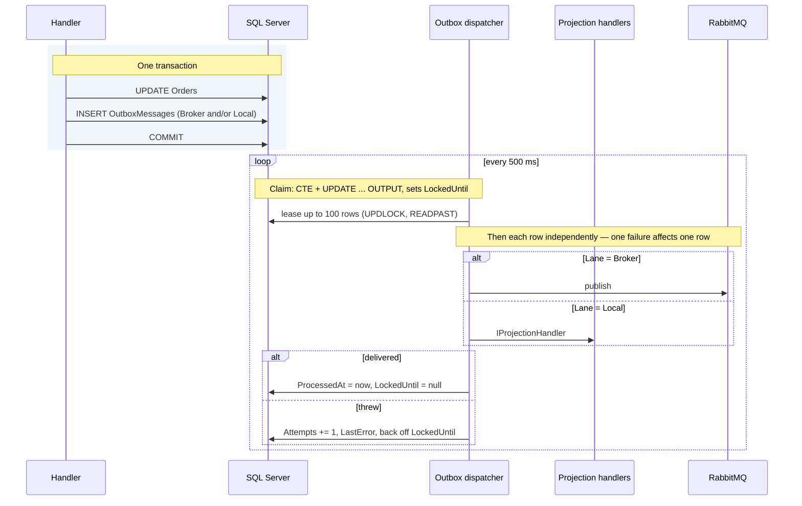

# 9. Messaging

## 9.1 Integration events

Integration events are the public contract of a service. They are published
facts about the past, and they must be boring: primitives, no domain types, no
behaviour, no assumptions about the consumer.

The three envelope fields every event carries are an interface, not a
convention — the consumer adapter needs `OccurredAt` to measure delivery lag
([§13.3](13-observability.md)) and cannot read it off an unconstrained type parameter:

```csharp
namespace Common.Contracts;

/// <summary>
/// Implemented by every integration event. No behaviour and no domain types —
/// three primitives, which is what keeps this legal under §9.1's rule that a
/// contract may not name a domain type.
/// </summary>
public interface IIntegrationEvent
{
    Guid MessageId { get; }
    Guid CorrelationId { get; }
    DateTimeOffset OccurredAt { get; }
}
```

> **`MessageId` here is *the* message id, not a second one.** The envelope's
> value is what `Stage` writes to the outbox row (§9.4), what the dispatcher
> puts on the transport, what MassTransit's header carries, and therefore what
> the inbox dedupes on (§9.5). Body, row, header and inbox key are one GUID.
>
> That has to be stated because the alternative is so easy to write and so hard
> to see: a `Guid.CreateVersion7()` in `Stage` would compile, work, and give
> every event two identities — one a consumer reads out of the payload, one the
> broker and the inbox use. Nothing fails. The cost arrives during an incident,
> when the id in the application log cannot be found in the inbox table, and
> the answer to "was this message processed?" becomes "which id do you mean?".
>
> `CorrelationId` follows the same rule for the same reason. The mapper decides
> it (§9.3 sets it from the order) precisely because a business correlation is
> more useful across a saga than an ambient request id, and a second value
> assigned at staging time would quietly replace that choice.

```csharp
namespace Common.Contracts.Ordering.V1;

public sealed record OrderConfirmed : IIntegrationEvent
{
    public required Guid MessageId { get; init; }
    public required Guid CorrelationId { get; init; }
    public required DateTimeOffset OccurredAt { get; init; }

    public required Guid OrderId { get; init; }
    public required Guid CustomerId { get; init; }
    public required decimal TotalAmount { get; init; }
    public required string Currency { get; init; }
    public required IReadOnlyList<ConfirmedLine> Lines { get; init; }
}

public sealed record ConfirmedLine(Guid ProductId, int Quantity, decimal UnitPrice);
```

`OrderPlaced` is the other contract worth writing out, because it is what the
fulfilment saga starts on (§9.6) and what `ReserveStock` draws its lines from:

```csharp
namespace Common.Contracts.Ordering.V1;

public sealed record OrderPlaced : IIntegrationEvent
{
    public required Guid MessageId { get; init; }
    public required Guid CorrelationId { get; init; }
    public required DateTimeOffset OccurredAt { get; init; }

    public required Guid OrderId { get; init; }
    public required Guid CustomerId { get; init; }
    public required decimal TotalAmount { get; init; }
    public required string Currency { get; init; }
    public required IReadOnlyList<PlacedLine> Lines { get; init; }
}

public sealed record PlacedLine(Guid ProductId, int Quantity, decimal UnitPrice);
```

Catalog's three follow the same shape and the same interface — they are what
Ordering's projection endpoint consumes (§9.8), and `IntegrationEventConsumer<T>`
will not compile against a type that lacks it:

```csharp
namespace Common.Contracts.Catalog.V1;

public sealed record PriceChanged : IIntegrationEvent
{
    public required Guid MessageId { get; init; }
    public required Guid CorrelationId { get; init; }
    public required DateTimeOffset OccurredAt { get; init; }

    public required Guid ProductId { get; init; }
    public required decimal Amount { get; init; }
    public required string Currency { get; init; }
}

// ProductPublished and ProductDiscontinued repeat the same three envelope
// members and add their own — listed in Appendix D.5, because §6.6's
// projections read them and a member no declaration and no inventory covers
// is how a sample stops being checkable. The envelope is written out on every
// contract rather than inherited from a base record: a shared base is a shared
// versioning fate (§9.2), and three properties is a cheaper price than that.
```

> **The constraint is the enforcement, and no test is needed for it.** A new
> event without `IIntegrationEvent` fails to compile the moment somebody binds
> a consumer to it — which is the only moment it starts mattering. Commands
> (`CancelOrder`, `ReserveStock`) deliberately do not implement it: they are
> routed by `CommandConsumer` (§9.4), they carry no envelope in the body, and
> their `MessageId` is the transport's.

> **Each contract owns its line type.** `PlacedLine` and `ConfirmedLine` have
> identical shapes today, and sharing one record would be the obvious economy.
> It is the wrong one: a field added to `OrderConfirmed`'s lines would silently
> change `OrderPlaced`'s payload, and the two contracts would have to version
> together — the coupling §9.2 exists to prevent. Duplication between published
> contracts is deliberate, for the same reason duplication between bounded
> contexts is ([§4.3](04-solution-structure.md)).

**Design guidance for event payloads.** There is a real trade-off between thin
events (ID only, consumer calls back for detail) and fat events (everything a
consumer might need). Thin events keep the contract small but reintroduce
synchronous coupling on the consume path. Fat events are self-contained but
duplicate data and grow over time.

This blueprint uses **fat-enough events**: carry the data consumers actually
need to act, established by asking them, not by guessing. `OrderConfirmed`
carries its `Lines` and `TotalAmount` because a consumer that has to act on the
order cannot do so from an identifier alone, and calling back for them would
reintroduce exactly the synchronous coupling the fat side of the trade-off is
bought to avoid.

> **"Fat enough" is bounded by [§11.7](11-identity-authorization.md), and the
> bound is not a matter of degree.** That section's rule — integration events
> carry identifiers, not personal data — is not one more consideration to weigh
> against a consumer's convenience; it decides the question before the
> trade-off above is reached. A broadcast event is copied into every consumer's
> store, sits in the broker, and survives in outbox rows that §9.4's retention
> purge deliberately does not delete — its `ProcessedAt IS NOT NULL` predicate
> is load-bearing, so an abandoned row keeps its payload indefinitely and a
> test pins that it does. A field placed on a broadcast event is a field
> erasure cannot reach.
>
> **`OrderConfirmed` used to carry a `ShippingAddressV1`, and this section used
> to argue for it** on the grounds that Shipping cannot function without the
> address and should not call back to get it. The first half is true and the
> second was the wrong remedy:
> [ADR-035](appendix-a-adrs.md#adr-035--a-broadcast-integration-event-carries-no-personal-data)
> records the removal and leaves the delivery mechanism to Shipping's own PR,
> where the code that needs the address will be in front of whoever chooses it.
> A postal address is personal data under GDPR Art. 4 and §11.7's erasure
> choreography had no way to reach it on any of those three surfaces.

## 9.2 Versioning

Contracts live in a versioned namespace: `Common.Contracts.Ordering.V1`.

**Additive changes** — new optional fields — do not require a version bump.
Consumers deserialising an unknown field ignore it.

**"Optional" is doing more work in that sentence than it looks, because
[§12.6](12-test-strategy.md)'s gate forbids an optional member — with one
exemption, which is the rest of this paragraph.** Every member of a live
contract here is `required` unless that gate's additive-member list names it,
and
the rule is enforced rather than observed. A member added as `required` is
therefore **not** an additive change
whatever this section calls it: `System.Text.Json` refuses a payload missing
one, so the new build faults every message the old build staged and has not yet
published — measured, not reasoned about. So an added member ships **optional
first and stays optional for the life of that contract version**; it is listed
in §12.6's suite by name, and the listing goes when the version does. **Not
"until the rollout ends", which is what this said**: a payload predating the
field has no bound on how long it can arrive — the error queue holds a message
until somebody handles it, outliving even its outbox row — so tightening the
member to `required` later would fail deserialisation on every retained one,
before any consumer branch could read the absent value. That is a breaking
change, and the paragraph below sends those to a new version.

**That tolerance is about fields and does not extend to anything else that can
be added.** A consumer ignores a field it does not know because the
deserialiser is built to; it does not ignore a *message type* it has no
consumer for, and it does not ignore a *member* of a closed vocabulary it does
not recognise. Both of those are additive by every ordinary reading and neither
is safe on its own, which is what makes this the sentence to be careful with
rather than the breaking-change paragraph below.

> **Consumer capability ships first, producer second, as two releases.**
> Anything a consumer must be able to *recognise* — a new message type, a new
> binding on an existing endpoint, a new value in a closed vocabulary — is
> deployed everywhere before the release that starts emitting it. Not a
> coordinated deploy: two ordinary releases in an order, which is
> [§7.4](07-persistence.md)'s expand/contract rule applied to a contract
> instead of a schema.
>
> **The two failure modes are opposite and only one is loud**, which is why
> the rule is stated rather than left to judgement. A new *binding* on a shared
> queue fails quietly: the broker hands the message to a replica whose build
> declares no consumer for it, MassTransit parks it in `<queue>_skipped`, and
> nothing threw. A new *vocabulary member* fails loudly and immediately: the
> mapper refuses a code it does not know, and [§9.8](09-messaging.md) excludes
> `ContractMappingException` from retries precisely so a malformed contract
> does not burn a minute of backoff — correct for a genuinely malformed
> message, wrong for a well-formed one from a newer producer, and the
> escalation reaches the error queue on the first attempt.
>
> **The vocabulary case is closed by ordering alone; the binding case costs a
> release.** Teach the mapper the new codes, deploy everywhere, then enable the
> transitions that emit them — the two halves are already in different builds,
> so the rule is free. A binding is harder because the consumer and the
> producer are in the *same* build: whatever declares `Event<T>` is what starts
> publishing `T`, so ordering the deploy separates nothing and the change has
> to be **split across two releases** before there is an order to impose.
> [§15.5](15-cicd-deployment.md) carries that and the alternative to it.
>
> **`<queue>_skipped` is alerted on from [§13.6](13-observability.md).** The
> rule above is checkable rather than a hope, because a message skipped during
> a rollout is meant to page someone rather than to vanish. **What the alert
> depends on is stated in
> [ADR-026](appendix-a-adrs.md#adr-026--consumer-capability-is-a-release-ahead-of-the-producer-that-uses-it)
> rather than assumed here**: per-queue broker metrics are a deployment
> prerequisite this repository does not configure, so the enforcement is
> owed a cluster that has. See
> [#131](https://github.com/alexander-shamray/dotnet-ddd-blueprint/issues/131).

**Breaking changes** — removing a field, renaming, changing a type, changing
semantics — require a new version. The publisher then emits both V1 and V2 for a
deprecation window, consumers migrate independently, and V1 is retired once
telemetry confirms no consumer remains on it.

There is no shortcut here. A "just this once" breaking change to a live contract
means a coordinated deploy, and coordinated deploys are the thing this
architecture exists to avoid.

> **A contract with no consumer is not live, and that is the one exception —
> stated here so it is a rule rather than an argument made at each site.**
> The deprecation window above exists to let consumers migrate independently.
> Where a version has none — no service deserialises it, and the service that
> will has not been built — there is nobody to migrate, and a V2 buys a window
> for an audience of nobody. The contract may then be changed in place.
>
> **Two conditions, both required.** No **service** in the solution may consume
> the version — a fact about which consumers are registered, not a judgement;
> and the change must be recorded in an ADR, so that "there was no consumer" is
> something a later reader can check rather than take on trust.
>
> **A test is not a consumer, and the distinction has to be stated or the
> condition is unusable.** §12.6's suite round-trips every contract through the
> bus serialiser, so *something* deserialises every version this platform
> owns — but a test moves with the contract in the same commit, which is
> precisely what a deprecation window exists to make unnecessary. What the
> window protects is a deployable that ships on its own schedule. The moment a
> consumer exists the rule above binds with no exception, and the window for
> the cheap edit has closed — which is the same observation §9.1 makes from the
> other direction: the PR that becomes a contract's first producer is the last
> one that can fix its shape for free.
>
> **Both conditions were met once, and naming the case is what the second one
> is for.** `OrderConfirmed` dropped its shipping address under exactly this
> rule: no service consumed the version — Shipping and Notifications are
> unbuilt, and Ordering's own saga reads only the `OrderId` — and
> [ADR-035](appendix-a-adrs.md#adr-035--a-broadcast-integration-event-carries-no-personal-data)
> records it. It is also an instance of the harmful-window class below rather
> than merely a cheap edit, which is why it did not take a V2.
>
> **For one class of change the deprecation window is not merely useless but
> harmful**, and it is worth naming because it inverts the rule's intent. When
> the point of the change is that a field *must not be on the wire* —
> [ADR-028](appendix-a-adrs.md#adr-028--a-money-movement-command-carries-no-subject)
> removing the subject from `AuthorisePayment` is the worked case — emitting
> V1 alongside V2 keeps the offending shape published, and consumable, for the
> length of the window. The standard remedy would re-arm the defect it was
> asked to fix.

## 9.3 Domain event → integration event: the allow-list mapper

[§5.5](05-tactical-ddd.md) states the principle — never publish a domain event to the bus. This is the
mechanism that makes it structural rather than aspirational.

Translation is **opt-in**. A mapper registry names each domain event type that
becomes an integration event, and how. Everything unregistered is local-only.

**Who calls this:** the mapper and publisher below are invoked by
`DomainEventDispatcher` ([§7.5](07-persistence.md)), not by command handlers. A handler that calls
either of them directly is a bug: the dispatcher runs at the single point where
every aggregate has finished changing, and a handler that stages earlier
serialises a snapshot the rest of the handler can still move on from. The
payload is written at `StageAsync` (the port below), not at commit, so a total adjusted
two lines later commits an outbox row that disagrees with the row beside it.
Both leave the transaction together and only one of them is right.

**The port is common; only the allow-list is per-service.** `DomainEventDispatcher`
([§7.5](07-persistence.md)) injects `IIntegrationEventMapper`, and common code cannot name a
per-service type — the same split this section already applies to
`IIntegrationEventPublisher` below.

```csharp
namespace Common.Application;

public interface IIntegrationEventMapper
{
    IReadOnlyList<object> Map(IReadOnlyList<IDomainEvent> domainEvents);
}
```

```csharp
namespace Ordering.Application.Integration;

internal sealed class OrderingIntegrationEventMapper : IIntegrationEventMapper
{
    // The allow-list. A domain event absent from this dictionary never
    // reaches the bus — by construction, not by review.
    private static readonly Dictionary<Type, Func<IDomainEvent, object>> Registry = new()
    {
        // Domain type in, contract type out. The suffix (§5.5) is what makes
        // that visible — with one name for both, this reads as identity.
        [typeof(OrderPlacedDomainEvent)] = e => ToContract((OrderPlacedDomainEvent)e),
        [typeof(OrderConfirmedDomainEvent)] = e => ToContract((OrderConfirmedDomainEvent)e),
        [typeof(OrderCancelledDomainEvent)] = e => ToContract((OrderCancelledDomainEvent)e),
        // OrderStockConfirmedDomainEvent is deliberately absent — internal only.
    };

    // V1.OrderPlaced, not OrderPlacedDomainEvent: Money is decomposed into a
    // decimal and an ISO code, because a contract may not carry domain types.
    private static V1.OrderPlaced ToContract(OrderPlacedDomainEvent e) => new()
    {
        MessageId = Guid.CreateVersion7(),
        CorrelationId = e.OrderId.Value,
        OccurredAt = e.OccurredAt,
        OrderId = e.OrderId.Value,
        CustomerId = e.CustomerId.Value,
        TotalAmount = e.Total.Amount,
        Currency = e.Total.Currency,
        // PlacedLine, not ConfirmedLine — OrderPlaced owns its own line type
        // so the two contracts can version independently (§9.1).
        Lines = [.. e.Lines.Select(l => new V1.PlacedLine(l.ProductId.Value, l.Quantity, l.UnitPrice.Amount))]
    };

    public IReadOnlyList<object> Map(IReadOnlyList<IDomainEvent> domainEvents)
    {
        List<object> mapped = [];

        foreach (IDomainEvent domainEvent in domainEvents)
        {
            if (!Registry.TryGetValue(domainEvent.GetType(), out Func<IDomainEvent, object> map))
                continue;                       // Unregistered → local-only. Not an error.

            mapped.Add(map(domainEvent));       // Registered and throwing → fails the command.
        }

        return mapped;
    }
}
```

The two failure semantics are deliberately different, and the distinction is the
whole point:

| Case | Behaviour | Why |
|---|---|---|
| Domain event **not** in the registry | Skipped silently. No bus message, no failure. | Most domain events are internal. Failing on them would force every new event to be published or explicitly suppressed |
| Registered mapper **throws** | The command fails and the transaction rolls back | Someone declared this event must be published. If it cannot be, the state change must not stand either |

There is deliberately **no `MustPublish` flag** on domain events. If it must
reach the bus, register it. One mechanism, one place to look.

### The publisher contract

`IIntegrationEventPublisher` is an Application port, and its implementation is
constrained normatively:

```csharp
namespace Common.Application;

public enum OutboxLane
{
    /// <summary>Published to the message broker. A public contract.</summary>
    Broker,

    /// <summary>Dispatched in-process after commit to IProjectionHandler&lt;T&gt;.
    /// Never leaves the service and is not a contract.</summary>
    Local
}

public interface IIntegrationEventPublisher
{
    /// <summary>
    /// Stages a message for delivery after the current transaction commits.
    /// </summary>
    Task StageAsync(object message, OutboxLane lane, CancellationToken ct);
}
```

The implementation **must**:

- Write an outbox row on the **same `DbContext`** the command handler is using,
  so it enlists in the same transaction.

The implementation **must not**:

- Call the broker transport directly — `IBus.Publish` inside a handler
  reintroduces the dual-write the outbox exists to eliminate.
- Introduce a **second** outbox table set alongside the existing one. Two outbox
  implementations means two dispatchers, two retention policies, two sets of
  ordering guarantees, and one of them will be the one nobody monitors.

All three are mistakes a competent developer makes in good faith, which is why
they are prohibitions rather than guidance.

**The third has exactly one recorded exception, and recording it is what keeps
it an exception.**
[ADR-032](appendix-a-adrs.md#adr-032--the-sagas-outbox-is-masstransits-in-the-sagas-own-transaction)
admits MassTransit's Entity Framework outbox on §9.6's saga receive endpoint,
which brings a second table set into the `ordering` schema. It is that endpoint
and no other: the platform's three ordinary receive endpoints keep
`UseInMemoryOutbox`, and every application-level integration event still goes
through §9.4's `OutboxMessages` and its dispatcher. The bullet's cost is paid
rather than dodged — there really are two retention policies now, and the ADR
says which job prunes which table and why folding them together would be worse.

**One exemption: sagas.** A MassTransit state machine (§9.6) sends and publishes
directly from its activities rather than through this port. That is correct and
deliberate — a saga is Infrastructure, and its outgoing messages are staged by
the outbox configured on its receive endpoint rather than by this port's,
committing in the transaction that persists the instance (ADR-032).

**Routing saga output through the application-level outbox is not an
alternative to that, and the sentence here used to say it was merely a
redundant one.** It read that doing so "would add a second staging hop with no
additional guarantee" — true only while the in-memory outbox was believed to be
durable, which it is not: it defers, it does not persist. The stronger objection
is availability rather than cost. The saga's waits are scheduled messages, the
delay is a transport feature
([ADR-021](appendix-a-adrs.md#adr-021--saga-timeouts-are-scheduled-by-the-broker)),
and no dispatcher of ours can replay a delay it never held — so an application
outbox would carry `AuthorisePayment` and not `PaymentTimeout`, closing half the
window and leaving the half with no bound at all.

The prohibition applies to **Application code**, which is where the dual-write
risk actually lives.

## 9.4 The transactional outbox

The core problem: a handler must change the database *and* publish a message.
These are two systems. Without care, the process can crash between them — the
order is placed but nobody is told, or the message is sent and the transaction
rolls back.

The outbox makes them one atomic operation by writing the message to the same
database, in the same transaction, and dispatching it afterwards.



```sql
CREATE TABLE ordering.OutboxMessages
(
    Id             BIGINT IDENTITY(1,1) PRIMARY KEY,
    MessageId      UNIQUEIDENTIFIER NOT NULL UNIQUE,
    CorrelationId  UNIQUEIDENTIFIER NOT NULL,
    MessageType    NVARCHAR(300)    NOT NULL,   -- a FullName is not ASCII by construction
    Payload        NVARCHAR(MAX)    NOT NULL,
    Lane           VARCHAR(16)      NOT NULL,   -- 'Broker' | 'Local'
    OccurredAt     DATETIMEOFFSET   NOT NULL,
    ProcessedAt    DATETIMEOFFSET   NULL,
    Attempts       INT              NOT NULL,
    LastError      NVARCHAR(2000)   NULL,
    LockedUntil    DATETIMEOFFSET   NULL     -- lease; also carries retry backoff
);

-- The shape, not a script: this table is generated by EF from the entity
-- configuration, so every column is written on insert and none carries a
-- database default. `Attempts INT NOT NULL DEFAULT 0` read better here and
-- was not what shipped — a difference that matters only to a hand-written
-- INSERT, which nothing in this design performs.

-- Filtered index: the dispatcher only ever scans unprocessed rows, and the
-- index stays small regardless of table size.
CREATE INDEX IX_Outbox_Unprocessed
    ON ordering.OutboxMessages (OccurredAt)
    INCLUDE (Lane, Attempts, LockedUntil)
    WHERE ProcessedAt IS NULL;

-- And its complement, for the retention purge. The two filters are opposites,
-- so the index above cannot serve the delete below by construction — it
-- excludes every row that delete targets. Without this one the hourly purge
-- scans the whole table, and it is the processed rows that make the table
-- large, so the scan grows exactly as the purge starts to matter.
CREATE INDEX IX_Outbox_Processed
    ON ordering.OutboxMessages (ProcessedAt)
    WHERE ProcessedAt IS NOT NULL;
```

`Lane` is what makes one table serve both after-commit destinations (§7.5).
`Broker` rows are published; `Local` rows are handed to in-process projection
handlers. Both get the same durability, the same retry accounting and the same
monitoring — which is the argument against a second, separate mechanism for
local reactions.

**Two types map to this table, deliberately.** The staging path writes whole
rows through EF Core; the dispatcher reads a narrow projection of the columns
its claim returns. Collapsing them into one type produces a class whose
`ProcessedAt` is always null on the read path and whose `LastError` is never
populated on the write path — see [Appendix D](appendix-d-type-inventory.md):

| Type | Used by | Shape |
|---|---|---|
| `OutboxMessage` | EF entity, `db.OutboxMessages` | All columns |
| `OutboxClaim` | Dapper, the dispatcher's `OUTPUT` projection | Id, MessageId, CorrelationId, MessageType, Payload, Lane, Attempts, OccurredAt |

```csharp
namespace Common.Infrastructure.Outbox;

public sealed class OutboxMessage
{
    public long Id { get; private set; }
    public Guid MessageId { get; private set; }
    public Guid CorrelationId { get; private set; }
    public string MessageType { get; private set; } = null!;
    public string Payload { get; private set; } = null!;
    public OutboxLane Lane { get; private set; }
    public DateTimeOffset OccurredAt { get; private set; }
    public DateTimeOffset? ProcessedAt { get; private set; }
    public int Attempts { get; private set; }
    public string? LastError { get; private set; }
    public DateTimeOffset? LockedUntil { get; private set; }

    public static OutboxMessage Stage(
        object message, OutboxLane lane, Guid correlationId,
        MessageTypeMap types, OutboxJson json)
    {
        // The lane decides which interface the payload must satisfy, and this
        // is what makes §9.3's allow-list structural rather than a
        // convention. `Map` returns `object` and the type map admits domain
        // events and contracts alike, so a mapper that returned the event it
        // was handed would stage it here and the dispatcher would publish it —
        // the leak §5.5 forbids, prevented by the mapper being written
        // correctly and by nothing else.
        if (lane is OutboxLane.Broker && message is not IIntegrationEvent)
        {
            throw new InvalidOperationException(
                $"{message.GetType().Name} is not an {nameof(IIntegrationEvent)} and cannot be " +
                "staged on the Broker lane. Map it to a contract first.");
        }

        if (lane is OutboxLane.Local && message is not IDomainEvent)
        {
            throw new InvalidOperationException(
                $"{message.GetType().Name} is not an {nameof(IDomainEvent)} and cannot be staged " +
                "on the Local lane, which carries this service's own events to its handlers.");
        }

        return new OutboxMessage
        {
            // One identity, not two. An integration event already carries its
            // MessageId and CorrelationId in the envelope the mapper filled in
            // (§9.3), and DeliverAsync copies the row's values onto the transport —
            // so minting a second GUID here would give the body one id and the
            // broker header another. The inbox dedupes on the transport id (§9.5),
            // which would then disagree with the id a support tool reads out of the
            // payload, and the only way to notice is to compare two logs.
            //
            // A Local-lane row carries a domain event, which has no envelope and
            // never reaches a broker, so the row mints its own id and takes the
            // caller's correlation — which OutboxPublisher makes one value per
            // scope, so rows staged by the same command correlate with each other.
            MessageId = message is IIntegrationEvent e ? e.MessageId : Guid.CreateVersion7(),
            CorrelationId = message is IIntegrationEvent c ? c.CorrelationId : correlationId,
            MessageType = types.NameOf(message.GetType()),
            Payload = JsonSerializer.Serialize(message, message.GetType(), json.Options),
            Lane = lane,

            // The message's own timestamp, never a staging clock. §13.7 defines
            // projection.lag as "event raised to projection applied", and a row
            // stamped when Stage ran drops the interval between the two — small,
            // and measured by the one metric whose name says it is included.
            //
            // No fallback arm and no `now` parameter: NameOf has already thrown
            // for anything the map does not hold, and the map admits only these
            // two interfaces, so one of them always matches.
            OccurredAt = message is IIntegrationEvent o
                ? o.OccurredAt
                : ((IDomainEvent)message).OccurredAt
        };
    }
}

/// <summary>
/// Dapper projection of the claim's OUTPUT clause. Read-only, and its members
/// must match that clause exactly — Dapper binds by name and leaves an
/// unmatched member at its default, so a column added here and not there is a
/// DateTimeOffset.MinValue nobody notices until a metric reads 55 years.
/// </summary>
public sealed record OutboxClaim(
    long Id,
    Guid MessageId,
    Guid CorrelationId,
    string MessageType,
    string Payload,
    string Lane,
    int Attempts,
    DateTimeOffset OccurredAt);
```

### The type name is a persisted contract

`MessageType` is written by one deployment and read by another. That makes the
obvious implementation — `AssemblyQualifiedName` out, `Type.GetType` back —
wrong in a way that only shows in production:

```
Ordering.Domain.Orders.Events.OrderPlacedDomainEvent, Ordering.Domain,
Version=1.0.0.0, Culture=neutral, PublicKeyToken=null
```

Every row carries the assembly version that staged it. Bump it — which a release
pipeline does automatically — and `Type.GetType` returns `null` for every row
written before the deploy. The dispatcher then exhausts its attempts on a batch
of perfectly good messages and abandons them. Nothing is lost, nothing is
delivered, and the only symptom is outbox depth climbing after a release that
looked clean. Trimming, single-file publish and moving a type between assemblies
break it the same way.

The fix is a name the code chooses rather than one the runtime computes:

```csharp
namespace Common.Infrastructure.Outbox;

/// <summary>
/// The assemblies whose events may be staged, and the persisted-name overrides
/// beside them. Mutable and resolved before the map, so a test host can add its
/// own without replacing the registration — the production assemblies are
/// always in the list (§4.2).
/// </summary>
public sealed class MessageTypeSource(params Assembly[] assemblies)
{
    private readonly List<Assembly> _assemblies = [.. assemblies];
    private readonly Dictionary<string, Type> _aliases = [];
    private readonly Dictionary<Type, string> _written = [];

    public IEnumerable<Assembly> Assemblies => _assemblies;

    public IReadOnlyDictionary<string, Type> Aliases => _aliases;

    public IReadOnlyDictionary<Type, string> WrittenNames => _written;

    public MessageTypeSource Add(Assembly assembly)
    {
        _assemblies.Add(assembly);
        return this;
    }

    /// <summary>
    /// A name a type answered to before it was renamed, so both resolve to it
    /// for one release. Inward only: NameOf goes on writing the current name,
    /// which is what makes release 3 below a deletion rather than a migration
    /// of its own.
    /// </summary>
    public MessageTypeSource Alias(string persistedName, Type type)
    {
        _aliases.Add(persistedName, type);
        return this;
    }

    /// <summary>
    /// Keeps writing a type's previous persisted name, so rows this instance
    /// stages stay readable by instances that have not been replaced yet. The
    /// other direction, and live for exactly as long.
    /// </summary>
    public MessageTypeSource WriteAs(Type type, string persistedName)
    {
        _written.Add(type, persistedName);
        return this;
    }
}

/// <summary>
/// Two-way map between a stageable type and its persisted name. Built from the
/// source above, so it cannot list a name for a type that no longer exists —
/// and, being a singleton built at startup, a duplicate name fails the host
/// rather than the first message.
/// </summary>
public sealed class MessageTypeMap
{
    /// <summary>
    /// The widest name the MessageType column holds, and the reason the
    /// constant lives here rather than beside the EF configuration that spells
    /// it: the map is what decides a type is stageable, so the map is what has
    /// to refuse a name the column cannot keep. Read by both.
    /// </summary>
    public const int MaxNameLength = 300;

    private readonly FrozenDictionary<string, Type> _byName;
    private readonly FrozenDictionary<Type, string> _byType;

    // The overloads exist because most services register no override at all,
    // and a rename that adds one must not be a change to every call site.
    public MessageTypeMap(IEnumerable<Assembly> assemblies)
        : this(assemblies, new Dictionary<string, Type>())
    {
    }

    public MessageTypeMap(IEnumerable<Assembly> assemblies, IReadOnlyDictionary<string, Type> aliases)
        : this(assemblies, aliases, new Dictionary<Type, string>())
    {
    }

    public MessageTypeMap(
        IEnumerable<Assembly> assemblies,
        IReadOnlyDictionary<string, Type> aliases,
        IReadOnlyDictionary<Type, string> writtenNames)
    {
        // FullName, not AssemblyQualifiedName: namespace and type name, no
        // version and no assembly. For contracts the namespace is already
        // versioned (§9.2), so this IS the contract. For domain events it is
        // internal, and a rename is then a migration the team chose rather than
        // one a build number made for it.
        (string Name, Type Type)[] pairs =
        [
            .. assemblies
                .SelectMany(a => a.GetTypes())
                // Not IsClass: neither interface carries a class constraint,
                // so a `readonly record struct` domain event compiles, raises
                // and dispatches like any other — and an IsClass filter drops
                // it here in silence, leaving NameOf to throw inside the
                // transaction that staged it.
                .Where(t => t is { IsAbstract: false, IsInterface: false } &&
                    (t.IsAssignableTo(typeof(IIntegrationEvent)) ||
                        t.IsAssignableTo(typeof(IDomainEvent))))
                .Select(t => (Name: t.FullName!, Type: t))
        ];

        // Checked at startup, where MessageTypeMapValidator resolves the map,
        // rather than at SaveChanges: a deep namespace with nested generic
        // arguments passes every other guard and then fails the insert on a
        // truncation error, with the command lost and the cause named nowhere.
        //
        // A loop, not FirstOrDefault: the sequence is of value tuples, so "no
        // match" comes back as (null, null) rather than as null, and a nullable
        // wrapper around it is never null.
        foreach ((string Name, Type Type) pair in pairs)
        {
            if (pair.Name.Length > MaxNameLength)
            {
                throw new InvalidOperationException(
                    $"{pair.Type.Name}'s persisted name is {pair.Name.Length} characters and the " +
                    $"outbox column holds {MaxNameLength}. Shorten the namespace, or move the type.");
            }
        }

        IGrouping<string, (string Name, Type Type)>? clash =
            pairs.GroupBy(p => p.Name).FirstOrDefault(g => g.Count() > 1);
        if (clash is not null)
        {
            throw new InvalidOperationException(
                $"Two staged types share the name '{clash.Key}'. The outbox " +
                "column cannot distinguish them.");
        }

        // Three of the five guards the callout below names. Every other name in
        // this map is derived from a type and length checked above; an alias is
        // typed by hand, so it is the one that can exceed the column.
        foreach ((string Name, Type Type) alias in aliases.Select(a => (a.Key, a.Value)))
        {
            if (alias.Name.Length > MaxNameLength)
            {
                throw new InvalidOperationException(
                    $"The alias '{alias.Name}' is {alias.Name.Length} characters and the outbox " +
                    $"column holds {MaxNameLength}. No row can carry it.");
            }

            if (pairs.Any(p => p.Name == alias.Name))
            {
                throw new InvalidOperationException(
                    $"'{alias.Name}' is an alias and also a live type name. One of them resolves " +
                    "and which is not decidable — rename the alias or drop it.");
            }

            if (!pairs.Any(p => p.Type == alias.Type))
            {
                throw new InvalidOperationException(
                    $"'{alias.Name}' aliases {alias.Type.Name}, which this map does not carry. An " +
                    "alias names a type that is still stageable — one that is not is a row nobody " +
                    "can deliver and a guard nobody applies.");
            }
        }

        // An alias resolves inward, so _byName carries it and a row written
        // before the rename still resolves. Outward is the opt-in half below.
        _byName = pairs
            .Select(p => (p.Name, p.Type))
            .Concat(aliases.Select(a => (Name: a.Key, Type: a.Value)))
            .ToFrozenDictionary(p => p.Name, p => p.Type);

        // The other two guards. An overridden name must be one this map can
        // read back, and it has to read back to THIS type — a name resolving to
        // a different one is a substitution rather than a delivery failure, and
        // the only one of the five with no symptom to notice.
        foreach ((Type Type, string Name) written in writtenNames.Select(w => (w.Key, w.Value)))
        {
            if (!_byName.TryGetValue(written.Name, out Type? resolves))
            {
                throw new InvalidOperationException(
                    $"{written.Type.Name} is written as '{written.Name}', which this map cannot " +
                    "resolve. Alias that name to the type in the same release, or the rows this " +
                    "instance stages are rows it cannot itself deliver.");
            }

            if (resolves != written.Type)
            {
                throw new InvalidOperationException(
                    $"{written.Type.Name} is written as '{written.Name}', which resolves to " +
                    $"{resolves.Name}. Every row staged for {written.Type.Name} would be read " +
                    $"back as {resolves.Name} — a substitution, not a delivery failure.");
            }
        }

        _byType = pairs.ToFrozenDictionary(
            p => p.Type,
            p => writtenNames.TryGetValue(p.Type, out string? written) ? written : p.Name);
    }

    public string NameOf(Type type) =>
        _byType.TryGetValue(type, out string? name) ? name
            : throw new InvalidOperationException(
                $"{type.Name} is not a stageable message type. Staging it would " +
                "write a row the dispatcher cannot resolve.");

    /// <summary>The Local lane's payload types — §12.4 round-trips each.</summary>
    public IEnumerable<Type> StageableDomainEvents =>
        _byType.Keys.Where(t => t.IsAssignableTo(typeof(IDomainEvent)));

    public Type Resolve(string name) =>
        _byName.TryGetValue(name, out Type? type) ? type
            : throw new InvalidOperationException(
                $"Unknown message type '{name}'. A type was renamed or removed " +
                "while rows naming it were still unprocessed — drain the outbox " +
                "before deleting a message type (§9.4).");
}
```

Both directions throw, and both throw at the point of the mistake. `NameOf`
fails when something unstageable is staged — in the transaction, so the command
fails rather than the outbox filling with rows nobody can deliver. `Resolve`
fails on the dispatcher, where the message that names a departed type is the one
that lands in the retry log with its own name in it.

> **A renamed message type is a migration, and it takes three releases.** The
> rule that follows from this map is the one nobody remembers under deadline: a
> type may not be renamed or deleted while unprocessed rows still name it. It
> is expand and contract, the same shape as every backward-compatible schema
> change (ADR-007) — and both directions are live, which is the half that is
> easy to miss.
>
> During a rolling deploy the two versions share the table. An **alias** lets a
> replaced instance resolve the name its predecessors write. It does nothing
> about the other direction: a replaced instance also *writes* the new name
> immediately, and the instances still running cannot resolve that, so their
> dispatchers burn the attempt cap on rows that are perfectly good. Fixing one
> direction and calling the rename safe is how the procedure loses messages
> while looking careful.
>
> So `WriteAs` pairs with `Alias`, and **both calls name the old name** — the
> renamed type's current name is derived, and aliasing a name the map already
> derives is what the collision guard exists to refuse:
>
> ```csharp
> // Release 1 — the type is now OrderPlacedDomainEvent; rows in flight say
> // OrderPlaced. Resolve both, write the one every instance can read.
> services.AddSingleton(
>     new MessageTypeSource(typeof(V1.OrderPlaced).Assembly, typeof(Order).Assembly)
>         .Alias("Ordering.Domain.Orders.Events.OrderPlaced", typeof(OrderPlacedDomainEvent))
>         .WriteAs(typeof(OrderPlacedDomainEvent), "Ordering.Domain.Orders.Events.OrderPlaced"));
> ```
>
> **The registration is half the procedure, and it is the half that used to be
> missing.** §4.2 builds the map from `source.Assemblies`, `source.Aliases` and
> `source.WrittenNames` — all three. A factory passing only the assemblies
> drops both calls above on the floor: the host starts, every guard below
> passes vacuously because there is nothing to guard, and the rename proceeds
> to abandon rows exactly as it would have with no procedure at all. Two
> overrides recorded on an object nobody reads is worse than none, because the
> call sites read as the fix.
>
> **Release 2** drops the `WriteAs`: the new name is written, and release one's
> instances resolve it because they already carry the renamed type — derived,
> not aliased, which is why nothing has to be added for them. **Release 3**
> drops the `Alias`, once no unprocessed row still names the old one — the
> deletion the drain rule above is about.
>
> Five guards keep the pair honest, and each fails the host rather than a
> message. An alias that **shadows a live type name** is refused, on the
> duplicate-name argument one indirection over: two types would answer to one
> name and which resolves is not decidable. An alias **onto a type the map does
> not carry** is refused, because the dispatcher trusts the row's `Lane` rather
> than re-deriving it — an old `Broker` name pointed at a domain event would
> publish that domain event, reopening the leak `Stage`'s guards close. An
> alias **longer than the column** is refused, since no row can ever carry it.
> A `WriteAs` naming something **the map cannot resolve** is refused, because
> that instance would stage rows it could not itself deliver. And a `WriteAs`
> naming **another type** is refused, which is the quiet one: the row is
> written, claimed and delivered, and the payload is deserialised as something
> it never was — a substitution rather than a failure, and the only one of the
> five with no symptom to notice.

### The payload is a persisted format too

The name is half of it. `Payload` is JSON written by one deployment and read by
another, and on the `Local` lane it holds a **domain event** — a type §5.5
explicitly describes as "free to change with the code". Both statements are
true and together they are a trap: a member renamed between the stage and the
deliver silently deserialises to its default, because that is what
`System.Text.Json` does with a property it cannot match.

Two rules, and one registration that makes the first checkable:

```csharp
namespace Common.Infrastructure.Outbox;

/// <summary>
/// One instance, registered as a singleton, resolved by both sides. Staging
/// and delivering must agree, and the way they stop agreeing is one of them
/// picking up a host-wide default that was changed for an API's benefit.
/// </summary>
public sealed class OutboxJson
{
    public OutboxJson(IEnumerable<JsonConverter> converters)
    {
        Options = new JsonSerializerOptions
        {
            // Explicitly the defaults that matter, rather than inherited ones:
            // property names as declared, numbers as numbers, no case-insensitive
            // rescue on the way back in — a payload that only round-trips because
            // matching is lenient is a payload that will not survive a rename.
            PropertyNamingPolicy = null,
            PropertyNameCaseInsensitive = false,
            NumberHandling = JsonNumberHandling.Strict
        };

        foreach (JsonConverter converter in converters)
            Options.Converters.Add(converter);

        // Frozen at construction, because the instance is reached from a
        // background service and from every command scope at once and
        // JsonSerializerOptions is only thread-safe once it is read-only.
        // populateMissingResolver, because freezing is a promise that nothing
        // more will be discovered — the reflection-based default has to be
        // attached here rather than on first use.
        Options.MakeReadOnly(populateMissingResolver: true);
    }

    public JsonSerializerOptions Options { get; }
}
```

**Domain events on the `Local` lane must round-trip through this instance**, and
that is asserted in [§12.4](12-test-strategy.md) — `Every_stageable_domain_event_round_trips_through_the_outbox_options`,
written out there with the other outbox tests. It does **not** join §12.6's
contract suite, which selects on the `Common.Contracts.` namespace and so can
never see a domain event, by the same rule that keeps domain types out of
contracts.

The assertion catches the private constructor, the computed-property-with-no-setter
and the interface-typed member on the day it is introduced rather than on the
day a deploy happens to land mid-batch.

> **A value object needs a converter, and the service's Infrastructure owes it.**
> §5.3's `Money` is a `readonly record struct` with a private constructor and
> two get-only properties, and `System.Text.Json` does not refuse that shape —
> a struct always has a parameterless constructor, so it builds the default,
> finds no setter to call, and returns `Amount = 0` with a null `Currency`.
> Every domain event carrying one deserialises to nonsense on this lane.
>
> The domain must not fix it. A `[JsonConstructor]` puts `System.Text.Json` in
> a domain assembly, which §4.2's allow-list gate forbids by name; making the
> constructor public gives up the always-valid principle §5.3 is built on, and
> does not even work — for a struct the implicit parameterless constructor
> wins, so a public parameterised one is never selected. What does work is a
> `JsonConverter<Money>` registered by the service's Infrastructure, beside the
> `ComplexProperty` mapping that already turns the same type into two columns.
> Same layer, same reason, and the domain type knows about neither.
>
> This is why `OutboxJson` takes its converters rather than declaring options
> and nothing else: the converters are half of what "both sides agree" means,
> and a static field could only ever have said the other half.

**And a renamed member is a migration, exactly as a renamed type is.** The drain
rule above covers both: unprocessed rows name types *and* describe shapes, and
the outbox is empty for a few seconds many times a day. Draining before a rename
costs nothing; discovering afterwards that yesterday's rows deserialise with a
`Total` of zero costs an afternoon and a corrected read model.

> **The alternative — stage a DTO instead of the domain type — was considered
> and rejected.** It would decouple the persisted shape from the domain, at the
> price of a second type per event, a mapper, and a place for the two to
> disagree. The `Local` lane is drained in seconds, which is what makes the
> cheaper option viable: the exposure is one batch, not one release cycle.
> That reasoning stops holding the moment the lane backs up for hours, so if the
> §13.6 outbox-age alert becomes routine rather than exceptional, revisit this
> before the backlog makes the decision for you.

The dispatcher runs as a background service in two phases: an atomic **claim**
that leases a batch of rows, then **per-row delivery** where each message
succeeds or fails on its own.

> **Every row is delivered and accounted for independently.** Wrapping a whole
> batch in one transaction is the obvious implementation and is wrong: a single
> failing projection would roll back the batch and block every healthy `Broker`
> row behind it, so a read-model bug in this service would stop publishing to
> every other service. The lanes can only be alerted on separately (§13.6) if
> they can actually fail separately.

The dispatcher lives in `Common.Infrastructure`, so its three statements
cannot name a schema — `ordering.` below is what the sample would be in
Ordering's assembly, and there is no such assembly. The schema is a registered
value instead:

```csharp
namespace Common.Infrastructure;

/// <summary>
/// The one place a schema is checked and delimited. Two registered values need
/// it — OutboxTable and §9.5's InboxTable — and a second copy of the pattern is
/// a second answer to "what is a legal schema here", which is not a question
/// that gets to have two.
/// </summary>
internal static partial class SqlSchema
{
    public static string Qualify(string schema, string table, string paramName)
    {
        if (!Identifier().IsMatch(schema))
        {
            throw new ArgumentException(
                $"'{schema}' is not a SQL identifier, and the schema is interpolated " +
                "into this service's messaging statements rather than parameterised.",
                paramName);
        }

        // Delimited: the pattern above admits reserved words and a service
        // may legitimately be called `User`, whose `FROM user.OutboxMessages`
        // SQL Server cannot read. Brackets rather than a keyword blacklist,
        // which would need extending with every release — and nothing needs
        // escaping inside them, because the pattern has already refused
        // everything but letters, digits and underscore. The table name is a
        // literal supplied by the two types below, never by a caller.
        return $"[{schema}].{table}";
    }

    // Bounded at 128, which is what `sysname` holds: a longer schema
    // constructs happily and then fails every statement composed from it.
    [GeneratedRegex(@"^[A-Za-z_][A-Za-z0-9_]{0,127}$")]
    private static partial Regex Identifier();
}
```

```csharp
namespace Common.Infrastructure.Outbox;

/// <summary>
/// Where this service's outbox lives. Shape-checked on construction, because
/// the schema is interpolated into the statements below rather than
/// parameterised — a schema cannot be a parameter, and what cannot be a
/// parameter has to be a value the type refuses to hold wrongly.
/// </summary>
public sealed class OutboxTable
{
    public OutboxTable(string schema)
    {
        QualifiedName = SqlSchema.Qualify(schema, "OutboxMessages", nameof(schema));
        Schema = schema;
    }

    public string Schema { get; }

    public string QualifiedName { get; }
}
```

> **The check is shared, and that is the whole reason it is a separate type.**
> §9.5's `InboxTable` is this class with one word changed, so a reader who
> copies the constructor above rather than calling `SqlSchema` gets two answers
> to one question — the 128-character bound, the reserved-word argument and the
> bracket-quoting, maintained twice. Each service builds both tables from
> **one** schema literal (§4.2), which is what keeps the pair from naming
> different schemas; sharing the guard is what keeps them from disagreeing
> about what a schema may be.

> **The alternative is a dispatcher per service, and that is §9.3's prohibition
> on a second outbox table set arriving by the back door.** Two dispatchers
> means two retention policies, two sets of ordering guarantees, and one of
> them being the one nobody monitors.
>
> **That argument is untouched by
> [ADR-032](appendix-a-adrs.md#adr-032--the-sagas-outbox-is-masstransits-in-the-sagas-own-transaction),
> and the difference is what makes the exception one.** The ADR admits
> MassTransit's outbox on the saga's receive endpoint, which stages what the
> **state machine** sends inside the consume transaction — a job this
> dispatcher does not do and cannot be given, since a scheduled message's
> delay is a transport feature
> ([ADR-021](appendix-a-adrs.md#adr-021--saga-timeouts-are-scheduled-by-the-broker))
> that no dispatcher of ours could replay. A second dispatcher for *these*
> rows would be a second answer to the question this one already answers,
> which is exactly what the paragraph above refuses.

```csharp
public sealed class OutboxDispatcher : BackgroundService
{
    // Public, and only because §13.6's abandoned-rows gauge counts exactly the
    // rows this claim skips. One declaration with two readers beats two copies
    // that stop agreeing the day somebody tunes the cap — which is the same
    // argument OutboxTable makes about the schema, one field over.
    public const int MaxAttempts = 10;

    // Compiled once rather than parsed per call. CA1848 is enforced by ADR-019
    // and this loop runs twice a second — see §13.3's LoggingBehavior, which
    // takes the same shape for the same reason.
    private static readonly Action<ILogger, Exception?> ClaimFailed =
        LoggerMessage.Define(
            LogLevel.Error,
            new EventId(1, nameof(ClaimFailed)),
            "Outbox claim failed; retrying next tick.");

    // string, not OutboxLane: the claim reads the column, and OutboxClaim.Lane
    // is a string for the reason its own summary gives.
    private static readonly Action<ILogger, Guid, string, int, int, Exception?> DeliveryFailed =
        LoggerMessage.Define<Guid, string, int, int>(
            LogLevel.Error,
            new EventId(2, nameof(DeliveryFailed)),
            "Outbox message {MessageId} on lane {Lane} failed, attempt {Attempt} of {Max}.");

    private readonly IServiceScopeFactory _scopes;
    private readonly ILogger<OutboxDispatcher> _log;

    // Composed once from the registered table. Instance fields rather than
    // consts for that reason and no other.
    private readonly string _claimSql;
    private readonly string _completeSql;
    private readonly string _failSql;

    public OutboxDispatcher(IServiceScopeFactory scopes, OutboxTable table, ILogger<OutboxDispatcher> log)
    {
        _scopes = scopes;
        _log = log;

        // Atomic claim: selects and leases in one statement, so two replicas
        // cannot take the same row. READPAST skips rows another replica holds.
        _claimSql =
            $"""
            WITH claimable AS (
                SELECT TOP (100) *
                FROM {table.QualifiedName} WITH (UPDLOCK, READPAST, ROWLOCK)
                WHERE ProcessedAt IS NULL
                    AND Attempts < @MaxAttempts
                    AND (LockedUntil IS NULL OR LockedUntil < SYSDATETIMEOFFSET())
                ORDER BY OccurredAt
            )
            UPDATE claimable
            SET LockedUntil = DATEADD(second, 60, SYSDATETIMEOFFSET())
            OUTPUT
                inserted.Id,
                inserted.MessageId,
                inserted.CorrelationId,
                inserted.MessageType,
                inserted.Payload,
                inserted.Lane,
                inserted.Attempts,
                inserted.OccurredAt;
            """;

        _completeSql =
            $"""
            UPDATE {table.QualifiedName}
            SET ProcessedAt = SYSDATETIMEOFFSET(), LockedUntil = NULL
            WHERE Id = @Id;
            """;

        // Increments the attempt counter and backs off exponentially by
        // pushing the lease forward. This is what makes the cap — and the
        // abandoned-row alert in §13.6 — reachable.
        _failSql =
            $"""
            UPDATE {table.QualifiedName}
            SET
                Attempts    = Attempts + 1,
                LastError   = LEFT(@Error, 2000),
                LockedUntil = DATEADD(
                    second,
                    POWER(2, CASE WHEN Attempts > 8 THEN 8 ELSE Attempts END) * 5,
                    SYSDATETIMEOFFSET())
            WHERE Id = @Id;
            """;
    }

    // stoppingToken, not ct: CA1725 requires an override to keep the base's
    // parameter name (ADR-019 makes it an error), and a reader consulting
    // BackgroundService's documentation is reading about that one.
    protected override async Task ExecuteAsync(CancellationToken stoppingToken)
    {
        using PeriodicTimer timer = new(TimeSpan.FromMilliseconds(500));

        while (await timer.WaitForNextTickAsync(stoppingToken))
        {
            try
            {
                await ProcessBatchAsync(stoppingToken);
            }
            catch (Exception ex) when (!stoppingToken.IsCancellationRequested)
            {
                // The claim itself failed — database unreachable. Next tick.
                // The token rather than the type, for the reason the per-row
                // filter below gives.
                ClaimFailed(_log, ex);
            }
        }
    }

    /// <summary>
    /// One claim-and-deliver pass. Returns the number of rows completed.
    /// Public so tests drive it directly instead of racing a timer — see §12.4.
    /// </summary>
    public async Task<int> ProcessBatchAsync(CancellationToken ct)
    {
        // The claim's own scope, holding nothing but the connection — which
        // deliberately outlives the per-row scopes below, because the claim,
        // the completes and the fails are one conversation with the database
        // rather than part of any delivery.
        await using AsyncServiceScope claimScope = _scopes.CreateAsyncScope();

        // Disposed every pass — the loop runs twice a second, so a leaked
        // connection here exhausts the pool within a minute.
        using IDbConnection connection =
            claimScope.ServiceProvider.GetRequiredService<IDbConnectionFactory>().Create();

        // OutboxClaim, not OutboxMessage — the claim projects only the columns
        // the OUTPUT clause returns. See Appendix D. CommandDefinition, so the
        // token reaches the command: with the plain overload a shutdown cannot
        // interrupt a blocked claim and the host waits out the SQL timeout.
        List<OutboxClaim> claimed =
        [
            .. await connection.QueryAsync<OutboxClaim>(
                new CommandDefinition(_claimSql, new { MaxAttempts }, cancellationToken: ct))
        ];

        int completed = 0;

        foreach (OutboxClaim message in claimed)
        {
            try
            {
                // A scope per row, and this is what makes per-row isolation
                // true rather than intended: projection handlers are scoped
                // and so is the DbContext behind them, so one scope for a
                // hundred rows hands the next row a half-mutated tracker.
                await using AsyncServiceScope delivery = _scopes.CreateAsyncScope();

                await DeliverAsync(delivery.ServiceProvider, message, ct);

                await connection.ExecuteAsync(
                    new CommandDefinition(_completeSql, new { message.Id }, cancellationToken: ct));
                completed++;
            }
            catch (Exception ex) when (!ct.IsCancellationRequested)
            {
                // One bad message does not affect the other 99.
                //
                // The filter asks the token, not the exception type. A handler
                // enforcing its own deadline throws OperationCanceledException
                // while ct is still live, and a type test would let that row
                // escape with no attempt recorded and every row behind it left
                // leased — a delivery failure disguised as a shutdown.
                await connection.ExecuteAsync(
                    new CommandDefinition(
                        _failSql, new { message.Id, Error = ex.ToString() }, cancellationToken: ct));

                DeliveryFailed(_log, message.MessageId, message.Lane, message.Attempts + 1, MaxAttempts, ex);
            }
        }

        return completed;
    }

    private static async Task DeliverAsync(IServiceProvider sp, OutboxClaim message, CancellationToken ct)
    {
        // Through the map, not Type.GetType: the column holds a name this code
        // chose, and it has to survive the version bump of the assembly that
        // wrote it.
        Type type = sp
            .GetRequiredService<MessageTypeMap>()
            .Resolve(message.MessageType);
        // The same registered instance Stage wrote through, converters
        // included — which is what "both sides must agree" means now that a
        // value object's shape depends on one.
        object payload = JsonSerializer.Deserialize(
            message.Payload,
            type,
            sp.GetRequiredService<OutboxJson>().Options)!;

        if (message.Lane == nameof(OutboxLane.Broker))
        {
            await sp.GetRequiredService<IPublishEndpoint>().Publish(
                payload,
                type,
                c =>
                {
                    c.MessageId = message.MessageId;
                    c.CorrelationId = message.CorrelationId;
                },
                ct);
            return;
        }

        // Anything that is neither is a column that has drifted, and guessing
        // at it would run an unknown payload through the projection handlers.
        // Throwing leaves the row for §13.6's abandoned-row alert with its own
        // lane value in LastError.
        //
        // nameof rather than a literal on both branches: the enum is what
        // writes this column, so a member renamed without a migration should
        // stop compiling here rather than silently stop matching.
        if (message.Lane != nameof(OutboxLane.Local))
        {
            throw new InvalidOperationException(
                $"Outbox row {message.MessageId} carries lane '{message.Lane}', which is neither " +
                "Broker nor Local.");
        }

        // Local lane: this service's own projection handlers, running safely
        // outside the write transaction that produced the event (§7.5).
        // OccurredAt comes from the row, not the payload: the invoker is
        // generic and unconstrained, so it has no typed access to a member the
        // payload may or may not have (§13.3). The row carries the instant the
        // aggregate raised the event, copied there by Stage — so the lag
        // §13.7 measures spans the raise, the commit and the poll, which is
        // the honest reading of "how stale is this read model".
        await ProjectionInvoker.InvokeAllAsync(sp, payload, type, message.OccurredAt, ct);
    }
}
```

`ProjectionInvoker` resolves and calls the handlers for a runtime type. It uses
the same cached-delegate approach as the dispatcher in [§6.2](06-cqrs.md), so the reflection
cost is paid once per event type rather than once per message:

```csharp
internal static class ProjectionInvoker
{
    private static readonly ConcurrentDictionary<Type, Invoker> Cache = new();

    public static Task InvokeAllAsync(
        IServiceProvider sp,
        object payload,
        Type eventType,
        DateTimeOffset occurredAt,
        CancellationToken ct) =>
        Cache
            .GetOrAdd(eventType, static t => (Invoker)Activator.CreateInstance(typeof(Invoker<>).MakeGenericType(t))!)
            .InvokeAllAsync(sp, payload, occurredAt, ct);

    private abstract class Invoker
    {
        public abstract Task InvokeAllAsync(
            IServiceProvider sp, object payload,
            DateTimeOffset occurredAt, CancellationToken ct);
    }

    private sealed class Invoker<TEvent> : Invoker
    {
        public override async Task InvokeAllAsync(
            IServiceProvider sp, object payload,
            DateTimeOffset occurredAt, CancellationToken ct)
        {
            IProjectionHandler<TEvent>[] handlers = [.. sp.GetServices<IProjectionHandler<TEvent>>()];

            // A Local row is staged only when IProjectionRegistry found a
            // handler (§7.5). Finding none here means the handler was
            // implemented but never registered — fail loudly rather than
            // marking the row processed having done nothing.
            if (handlers.Length == 0)
            {
                throw new InvalidOperationException(
                    $"No IProjectionHandler<{typeof(TEvent).Name}> is registered, " +
                    "but a Local outbox row was staged for it. Check the §6.2 scan.");
            }

            // Sequential, not concurrent: two projections writing the same read
            // table in parallel is a deadlock waiting for load to find it.
            foreach (IProjectionHandler<TEvent> handler in handlers)
                await handler.HandleAsync((TEvent)payload, ct);

            // Raised-to-applied (§13.7), recorded after the handlers rather
            // than before: the SLO is about when the read model became
            // correct, not when work on it started. Resolved from sp because
            // this type is static and cached — it has no constructor to inject.
            sp.GetRequiredService<MessagingMetrics>().Projected(
                typeof(TEvent).Name,
                sp.GetRequiredService<TimeProvider>().GetUtcNow() - occurredAt);
        }
    }
}
```

If any handler throws, the exception propagates to the per-row `catch` above and
the whole row is retried — meaning **every** handler for that event runs again.
That is the reason §6.6 insists projections are idempotent; with more than one
handler per event it is not a theoretical concern.

Consequences of the per-row design worth stating explicitly:

- **A message that keeps failing reaches `Attempts = 10` and stops being
  claimed.** It stays in the table with `ProcessedAt` still `NULL` and its
  `LastError` populated, which is exactly what the abandoned-row alert (§13.6)
  detects and what `outbox-abandoned.md` tells the operator to read. Replaying
  it is a matter of resetting `Attempts` to zero.
- **The retention purge must delete only rows with `ProcessedAt IS NOT NULL`.**
  Purging on age alone would silently destroy the abandoned rows that the alert
  exists to surface.
- **Strict global ordering is not guaranteed.** Rows are claimed in `OccurredAt`
  order, but a failed message backs off while later ones proceed, and multiple
  replicas run concurrently. Consumers must not assume ordering — which the
  out-of-order guard in §6.6 already assumes they cannot.
- **The 60-second lease bounds crash recovery.** If a dispatcher dies mid-batch,
  its claimed rows become available again a minute later rather than being stuck
  behind a lock that no longer has an owner.
- **And it can expire while the batch is still being delivered, which is a
  known residual rather than an oversight.** A claim leases up to 100 rows for
  60 seconds and delivers them one at a time; a batch slower than the lease
  lets a second replica reclaim the rows this one has not reached yet, and
  `CompleteSql` and `FailSql` match on `Id` alone, so the slow worker can then
  write over a lease it no longer holds. Every outcome is a **duplicate
  delivery**, which is exactly what at-least-once already promises and what
  §9.5's inbox and §6.6's idempotent projections already absorb — so nothing
  here is unsound, and the cost is a redelivery rather than a lost or
  double-applied message.

  Closing it properly means a claim token: the claim returns the
  `LockedUntil` it set, and completion carries `AND LockedUntil = @Claimed` so
  a stale worker's update matches no row. That is a change to the claim
  protocol and to every test that drives it, and it belongs with the §13.6
  work that alerts on this table rather than riding in on the PR that first
  creates it. Until then the mitigation is operational and stated: a lane
  whose delivery approaches a second per row wants a smaller `TOP` or a longer
  lease, and §13.6's outbox-age alert is what makes that visible.

### Handler contracts

Three handler interfaces exist, and confusing them is the most likely mistake in
this area. They differ by where the message came from:

> **All three are invariant, and the missing `in` is a decision.** Declaring
> them contravariant would advertise that an
> `IProjectionHandler<IDomainEvent>` handles every concrete event — and
> nothing here delivers on it. The §6.2 scan registers each implementation
> under the exact interface it implements, the registry and the invoker both
> ask for the closed type, and the built-in container does no variance lookup:
> `GetServices` matches the closed type or nothing. A broad handler would be
> registered, invisible and silent — the registry finds none, no `Local` row
> is staged, and the projection never runs while the dashboards stay green.
> That is exactly the failure the "empty is a decision" table below exists to
> rule out, so the signatures state the exact-match semantics the container
> actually has.

```csharp
namespace Common.Application;

/// <summary>
/// Reacts to this service's OWN events after commit, via the Local outbox lane.
/// Read-model projections, local cache invalidation. Never a public contract.
/// </summary>
public interface IProjectionHandler<TEvent>
{
    Task HandleAsync(TEvent domainEvent, CancellationToken ct);
}

/// <summary>
/// Reacts to an integration event published by ANOTHER service, delivered by
/// the broker. Invoked by the consumer adapter below, behind the inbox filter.
/// </summary>
public interface IIntegrationEventHandler<TEvent> where TEvent : class
{
    Task HandleAsync(TEvent integrationEvent, CancellationToken ct);
}
```

### Empty is a decision, not a default

Five places resolve handlers as a collection, and `GetServices<T>()` returning
nothing is the one failure this architecture cannot detect structurally — it
looks exactly like "nothing to do". Each site therefore states which it means:

| Site | Empty means | Behaviour |
|---|---|---|
| `ValidationBehavior` (§6.3) | most commands have no validator | proceed |
| `IProjectionRegistry` (§7.5) | this event has no projection — the question being asked | return false, stage no `Local` row |
| `ProjectionInvoker` (§9.4) | a `Local` row was staged, so a handler was found earlier | **throw** |
| `IntegrationEventConsumer` (§9.4) | the endpoint binds this type, so something should handle it | **throw** |
| `Dispatcher` (§6.2) | no behaviours — never valid, nothing would ever commit | prevented by explicit registration + test (§6.3) |

The two that throw are the two where an empty list is reachable only through
misconfiguration *and* where silence destroys data: an acked broker message is
suppressed by the inbox forever, and a completed `Local` row is never retried.

| Interface | Source | Delivery | Retry |
|---|---|---|---|
| `ICommandHandler<,>` | HTTP request | Dispatcher, in transaction | None — the caller retries |
| `ICommandHandler<,>` | Command **message** | Broker → `CommandConsumer` → dispatcher, in transaction | Broker redelivery |
| `IProjectionHandler<>` | Own domain event | Local outbox lane, after commit | Outbox `Attempts` |
| `IIntegrationEventHandler<>` | Another service's **event** | Broker → `IntegrationEventConsumer` → inbox | Broker redelivery |

`ICommandHandler` appears twice deliberately: a command is the same application
operation whether a user submitted it or a saga sent it, and it must not grow a
second implementation because of how it arrived.

The bridge from the broker to `IIntegrationEventHandler` is a single generic
MassTransit consumer. With `CommandConsumer<,>` below it, this is the only place
a MassTransit type meets application code, which is what ADR-014 depends on:

> **Both consumers are common code, and the per-service half is the binding.**
> Nothing in either is specific to a service: the closed generic is built by the
> container, the handler list comes from the §6.2 scan, and the metrics are
> `Common.Infrastructure`'s. What *is* per-service is which endpoint binds which
> contract, and that lives in each service's `AddMassTransitMessaging` where
> §9.8 configures it. This is `OutboxTable`'s finding one type over — common
> code that names one service's schema, or one service's namespace, is common
> code that has quietly stopped being common.

```csharp
namespace Common.Infrastructure.Messaging;

public sealed class IntegrationEventConsumer<TEvent>(
    IEnumerable<IIntegrationEventHandler<TEvent>> handlers,
    MessagingMetrics metrics,
    TimeProvider clock)
    : IConsumer<TEvent>
    where TEvent : class, IIntegrationEvent
{
    public async Task Consume(ConsumeContext<TEvent> context)
    {
        // Publish-to-consume lag, read straight off the message (§13.3). The
        // IIntegrationEvent constraint is what makes OccurredAt reachable here
        // — without it this method sees only `object`-shaped generics.
        metrics.Delivered(typeof(TEvent).Name, clock.GetUtcNow() - context.Message.OccurredAt);

        // Configuring this consumer for TEvent is a statement that something
        // handles TEvent. Zero handlers is a misconfiguration, and acking the
        // message would be worse here than anywhere else: the inbox filter
        // (§9.5) commits its row once Consume returns, so redelivery is
        // suppressed and the message is gone for good. Throwing sends it to
        // retry and then the error queue, which §13.6 alerts on.
        //
        // Materialised once, and asked once. `handlers` is a lazily resolved
        // enumerable, so counting it and then iterating it asks the container
        // for a SECOND set of scoped instances — the handlers that run are then
        // not the handlers that were counted, and any state one of them held
        // for the other is quietly gone.
        IIntegrationEventHandler<TEvent>[] resolved = [.. handlers];

        if (resolved.Length == 0)
        {
            throw new InvalidOperationException(
                $"No IIntegrationEventHandler<{typeof(TEvent).Name}> is registered, " +
                $"but {typeof(TEvent).Name} is bound on this endpoint. Check the §6.2 scan.");
        }

        // Duplicate suppression happens in the inbox filter (§9.5), which is
        // configured on the receive endpoint ahead of this consumer.
        foreach (IIntegrationEventHandler<TEvent> handler in resolved)
            await handler.HandleAsync(context.Message, context.CancellationToken);
    }
}
```

Commands need the mirror of this. They arrive on their own queue, they are not
integration events, and they dispatch into the **application** pipeline rather
than to a projection handler — so a command that arrives by message goes through
exactly the same behaviours (§6.3) as one that arrives by HTTP:

```csharp
namespace Common.Infrastructure.Messaging;

/// <summary>
/// Bridges an inbound command message to the application dispatcher. TMessage
/// is a wire contract; TCommand is the application command it maps to.
/// </summary>
public sealed class CommandConsumer<TMessage, TCommand>(
    IDispatcher dispatcher,
    ICommandMessageMapper<TMessage, TCommand> mapper,
    MessagingMetrics metrics,
    ILogger<CommandConsumer<TMessage, TCommand>> log)
    : IConsumer<TMessage>
    where TMessage : class
    where TCommand : ICommand<Result>
{
    // Compiled once per closed consumer. CA1848 (ADR-019) again, and required
    // for the same reason as §13.3's LoggingBehavior: a consumer runs on every
    // message that arrives.
    private static readonly Action<ILogger, string, string, string, Guid?, Exception?> DomainRejected =
        LoggerMessage.Define<string, string, string, Guid?>(
            LogLevel.Warning,
            new EventId(1, nameof(DomainRejected)),
            "{MessageType} rejected by the domain: {ErrorCode} {ErrorDescription}. " +
            "CorrelationId {CorrelationId}.");

    public async Task Consume(ConsumeContext<TMessage> context)
    {
        // Mapping is explicit: the wire type is a contract, the command is an
        // application type, and CancelOrder.Reason is a string that has to be
        // parsed back into CancellationReason (§9.6).
        //
        // The mapper is also where a command carrying a CommandOrigin (§11.4)
        // gets CommandOrigin.System. That belongs here rather than on the
        // message: the wire contract is written by a peer service, so an origin
        // travelling on it would be an origin the sender chooses. Arrival here
        // is what makes the command system-initiated, and the mapper is the one
        // line that knows it — though arrival is a weaker boundary than it
        // sounds, which the callout below the mapper spells out.
        TCommand command = mapper.Map(context.Message);

        Result result =
            await dispatcher.SendAsync(command, context.CancellationToken);

        // A domain rejection is an answer, not a delivery failure. The message
        // was received, understood and refused, and no redelivery changes that
        // — so it is acked, counted and logged rather than thrown (§9.8).
        //
        // This is the last place that can tell a rejection from a fault. An
        // exception from the dispatcher propagates and MassTransit retries it,
        // which is correct: that is a fault. Everything below is the other case.
        //
        // Unavailable is not the other case, and reading `IsFailure` as "the
        // domain refused" swept it in. It is a fault that time might fix,
        // arriving as a returned value rather than a thrown one — §10.5 answers
        // it over HTTP with a 503 so the caller retries, and this path has no
        // caller to do that.
        if (result.IsFailure && result.Error.Type == ErrorType.Unavailable)
            throw new UnavailableResultException(result.Error);

        if (result.IsFailure)
        {
            metrics.Rejected(typeof(TMessage).Name, result.Error.Code);

            DomainRejected(
                log,
                typeof(TMessage).Name,
                result.Error.Code,
                result.Error.Description,
                context.CorrelationId,
                null);
        }
    }
}
```

One mapper per command contract. This is the whole of the `CancelOrder` one, and
it does two things the consumer above deliberately does not: it parses the wire
vocabulary, and it declares the origin.

```csharp
namespace Ordering.Infrastructure.Messaging;

public sealed class CancelOrderMapper : ICommandMessageMapper<CancelOrder, CancelOrderCommand>
{
    public CancelOrderCommand Map(CancelOrder message)
    {
        // The same parse the endpoint uses (§11.4), failing differently: a
        // sibling service sending a code we do not know is a deployment
        // problem, so this throws and §9.4's retry policy ignores the type,
        // sending the message straight to the error queue.
        if (!CancellationReasons.TryParse(message.Reason, out CancellationReason reason))
        {
            throw new ContractMappingException(
                $"Unknown cancellation reason '{message.Reason}' on {nameof(CancelOrder)}.");
        }

        // CommandOrigin.System, written here and nowhere else. The message
        // carries no origin field, so nothing a peer sends can forge one —
        // arriving on this service's command queue is what earns it (§11.4).
        // How much that earns is the callout below.
        return new CancelOrderCommand(message.OrderId, reason, CommandOrigin.System);
    }
}
```

> **Queue arrival is a weaker boundary than it reads as.** No part of the
> payload can claim `System` — that is the whole reason the contract has no
> origin field — but what *earns* the stamp is arrival on `ordering-commands`,
> and that is only as restrictive as the broker's authorisation. Today there is
> none to speak of: one shared principal, `guest/guest` locally ([§14.1](14-local-development.md)),
> so any service that can reach the broker can publish onto that queue and be
> mapped as system-initiated. `CommandOrigin` therefore **narrows** §11.4's
> failure rather than closing it — it stops a caller-less command inheriting an
> owner's privileges, and says nothing about who may publish. Per-service
> broker identity is what closes it, and this chapter does not specify one.

**A command reachable both ways has exactly two mappings of its origin**, and
both are literals: `CommandOrigin.User` at the endpoint, `CommandOrigin.System`
here. A third — an origin read from a message, a header or a request body —
re-opens the failure §11.4 describes, because it moves the choice to the caller.

```csharp
// Commands Ordering accepts — §3.2's "Accepts" column. The queue name must
// match Endpoints.OrderingQueue in §9.6, or the saga sends into a void.
cfg.ReceiveEndpoint(
    "ordering-commands",
    e =>
    {
        e.UseMessageRetry(r =>
        {
            // A malformed contract does not parse itself on the fourth attempt.
            // Retrying it burns a minute of backoff and delays every message
            // behind it before reaching the same error queue.
            //
            // Domain rejections are not here because they never throw — the
            // consumer acks them (§9.8). This list is for faults that are
            // terminal rather than for outcomes that are not faults at all.
            r.Ignore<ContractMappingException>();

            r.Exponential(5, TimeSpan.FromSeconds(1), TimeSpan.FromMinutes(1), TimeSpan.FromSeconds(2));
        });
        // The inbox goes OUTSIDE the in-memory outbox — a correctness rule
        // rather than a preference, and the callout below says what the other
        // order costs.
        e.UseConsumeFilter(typeof(InboxFilter<>), context);
        e.UseInMemoryOutbox(context);

        // One per command in §3.2's Accepts column. The saga sends four; a type
        // missing here is sent into a queue that ignores it.
        e.ConfigureConsumer<CommandConsumer<CancelOrder, CancelOrderCommand>>(context);
        e.ConfigureConsumer<CommandConsumer<ConfirmOrder, ConfirmOrderCommand>>(context);
        e.ConfigureConsumer<CommandConsumer<MarkOrderShipped, MarkOrderShippedCommand>>(context);
        e.ConfigureConsumer<CommandConsumer<FlagOrderForReview, FlagOrderForReviewCommand>>(context);
    });
```

Inventory and Payments declare `inventory-commands` and `payments-commands` the
same way, for `ReserveStock`/`ReleaseStock` and `AuthorisePayment`
respectively. **Three queues are addressed by the saga (§9.6) and each needs a
receive endpoint in its owning service** — a command sent to an undeclared queue
is not an error, it is silence.

```csharp
// Consumer wiring only — the complete endpoint, with retry and the inbox
// filter, is in §9.8.
cfg.ReceiveEndpoint(
    "ordering-catalog-events",
    e =>
    {
        // One line per event type this service subscribes to. The list must
        // match Ordering's Consumes column in §3.2 — a handler with no line
        // here is never invoked, and looks correct while doing nothing.
        //
        // Each of these types also needs an x.AddConsumer<T>() beside
        // DisableUsageTelemetry, in the AddMassTransit callback that encloses
        // this one: registering a consumer and binding it are two statements,
        // and ConfigureConsumer resolves what AddConsumer registered. Nothing
        // fails at startup if a type gets one and not the other.
        e.ConfigureConsumer<IntegrationEventConsumer<ProductPublished>>(context);
        e.ConfigureConsumer<IntegrationEventConsumer<PriceChanged>>(context);
        e.ConfigureConsumer<IntegrationEventConsumer<ProductDiscontinued>>(context);
    });
```

The outbox guarantees **at-least-once** delivery, never exactly-once. A crash
between publishing and marking processed republishes the message. This is
correct and expected — which is why consumers must be idempotent.

Retain processed rows for a few days for debugging, then delete them on a
schedule. An outbox table nobody prunes grows without bound and eventually
degrades the filtered index scan.

```sql
-- ProcessedAt IS NOT NULL is load-bearing, not defensive. Purging on age
-- alone would delete the abandoned rows (Attempts >= 10, never processed)
-- that the §13.6 alert exists to surface — turning permanent data loss into
-- a clean, empty table.
DELETE TOP (5000) FROM ordering.OutboxMessages
WHERE ProcessedAt IS NOT NULL
    AND ProcessedAt < DATEADD(day, -7, SYSDATETIMEOFFSET());
```

## 9.5 Idempotent consumers — the inbox

The consumer-side counterpart. Check the message's ID first and skip if it is
already recorded; otherwise handle it and record the ID **afterwards**, so a
handler that threw leaves no row claiming it succeeded.

That ordering is stated here rather than left to the filter below, because
"record, then handle" is the obvious reading of an inbox and is wrong twice
over — the trap under the sample says why.

The inbox table lives in the **service's own database** alongside the outbox —
database-per-service (§7.1) applies to technical tables as much as business
ones, and a shared inbox would couple every consumer's deployment together.

```sql
CREATE TABLE ordering.InboxMessages
(
    MessageId   UNIQUEIDENTIFIER NOT NULL,
    -- The receive endpoint, not the message type. Binary collation because
    -- this column is half a key: SQL Server's default is case-insensitive and
    -- a broker's queue names are not, so `orders` and `Orders` are two
    -- endpoints that the default would treat as one — and a message that
    -- arrived on the second would be suppressed as a duplicate of a delivery
    -- it never received. BIN2 rather than CS_AS: an endpoint address is
    -- matched exactly, and linguistic comparison has no meaning over it.
    --
    -- NVARCHAR for the same reason one rule earlier. AMQP 0-9-1 gives a queue
    -- name up to 255 bytes of UTF-8, so under VARCHAR two legal endpoints
    -- differing outside the code page both store as the same run of `?` and
    -- collide in the key below — the collation compares faithfully what the
    -- column already lost.
    Endpoint    NVARCHAR(300) COLLATE Latin1_General_BIN2 NOT NULL,
    HandledAt   DATETIMEOFFSET   NOT NULL,
    CONSTRAINT PK_InboxMessages PRIMARY KEY (MessageId, Endpoint)
);

-- The shape, not a script: this table is generated by EF from the entity
-- configuration, exactly as the outbox above is.

-- The purge's predicate, and the only column it filters on. Neither filtered
-- nor covering, unlike the outbox's: every row here is handled by
-- construction, so there is no unprocessed subset to narrow to, and the delete
-- already has the key from the clustered primary key. Without it the hourly
-- purge scans the whole inbox to find a week-old row.
CREATE INDEX IX_Inbox_HandledAt ON ordering.InboxMessages (HandledAt);
```

The second key column is the **receive endpoint**, and that choice is the whole
point of the composite key. One service can legitimately bind the same message
type on more than one endpoint — a normal-priority queue and a bulk/replay
queue, say — and each must process the message independently. Keying on
`MessageId` alone would let whichever finished first suppress the other.

It must **not** be the message type. A message has exactly one type, so
`(MessageId, MessageType)` is functionally `(MessageId)` — a composite key that
looks meaningful and distinguishes nothing.

It is also not the *handler*. `IntegrationEventConsumer<T>` (§9.4) runs every
registered `IIntegrationEventHandler<T>` for the message, and one inbox row
covers them all — which is correct, because they succeed or fail together and
are retried together. Ordering's two `ProductPublished` handlers
(`OrderSummaryProjection` and `ProductPriceProjection`) share one row.

Retention is the same story as the outbox, and needs the same purge — an inbox
nobody prunes grows for the life of the service and its composite-key index
degrades with it:

```sql
-- Older than the broker's maximum redelivery window. Pruning sooner would
-- let a late redelivery through as if it were new, which is exactly the
-- duplicate this table exists to stop.
DELETE TOP (5000) FROM ordering.InboxMessages
WHERE HandledAt < DATEADD(day, -7, SYSDATETIMEOFFSET());
```

The window is a real constraint, not a round number: it must exceed the
broker's longest possible redelivery delay, including time a message spends in
the error queue before being replayed. Seven days is a starting point to check
against RabbitMQ's configured limits, not a default to accept.

**Both purges — inbox and outbox (§9.4) — run from the same hosted service, and
they are not every messaging table in the database.** Ordering's saga endpoint
takes MassTransit's own outbox
([ADR-032](appendix-a-adrs.md#adr-032--the-sagas-outbox-is-masstransits-in-the-sagas-own-transaction)),
whose three tables are kept in three different ways and not one of them is
this service's.

- **`ordering.OutboxMessage`** is written in the consume transaction and its
  rows are removed by MassTransit's outbox middleware once the message has
  reached the transport. The table drains as a consequence of *delivery*, not
  of housekeeping, and nothing is on a timer.
- **`ordering.InboxState`** is written in the same transaction, and its rows
  are removed by the hosted `InboxCleanupService<OrderingDbContext>` that
  `AddEntityFrameworkOutbox` registers, once the duplicate-detection window has
  elapsed. That service is scoped to this one table — the package's own
  documentation says it "is responsible for removing `InboxState` entries after
  the expiration window timeout has elapsed", and nothing else.
- **`ordering.OutboxState`** belongs to the *bus-side* outbox, which is
  `UseBusOutbox()`, and this platform deliberately does not call it. **In this
  configuration nothing writes, reads or prunes that table.** The migration
  creates it because `OutboxMessage.OutboxId` carries a foreign key to it and
  the model would not build otherwise — an operator reading the schema should
  be told that outright rather than left to work it out.

So the second retention policy is one library-owned cleanup timer beside this
service's, not a second sweep of three tables. That is still the cost §9.3's
prohibition names; the ADR takes it rather than folding the two together,
because deleting an `InboxState` row whose outbox messages have not been
delivered turns housekeeping into the message loss the decision exists to
close.

Both run on a
slow schedule, batched so neither holds a long lock. `RetentionPurgeService` in
`Common.Infrastructure.Messaging` is that service: it composes the two
statements above from the registered `OutboxTable` and `InboxTable`, takes its
windows and its batch size from a registered `RetentionPolicy`, and exposes
`PurgeAsync` publicly so tests drive one pass rather than racing a timer — the
seam `OutboxDispatcher.ProcessBatchAsync` already offers, for the same reason.

Two of its details are decisions rather than defaults. It **logs and swallows**
a failed pass, because an exception out of `ExecuteAsync` stops the host and a
database blip during housekeeping must not take the service down. And it stops
after a fixed number of batches per table per pass, so a first run against a
table nobody has ever purged drains over several passes instead of holding a
connection until it is empty.

> **That ceiling is a real throughput bound, and it is below the dispatcher's.**
> Twenty batches of 5,000 an hour is 100,000 rows per table per pass-hour —
> about 28 a second — where the claim above it processes up to 100 rows twice a
> second, so a service that sustained its full delivery rate would create
> processed rows some seven times faster than this reclaims them. The two
> numbers are not in competition at any ordinary load, because a row is only
> purgeable a week after it was processed and a week of backlog is what the
> window is for. They are in competition at sustained peak, and the resolution
> is operational rather than structural: a service whose steady-state
> throughput approaches that figure wants a shorter interval or a larger
> ceiling, and §13.6's outbox-growth alert is what makes the need visible
> before the table does.
>
> Stated because the arithmetic is easy to assume the other way round. An
> earlier revision of this paragraph — and of the code comment beside the
> constant — claimed the ceiling sat comfortably *above* any rate the
> dispatcher could produce, which is the opposite of what §9.4's own `TOP (100)`
> and 500 ms imply.

> **The windows are registered rather than `const`, and the inbox one is why.**
> A number this chapter tells the reader to check against their broker's
> configured limits has to be a number the service can change without editing
> common code. The outbox window is softer and travels with it for symmetry;
> the outbox *predicate* is not soft at all and stays in the statement.

```csharp
namespace Common.Infrastructure.Inbox;

public sealed class InboxMessage(Guid messageId, string endpoint, DateTimeOffset handledAt)
{
    public Guid MessageId { get; private set; } = messageId;
    public string Endpoint { get; private set; } = endpoint;
    public DateTimeOffset HandledAt { get; private set; } = handledAt;
}
```

```csharp
namespace Common.Infrastructure.Inbox;

// The service DbContext — not a separate one. Same database, one migration
// history, and EF-based handlers can share its transaction. `DbContext` rather
// than `OrderingDbContext`, because this filter is common code: it reaches the
// entity through Set<T>() so one implementation serves every service.
public sealed class InboxFilter<T>(
    DbContext db,
    TimeProvider clock,
    MessagingMetrics metrics,
    ILogger<InboxFilter<T>> log)
    : IFilter<ConsumeContext<T>>
    where T : class
{
    // LoggerMessage.Define rather than log.LogDebug, because ADR-019 makes
    // CA1848 an error and this sits on the consume path. The type arguments
    // bind to the template BY POSITION, not by name.
    private static readonly Action<ILogger, string, Guid, string, Exception?> Suppressed =
        LoggerMessage.Define<string, Guid, string>(
            LogLevel.Debug,
            new EventId(1, nameof(Suppressed)),
            "Inbox dropped {MessageType} {MessageId} on {Endpoint}: already recorded as handled.");

    public async Task Send(ConsumeContext<T> context, IPipe<ConsumeContext<T>> next)
    {
        Guid messageId = context.MessageId ??
            throw new InvalidOperationException("Message has no MessageId.");

        // The queue this message arrived on — the same type on a different
        // endpoint is a different unit of work.
        string endpoint =
            context.ReceiveContext.InputAddress.AbsolutePath.TrimStart('/');

        bool alreadyHandled = await db.Set<InboxMessage>()
            .AnyAsync(
                m => m.MessageId == messageId && m.Endpoint == endpoint,
                context.CancellationToken);

        if (alreadyHandled)
        {
            // Drop the duplicate — but say so. A bare `return;` here made the
            // one path on which this platform loses a message on purpose the
            // only path with no signal at all: an inbox hit suppressing a
            // message the service has never seen read exactly like a genuine
            // redelivery, from every dashboard in §13.
            //
            // The MessageId is on the log line and never on the counter,
            // because it is unbounded (§13.3).
            metrics.Suppressed(typeof(T).Name, endpoint);
            Suppressed(log, typeof(T).Name, messageId, endpoint, null);
            return;
        }

        // Ordering matters: the handler runs FIRST, and the inbox row is only
        // written if it succeeded. Recording before would mark a message
        // handled that never was, losing it permanently on the next delivery.
        await next.Send(context);

        // Added AFTER the consumer, not before it — see the trap below. The
        // registered clock, never DateTimeOffset.UtcNow: the purge reads its
        // cutoff from TimeProvider, and two clocks for one window make a new
        // row look expired or an old one immortal.
        db.Set<InboxMessage>().Add(new InboxMessage(messageId, endpoint, clock.GetUtcNow()));
        await db.SaveChangesAsync(context.CancellationToken);
    }

    // Required by IFilter and absent from the excerpt above until it was
    // compiled: the scope name is what identifies this filter in a probe.
    public void Probe(ProbeContext context) => context.CreateFilterScope("inbox");
}
```

> **Trap — staging the row before the consumer runs.** It reads better there,
> beside the check it follows from, and it silently disables the inbox for
> every message-borne command. The row would be a *tracked* entity on a context
> the consumer also uses, and a command reaches §6.3's `TransactionBehavior`,
> whose `EfUnitOfWork.ExecuteAsync` opens every attempt with
> `db.ChangeTracker.Clear()` — so that a transient-fault retry cannot re-commit
> the previous attempt's mutations ([§7.5](07-persistence.md)). The clear takes
> the pending inbox row with it, `SaveChangesAsync` writes nothing, and no
> command is ever recorded. Nothing throws and nothing logs; the table simply
> stays empty and every redelivery is reprocessed.
>
> Two mechanisms this document already had, correct on their own and in
> tension where they meet. Neither can give way — the clear is what makes the
> retry safe, and the row is what makes the redelivery safe — so the ordering
> is what moves. A consumer that does no work will not show this, which is why
> the test that covers it drives one that clears the tracker.

That `DbContext` has to be **the service's own instance**, and each service
registers the alias that makes it one:

```csharp
services.AddScoped<DbContext>(sp => sp.GetRequiredService<OrderingDbContext>());
```

> **The delegate is load-bearing and its absence is silent.**
> `AddScoped<DbContext, OrderingDbContext>()` compiles, resolves, and builds a
> **second** context in the same scope — so the inbox row commits in its own
> transaction and the "Yes" row of the table below quietly becomes the "No" row.
> Nothing fails; the guarantee just stops holding, which is why a test asserts
> that both resolutions return one instance rather than leaving it to review.

> **The inbox is duplicate *suppression*, and only sometimes an atomic
> guarantee.** Whether the handler's work and the inbox record commit together
> depends entirely on how the handler writes:
>
> | Handler style | Atomic with the inbox row? |
> |---|---|
> | Writes through the injected `OrderingDbContext`, leaving the save to the filter | **Yes** — one `SaveChangesAsync`, one transaction |
> | Writes through `IDbConnectionFactory` + Dapper, like the projection in §6.6 | **No** — separate connection, separate transaction |
> | A **command**, through `CommandConsumer` and the §6.3 pipeline | **No** — `TransactionBehavior` has already committed by the time the filter writes |
>
> For the second and third kinds, a crash between `next.Send` returning and
> `SaveChangesAsync` committing leaves the work done and the message
> unrecorded, so redelivery runs it again.
>
> The third row is a consequence of the trap above rather than a separate
> decision, and it is the one that changed: staging the row earlier would make
> it atomic on paper and lose it entirely in practice. An inbox row written in
> its own transaction after a committed command is worth having; one discarded
> by the change tracker is not.
>
> That is acceptable — but only because handlers are idempotent anyway. The
> inbox removes the *common* duplicate, not every duplicate. Treating it as a
> universal correctness guarantee rather than a partial optimisation is how
> at-least-once delivery quietly becomes at-most-once thinking.

> **The key this suppresses on is chosen by whoever published the message.**
> §9.1 makes the envelope `MessageId` and the transport header one GUID, so a
> publisher controls both — and the inbox is therefore only as trustworthy as
> the set of principals that may publish to the endpoint. A junk message
> carrying the id a legitimate one will use pre-claims the slot, and the real
> message is dropped when it arrives: a `CancelOrder`, a `PriceChanged`, or any
> of the seven events Notifications consumes, gone for good on §9.4's own terms.
>
> **This is why the drop is counted and logged rather than silent.** A
> suppression cannot be told from a redelivery *inside* the filter — both are
> an id already recorded — so what the signal buys is that the class is
> measurable at all, and a suppression rate that does not match the redelivery
> rate is the thing worth looking at. The counter is
> `messaging.inbox.suppressed` (§13.3); the `MessageId` is on the log line
> rather than on the series, because it is unbounded.
>
> **A per-service broker credential is the prerequisite, not the improvement.**
> Until the broker has one, every publisher is the same principal to this
> filter, so a collision between two publishers cannot be distinguished from a
> redelivery by one. Recording the publisher's identity alongside the id is the
> shape of the fix and it needs that credential to exist first.

Idempotency is easier still when the operation is naturally idempotent —
`MERGE`, `SET status = 'Confirmed'`, or an aggregate method that returns early
when already in the target state. Prefer that where the domain allows it; use
the inbox where it does not.

## 9.6 The order fulfilment saga

A saga coordinates a workflow across services without a distributed
transaction. Each step has a compensating action, and the saga's state is
persisted so the workflow survives a restart.


> **`Compensating` is the one state whose exit is a join rather than an
> event**, which is why the diagram gives it a single unlabelled arrow to
> `[*]` and a self-loop for every arrival. It is reached from
> `AwaitingPayment` with `AuthorisePayment` already sent and unanswered, so
> two services owe it an answer — Inventory for the reservation, Payments for
> the verdict — and §9.4 orders nothing between them. Each arrival records
> what it settles; the instance ends when both halves are settled, whichever
> lands last.
>
> **Finalising on the stock half alone was
> [#124](https://github.com/alexander-shamray/dotnet-ddd-blueprint/issues/124),
> and the interleaving that hit it is the expected one.** Inventory answering
> promptly while a PSP is slow is not the degenerate case; under the old
> unconditional exit that ordinary ordering deleted the instance, and the
> authorisation still in flight then correlated to nothing — consumed
> cleanly, with no `payment_authorised_during_compensation` row and nothing on
> [§13.6](13-observability.md)'s pager. The money moved and nobody was told.
>
> **Settled does not mean succeeded.** The ten-minute `ReleaseTimeout` gives
> up on the release and raises `stock_not_released`; that settles the stock
> half exactly as `StockReleased` does, because what the join needs is that
> the half has come to rest rather than that it went well. The same is true
> of the payment side, where the timeout is the bound and not a verdict — so
> one order can carry a `stock_not_released` row and a
> `payment_authorised_during_compensation` row at once.

`OrderPlaced`, `OrderCancelled` and `OrderConfirmed` are all arrows coming from
this service — [§3.2](03-bounded-contexts.md) lists all three in Ordering's
own Consumes column, for the same reason: a fact Ordering publishes is also a
fact its workflow has to react to. `Compensating` writes each of them out, so
the machine has a branch for them in every state it can reach one in.

**This passage counted them and the count went stale**, which is the failure it
now avoids by naming them: it said `OrderCancelled` was "the **second** arrow",
having already been corrected once from being the only one, and
`AwaitingConfirmation` made it three without touching this paragraph's subject.
The property the sentence is about is self-subscription, not arity.

The diagram has exactly the states the machine declares and no others. Earlier
it showed `Cancelled` and `Shipped` as states; they are terminal *outcomes*, and
`SetCompletedWhenFinalized()` deletes the instance at that point, so a state
for them would be one no saga is ever observed in. A picture that shows states
the code does not have is a specification the code silently fails to meet —
which is how the missing payment timeout survived: the diagram claimed it.

> **`AwaitingConfirmation` is the state a name was standing in for, and the
> defect was the standing in.** `Confirmed` used to be entered in the activity
> that *sends* `ConfirmOrder`, so it meant "a command is in flight" while the
> diagram, the review vocabulary and every branch below read it as "the
> aggregate confirmed and Shipping has been told". Those diverge for exactly as
> long as one local command takes, and a cancellation arriving inside that
> window took the `Confirmed` branch: it withheld `ReleaseStock` on the
> argument that a reservation being picked must not be dropped — for a picking
> nobody had requested — and raised `cancelled_after_confirmation` for an
> order that was never confirmed.
>
> **The acknowledgement cost no new contract, which is why this closed as a
> state split rather than as a §9.2 version bump.** `Order.ConfirmPayment`
> raises `OrderConfirmedDomainEvent`, §9.3's mapper turns it into
> `OrderConfirmed`, and §6.3's `TransactionBehavior` stages it on the outbox in
> the same transaction that sets the status. The evidence was being published
> the whole time and nothing was listening to it.
>
> **A state entered on an intention is the general shape**, and it is worth
> recognising away from this saga: `Confirmed` was not mis-named so much as
> named for what the transition was *trying* to achieve. The test is whether
> anything outside the machine could contradict the name — here the aggregate
> could, and did.
> See [#126](https://github.com/alexander-shamray/dotnet-ddd-blueprint/issues/126).

Commands are contracts too, owned by the service that accepts them ([§3.2](03-bounded-contexts.md)), and
each owns its payload types:

```csharp
namespace Common.Contracts.Inventory.V1;

public sealed record ReserveStock(Guid OrderId, IReadOnlyList<StockLine> Lines);
public sealed record ReleaseStock(Guid OrderId);

// Not PlacedLine. Reserving stock needs no price, and Inventory's command must
// not have to change because Ordering versioned an event (§9.1).
public sealed record StockLine(Guid ProductId, int Quantity);
```

```csharp
namespace Common.Contracts.Payments.V1;

// No subject, and the omission is the control (ADR-028). This command decides
// whose instrument is charged, and that subject is Payments' to derive rather
// than the sender's to state: it resolves the payer from its own record of the
// order, built from the OrderPlaced it consumes (§3.2). A CustomerId here
// would transport an authority the receiver already holds — a second source
// for a decision that must have one. Amount and Currency stay because they are
// the instruction rather than the authority.
public sealed record AuthorisePayment(Guid OrderId, decimal Amount, string Currency);
```

> **An instruction travels; an authority is derived — and that is why this
> contract narrowed rather than emptied.**
> [ADR-028](appendix-a-adrs.md#adr-028--a-money-movement-command-carries-no-subject)
> carries the argument. `Amount` and `Currency` say *what to do*: the sender
> decides them, so they travel, and Payments may refuse a mismatch against its
> own record as a consistency check. A subject says *on whose behalf*, which is
> the deciding service's to derive.
>
> **It is not that only one of them is checkable, which is what this callout
> first claimed.** Payments holds the order — payer included — so a supplied
> `CustomerId` would be as checkable as the amount. The record this decision
> introduces is what refutes that reading. What survives is stronger: a
> transported authority is a second source for a decision that must have
> exactly one, a check that exists is not a check that is performed, and the
> field that is absent cannot be the one a later code path reads instead of the
> record. [§11.4](11-identity-authorization.md)'s subject rule reaches the
> message path on those terms rather than excluding it.

```csharp
namespace Common.Contracts.Ordering.V1;

// Reason is a STRING code, not Ordering's CancellationReason enum. A published
// contract carrying a domain type drags Ordering.Domain into every service that
// references the contract assembly (§9.1, §4.3) — and pins the enum's member
// names as wire format, so renaming one becomes a breaking change to everybody.
public sealed record CancelOrder(Guid OrderId, string Reason);

// Despatch is Shipping's fact; recording it on the order is Ordering's
// decision, so the saga sends a command rather than Ordering subscribing to
// ShipmentDispatched directly. The aggregate still enforces the transition.
public sealed record MarkOrderShipped(Guid OrderId, string TrackingNumber);

// Escalation path for work this workflow cannot finish itself (§9.6) — a
// wait that ran out, or money authorised against an outcome of
// cancellation. NOT "work the platform has no contract to do": §3.2 gives
// Payments a Refund aggregate and OrderCancelled to act on, so the
// platform may do it — Ordering just cannot ask, or tell. This
// does NOT touch the Order aggregate, because "a human should look at this"
// is a fact about operations rather than about the order.
//
// NOT because the order is unchanged — and not because it changed either,
// which is what this comment claimed next until a review read the states.
// payment_authorised_during_compensation is raised from Compensating, and
// CancelOrder is sent by that state's stock exits — so whether the order is
// cancelled when the row is written depends on whether the stock half has
// settled, and since #124 that exit no longer ends the instance, so both
// orderings are reachable. The row does not say which. The aggregate's
// state is simply not what decides where the row lives.
// It lands in an operations table instead.
public sealed record FlagOrderForReview(Guid OrderId, string Reason);

public static class ReviewReasons
{
    public const string NotDespatched = "not_despatched";
    public const string StockNotReleased = "stock_not_released";
    // An authorisation landed while the saga was already compensating,
    // which is what the name now says. **It was cancelled_after_payment**,
    // and that encoded an event order true on two of its four doors:
    // Compensating is reached from a cancellation, a decline and a payment
    // timeout alike, and on the last two no cancellation has been sent when
    // the row is raised. Renamed while no row had ever been written — a
    // persisted vocabulary has exactly one cheap moment, and a code named
    // for one of its causes reads as an explanation and survives review.
    // Undoing an authorisation is a
    // refund §3.2 gives ORDERING no command for — its Accepts column
    // closes at AuthorisePayment — so the saga escalates rather than
    // compensating. Payments refunds off OrderCancelled, which it
    // consumes, and nothing here knows whether it has: §9.4 orders
    // nothing between two consumers, and on the decline and timeout
    // doors the cancellation has not been sent yet.
    //
    // TWO codes for that, not one, because the procedures differ and the row
    // is all an operator gets: ordering.OrderReviews persists (OrderId,
    // Reason, RaisedAt), and the saga has usually finalised before the alert.
    //
    // **What separates them is the DESPATCH, and #126 moved where that is
    // decided.** It used to be the saga state, one code per state, and the
    // runbook navigated on exactly that. It cannot any more:
    // cancelled_after_confirmation is now raised from Confirmed AND from
    // Compensating, because a confirmation arriving after compensation began
    // is the only evidence that the aggregate confirmed before the customer
    // cancelled. Both raisings mean the same thing — Shipping was told, a
    // despatch may be moving — which is what makes them one code rather than
    // two. What they do not share is the saga: the Compensating branch does
    // not finalise, so that row can sit beside a live instance.
    public const string PaymentAuthorisedDuringCompensation = "payment_authorised_during_compensation";
    public const string CancelledAfterConfirmation = "cancelled_after_confirmation";

    // #126's wait, escalated on the despatch timeout's argument: payment is
    // authorised and §3.2 gives Ordering no refund command, so there is no
    // automatic action left. It reads "the acknowledgement is missing", NOT
    // "the order was refused" — an aggregate that refuses ConfirmOrder returns
    // a Rule failure CommandConsumer acks, and the cancellation behind it
    // reaches the saga on its own event.
    public const string NotConfirmed = "not_confirmed";
}

/// <summary>
/// The wire vocabulary for CancelOrder.Reason. Ordering's handler parses these
/// back into CancellationReason; the mapping is one method in one place, and
/// an unknown code fails loudly rather than defaulting.
/// </summary>
public static class CancelReasons
{
    public const string OutOfStock = "out_of_stock";
    public const string StockTimeout = "stock_timeout";
    public const string PaymentDeclined = "payment_declined";
    // A declined payment and one that never answered compensate identically
    // and mean opposite things: the first is the customer's bank saying no,
    // the second is the PSP saying nothing. They are one dimension value apart
    // on orders.cancelled (§13.3) and a different incident.
    public const string PaymentTimeout = "payment_timeout";
    public const string CustomerRequest = "customer_request";
}

// The wire vocabulary for OrderCancelled.Origin — who asked, which the
// reasons above deliberately do not say. Two members and no third, because
// the question is a partition rather than a list: the saga asks one thing of
// this field, so every origin that is not Workflow answers the same way, and
// a member per ingress would invite a consumer to switch on it and forget
// one.
public static class CancelOrigins
{
    public const string User = "user";           // §11.4's endpoint
    public const string Workflow = "workflow";   // §9.6's saga compensating
}

// Likewise a string: PaymentReference is Ordering's value object, and the
// reference itself originates in Payments as an opaque provider token.
public sealed record ConfirmOrder(Guid OrderId, string PaymentReference);
```

> **A contract may not name a domain type.** §9.1 states it of events, in the
> sentence that says a contract is primitives; it is restated here because
> commands are where it is easiest to break, and because the reason is
> different — an event carrying a domain type is a leak, where a *command*
> carrying one pins that type's member names as wire format for everybody who
> sends the command. It is the easiest rule in this
> document to break, because the domain type is always right there and always
> more expressive. The test is mechanical: if the contract assembly needs a
> project reference to any `*.Domain`, the contract is wrong. Enums are the
> most common offender — they look like primitives and are not.

Endpoint addresses are declared once so the saga reads as intent rather than as
string handling:

```csharp
namespace Ordering.Infrastructure.Messaging;

internal static class Endpoints
{
    // "queue:" is MassTransit's short-address form, resolved against the
    // configured transport. Names must match the ReceiveEndpoint declarations
    // in each owning service.
    public static readonly Uri InventoryQueue = new("queue:inventory-commands");
    public static readonly Uri PaymentsQueue = new("queue:payments-commands");
    public static readonly Uri OrderingQueue = new("queue:ordering-commands");
}
```

> The alternative is `EndpointConvention.Map<ReserveStock>(...)` at startup,
> which lets activities call `.Send(ctx => ...)` with no address. It reads more
> cleanly and fails at runtime rather than compile time if a mapping is missed.
> Explicit addresses are used here because a blueprint should show where the
> message goes.

```csharp
using static Ordering.Infrastructure.Messaging.Endpoints;

public sealed class OrderFulfilmentSaga : MassTransitStateMachine<OrderFulfilmentState>
{
    // Every state in the §9.6 diagram, including the ones a saga could
    // technically skip by finalising early. Confirmed exists because the order
    // is not done at payment — it is waiting for despatch, and a wait the
    // machine cannot represent is a wait it cannot time out.
    //
    // AwaitingConfirmation exists because the state below it was named after a
    // thing that had not happened yet: sending ConfirmOrder is not confirming
    // the order, and everything downstream read it as though it were (#126).
    public State AwaitingStock { get; private set; } = null!;
    public State AwaitingPayment { get; private set; } = null!;
    public State AwaitingConfirmation { get; private set; } = null!;
    public State Confirmed { get; private set; } = null!;
    public State Compensating { get; private set; } = null!;

    public Event<OrderPlaced> OrderPlaced { get; private set; } = null!;
    public Event<StockReserved> StockReserved { get; private set; } = null!;
    public Event<StockReservationFailed> StockReservationFailed { get; private set; } = null!;
    public Event<PaymentAuthorised> PaymentAuthorised { get; private set; } = null!;
    public Event<PaymentDeclined> PaymentDeclined { get; private set; } = null!;
    public Event<StockReleased> StockReleased { get; private set; } = null!;
    public Event<ShipmentDispatched> ShipmentDispatched { get; private set; } = null!;

    // Ordering's own, alongside OrderPlaced above and OrderConfirmed below.
    // "Cancel this order" has
    // two origins: the saga's own CancelOrder, and §11.4's customer endpoint,
    // which cancels the AGGREGATE and ends nothing. Without this the second
    // was invisible to the machine.
    //
    // NOT "always paired with Finalize" — #124 made that false in the letter:
    // Compensating's stock exits finalise CONDITIONALLY, so a CancelOrder can
    // go out with the instance still live and waiting on a payment verdict.
    // The order is cancelled either way; the send and the deletion are simply
    // no longer one act.
    //
    // The event now says WHICH — OrderCancelled.Origin, a CancelOrigins code
    // (#123) — because the machine has to tell them apart when no instance
    // correlates, and Reason cannot: §11.4 parses all five reason codes, so a
    // caller may send any of them and the saga forwards whatever it recorded.
    public Event<OrderCancelled> OrderCancelled { get; private set; } = null!;

    // The acknowledgement AwaitingConfirmation waits for, and the reason that
    // state cost no contract change: Order.ConfirmPayment already raises the
    // domain event, §9.3's mapper already produces this type, and §6.3 already
    // stages it in the transaction that sets the status.
    public Event<OrderConfirmed> OrderConfirmed { get; private set; } = null!;

    // One schedule per wait. "Every wait has a timeout" is a rule the machine
    // must be able to express, not a habit to remember at each transition.
    public Schedule<OrderFulfilmentState, StockReservationExpired> StockTimeout { get; private set; } = null!;
    public Schedule<OrderFulfilmentState, PaymentAuthorisationExpired> PaymentTimeout { get; private set; } = null!;
    public Schedule<OrderFulfilmentState, ConfirmationExpired> ConfirmationTimeout { get; private set; } = null!;
    public Schedule<OrderFulfilmentState, DespatchExpired> DespatchTimeout { get; private set; } = null!;
    public Schedule<OrderFulfilmentState, StockReleaseExpired> ReleaseTimeout { get; private set; } = null!;

    public OrderFulfilmentSaga()
    {
        InstanceState(x => x.CurrentState);

        // "Not applicable" has to be spelled, because the default is to throw.
        // A republished row carries the SAME message id — the outbox persists
        // the event's own and the dispatcher restores it on every publish — so
        // §9.5's inbox suppresses the completed redelivery. What reaches this
        // callback is the redelivery whose inbox row was never written: the
        // filter adds its row after the inner pipe returns, so a crash between
        // the saga state committing and that write lands the next delivery on
        // an instance that has moved on.
        // NO OnUnhandledEvent CALLBACK, and the absence is the decision.
        // MassTransit raises UnhandledEventException, §9.8's retry policy
        // spends six attempts on a transition that can never apply, and the
        // message reaches the error queue §13.6 pages on. That is wanted:
        // an arrival no state enumerates is either a lost-command crash or
        // a misroute, and both want a human. The legitimate arrivals are
        // written out with Ignore, one per event, below.

        Event(() => OrderPlaced, x => x.CorrelateById(m => m.Message.OrderId));
        Event(() => StockReserved, x => x.CorrelateById(m => m.Message.OrderId));
        // ... remaining correlations

        // Discarded when no instance exists ONLY for the arrivals this service
        // can account for, and faulted otherwise (#123). The routine case is
        // the echo: the OrderCancelled the aggregate publishes after a
        // CancelOrder this saga sent. It reaches a DELETED instance whenever
        // that send finalised — and since #124 Compensating's stock exits
        // finalise conditionally, so the same echo can instead land on a live
        // instance, where Compensating's Ignore(OrderCancelled) absorbs it.
        // This line answers for the first case. What used to be discarded
        // beside it
        // was a customer's cancellation overtaking its own OrderPlaced, and
        // that one has to be loud.
        //
        // An allow-list of two, because the other shape passes every spelling
        // nobody thought of: CancelOrigins.Workflow is the echo, and a null
        // Origin is an instance publishing from before the field existed —
        // permanent for this contract version — see §9.2.
        Event(
            () => OrderCancelled,
            x =>
            {
                x.CorrelateById(m => m.Message.OrderId);
                x.OnMissingInstance(m => m.ExecuteAsync(NoInstanceForCancellation));
            });

        // Faulted when no instance exists, and it is the one event here
        // ALWAYS treated that way — not the only override, which is what this
        // comment said before OrderCancelled above gained one. Payments
        // produces PaymentAuthorised, so unlike StockReleased, which ADR-024
        // has answered for every release including a no-op one, and unlike
        // OrderCancelled, some of whose arrivals are this service's echo and
        // some are not, it can never be a routine arrival at a finalised
        // instance. Every
        // state that can receive one has a transition for it, so an
        // authorisation correlating to nothing means the machine stopped
        // waiting while Payments was still going to answer, and money moved
        // on an order this saga cancelled. Silence was the whole severity of
        // #124: the arrival now reaches the error queue §13.6 pages on, with
        // the message retained.
        Event(
            () => PaymentAuthorised,
            x =>
            {
                x.CorrelateById(m => m.Message.OrderId);
                x.OnMissingInstance(m => m.Fault());
            });

        Schedule(
            () => StockTimeout,
            x => x.StockTimeoutTokenId,
            s =>
            {
                s.Delay = TimeSpan.FromMinutes(5);
                s.Received = e => e.CorrelateById(m => m.Message.OrderId);
            });

        // Payment authorisation involves a third party and is the wait most
        // likely to hang. Longer than stock because a PSP retry is normal.
        Schedule(
            () => PaymentTimeout,
            x => x.PaymentTimeoutTokenId,
            s =>
            {
                s.Delay = TimeSpan.FromMinutes(15);
                s.Received = e => e.CorrelateById(m => m.Message.OrderId);
            });

        // The only wait whose far end is this same service, so its floor is
        // §9.8's retry budget on ordering-commands rather than a peer: five
        // attempts backing off to a minute apiece, and a bound inside that
        // would fire while the command was still being legitimately retried.
        // It escalates rather than compensating, on the despatch timeout's
        // argument below — the card is authorised by the time this wait
        // begins, and §3.2 gives Ordering no refund command.
        Schedule(
            () => ConfirmationTimeout,
            x => x.ConfirmationTimeoutTokenId,
            s =>
            {
                s.Delay = TimeSpan.FromMinutes(10);
                s.Received = e => e.CorrelateById(m => m.Message.OrderId);
            });

        // Despatch is measured in days, and unlike the other two it has no
        // automatic compensation — payment is taken and stock is gone. The
        // timeout escalates to a human instead. A wait with no compensating
        // action still needs a bound; "no timeout" is not the alternative.
        Schedule(
            () => DespatchTimeout,
            x => x.DespatchTimeoutTokenId,
            s =>
            {
                s.Delay = TimeSpan.FromDays(3);
                s.Received = e => e.CorrelateById(m => m.Message.OrderId);
            });

        // Compensation is a wait like any other. Stock that is never released
        // is stock nobody can sell, and a saga stuck mid-compensation is the
        // worst place to be stuck — the order is already failing.
        Schedule(
            () => ReleaseTimeout,
            x => x.ReleaseTimeoutTokenId,
            s =>
            {
                s.Delay = TimeSpan.FromMinutes(10);
                s.Received = e => e.CorrelateById(m => m.Message.OrderId);
            });

        Initially(
            When(OrderPlaced)
                .Then(ctx =>
                {
                    ctx.Saga.OrderId = ctx.Message.OrderId;
                    ctx.Saga.Total = ctx.Message.TotalAmount;
                    ctx.Saga.Currency = ctx.Message.Currency;
                    ctx.Saga.StartedAt = ctx.Message.OccurredAt;
                })
                .Schedule(StockTimeout, ctx => new StockReservationExpired(ctx.Saga.OrderId))
                // Send, not Publish — these are commands with one owner.
                // Mapped, not forwarded: ReserveStock owns its line type, so
                // versioning OrderPlaced does not version Inventory's command.
                .Send(
                    InventoryQueue,
                    ctx => new ReserveStock(
                        ctx.Saga.OrderId,
                        [.. ctx.Message.Lines.Select(l => new StockLine(l.ProductId, l.Quantity))]))
                .TransitionTo(AwaitingStock));

        During(
            AwaitingStock,
            // The whole forward step is conditional, and the condition is the
            // money (#143). A StockReleased absorbed below proves a
            // cancellation reached Inventory, so a reservation reported after
            // it has since been released. Withholding is the whole of the
            // observed branch — no send, no transition, and deliberately no
            // Unschedule: this state's own OrderCancelled branch compensates
            // properly, so the right thing is to wait where it can still be
            // reached, and StockTimeout is what bounds that wait if the
            // cancellation never arrives.
            When(StockReserved)
                .If(
                    ctx => !ctx.Saga.CancellationObserved,
                    proceed => proceed
                        .Unschedule(StockTimeout)
                        // Recorded before the command is sent. From here until a
                        // verdict lands Payments owes this saga an answer, and
                        // Compensating refuses to finalise while it does — so the
                        // obligation commits with this transition rather than being
                        // inferred later from a state name (#124).
                        .Then(ctx => ctx.Saga.PaymentVerdictOutstanding = true)
                        // Currency travels with the amount — a bare decimal is a
                        // charge waiting to be made in the wrong denomination. No
                        // subject travels with either: Payments resolves the payer
                        // from its own record of the order (ADR-028, §3.2).
                        .Send(
                            PaymentsQueue,
                            ctx => new AuthorisePayment(
                                ctx.Saga.OrderId,
                                ctx.Saga.Total,
                                ctx.Saga.Currency))
                        // Arm the next wait in the same activity that begins it.
                        .Schedule(PaymentTimeout, ctx => new PaymentAuthorisationExpired(ctx.Saga.OrderId))
                        .TransitionTo(AwaitingPayment)),

            When(StockReservationFailed)
                .Unschedule(StockTimeout)
                // String codes, not the domain enum — see the contracts above.
                .Send(
                    OrderingQueue,
                    ctx => new CancelOrder(ctx.Saga.OrderId, CancelReasons.OutOfStock))
                .Finalize(),

            When(StockTimeout.Received)
                .Send(
                    OrderingQueue,
                    ctx => new CancelOrder(ctx.Saga.OrderId, CancelReasons.StockTimeout))
                .Finalize(),

            // The customer cancelled while ReserveStock was in flight. Nothing
            // is charged, and the reservation may or may not exist yet — so
            // this compensates rather than finalising, which is what
            // Compensating is for. A release nobody waits on is a reservation
            // nobody notices is stranded.
            When(OrderCancelled)
                .Unschedule(StockTimeout)
                // The EVENT's reason, not a literal: §11.4 parses the whole
                // five-code CancellationReasons map, so a caller may cancel
                // with any of them and a literal here overwrites what the
                // aggregate reported. The decline and timeout branches keep
                // their literals because those transitions ARE the decline
                // and the timeout.
                .Then(ctx => ctx.Saga.CancelReason = ctx.Message.Reason)
                .Send(InventoryQueue, ctx => new ReleaseStock(ctx.Saga.OrderId))
                .Schedule(ReleaseTimeout, ctx => new StockReleaseExpired(ctx.Saga.OrderId))
                .TransitionTo(Compensating),

            // Inventory's release, derived from the cancellation this state
            // has not consumed yet: §3.2 has Inventory consuming
            // OrderCancelled directly (ADR-029), so one publication starts two
            // races to this queue and the release can win. Absorbed rather
            // than left to fault — and sound only because ADR-024 has
            // Inventory answer the ReleaseStock above whatever it already did
            // with the event, so Compensating's exit does not depend on this
            // copy.
            //
            // RECORDED rather than discarded (#143). An Ignore absorbed the
            // fault and threw the evidence away, and this arrival is the only
            // evidence a cancellation gives the saga before its own copy
            // lands. The guard above is what it is for.
            When(StockReleased)
                .Then(ctx => ctx.Saga.CancellationObserved = true));

        During(
            AwaitingPayment,
            // This SENDS ConfirmOrder; it does not confirm the order, and the
            // state it moves to now says so (#126). It used to land in
            // Confirmed and arm DespatchTimeout here — naming a state after a
            // command's intent, and starting a three-day wait on Shipping
            // before Shipping had been told anything.
            //
            // Not Finalize either way: the order is not finished at payment.
            When(PaymentAuthorised)
                // The verdict Payments owed, cleared before the branch because
                // it is answered on both. Cleared here and on the decline
                // below — the two arrivals that answer the question, as
                // against the timeout that merely stops asking it.
                .Then(ctx => ctx.Saga.PaymentVerdictOutstanding = false)
                // A cancellation observed here changes what an authorisation
                // MEANS (#143). Confirming would turn a verdict that arrived
                // after the customer cancelled into a confirmed order, and
                // would consume the one arrival that raises
                // payment_authorised_during_compensation — the success branch
                // and the escalation read the same event.
                //
                // Escalate, and stay. §3.2 gives Ordering no refund command,
                // so a row for a person is the whole of what this machine can
                // do about money that has moved. PaymentTimeout is deliberately
                // left armed on that branch: ADR-021's scheduler cannot cancel,
                // so what Unschedule really clears is the token that makes the
                // expiry handled, and leaving it set is what bounds an instance
                // whose OrderCancelled never arrives.
                .IfElse(
                    ctx => ctx.Saga.CancellationObserved,
                    observed => observed
                        .Send(
                            OrderingQueue,
                            ctx => new FlagOrderForReview(
                                ctx.Saga.OrderId,
                                ReviewReasons.PaymentAuthorisedDuringCompensation)),
                    proceed => proceed
                        .Unschedule(PaymentTimeout)
                        .Send(
                            OrderingQueue,
                            ctx => new ConfirmOrder(ctx.Saga.OrderId, ctx.Message.Reference))
                        .Schedule(ConfirmationTimeout, ctx => new ConfirmationExpired(ctx.Saga.OrderId))
                        .TransitionTo(AwaitingConfirmation)),

            When(PaymentDeclined)
                .Unschedule(PaymentTimeout)
                .Then(ctx => ctx.Saga.PaymentVerdictOutstanding = false)
                // Why we are compensating, recorded on entry. Both exits from
                // Compensating below are shared, and by the time one runs the
                // triggering event is gone — so the reason has to be state, not
                // something re-derived from the transition that is finishing.
                .Then(ctx => ctx.Saga.CancelReason = CancelReasons.PaymentDeclined)
                // Compensate: stock was reserved and must be released.
                .Send(InventoryQueue, ctx => new ReleaseStock(ctx.Saga.OrderId))
                .Schedule(ReleaseTimeout, ctx => new StockReleaseExpired(ctx.Saga.OrderId))
                .TransitionTo(Compensating),

            When(PaymentTimeout.Received)
                // Same compensation as a decline — an answer that never came
                // and an answer of "no" leave the same stock reserved. Not the
                // same reason: the stock branch above already distinguishes
                // out_of_stock from stock_timeout, and collapsing the payment
                // pair would make the PSP going quiet indistinguishable from
                // customers being declined on the one dashboard that asks.
                .Then(ctx => ctx.Saga.CancelReason = CancelReasons.PaymentTimeout)
                .Send(InventoryQueue, ctx => new ReleaseStock(ctx.Saga.OrderId))
                .Schedule(ReleaseTimeout, ctx => new StockReleaseExpired(ctx.Saga.OrderId))
                // PaymentVerdictOutstanding is deliberately left set, and the
                // wait is armed a second time. A PSP that has not answered in
                // fifteen minutes has not declined — it is slow, and the
                // authorisation it may still complete is what
                // payment_authorised_during_compensation is for. So this
                // branch ends the wait without ending the obligation, and
                // gives it one further window rather than none: with no live
                // token nothing bounds how long Compensating holds the
                // instance for a verdict.
                .Schedule(PaymentTimeout, ctx => new PaymentAuthorisationExpired(ctx.Saga.OrderId))
                .TransitionTo(Compensating),

            // Stock is held and AuthorisePayment HAS ALREADY GONE — entering
            // this state is what sends it. So this does NOT stop a charge, and
            // an earlier revision of this comment said it happened "instead of
            // the one that charges", which is backwards. What it is, is the
            // decline branch's compensation under the customer's own reason.
            // Whether the authorisation completes is Payments' race; if it
            // does, Compensating escalates it below.
            // The payment wait is NOT unscheduled here, and that absence is
            // load-bearing. Every other exit from this state either has the
            // verdict or has stopped wanting it; this one cancels while
            // Payments still owes an answer, so the fifteen-minute wait armed
            // when AuthorisePayment was sent runs on into Compensating, which
            // now receives it. ADR-021's scheduler cannot recall a delayed
            // message anyway — what Unschedule does is clear the token, and
            // clearing it here would discard the one arrival that bounds how
            // long the instance is held for a verdict (#124).
            When(OrderCancelled)
                // The event's reason, for the argument on the AwaitingStock
                // branch above.
                .Then(ctx => ctx.Saga.CancelReason = ctx.Message.Reason)
                .Send(InventoryQueue, ctx => new ReleaseStock(ctx.Saga.OrderId))
                .Schedule(ReleaseTimeout, ctx => new StockReleaseExpired(ctx.Saga.OrderId))
                .TransitionTo(Compensating),

            // The same early release, second door. This state's own
            // ReleaseStock is still what Compensating waits on. Recorded
            // rather than discarded (#143): the forward event that can win
            // the next lock here is PaymentAuthorised, and the branch above
            // asks.
            When(StockReleased)
                .Then(ctx => ctx.Saga.CancellationObserved = true));

        // ConfirmOrder is in flight and nothing downstream knows anything yet:
        // the aggregate is still AwaitingPayment, no OrderConfirmed has been
        // published, and Shipping has been told nothing. Every branch here
        // turns on that being true (#126).
        During(
            AwaitingConfirmation,
            // The acknowledgement, and the first moment a despatch can be
            // expected — which is why DespatchTimeout is armed here rather
            // than one state back.
            //
            // A confirmation arriving after an observed cancellation raises the
            // row on the way through (#143) and still transitions: the aggregate
            // committed the status, so the machine may not claim a state the
            // order has left. It is the same event Compensating escalates on one
            // state along, for the same reason — Shipping has now been told after
            // a cancellation reached Inventory. **This raising leaves the
            // instance ALIVE**, unlike the despatch branches, which finalise.
            When(OrderConfirmed)
                .Unschedule(ConfirmationTimeout)
                .If(
                    ctx => ctx.Saga.CancellationObserved,
                    cancelled => cancelled
                        .Send(
                            OrderingQueue,
                            ctx => new FlagOrderForReview(
                                ctx.Saga.OrderId,
                                ReviewReasons.CancelledAfterConfirmation)))
                .Schedule(DespatchTimeout, ctx => new DespatchExpired(ctx.Saga.OrderId))
                .TransitionTo(Confirmed),

            // The release is unambiguously right here: no OrderConfirmed has
            // been seen, so nothing is being picked. AwaitingPayment's branch
            // unchanged, because it is the same situation a state later — and
            // it escalates nothing, because Payments voids off OrderCancelled
            // itself and there is no despatch to stop.
            When(OrderCancelled)
                .Unschedule(ConfirmationTimeout)
                .Then(ctx => ctx.Saga.CancelReason = ctx.Message.Reason)
                .Send(InventoryQueue, ctx => new ReleaseStock(ctx.Saga.OrderId))
                .Schedule(ReleaseTimeout, ctx => new StockReleaseExpired(ctx.Saga.OrderId))
                .TransitionTo(Compensating),

            // No acknowledgement and no cancellation, so the machine is out of
            // moves: the card is authorised, the stock is held, and there is
            // no refund command to compensate with. The aggregate REFUSING the
            // command is not this case — that is a Rule failure CommandConsumer
            // acks, and the cancellation behind it arrives on its own event.
            When(ConfirmationTimeout.Received)
                .Send(
                    OrderingQueue,
                    ctx => new FlagOrderForReview(ctx.Saga.OrderId, ReviewReasons.NotConfirmed))
                .Finalize(),

            // Shipping can beat this saga to its own acknowledgement, and
            // splitting the state is what made that reachable: §3.2 gives
            // Shipping OrderConfirmed too, so one publish fans out to two
            // independent consumers and §9.4 orders nothing between them.
            // Handled rather than ignored, because ignoring loses the
            // MarkOrderShipped — and safe, because Shipping learns of the
            // order only FROM OrderConfirmed, so a despatch arriving at all
            // proves the aggregate committed.
            // MarkOrderShipped goes either way and the review row is what a
            // cancellation adds (#143): what a cancellation in flight changes
            // is that finalising here deletes the instance its OrderCancelled
            // would have correlated to.
            //
            // On the observed branch the aggregate REFUSES the command — the
            // flag implies the order is already Cancelled (ADR-029), so
            // MarkOrderShippedHandler answers order.not_shippable — and it is
            // sent regardless, because §5.4 gives the aggregate the transition
            // and this machine does not predict its answer from a flag.
            When(ShipmentDispatched)
                .Unschedule(ConfirmationTimeout)
                .Send(
                    OrderingQueue,
                    ctx => new MarkOrderShipped(ctx.Saga.OrderId, ctx.Message.TrackingNumber))
                .If(
                    ctx => ctx.Saga.CancellationObserved,
                    cancelled => cancelled
                        .Send(
                            OrderingQueue,
                            ctx => new FlagOrderForReview(
                                ctx.Saga.OrderId,
                                ReviewReasons.CancelledAfterConfirmation)))
                .Finalize(),

            // Third door, same argument, recorded for the branch above.
            When(StockReleased)
                .Then(ctx => ctx.Saga.CancellationObserved = true));

        During(
            Confirmed,
            // The same pairing as AwaitingConfirmation's despatch branch and
            // for the same reason (#143). This state is where
            // cancelled_after_confirmation is normally raised — by
            // When(OrderCancelled) below — and this is the interleaving where
            // that event arrives too late to find an instance.
            When(ShipmentDispatched)
                .Unschedule(DespatchTimeout)
                .Send(
                    OrderingQueue,
                    ctx => new MarkOrderShipped(ctx.Saga.OrderId, ctx.Message.TrackingNumber))
                .If(
                    ctx => ctx.Saga.CancellationObserved,
                    cancelled => cancelled
                        .Send(
                            OrderingQueue,
                            ctx => new FlagOrderForReview(
                                ctx.Saga.OrderId,
                                ReviewReasons.CancelledAfterConfirmation)))
                .Finalize(),

            When(DespatchTimeout.Received)
                // Escalation, not compensation. The saga finalises because it
                // has nothing further to coordinate; a human now owns the order.
                .Send(
                    OrderingQueue,
                    ctx => new FlagOrderForReview(ctx.Saga.OrderId, ReviewReasons.NotDespatched))
                .Finalize(),

            // A cancellation this machine cannot compensate ITSELF: the card
            // is authorised, and undoing that is a refund §3.2 gives Ordering
            // no command for. Payments voids off OrderCancelled — the event
            // this very transition reacts to — but §9.4 orders nothing
            // between two consumers, so whether that void has happened is
            // not knowable here. What the row escalates that its sibling
            // cannot is Shipping. So it escalates and finalises, on the
            // despatch timeout's own argument. Finalize is what stops the
            // three-day DespatchExpired raising a false not_despatched
            // review: ADR-021's scheduler cannot cancel, so the Unschedule
            // beside it is a no-op and the timeout stays queued — it is the
            // deleted instance that makes the later delivery harmless.
            //
            // No ReleaseStock: reaching Confirmed means a despatch is
            // expected, and a reservation being picked is not one Inventory
            // can safely be told to drop. The review row is where both loose
            // ends are worked.
            //
            // That argument had a hole and #126 closed it by narrowing the
            // state: this is now entered on the aggregate's own OrderConfirmed
            // rather than on the send, so "a despatch is expected" is
            // established rather than assumed. A cancellation arriving before
            // the acknowledgement takes AwaitingConfirmation's branch above,
            // which releases.
            When(OrderCancelled)
                .Unschedule(DespatchTimeout)
                // A different code from Compensating's, and the row is all an
                // operator gets: ordering.OrderReviews persists (OrderId,
                // Reason, RaisedAt), and the saga has usually finalised before
                // the one-hour alert, so its state is gone. The two procedures
                // differ at the first step — from here the order reached
                // Confirmed, so Shipping may still despatch it.
                .Send(
                    OrderingQueue,
                    ctx => new FlagOrderForReview(
                        ctx.Saga.OrderId,
                        ReviewReasons.CancelledAfterConfirmation))
                .Finalize(),

            // A second OrderConfirmed reaches this state two ways, and both
            // want absorbing rather than paging: §9.5's unrecorded redelivery,
            // and #131 at its sharpest — the OLD machine entered Confirmed on
            // the SEND, so during a rollout a new replica is handed
            // acknowledgements for instances an old replica already advanced.
            // What it costs is NOT the #128 signal: ADR-032 writes everything
            // this transition emits — the DespatchTimeout it arms and the
            // conditional FlagOrderForReview beside it — in the instance's own
            // transaction, so an arrival here is a duplicate or a misroute and
            // never evidence of a lost send. The misroute is the whole cost,
            // and only in this state. StockReserved one state back still has
            // no Ignore, and the reason is now #131 rather than a lost
            // AuthorisePayment: the rollout echo is specific to OrderConfirmed,
            // and the machine keeps its faulting default wherever no arrival
            // has been named.
            Ignore(OrderConfirmed),

            // The fourth door, and the one whose reason differs. The three
            // states above absorb the early copy of an answer they are still
            // going to get; this one sends no ReleaseStock at all — a
            // reservation being picked must not be dropped — so what arrives
            // is Inventory acting on OrderCancelled alone, and nothing here is
            // waiting on it. Absorbed for that reason rather than ADR-024's,
            // and the cancellation raises cancelled_after_confirmation on its
            // own branch above, which is the row both loose ends are worked
            // from.
            //
            // Recorded rather than discarded (#143), and this is the state
            // where that buys most: ShipmentDispatched here finalises, so a
            // cancellation in flight would otherwise lose the instance that
            // raises its row.
            When(StockReleased)
                .Then(ctx => ctx.Saga.CancellationObserved = true));

        // Two halves outstanding, not one. This state is reached from
        // AwaitingPayment with AuthorisePayment sent and unanswered, so
        // Inventory and Payments are both owed — by different services, with
        // §9.4 ordering nothing between them. Every exit asks about the other
        // half rather than assuming it is last, and Finalize is conditional
        // on both being settled (#124).
        During(
            Compensating,
            When(StockReleased)
                .Unschedule(ReleaseTimeout)
                .Then(ctx => ctx.Saga.StockReleaseSettled = true)
                // The reason recorded on entry, not a literal: this transition
                // is reached from a decline and from a timeout alike.
                .Send(
                    OrderingQueue,
                    ctx => new CancelOrder(ctx.Saga.OrderId, ctx.Saga.CancelReason))
                // The order is cancelled either way — that command goes now
                // and does not wait on Payments. What waits is the instance.
                .If(
                    ctx => !ctx.Saga.PaymentVerdictOutstanding,
                    settled => settled.Finalize()),

            When(ReleaseTimeout.Received)
                // Cancel the order regardless — the customer must not be left
                // waiting on Inventory. The stranded reservation is escalated
                // separately, because it is Inventory's to resolve.
                .Then(ctx => ctx.Saga.StockReleaseSettled = true)
                .Send(
                    OrderingQueue,
                    ctx => new CancelOrder(ctx.Saga.OrderId, ctx.Saga.CancelReason))
                .Send(
                    OrderingQueue,
                    ctx => new FlagOrderForReview(ctx.Saga.OrderId, ReviewReasons.StockNotReleased))
                // Settled means come to rest, not succeeded: this exit gave up
                // on the release and said so in a row. The stock half is
                // finished either way.
                .If(
                    ctx => !ctx.Saga.PaymentVerdictOutstanding,
                    settled => settled.Finalize()),

            // The money arriving after the cancellation was already the
            // outcome, and the one event this state must not be quiet about.
            // Compensating is reachable from AwaitingPayment, where
            // AuthorisePayment has already been sent — so an authorisation can
            // still land here. §3.2 gives Ordering no refund command, and
            // Payments' void keys on OrderCancelled — which on this door
            // has not been published yet, since CancelOrder goes on this
            // state's exit. Nothing here knows whether a refund follows.
            //
            // Left unwritten it FAULTS, which is why writing it matters: the
            // machine keeps MassTransit's default, so an arrival no state
            // enumerates reaches the error queue rather than being absorbed.
            // Escalating here is what turns a paged fault into a review row.
            //
            // It used to cover one interleaving of two. If StockReleased
            // landed first the exit above finalised unconditionally and this
            // transition had no instance to run on — #124, closed by the
            // join rather than mitigated. The verdict clears the obligation,
            // and clearing it is what lets the saga end: the row is raised
            // whether or not this is the last answer owed.
            When(PaymentAuthorised)
                .Unschedule(PaymentTimeout)
                .Then(ctx => ctx.Saga.PaymentVerdictOutstanding = false)
                .Send(
                    OrderingQueue,
                    ctx => new FlagOrderForReview(
                        ctx.Saga.OrderId,
                        ReviewReasons.PaymentAuthorisedDuringCompensation))
                .If(
                    ctx => ctx.Saga.StockReleaseSettled,
                    settled => settled.Finalize()),

            // The confirmation arriving after compensation began, and the one
            // thing in this machine that can prove #126's race happened. Only
            // AwaitingConfirmation reaches here with an OrderConfirmed still
            // outstanding: that state cancels on the premise that the
            // aggregate had not confirmed, which is unknowable at the moment
            // the branch runs — both events are Ordering's own outbox rows and
            // §9.4 orders nothing between them. If it arrives, the premise was
            // false, a despatch may be moving, and a ReleaseStock for it is
            // already in flight. Same code as Confirmed's branch, because it
            // means the same thing. No Finalize, and unlike PaymentAuthorised
            // above not a conditional one either: a confirmation discharges
            // neither half of the join, so it raises its row and leaves the
            // instance as it found it.
            When(OrderConfirmed)
                .Send(
                    OrderingQueue,
                    ctx => new FlagOrderForReview(
                        ctx.Saga.OrderId,
                        ReviewReasons.CancelledAfterConfirmation)),

            // Written, not left to OnUnhandledEvent, because a reader cannot
            // tell a decision from an omission. Reaching Compensating means a
            // cancellation is already the outcome, so the customer's request
            // adds nothing to do — and the stock exits cancel the order anyway,
            // which Order.Cancel absorbs idempotently (§5.4).
            Ignore(OrderCancelled),

            // The two Inventory answers to a reservation this saga no longer
            // wants. Both are reachable by cancelling in AwaitingStock, both
            // are races by design rather than misroutes, and both are written
            // for the same reason as the line above.
            //
            // §9.4 orders nothing, so Inventory may handle the release
            // before the reserve it undoes: the release is then a no-op and
            // the reserve would create a reservation nobody wants. That was
            // #125, and ADR-024 closes it in §3.2 rather than here —
            // Inventory remembers a release for an order whose ReserveStock
            // has not arrived and refuses the reserve that follows,
            // answering with StockReleased rather than
            // StockReservationFailed. An earlier revision argued the case away
            // with "ReleaseStock is already in flight", which is true and is
            // not the same claim; what replaces it is a guarantee from the
            // only participant that still holds both facts.
            Ignore(StockReserved),
            Ignore(StockReservationFailed),

            // The payment verdict the OrderCancelled transition above made
            // reachable. Arriving in Compensating from AwaitingPayment used to
            // mean the authorisation had already answered; cancelling in
            // AwaitingPayment gets here with it still outstanding, so either
            // verdict can land. PaymentAuthorised is handled above and escalates
            // because money moved; a decline means none did, which is where
            // compensation was heading anyway — so nothing for a human to do.
            //
            // Not escalated and no longer Ignored either: a decline is an
            // ANSWER, so it discharges the obligation the cancellation
            // carried in. Ignoring it held the instance open until the
            // payment wait expired, for a verdict that had already arrived.
            When(PaymentDeclined)
                .Unschedule(PaymentTimeout)
                .Then(ctx => ctx.Saga.PaymentVerdictOutstanding = false)
                .If(
                    ctx => ctx.Saga.StockReleaseSettled,
                    settled => settled.Finalize()),

            // The bound, and the only exit here that ends the wait without an
            // answer. Reaching it means Payments has had fifteen minutes past
            // a cancellation, or thirty from the authorisation on the timeout
            // door. No review row: §3.2 has Payments consuming OrderCancelled,
            // so an authorisation abandoned on a cancelled order is what
            // SHOULD happen, and a row here would page someone for every
            // cancelled order the PSP correctly dropped.
            When(PaymentTimeout.Received)
                .Then(ctx => ctx.Saga.PaymentVerdictOutstanding = false)
                .If(
                    ctx => ctx.Saga.StockReleaseSettled,
                    settled => settled.Finalize()));

        SetCompletedWhenFinalized();
    }

    // What to do with an OrderCancelled that correlates to no instance (#123).
    // It throws what Fault() would have thrown rather than an exception of its
    // own: OnMissingInstance takes one configurator and the decision needs the
    // message, so the built-in cannot be reached from here — and the
    // error-queue entry then reads identically to PaymentAuthorised's, which
    // is the one this machine already faults.
    private static Task NoInstanceForCancellation(ConsumeContext<OrderCancelled> context)
    {
        if (context.Message.Origin is null or CancelOrigins.Workflow)
            return Task.CompletedTask;

        throw new SagaException(
            $"An OrderCancelled with origin '{context.Message.Origin}' correlated to no saga instance.",
            typeof(OrderFulfilmentState),
            typeof(OrderCancelled),
            context.Message.OrderId);
    }
}
```

> **Commands are sent; events are published.** §9.1 defines an integration event
> as a published fact with any number of interested consumers, and `Publish` is
> the fan-out that matches. `ReserveStock`, `AuthorisePayment`, `CancelOrder`
> and `ConfirmOrder` are **commands** — imperative, addressed to exactly one
> owning service. `Publish`ing them delivers to every subscriber, so a second
> service that binds the type for any reason starts silently executing your
> business commands. Use `Send` with an explicit destination.
>
> The events the saga *reacts* to — `StockReserved`, `PaymentDeclined` — are
> genuine events and are published by their owners in the normal way.

> **Trap — "not applicable" is a default that throws.** A state machine really
> is idempotent against a redelivered non-initial event: the instance is past
> the state that handled it and the transition no longer applies. What is easy
> to miss is that MassTransit's way of saying "no transition applies" is
> `UnhandledEventException`, so the message the design considers correctly
> absorbed is retried to exhaustion and filed in the error queue
> [§13.6](13-observability.md) pages on. So a comment calling such an event
> harmless describes the opposite of what the code does unless something is
> written to make it true.
>
> **`OnUnhandledEvent(x => x.Ignore())` is the obvious answer and this
> blueprint does not take it.** A catch-all cannot tell its arrivals apart — a
> genuine duplicate the redelivery brought back, and a misroute — so it
> answers both the way only the first wants, and the second is a configuration
> fault worth six retries and one error-queue message.
>
> **There were three, and
> [ADR-032](appendix-a-adrs.md#adr-032--the-sagas-outbox-is-masstransits-in-the-sagas-own-transaction)
> closed the middle one.** It was a crash before the in-memory outbox flushed,
> leaving the instance advanced and its commands unsent — permanent silent
> loss, and the arrival that made the trade one-sided. The saga's endpoint has
> no in-memory outbox to flush any more, so that arrival stops existing rather
> than being answered better. **The enumeration stays**: a callback that
> answers two cases the same way is still only as right as its worse one, and
> the case that got cheaper is the one it was already right about. **What
> makes the comment true is enumeration**: every event that
> legitimately arrives in a state with no work for it gets its own
> `Ignore`, and a structural test partitions the machine's declared
> next-events so a new one cannot be forgotten.
>
> **Timeouts were never the exposure, and only measuring said so.** A scheduled
> message carries the token id the schedule was armed with, and MassTransit
> discards one that no longer matches the instance — before the state machine
> is asked. So ADR-021's uncancellable timeouts were harmless throughout, and
> what actually reached the error queue was a redelivery §9.5's inbox never
> saw. **Not "a republished row carries a new message id", which is what an
> earlier revision of this callout said and is the opposite of the mechanism
> §9.4 specifies**: the outbox row persists the integration event's own id and
> the dispatcher restores it onto every publish, so the completed redelivery is
> suppressed. The one that is not is the redelivery whose inbox row was never
> written — the filter adds its row *after* the inner pipe returns (§9.5), so a
> crash between the saga state committing and that write leaves the event
> unrecorded and the next delivery finds the instance already moved on.
>
> **That window used to have two halves, and the second is closed.** While the
> saga's endpoint carried `UseInMemoryOutbox`, the outbox sat *inside* the
> inbox filter and flushed its buffered sends after the inner pipeline
> returned — which is after the repository had committed. So a crash there was
> either after the flush, where the commands went out and the redelivery
> really is a duplicate, or **before** it, where the instance advanced and its
> commands were never sent. In the second the redelivery was not a duplicate
> at all: it was the last thing that could notice, and the scheduled timeout
> that would have rescued the order was buffered in the same flush.
>
> **What closed it is
> [ADR-032](appendix-a-adrs.md#adr-032--the-sagas-outbox-is-masstransits-in-the-sagas-own-transaction),
> and the mechanism is that the two writes became one.** The endpoint takes
> `UseEntityFrameworkOutbox<OrderingDbContext>(context)` instead, and the
> repository above it is configured with
> `ExistingDbContext<OrderingDbContext>` — so the sends are written to
> MassTransit's own outbox table on the same `DbContext`, in the same
> transaction as the instance, and delivered after it commits. Either both are
> durable or neither is. What is left of the first
> half is the honest one: a crash after the commit and before the inbox row is
> written, where the redelivery is a genuine duplicate and the delivery of the
> messages resumes from the table rather than being re-derived by re-running
> the transition.
>
> **The "permanent silent loss" the paragraph above names was the reason the
> trade was not close**, and it is worth keeping rather than deleting: it is
> why a log line in front of an ignore never softened it.
> [§13.6](13-observability.md) pages on the **error queue**, which is
> precisely what ignoring keeps the event out of, so a warning moves the case
> from silent to searchable and no further. With
> [#128](https://github.com/alexander-shamray/dotnet-ddd-blueprint/issues/128)
> closed, a catch-all is arguable again on evidence — and is still not taken,
> for the reason the first paragraph gives.
>
> **The enumeration is therefore the mechanism rather than a courtesy.** With
> the default kept, anything not written out reaches the error queue — which
> only works because every event this machine declares is handled in every
> state it can reach one in. `Compensating` is where that is load-bearing,
> and it writes out `Ignore(OrderCancelled)`,
> `When(PaymentAuthorised)`, `When(OrderConfirmed)`, `Ignore(StockReserved)`,
> `Ignore(StockReservationFailed)`, `When(PaymentDeclined)` and
> `When(PaymentTimeout.Received)`. **The list is
> given without a count on purpose**: it read "all five" through a change that
> made it six, having already been corrected once, and the number adds nothing
> the names do not. **Two of those names have since changed shape rather than
> arrived** — `PaymentDeclined` was an `Ignore` until #124 made a decline an
> *answer* the join needs, and `PaymentTimeout.Received` was in neither list
> while the payment wait was unscheduled on the way in. A list that had
> carried a count would have looked correct through both. **`PaymentDeclined`
> was missing altogether while this passage claimed the list was complete**,
> which is the
> failure mode the claim exists to prevent: an enumeration asserting its own
> completeness is worth nothing unless something checks it, so a structural
> test now reads the machine's declared next-events for that state rather than
> trusting the list here.

> **A missing instance is a different mechanism, and it is silent by
> default.** The unhandled-event path governs an event that reaches an
> instance in a state that does not handle it — and faults. An event that
> correlates to **no instance at all** never reaches the machine, and
> MassTransit's default for a non-initial event there is to consume it
> cleanly — no transition, no fault, no error-queue entry, so §13.6's
> threshold-at-zero alert never sees it. Measured rather than read, and the
> two were run together in review until it was.
>
> **The default is right for an arrival this service can prove is its own
> echo, and for nothing else — and "prove" is the word that had to become
> mechanical.** A cancellation the saga caused is echoed by the aggregate, and
> reaches a deleted instance whenever the `CancelOrder` that caused it also
> finalised — **not every one, which is what this said**: since #124
> `Compensating`'s stock exits finalise only once the payment half is settled,
> so the echo can equally land on a live instance and be absorbed there. Either
> way the order is cancelled; only the deletion moved. ADR-024 has
> `StockReleased` answered for every release
> including a no-op one, so it does too. `StockReleased` keeps the default
> outright. `PaymentAuthorised` cannot make the claim at all — Payments
> produces it — so it takes `OnMissingInstance(m => m.Fault())` and reaches the
> error queue instead. `OrderCancelled` is the one in between: **some** of its
> arrivals are the echo and some are not, so it takes neither and asks.
>
> **What it asks is `Origin`, and that field exists because `Reason` cannot
> answer.** An earlier revision of this passage read `Reason` as the
> discriminator, on the premise that only a customer's cancellation carries
> `customer_request`; §11.4's endpoint parses the whole `CancellationReasons`
> map, so a caller may send `payment_declined` as readily, and the saga's own
> compensation carries `customer_request` whenever that is what it forwarded.
> The reason is what somebody asserted. `OrderCancelled.Origin` is a
> `CancelOrigins` code written as a literal from `CommandOrigin` at the
> handler — never bound from a request, which is what keeps it from being a
> value a caller can claim — and §9.2 makes a new **optional** field additive,
> so this is not a V2. That closes
> [#123](https://github.com/alexander-shamray/dotnet-ddd-blueprint/issues/123):
> a customer's `OrderCancelled` overtaking its own `OrderPlaced` now faults,
> and §9.8's five retries are about seventy seconds for the placement still in
> flight to land and create the instance.
>
> **The absent case is a tolerance and not a reading.** A rolling deploy has
> instances publishing this event before they populate `Origin`, so absent is
> discarded — the pre-#123 behaviour, held for the length of the deploy. It is
> **permanent for this contract version.** An earlier revision called it
> §15.5's expand phase and said a contract phase was owed that would make
> `Origin` required; that tightening breaks every retained payload predating
> the field, which §9.2 makes a V2 rather than an edit. Faulting on absent
> instead would file an error-queue entry for every ordinary cancellation on
> the way through every deploy, which is a guaranteed incident traded against
> a race open only for a payload old enough to predate the field.
>
> **What faulting buys past the race is the case nothing else reports.** A
> cancellation arriving after the saga finalised down a `FlagOrderForReview`
> branch also faults, and that is not noise: the order is already in front of a
> person, and "the customer then cancelled it" is the next thing they need.
> `docs/runbooks/error-queue.md` works both arrivals through one procedure,
> because the exception raised is the `SagaException` `Fault()` would have
> raised.
>
> **The other consequence used to be here and is closed.**
> `Compensating`'s `When(PaymentAuthorised)` covered only the interleaving
> where the money beat the stock release; the other way round the saga had
> already finalised and the authorisation landed on nothing. That was #124,
> and the fix was to stop finalising on one half of a two-part wait rather
> than to make the missing instance louder — the fault above answers for the
> tail past the bound, not for the ordinary case.
>
> **That claim was false when this callback was first added, and it took three
> passes to make it true — which is the more useful half of the story.** First
> `PaymentAuthorised` was missing, so an authorisation landing after a
> cancellation was swallowed rather than escalated as
> `payment_authorised_during_compensation`. Writing that one transition left the
> two Inventory
> races still on the catch-all, reachable by cancelling in `AwaitingStock`.
> `OrderConfirmed` is the fourth pass and arrived with the state that made it
> reachable, which is the shape this is meant to converge on: a new event and
> the branches it needs, in one change.
>
> **Repairing an invariant one counter-example at a time does not establish
> it.** What did was enumerating every declared event, asking which of them
> `Compensating` can receive, and writing each of those out. A callback
> justified by an invariant is only as good as the invariant, and the
> invariant is now enforced by a structural test reading
> `NextEvents(Compensating)` off the machine and partitioning the declared set
> against it.
>
> **This paragraph used to carry three numbers and #126 falsified all three at
> once** — the declared events, the states `Compensating` is reachable from,
> and the arrivals written out there. It had already recorded one of them
> going stale mid-revision as "the defect in miniature", which is the argument
> for stating the *predicate* and letting the test do the counting. The
> predicate is: every event the machine declares is classified as reachable in
> `Compensating` or not, the two halves account for all of them, and the
> reachable half equals what the machine says it accepts.
>
> **The residual was one state wider, and #126 is what made it bite.** The
> partition above reads `NextEvents(Compensating)` and nothing else, so it
> demanded the `OrderConfirmed` branch there and said nothing about the two
> states that actually carry the new event. Both were missed on the first
> pass: a second `OrderConfirmed` in `Confirmed` faulted, and a
> `ShipmentDispatched` beating the acknowledgement into `AwaitingConfirmation`
> faulted. **A gate that silently stops covering the newest surface is this
> repository's most-repeated failure, and this is it arriving in the test
> written to catch that failure.**
>
> **All five states carry a written argument now, and leaving the last two out
> cost a third defect before they did.** The residual used to read "three of
> the five are checked", and what it was hiding is exactly what a residual of
> that shape hides: a `StockReleased` branch was owed in four states and
> [#129](https://github.com/alexander-shamray/dotnet-ddd-blueprint/issues/129)
> named three, because `Confirmed` was the one nothing was looking at. The
> issue and the gate had the same blind spot, which is why the fix belongs in
> the test rather than only in the branch.
>
> **The sweep is still not generalised** — what makes a state's acceptance
> checkable is naming the events it can receive *and why*, which is an argument
> per state rather than something a loop can produce. What changed is that the
> argument is now written five times instead of three.
>
> **One of those five is a partition and four are lists, and the difference is
> load-bearing.** `Compensating` classifies every *declared* event into
> reachable and not, so an event nobody thought about fails there. The other
> four compare `NextEvents` against a written list, so an event declared with
> no branch in that state and no entry in that list changes neither side and
> passes — the fail-open shape this chapter's own residual is about. A third
> test closes it from the other end: every declared event must be receivable
> in **some** state, with both sides read from the machine rather than from a
> sixth list. Measured, because a gate nobody has seen red is a gate nobody has
> established is looking at anything — declaring an unhandled event fails it,
> and classifying that event as unreachable in `Compensating` leaves every
> other assertion in the file green.

> **A cancellation has two origins and the saga used to see one.** The saga's
> own `CancelOrder` is always paired with `Finalize()`, so the workflow ends
> with it. [§11.4](11-identity-authorization.md)'s customer endpoint cancels
> the *aggregate* and ends nothing — so before `Event<OrderCancelled>` was
> declared the machine went on reserving stock and authorising a card for an
> order the customer had already cancelled, and the loud half of that failure
> (`ConfirmOrder` refused by the aggregate) arrived **after** the money moved.
>
> What each state does is a different answer to one question — what has
> already been spent:
>
> | State | What is at stake | The transition |
> |---|---|---|
> | `AwaitingStock` | A reservation that may or may not exist yet | Release it and wait — `Compensating`, recording `OrderCancelled.Reason` |
> | `AwaitingPayment` | Stock held, **authorisation already sent** | The decline branch's compensation, recording `OrderCancelled.Reason` — this does not stop the charge |
> | `AwaitingConfirmation` | The card is authorised, and **nothing downstream has been told** — `ConfirmOrder` is in flight, so no `OrderConfirmed` has been published and Shipping has no despatch to prepare | `AwaitingPayment`'s compensation unchanged, one state later: release, wait, cancel. It escalates nothing, because Payments voids off `OrderCancelled` itself and there is no despatch to stop. **What it cannot see is whether the aggregate confirmed a moment before the customer cancelled** — that is caught in `Compensating` below, on the confirmation's arrival |
> | `Confirmed` | The card is authorised **and Shipping has been told** | Escalate — `cancelled_after_confirmation`, because a despatch may still be moving — and finalise. A second `OrderConfirmed` is absorbed here rather than faulted: it is either §9.5's unrecorded redelivery or a rollout handing this replica an instance the previous release advanced |
> | `Compensating` | A cancellation is already the outcome — but the money, the reservation and the **confirmation** may still land | Every arrival written out, none left to the catch-all: `Ignore` for `OrderCancelled`, `StockReserved` and `StockReservationFailed`, since the exits cancel the order anyway; `When(PaymentAuthorised)` escalates `payment_authorised_during_compensation`; `When(OrderConfirmed)` escalates `cancelled_after_confirmation`; `When(PaymentDeclined)` and `When(PaymentTimeout.Received)` escalate nothing and simply record that the verdict is in or given up on. **This state waits on two halves and finalises on neither alone** — Inventory owes a release and Payments may owe a verdict, so each exit asks about the other and `Finalize` is conditional on both being settled (#124). **`PaymentDeclined` was the one the enumeration missed**: reaching this state from `AwaitingPayment` used to mean the payment had already answered, and the `OrderCancelled` transition arrives with the authorisation still outstanding, so either verdict can follow. **`Ignore(StockReserved)` absorbs the event and does not release the reservation**, and it is [ADR-024](appendix-a-adrs.md#adr-024--a-release-answers-for-the-order-not-for-the-reservation) rather than this machine that makes that safe: §9.4 orders nothing, so a release handled before its reserve would otherwise strand the reservation that follows it. Inventory owes the tombstone; this row used to close the case with "`ReleaseStock` is already in flight" |
>
> **Every row above is what happens when the cancellation ARRIVES, and the
> harder case is the interval before it does.** Each of those transitions
> needs this machine's own copy of `OrderCancelled`; until it lands, every
> other event keeps its ordinary transition, so a forward step can run after
> the customer has cancelled and after Inventory has already acted on it.
> That was
> [#143](https://github.com/alexander-shamray/dotnet-ddd-blueprint/issues/143),
> and the four rows above have four matching interleavings — an
> `AuthorisePayment` sent for an order being cancelled, a `ConfirmOrder` sent
> and the escalation's own event consumed by the success branch, and two
> terminal despatches finalising the instance the cancellation would have
> correlated to.
>
> **What closes it is an obligation the machine carries rather than an event
> it waits for**, which is [ADR-025](appendix-a-adrs.md#adr-025--a-saga-state-that-waits-on-two-services-finalises-on-neither-alone)'s rule applied to a
> fact instead of a join. A `StockReleased` arriving in a state that sent no
> release proves a cancellation reached Inventory, so the four states that
> absorb one record `CancellationObserved` on the instance, and **every**
> forward transition in them asks — `StockReserved`, `PaymentAuthorised`,
> `OrderConfirmed` and both despatches. **Not "those four", which is what
> this said**: `AwaitingConfirmation`'s `OrderConfirmed` was the fifth and
> was the one left unguarded, so a confirmation could advance to `Confirmed`
> and arm a three-day wait with nothing recording the cancellation at all.
> **It narrows the window rather than closing it**: a
> cancellation Inventory has not consumed yet leaves no trace at all, and
> nothing short of ordering Ordering's own outbox per aggregate reaches that.
>
> **The money is a gap the last three rows state rather than close.** Undoing
> an authorisation is a refund, and [§3.2](03-bounded-contexts.md) closes
> **Ordering's** Accepts column at `AuthorisePayment` — there is no refund
> command to send. Inventing one inside a state machine would be a §3.2
> decision taken in the wrong place, so the saga escalates and the review row
> is what carries it.
>
> **`AwaitingConfirmation` is the one row with the money at stake that does
> NOT escalate, and the omission is the argument.** What a review row buys is a
> person doing something the machine cannot: stopping a despatch. There is no
> despatch to stop from that state, and the refund reaches Payments on the
> `OrderCancelled` the customer's cancellation already published. A row raised
> there would page someone to confirm that two automatic mechanisms ran.
>
> **"So the money is handed to a human" is what this said, and it skips a
> step.** §3.2 lists `OrderCancelled` in Payments' **Consumes** column, gives
> it a `Refund` aggregate and has it publish `PaymentRefunded`; the event's
> own contract says an authorisation already taken is voided. So a refund may
> well happen without anyone doing it — Ordering simply has no way to *ask*.
>
> **A second revision then predicted which code gets that refund, and that is a
> claim about another service's delivery order.** It said this one has the void
> on its way and `payment_authorised_during_compensation` is beyond its reach.
> [§9.4](09-messaging.md) orders nothing between two independent consumers, so a
> saga seeing `OrderCancelled` says nothing about when Payments consumed it —
> and on the decline and payment-timeout doors the cancellation has not been
> published at all when the row is raised, because `CancelOrder` goes on
> `Compensating`'s exit. Neither prediction holds, and the runbook checks on
> both codes rather than expecting an answer on either.
>
> **What the two codes actually differ in is Shipping** — one is raised where
> a despatch may be moving and the other where none can be. **That is a
> difference between the codes and no longer between the states, which is what
> #126 changed.** `cancelled_after_confirmation` used to be raised only from
> `Confirmed`, so the runbook navigated on the state; it is now raised from
> `Compensating` too, whenever an `OrderConfirmed` lands there — and it means
> the same thing both times, because that arrival is precisely the evidence
> that Shipping was told. The money is what all three raisings have in common.
>
> One consequence follows: the **saga** leaves the reservation on a confirmed
> order alone, because one being picked is not Inventory's to drop on a state
> machine's word. **What that does not do is leave the reservation held**, and
> this passage read as though it did. §3.2 has Inventory consuming
> `OrderCancelled` directly, so the cancellation that raises this row has
> already told it to release; what the saga withholds is a second, redundant
> instruction, not the release itself — which is the decision
> [ADR-029](appendix-a-adrs.md#adr-029--inventory-releases-on-the-cancellation-not-on-the-sagas-word) now records rather than leaves to be read
> off a comment. `Confirmed`'s `When(StockReleased)` is that fact arriving as
> an event: Inventory answering a cancellation this saga never forwarded, and
> since [#143](https://github.com/alexander-shamray/dotnet-ddd-blueprint/issues/143)
> the branch keeps it rather than discarding it, so a despatch arriving
> afterwards still raises the row instead of finalising clean.
>
> **On the `Compensating` raising a `ReleaseStock` has gone out as well** —
> the state was entered on the premise that no confirmation had happened — and
> nothing can recall either one, because §3.2 gives Inventory no way to be told
> to keep a reservation after all. So the two raisings differ in what the saga
> sent and not in where the stock ends up, which is the opposite of what the
> contrast used to say. The row is what carries it, as it has always done for
> the money.
>
> **Whether Inventory should decline to release for an order it knows was
> confirmed was a [§3.2](03-bounded-contexts.md) question nobody had asked**,
> and it is where the picked-parcel hazard actually lives — not in this
> machine, which has no way to raise it and says so rather than implying its
> restraint is the mitigation. It was filed as
> [#141](https://github.com/alexander-shamray/dotnet-ddd-blueprint/issues/141)
> and is answered by
> [ADR-029](appendix-a-adrs.md#adr-029--inventory-releases-on-the-cancellation-not-on-the-sagas-word): Inventory keeps `OrderCancelled` and releases
> regardless, so the hazard stays open and is Inventory's to close when
> Inventory exists.
>
> **The tempting alternative was to make `ReleaseStock` the only trigger, and
> what refuses it is the branch two states up.** That would give the saga's
> restraint teeth — and delete the only evidence a cancellation gives this
> machine before its own copy lands, because a `StockReleased` nobody asked
> for is exactly what the four doors record. #143's guards are built on the
> second producer, so removing it would reopen the races they close. **Two
> open questions were being weighed independently and one decided the other**,
> which is the same shape #125 met and worth the second recording.
>
> **A late `StockReserved` after a cancellation is a different case from the
> `StockTimeout` strand, and this callout has now been wrong about it
> twice.** The event is ignored, and the `AwaitingStock` cancel has sent
> `ReleaseStock`, which the machine waits on in `Compensating` — so this is
> not the `StockTimeout` shape, where the branch cancels and finalises with no
> release at all.
>
> **What that does not establish is that the reservation was released**, and
> a previous revision of this paragraph said it did. §9.4 orders nothing, so
> Inventory may handle the release before the reserve it undoes: the release
> finds nothing, the reserve then creates a reservation, and the
> `StockReserved` that follows is ignored with nothing sent after it. That was
> **[#125](https://github.com/alexander-shamray/dotnet-ddd-blueprint/issues/125)**,
> and the sharp part was that neither path writes an `OrderReviews` row — the
> only review a cancel path raises is `stock_not_released`, and only if
> `ReleaseTimeout` fires, which it does not when the release completed. So
> there was no signal at all.
>
> **It is closed in [§3.2](03-bounded-contexts.md), not here, and the reason
> is worth carrying.**
> [ADR-024](appendix-a-adrs.md#adr-024--a-release-answers-for-the-order-not-for-the-reservation)
> has Inventory remember a release for an order whose `ReserveStock` has not
> arrived and refuse the reserve that follows, answering with `StockReleased`
> — the same postcondition, and not `StockReservationFailed`, which reports
> unavailable products this refusal does not have.
> The saga cannot do the equivalent: under the same ADR the no-op release has
> already published `StockReleased`, so `Compensating` has already finalised
> by the time the late `StockReserved` exists, and a branch written for it is
> a branch nothing reaches. **The cheap fix was unreachable rather than merely
> weaker**, and only the participant that still holds both facts can reconcile
> them.

> **One cancellation starts two races to this queue, and only one of them is
> a transition.** [§3.2](03-bounded-contexts.md) has Inventory consuming
> `OrderCancelled` **directly** and publishing `StockReleased` off it,
> independently of the `ReleaseStock` the saga sends — so a release derived
> from that very event can reach the saga before the saga has consumed its own
> copy. **Four states can be holding an instance when it does**: the three
> whose cancellation branch sends a release, and `Confirmed`, whose branch
> deliberately sends none. Each writes the arrival out — and since
> [#143](https://github.com/alexander-shamray/dotnet-ddd-blueprint/issues/143)
> each RECORDS it, rather than absorbing it with an `Ignore`. The arrival is
> the only evidence a cancellation gives this machine before its own copy
> lands, and what the four states do with it is set `CancellationObserved`
> so the forward transitions beside them can ask.
>
> **Left unwritten, three of the four are a race the retry envelope usually
> wins, and the fourth is a race it cannot win.** §9.8 gives the endpoint five
> retries over roughly seventy seconds — six deliveries counting the first —
> and a later one normally finds the instance moved to `Compensating`, so the
> event is delivered late rather than lost. `Confirmed`'s cancellation branch
> **finalises**, so by the second delivery there is no instance — and an event
> correlating to none is consumed
> cleanly. **That door is therefore silent rather than loud**: one fault, then
> a clean ack on the redelivery and a discarded release — one ack rather than a
> series, because a retry pipeline stops at its first success. Nothing reaches
> §13.6's pager unless the cancellation is still unconsumed through the first
> delivery and all five retries, which is the same backlog condition the other
> three have.
>
> It was also the door
> [#129](https://github.com/alexander-shamray/dotnet-ddd-blueprint/issues/129)
> did not name, and the partition test did not cover — the same blind spot in
> both, which is the argument for closing it in the test rather than only in
> the machine.
>
> **In the three states that send a release, absorbing is correct because of
> [ADR-024](appendix-a-adrs.md#adr-024--a-release-answers-for-the-order-not-for-the-reservation)
> and was not correct without it.** Recording the arrival still consumes it
> rather than answering with it, so
> `Compensating`'s exit has to come from somewhere else — and it does: the
> cancellation branch sends its own `ReleaseStock`, which the ADR has Inventory
> answer whether or not it already released on the event. **`Confirmed` is
> outside this paragraph**, for the reason two paragraphs up: it sends no
> release, so it has no exit to lose and nothing to make sound.
>
> Under the reading that a release of nothing has nothing to report, those
> three lines would trade a transient race for a **certain** wrong answer: the
> instance would wait out `ReleaseTimeout` and raise `stock_not_released` for a
> reservation that came back an hour earlier, sending an operator to chase
> stock that is already on the shelf. The chapter change and the contract
> change are one change.

### Where an escalation lands

`FlagOrderForReview` is the one command here that changes no business state. Its
handler writes an operations row and stops, and no aggregate is loaded — but
**not** because nothing about the order changed. What the reasons share is
narrower: a human now has work **this workflow cannot finish itself**, which
is a fact about operations rather than about the order — and not "work this
platform has no contract to do", which holds for the waits and not for
the money codes, where Payments has both a `Refund` aggregate and
`OrderCancelled` to act on.

The vocabulary splits in two. `not_despatched`, `stock_not_released` and
`not_confirmed` are **a wait that ran out**, where the order's own state
genuinely has not moved. `cancelled_after_confirmation` and
`payment_authorised_during_compensation` are the opposite — they exist because
**money is authorised and cancellation is the workflow's outcome**, and §3.2
gives Ordering no refund command to answer that with. A single "the process
stalled" would describe the second pair backwards.

`not_confirmed` joins the first group and is the only one of the three whose
far end is **this service**: the other two wait on Inventory and Shipping,
where that one waits on Ordering's own `ConfirmOrder` to be consumed. So a
spike in it is not a peer being slow — it is this service's outbox, queue or
rollout, which is the one place in this vocabulary where the diagnosis starts
at home.

**Not "and the order is not going to be delivered", which this said until
a reviewer set it against the sibling code.** `cancelled_after_confirmation`
exists *because* Shipping may still despatch, and stopping that is the first
step of its procedure — so delivery is exactly what is still open on it. The
shared condition of the money pair is the money, not the outcome for the goods.

**Nor is the money the thing that tells the two apart**, which this section
assumed in two different directions before settling. Payments consumes
`OrderCancelled` and voids an authorisation already taken (§3.2), so a refund
may arrive on either code with nobody acting — and §9.4 orders nothing between
that consumer and this saga, so neither code predicts whether it has.
**`Shipping` is the difference**: `cancelled_after_confirmation` means Shipping
was told and a despatch may be moving, `payment_authorised_during_compensation`
means it was not. Ordering having no refund command is true of both; it is not
what separates them.

**That distinction is between the codes and not between the states, and #126
is what made the difference matter.** `cancelled_after_confirmation` used to be
raised from `Confirmed` alone, so the two were readable off the saga state and
the runbook navigated on exactly that. It is now also raised from
`Compensating`, on an `OrderConfirmed` arriving after that state was entered —
which is the evidence Shipping was told, so the code still means one thing.
What no longer follows from it is where the saga is, or whether there is one:
the `Compensating` raising does not finalise.

> **The money is the invariant; the order's state is not, and this passage
> said it was.** It read "they exist *because* the order changed, cancelled
> with money already authorised" — which does not hold for
> `payment_authorised_during_compensation` reached from a decline or a payment
> timeout. In
> those the saga is in `Compensating` and `CancelOrder` is still owed at the
> state's exit, so the row precedes the cancellation it is named after. A
> reason code is evidence about the workflow, not about the aggregate.

```sql
-- A work queue, not a log. A row means "a human still needs to look at this";
-- resolving one deletes it. There is no ResolvedAt, because a nullable
-- timestamp nothing sets is an alert that fires once and never clears — and
-- because "resolved" and "gone" are the same state for a queue.
CREATE TABLE ordering.OrderReviews
(
    OrderId  UNIQUEIDENTIFIER NOT NULL,
    Reason   VARCHAR(64)      NOT NULL,
    RaisedAt DATETIMEOFFSET   NOT NULL,
    CONSTRAINT PK_OrderReviews PRIMARY KEY (OrderId, Reason)
);

CREATE INDEX IX_OrderReviews_RaisedAt ON ordering.OrderReviews (RaisedAt);
```

> The audit trail of *what was escalated and when* lives in the event history,
> not here (§9.6) — so deleting the row loses nothing. Keeping a resolved row
> would mean building the back-office surface to set the flag, which this
> document does not have and does not need for the escalation to work.

```csharp
public sealed class FlagOrderForReviewHandler(IUnitOfWork unitOfWork, TimeProvider clock)
    : ICommandHandler<FlagOrderForReviewCommand, Result>
{
    public async Task<Result> HandleAsync(FlagOrderForReviewCommand command, CancellationToken ct)
    {
        // Written through the unit of work, not a second Dapper connection.
        // Every command runs inside TransactionBehavior (§6.3); a handler that
        // opens its own connection commits outside that transaction, so its
        // write survives a command that failed. Harmless for an idempotent
        // escalation row, and a data-corruption bug the first time the pattern
        // is copied to a handler that is not.
        //
        // The lock hints are what make the read a RANGE lock, so a second
        // delivery waits for the first to commit and then sees the row. This
        // was printed as IF NOT EXISTS … INSERT until PR-21 built it: both
        // spellings read and then write, so both race, and the loser violates
        // the primary key rather than being absorbed. §6.6's MERGE learned the
        // same thing one table over.
        //
        // Absorbed rather than upserted, deliberately: RaisedAt is when the
        // work first landed on a human, and a redelivery must not move it
        // forward — §13.6 alerts on how long a review has been outstanding.
        await unitOfWork.ExecuteRawAsync(
            """
            INSERT INTO ordering.OrderReviews (OrderId, Reason, RaisedAt)
            SELECT @OrderId, @Reason, @RaisedAt
            WHERE NOT EXISTS (
                SELECT 1
                FROM ordering.OrderReviews WITH (UPDLOCK, HOLDLOCK)
                WHERE OrderId = @OrderId
                    AND Reason = @Reason);
            """,
            // The registered clock, not SYSDATETIMEOFFSET(), which this sample
            // also printed. RetentionPurgeService already computes its cutoff
            // from TimeProvider for the reason that applies here: a test host
            // substitutes the clock, and a row written on the server's wall
            // clock is one no substituted clock can reason about.
            new { command.OrderId, command.Reason, RaisedAt = clock.GetUtcNow() },
            ct);

        return Result.Success();
    }
}
```

> **The rule this illustrates: a command handler writes through `IUnitOfWork`
> and nothing else.** Repositories for aggregates, `ExecuteRawAsync` for the
> occasional table that has no aggregate — both land in the one transaction the
> behaviour opened. `IDbConnectionFactory` belongs to *queries* (§6.5) and to
> *projections*, which run after commit by design (ADR-018). Its appearance in a
> command handler means a write outside the transaction, which is exactly the
> case §6.3's boundary was drawn to prevent.

This table is alerted on in §13.6 — an outstanding review is a stalled order
the saga has already given up on, so nothing else will surface it.

Saga design rules:

- **Every forward step has a compensating action.** If you cannot describe the
  compensation, the step is not safe to take.
- **Every wait has a timeout** — and where no compensation exists, the timeout
  escalates instead. A saga waiting forever for a message that will never
  arrive is an order stuck in limbo and a support ticket.
- **A state may wait on more than one thing, and then it needs the count of
  what is outstanding on the instance rather than in the state's name.**
  `Compensating` waits on Inventory and, when it was reached with an
  authorisation unanswered, on Payments — two services with no ordering
  between them, so either may answer first. A state that finalises on the
  first answer loses the second one silently, which is what
  [#124](https://github.com/alexander-shamray/dotnet-ddd-blueprint/issues/124)
  was. **Recording the obligation where it is incurred is the general
  form**: whether a verdict is owed depends on which door the state was
  entered by, and a state name carries one such fact where the instance can
  carry all of them.
- **The saga holds only coordination state**, never business logic. Deciding
  *whether* an order can be cancelled is `Order.Cancel`'s job; the saga only
  decides *when* to ask.
- **Compensation is not rollback.** Releasing stock is a new business fact, not
  an undo. The reservation happened, and both facts belong in the audit trail —
  which is the *event* history, not the saga. `SetCompletedWhenFinalized()`
  deletes the instance on completion, and the outbox purges processed rows after
  a week, so anything that must be explicable months later is a domain event on
  the aggregate (`OrderCancelledDomainEvent` carries its `CancellationReason`), never a
  saga row.
- **Persist saga state in SQL Server**, in the service's own database. Not for
  atomicity — the saga's effects reach other services as messages and never
  share a transaction with them (ADR-002, §9.7). The reasons are operational:
  one database per service to back up, one migration history, one connection
  pool, and the saga table sits next to the orders it coordinates when someone
  is debugging at 03:00.

### Saga state

The instance carries only what the transitions need. Every field in §9.6's
state machine, and nothing else:

```csharp
public sealed class OrderFulfilmentState : SagaStateMachineInstance
{
    // MassTransit correlates on this. CorrelateById(m => m.Message.OrderId)
    // in §9.6 means it always holds the order's id.
    public Guid CorrelationId { get; set; }

    public string CurrentState { get; set; } = null!;

    // Same value as CorrelationId, kept as a named property because the
    // transitions read better as ctx.Saga.OrderId than as
    // ctx.Saga.CorrelationId. Assigned once in Initially; never written again.
    //
    // No count here on purpose: this said "eight call sites" and the compiled
    // machine has seventeen reads — wrong before the state machine above it
    // was finished, and wrong again after every transition added since.
    public Guid OrderId { get; set; }

    // No CustomerId, and its absence is load-bearing (ADR-028). The instance
    // carried one for exactly one reader — the AuthorisePayment that named the
    // subject Payments would charge — and with that field gone from the
    // contract, all a copy here could still do is offer itself to the next
    // transition that wants a customer. No command this machine sends carries
    // a subject — not "names an order and nothing else", which is false of
    // ReserveStock, AuthorisePayment and CancelOrder alike. ordering.Orders
    // still owns the value, bound from the principal at the endpoint (§11.4).
    public decimal Total { get; set; }
    public string Currency { get; set; } = null!;
    public DateTimeOffset StartedAt { get; set; }

    // Set on entry to Compensating, read by its two stock exits — the
    // transitions that send CancelOrder. `null!` like
    // CurrentState and Currency above: the state machine guarantees it is
    // written before any transition reads it, so the property is not nullable
    // even though the column is — a saga that never compensates stores NULL,
    // and that is a fact about the row rather than a case the code handles.
    public string CancelReason { get; set; } = null!;

    // The two halves Compensating joins on (#124).
    //
    // An AuthorisePayment has been sent and no verdict has come back. Set
    // where that command is sent, cleared by the first PaymentAuthorised or
    // PaymentDeclined to arrive in any state — and deliberately NOT by a
    // timeout, which ends the WAIT rather than the OBLIGATION: a slow PSP has
    // not answered, it has merely not answered yet, and the authorisation it
    // may still complete is what payment_authorised_during_compensation
    // exists to escalate.
    //
    // It cannot be derived from the state, which is why it is stored.
    // Compensating is reached five ways and the answer differs by route: from
    // AwaitingStock nothing was authorised, from AwaitingConfirmation the
    // verdict already landed, and from AwaitingPayment it depends on which of
    // a decline, a timeout or a cancellation brought it there.
    public bool PaymentVerdictOutstanding { get; set; }

    // The compensation's stock half has come to rest — either StockReleased
    // arrived or ReleaseTimeout gave up on it and raised stock_not_released.
    // Read with PaymentVerdictOutstanding and never alone: either half may
    // land first, so each exit asks about the other rather than assuming it
    // is last.
    //
    // ReleaseTimeoutTokenId is not a substitute. Unschedule clears it on the
    // StockReleased exit and leaves it standing on the timeout's own, so a
    // null test answers for one settled route and not the other.
    public bool StockReleaseSettled { get; set; }

    // A cancellation is in flight that this instance has not been told
    // about directly (#143). Set where a StockReleased arrives in a state
    // that sent no ReleaseStock, which is Inventory acting on an
    // OrderCancelled the saga has not consumed yet (ADR-029).
    //
    // An obligation the machine carries rather than an event it waits for,
    // which is ADR-025's rule applied to a fact rather than to a join.
    // NEVER cleared: a cancellation does not stop being in flight, and the
    // states that read it either compensate or finalise, so a reset would be
    // a way to lose the fact rather than a way to use it.
    public bool CancellationObserved { get; set; }

    // One token per schedule — Unschedule needs the specific token, so two
    // waits cannot share a field.
    //
    // On ADR-021's scheduler the SCHEDULER never reads these back: the
    // delayed message exchange cannot cancel, so every Unschedule below is a
    // no-op and every order keeps its timeouts until they fire. They stay
    // because they are the scheduler's contract rather than this saga's
    // convenience, and because Quartz — the ADR's own named successor —
    // needs them.
    //
    // **MassTransit reads them back regardless, and that is what carries
    // correctness meanwhile.** A scheduled message is delivered with the
    // token id its schedule was armed with, and one that no longer matches
    // the instance is discarded before the machine is asked — measured, and
    // the callout above. So a stale timeout never reaches a transition at
    // all. This comment used to say the machine ignores it, which names a
    // mechanism the machine does not have: §9.6 keeps MassTransit's default,
    // so anything that DOES reach a state with no transition for it faults.
    public Guid? StockTimeoutTokenId { get; set; }
    public Guid? PaymentTimeoutTokenId { get; set; }
    public Guid? ConfirmationTimeoutTokenId { get; set; }
    public Guid? DespatchTimeoutTokenId { get; set; }
    public Guid? ReleaseTimeoutTokenId { get; set; }
}
```

No `RowVersion`. The repository below runs `ConcurrencyMode.Pessimistic`, which
takes row locks rather than comparing a version column — carrying one anyway
would imply an optimistic strategy the saga does not use.

```sql
CREATE TABLE ordering.OrderFulfilmentStates
(
    CorrelationId              UNIQUEIDENTIFIER NOT NULL PRIMARY KEY,
    CurrentState               VARCHAR(64)      NOT NULL,
    OrderId                    UNIQUEIDENTIFIER NOT NULL,
    -- Inert from this release and dropped by a later one (ADR-028). The
    -- instance no longer declares it, so nothing reads or writes it here; the
    -- column survives because §15.5 requires the migration to be backward
    -- compatible with the release still serving beside it, and that release's
    -- saga writes this column on every OrderPlaced. NOT NULL with a default is
    -- the one shape that survives both directions: rolling forward the new
    -- build's INSERT omits it, and the old build materialises a non-nullable
    -- Guid from rows the new build wrote. The empty GUID is the conservative
    -- value — it is nobody, where any other default would name a real subject
    -- that was never this order's.
    --
    -- The old build reading these rows is the ordinary canary and not only a
    -- rollback: §15.5 runs both releases over the same queues, so an old pod
    -- can step an instance a new pod created and send its four-field
    -- AuthorisePayment naming nobody. Acceptable only because nothing consumes
    -- that command yet — with a live Payments this removal takes THREE
    -- releases, §7.4's sequence including the "stop writing the old one" step
    -- these two skip.
    CustomerId                 UNIQUEIDENTIFIER NOT NULL DEFAULT '00000000-0000-0000-0000-000000000000',
    Total                      DECIMAL(19,4)    NOT NULL,
    Currency                   CHAR(3)          NOT NULL,
    StartedAt                  DATETIMEOFFSET   NOT NULL,
    -- Why the saga is compensating; NULL until it is. VARCHAR because it holds
    -- a CancelReasons code (§9.6), the same vocabulary the wire uses.
    CancelReason               VARCHAR(32)      NULL,
    -- The two halves Compensating joins on (#124). NOT NULL with a default,
    -- which is what makes them safe to add under §15.5: the previous release
    -- does not name them in its INSERT and SQL Server supplies 0 — and 0 is
    -- the conservative value, since "nothing is owed" reproduces the
    -- unconditional finalise those instances were written by.
    PaymentVerdictOutstanding  BIT              NOT NULL DEFAULT 0,
    StockReleaseSettled        BIT              NOT NULL DEFAULT 0,
    -- What the four early-release doors record (#143), on the same terms: 0
    -- means "no cancellation seen", which is true of every row the previous
    -- release wrote, since that release absorbed the arrival and kept
    -- nothing. Not backfillable for the same reason.
    CancellationObserved       BIT              NOT NULL DEFAULT 0,
    StockTimeoutTokenId        UNIQUEIDENTIFIER NULL,
    PaymentTimeoutTokenId      UNIQUEIDENTIFIER NULL,
    ConfirmationTimeoutTokenId UNIQUEIDENTIFIER NULL,
    DespatchTimeoutTokenId     UNIQUEIDENTIFIER NULL,
    ReleaseTimeoutTokenId      UNIQUEIDENTIFIER NULL
);

-- Backs the "unfinalised saga" alert (§13.6) and the stuck-saga runbook.
-- Without it that alert is a query with no index — the whole table, scanned,
-- on the schedule an alert runs at. The table exists either way.
CREATE INDEX IX_OrderFulfilmentStates_StartedAt
    ON ordering.OrderFulfilmentStates (StartedAt)
    INCLUDE (CurrentState);
```

```csharp
// In AddMassTransitMessaging (§4.2). The repository is not optional:
// MassTransit throws at startup without one, and the in-memory repository
// used in tests (§12.5) discards every in-flight order on restart.
cfg
    .AddSagaStateMachine<OrderFulfilmentSaga, OrderFulfilmentState>()
    .EntityFrameworkRepository(r =>
    {
        r.ExistingDbContext<OrderingDbContext>();
        // Pessimistic: two events for the same order can arrive concurrently
        // (StockReserved and a timeout), and optimistic retry on a state
        // machine replays transitions that already ran.
        r.ConcurrencyMode = ConcurrencyMode.Pessimistic;
    });
```

Because the repository shares `OrderingDbContext`, the saga table lives in the
service's own database and its migrations travel with the service's — which is
what "in the service's own database" above buys, and what the in-memory
repository in §12.5 deliberately trades away for test speed.

**`ExistingDbContext` buys a second thing, and it took a defect to find it.**
Sharing the context is what lets the messages a transition sends commit in the
same transaction as the instance that sent them, which is
[ADR-032](appendix-a-adrs.md#adr-032--the-sagas-outbox-is-masstransits-in-the-sagas-own-transaction)
and the reason this endpoint takes `UseEntityFrameworkOutbox<OrderingDbContext>`
where the other three take `UseInMemoryOutbox` (§9.8). Until it did, the
instance committed and its `Send`s and `Schedule`s were still in a buffer — a
dual write, and the only one left in the platform.

### The scheduler is a registration, and this chapter forgot it

The `Schedule` declarations above need something to deliver a message at a
future time, and MassTransit does not supply one by default. Two lines do, and
**both are needed** — the first registers `IMessageScheduler`, the second puts a
`MessageSchedulerContext` on the consume pipeline, which is where a saga
activity reaches for it:

```csharp
// Beside AddSagaStateMachine, in the AddMassTransit callback.
x.AddDelayedMessageScheduler();

// And inside UsingRabbitMq, on the bus configurator.
cfg.UseDelayedMessageScheduler();
```

> **Neither line fails at startup, and that is why this went unnoticed until a
> saga was compiled.** Nothing resolves a scheduler while the host is
> building, so a registration missing both looks exactly like a working
> service: the bus connects, the endpoints declare, readiness reports ready.
> The first `OrderPlaced` then faults onto the error queue, and §12.5's harness
> reports it as *the saga did not send* after waiting out its inactivity
> bound — the assertion's own message, describing a registration rather than a
> transition. Measured by deleting both lines: eleven of the **thirteen** saga
> tests PR-21 shipped fail, every one as a timeout, and not one of them names
> the cause. **The count is pinned to that suite and does not re-run to it** —
> the file has grown since, so a reader reproducing this gets a different
> ratio. §12.5 carries the same measurement and the same caveat; this was the
> third copy and the one that still read as a claim about the live suite.

[ADR-021](appendix-a-adrs.md#adr-021--saga-timeouts-are-scheduled-by-the-broker)
records the choice and what it costs. The short of it: on RabbitMQ this
scheduler is the delayed message exchange **plugin**, so §14.1 builds the broker
image rather than pulling a stock one. A broker without the plugin takes the
bus's connection, reports healthy, and then hangs on the first schedule — the
declare is refused and retried for ever, so the order waits on a timeout that
cannot arrive. The ADR carries the measurement.

### Who moves the order while the saga coordinates it

The saga sends four commands and §3.2's Accepts column lists exactly those
four — none of which advances the order out of `AwaitingStock`. §5.4's
`Order.ConfirmStock` is that transition, and this chapter left it with no
caller: `ConfirmOrder` arrives after payment, `Order.ConfirmPayment` requires
`AwaitingPayment`, and nothing in between put the order there.

**The missing piece is a consumer, not a contract.** §3.2 already lists
`StockReserved` in Ordering's Consumes column, so Ordering binds it twice — once
for the saga, which reads it to decide what to ask for next, and once for an
`IIntegrationEventHandler<StockReserved>` that records it on the aggregate. That
handler **dispatches a command** rather than mutating the order itself, and the
reason is §7.5's: work done inside an integration-event handler commits through
the inbox filter's `SaveChangesAsync`, outside the transaction the dispatcher
stages from. Only the command pipeline puts the aggregate's events on that path.

> **Putting an event on that path is not the same as staging it, and today
> `OrderStockConfirmedDomainEvent` is not staged at all.** §7.5's dispatcher
> writes a Local row only for an event with a registered projection handler,
> and this one is on no Broker allow-list either — so it is collected and
> cleared with no row of either lane. The argument above is about where the
> handler must live for the row to appear *when a projection is registered*,
> which is §6.6's `OrderSummaries`. An implementation that reads this as a
> description of what happens now will look for a row that is not there.

It needs a fourth receive endpoint of its own — `ordering-stock-events`, in §9.8
below. **The original reason was the saga endpoint's inbox exemption**, which
that endpoint no longer has; what remains is retry. A consumer sharing the saga's
queue would take the saga's retry policy and its error-queue behaviour, and
`Order.ConfirmStock` fails in ways a state machine's transitions do not — a
domain rejection rather than an inapplicable transition. Separate queues keep
those two failure vocabularies apart, which is worth an endpoint on its own even
now that both carry the filter.

> **The two deliveries are unordered, so `ConfirmOrder` can arrive first**, and
> the handler's answer is `ErrorType.Unavailable` rather than a rule failure.
> §9.8 already draws that line — retry is for faults that time might fix — and this
> is one: the confirming command is in flight on another endpoint. Returning a
> `Rule` error instead would ack a paid order's confirmation for good. The
> window is a local write against a payment authorisation and is therefore
> small; that it is small is not why it is handled.

## 9.7 Synchronous calls

Some interactions genuinely need an answer now — the order form must show a
price before the customer submits. For those, use gRPC between services rather
than HTTP+JSON: it is faster, and the generated client and contract-first
`.proto` remove a category of drift.

Note which caller this is. The example below belongs to the **BFF**, rendering
a form: if Catalog is slow the user sees a spinner. The *command* path never
calls Catalog — it reads a local price projection (§6.4), because a write that
depends on another service being up is a write that inherits its downtime.
"Needs an answer now" is a property of a screen, not of a transaction.

### The hop budget

> **Decision — maximum one synchronous downstream hop per inbound request.** See [ADR-017](appendix-a-adrs.md#adr-017--one-synchronous-hop).

`Client → Gateway → A → B` is permitted. `A → B → C` is **not**, and neither is
any deeper chain. Stated as a number rather than as advice, because "avoid long
chains" is unenforceable in code review while "one hop" is checkable.

**The budget is depth, not fan-out.** A service may call two or three peers
concurrently and still be within budget — what it may not do is call a service
that itself calls another. Depth multiplies latency and failure probability;
concurrent fan-out costs only the slowest call. That is the rule; [§10.1](10-api-gateway.md)'s
two-BFF diagram illustrates it, and is a picture of the pattern rather than of
this platform.

**Here the budget is barely spent.** The BFF makes exactly one call — the
pricing hop to Catalog below — and Catalog calls nobody, so the deepest chain
in the platform is `Client → Gateway → BFF → Catalog`. The allowance for
fan-out is stated because it is the rule the next reviewer will need, not
because anything uses it yet.

That said, fan-out is not free — each additional call adds a failure mode and
another dependency to the caller's availability. Beyond about three, the data
should be arriving by event and being projected locally instead.

The arithmetic is why. Each hop multiplies availability and adds its full
latency to the caller's p99. Four services at 99.9% chained give 99.6% — from
43 minutes of monthly downtime to nearly three hours, with no single service
having failed its own SLO.

> **Synchronous calls inside message consumers are forbidden by default.** A
> consumer that calls another service converts a durable, retryable, queued
> operation into one that fails when the callee is down — discarding the main
> reason to have used a broker. Where it is genuinely unavoidable, it requires a
> written architecture-review exception recorded as an ADR, not a code comment.

If you find yourself needing a second hop, the answer is almost always that the
data should have arrived by event and been projected locally.

### Timeout hierarchy

Timeouts must **decrease** at every level inwards. If an inner timeout exceeds
an outer one, the outer layer abandons the request while the inner work
continues — consuming a connection and a thread for an answer nobody will read.

| Layer | Typical | Constraint |
|---|---|---|
| Gateway request timeout | 30–60 s | Highest |
| Service operation total | 10–30 s | < gateway |
| Outbound client total (incl. retries) | 3–5 s | < service operation |
| Outbound per-attempt | 1–2 s | (× attempts) **+ backoff** ≤ client total |

The values are configuration and will differ per system. **The ordering is the
invariant** — that part is not negotiable, and it is what to assert in a
configuration-validation test at startup.

> **Two of these four layers are enforced today and two are documented.** The
> outbound total and the per-attempt timeout are properties of the resilience
> handler, so they fire. The gateway's request timeout and the service
> operation total are not registered anywhere — no host takes request-timeout
> middleware — so `ServiceOptions.OperationTimeout` is the ceiling the outbound
> budget is *checked against* rather than a deadline a request meets.
>
> That is what the startup assertion above verifies, and it is worth naming
> because the word "timeout" invites the stronger reading. Closing the gap
> means middleware in every host **and** a 504 row in [§10.5](10-api-gateway.md)'s
> table, which is a decision about the platform's error contract rather than
> one a single host may take.

### Rules for every synchronous call

1. **Timeout.** One to two seconds per attempt, per the table above; never
   infinite. Where in that band is decided by the arithmetic below, not by
   taste — the attempts plus their backoff have to fit the client total.
2. **Circuit breaker.** After a threshold of failures, fail fast rather than
   queueing threads against a dead service.
3. **A fallback.** Cached data, a degraded response, or a clear error — decided
   in advance, not improvised during an incident.
4. **Retry only idempotent operations.** Retrying a `POST` that creates a
   payment creates two payments. `GET` and explicitly idempotent endpoints only.
5. **Within the hop budget.** See above.
6. **Validate the reply.** A peer is not a library call: what comes back is
   input from another process with its own deploys and its own bugs, and every
   invariant the producer holds is the producer's until this side checks it.
   Catalog's own `Money` refuses a negative amount, so a negative price is a
   contract violation rather than a price — but a consumer that relies on that
   is depending on the producer's implementation, which is a coupling nothing
   in the contract carries and no deploy of Catalog is obliged to preserve.
   Where an invariant must hold on this side, the contract states it and this
   side checks it. The BFF's quote refuses an amount it did not ask for, a
   duplicate, a currency other than the one requested, and a negative — each a
   500, because a contract violation between two services is nobody's caller's
   fault.

The configuration below satisfies the table rather than merely gesturing at it,
and the budget is worked out including the waiting: 3 × 1.4 s of attempts plus
a backoff capped at 2 × 300 ms is 4.8 s, which fits inside the 5 s ceiling:

```csharp
// Web.Bff/Program.cs (§4.1). Not Ordering's — see the paragraph above, and
// §4.2's helper, which deliberately registers none of this. The BFF is the
// only host in this blueprint that calls a peer synchronously, which makes it
// the only one holding client credentials (§11.5).
services.AddTransient<ClientCredentialsHandler>();
services.AddSingleton<ITokenCache, CachingTokenClient>();
services
    .AddOptions<ServiceIdentityOptions>()
    .BindConfiguration("Identity:Client")
    .ValidateDataAnnotations()
    .ValidateOnStart();

// http, not https: TLS terminates at the ingress and traffic inside the
// cluster is plain (§10.1). The host is the Service name YARP also routes to
// (§10.2) — "catalog" resolves to nothing. Port 8081 rather than 8080,
// because a cleartext Kestrel endpoint cannot serve HTTP/1.1 and h2c at once:
// at the default a client asking for HTTP/2 exactly, as gRPC's does, is
// answered HTTP_1_1_REQUIRED. The service declares a second, Http2-only
// endpoint for this hop — in its own appsettings.json, which is where the
// measurement and the trap are argued (§14.1) — and 8080 stays the REST
// surface §10.2 routes
// to.
// The client is NAMED, and the name is load-bearing rather than tidy:
// AddStandardResilienceHandler registers its options under a key derived from
// it, and the startup assertion below reads them back by that key. Left
// unnamed the key is the generated client type's name, the assertion asks for
// something else, and IOptionsMonitor hands back a default instance whose 30 s
// total timeout is exactly the trap this section says to assert against — so
// the test passes against defaults it never configured.
IHttpClientBuilder pricing = services
    .AddGrpcClient<Pricing.PricingClient>(
        "catalog-pricing",
        o => o.Address = new Uri("http://catalog-api:8081"));

// Resilience is registered FIRST so it sits outermost, and the credential
// handler runs inside it. That ordering matters: the handler then runs once
// per ATTEMPT rather than once per request, so a retried attempt asks the token
// cache again instead of replaying the first attempt's token. Registered the
// other way round, every attempt reuses the token the first one built.
//
// Usually the cache answers with the same token, which is what a cache is for.
// The case this position covers is one that expired between attempts.
//
// Narrower than it sounds, and §11.5 spells out why: the retries that fire are
// transport faults, because a gRPC status rides an HTTP 200 that this pipeline
// reads as success.
//
// Two statements rather than one chain, and this is not a style choice:
// AddStandardResilienceHandler returns an IHttpStandardResiliencePipelineBuilder
// — a different type, scoped to the pipeline it just registered — so calling
// AddHttpMessageHandler on its result does not compile (CS1929). Holding the
// IHttpClientBuilder in a local keeps both calls on the same receiver and
// keeps the order, which is the part that carries meaning.
pricing
    .AddStandardResilienceHandler(options =>
    {
        // Outermost bound. Defaults to 30s, which would breach the hierarchy.
        options.TotalRequestTimeout.Timeout = TimeSpan.FromSeconds(5);

        options.Retry.MaxRetryAttempts = 2;            // 3 attempts in total
        options.Retry.BackoffType = DelayBackoffType.Exponential;
        options.Retry.UseJitter = true;
        options.Retry.Delay = TimeSpan.FromMilliseconds(150);

        // The cap that makes the budget below arithmetic rather than
        // statistical. With UseJitter the nominal delay is not an upper bound
        // — see the second trap below.
        options.Retry.MaxDelay = TimeSpan.FromMilliseconds(300);

        // 3 × 1.4 s + 2 × 300 ms = 4.8 s. The delays are part of the budget,
        // not an extra on top of it — see the trap below.
        options.AttemptTimeout.Timeout = TimeSpan.FromSeconds(1.4);

        options.CircuitBreaker.FailureRatio = 0.5;
        options.CircuitBreaker.MinimumThroughput = 10;
        options.CircuitBreaker.BreakDuration = TimeSpan.FromSeconds(15);

        // SamplingDuration is left at its 30 s default, and the default is
        // load-bearing: a sampling window shorter than the break duration
        // forgets every failure while the circuit is open, so the breaker
        // closes onto a fresh window and reopens on the first error it sees.
    });

// Registered AFTER resilience, so it sits inside it (§11.5).
pricing.AddHttpMessageHandler<ClientCredentialsHandler>();
```

> **An HTTP resilience pipeline cannot retry a gRPC status, and the
> configuration above does not say so on its face.** gRPC carries its outcome
> in `grpc-status` — a trailer on an HTTP **200**, or a header on a
> trailers-only response, still a 200 — so `AddStandardResilienceHandler`,
> which decides on the HTTP status line and on `HttpRequestException`, sees a
> successful response and hands it straight back. A Catalog that answers
> `Unavailable` is asked **once**, whatever `MaxRetryAttempts` says. What the
> retries do cover is a transport fault — a refused connection, a reset, a DNS
> failure, a 502 from an intermediary — which is the shape a service that is
> genuinely down produces.
>
> **The fix is deliberately not a second retry loop.** gRPC has its own retry,
> configured on the channel through `ServiceConfig`, and it does understand
> status codes — but it sits *outside* the `HttpClient`, so each of its
> attempts would get a fresh `TotalRequestTimeout` and three of them would
> spend fifteen seconds against a five-second ceiling. Stacking the two is the
> one change that breaks the hierarchy this section exists to protect. One
> mechanism, and its limits written down. Measured in `UpstreamRetryTests`,
> from both sides.

> **Trap — `TotalRequestTimeout` left at its default.** It defaults to 30
> seconds, which is longer than most services' own operation budget and longer
> than some gateway timeouts. Every resilience handler in the system must set it
> explicitly.
>
> **And the sum that has to fit inside it includes the backoff.** The obvious
> budget is `AttemptTimeout × (MaxRetryAttempts + 1)`; the real one adds the
> delays *between* those attempts. Leave them out and the arithmetic clears the
> ceiling while the configuration does not: at 1.5 s and a 200 ms base the
> attempts alone come to 4.5 s against a 5 s total and look fine, but the two
> waits push the real worst case past it — so the third attempt is cancelled
> part-way and the request fails having never completed the retry that was
> meant to save it. The failure looks like a slow dependency rather than a
> misconfigured client, which is why it needs an assertion and not a review.

> **Trap — `UseJitter` with no `MaxDelay`, which makes the sum above a
> statistic rather than a bound.** `Delay × (2ⁿ − 1)` is the *nominal* backoff,
> and jitter is not a small perturbation of it: Polly's decorrelated jitter was
> measured producing a 392 ms wait where the nominal was 300 ms. Over 400
> samples the worst total stayed under the un-jittered figure — but a sample is
> not a bound, and the strategy documents none.
>
> `MaxDelay` restores one, and it caps the value *after* jitter — also
> measured, by observing delays land on the cap exactly. With it the worst case
> is `MaxDelay × MaxRetryAttempts` whatever the draw, which is a number a
> startup assertion can be written against. Without it the assertion is
> checking an average.

Assert this at startup rather than trusting review:

```csharp
[Fact]
public void Resilience_timeouts_respect_the_hierarchy()
{
    HttpStandardResilienceOptions o = GetConfiguredOptions();

    TimeSpan attempts =
        o.AttemptTimeout.Timeout * (o.Retry.MaxRetryAttempts + 1);

    // The waits between attempts, not just the attempts. Omitting this term is
    // what lets a configuration that overruns its own ceiling pass a test
    // written to prevent exactly that.
    //
    // Taken from MaxDelay rather than from d × (2ⁿ − 1), because that nominal
    // is not an upper bound once UseJitter is on — the trap above measures a
    // delay exceeding it. Requiring the cap is also what stops this assertion
    // silently becoming a statement about the average case.
    o.Retry.MaxDelay.ShouldNotBeNull(
        "with UseJitter the nominal delay is not an upper bound (§9.7).");

    TimeSpan backoff = o.Retry.MaxDelay.Value * o.Retry.MaxRetryAttempts;

    (attempts + backoff)
        .ShouldBeLessThanOrEqualTo(
            o.TotalRequestTimeout.Timeout,
            "the last attempt must be able to finish inside the total budget, " +
            "otherwise it is cancelled part-way and the retry never had a chance " +
            "to help (§9.7).");

    o.TotalRequestTimeout.Timeout
        .ShouldBeLessThan(ServiceOptions.OperationTimeout);
}
```

`GetConfiguredOptions()` reads the options **off the built host**, by the name
`AddStandardResilienceHandler` registers them under, rather than re-running the
configuration callback into a fresh instance. That is what makes it a test of
the registration; and it is self-checking about the name, because asking for
the wrong one returns a default-constructed instance whose 30 s total request
timeout fails the first assertion at once.

### What the `.proto` cannot say

The contract-first `.proto` at the top of this section removes a category of
drift and not the category that matters most here. It pins the *shape* — one
file, two generated halves, so a field cannot be renamed on one side only. It
cannot pin what the fields **mean**, and every load-bearing thing about this
reply is meaning: an unpriced product is absent rather than zero, the amount is
text to be **parsed** rather than compared because Catalog's column scale
reaches the wire, and a reply's currency is the amount's own label rather than
an echo of the question. All three are stated in `pricing.proto` — in comments.

So this hop is the one relationship in the platform carrying a **consumer-driven
contract**: `Web.Bff` writes down what it needs, its own suite drives every
expectation through the screen that needs it, and Catalog's suite verifies the
same list against the real service.
[§12.6](12-test-strategy.md) has the shape and
[ADR-023](appendix-a-adrs.md#adr-023--the-consumer-driven-contract-is-a-linked-file-not-pact)
has the mechanism, which is a linked file rather than Pact.

> **A stub is a second specification, and nothing was verifying it.** The BFF's
> suite drives a hand-written gRPC server standing in for Catalog, and four of
> its behaviours had drifted from the service it models. The one that mattered
> was the currency: it echoed the *request's* spelling where Catalog projects
> its own stored one, so the endpoint's case-insensitive comparison had never
> been handed two spellings to reconcile — and tightening it to an ordinal
> comparison left all 62 of that suite's pre-PR container-free tests green
> over a change that answers 500 to every lower-case currency a customer
> types. The fast half, not the 66 it then ran; the four that want a Keycloak
> were not in that run. **A synchronous hop is the one place a
> peer's behaviour is load-bearing rather than eventual**, which is why this is
> where the platform spends a contract.

## 9.8 Failure handling

| Failure | Handling |
|---|---|
| Transient (network, deadlock, timeout) | Retry with exponential backoff and jitter, 3–5 attempts |
| Persistent (bad data, bug) | Move to the error queue after retries; alert |
| Poison message | Never redeliver indefinitely; cap attempts and quarantine |
| Consumer down | Messages queue in the broker; monitor queue depth |
| Broker down | Outbox holds messages; they flush on reconnect |

Retry and idempotency are configured per receive endpoint, and Ordering has
**four**, each declared with its own policy. It had three until PR-21, and the
fourth is the one whose absence was a design gap rather than an omission — §9.6
argues it where the transition it serves lives.

**Idempotency is the same on all four**: every one applies `InboxFilter<>`. The
saga's endpoint was the exception until PR-21 found what that exemption did not
cover, and the callout under it is the argument. **Retry differs, and so does
the outbox** — three endpoints defer their sends with `UseInMemoryOutbox` and
the saga's persists them, which is
[ADR-032](appendix-a-adrs.md#adr-032--the-sagas-outbox-is-masstransits-in-the-sagas-own-transaction)
and the callout under that block.
The **projection** endpoint from §9.4, carrying Catalog's events into local read
models:

```csharp
cfg.ReceiveEndpoint(
    "ordering-catalog-events",
    e =>
    {
        e.UseMessageRetry(r =>
            r.Exponential(
                retryLimit: 5,
                minInterval: TimeSpan.FromSeconds(1),
                maxInterval: TimeSpan.FromMinutes(1),
                intervalDelta: TimeSpan.FromSeconds(2)));

        // Duplicate suppression — §9.5. On this endpoint, on
        // ordering-commands, on the saga's, and on any endpoint added later:
        // at-least-once delivery is a property of the broker, not of the
        // message type or of what the consumer does with it. The saga was the
        // one exception until PR-21; the callout under its block says what that
        // exemption did not cover.
        //
        // BEFORE the in-memory outbox, so the inbox row is committed after the
        // buffered sends have flushed rather than before. The callout under
        // this block is the argument.
        e.UseConsumeFilter(typeof(InboxFilter<>), context);

        // Defers any Publish/Send until the consumer completes, so a retry does
        // not re-emit messages the failed attempt already sent.
        //
        // The context argument is required rather than optional: the
        // parameterless overload carries CS0618 at the pinned MassTransit
        // version, which ADR-019 turns into a failed build. This line was
        // printed without it until PR-20 compiled it.
        e.UseInMemoryOutbox(context);

        e.ConfigureConsumer<IntegrationEventConsumer<ProductPublished>>(context);
        e.ConfigureConsumer<IntegrationEventConsumer<PriceChanged>>(context);
        e.ConfigureConsumer<IntegrationEventConsumer<ProductDiscontinued>>(context);
    });
```

> **There is no `ConfigureEndpoints(context)` beside these, and its absence is
> a decision.** That call gives every *registered* consumer with no explicit
> binding a receive endpoint named after its type — and such an endpoint
> carries neither the retry policy above nor the inbox filter, because both are
> per-endpoint configuration that an invented endpoint never receives. This
> section's own rule is that the inbox is the default and, since PR-21, that
> there is no exception to it; an endpoint MassTransit creates opts out anyway
> and writes nothing down. Measured while building PR-20: with
> `ConfigureEndpoints` present and one `ConfigureConsumer` line deleted, the
> event was still consumed and no inbox row was written. The cost of leaving it
> out is that a consumer needs a line here as well as an `AddConsumer`, and
> nothing at startup complains if it gets one and not the other — a gap that
> fails visibly, traded against a convenience that fails quietly.

> **Trap — the inbox filter inside the in-memory outbox.** Filters added first
> are outermost, so `UseInMemoryOutbox(context)` before
> `UseConsumeFilter(…)` puts the outbox *outside* the inbox — and the
> in-memory outbox flushes its buffered
> `Publish`/`Send` calls **after** the inner pipeline returns. The inbox row is
> then committed first and the messages go out second, which is the wrong way
> round in the one case that matters: if the flush fails, the broker redelivers,
> the filter finds its own row and drops the message without rerunning the
> consumer, and the buffered messages are never sent by anybody. A message
> acknowledged, its effects lost, and nothing in either mechanism able to
> notice.
>
> Ordering the inbox first fixes it by construction. A failed flush then throws
> *through* the filter, which has not saved yet, so no row is written and the
> redelivery does the work again — at-least-once, as designed. Both mechanisms
> are correct on their own and only their nesting decides which of the two
> stories you get, which is why the order is written out with a reason at every
> endpoint rather than left to the order somebody typed the lines in.
>
> **This governs the three endpoints that still have an in-memory outbox**, and
> the reason there are three rather than four is the sentence that used to end
> this callout: a consumer whose sends must survive its own commit wants a
> transactional outbox rather than the in-memory one, because the in-memory
> outbox defers and does not persist. The saga is that consumer, and
> [ADR-032](appendix-a-adrs.md#adr-032--the-sagas-outbox-is-masstransits-in-the-sagas-own-transaction)
> gave it one. **The nesting rule survives the substitution unchanged**: on the
> saga's endpoint the inbox filter is still added first and still outermost,
> and MassTransit's outbox delivers after the inner pipeline returns exactly as
> the in-memory one flushed after it. What changed is what a failure there
> costs — the messages are already committed, so the delivery resumes instead
> of being lost — not which filter wraps which.

The **stock-events** endpoint is the fourth, and it takes the projection
endpoint's policy unchanged — it is an ordinary consumer, and the only reason it
is a separate queue is what it must *not* share:

```csharp
cfg.ReceiveEndpoint(
    "ordering-stock-events",
    e =>
    {
        e.UseMessageRetry(r =>
            r.Exponential(
                retryLimit: 5,
                minInterval: TimeSpan.FromSeconds(1),
                maxInterval: TimeSpan.FromMinutes(1),
                intervalDelta: TimeSpan.FromSeconds(2)));

        e.UseConsumeFilter(typeof(InboxFilter<>), context);
        e.UseInMemoryOutbox(context);

        // Ordering's own reaction to Inventory's reservation (§9.6): the order
        // records that its stock is held. The saga reads the same event on the
        // endpoint below, through its correlation rather than a consumer.
        e.ConfigureConsumer<IntegrationEventConsumer<StockReserved>>(context);
    });
```

> **Two queues bound to one event is not duplication, it is two readers.**
> Each records its own delivery, because the inbox is keyed on message id *and*
> endpoint — so one `StockReserved` leaves two rows and neither reader
> suppresses the other's. Separating them also keeps `Order.ConfirmStock`'s
> failures, which are domain rejections, out of a queue whose retry policy is
> written for a state machine's.

And the **saga** endpoint, which receives the fulfilment events (§9.6) — the
one whose outbox is not the in-memory one:

```csharp
// Bus-level, beside AddSagaStateMachine (§9.6). Without it the endpoint call
// below has no store to write to.
x.AddEntityFrameworkOutbox<OrderingDbContext>(o =>
{
    o.UseSqlServer();

    // Serializable, and load-bearing rather than tuning. This filter opens
    // the consume transaction and §9.6's saga repository joins it, so the
    // level in force is the one set here — and MassTransit defaults it to
    // RepeatableRead. ConcurrencyMode.Pessimistic does not cover the gap:
    // its row lock needs a row that exists, and the case it was chosen for
    // is two deliveries both taking the Initially branch for a
    // CorrelationId with none yet, where only a key-range lock helps.
    o.IsolationLevel = IsolationLevel.Serializable;
});

cfg.ReceiveEndpoint(
    "ordering-fulfilment-saga",
    e =>
    {
        e.UseMessageRetry(r =>
            r.Exponential(
                retryLimit: 5,
                minInterval: TimeSpan.FromSeconds(1),
                maxInterval: TimeSpan.FromMinutes(1),
                intervalDelta: TimeSpan.FromSeconds(2)));

        // The inbox is here too, and this endpoint used to be the one
        // exception. The callout below is why it stopped being one.
        e.UseConsumeFilter(typeof(InboxFilter<>), context);

        // And the one line that differs from the other three endpoints:
        // MassTransit's transactional outbox rather than the in-memory one, on
        // the DbContext the saga repository already holds, so the sends commit
        // with the instance (ADR-032).
        e.UseEntityFrameworkOutbox<OrderingDbContext>(context);

        e.ConfigureSaga<OrderFulfilmentState>(context);
    });
```

> **The inbox is the default and there is no longer an exception.** Every
> receive endpoint applies `InboxFilter<>`, and what the consumer dispatches to
> is not the criterion: a redelivered command is as duplicable as a redelivered
> event, and so is a redelivered event that *starts* a saga.

> **The outbox is not the default, and this endpoint is the only one that
> departs from it.**
> [ADR-032](appendix-a-adrs.md#adr-032--the-sagas-outbox-is-masstransits-in-the-sagas-own-transaction)
> carries the argument. The short version is that the other three endpoints
> buffer nothing that matters — their consumers publish through §9.4's
> application outbox, whose row commits with the aggregate, so the in-memory
> outbox there defers sends that are already durable. The saga is the one
> consumer that `Send`s and `Schedule`s on the bus directly, and the in-memory
> buffer flushed *after* `EntityFrameworkRepository` had committed the
> instance, which is a dual write.
>
> **Two calls, and neither works alone.**
> `AddEntityFrameworkOutbox<OrderingDbContext>` registers the store and the
> cleanup service; `UseEntityFrameworkOutbox<OrderingDbContext>(context)` is
> what puts the filter on this endpoint's pipeline. It brings three tables into
> the `ordering` schema — `InboxState`, `OutboxState` and `OutboxMessage`,
> singular where §9.4's and §9.5's are plural, so the two sets do not collide
> ([§7.4](07-persistence.md)).
>
> **`UseBusOutbox()` is a third thing and is deliberately not called.** It
> intercepts `IPublishEndpoint` and `ISendEndpointProvider` *outside* a consume
> context — the API request path, which §9.4's outbox already owns — so adding
> it would stage a third time on a path that has no dual write.
>
> **Both inboxes stay.** `InboxFilter<>` is §9.5's long-window duplicate
> suppressor on §9.4's retention; MassTransit's `InboxState` is a short-window
> delivery record on its own, and it is how the outbox filter knows which of
> the committed messages it has already sent. Retiring either costs a guarantee
> the other never made.

> **The saga's exemption was wrong in both halves, and PR-21 removed it.** It
> read: no `InboxFilter` here, because a state machine's state is its
> idempotency check — a redelivered `StockReserved` finds the instance already
> past `AwaitingStock` and the transition is not applicable — and because an
> inbox row would suppress legitimate redelivery after a mid-transition crash.
>
> **The first half is an argument about non-initial events only.**
> `OrderPlaced` is handled in `Initially`, and `SetCompletedWhenFinalized()`
> deletes the instance, so MassTransit's initial-event policy creates a *new*
> saga whenever none exists. §9.4 guarantees at-least-once — a crash between
> publishing and marking the outbox row processed republishes it — so a
> duplicate arriving after the workflow finished starts fulfilment again:
> another `ReserveStock`, another `AuthorisePayment`. A second reservation and
> a second charge for one order. Reproduced against a real broker as a failing
> test before the filter was added.
>
> **The second half describes something the filter does not do.**
> `InboxFilter` records its row *after* the inner pipe returns (§9.5), so a
> crash mid-transition leaves no row and the redelivery does the work again —
> which is the delivery the exemption was written to protect. It was protecting
> it from a mechanism that was never a threat to it.
>
> **What survives of the original observation is less than it looked, and it
> is not the stale-timeout mechanism.** The observation was that a state
> machine is idempotent against a redelivered *non-initial* event — true of
> the **transition**, which no longer applies, and not of the machine:
> [§9.6](09-messaging.md) keeps MassTransit's default, so an event no state
> accepts raises `UnhandledEventException` rather than being absorbed. Being
> past the state that handled it is exactly what makes it fault.
>
> **And a stale timeout never gets that far, which is what ADR-021 actually
> leans on.** A scheduled message is delivered with the token id its schedule
> was armed with, and MassTransit discards one that no longer matches the
> instance before the machine is asked — measured, and the reason
> [ADR-021](appendix-a-adrs.md#adr-021--saga-timeouts-are-scheduled-by-the-broker)'s
> uncancellable timeouts are harmless. This paragraph credited the state
> machine for it, which is a mechanism a reader would copy and not get.
>
> So the exemption was never enough on its own, and the half of it that
> survives protects nothing.

> **One message can leave two inbox rows, and that is the key working.** A
> published `StockReserved` reaches both `ordering-stock-events` and the saga's
> queue, and the inbox is keyed on message id *and* endpoint — so each reader
> records its own delivery and neither suppresses the other's.

And the **command** endpoint, `ordering-commands` (§9.4), which is the one whose
retry policy is not the plain exponential five:

```csharp
e.UseMessageRetry(r =>
{
    // A malformed contract does not become well-formed on the fourth attempt.
    r.Ignore<ContractMappingException>();
    r.Exponential(5, TimeSpan.FromSeconds(1), TimeSpan.FromMinutes(1), TimeSpan.FromSeconds(2));
});
```

**A domain rejection is not on that list because it never throws.** §9.4's
consumer acks it, counts `command.domain_rejected` and logs it at warning. The
reasoning took a correction worth recording, because the intermediate position
was wrong in a way that looked careful:

| Position | Problem |
|---|---|
| Retry it | A shipped order is still shipped on the fifth attempt. Five backoffs, then the error queue anyway |
| Throw, exclude from retry | Reaches the error queue **once** instead of after a minute — but a routine outcome now sits in a queue whose depth alert pages a human |
| Ack, count, log | The queue holds only faults, so depth > 0 stays a page worth answering |

The middle option was the previous revision of this document. It fixed the
backoff and left the alert, which is the half-fix that reads as done: the
message arrives faster at a place it should never have been.

> **A rejection is an `ErrorType`, not an `IsFailure`.** Only `NotFound` and
> `Rule` are answers; `Unavailable` (§10.5) is a fault that time might fix,
> which is the very definition two paragraphs down — it just arrives as a
> returned value rather than a thrown one, which is what let the first revision
> of the consumer ack it. Over HTTP the ack is harmless because 503 tells a
> caller to try again. Here there is no caller: the sender is a saga that has
> already moved on (§9.7), so the ack is the last thing that ever happens to the
> command, and the inbox row committed on the way out (§9.5) means a redelivery
> — or a hand-driven replay of the same message — is dropped as already handled.
> `CommandConsumer` throws `UnavailableResultException` instead, and the
> endpoint's retry policy below is what catches it.

The objection to acking was that a swallowed command disappears. That was true
when there was nothing else recording it, and stopped being true once the
counter and the log existed. **An outcome with a metric and a log line is not
silent**; a message in a queue nobody drains is closer to it.

> **A saga must not wait on a command succeeding.** Acking means the sender
> learns nothing from the rejection — by design, since a reply channel would put
> the saga back into synchronous coupling with the receiver (§9.7). Every saga
> step therefore has a timeout that fires whether the command was refused, never
> delivered, or is still in flight (§9.6), and `command.domain_rejected` is where
> a person finds out *which*. A command that fails often enough to need a
> happy-path answer is a command that should be an event the saga subscribes to.

The distinction generalises: **retry is for faults that time might fix.** A
broker blip, a deadlock, an expired token — retry those. A message the receiver
cannot interpret will be rejected identically five times and hold the queue open
while it happens, so it belongs in the error queue on the first attempt. A
command the domain refused belongs in neither: it is not a fault, and the queue
is not where answers go.

**Alert on error-queue depth greater than zero.** A message in the error queue
is a business process that stopped. It needs a human, and the alert is how they
find out before the customer does.

**That alert is only defensible because domain rejections do not land there.**
An expected outcome sharing a queue with genuine faults makes depth > 0 routine,
and an alert that fires routinely trains its recipients to close it — which
costs more than the noise it was meant to surface. Keeping the queue to faults
is what lets the threshold stay at zero, which is the only threshold nobody has
to interpret.

**Nor do inapplicable saga transitions**, and that one had to be arranged rather
than assumed. §9.4's at-least-once delivery hands the saga endpoint duplicates,
and most of them §9.5's inbox suppresses — the outbox preserves the event's
message id across every republish, so a completed redelivery never reaches the
machine. The one that does is the redelivery whose inbox row was never written,
because the filter records it only after the consumer returns: the saga state
commits, the row does not, and the next delivery finds an instance that has
moved on. **That case is rare, and the threshold stays at zero because the
machine enumerates it rather than because a catch-all swallows it.**
MassTransit's default way of saying "no transition applies" is to throw,
which sends every such arrival through the retry policy above and into this
queue — and §9.6 keeps that default. Each event that legitimately arrives in
a state with no work for it is written out with its own `Ignore`, so what
reaches this queue is an arrival nobody enumerated: a misroute, which is worth
a page. **It used to be a misroute *or* a crash that lost the instance's
commands**, and
[ADR-032](appendix-a-adrs.md#adr-032--the-sagas-outbox-is-masstransits-in-the-sagas-own-transaction)
removed the second by committing those commands with the instance. The callout
in §9.6 states the trade and what a catch-all would still cost.

Rejections get their own instrument instead. `MessagingMetrics.Rejected`
(§13.3) writes `command.domain_rejected`, tagged with the message type and the
`Error.Code` (§10.5) — a closed vocabulary, so the tag cannot explode. It
belongs on a dashboard rather than on a pager: a spike in
`order.already_shipped` is usually a saga bug, and a spike in
`order.products_unavailable` means Catalog stopped publishing (§6.6). Neither
is an incident at 3am, and both are invisible without the counter.

> **The tag is an `Error.Code` and nothing else.** It is tempting to reach for a
> cancellation reason here — `payment_declined` reads like something worth
> counting, and it *is* counted, on `orders.cancelled` (§13.3). But the two
> vocabularies describe opposite events. A payment-declined cancellation is a
> command the domain **accepted**: the saga sent `CancelOrder`, the aggregate
> allowed the transition, the handler returned success. It can never appear on
> a counter of commands the domain refused.
>
> Mixing them produces a series that looks meaningful and measures nothing, and
> the mistake is invisible in a dashboard — both are lowercase snake_case
> strings on a counter tagged `error`. [§11.4](11-identity-authorization.md) keeps `CancelReasons` and
> `OrderErrors` apart in code for the same reason; the metric has to keep them
> apart too.

The rule the two encode together: **the error queue is a work list, not a
metric.** Anything that routinely lands there needs a fix, a counter, or
somewhere else to go — and a queue nobody drains to zero has stopped being an
alert.

---

[← §8 Caching](08-caching-redis.md) · [Index](README.md) · [§10 API Gateway →](10-api-gateway.md)
