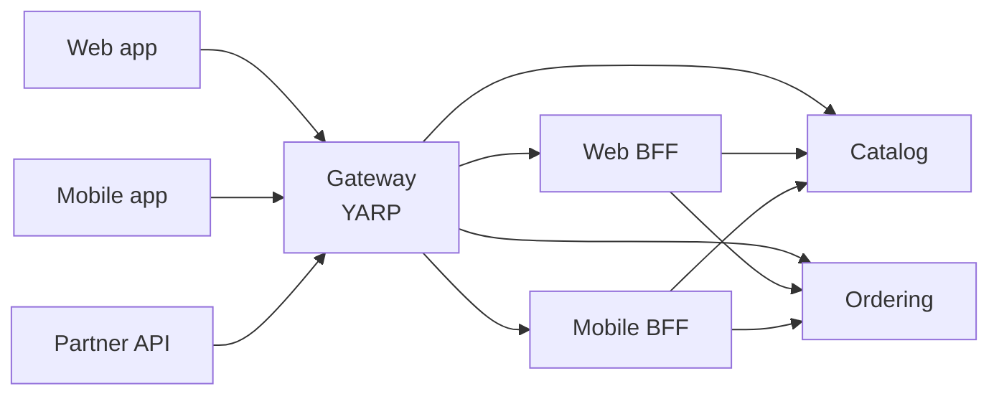

# 10. API Gateway

## 10.1 Responsibilities

The gateway is the single entry point for external clients. It handles what is
genuinely cross-cutting at the edge, and nothing else.

**It does:** routing · JWT signature and claims validation · rate limiting ·
CORS · request/response logging with correlation IDs · response compression ·
request size limits.

> **All seven are configured, and the last two took a PR of their own because
> each needed a decision rather than a line.** PR-17 delivered the first five
> and PR-27 the remaining pair, which between them are four statements in
> `Program.cs` — the delay was never effort. A size limit needs a **number**,
> and Kestrel's 30 MB is a framework default rather than anything this platform
> chose; compression needs the **HTTPS** question answered, and answering it
> took [ADR-020](appendix-a-adrs.md#adr-020--the-edge-compresses-over-tls-and-says-so).
>
> **The number is one mebibyte**, in `GatewayLimits.MaxRequestBodyBytes`, and
> it is a constant rather than configuration for §15.4's reason — it does not
> vary between environments. Every request this platform accepts is a JSON
> command, and the largest one it can construct is an order at
> `PlaceOrderValidator.MaxItems` — a hundred lines, so tens of kilobytes
> ([§6.4](06-cqrs.md)). A mebibyte is two orders of magnitude above that
> and two below what an upload endpoint would want, which is the shape of a
> limit chosen for a platform that has none.
>
> **It is enforced where the body is read, which is inside the forwarder.**
> Neither authentication nor authorization touches the body, so an oversized
> request that fails either is answered 401 or 403 and its size is never
> considered — the cheaper refusal, and the right way round, but it means the
> ceiling only ever applies to requests the gateway was going to proxy anyway.
>
> **And it bounds bytes read, not memory.** Kestrel and YARP stream the body
> with backpressure, so an oversized request is never resident at the edge;
> what the number caps is the bandwidth and forwarding work a single caller can
> spend. Capacity planning that reads it as a per-request allocation — and
> multiplies by concurrency — is planning against a figure the gateway does not
> have. Kestrel throws past the ceiling and
> `ExceptionHandlerMiddleware` takes the status off that exception, so a 413
> arrives in §10.5's shape with no handler written for it — unlike the 400 and
> 409 rows, which each needed one.
>
> **The limit is the edge's, and it is the only one.** A service reached
> directly inside the cluster still carries Kestrel's own default, because
> §4.2 gives the gateway no way to impose anything on a host it merely
> forwards to. That is a statement about the trust boundary rather than a gap:
> everything outside arrives here first.

**It is not the outermost edge.** TLS terminates at the cloud load balancer or
Kubernetes Ingress, which then forwards plain HTTP inside the cluster. That
matters beyond TLS: everything the gateway does per-client — rate limiting
above all — reads `RemoteIpAddress`, which is the *ingress* address until
`UseForwardedHeaders` runs ([§4.2](04-solution-structure.md)). A gateway that assumes it is the edge
rate-limits the whole world as one client.

**The scheme travels the same way, and one middleware reads it after the
fact.** `X-Forwarded-Proto` makes `Request.IsHttps` true on a connection that
carried no TLS, and response compression takes its decision at the first
*write* rather than where its `Use` call sits — so it reads the rewritten
scheme although it is registered above the middleware that rewrote it
([ADR-020](appendix-a-adrs.md#adr-020--the-edge-compresses-over-tls-and-says-so)).
Reasoning about what a response-side middleware "sees" from its position in
the pipeline is reasoning about the wrong moment, and ADR-020's first argument
did exactly that.

**It does not:** contain business logic · aggregate responses from several
services · transform payloads · access any database · know about domain
concepts.

> **Trap — the gateway that became a service.** Response aggregation is the
> gateway's most tempting feature and the start of its decline. Aggregation
> requires knowing what the pieces mean, which is business logic, which means
> the gateway now redeploys with every service change and becomes a shared
> bottleneck owned by nobody. Put aggregation in a **BFF** — a separate,
> team-owned service behind the gateway, one per client type.



The shape of the pattern, not this platform's topology: a second BFF per client
type is what the pattern looks like at scale, and the fan-out to two services is
what [§9.7](09-messaging.md) permits. What is actually built here is one `Web.Bff` making one call
to Catalog ([§2.2](02-architecture-at-a-glance.md), §9.7) — the diagram is the ceiling, not the inventory.

## 10.2 YARP configuration

```json
{
  "ReverseProxy": {
    "Routes": {
      "catalog-public": {
        "ClusterId": "catalog",
        "Match": { "Path": "/api/v1/catalog/{**catch-all}", "Methods": [ "GET" ] },
        // "anonymous" is YARP's own reserved value for AllowAnonymous, and it
        // is here because Common.Web now sets a fallback authorization policy
        // (§11.4): a route with no AuthorizationPolicy key would inherit the
        // fallback and this public GET would start answering 401. Naming it
        // also makes the one public path in this file a decision rather than
        // an omission — the two read identically without it.
        "AuthorizationPolicy": "anonymous",
        "RateLimiterPolicy": "anonymous",
        "Transforms": [
          { "PathRemovePrefix": "/api" },
          { "RequestHeader": "X-Forwarded-Prefix", "Set": "/api" }
        ]
      },
      "ordering": {
        "ClusterId": "ordering",
        "Match": { "Path": "/api/v1/orders/{**catch-all}" },
        "AuthorizationPolicy": "authenticated",
        "RateLimiterPolicy": "authenticated",
        "Transforms": [ { "PathRemovePrefix": "/api" } ]
      },
      "inventory-admin": {
        "ClusterId": "inventory",
        "Match": { "Path": "/api/v1/inventory/{**catch-all}" },
        "AuthorizationPolicy": "inventory:admin",
        "RateLimiterPolicy": "authenticated",
        "Transforms": [ { "PathRemovePrefix": "/api" } ]
      },
      "web-bff": {
        "ClusterId": "web-bff",
        "Match": { "Path": "/bff/{**catch-all}" },
        "AuthorizationPolicy": "authenticated",
        "RateLimiterPolicy": "authenticated",
        "Transforms": [ { "PathRemovePrefix": "/bff" } ]
      }
    },
    "Clusters": {
      "catalog": {
        "LoadBalancingPolicy": "PowerOfTwoChoices",
        "HealthCheck": {
          "Active": {
            "Enabled": true,
            "Interval": "00:00:10",
            "Timeout": "00:00:05",
            "Path": "/health/ready"
          }
        },
        "Destinations": {
          "d1": { "Address": "http://catalog-api:8080/" }
        }
      },
      "ordering": {
        "Destinations": { "d1": { "Address": "http://ordering-api:8080/" } }
      },
      "inventory": {
        "Destinations": { "d1": { "Address": "http://inventory-api:8080/" } }
      },
      "web-bff": {
        "Destinations": { "d1": { "Address": "http://web-bff:8080/" } }
      }
    }
  }
}
```

The two `"authenticated"` values on the `ordering` route are **not** the same
policy. `AuthorizationPolicy` resolves through `IAuthorizationPolicyProvider`
and `RateLimiterPolicy` through the rate limiter's own registry (§10.3); they
share a name here because both mean "a signed-in caller", and each has to be
registered separately.

**Both must be registered somewhere in the gateway's own container**, and both
are checked when YARP loads this configuration — `AuthorizationPolicy` through
`IAuthorizationPolicyProvider`, `RateLimiterPolicy` through the limiter's
options. `authenticated` comes from `AddCommonWebDefaults`
([§13.2](13-observability.md)) and `inventory:admin` from the gateway's own
`Program.cs` (§4.2).

**`anonymous` is the exception, because YARP reserves it.** It is the proxy's
own spelling of `AllowAnonymous`, intercepted before the provider is ever
consulted, so it is registered nowhere — and registering a policy under that
name would register one that never runs. `default` is the other reserved value,
meaning the framework's default policy, and the same is true of it. A test
asserting that every named policy resolves has to subtract both, or it fails on
a route file that is correct.

**`catalog-public` names `anonymous`, and that is now the only way to declare a
route public.** Naming no policy at all was, until `AddCommonWebDefaults` set a
fallback authorization policy
([§11.4](11-identity-authorization.md), [ADR-030](appendix-a-adrs.md#adr-030--authorization-is-deny-by-default-in-the-building-block)): a route
with no `AuthorizationPolicy` key inherits the fallback, and the platform's one
public path would answer 401. The key is also what makes the decision
legible — a public path by omission and a public path by decision read
identically in a route file, and only one of them survives someone else's edit.

Note that `anonymous` now appears twice on `catalog-public`, meaning two
different things: YARP's reserved `AllowAnonymous` in one key and §10.3's
per-IP window in the other. That is the two-registries point above arriving on
one route rather than across two, and it is the same point — not a second one.

> **A name it cannot resolve stops the gateway, and this passage said the
> opposite for a long time.** It described a silent per-route drop — "the path
> simply stops existing, and the gateway comes up healthy serving whichever
> routes happened to validate" — and §4.2, §11.4 and Appendix C all repeated
> it. Measured against the pinned YARP instead of argued:
> `ProxyConfigManager.InitialLoadAsync` throws out of `MapReverseProxy()` with
> an `InvalidOperationException` naming the policy and the route, so the
> process does not start. The correction runs the reassuring way — a
> misconfigured edge fails at deployment rather than in production, and this is
> the one place in the platform where an unregistered policy name fails
> *better* than it does in a service, where §11.4's endpoint throws on the
> first request that reaches it.
>
> **One more sentence in this callout has since gone the same way, for an
> unrelated reason.** It used to close "a route naming no policy is still
> public, and naming none is still the only way to say so", and the fallback
> policy above makes both halves false: an absent name is a 401 now, and the
> way to say public is to name `anonymous`. The two corrections are
> independent — an unresolvable name stops the gateway, an absent name fails
> closed on the route — and they run the same way, which is that a
> misconfigured route no longer serves anything by accident.
> `UnresolvablePolicyTests` in `Gateway.Api.Tests` is where both registries
> were measured, one test each.

The `web-bff` route is what makes the BFF reachable, and it is easy to skip:
the BFF has an image, a chart, a Keycloak client and a CI filter without one,
and none of those fail. §10.1 calls the gateway the single entry point for
external clients — so a service behind it with no route is not deployed
privately, it is deployed unreachably. `/bff` rather than `/api`, because a
client picks one or the other: aggregated responses shaped for a screen, or the
service APIs shaped for a resource.

**This file shipped whole, ahead of three of the four services it routes to,
and one of them is still missing** — Ordering arrived behind its route with
PR-18 and the BFF with PR-19, leaving Inventory alone answering 502 —
which is the opposite of the rule [§14.1](14-local-development.md)'s Compose
file follows — and the asymmetry is in what each costs. A Compose block naming
an image that does not exist fails `up`; a route whose destination is not
running 502s one path and costs nothing at startup, nothing in CI and nothing
in any other route. What buys the difference is the pair of tests over the
file: "every policy resolves" and "every strip matches" say nothing over a
single route, and §11.4 names a vacuously passing policy test as its own
defect. Delivering it a route at a time would also make each later PR
re-decide the policies, which is precisely the mistake the dual-version trap
below describes.

Note the shape of the policy name. `inventory:admin` is a **permission**, not a
role, for the reason [§11.4](11-identity-authorization.md) gives — and the gateway is where role-shaped names
creep back in, because a route file feels like infrastructure rather than
authorization code.

**Every route carries a `RateLimiterPolicy`, including the admin ones.** YARP
applies no limit when the property is absent, so a route opts out of §10.1's
rate limiting by omission — and the route most likely to be forgotten is the
one added last, under pressure, to expose something internal. The
`inventory-admin` route is authenticated and narrowly authorised, which is
exactly the reasoning that
justifies leaving it unlimited and exactly why that reasoning is wrong: an
authorised client with a broken retry loop is still a flood, and this one
reaches an inventory database. Assert the invariant rather than reviewing for
it — deserialise the `Routes` section in a test and require the property on
every entry.

**Every route carries an `AuthorizationPolicy` too**, and that mirror invariant
is the newer one: it used to be false by design, because a public route said so
by omission. The fallback policy inverted it (§11.4), and both halves are
asserted the same way — `Every_route_names_a_rate_limiter_policy` and
`Every_route_names_an_authorization_policy` in `Gateway.Api.Tests`, one
`foreach` over the same deserialised section. The two are not the same kind of
rule any more, though. The rate-limiter one is a security invariant, because an
omission is an unmetered path; the authorization one is a readability rule,
because an omission now fails closed. It is worth asserting for the thing the
fallback cannot do: answer, in this file, the question the person reading it
came with.

`PowerOfTwoChoices` picks two destinations at random and routes to the less
loaded of the pair. It avoids both the herd behaviour of least-requests and the
blindness of round-robin, at negligible cost.

In Kubernetes, destinations are Service DNS names and the platform handles
discovery. Active health checks still matter — they let YARP stop routing to a
pod that is failing but not yet failing its readiness probe.

### API versioning and deprecation at the edge

Versions are URL segments because path matching is trivial to route on and
unambiguous in a log line. Header-based versioning is harder to test, harder to
curl, and invisible in access logs.

**One shape, end to end**, because the alternative is arithmetic every reader
has to redo:

| | Path |
|---|---|
| Client calls | `/api/v1/orders/{id}/cancel` |
| Gateway matches | `/api/v1/orders/{**catch-all}` |
| Gateway strips | `/api` |
| Service receives | `/v1/orders/{id}/cancel` |
| Service maps | `MapGroup("/v1/orders")` (§11.4) |

The version sits **before** the resource, and the prefix the gateway strips is
`/api` for every route *under `/api`* rather than a per-service prefix.
(`web-bff` strips `/bff` because it is a second namespace, not a service under
the first — one strip per namespace is still the rule, and `/bff` has exactly
one.) Stripping `/api/orders` instead would work, but only if the external path
were
`/api/orders/v1/orders/{id}` — the service segment twice, once for the gateway
and once for the service's own group — which is the shape a per-service strip
quietly requires and nobody chooses on purpose.

During a deprecation window the gateway routes **both** versions to the same
cluster. A new version is a **new route entry**, which means it re-declares the
policies rather than inheriting them — the route above it in the file is not a
base class, and a version added by copying only the `Match` and the `Transforms`
is an unlimited copy carrying no authorization decision of its own:

```json
"ordering-v1": {
  "ClusterId": "ordering",
  "Match": { "Path": "/api/v1/orders/{**catch-all}" },
  "AuthorizationPolicy": "authenticated",
  "RateLimiterPolicy": "authenticated",
  "Transforms": [ { "PathRemovePrefix": "/api" } ]
},
"ordering-v2": {
  "ClusterId": "ordering",
  "Match": { "Path": "/api/v2/orders/{**catch-all}" },
  "AuthorizationPolicy": "authenticated",
  "RateLimiterPolicy": "authenticated",
  "Transforms": [ { "PathRemovePrefix": "/api" } ]
}
```

**That copy used to be a public one and is a 401 one now**, which is a smaller
defect and still a defect. The fallback policy (§11.4) catches the missing
`AuthorizationPolicy`, so a copy of an authenticated route is right by accident
and a copy of `catalog-public` stops serving the anonymous callers it exists
for — the same omission failing in whichever direction the original was
declared. Nothing catches the missing `RateLimiterPolicy` at all, which is what
the invariant above is asserted for.

> **Trap — mismatched prefix strips on dual-version routes.** Both routes must
> strip the *same* prefix, so the service receives `/v1/...` and `/v2/...` and
> can route internally. Stripping `/api/v1` on one route and `/api` on the
> other sends the service two different path shapes for the same endpoint. It
> works in whichever one was tested first.
>
> **The in-process API tests do not catch this.** They call the service
> directly, on `/v1/orders/...` ([§12.4](12-test-strategy.md)), so they exercise everything after the
> strip and nothing before it. Path composition is gateway configuration, and
> `Gateway.Api.Tests` ([Appendix C](appendix-c-delivery-plan.md), PR-17) is
> the only place it is checked. Three assertions carry it: every route strips
> exactly the namespace it matches — one strip per namespace, so a route under
> `/api` cannot remove `/api/v1` — every route's forwarded path is one the
> service behind it serves, and, over a stub destination on loopback, the path
> a service actually received is the path with the prefix gone. The last is
> the only one made against a request rather than against configuration.
>
> **The pair above is an example, and the shipped route file does not carry
> it.** A `/api/v2/orders` route would forward to a service that maps `/v1`
> alone, so it would fail the second assertion — correctly, since it is a
> route to nowhere until a v2 exists. What ships instead is the invariant that
> makes the pair safe the day somebody adds it.

Deprecation is signalled with standard headers rather than a changelog nobody
reads (RFC 8594 / RFC 9745):

```csharp
app
    .MapGroup("/v1")
    .AddEndpointFilter(async (ctx, next) =>
    {
        ctx.HttpContext.Response.Headers["Deprecation"] = "true";
        ctx.HttpContext.Response.Headers["Sunset"] = "Thu, 31 Dec 2026 23:59:59 GMT";
        ctx.HttpContext.Response.Headers["Link"] =
            "</api/v2/orders>; rel=\"successor-version\"";
        return await next(ctx);
    });
```

Retire v1 only when telemetry confirms no traffic remains on it — not when the
Sunset date passes. The date is a commitment to clients; the metric is the
evidence.

## 10.3 Rate limiting

```csharp
builder.Services.AddRateLimiter(options =>
{
    options.RejectionStatusCode = StatusCodes.Status429TooManyRequests;

    options.AddPolicy(
        "anonymous",
        context => RateLimitPartition.GetFixedWindowLimiter(
            partitionKey: context.Connection.RemoteIpAddress?.ToString() ?? "unknown",
            factory: _ => new FixedWindowRateLimiterOptions
            {
                PermitLimit = 100,
                Window = TimeSpan.FromMinutes(1),
                QueueLimit = 0
            }));

    options.AddPolicy(
        "authenticated",
        context => RateLimitPartition.GetTokenBucketLimiter(
            partitionKey: context.User.FindFirstValue(ClaimTypes.NameIdentifier) ??
                context.Connection.RemoteIpAddress?.ToString() ??
                "unknown",
            factory: _ => new TokenBucketRateLimiterOptions
            {
                TokenLimit = 300,
                TokensPerPeriod = 300,
                ReplenishmentPeriod = TimeSpan.FromMinutes(1),
                QueueLimit = 10,
                AutoReplenishment = true
            }));

    // Through IProblemDetailsService, not WriteAsJsonAsync — see below.
    options.OnRejected = async (context, _) =>
    {
        // RetryAfterHeader.Seconds, not a cast and not an inline ceiling —
        // see below.
        if (context.Lease.TryGetMetadata(MetadataName.RetryAfter, out TimeSpan retryAfter))
        {
            context.HttpContext.Response.Headers.RetryAfter =
                RetryAfterHeader.Seconds(retryAfter).ToString(CultureInfo.InvariantCulture);
        }

        // Before the write: the customisation reads the response status, and
        // the service refuses to write once the response has started.
        context.HttpContext.Response.StatusCode = StatusCodes.Status429TooManyRequests;

        IProblemDetailsService problems = context.HttpContext.RequestServices
            .GetRequiredService<IProblemDetailsService>();

        await problems.WriteAsync(new ProblemDetailsContext
        {
            HttpContext = context.HttpContext,
            ProblemDetails =
            {
                Status = StatusCodes.Status429TooManyRequests,
                Title = "Too many requests",
                Type = "https://tools.ietf.org/html/rfc6585#section-4"
            }
        });
    };
});
```

> **The rejection goes through `IProblemDetailsService`, and writing the body
> directly is a contract violation nothing would report.** This block used to
> call `WriteAsJsonAsync`, which serialises a `ProblemDetails` as
> `application/json` and runs none of §10.5's customisation — so the one
> response a client is most likely to handle programmatically would be the one
> carrying neither the right media type nor `correlationId`, on a platform
> whose stated promise is a single error shape. The write above takes the same
> path `Results.Problem` and `UseExceptionHandler` take, which is why a 429, a
> returned 422 and an unhandled 500 all carry the same three members.
>
> `ToString(CultureInfo.InvariantCulture)` on the `Retry-After` seconds for a
> smaller reason with the same shape: a header value has one correct spelling
> whatever the server's culture, and CA1305 makes the bare `ToString()` a
> failed build under ADR-019.
>
> **`RetryAfterHeader.Seconds` rather than an expression, and the expression
> alone was a defect this sample shipped.** `Retry-After` is whole seconds
> (RFC 9110) and the window remaining is fractional far more often than not,
> so `(int)0.8` emits `Retry-After: 0` — which does not merely lose precision,
> it reads as permission and sends a well-behaved client straight back into a
> limiter that is still refusing. Rounding up is the only direction that
> cannot advertise a time at which the request still fails, and the helper
> also clamps an already-expired lease to zero rather than emitting a negative
> a client cannot parse.
>
> **It is a type rather than a line because the rule is otherwise close to
> untestable.** This window is a minute long, so a rejection carries tens of
> seconds and the truncating form rounds identically — the suite's own 429
> assertions passed with the bug in place, and a comment here claimed they
> caught it until that was measured. Reaching the truncating case through HTTP
> means holding a window open for fifty-nine seconds; against the helper it is
> three rows of a theory. **Call it from the sample rather than restating the
> arithmetic**: an inline ceiling here and a clamp there is the same one-form-
> two-places drift the rule at the top of `CLAUDE.md` exists for, and it had
> already reappeared once in this chapter.

The `authenticated` policy is only correct if `UseAuthentication` has already
run when the limiter middleware executes — see the pipeline in §4.2. The
`?? RemoteIpAddress` fallback exists for the genuinely anonymous request that
still matches an authenticated route, not as a safety net for pipeline order;
if the order is wrong the fallback absorbs *every* request and the policy
degrades to a second copy of `anonymous` with a larger budget.

**The v1 decision is per-replica, best-effort, and the numbers above are written
knowing it.** `System.Threading.RateLimiting` partitions in process, so with N
gateway replicas the effective limit is N × the configured value: three replicas
turn the `authenticated` policy's 300/minute into 900/minute for a client
unlucky enough — or determined enough — to spread requests across all three.

That is acceptable here because these limits exist to blunt accidental
hammering and cheap abuse, and a bound that is loose by a factor of the replica
count still does that. It is **not** acceptable for anything a customer is
billed against or promised in a contract. Partner quotas, per-tenant plans and
anything with a number in a service agreement need a shared counter — a sliding
window on the **coordination** Redis ([§8.1](08-caching-redis.md), `{service}:ratelimit:`), never the
cache instance, whose `allkeys-lru` policy would evict a counter mid-window and
reset somebody's quota with no error and no log line.

Two things to settle before building that, because both are easy to discover
late: the counter's TTL must outlive the window it measures, and the limiter
needs a stated behaviour when Redis is unreachable. **Fail open** is the right
default at the edge — a rate limiter that returns 429 because its own
dependency is down converts a Redis incident into a full outage — but it is a
decision to make deliberately, not one to inherit from whichever library was
used.

## 10.4 Correlation

The gateway assigns a correlation ID to every request that lacks one — and to
every request carrying one it will not adopt, which is the same act for a
different reason — and it propagates through every service, log line, message
and trace. This is what makes a production incident diagnosable.

It ships in `Common.Web` as one extension, called by both the gateway and every
service (§4.2), above everything that logs — a log line written before it has no
correlation ID.

**Two things sit above it, and only one of them is about correlation.**
`UseSecurityHeaders` is outermost (§10.6), and its position is a claim about
the response rather than about the log scope — it decides nothing here and
writes nothing this middleware reads.

**`UseExceptionHandler` is the one that matters, and it sits immediately
above.** That is deliberate, and it is why the ID is written onto the *request*
below rather than only into the log scope. An exception unwinding past this
middleware disposes the log scope before the handler catches it, so the scope
is gone by the time §10.5 builds the response — but `Request.Headers` is not,
which is exactly where `CustomizeProblemDetails` reads it from. The correlation
ID reaches the client on the one response where the log scope cannot carry it:

```csharp
namespace Common.Web;

// Public, and read in three places: here, by AddCommonProblemDetails when it
// builds §10.5's body, and by CorrelationIdHandler on the way out. It was a
// local const in this sample while two of those spelled the literal instead,
// which is three copies of one contract.
public const string Header = "X-Correlation-Id";

/// <summary>
/// The longest supplied ID this middleware will adopt (§10.4).
/// </summary>
/// <remarks>
/// Both values the fallback mints are far shorter — a 32-character trace ID
/// or a 36-character GUID — so the bound is generous rather than tight, and
/// exists to stop an unauthenticated caller choosing how much of every log
/// record on the platform it writes. Kestrel's own header budget is tens of
/// kilobytes, and this middleware runs above <c>UseAuthentication</c>
/// (§4.2), so the input is unauthenticated on every request that reaches a
/// host.
/// </remarks>
public const int MaxSuppliedLength = 128;

public static IApplicationBuilder UseCorrelationId(this IApplicationBuilder app)
{
    // Resolved once, outside the delegate: this runs on every request, and
    // ILoggerFactory is a singleton whose per-request lookup buys nothing.
    ILogger logger = app.ApplicationServices
        .GetRequiredService<ILoggerFactory>()
        .CreateLogger("Common.Web.CorrelationId");

    return app.Use(async (context, next) =>
    {
        // FirstOrDefault on absent headers is null; an empty header value is
        // not, and would otherwise become a correlation ID of "".
        string? supplied = context.Request.Headers[Header].FirstOrDefault();

        string correlationId = IsAdoptable(supplied)
            ? supplied
            : Activity.Current?.TraceId.ToString() ?? Guid.CreateVersion7().ToString();

        context.Request.Headers[Header] = correlationId;

        // The RESPONSE header is written from OnStarting rather than here, for
        // §10.6's reason one middleware over: UseExceptionHandler CLEARS the
        // response before writing §10.5's problem body, so a header assigned
        // on the way in is gone from exactly the 500 an incident is triaged
        // from. The request header stays an eager write — it is what
        // CustomizeProblemDetails reads after the log scope has been disposed,
        // and nothing clears it.
        //
        // A static callback with the value passed as state, so the closure
        // captures nothing and this allocates once per request rather than
        // twice.
        context.Response.OnStarting(
            static state =>
            {
                (HttpResponse response, string id) = ((HttpResponse, string))state;
                response.Headers[Header] = id;

                return Task.CompletedTask;
            },
            (context.Response, correlationId));

        // BeginScope, the Microsoft.Extensions.Logging primitive — not
        // Serilog's LogContext. OpenTelemetry is the whole logging stack here
        // (Appendix B), and it reads scopes; §13.3's LoggingBehavior uses the
        // same call for the same reason.
        using (logger.BeginScope(new Dictionary<string, object> { ["CorrelationId"] = correlationId }))
            await next();
    });
}

/// <summary>
/// Whether a supplied header value is a plausible identifier this host is
/// willing to adopt, rather than merely a non-blank string.
/// </summary>
/// <remarks>
/// <b>Anything refused is replaced, never echoed.</b> The adopted value
/// reaches four places — the response header, the forwarded request, the
/// log scope every record for this request inherits, and §10.5's problem
/// body — so a value that fails here would otherwise be reflected to an
/// unauthenticated caller and multiplied into collector ingest by the
/// record count.
/// <para>
/// The alphabet is the one both fallback branches already mint from: a
/// 32-character hex trace ID and a dashed GUID. Underscore is admitted
/// beside the hyphen because an upstream edge that mints its own IDs
/// commonly uses it, and neither character can break a log line or a query.
/// Deliberately <em>not</em> narrowed to exactly a trace ID or a GUID:
/// §10.4's promise is that an ID chosen by the caller's own tracing
/// survives the hop, and this platform is not the only thing that mints
/// one.
/// </para>
/// <para>
/// Kestrel already rejects CR and LF inside a request header value, so log
/// splitting is not reachable through it — this is the bound on length and
/// alphabet, not a rescue from that.
/// </para>
/// </remarks>
private static bool IsAdoptable([NotNullWhen(true)] string? supplied)
{
    if (supplied is not { Length: > 0 and <= MaxSuppliedLength })
        return false;

    foreach (char c in supplied)
    {
        if (!char.IsAsciiLetterOrDigit(c) && c is not ('-' or '_'))
            return false;
    }

    return true;
}
```

**The bound exists because this middleware runs above `UseAuthentication`.**
[§4.2](04-solution-structure.md) puts it near the top of every pipeline, so the
value it reads is unauthenticated on every request that reaches a host — and
the value it *adopts* reaches four places: the response header, the forwarded
request below, the log scope every record for that request inherits, and
§10.5's problem body. [§13.1](13-observability.md) makes the correlation ID the
field an incident is triaged by, which is what turns a free choice of that value
into an attack rather than an untidiness: a caller that picks its own ID can
stamp its traffic with one already in use, or with one that collides with
nothing and matches everything the on-call greps for, and it poisons exactly the
field this section exists to make trustworthy. The length half is cheaper to
state — a kilobyte attached to a scope inherited by every record the request
produces, EF Core's and MassTransit's included, is one request multiplied into
collector ingest by the record count.

**The response header is written from `OnStarting`, and that is the same rule
[§10.6](#106-response-security-headers) states one middleware over.**
`UseExceptionHandler` clears the response before it writes §10.5's problem
body, so a header assigned on the way in is absent from exactly the 500 an
incident is triaged from — the response on which this section's whole promise
matters most. The *request* header stays an eager write: it is what
`CustomizeProblemDetails` reads once the log scope has been disposed, and
nothing clears it. Two channels, two lifetimes, and only one of them survives
the unwind by being written late.

> **This was the shape of a defect rather than a symmetry noticed in
> passing.** `nosniff` was moved onto `OnStarting` with the argument spelled
> out and a test that drives the 500; the correlation ID was left assigning
> eagerly, so after that change an error response carried
> `X-Content-Type-Options` and not `X-Correlation-Id`. **A rule established
> for one header is owed to every header on the same response**, and the test
> that catches it has to compose `UseExceptionHandler` — no test of a request
> that succeeds can see this.

**It is a bound on length and alphabet, and not a rescue from log splitting**,
which was never reachable. Kestrel rejects CR and LF inside a request header
value before any middleware sees it, so the injection this guard looks like a
defence against was already closed one layer down. Saying so is the point: a
guard credited with a property it does not supply is the one nobody re-checks
when the layer below it changes.

**The alphabet deliberately admits more than this platform's own two fallbacks
mint.** Those are a 32-character hex trace ID and a dashed GUID; the guard
accepts ASCII letters, digits, `-` and `_` up to `MaxSuppliedLength`. Underscore
is in because an upstream edge that mints its own IDs commonly uses it, and
neither it nor the hyphen can break a log line or a query. Narrowing to exactly
a trace ID or a GUID would be tidier and would break this section's promise —
that an ID chosen by the caller's own tracing survives the hop — for nothing,
since this platform is not the only thing that mints one. In
`Common.Web.Tests`, `An_over_long_id_is_replaced` is paired with
`An_id_at_the_bound_is_kept` for the reason §12 gives about negative cases:
"too long is replaced" passes just as well against a middleware that replaces
everything.

### Leaving the process

**The middleware is the inbound half, and on its own it does not keep the
promise this section opens with.** It reads or mints the ID and writes it onto
the request and the response — everything a host needs to log consistently,
and nothing that crosses a process boundary.

Asynchronously that is enough: [§9.1](09-messaging.md)'s envelope carries
`CorrelationId` as a member, so a message takes the ID with it by construction.
Synchronously there is nothing to carry it, and the platform makes exactly one
synchronous call — the BFF's hop to Catalog ([§9.7](09-messaging.md),
[ADR-017](appendix-a-adrs.md#adr-017--one-synchronous-hop)). Without a header
on it the callee mints an ID from its own trace, and one incident has two of
them.

`CorrelationIdHandler` is the outbound half — a `DelegatingHandler` on the
outbound client, so no call site has to remember it:

```csharp
namespace Common.Web;

public sealed class CorrelationIdHandler(IHttpContextAccessor context) : DelegatingHandler
{
    protected override Task<HttpResponseMessage> SendAsync(
        HttpRequestMessage request,
        CancellationToken cancellationToken)
    {
        string? correlationId = context.HttpContext?.Request
            .Headers[CorrelationIdExtensions.Header]
            .FirstOrDefault();

        // Set rather than added: a retried attempt runs this handler again on
        // the same HttpRequestMessage, and Add would accumulate one value per
        // attempt into a header the callee reads with FirstOrDefault.
        if (!string.IsNullOrWhiteSpace(correlationId))
        {
            request.Headers.Remove(CorrelationIdExtensions.Header);
            request.Headers.Add(CorrelationIdExtensions.Header, correlationId);
        }

        return base.SendAsync(request, cancellationToken);
    }
}
```

> **It lives in `Common.Web` beside the middleware, and it is registered by the
> host rather than by `AddCommonWebDefaults`.** The guarantee is this section's
> and not the BFF's, so keeping the two halves in one file is what stops them
> drifting — but a `DelegatingHandler` attaches to a *named client*, and a
> host with no outbound client has nothing to attach it to. One host
> registers it today, and that is a fact about ADR-017 rather than about this
> type.

> **With no inbound ID it sends no header at all, which is deliberate.** The
> callee's own middleware then mints one from the current trace — the right
> answer for a call with no request behind it, such as a background job.
> Sending an empty header instead would spend a header and buy nothing: the
> callee refuses it and mints anyway. That used to be an appeal to the
> blank-counts-as-missing guard, the rule this blueprint has already had to
> write twice ([§11.3](11-identity-authorization.md)); the guard above is now
> the wider one — every value it will not adopt is treated as missing, and
> `""` is merely the shortest of them — which leaves this argument intact and
> resting on less.

## 10.5 Error responses

Every service returns RFC 9457 `application/problem+json`, so clients handle one
error shape regardless of which service produced it.

It ships in `Common.Web` as one extension, which `AddCommonWebDefaults`
composes ([§13.2](13-observability.md)) rather than each host calling it:

```csharp
namespace Common.Web;

public static IServiceCollection AddCommonProblemDetails(this IServiceCollection services)
{
    // The table's 400 row needs an executor, not just a producer — the
    // handler that turns ValidationBehavior's thrown ValidationException
    // into the field-keyed problem response. Registered here so no host can
    // take the customisation without it (see below).
    services.AddExceptionHandler<ValidationExceptionHandler>();
    // The 409 row's, on the same terms. Both statuses are produced beside a
    // handler rather than returned by one, so neither is reachable through
    // Error and each needs its own executor.
    services.AddExceptionHandler<ConcurrencyExceptionHandler>();

    return services.AddProblemDetails(options =>
        options.CustomizeProblemDetails = context =>
        {
            context.ProblemDetails.Instance =
                $"{context.HttpContext.Request.Method} {context.HttpContext.Request.Path}";

            // Read from the request rather than the log scope: this is the one
            // path §10.4's middleware keeps alive through an unwinding
            // exception, and an error response is exactly when it matters.
            context.ProblemDetails.Extensions["correlationId"] =
                context.HttpContext.Request.Headers[CorrelationIdExtensions.Header].FirstOrDefault();

            context.ProblemDetails.Extensions["traceId"] =
                Activity.Current?.Id ?? context.HttpContext.TraceIdentifier;
        });
}
```

| Situation | Status | Notes |
|---|---|---|
| Validation failed | 400 | `errors` extension, field-keyed |
| No or invalid token | 401 | |
| Authenticated but not permitted | 403 | Do not leak whether the resource exists |
| Aggregate not found | 404 | |
| Concurrency conflict, no precondition sent | 409 | From `DbUpdateConcurrencyException` |
| A request under this key is still in flight | 409 | From `ConcurrentRequestException` ([§8.5](08-caching-redis.md)). The **second** producer of this status, and deliberately not a status of its own: 425 is about replayed TLS early data and 503 says the service is unavailable when it is serving everyone else. Both 409s say *retry*, and their `detail` is what separates them |
| `If-Match` / `If-Unmodified-Since` failed | **412** | The client *did* send a precondition and it did not hold. Distinguishing this from 409 tells the client whether retrying with a fresh ETag is the fix |
| Request body past the edge's ceiling | **413** | The gateway only (§10.1). Kestrel throws `BadHttpRequestException` carrying this status and `ExceptionHandlerMiddleware` reads it off the exception rather than defaulting to 500, so unlike the 400 and 409 rows this one needs no handler of its own |
| Domain rule violated | 422 | The request was well-formed but not allowed |
| Downstream dependency unavailable | 503 | With `Retry-After` where known. Never 500 — the fault is not in this service |
| Rate limited | 429 | With `Retry-After` |
| Unhandled | 500 | **Never** include the exception message or stack trace |

### `Error`, and why its code is a closed vocabulary

The table maps *situations* to statuses. `Error` is what a handler returns to
say which situation it is, and it is three fields rather than a string because
two of them have consumers that are not the client:

```csharp
namespace Common.Application;

/// <summary>
/// A failure a handler chose to return, as opposed to one it threw. Code is a
/// stable identifier, Description is for a person, and Type selects the status.
/// </summary>
public sealed record Error(string Code, string Description, ErrorType Type)
{
    public static Error NotFound(string code, string description) =>
        new(code, description, ErrorType.NotFound);

    public static Error Rule(string code, string description) =>
        new(code, description, ErrorType.Rule);

    public static Error Unavailable(string code, string description) =>
        new(code, description, ErrorType.Unavailable);
}

/// <summary>
/// Three cases, not four. There is deliberately no Validation member: a
/// malformed request never reaches a handler, so no handler can return one.
/// </summary>
public enum ErrorType { NotFound, Rule, Unavailable }
```

```csharp
namespace Ordering.Application.Orders;

/// <summary>
/// The catalogue. Every Error the service can return is constructed here and
/// nowhere else — which is what makes Code a bounded set rather than whatever
/// string the nearest handler happened to type.
/// </summary>
public static class OrderErrors
{
    public static readonly Error NotFound =
        Error.NotFound("order.not_found", "No order with that id.");

    // Returned for Delivered as well as Shipped, so the description names
    // neither: the code is a §9.8 dimension value and cannot be split, and a
    // sentence naming one of two statuses tells the other one's customer
    // something untrue.
    public static readonly Error AlreadyShipped =
        Error.Rule(
            "order.already_shipped",
            "An order that has already shipped cannot be cancelled; raise a return instead.");

    // 422, not 400: the request was well-formed and the validator passed it.
    // The products are unpriceable, which is a fact about this service's state
    // and not something the caller phrased wrongly.
    public static Error ProductsUnavailable(IReadOnlyList<ProductId> missing) =>
        Error.Rule("order.products_unavailable", $"No price for {missing.Count} product(s).");
}
```

**`Code` is a metric dimension, so it has to be closed.** §9.8 tags
`command.domain_rejected` with it, and a tag whose value set is unbounded is a
cardinality incident waiting for the first handler that interpolates an id into
a code. Constructing every `Error` in a static catalogue is the same discipline
`CancellationReasons` (§11.4) gets from a `FrozenDictionary`, applied where a
dictionary would be overkill: the values are `static readonly` fields, so the
set is enumerable by reflection and reviewable by reading one file.

Note what is *not* in the code: no order id, no customer id, no count. Those
belong in `Description`, which is written for a person and never tagged onto an
instrument. `ProductsUnavailable` above is the shape to copy — one code, a
description that varies.

**`Type` selects the status**, in one place, so the mapping in the table above
is executed rather than remembered:

```csharp
namespace Common.Web;

// §11.4's endpoints call this, and it is the whole reason ErrorType exists
// rather than each endpoint deciding.
public static IResult ToHttpResult(this Result result) =>
    result.IsSuccess ? Results.NoContent() : Problem(result.Error);

public static IResult ToHttpResult<TValue>(this Result<TValue> result) =>
    result.IsSuccess ? Results.Ok(result.Value) : Problem(result.Error);

private static IResult Problem(Error error) =>
    Results.Problem(
        detail: error.Description,
        statusCode: StatusFor(error.Type),
        extensions: new Dictionary<string, object?> { ["code"] = error.Code });

private static int StatusFor(ErrorType type) => type switch
{
    ErrorType.NotFound => StatusCodes.Status404NotFound,
    ErrorType.Rule => StatusCodes.Status422UnprocessableEntity,
    ErrorType.Unavailable => StatusCodes.Status503ServiceUnavailable,
    _ => throw new ArgumentOutOfRangeException(nameof(type), type, "No status is mapped for this type.")
};
```

**Both halves of an `Error` cross the wire, and they go to different readers.**
`Description` becomes `detail`, which is where a person looks. `Code` becomes an
extension member, which is where a client switches — and it is an extension
rather than the `title` because `title` already has a job: RFC 9457's status
phrase, the one vocabulary every service and every framework agrees on. A title
carrying `order.already_shipped` would make each client parse prose to find the
identifier that was sitting one field away:

```json
{
  "type": "https://tools.ietf.org/html/rfc9110#section-15.5.21",
  "title": "Unprocessable Entity",
  "status": 422,
  "detail": "An order that has already shipped cannot be cancelled; raise a return instead.",
  "instance": "POST /orders/018f.../cancel",
  "code": "order.already_shipped",
  "correlationId": "018f4c2e-...",
  "traceId": "00-4bf92f3577b34da6a3ce929d0e0e4736-00f067aa0ba902b7-01"
}
```

The last three come from the customisation above, which runs on this response
because `Results.Problem` writes through `IProblemDetailsService` — the same
path `UseExceptionHandler` takes, which is why an unhandled 500 and a returned
422 carry the same three fields.

> **`Result<T>` derives from `Result`, so both overloads apply to it.** Only the
> identity conversion makes the generic one win, and that is enough — until a
> value result is held in a `Result`-typed local, where it takes the void
> overload and 204s its payload away. No status code can report a body the
> caller never asked for, so the test that pins overload resolution is the only
> thing standing between that and a silently empty response.

**Three of the table's rows are not reachable from here, and that is the point.**
Each belongs to a mechanism that runs before or beside a handler, and giving
`Error` a member for it would put two producers on one status:

| Status | Produced by | Why not `Error` |
|---|---|---|
| 400 | `ValidationBehavior` throwing `ValidationException` ([§6.3](06-cqrs.md)) | The `errors` extension is field-keyed, and `Error` has no field. A malformed request is rejected before any handler runs, so no handler can return one |
| 401 / 403 | The authentication and authorization middleware (§11.4) | Decided before the endpoint's delegate is entered — and written with **no body at all** unless something converts them, which is what `app.UseStatusCodePages()` is for (§4.2). Registering `AddProblemDetails` is not enough: it supplies a writer that nothing on this path was calling, so the two statuses a client meets first were the two that broke the promise this section opens with. Measured on a gateway 401 in PR-17, true of every host since PR-16, fixed in all of them |
| 409 / 412 | `DbUpdateConcurrencyException` and the precondition filter | A different conversation with the client — retry with a fresh ETag, rather than the request was understood and refused |

That asymmetry is why `Rule` maps to 422 rather than 409: 409 is already spoken
for by the concurrency case, and a domain refusal is not a race.

The 400 row still needs an executor: an exception the behaviour throws is not a
response until something translates it, and `UseExceptionHandler`'s fallback
answers 500 — the wrong statement about whose fault a malformed request is.
`ValidationExceptionHandler` in `Common.Web` is that translation, an
`IExceptionHandler` registered by `AddCommonProblemDetails` beside the
customisation above. It groups the failures by field into the `errors`
dictionary, writes through `IProblemDetailsService` so the 400 carries the same
`instance`, `correlationId` and `traceId` members as every other problem
response, and declines everything that is not a `ValidationException` — a 400
for a genuine fault would blame the client for the service's bug.

**The 409 row needs one for the same reason, and did without it until PR-18.**
`ConcurrencyExceptionHandler` sits beside the 400's, registered by the same
call, and translates `DbUpdateConcurrencyException` alone. It matches the
derived type rather than `DbUpdateException`: the base also covers a violated
constraint, which is not a race, and telling that client to retry invites a
second identical failure. Its `detail` names neither the entity nor the row
version, both of which are storage details ([§7.3](07-persistence.md)) — the
whole content of this status is *re-read and retry*.

> **The gap was unreachable for as long as it was, which is why nothing caught
> it.** A conflict needs a mapped `rowversion` on an aggregate a request can
> mutate, and Ordering's `Order` is the first in the solution; Catalog maps
> none. So §7.3 promised a translation from the start, no code performed it,
> and no test could have failed — the promise became false only when the
> mechanism it described became reachable.

**§8.5's contention is the third handler, and it arrived the same way the
second did — with the mechanism that makes it reachable.** Until
`IdempotencyBehavior` took its pipeline seat, `ConcurrentRequestException` was
a type nothing threw on an HTTP path; from that PR a duplicate arriving while
the first attempt is still running reaches `UseExceptionHandler`, which
answers 500 unless something translates it. That is the worst available
outcome for this particular feature: the mechanism reports itself as a server
fault, and a client treating 500 as fatal abandons an operation that was about
to succeed. `ConcurrentRequestExceptionHandler` answers 409 and its `detail`
echoes no `CommandId` — the caller sent it, so repeating it says nothing, and
it is half of a key whose other segment is the subject.

The 412 half of that row is still unimplemented, deliberately: it needs a
precondition filter reading `If-Match`, and nothing here sends or reads an
ETag. What separates the two is whether the client sent a precondition, so
until it can, every conflict is the no-precondition case the 409s answer.

## 10.6 Response security headers

`Common.Web` adds `X-Content-Type-Options: nosniff` to every response in all
four hosts, through one extension each pipeline calls outermost
([§4.2](04-solution-structure.md)). The header set and the ones deliberately
absent are recorded in
[ADR-031](appendix-a-adrs.md#adr-031--the-service-owns-nosniff-the-ingress-owns-hsts).

**The service owns this, not the edge**, and that is the whole reason it lives
in a building block rather than in `Gateway.Api`. The gateway is one of four
hosts and is not in front of the other three from inside the cluster —
[§11.2](11-identity-authorization.md) assumes the network is hostile and makes
every service re-validate its own token for exactly that reason — so a header
set only at the edge is absent on every path that does not traverse it. Setting
it where every host composes it has no such gap, and needs no argument about
which paths those are.

**`nosniff` is the whole list, and the omissions are decisions rather than an
unfinished set.** `Strict-Transport-Security` belongs to the Ingress, the only
component in this platform that terminates TLS (§10.1,
[§15.3](15-cicd-deployment.md)): a host behind it sees plain HTTP, so it would
be asserting something it cannot observe, and a browser caches that assertion
for as long as its `max-age` says. `X-Frame-Options` and
`Content-Security-Policy` govern how a browser renders a *document*, and none
of these four hosts serves one. Their API responses are `application/json` or
`application/problem+json` and [§13.5](13-observability.md)'s probes are
`text/plain` — measured, because an earlier draft of this paragraph said every
response was JSON and `MapHealthChecks` uses the framework's default plain-text
writer. A framing or a script policy on a body no browser renders as a document
protects nothing, and both become live questions for whoever serves the
storefront [§4.1](04-solution-structure.md) plans rather than for anything here.
`nosniff` is the one that is not about rendering: it stops a browser
reclassifying a JSON response — including one whose body carries a value the
caller supplied (§10.4, §10.5) — as HTML and executing it.

**It writes from `Response.OnStarting` rather than before `next`, and that is
not a style choice.** `UseExceptionHandler` clears the response before it writes
§10.5's problem body, so a header assigned on the way in is gone from exactly
the 500 where a caller-supplied value is most likely to be reflected — the one
response the header is most worth having on. A callback registered here fires
when the response actually starts, which is after that clear. Position and
timing are two claims, and being outermost settles only the first.

```csharp
namespace Common.Web;

private const string ContentTypeOptions = "X-Content-Type-Options";
private const string NoSniff = "nosniff";

public static IApplicationBuilder UseSecurityHeaders(this IApplicationBuilder app)
{
    ArgumentNullException.ThrowIfNull(app);

    // The RequestDelegate overload, not the Func<Task> one: the parameterless
    // spelling reads better and allocates a closure and a wrapper per request,
    // on a middleware every request traverses.
    return app.Use((HttpContext context, RequestDelegate next) =>
    {
        // A static callback with the response passed as state: the closure
        // would otherwise capture `context` and allocate once per request.
        context.Response.OnStarting(
            static state =>
            {
                HttpResponse response = (HttpResponse)state;

                // Indexer rather than Append: a host or a proxy that has
                // already set it must not end up with the header twice,
                // which some browsers treat as no header at all.
                response.Headers[ContentTypeOptions] = NoSniff;

                return Task.CompletedTask;
            },
            context.Response);

        return next(context);
    });
}
```

Where the line goes is stated with the rest of the pipeline in §4.2:
outermost, above `UseExceptionHandler`, so nothing below it can answer without
the header.

---

[← §9 Messaging](09-messaging.md) · [Index](README.md) · [§11 Identity →](11-identity-authorization.md)
