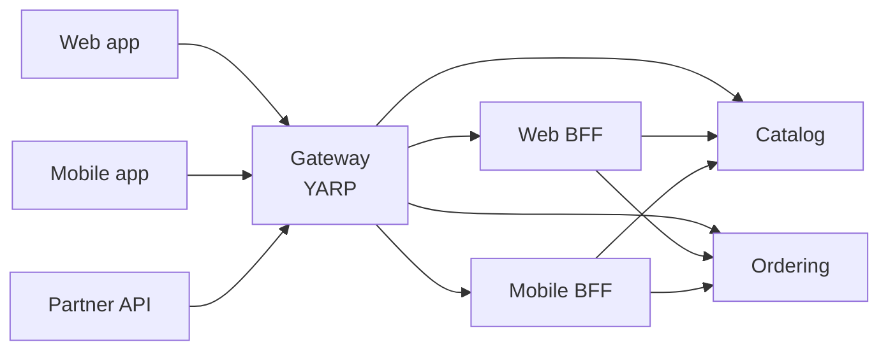

# 10. API Gateway

## 10.1 Responsibilities

The gateway is the single entry point for external clients. It handles what is
genuinely cross-cutting at the edge, and nothing else.

**It does:** routing · JWT signature and claims validation · rate limiting ·
CORS · request/response logging with correlation IDs · response compression ·
request size limits.

**It is not the outermost edge.** TLS terminates at the cloud load balancer or
Kubernetes Ingress, which then forwards plain HTTP inside the cluster. That
matters beyond TLS: everything the gateway does per-client — rate limiting
above all — reads `RemoteIpAddress`, which is the *ingress* address until
`UseForwardedHeaders` runs ([§4.2](04-solution-structure.md)). A gateway that assumes it is the edge
rate-limits the whole world as one client.

**It does not:** contain business logic · aggregate responses from several
services · transform payloads · access any database · know about domain
concepts.

> **Trap — the gateway that became a service.** Response aggregation is the
> gateway's most tempting feature and the start of its decline. Aggregation
> requires knowing what the pieces mean, which is business logic, which means
> the gateway now redeploys with every service change and becomes a shared
> bottleneck owned by nobody. Put aggregation in a **BFF** — a separate,
> team-owned service behind the gateway, one per client type.



The shape of the pattern, not this platform's topology: a second BFF per client
type is what the pattern looks like at scale, and the fan-out to two services is
what [§9.7](09-messaging.md) permits. What is actually built here is one `Web.Bff` making one call
to Catalog ([§2.2](02-architecture-at-a-glance.md), §9.7) — the diagram is the ceiling, not the inventory.

## 10.2 YARP configuration

```json
{
  "ReverseProxy": {
    "Routes": {
      "catalog-public": {
        "ClusterId": "catalog",
        "Match": { "Path": "/api/v1/catalog/{**catch-all}", "Methods": [ "GET" ] },
        "RateLimiterPolicy": "anonymous",
        "Transforms": [
          { "PathRemovePrefix": "/api" },
          { "RequestHeader": "X-Forwarded-Prefix", "Set": "/api" }
        ]
      },
      "ordering": {
        "ClusterId": "ordering",
        "Match": { "Path": "/api/v1/orders/{**catch-all}" },
        "AuthorizationPolicy": "authenticated",
        "RateLimiterPolicy": "authenticated",
        "Transforms": [ { "PathRemovePrefix": "/api" } ]
      },
      "inventory-admin": {
        "ClusterId": "inventory",
        "Match": { "Path": "/api/v1/inventory/{**catch-all}" },
        "AuthorizationPolicy": "inventory:admin",
        "RateLimiterPolicy": "authenticated",
        "Transforms": [ { "PathRemovePrefix": "/api" } ]
      },
      "web-bff": {
        "ClusterId": "web-bff",
        "Match": { "Path": "/bff/{**catch-all}" },
        "AuthorizationPolicy": "authenticated",
        "RateLimiterPolicy": "authenticated",
        "Transforms": [ { "PathRemovePrefix": "/bff" } ]
      }
    },
    "Clusters": {
      "catalog": {
        "LoadBalancingPolicy": "PowerOfTwoChoices",
        "HealthCheck": {
          "Active": {
            "Enabled": true,
            "Interval": "00:00:10",
            "Timeout": "00:00:05",
            "Path": "/health/ready"
          }
        },
        "Destinations": {
          "d1": { "Address": "http://catalog-api:8080/" }
        }
      },
      "ordering": {
        "Destinations": { "d1": { "Address": "http://ordering-api:8080/" } }
      },
      "inventory": {
        "Destinations": { "d1": { "Address": "http://inventory-api:8080/" } }
      },
      "web-bff": {
        "Destinations": { "d1": { "Address": "http://web-bff:8080/" } }
      }
    }
  }
}
```

The two `"authenticated"` values on the `ordering` route are **not** the same
policy. `AuthorizationPolicy` resolves through `IAuthorizationPolicyProvider`
and `RateLimiterPolicy` through the rate limiter's own registry (§10.3); they
share a name here because both mean "a signed-in caller", and each has to be
registered separately.

**Both must be registered somewhere in the gateway's own container.**
`AuthorizationPolicy` is resolved through
`IAuthorizationPolicyProvider` when YARP loads this configuration; a name it
cannot resolve invalidates the route, which YARP then **drops**. The failure is
not a 500 and not a 403 — the path simply stops existing, and the gateway comes
up healthy serving whichever routes happened to validate. `authenticated` comes
from `AddCommonWebDefaults` ([§13.2](13-observability.md)) and `inventory:admin` from the gateway's own
`Program.cs` (§4.2); `catalog-public` names none, which is the only correct way
to declare a route public.

The `web-bff` route is what makes the BFF reachable, and it is easy to skip:
the BFF has an image, a chart, a Keycloak client and a CI filter without one,
and none of those fail. §10.1 calls the gateway the single entry point for
external clients — so a service behind it with no route is not deployed
privately, it is deployed unreachably. `/bff` rather than `/api`, because a
client picks one or the other: aggregated responses shaped for a screen, or the
service APIs shaped for a resource.

Note the shape of the policy name. `inventory:admin` is a **permission**, not a
role, for the reason [§11.4](11-identity-authorization.md) gives — and the gateway is where role-shaped names
creep back in, because a route file feels like infrastructure rather than
authorization code.

**Every route carries a `RateLimiterPolicy`, including the admin ones.** YARP
applies no limit when the property is absent, so a route opts out of §10.1's
rate limiting by omission — and the route most likely to be forgotten is the
one added last, under pressure, to expose something internal. The
`inventory-admin` route is authenticated and narrowly authorised, which is
exactly the reasoning that
justifies leaving it unlimited and exactly why that reasoning is wrong: an
authorised client with a broken retry loop is still a flood, and this one
reaches an inventory database. Assert the invariant rather than reviewing for
it — deserialise the `Routes` section in a test and require the property on
every entry.

`PowerOfTwoChoices` picks two destinations at random and routes to the less
loaded of the pair. It avoids both the herd behaviour of least-requests and the
blindness of round-robin, at negligible cost.

In Kubernetes, destinations are Service DNS names and the platform handles
discovery. Active health checks still matter — they let YARP stop routing to a
pod that is failing but not yet failing its readiness probe.

### API versioning and deprecation at the edge

Versions are URL segments because path matching is trivial to route on and
unambiguous in a log line. Header-based versioning is harder to test, harder to
curl, and invisible in access logs.

**One shape, end to end**, because the alternative is arithmetic every reader
has to redo:

| | Path |
|---|---|
| Client calls | `/api/v1/orders/{id}/cancel` |
| Gateway matches | `/api/v1/orders/{**catch-all}` |
| Gateway strips | `/api` |
| Service receives | `/v1/orders/{id}/cancel` |
| Service maps | `MapGroup("/v1/orders")` (§11.4) |

The version sits **before** the resource, and the prefix the gateway strips is
`/api` for every route *under `/api`* rather than a per-service prefix.
(`web-bff` strips `/bff` because it is a second namespace, not a service under
the first — one strip per namespace is still the rule, and `/bff` has exactly
one.) Stripping `/api/orders` instead would work, but only if the external path
were
`/api/orders/v1/orders/{id}` — the service segment twice, once for the gateway
and once for the service's own group — which is the shape a per-service strip
quietly requires and nobody chooses on purpose.

During a deprecation window the gateway routes **both** versions to the same
cluster. A new version is a **new route entry**, which means it re-declares the
policies rather than inheriting them — the route above it in the file is not a
base class, and a version added by copying only the `Match` and the `Transforms`
is a public, unlimited copy of an authenticated, limited endpoint:

```json
"ordering-v1": {
  "ClusterId": "ordering",
  "Match": { "Path": "/api/v1/orders/{**catch-all}" },
  "AuthorizationPolicy": "authenticated",
  "RateLimiterPolicy": "authenticated",
  "Transforms": [ { "PathRemovePrefix": "/api" } ]
},
"ordering-v2": {
  "ClusterId": "ordering",
  "Match": { "Path": "/api/v2/orders/{**catch-all}" },
  "AuthorizationPolicy": "authenticated",
  "RateLimiterPolicy": "authenticated",
  "Transforms": [ { "PathRemovePrefix": "/api" } ]
}
```

> **Trap — mismatched prefix strips on dual-version routes.** Both routes must
> strip the *same* prefix, so the service receives `/v1/...` and `/v2/...` and
> can route internally. Stripping `/api/v1` on one route and `/api` on the
> other sends the service two different path shapes for the same endpoint. It
> works in whichever one was tested first.
>
> **The in-process API tests do not catch this.** They call the service
> directly, on `/v1/orders/...` ([§12.4](12-test-strategy.md)), so they exercise everything after the
> strip and nothing before it. Path composition is gateway configuration, and
> [§15.1](15-cicd-deployment.md)'s config test — every route's policies resolve — is the only place it
> is checked; extend it to assert each route's stripped path against the group
> its service maps.

Deprecation is signalled with standard headers rather than a changelog nobody
reads (RFC 8594 / RFC 9745):

```csharp
app.MapGroup("/v1")
   .AddEndpointFilter(async (ctx, next) =>
   {
       ctx.HttpContext.Response.Headers["Deprecation"] = "true";
       ctx.HttpContext.Response.Headers["Sunset"] = "Wed, 31 Dec 2026 23:59:59 GMT";
       ctx.HttpContext.Response.Headers["Link"] =
           "</api/v2/orders>; rel=\"successor-version\"";
       return await next(ctx);
   });
```

Retire v1 only when telemetry confirms no traffic remains on it — not when the
Sunset date passes. The date is a commitment to clients; the metric is the
evidence.

## 10.3 Rate limiting

```csharp
builder.Services.AddRateLimiter(options =>
{
    options.RejectionStatusCode = StatusCodes.Status429TooManyRequests;

    options.AddPolicy("anonymous", context =>
        RateLimitPartition.GetFixedWindowLimiter(
            partitionKey: context.Connection.RemoteIpAddress?.ToString() ?? "unknown",
            factory: _ => new FixedWindowRateLimiterOptions
            {
                PermitLimit = 100,
                Window      = TimeSpan.FromMinutes(1),
                QueueLimit  = 0
            }));

    options.AddPolicy("authenticated", context =>
        RateLimitPartition.GetTokenBucketLimiter(
            partitionKey: context.User.FindFirstValue(ClaimTypes.NameIdentifier)
                          ?? context.Connection.RemoteIpAddress?.ToString()
                          ?? "unknown",
            factory: _ => new TokenBucketRateLimiterOptions
            {
                TokenLimit          = 300,
                TokensPerPeriod     = 300,
                ReplenishmentPeriod = TimeSpan.FromMinutes(1),
                QueueLimit          = 10,
                AutoReplenishment   = true
            }));

    options.OnRejected = async (context, ct) =>
    {
        if (context.Lease.TryGetMetadata(MetadataName.RetryAfter, out var retryAfter))
            context.HttpContext.Response.Headers.RetryAfter =
                ((int)retryAfter.TotalSeconds).ToString();

        await context.HttpContext.Response.WriteAsJsonAsync(new ProblemDetails
        {
            Status = StatusCodes.Status429TooManyRequests,
            Title  = "Too many requests",
            Type   = "https://tools.ietf.org/html/rfc6585#section-4"
        }, ct);
    };
});
```

The `authenticated` policy is only correct if `UseAuthentication` has already
run when the limiter middleware executes — see the pipeline in §4.2. The
`?? RemoteIpAddress` fallback exists for the genuinely anonymous request that
still matches an authenticated route, not as a safety net for pipeline order;
if the order is wrong the fallback absorbs *every* request and the policy
degrades to a second copy of `anonymous` with a larger budget.

**The v1 decision is per-replica, best-effort, and the numbers above are written
knowing it.** `System.Threading.RateLimiting` partitions in process, so with N
gateway replicas the effective limit is N × the configured value: three replicas
turn the `authenticated` policy's 300/minute into 900/minute for a client
unlucky enough — or determined enough — to spread requests across all three.

That is acceptable here because these limits exist to blunt accidental
hammering and cheap abuse, and a bound that is loose by a factor of the replica
count still does that. It is **not** acceptable for anything a customer is
billed against or promised in a contract. Partner quotas, per-tenant plans and
anything with a number in a service agreement need a shared counter — a sliding
window on the **coordination** Redis ([§8.1](08-caching-redis.md), `{service}:ratelimit:`), never the
cache instance, whose `allkeys-lru` policy would evict a counter mid-window and
reset somebody's quota with no error and no log line.

Two things to settle before building that, because both are easy to discover
late: the counter's TTL must outlive the window it measures, and the limiter
needs a stated behaviour when Redis is unreachable. **Fail open** is the right
default at the edge — a rate limiter that returns 429 because its own
dependency is down converts a Redis incident into a full outage — but it is a
decision to make deliberately, not one to inherit from whichever library was
used.

## 10.4 Correlation

The gateway assigns a correlation ID to every request that lacks one, and it
propagates through every service, log line, message and trace. This is what
makes a production incident diagnosable.

It ships in `Common.Web` as one extension, called by both the gateway and every
service (§4.2), above everything that logs — a log line written before it has no
correlation ID.

**One thing sits above it: `UseExceptionHandler`.** That is deliberate, and it
is why the ID is written onto the *request* below rather than only into the log
scope. An exception unwinding past this middleware disposes the
`LogContext` scope before the handler catches it, so the scope is gone by the
time §10.5 builds the response — but `Request.Headers` is not, which is exactly
where `CustomizeProblemDetails` reads it from. The correlation ID reaches the
client on the one response where the log scope cannot carry it:

```csharp
namespace Common.Web;

public static IApplicationBuilder UseCorrelationId(this IApplicationBuilder app)
{
    // Resolved once, outside the delegate: this runs on every request, and
    // ILoggerFactory is a singleton whose per-request lookup buys nothing.
    var logger = app.ApplicationServices
                    .GetRequiredService<ILoggerFactory>()
                    .CreateLogger("Common.Web.CorrelationId");

    return app.Use(async (context, next) =>
    {
        const string Header = "X-Correlation-Id";

        // FirstOrDefault on absent headers is null; an empty header value is
        // not, and would otherwise become a correlation ID of "".
        var supplied = context.Request.Headers[Header].FirstOrDefault();

        var correlationId = string.IsNullOrWhiteSpace(supplied)
            ? Activity.Current?.TraceId.ToString() ?? Guid.CreateVersion7().ToString()
            : supplied;

        context.Request.Headers[Header] = correlationId;
        context.Response.Headers[Header] = correlationId;

        // BeginScope, the Microsoft.Extensions.Logging primitive — not
        // Serilog's LogContext. OpenTelemetry is the whole logging stack here
        // (Appendix B), and it reads scopes; §13.3's LoggingBehavior uses the
        // same call for the same reason.
        using (logger.BeginScope(new Dictionary<string, object>
               {
                   ["CorrelationId"] = correlationId
               }))
            await next();
    });
}
```

## 10.5 Error responses

Every service returns RFC 9457 `application/problem+json`, so clients handle one
error shape regardless of which service produced it.

```csharp
builder.Services.AddProblemDetails(options =>
{
    options.CustomizeProblemDetails = context =>
    {
        context.ProblemDetails.Instance =
            $"{context.HttpContext.Request.Method} {context.HttpContext.Request.Path}";

        context.ProblemDetails.Extensions["correlationId"] =
            context.HttpContext.Request.Headers["X-Correlation-Id"].FirstOrDefault();

        context.ProblemDetails.Extensions["traceId"] =
            Activity.Current?.Id ?? context.HttpContext.TraceIdentifier;
    };
});
```

| Situation | Status | Notes |
|---|---|---|
| Validation failed | 400 | `errors` extension, field-keyed |
| No or invalid token | 401 | |
| Authenticated but not permitted | 403 | Do not leak whether the resource exists |
| Aggregate not found | 404 | |
| Concurrency conflict, no precondition sent | 409 | From `DbUpdateConcurrencyException` |
| `If-Match` / `If-Unmodified-Since` failed | **412** | The client *did* send a precondition and it did not hold. Distinguishing this from 409 tells the client whether retrying with a fresh ETag is the fix |
| Domain rule violated | 422 | The request was well-formed but not allowed |
| Downstream dependency unavailable | 503 | With `Retry-After` where known. Never 500 — the fault is not in this service |
| Rate limited | 429 | With `Retry-After` |
| Unhandled | 500 | **Never** include the exception message or stack trace |

### `Error`, and why its code is a closed vocabulary

The table maps *situations* to statuses. `Error` is what a handler returns to
say which situation it is, and it is three fields rather than a string because
two of them have consumers that are not the client:

```csharp
namespace Common.Application;

/// <summary>
/// A failure a handler chose to return, as opposed to one it threw. Code is a
/// stable identifier, Description is for a person, and Type selects the status.
/// </summary>
public sealed record Error(string Code, string Description, ErrorType Type)
{
    public static Error NotFound(string code, string description) =>
        new(code, description, ErrorType.NotFound);

    public static Error Rule(string code, string description) =>
        new(code, description, ErrorType.Rule);

    public static Error Unavailable(string code, string description) =>
        new(code, description, ErrorType.Unavailable);
}

/// <summary>
/// Three cases, not four. There is deliberately no Validation member: a
/// malformed request never reaches a handler, so no handler can return one.
/// </summary>
public enum ErrorType { NotFound, Rule, Unavailable }
```

```csharp
namespace Ordering.Application.Orders;

/// <summary>
/// The catalogue. Every Error the service can return is constructed here and
/// nowhere else — which is what makes Code a bounded set rather than whatever
/// string the nearest handler happened to type.
/// </summary>
public static class OrderErrors
{
    public static readonly Error NotFound =
        Error.NotFound("order.not_found", "No order with that id.");

    public static readonly Error AlreadyShipped =
        Error.Rule("order.already_shipped", "A shipped order cannot be cancelled.");

    // 422, not 400: the request was well-formed and the validator passed it.
    // The products are unpriceable, which is a fact about this service's state
    // and not something the caller phrased wrongly.
    public static Error ProductsUnavailable(IReadOnlyList<ProductId> missing) =>
        Error.Rule("order.products_unavailable",
            $"No price for {missing.Count} product(s).");
}
```

**`Code` is a metric dimension, so it has to be closed.** §9.8 tags
`command.domain_rejected` with it, and a tag whose value set is unbounded is a
cardinality incident waiting for the first handler that interpolates an id into
a code. Constructing every `Error` in a static catalogue is the same discipline
`CancellationReasons` (§11.4) gets from a `FrozenDictionary`, applied where a
dictionary would be overkill: the values are `static readonly` fields, so the
set is enumerable by reflection and reviewable by reading one file.

Note what is *not* in the code: no order id, no customer id, no count. Those
belong in `Description`, which is written for a person and never tagged onto an
instrument. `ProductsUnavailable` above is the shape to copy — one code, a
description that varies.

**`Type` selects the status**, in one place, so the mapping in the table above
is executed rather than remembered:

```csharp
// Result.ToHttpResult() (§11.4's endpoints call it) — the whole reason
// ErrorType exists rather than each endpoint deciding.
ErrorType.NotFound    => Results.Problem(statusCode: 404),
ErrorType.Rule        => Results.Problem(statusCode: 422),
ErrorType.Unavailable => Results.Problem(statusCode: 503),
```

**Three of the table's rows are not reachable from here, and that is the point.**
Each belongs to a mechanism that runs before or beside a handler, and giving
`Error` a member for it would put two producers on one status:

| Status | Produced by | Why not `Error` |
|---|---|---|
| 400 | `ValidationBehavior` throwing `ValidationException` ([§6.3](06-cqrs.md)) | The `errors` extension is field-keyed, and `Error` has no field. A malformed request is rejected before any handler runs, so no handler can return one |
| 401 / 403 | The authentication and authorization middleware (§11.4) | Decided before the endpoint's delegate is entered |
| 409 / 412 | `DbUpdateConcurrencyException` and the precondition filter | A different conversation with the client — retry with a fresh ETag, rather than the request was understood and refused |

That asymmetry is why `Rule` maps to 422 rather than 409: 409 is already spoken
for by the concurrency case, and a domain refusal is not a race.

---

---

[← §9 Messaging](09-messaging.md) · [Index](README.md) · [§11 Identity →](11-identity-authorization.md)
