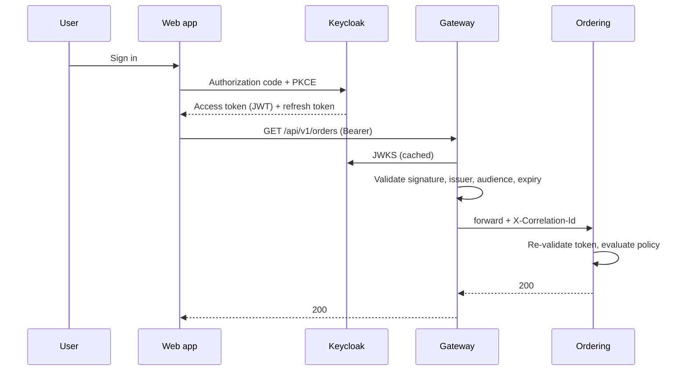
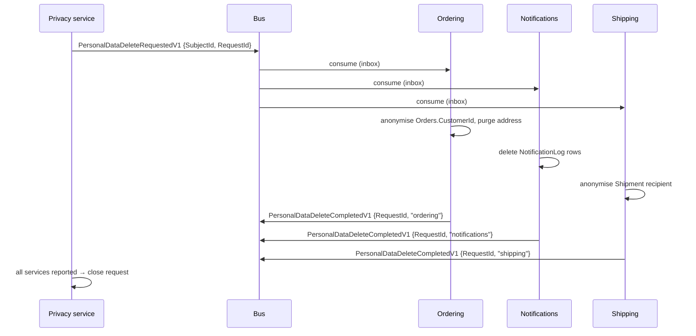

# 11. Identity and authorization

## 11.1 Keycloak as the identity provider

> **Decision — do not build an identity service.** See [ADR-009](appendix-a-adrs.md#adr-009--keycloak-not-a-hand-built-identity-service).

Authentication is a solved problem with a long tail of security-critical detail:
password hashing and rotation, MFA, account recovery, session revocation, token
introspection, brute-force protection, breach detection. Implementing it is a
large amount of work that produces no business differentiation and a great deal
of liability.

Keycloak is used here because it is Apache 2.0, self-hostable, runs as a
container, and speaks standard OIDC. The realistic alternatives:

| Option | Licence | When it fits |
|---|---|---|
| **Keycloak** | Apache 2.0 | Self-hosted, no per-user cost, full control |
| Microsoft Entra ID | Commercial | Already an Azure/Microsoft 365 organisation |
| Auth0 / Okta | Commercial | Willing to pay per-user for lower operational burden |
| Duende IdentityServer | Commercial above a revenue threshold | Deep .NET integration, custom flows |
| OpenIddict | Apache 2.0 | Building the IdP in-process is genuinely required |

Because everything speaks OIDC, swapping providers changes configuration rather
than code.

## 11.2 Token flow



**Services re-validate the token.** The gateway validating it is not sufficient:
anything that reaches a service by another path — a misconfigured network
policy, another service, a port-forward — would otherwise be unauthenticated.
Validation is cheap; assume the network is hostile.

## 11.3 Service configuration

```csharp
builder.Services
    .AddAuthentication(JwtBearerDefaults.AuthenticationScheme)
    .AddJwtBearer(options =>
    {
        options.Authority = builder.Configuration["Identity:Authority"];
        options.Audience = "commerce-api";
        options.RequireHttpsMetadata = !builder.Environment.IsDevelopment();

        options.TokenValidationParameters = new TokenValidationParameters
        {
            ValidateIssuer = true,
            ValidateAudience = true,
            ValidateLifetime = true,
            ValidateIssuerSigningKey = true,
            ClockSkew = TimeSpan.FromSeconds(30),
            NameClaimType = "preferred_username",
            RoleClaimType = "roles"
        };
    });
```

The default `ClockSkew` is five minutes, which means a revoked or expired token
keeps working for five minutes longer than it should. Thirty seconds is enough
to absorb real clock drift between NTP-synced hosts.

## 11.4 Permission-based authorization

Role checks scattered through controllers (`[Authorize(Roles = "Admin")]`)
become unmaintainable once roles multiply. Authorize on **permissions**, and map
roles to permissions in one place.

```csharp
// This is the block in §4.2's Program.cs — one copy in the code, repeated here
// because this is where the permission model is explained. The permission
// STRINGS are the contract with Keycloak's claim mapper; the policies are how
// ASP.NET Core checks them.
builder.Services
    .AddAuthorizationBuilder()
    .AddPolicy("orders:read", p => p.RequireClaim("permission", "orders:read"))
    .AddPolicy("orders:write", p => p.RequireClaim("permission", "orders:write"))
    .AddPolicy("orders:cancel", p => p.RequireClaim("permission", "orders:cancel"));
```

> **A policy name is a reference, and nothing checks it.**
> `RequireAuthorization("orders:cancel")` takes a string. Misspell it, or
> register the policy in a helper the host never calls, and there is no
> compiler error, no `ValidateOnBuild` failure and no startup warning — the
> endpoint throws `InvalidOperationException` the first time somebody cancels
> an order, which is to say in production, on the path that matters. The
> gateway's version of the same mistake is quieter still ([§10.2](10-api-gateway.md)): YARP drops
> the route instead of throwing.
>
> This is the `GetServices<T>()` problem in a different costume — a lookup by
> name that returns nothing and is only observed at the call site. Assert it
> the same way: enumerate the endpoint policy names from
> `EndpointDataSource` in a test and require each to resolve through
> `IAuthorizationPolicyProvider`.

> **Decision — Minimal APIs, not MVC controllers.** See
> [ADR-015](appendix-a-adrs.md#adr-015--minimal-apis-not-mvc-controllers). The endpoint layer in this
> architecture is a thin translation from HTTP to a command or query. Controllers
> add a base class, attribute routing, model binding conventions and an action
> filter pipeline to do that, and their filter pipeline duplicates the dispatcher
> pipeline that already exists. Minimal APIs express the same thing with less
> ceremony, and endpoint groups give the same route and policy grouping.

```csharp
public static class OrderEndpoints
{
    public static void MapOrderEndpoints(this IEndpointRouteBuilder app)
    {
        RouteGroupBuilder group = app
            .MapGroup("/v1/orders")
            .WithTags("Orders")
            .RequireAuthorization();

        group
            .MapPost(
                "/{id:guid}/cancel",
                async (Guid id, CancelOrderRequest request, IDispatcher dispatcher, CancellationToken ct) =>
                {
                    // Parse at the boundary, through the same method the message
                    // path uses (§9.4). Binding CancellationReason straight from
                    // JSON would publish the enum's member names as API surface,
                    // and an unknown value would surface as a model-binding error
                    // rather than a 400 naming the field.
                    if (!CancellationReasons.TryParse(request.Reason, out CancellationReason reason))
                        return Results.ValidationProblem(new Dictionary<string, string[]>
                        {
                            ["reason"] = [$"Unknown cancellation reason '{request.Reason}'."]
                        });

                    Result result = await dispatcher.SendAsync(new CancelOrderCommand(id, reason), ct);

                    return result.ToHttpResult();
                })
            .RequireAuthorization("orders:cancel")
            .WithName("CancelOrder");
    }
}
```

Endpoint classes reference Application and Domain contracts only — never
`DbContext`, a concrete repository, or the bus. That is the composition-root
rule from [§4.2](04-solution-structure.md), and it is enforced by an architecture test rather than review.

The request type carries the **wire code**, not the enum, for the reason [§9.4](09-messaging.md)
gives about `CancelOrder.Reason` — and the parse is the same one, because two
parses drift and the drift only shows on whichever path is less tested:

```csharp
namespace Ordering.Application.Orders.CancelOrder;

public sealed record CancelOrderRequest(string Reason);

// Non-generic Result, not Result<Unit>: CommandConsumer constrains TCommand to
// ICommand<Result> (§9.4), and a command reachable by message must satisfy it.
// Result IS the void payload — a Unit type alongside it would be a second way
// to say the same thing, and only one of them would compile here.
public sealed record CancelOrderCommand(Guid OrderId, CancellationReason Reason)
    : ICommand<Result>;

/// <summary>
/// The one place a wire code becomes a domain enum. Both entry points call it:
/// this endpoint and the CancelOrder message mapper (§9.4). An unknown code
/// fails loudly — Enum.TryParse over the member names would silently accept
/// "CustomerRequest" as well, making the enum's spelling part of the API.
///
/// Both callers fail, differently, because their callers differ. The endpoint
/// returns 400 naming the field, because a person can fix a request. The
/// message mapper throws ContractMappingException, which §9.4's retry policy
/// ignores so the message reaches the error queue on the first attempt — a
/// sibling service sending a code we do not know is a deployment problem, and
/// no amount of backoff resolves it.
/// </summary>
public static class CancellationReasons
{
    private static readonly FrozenDictionary<string, CancellationReason> ByCode =
        new Dictionary<string, CancellationReason>(StringComparer.Ordinal)
        {
            [CancelReasons.OutOfStock] = CancellationReason.OutOfStock,
            [CancelReasons.StockTimeout] = CancellationReason.StockTimeout,
            [CancelReasons.PaymentDeclined] = CancellationReason.PaymentDeclined,
            [CancelReasons.PaymentTimeout] = CancellationReason.PaymentTimeout,
            [CancelReasons.CustomerRequest] = CancellationReason.CustomerRequest
        }.ToFrozenDictionary();

    public static bool TryParse(string? code, out CancellationReason reason) =>
        ByCode.TryGetValue(code ?? "", out reason);

    // The reverse, for anything that has the enum and needs the vocabulary
    // back — §13.3's metric tag, and the saga when it re-publishes. Built by
    // inverting the map above rather than written twice: a second table is a
    // second thing to forget when a reason is added.
    private static readonly FrozenDictionary<CancellationReason, string> ToCodeMap =
        ByCode.ToFrozenDictionary(p => p.Value, p => p.Key);

    public static string ToCode(CancellationReason reason) => ToCodeMap[reason];
}
```

Coarse permission checks live at the endpoint. **Resource-level checks — "is
this the customer's own order?" — belong in the handler**, where the data is
available:

```csharp
internal sealed class CancelOrderHandler(IOrderRepository orders, ICurrentUser currentUser, TimeProvider clock)
    : ICommandHandler<CancelOrderCommand, Result>
{
    public async Task<Result> HandleAsync(CancelOrderCommand command, CancellationToken ct)
    {
        Order? order = await orders.GetAsync(new OrderId(command.OrderId), ct);
        if (order is null)
            return Result.Failure(OrderErrors.NotFound);

        // Deliberately a 404, not a 403 — a 403 confirms the order exists.
        if (currentUser.IsAuthenticated &&
            order.CustomerId.Value != currentUser.Id &&
            !currentUser.HasPermission("orders:admin"))
        {
            return Result.Failure(OrderErrors.NotFound);
        }

        // The aggregate still owns the transition — this handler decides who
        // may ask, not whether the order is in a state that permits it (§5.4).
        order.Cancel(command.Reason, clock.GetUtcNow());

        // No metric here, for the reason §6.4 gives: this runs inside the
        // transaction, and a cancellation counted before the commit is counted
        // again by an execution-strategy replay. It is recorded by the
        // projection, from OrderCancelledDomainEvent (§13.3).

        // No SaveChangesAsync: TransactionBehavior owns the commit (§6.3).
        return Result.Success();
    }
}
```

The `IsAuthenticated` guard is not a loophole, and leaving it out is the bug.
`CancelOrderCommand` is dispatched from two places — the endpoint above and a
`CommandConsumer` (§9.4) when the saga compensates — and the second has no
caller. A message-borne cancellation is the system acting on its own decision,
already authorised at the endpoint that started the saga; checking it against
"the current user" would compare an order's owner to nobody and refuse every
compensation. Handlers reachable both ways must say which check applies to
which path.

The port and its one implementation:

```csharp
// Ordering.Application — a port, because handlers must not see HttpContext.
public interface ICurrentUser
{
    bool IsAuthenticated { get; }
    Guid Id { get; }                      // throws if not authenticated
    bool HasPermission(string permission);
}
```

```csharp
// Ordering.Infrastructure — registered by AddOrderingInfrastructure (§4.2),
// which also calls AddHttpContextAccessor(). Scoped: it is per request.
public sealed class HttpContextCurrentUser(IHttpContextAccessor accessor) : ICurrentUser
{
    private ClaimsPrincipal? User => accessor.HttpContext?.User;

    public bool IsAuthenticated => User?.Identity?.IsAuthenticated == true;

    public Guid Id => Guid.Parse(
        User?.FindFirstValue(ClaimTypes.NameIdentifier) ??
            throw new InvalidOperationException(
                "No authenticated caller. Guard with IsAuthenticated — a handler " +
                "reached by a consumer (§9.4) has no HttpContext."));

    // The same claim type §11.4's policies require, so an endpoint policy and
    // a resource check can never disagree about what a permission is.
    public bool HasPermission(string permission) =>
        User?.HasClaim("permission", permission) == true;
}
```

**Three places have to agree on which claim identifies a user**, and they do:
`ClaimTypes.NameIdentifier` here, in §10.3's rate-limit partition key, and in
the `TestAuthHandler` of [§12.4](12-test-strategy.md). Keycloak's `sub` maps to it under the default
inbound claim mapping.

`NameClaimType = "preferred_username"` in §11.3 does **not** compete with this.
It sets what `ClaimsPrincipal.Identity.Name` returns — a display name, for logs
and audit lines — while `NameIdentifier` stays the stable subject identifier.
Reading `Identity.Name` as the key to a record would work in every test and
break the first time somebody changed their username.

`orders:admin` is a **claim**, not one of §11.4's registered policies. Policies
gate endpoints; a resource check asks a question the endpoint could not have
answered before loading the data. The permission strings come from the same
vocabulary either way.

## 11.5 Service-to-service authentication

A host that calls a peer authenticates with the OAuth 2.0 client credentials
grant, holding its own client ID and secret with a narrow scope. Never reuse a
user's token for a background operation — it expires, it carries the wrong
permissions, and it makes the audit trail lie about who did what.

**In this blueprint that is exactly one host: the BFF** (§9.7). The gateway
forwards the caller's token unchanged rather than exchanging it for one of its
own; Ordering and Catalog exchange events over the broker and read local
projections ([§6.4](06-cqrs.md), ADR-002), so neither ever presents itself to the other.

That is not a simplification for the sake of the example — it is what ADR-002
and ADR-017 add up to. The mechanism below is worth understanding precisely
because the number of hosts using it is the number of synchronous couplings in
the platform, and both are meant to stay at one. "Every host gets the full
identity block" is the natural-looking generalisation and the wrong one; so is
reading this section and concluding the services talk to each other.

Mechanically this is a `DelegatingHandler` attached to every outbound client
(§9.7), so no call site has to remember it:

```csharp
public sealed class ClientCredentialsHandler(ITokenCache tokens, IOptions<ServiceIdentityOptions> identity)
    : DelegatingHandler
{
    protected override async Task<HttpResponseMessage> SendAsync(HttpRequestMessage request, CancellationToken ct)
    {
        // Cached until shortly before expiry; one token fetch serves many calls.
        string token = await tokens.GetAsync(identity.Value.Scope, ct);
        request.Headers.Authorization = new AuthenticationHeaderValue("Bearer", token);

        return await base.SendAsync(request, ct);
    }
}
```

It must sit **inside** the resilience pipeline. Registering it outside means a
retry reuses the token from the first attempt, which defeats the main reason a
retry would help after a 401 — see the ordering in §9.7.

### The scope has to become an audience

`ServiceIdentityOptions.Scope` is `commerce-api` ([§14.1](14-local-development.md), [§15.4](15-cicd-deployment.md)) and §11.3
validates `Audience = "commerce-api"`. Those are **not** the same claim, and
nothing so far makes one imply the other: a client-credentials token carries
`scope: commerce-api` and, by default, an `aud` of `account`. Catalog would
reject the platform's only permitted synchronous hop, at the one moment there is
no user to blame it on.

The realm has to close the gap. In Keycloak the client scope `commerce-api`
needs an **audience mapper** adding `commerce-api` to `aud`, and the BFF's
service-account client needs that scope assigned as default:

| Realm object | Setting | Why |
|---|---|---|
| Client scope `commerce-api` | Mapper of type *Audience*, included audience `commerce-api`, added to the access token | Puts the value in `aud` that every API validates |
| Client `web-bff` | Service accounts enabled, `commerce-api` a **default** client scope | Client-credentials tokens request no scope explicitly; a client scope left optional is silently absent |
| Clients for browser flows | Same scope, so a user's token validates at the same services | One audience for the whole platform (§11.3) — per-service audiences are a later split, not a v1 one |

This is realm configuration, not code, which is exactly why it earns a test
rather than a paragraph — nothing in the solution compiles differently when the
audience mapper is missing.

It is also the **one** suite that runs a real Keycloak. §12.4's fixture
deliberately does the opposite: it points at an unreachable authority and swaps
the JWT scheme for `TestAuthHandler`, because the several hundred tests that
merely need *a* principal should not pay for an identity provider or fail when
one is slow. That fixture therefore cannot see this defect at all — it never
validates a token Keycloak issued. So this suite gets its own fixture, starting
the Keycloak container with the realm import from §14.1 and the real JWT scheme:

```csharp
[Fact]
public async Task Bff_client_credentials_token_is_accepted_by_a_service()
{
    string token = await Realm.ClientCredentialsAsync("web-bff");

    token.Audiences().ShouldContain("commerce-api");
    (await Catalog.GetAsync("/products/1", token)).StatusCode
        .ShouldBe(HttpStatusCode.OK);
}

[Fact]
public async Task A_client_without_the_scope_is_rejected()
{
    // The negative half matters more: a mapper that adds the audience to every
    // token would pass the test above and grant the platform to any client the
    // realm happens to hold.
    string token = await Realm.ClientCredentialsAsync("unrelated-client");

    (await Catalog.GetAsync("/products/1", token)).StatusCode
        .ShouldBe(HttpStatusCode.Unauthorized);
}
```

## 11.6 Secrets

| Environment | Mechanism |
|---|---|
| Local development | .NET user secrets — never `appsettings.json` |
| CI | Pipeline secret store, masked in logs |
| Kubernetes | External Secrets Operator syncing from Vault / Azure Key Vault |

Enable secret scanning in CI. A secret committed to git is compromised even
after the commit is reverted, and the rotation must happen regardless.

## 11.7 Extension points — multi-tenancy, personal data, compliance

None of these are built in the baseline. All three are expensive to retrofit
into a design that ignored them, and cheap to leave a seam for. This section
defines the seams and the rules that apply *if* the extension is enabled.

| Extension | Seam | Baseline rule |
|---|---|---|
| **Multi-tenancy** | `TenantId` on the integration event metadata envelope; a logging enrichment hook; an ambient `ITenantContext` resolved from token claims | No tenant is required. **If** tenancy is enabled, `TenantId` must appear in every Redis key — `{service}:cache:{tenant}:...`, after the keyspace segment rather than before it, so [§8.1](08-caching-redis.md)'s eviction split still reads off position two (§8.3) — plus every query predicate and every log scope |
| **Personal data erasure** | `PersonalDataDeleteRequestedV1` in `Common.Contracts` | Not published in the baseline. The consumer shape is defined below so services are built ready for it |
| **PCI / HIPAA / SOC 2** | — | Decide before handling regulated data, not after. Record the constraints as an ADR |

### Personal data erasure under database-per-service

GDPR Article 17 erasure is genuinely hard here: there is no central customer
table to delete a row from. Personal data is distributed across every service
that stores it, and no service knows what the others hold.

The wrong answer is a central "user data service" that owns the deletion — it
would need read access to every database, which destroys the ownership model.

The right answer is choreography. The request is broadcast; each service deletes
what it owns and reports back:



Rules for each service's consumer:

- **Delete or anonymise, per record.** An order that must be retained for tax
  law is anonymised — customer identifiers replaced, address cleared, the
  financial record preserved. A notification log row is deleted outright. The
  owning service makes that call; nobody else can.
- **Write an audit record** of what was erased and when. That record itself
  contains no personal data — a subject ID hash, a timestamp, a count.
- **Idempotent.** The message is delivered at least once, and a second erasure
  of already-erased data must succeed silently.
- **Report completion.** The privacy service tracks which services have
  responded and escalates on timeout. Silence is not success.

> **The Privacy service is part of the extension, not of the baseline.** It
> appears in no bounded-context table ([§3.2](03-bounded-contexts.md)), no solution tree (§4.1) and no PR
> ([Appendix C](appendix-c-delivery-plan.md)), and enabling erasure means adding it — a context owning the
> request aggregate, the expected-responder set as configuration, and a
> completion SLO. Naming it in the diagram is what makes the seam checkable:
> the alternative is discovering at enablement time that nothing was ever
> designed to close the request. A service missing from the responder list is
> the failure mode to design against, because it fails as *silence*, and
> silence is the one outcome choreography cannot distinguish from success.

The one thing that must be designed for from the start: **integration events
carry identifiers, not personal data**. An `OrderConfirmed` carrying a customer's
name and email means erasure must also purge the broker, every consumer's inbox,
and any log that recorded the payload — which is not practically possible.
Carrying `CustomerId` keeps the personal data inside the service that owns it,
which is the only place it can be reliably erased.

---

[← §10 API Gateway](10-api-gateway.md) · [Index](README.md) · [§12 Test strategy →](12-test-strategy.md)
