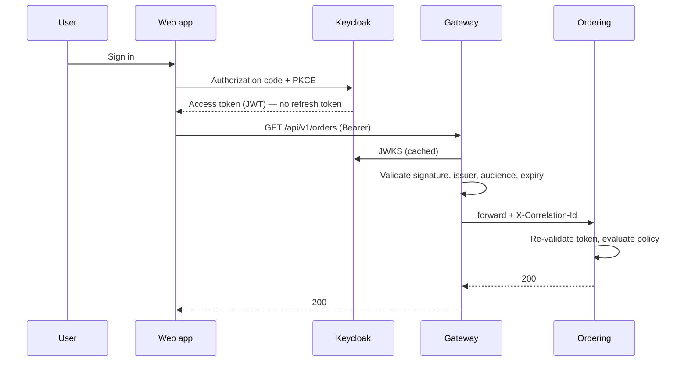
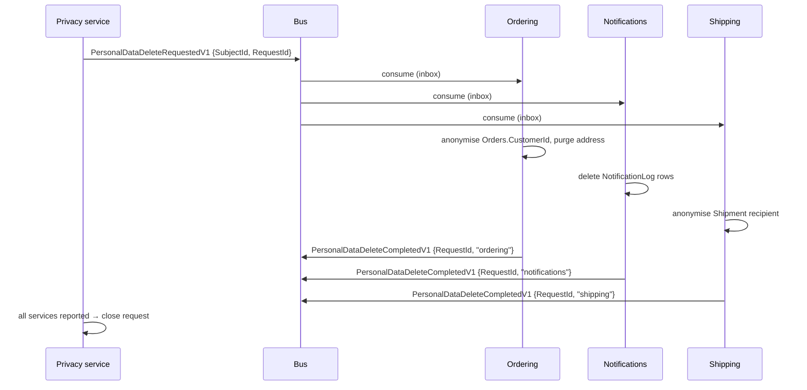

# 11. Identity and authorization

## 11.1 Keycloak as the identity provider

> **Decision — do not build an identity service.** See [ADR-009](appendix-a-adrs.md#adr-009--keycloak-not-a-hand-built-identity-service).

Authentication is a solved problem with a long tail of security-critical detail:
password hashing and rotation, MFA, account recovery, session revocation, token
introspection, brute-force protection, breach detection. Implementing it is a
large amount of work that produces no business differentiation and a great deal
of liability.

> **Two of those are reasons to buy an identity provider, not claims that this
> platform consumes them.** Keycloak revokes a session and offers an
> introspection endpoint; **no service here calls either**. §11.3 configures
> local validation only, so revocation is observed at the next token request
> and not before —
> [ADR-033](appendix-a-adrs.md#adr-033--revocation-is-bounded-by-the-token-lifetime-and-no-denylist-exists)
> records the bounded window that leaves. The list above is the reason the
> problem was not built in-house and remains correct as such; it is not an
> inventory of what is wired up, and it was read as one for four PRs.

Keycloak is used here because it is Apache 2.0, self-hostable, runs as a
container, and speaks standard OIDC. The realistic alternatives:

| Option | Licence | When it fits |
|---|---|---|
| **Keycloak** | Apache 2.0 | Self-hosted, no per-user cost, full control |
| Microsoft Entra ID | Commercial | Already an Azure/Microsoft 365 organisation |
| Auth0 / Okta | Commercial | Willing to pay per-user for lower operational burden |
| Duende IdentityServer | Commercial above a revenue threshold | Deep .NET integration, custom flows |
| OpenIddict | Apache 2.0 | Building the IdP in-process is genuinely required |

Because everything speaks OIDC, swapping providers changes configuration rather
than code.

## 11.2 Token flow



**Services re-validate the token.** The gateway validating it is not sufficient:
anything that reaches a service by another path — a misconfigured network
policy, another service, a port-forward — would otherwise be unauthenticated.
Validation is cheap; assume the network is hostile.

> **No refresh token reaches the browser, and the diagram used to say it did.**
> Everything `W` is issued is readable by any script on the origin, so a
> refresh token there converts a single XSS — or one malicious transitive
> dependency in the bundle — into persistent account takeover that outlives the
> session and survives a password change. The realm made that concrete rather
> than theoretical: `revokeRefreshToken` is off and `refreshTokenMaxReuse` is
> zero against a ten-hour SSO session, so the token was reusable and never
> rotated for as long as the session lived.
> [ADR-034](appendix-a-adrs.md#adr-034--the-browser-holds-an-access-token-and-no-refresh-token)
> records the removal, and `web-app`'s `use.refresh.tokens: "false"` is what
> enforces it — pinned by `RealmImportTests`, because a realm attribute is
> exactly the kind of setting that gets changed back by someone debugging a
> logout. **In the local realm**: the charts point at an externally
> provisioned authority, so a deployed realm owes the same attribute and
> nothing here checks that it has it. ADR-034 states the obligation and its
> limit.
>
> **The access-token lifetime beside it was in the same position and is not any
> more.** Since
> [ADR-040](appendix-a-adrs.md#adr-040--the-access-token-lifetime-is-enforced-at-every-host)
> every host refuses an inbound token carrying more remaining life than the
> bound §11.3 derives, so that number is held to wherever the realm was
> provisioned rather than asserted against the one this repository ships. **A
> refresh token affords no such check**: it passes between the browser and
> Keycloak and never reaches a service, so there is nothing at a host to
> observe it with. The sentence above is unchanged in substance and narrower in
> scope than it was —
> [#157](https://github.com/alexander-shamray/dotnet-ddd-blueprint/issues/157)
> stays open for this half.
>
> **Continuity is a silent renewal against the authorization endpoint**, bounded
> by the SSO session, so the user sees a login when that session has ended
> rather than when the access token expires. **The residual is an access token,
> and it is stated rather than closed:** an XSS still yields one, which a
> service will accept for up to the 330 seconds §11.3 derives below — the
> lifetime plus the skew, not the lifetime alone, and since ADR-040 a ceiling
> every host enforces rather than a figure it assumes the realm honoured. What
> bounds it is that number and nothing else — there is no revocation path
> ([ADR-033](appendix-a-adrs.md#adr-033--revocation-is-bounded-by-the-token-lifetime-and-no-denylist-exists)),
> which is the same fact §11.3 states from the other side.
>
> **Terminating the flow in `Web.Bff` is the stronger answer and is deliberately
> not taken here.** ADR-034 argues why: it is an OIDC handler, a cookie stack,
> antiforgery on every state-changing route, a realm change and a gateway route
> change — an Appendix C row rather than an edit, and §11.5's account of the
> BFF's one credential would not survive it.

> **The realm also enables `directAccessGrantsEnabled` on `web-app`, and that
> belongs in this chapter rather than only in a realm-file description.** It is
> the password grant, on a public client with no secret, and it exists so a
> developer can obtain a token with `curl` — [§14.1](14-local-development.md)'s
> local affordance, documented in `deploy/compose/README.md`. It is a local
> convenience with a real cost if it ever travelled: anything holding a
> username and password could mint tokens directly, bypassing PKCE and the
> browser flow entirely.
>
> **A deployed realm must turn it off, and nothing here establishes that one
> has.** That is a requirement rather than a description — this repository
> owns the Compose realm and no other, so the sentence above states an
> obligation on whoever provisions the deployed one, exactly as the
> refresh-token attribute does. **The lifetime was the third item on that list
> and is now the exception to it**:
> [ADR-040](appendix-a-adrs.md#adr-040--the-access-token-lifetime-is-enforced-at-every-host)
> holds every inbound token to the bound at every host, so the deployed realm's
> answer to that one question is checked wherever it was provisioned. A flow
> flag affords nothing of the kind: `standardFlowEnabled` and
> `directAccessGrantsEnabled` decide how a token is *obtained*, and a token
> that arrives at a service does not say which grant minted it. So
> [#157](https://github.com/alexander-shamray/dotnet-ddd-blueprint/issues/157)
> stays open for these flags and for the refresh-token attribute rather than
> closed by a change that covers only the lifetime; writing any of them as a
> fact would have been the third security property in this chapter to read as
> enforced while being true only locally.

## 11.3 Service configuration

`AddJwtAuthentication` lives in `Common.Web` and is composed by
`AddCommonWebDefaults` ([§13.2](13-observability.md)), never called directly by
a host. Every service registers it, because every service re-validates (§11.2).

```csharp
public const string Audience = "commerce-api";
public const string AuthorityKey = "Identity:Authority";

// §11.3's lifetime and the skew beside it, declared here because something now
// reads them. RevocationBound is composed and never written down: a literal 330
// beside a 300 and a 30 is the arithmetic nobody redoes when one of them moves.
public static readonly TimeSpan AccessTokenLifetime = TimeSpan.FromSeconds(300);
private static readonly TimeSpan AllowedClockSkew = TimeSpan.FromSeconds(30);

public static TimeSpan RevocationBound => AccessTokenLifetime + AllowedClockSkew;

public static IHostApplicationBuilder AddJwtAuthentication(this IHostApplicationBuilder builder)
{
    // Blank counts as missing: an environment variable set to the empty string
    // reaches Configuration as "" rather than null, so `??` alone admits
    // Identity__Authority= and the host starts having promised it would not.
    string? configured = builder.Configuration[AuthorityKey];

    if (string.IsNullOrWhiteSpace(configured))
    {
        throw new InvalidOperationException(
            $"'{AuthorityKey}' is not configured. Every host re-validates inbound tokens (§11.2), " +
            "so one that cannot name its identity provider must refuse to start rather than " +
            "answer the first request without a principal.");
    }

    // Nor is blank the only malformed value. `keycloak:8080/realms/commerce` —
    // a dropped scheme — is non-blank and still not an address, and https is
    // required everywhere but Development, which is the same rule
    // RequireHttpsMetadata applies below, moved to startup.
    if (!Uri.TryCreate(configured, UriKind.Absolute, out Uri? parsed) ||
        (parsed.Scheme != Uri.UriSchemeHttp && parsed.Scheme != Uri.UriSchemeHttps))
    {
        throw new InvalidOperationException(
            $"'{AuthorityKey}' is '{configured}', which is not an absolute http or https URL. ...");
    }

    // A query or fragment is absolute, http, and still not a base address:
    // JwtBearer appends `/.well-known/openid-configuration` to this string, and
    // appending to `…/commerce#x` puts the suffix inside the fragment.
    if (parsed.Query.Length > 0 || parsed.Fragment.Length > 0)
    {
        throw new InvalidOperationException(
            $"'{AuthorityKey}' is '{configured}', which carries a query or fragment. ...");
    }

    if (!builder.Environment.IsDevelopment() && parsed.Scheme != Uri.UriSchemeHttps)
    {
        throw new InvalidOperationException(
            $"'{AuthorityKey}' is '{configured}', which is plain HTTP outside Development. ...");
    }

    string authority = configured;

    builder.Services
        .AddAuthentication(JwtBearerDefaults.AuthenticationScheme)
        .AddJwtBearer(options =>
        {
            options.Authority = authority;
            options.Audience = Audience;
            options.RequireHttpsMetadata = !builder.Environment.IsDevelopment();

            // The framework default, written out because §11.4's subject rule
            // rests on it: Keycloak issues `sub`, ICurrentUser.Id reads
            // ClaimTypes.NameIdentifier, and this is the only thing that turns
            // one into the other.
            options.MapInboundClaims = true;

            // ADR-033's bound, enforced rather than stated (#157, ADR-040). A
            // token is where the realm's answer is observable without admin
            // credentials this repository does not hold: whatever the realm was
            // configured to do, a token reaching a host carries how long it has
            // left. REMAINING life against this host's clock, not `exp - iat` —
            // `iat` is optional in RFC 7519, so an issuer omitting it would
            // switch the control off by omission. Refused rather than logged,
            // for the reason RequireHttpsMetadata above is.
            options.Events = new JwtBearerEvents
            {
                OnTokenValidated = context =>
                {
                    TimeProvider clock = context.Options.TimeProvider ?? TimeProvider.System;

                    // SpecifyKind because DateTimeOffset reads an Unspecified
                    // Kind as LOCAL, which on a host east of UTC would subtract
                    // hours from the remaining life and pass everything.
                    DateTimeOffset expires =
                        new(DateTime.SpecifyKind(context.SecurityToken.ValidTo, DateTimeKind.Utc));

                    if (expires - clock.GetUtcNow() <= RevocationBound)
                        return Task.CompletedTask;

                    context.Fail(
                        $"The token has more than {RevocationBound.TotalSeconds} seconds of life " +
                        "left, which is longer than the revocation bound this platform states " +
                        "(ADR-033). The realm that issued it sets an access-token lifetime, or a " +
                        "client-level override, above what §11.3 requires.");

                    return Task.CompletedTask;
                }
            };

            options.TokenValidationParameters = new TokenValidationParameters
            {
                ValidateIssuer = true,
                ValidateAudience = true,
                ValidateLifetime = true,
                ValidateIssuerSigningKey = true,
                ClockSkew = AllowedClockSkew,
                NameClaimType = "preferred_username",
                RoleClaimType = "roles"
            };
        });

    return builder;
}
```

The default `ClockSkew` is five minutes, which means an expired token keeps
working for five minutes past its own `exp`. Thirty seconds is enough to absorb
real clock drift between NTP-synced hosts.

**It buys nothing against revocation, and reading it as though it did is the
mistake worth naming.** A lifetime check reads `nbf` and `exp` and nothing
else, so a token the provider revoked a second ago is accepted here until it
expires on its own — at any skew. Observing revocation needs introspection or a
deny list, neither of which this platform has; what bounds the exposure is
token lifetime.

**That lifetime is 300 seconds, and this sentence is where the platform states
it.** Five minutes, normative — not a realm default nobody chose, and not
`ClockSkew`'s coincidentally equal *default* two paragraphs up, which is a
different quantity that happens to share a number.

**Since [ADR-040](appendix-a-adrs.md#adr-040--the-access-token-lifetime-is-enforced-at-every-host)
it is also a constant, because something reads it.**
`AuthenticationExtensions.AccessTokenLifetime` is that declaration, and
`RealmImportTests` compares the shipped realm against the field rather than
against a literal of its own. The test used to argue that a constant nothing
read would be a registration standing in for a control, which is the shape
ADR-033 was written to withdraw — and that was right while the number was only
ever asserted. What changed is the condition, not the taste.

**The revocation window is 330 seconds, and it is the lifetime plus the skew
rather than the lifetime.** `ClockSkew` is 30 seconds here, and a lifetime
check accepts a token until `exp` **plus** the skew — so logging a user out,
disabling a compromised account, or responding to a stolen token at Keycloak
has **no effect** on an access token already issued for up to five and a half
minutes. Two settings decide that number and only one of them is the realm's,
which is why shortening the exposure means reading both.

**That window is now held to at every host rather than assumed of the realm.**
`RevocationBound` is `AccessTokenLifetime + AllowedClockSkew` — composed, and
never written down as 330 — and every host that composes `AddCommonWebDefaults`
refuses an inbound token carrying more remaining life than that. The
measurement is remaining life against this host's clock and **not** `exp - iat`:
`iat` is optional in RFC 7519, so an issuer omitting the claim would switch the
control off by omission, and a control any subject can decline is not one.
`ValidTo` is on `SecurityToken` itself, and `exp` is already mandatory here
because `ValidateLifetime` refuses a token without one before the check runs.

**The inexact form costs something, and the ceiling is where that cost is
paid.** A host whose clock lags the issuer's sees a fresh token as having more
life left than it has, so what is refused is life beyond the *bound* — lifetime
plus skew — rather than beyond the lifetime. That tolerates exactly the drift
the skew above already declares tolerable and no more: a realm at 330 seconds
passes and one at 320 passes; five hours, thirty minutes and six minutes do
not, which is the class of misconfiguration this catches. **It is refused
rather than logged**, which is the posture `RequireHttpsMetadata` and the
authority guard below already take — a realm above the bound 401s every request
instead of quietly widening the window between a revocation and its effect, and
that availability cost is taken deliberately.

> **This section separated the two quantities and then failed to add them.**
> The paragraph above was written to stop a reader mistaking `ClockSkew`'s
> five-minute default for the token lifetime — a real hazard, since the two
> shared a number — and in drawing the distinction it stated the bound as the
> lifetime alone. The distinction is right and the arithmetic was not: they
> are different quantities *that compose*, and a validation window is the sum.
> Naming a confusion is not the same as being immune to it.
[ADR-033](appendix-a-adrs.md#adr-033--revocation-is-bounded-by-the-token-lifetime-and-no-denylist-exists)
records that this bounded window is the accepted posture and withdraws
[ADR-006](appendix-a-adrs.md#adr-006--redis-for-cache-and-coordination-never-as-a-store-of-record)'s
listing of a token denylist among Redis's contents.

> **The claim used to read as closed from three directions, which is what made
> it worth an ADR rather than a correction.** §11.1 above lists "session
> revocation, token introspection" among the reasons not to build
> authentication in-house; ADR-006 recorded the denylist as a decided use of
> Redis; and [§8.1](08-caching-redis.md) gave `{service}:denylist:` the
> strictest eviction policy in the platform, on the argument that a revoked
> token entry must never be evicted. `RedisKeys.Denylist` existed in code with
> tests pinning its shape. **Nothing ever wrote or read the keyspace**, and
> only this section said so. A reviewer asking whether revocation was handled
> met three yeses and one no, and the three were louder.
>
> **The number is the whole of the control, so treat it as one.** Lengthening
> `accessTokenLifespan` in the realm silently lengthens the window this
> paragraph quotes, which is why `RealmImportTests` pins the realm's value
> against the figure stated here: two statements about one fact, gated against
> each other rather than left to agree by habit.
>
> **It is also not the realm's only token lifetime, and the other one is
> reachable by a checkbox.** `accessTokenLifespanForImplicitFlow` is 900, and
> the five minutes above is true only because no client enables the implicit
> flow. Turning it on for one client would triple the exposure while every
> number in this chapter still read 300 — the value would not have changed,
> the *path* would — so the suite asserts that no client enables it, alongside
> the lifetime itself. A premise a number depends on is part of the number.
> A client-level `access.token.lifespan` overrides the realm outright, so the
> suite checks for that too; both were found by review rather than by design.
> **Neither would now lengthen the window, because the ceiling above does not
> care which setting produced the token** — a 900-second implicit-flow token is
> refused at every host exactly as a 900-second ordinary one is. The suite
> still names them: a 401 on every request is a worse way to discover a
> checkbox than a red test is.
>
> **Every one of those checks reads the local realm, and none reads a deployed
> one.** `RealmImportTests` parses [§14.1](14-local-development.md)'s
> `realm-export.json`; the charts point at an externally provisioned authority
> this repository holds no configuration for. That is still true of the suite
> and it stopped settling the question, which is the correction
> [ADR-040](appendix-a-adrs.md#adr-040--the-access-token-lifetime-is-enforced-at-every-host)
> makes to the sentence that used to follow it.
>
> **That sentence said the number above is *verified* only where the platform
> provisions its own identity provider, which is locally — and it is now
> verified wherever a token is presented.** The check is not in the suite and
> could not be: a pipeline check needs admin credentials CI does not hold, a
> startup assertion reads a discovery document that publishes no token lifetime
> at all, and committing a production realm makes somebody's operational input
> into this repository's artefact. It is in the host instead, because every
> service already validates a token on every request and a token carries how
> long it has left whatever the realm was configured to do. The two statements
> now agree by construction rather than by habit: the realm sets 300, the
> control admits up to 330, and `RealmImportTests` reads the constant the
> control is built from, so a realm edited to 400 fails that test *and* would
> fail every request.
>
> **The refresh-token attribute and the flow flags stay where this callout put
> them, and the asymmetry is a property of what a host can see.**
> `use.refresh.tokens`, `standardFlowEnabled` and `directAccessGrantsEnabled`
> decide what Keycloak issues and to whom; a refresh token never reaches a
> service, and the grant that minted a token that does reach one leaves no
> trace in it. So a deployed realm still owes those settings, and
> [ADR-034](appendix-a-adrs.md#adr-034--the-browser-holds-an-access-token-and-no-refresh-token)
> records that obligation as one this repository states and cannot check — the
> division §15.4 already draws for every Secret, which
> [ADR-033](appendix-a-adrs.md#adr-033--revocation-is-bounded-by-the-token-lifetime-and-no-denylist-exists)
> recorded for the lifetime too until ADR-040 discharged that half. It applies
> to less of the realm than it did, and
> [#157](https://github.com/alexander-shamray/dotnet-ddd-blueprint/issues/157)
> stays open for the remainder.

**The authority is read eagerly and the throw names the key**, which is the
posture `AddSqlServer` and `AddMassTransitMessaging` already take: a host that
cannot name its identity provider does not start. It is deliberately **not** an
options type with `ValidateOnStart` — [§15.4](15-cicd-deployment.md) makes
`ServiceIdentityOptions` the only options type in the solution and argues why,
and a second bag bound to a section holding one value is the shape that rule
forbids. §12.4's fixture comment attributed this failure to
`OptionsValidationException` until PR-16 wrote the code and found otherwise.

**The audience is a constant, not configuration.** §11.5 settles on one
audience for the whole platform — per-service audiences are a later split — so
the value is identical in Compose, in the test fixture and in production, which
is exactly what §15.4 says disqualifies something from being configuration.
Being a constant is also what makes the realm checkable: the suite that reads
the shipped realm compares its audience mapper against this field rather than
restating the string.

> **`RequireHttpsMetadata` is the line the rest of this block rests on.** The
> four `Validate*` flags check a signature against keys fetched from the
> authority's discovery document — over plain HTTP, an attacker who can rewrite
> that response supplies their own keys and every check below passes on a token
> they minted. §14.1's Keycloak is `http://keycloak:8080`, so Development has to
> allow it; anything that is not Development must not, and the test asserts both
> directions rather than only the one somebody remembered to name.

## 11.4 Permission-based authorization

Role checks scattered through controllers (`[Authorize(Roles = "Admin")]`)
become unmaintainable once roles multiply. Authorize on **permissions**, and map
roles to permissions in one place.

```csharp
// This is the block in §4.2's Program.cs — one copy in the code, repeated here
// because this is where the permission model is explained. The permission
// STRINGS are the contract with Keycloak's claim mapper; the policies are how
// ASP.NET Core checks them.
builder.Services
    .AddAuthorizationBuilder()
    .AddPolicy(OrderingPermissions.Write, p => p.RequirePermission(OrderingPermissions.Write))
    .AddPolicy(OrderingPermissions.Cancel, p => p.RequirePermission(OrderingPermissions.Cancel));
```

One policy per constant and no more: a policy registered before an endpoint
names it is an unused registration, which is the mirror of the unregistered
name the callout below is about. This block registered a third over
`OrderingPermissions.Read` until PR-18 shipped the service without a read
endpoint — the class sample and the registration have to lose an entry
together, and they did not.

`RequirePermission` is a one-line extension in `Common.Web` over
`RequireClaim(PermissionClaim.Type, permission)`. It exists so that **no host
ever spells the claim type**: four things have to agree on `"permission"` and
only three of them are code — the policies here, `ICurrentUser.HasPermission`
below, the test authentication scheme ([§12.4](12-test-strategy.md)), and the
realm's protocol mapper, which is configuration and cannot reference a
constant. The fourth is asserted against the other three instead (§11.5).

The permission strings are a per-service constant class rather than literals,
for the reason the next callout gives: a name written twice is a name that can
be misspelt once. It lives at the composition root, beside the policies —
`Ordering.Api`, and `Gateway.Api` for the gateway's own `inventory:admin`
(§10.2):

```csharp
namespace Ordering.Api;

/// <summary>
/// Ordering's permission vocabulary. The strings are the contract with the
/// realm's claim mapper (§11.5); the policies registered from them are how
/// ASP.NET Core checks them.
/// </summary>
public static class OrderingPermissions
{
    public const string Write = "orders:write";
    public const string Cancel = "orders:cancel";
}
```

**A service's vocabulary holds what its endpoints require, and nothing else.**
This sample carried a third entry, `orders:read`, until PR-18 shipped the
service and had no read endpoint to require it. It arrives with whichever PR
gives Ordering a read endpoint, and that is deliberately not a PR number: this
sentence said PR-20's, and PR-20 turned out to consume Catalog's events into a
projection and add no endpoint at all. **A permission dated to a PR is a claim
about that PR's scope**, which is not this chapter's to make — the rule is
that the constant follows the endpoint, whichever PR brings one. A permission
printed here ahead of the endpoint
that names it is the first half of the rule below, demonstrated by the sample
that states it. Catalog's is one entry — `catalog:write` — because its listing is anonymous
([§10.2](10-api-gateway.md)); there is no `catalog:read`, because a permission
nothing requires is a name in the realm nobody can act on. `orders:admin` is
not here either, and for a different reason given below: it is a **claim** a
handler checks, not a policy an endpoint names.

**The rule runs both ways, and the second direction is the one that gets
missed.** A permission nothing requires is a dead name in the realm; a
permission something requires and the realm cannot grant is a **path nobody
can reach** — 403 for every principal Keycloak can issue, at every attempt,
for ever. So the role in §11.5's `commerce-api` client and the constant here
arrive in the same change, whichever of the two is written first. **A route's
permission is under the same rule as an endpoint's**, which is how it was
missed: PR-17 registered the gateway's `inventory:admin` policy and named it
on a route without adding the role, and neither the constant nor the closed-set
realm test could see it — the constant makes a *misspelling* a compile error
and says nothing about a name the identity provider has never heard of, and
the realm test compares against a literal because `Common.Web.Tests` is a
building block's suite and cannot reference a host to read its constants. The
check belongs to whichever suite owns the constant, and
`GrantablePermissionTests` in `Gateway.Api.Tests` is the first of them.

> **A policy name is a reference, and nothing checks it.**
> `RequireAuthorization("orders:cancel")` takes a string. Misspell it, or
> register the policy in a helper the host never calls, and there is no
> compiler error, no `ValidateOnBuild` failure and no startup warning — the
> endpoint throws `InvalidOperationException` the first time somebody cancels
> an order, which is to say in production, on the path that matters.
>
> **The gateway is the one place this fails better, and this callout said the
> reverse.** It claimed YARP dropped the route rather than throwing, which
> would have made the edge the quietest site of all; measured, YARP validates
> both registries when it loads §10.2's file and refuses to start, naming the
> policy and the route. So the deployment fails, and nothing serves a request
> under a policy that does not exist. A service still has the failure described
> above, which is what the rest of this callout is for.
>
> This is the `GetServices<T>()` problem in a different costume — a lookup by
> name that returns nothing and is only observed at the call site. Assert it
> the same way: enumerate the endpoint policy names from
> `EndpointDataSource` in a test and require each to resolve through
> `IAuthorizationPolicyProvider`.
>
> **A constant closes half of this and the test closes the other half**, which
> is why both are wanted. Naming the policy from a per-service `Permissions`
> class makes a misspelling a compile error; it says nothing about a policy
> that was never registered, because the constant is equally happy on both
> sides of a registration that does not run. The enumeration is what catches
> that, and it needs its own guard against passing vacuously — over a service
> with no endpoints, "every name resolves" is true and worthless.

**The mirror case is the one with no diagnostic at all, and a fallback policy
is what closes it.** The callout above is about a policy *named* and not
registered. A policy neither named nor required is quieter still:
`UseAuthorization` evaluates **nothing** on an endpoint carrying no
authorization metadata, so authorization applies exactly where somebody wrote
`RequireAuthorization()` and nowhere else — no compiler error, no
`ValidateOnBuild` failure, no startup warning, and no test that would notice.
The endpoint is then reachable from the internet rather than merely from
inside the cluster, since [§10.2](10-api-gateway.md)'s public route is GET-only
across a whole namespace.

`AddCommonWebDefaults` therefore sets a fallback
([§13.2](13-observability.md),
[ADR-030](appendix-a-adrs.md#adr-030--authorization-is-deny-by-default-in-the-building-block)):

```csharp
builder.Services
    .AddAuthorizationBuilder()
    .AddPolicy("authenticated", p => p.RequireAuthenticatedUser())
    .SetFallbackPolicy(new AuthorizationPolicyBuilder().RequireAuthenticatedUser().Build());
```

Every host composing that call inherits it, so the omission is a 401 and a
public path has to say `AllowAnonymous()` — a line a reviewer can see. Absence
and decision stop looking the same, which is the rule §10.2 already applies to
a route file and §13.5 to a readiness set.

> **A fallback reaches endpoints nobody wrote, and the three it reaches here
> are all deliberate.** Routing's 405 short-circuit endpoint carries no
> metadata, so an anonymous caller using the wrong method on a real path is
> challenged before the method is considered — an authenticated one still gets
> 405. `MapOpenApi()` carries none either, so the document that enumerates
> every route and schema now requires a caller. And the policy is evaluated
> when routing matched *nothing*, so an anonymous request for a path that does
> not exist is a 401 rather than a 404; an authenticated one still gets the
> 404. All three follow from §11.2's posture rather than from this mechanism,
> and each is pinned by a test asserting the admitted half as well as the
> refused one — a 401 on its own passes against a host that has stopped
> routing altogether.

**It does not replace the enumeration test above, and neither replaces the
other.** The fallback is at the request; the test is at build time and names
the endpoint that has no policy. What the fallback adds is that the answer no
longer depends on anyone having written the test — which matters most for the
services §4.5's scaffold has not rendered yet.

> **Decision — Minimal APIs, not MVC controllers.** See
> [ADR-015](appendix-a-adrs.md#adr-015--minimal-apis-not-mvc-controllers). The endpoint layer in this
> architecture is a thin translation from HTTP to a command or query. Controllers
> add a base class, attribute routing, model binding conventions and an action
> filter pipeline to do that, and their filter pipeline duplicates the dispatcher
> pipeline that already exists. Minimal APIs express the same thing with less
> ceremony, and endpoint groups give the same route and policy grouping.

```csharp
public static class OrderEndpoints
{
    public static void MapOrderEndpoints(this IEndpointRouteBuilder app)
    {
        RouteGroupBuilder group = app
            .MapGroup("/v1/orders")
            .WithTags("Orders")
            .RequireAuthorization();

        group
            .MapPost(
                "/{id:guid}/cancel",
                async (Guid id, CancelOrderRequest request, IDispatcher dispatcher, CancellationToken ct) =>
                {
                    // Parse at the boundary, through the same method the message
                    // path uses (§9.4). Binding CancellationReason straight from
                    // JSON would publish the enum's member names as API surface,
                    // and an unknown value would surface as a model-binding error
                    // rather than a 400 naming the field.
                    if (!CancellationReasons.TryParse(request.Reason, out CancellationReason reason))
                    {
                        return Results.ValidationProblem(new Dictionary<string, string[]>
                        {
                            ["reason"] = [$"Unknown cancellation reason '{request.Reason}'."]
                        });
                    }

                    // CommandOrigin.User is a literal, not a bound value. The
                    // origin says which path the command arrived on, so a
                    // request that could set it would be the fail-open this
                    // replaces, spelt as a field (see below).
                    Result result = await dispatcher.SendAsync(
                        new CancelOrderCommand(id, reason, CommandOrigin.User),
                        ct);

                    return result.ToHttpResult();
                })
            .RequireAuthorization(OrderingPermissions.Cancel)
            .WithName("CancelOrder");
    }
}
```

Endpoint classes reference Application and Domain contracts only — never
`DbContext`, a concrete repository, or the bus. That is the composition-root
rule from [§4.2](04-solution-structure.md), and it is enforced by an architecture test rather than review.

The request type carries the **wire code**, not the enum, for the reason [§9.4](09-messaging.md)
gives about `CancelOrder.Reason` — and the parse is the same one, because two
parses drift and the drift only shows on whichever path is less tested:

It lives beside the endpoint that binds it, not in the slice, and the reason is
that this handler has **two** entry paths with two wire shapes. The message
path's shape is `CancelOrder` in `Common.Contracts` (§9.4); if the HTTP path's
shape sat in `Ordering.Application`, the slice would own one transport's
request type while the other's lived in a different assembly, for no reason
either side could state. Each transport owns its own wire type, and the slice
owns only the `CancelOrderCommand` both converge on:

```csharp
namespace Ordering.Api.Endpoints;

public sealed record CancelOrderRequest(string Reason);

/// <summary>
/// Which path a command arrived on, stated rather than inferred. A handler
/// reachable both by HTTP and by <c>CommandConsumer</c> (§9.4) must not read
/// "no authenticated caller" as "the saga sent this" — those are different
/// propositions, and treating them as one grants owner privileges to anything
/// that reaches the handler without a principal.
/// </summary>
public enum CommandOrigin
{
    // User is the zero value so that an origin nobody set fails closed: it is
    // the checked path, not the trusted one. A default-constructed command is
    // then refused rather than admitted, which is the direction a mistake
    // should go.
    User,
    System
}

// Non-generic Result, not Result<Unit>: CommandConsumer constrains TCommand to
// ICommand<Result> (§9.4), and a command reachable by message must satisfy it.
// Result IS the void payload — a Unit type alongside it would be a second way
// to say the same thing, and only one of them would compile here.
//
// InitiatedBy is not bindable from the request: CancelOrderRequest above does
// not carry it, and each entry point passes a literal — the endpoint User, the
// mapper System (§9.4). A field a caller could set is the fail-open this
// exists to close, wearing a different name.
public sealed record CancelOrderCommand(
    Guid OrderId,
    CancellationReason Reason,
    CommandOrigin InitiatedBy) : ICommand<Result>
{
    public bool IsSystemInitiated => InitiatedBy is CommandOrigin.System;
}

/// <summary>
/// The one place a wire code becomes a domain enum. Both entry points call it:
/// this endpoint and the CancelOrder message mapper (§9.4). An unknown code
/// fails loudly — Enum.TryParse over the member names would silently accept
/// "CustomerRequest" as well, making the enum's spelling part of the API.
///
/// Both callers fail, differently, because their callers differ. The endpoint
/// returns 400 naming the field, because a person can fix a request. The
/// message mapper throws ContractMappingException, which §9.4's retry policy
/// ignores so the message reaches the error queue on the first attempt — a
/// sibling service sending a code we do not know is a deployment problem, and
/// no amount of backoff resolves it.
/// </summary>
public static class CancellationReasons
{
    private static readonly FrozenDictionary<string, CancellationReason> ByCode =
        new Dictionary<string, CancellationReason>(StringComparer.Ordinal)
        {
            [CancelReasons.OutOfStock] = CancellationReason.OutOfStock,
            [CancelReasons.StockTimeout] = CancellationReason.StockTimeout,
            [CancelReasons.PaymentDeclined] = CancellationReason.PaymentDeclined,
            [CancelReasons.PaymentTimeout] = CancellationReason.PaymentTimeout,
            [CancelReasons.CustomerRequest] = CancellationReason.CustomerRequest
        }.ToFrozenDictionary();

    public static bool TryParse(string? code, out CancellationReason reason) =>
        ByCode.TryGetValue(code ?? "", out reason);

    // The reverse, for anything that has the enum and needs the vocabulary
    // back — §13.3's metric tag, and the saga when it re-publishes. Built by
    // inverting the map above rather than written twice: a second table is a
    // second thing to forget when a reason is added.
    private static readonly FrozenDictionary<CancellationReason, string> ToCodeMap =
        ByCode.ToFrozenDictionary(p => p.Value, p => p.Key);

    public static string ToCode(CancellationReason reason) => ToCodeMap[reason];
}

// The sibling, and it goes ONE WAY only — nothing parses an origin, because
// no ingress accepts one. That asymmetry is the design rather than an
// omission: a reason is what a caller sends, an origin is written as a
// literal at the entry point that knows it (CommandOrigin, above), and a
// TryParse here would be the first door onto a value a caller could claim.
public static class CancellationOrigins
{
    private static readonly FrozenDictionary<CancellationOrigin, string> ToCodeMap =
        new Dictionary<CancellationOrigin, string>
        {
            [CancellationOrigin.User] = CancelOrigins.User,
            [CancellationOrigin.Workflow] = CancelOrigins.Workflow
        }.ToFrozenDictionary();

    public static string ToCode(CancellationOrigin origin) => ToCodeMap[origin];
}
```

Coarse permission checks live at the endpoint. **Resource-level checks — "is
this the customer's own order?" — belong in the handler**, where the data is
available:

```csharp
public sealed class CancelOrderHandler(IOrderRepository orders, ICurrentUser currentUser, TimeProvider clock)
    : ICommandHandler<CancelOrderCommand, Result>
{
    public async Task<Result> HandleAsync(CancelOrderCommand command, CancellationToken ct)
    {
        Order? order = await orders.GetAsync(new OrderId(command.OrderId), ct);
        if (order is null)
            return Result.Failure(OrderErrors.NotFound);

        // Two propositions, and only one of them is about the caller. The
        // system path says so on the command; every other path needs an
        // authenticated owner, and gets a 404 rather than a 403, because a 403
        // confirms the order exists.
        if (!command.IsSystemInitiated &&
            (!currentUser.IsAuthenticated ||
                (order.CustomerId.Value != currentUser.Id &&
                    !currentUser.HasPermission("orders:admin"))))
        {
            return Result.Failure(OrderErrors.NotFound);
        }

        // The origin travels onto the event so §9.6's saga can tell its own
        // echo from a cancellation somebody else caused. THIS is the entry
        // point that knows the answer, which is why the value is written as a
        // literal here and never bound from the request. Anything not provably
        // the workflow is User — the direction that makes the saga fault rather
        // than discard, so a CommandOrigin member added later fails loudly.
        CancellationOrigin origin = command.InitiatedBy switch
        {
            CommandOrigin.System => CancellationOrigin.Workflow,
            _ => CancellationOrigin.User
        };

        // The aggregate still owns the transition — this handler decides who
        // may ask, not whether the order is in a state that permits it (§5.4).
        // The catch translates the refusal rather than the rule: an order past
        // despatch throws, and without this the caller gets a 500 for asking a
        // question the model answers. §10.5 already carries the error.
        try
        {
            order.Cancel(command.Reason, origin, clock.GetUtcNow());
        }
        catch (DomainException)
        {
            return Result.Failure(OrderErrors.AlreadyShipped);
        }

        // No metric here, for the reason §6.4 gives: this runs inside the
        // transaction, and a cancellation counted before the commit is counted
        // again by an execution-strategy replay. It is recorded by the
        // projection, from OrderCancelledDomainEvent (§13.3).

        // No SaveChangesAsync: TransactionBehavior owns the commit (§6.3).
        return Result.Success();
    }
}
```

> **`public`, and it is the §6.2 scan that decides this rather than taste.**
> The sample read `internal sealed` until PR-18 implemented it, and the handler
> was then never registered: `AddClasses` scans public classes only, so the
> scan skipped it in silence. Nothing resolves an open generic at build time,
> so `ValidateOnBuild` passes and the dispatcher throws on the first request
> that needs the handler — every cancellation answered 500. Catalog's two
> handlers have always been public, which is why the same scan works there.
> A handler is a registration target, and its accessibility is part of the
> contract with the scanner.

The requirement behind `InitiatedBy` is real. `CancelOrderCommand` is dispatched
from two places — the endpoint above and a `CommandConsumer`
([§9.4](09-messaging.md)) when the saga compensates — and the second has no
caller. A message-borne cancellation is the system acting on its own decision,
already authorised at the endpoint that started the saga; checking it against
"the current user" would compare an order's owner to nobody and refuse every
compensation. Handlers reachable both ways must say which check applies to
which path.

> **Guarding on `IsAuthenticated` was the bug, not the fix.** An earlier version
> of this check opened with `currentUser.IsAuthenticated &&`, so the whole
> condition was false whenever no principal was present and the handler went on
> to cancel any `OrderId` the caller named. That reads as a guard and behaves as
> an exemption: it uses an *ambient absence* — no `HttpContext` — as a proxy for
> "this came from the saga", and those are not the same proposition. Anything
> reaching the handler without a principal inherited owner privileges, which is
> the condition an attacker arranges rather than avoids. The origin makes the
> trusted path a statement the caller cannot make, and the check fails closed
> when neither an owner nor a stated system origin is present.

Where the second path is a *different operation* rather than the same one from
elsewhere, prefer a second command type over a second origin — the trusted path
is then the type system's problem rather than a field's. `InitiatedBy` is right
here because compensation cancels an order in exactly the sense the customer
does; §9.6's saga wants the same transition, not a parallel one.

**The two paths are symmetric on the way in and were not on the way out.** The
saga's own cancellation is always paired with `Finalize()`, so the workflow
ends with it. The endpoint above cancels the aggregate and ends nothing — it
is the saga's *subscription* to `OrderCancelled` (§3.2, §9.6) that stops the
workflow, and until that existed a customer who cancelled here had stock
reserved and a card authorised anyway. Nothing on this page changes as a
result, which is the point worth carrying: an endpoint that publishes a fact
has discharged its obligation, and whether anybody is listening is the other
chapter's.

The port and its one implementation:

```csharp
// Common.Application — a port, because handlers must not see HttpContext.
public interface ICurrentUser
{
    bool IsAuthenticated { get; }         // an authenticated caller, not a principal
    Guid Id { get; }                      // throws without one, or without a subject
    bool HasPermission(string permission);
}
```

```csharp
// Common.Web — registered by AddCommonWebDefaults (§13.2), which also calls
// AddHttpContextAccessor(). Scoped: it is per request.
public sealed class HttpContextCurrentUser(IHttpContextAccessor accessor) : ICurrentUser
{
    // The authenticated identities and nothing else — every member below reads
    // this rather than HttpContext.User, so no claim can be answered from an
    // identity IsAuthenticated denies. Filtered rather than tested, because
    // ClaimsPrincipal.Identity is the *primary* identity while FindFirst and
    // HasClaim search every one of them.
    private ClaimsPrincipal? Caller
    {
        get
        {
            ClaimsIdentity[] authenticated =
                [.. accessor.HttpContext?.User.Identities.Where(i => i.IsAuthenticated) ?? []];

            return authenticated.Length == 0 ? null : new ClaimsPrincipal(authenticated);
        }
    }

    public bool IsAuthenticated => Caller is not null;

    public Guid Id => Guid.Parse(
        Caller?.FindFirstValue(ClaimTypes.NameIdentifier) ??
            throw new InvalidOperationException(
                "No subject. Either there is no authenticated caller — guard with " +
                "IsAuthenticated, since a handler reached by a consumer (§9.4) has no " +
                $"HttpContext — or the principal carries no '{ClaimTypes.NameIdentifier}'. " +
                "That second case has two causes and they are in different components: " +
                "the identity provider is not issuing 'sub' (§11.5), or MapInboundClaims " +
                "is off and the raw 'sub' was never translated (§11.3)."));

    // PermissionClaim.Type, not a literal — the same constant §11.4's policies
    // read, so an endpoint policy and a resource check can never disagree
    // about what a permission is. Four things must agree on this string and
    // three of them are code; spelling it here would make it four places to
    // change and one to forget.
    public bool HasPermission(string permission) =>
        Caller?.HasClaim(PermissionClaim.Type, permission) == true;
}
```

> **Claims and authentication are independent, so the gate belongs in one
> place rather than in each member.** A `ClaimsIdentity` built with no
> authentication type carries whatever claims it was given and still reports
> `IsAuthenticated` false; a member reading `HttpContext.User` directly would
> therefore answer a subject and grant a permission for a principal this
> interface says is not a caller. Routing all three through one authenticated
> projection is what makes the contract above true rather than merely
> documented.
>
> **Filtering the identities is not the same as testing the principal, and the
> difference is a hole.** `ClaimsPrincipal.Identity` returns the **primary**
> identity, while `FindFirst` and `HasClaim` search **every** identity the
> principal holds — so `User is { Identity.IsAuthenticated: true }` passes on
> an authenticated first identity and then reads claims from an unauthenticated
> second one. Any host authenticating over two schemes can produce that
> principal, and `AddIdentity` produces it in one line. The projection above
> keeps only the identities that answer for themselves.

> **Both types are common, not per-service, and the namespaces above say so.**
> They read `Ordering.Application` and `Ordering.Infrastructure` until PR-16,
> and that was this chapter's viewpoint rather than a placement — the same
> thing §9.4 did when it wrote `ordering.OutboxMessages` into code every
> service shares. Nothing in either type names a service: the port has three
> members about a principal, and the implementation reads `HttpContext`.
>
> The implementation could not go in `Common.Infrastructure` even if one wanted
> it there. That project takes no `FrameworkReference`, and
> `IHttpContextAccessor` arrives with one — `Common.Web` is the only building
> block that has it, which is the same argument that keeps §13.2's middleware
> there. Registering the pair in `AddCommonWebDefaults` then follows from what
> that helper is for: every host that authenticates has a current user, and the
> accessor must be registered beside it or `ValidateOnBuild` fails rather than
> the first ownership check.

**Three places have to agree on which claim identifies a user**, and they do:
`ClaimTypes.NameIdentifier` here, in §10.3's rate-limit partition key, and in
the `TestAuthHandler` of [§12.4](12-test-strategy.md).

> **A fourth thing has to agree, and it is a setting rather than a place.**
> Keycloak issues `sub`; everything above reads `NameIdentifier`, and
> `MapInboundClaims` is the only thing that turns one into the other. §11.3
> writes it out rather than inheriting the framework default, because nothing
> else in the platform would notice it changing: a realm test proves the token
> carries `sub`, and a unit test over an injected principal starts from a
> `NameIdentifier` that is already there. Both stay green while every
> authenticated request throws on a perfectly valid token. The end-to-end
> assertion belongs in the one suite that starts from a signed token.

`NameClaimType = "preferred_username"` in §11.3 does **not** compete with this.
It sets what `ClaimsPrincipal.Identity.Name` returns — a display name, for logs
and audit lines — while `NameIdentifier` stays the stable subject identifier.
Reading `Identity.Name` as the key to a record would work in every test and
break the first time somebody changed their username.

`orders:admin` is a **claim**, not one of §11.4's registered policies. Policies
gate endpoints; a resource check asks a question the endpoint could not have
answered before loading the data. The permission strings come from the same
vocabulary either way.

### The subject rule

> **A subject identifier is bound from the principal, never from the request.**
> On any operation that arrives with a principal behind it — every HTTP command
> and query in this blueprint — `ICurrentUser.Id` is the only source of "whose
> order is this". A `CustomerId` sitting in a command record, a query record, a
> request DTO or a query string is a field any authenticated caller sets to
> somebody else's subject, and no validator catches it, because `NotEmpty()` is
> true of another customer's GUID.

> **The message path is covered too, and the rule there is one word
> different: re-derived, never bound.** A command arriving over the broker has
> no principal at all — the sending service is the caller — so there is nothing
> for `ICurrentUser` to answer with, and binding is not available. What
> [ADR-028](appendix-a-adrs.md#adr-028--a-money-movement-command-carries-no-subject)
> settles is that this does not license carrying the subject as a field
> instead: **the service that owns the decision resolves the subject from its
> own record**, built from an event whose subject *was* bound from a principal.
> §9.6's `AuthorisePayment` accordingly carries no `CustomerId` at all, and
> Payments resolves the payer from the `OrderPlaced` it consumes ([§3.2](03-bounded-contexts.md)).
>
> **What decides which fields may stay is instruction versus authority.**
> `Amount` and `Currency` remain on that command because they are what to do:
> the sender decides them, and Payments may refuse a mismatch against its
> record as a consistency check. The subject is on whose behalf, and that is
> the deciding service's to derive — a transported authority is a second source
> for a decision that must have exactly one, and a check that exists is not a
> check that is performed.
>
> **The distinction is not checkability, which is what this callout first
> said.** Payments' record holds the payer as well as the total, so a supplied
> `CustomerId` would be as checkable as the amount; the record §3.2 requires is
> what refutes that reading. The surviving argument is stronger rather than
> weaker: the field that is absent cannot be the one a later code path reads
> instead of the record.
>
> **This narrowed the exposure, and the residual it named has since been
> closed.** The broker had one shared principal
> ([#44](https://github.com/alexander-shamray/dotnet-ddd-blueprint/issues/44),
> §9.4's callout), so anyone able to publish could send an
> `AuthorisePayment`. What that command **alone** no longer does is carry the
> payer: a forged one naming a real order re-triggers that order's own
> authorisation rather than redirecting one at a customer of the sender's
> choosing. Since
> [ADR-036](appendix-a-adrs.md#adr-036--the-broker-has-a-per-service-identity)
> the ability to publish it is itself scoped — `payments-commands` is writable
> by the services whose own source addresses it, and by nobody else.
>
> **Payer selection is not gone, and saying it was is the overclaim this
> callout has to avoid.** The same principal can forge the `OrderPlaced` that
> seeds Payments' record and then send the command, which selects a payer in
> two messages where one used to do. The gain is cost and visibility rather
> than capability — the added message is an event Ordering's own saga and
> Notifications both consume, so it starts a fulfilment saga for an order the
> write model has no row for and tells a customer about an order they never
> placed. **Per-service broker identity is what closes it, and
> [ADR-036](appendix-a-adrs.md#adr-036--the-broker-has-a-per-service-identity)
> is that**: forging the seeding `OrderPlaced` needs `write` on
> `Common.Contracts.Ordering.V1:OrderPlaced`, which only Ordering's account
> holds. This rule still does not close it, and no longer has to.

This is one rule with three consequences, and the worked slices show all three:
`PlaceOrderCommand` ([§6.4](06-cqrs.md)) carries no `CustomerId` and its handler
reads `currentUser.Id`; `GetOrderSummariesQuery` (§6.5, rewritten in §6.6)
carries none either, so the `WHERE` clause cannot be pointed at another
customer; and `CancelOrderHandler` above resolves ownership against the loaded
aggregate rather than against anything the caller sent.

**The rule reaches past record fields** — §10.3's rate-limit partition key,
named above, is already one — **and [§8.5](08-caching-redis.md) is where
getting it wrong costs the most.** An idempotency key is not a field on
anything either, and it is built from a client-generated `CommandId` — so a key
that names only the command type and that value is one any caller can claim on
another's behalf. It is
therefore scoped by `ICurrentUser.Id` for the same reason `PlaceOrderCommand`
carries no `CustomerId`. The consequence of getting it wrong is sharper there
than here: the replay branch returns a stored result **without running the
handler**, so the subject is never bound from the principal at all. The gate in
front of it still runs — authentication and the endpoint's policy happen before
the dispatcher — which is what makes the failure quiet: a genuine authenticated
caller, correctly admitted, handed a record the rule above exists to keep from
them.

**The absence is the mechanism.** Keeping the field and checking it in the
handler — `command.CustomerId != currentUser.Id → Result.Failure` — is sound
where it is written and is one omission away from an IDOR in every slice copied
from it. A field that does not exist cannot be forgotten, and the read path is
where forgetting is most expensive: §6.5 returns a page of another customer's
history rather than a single record.

Two cases genuinely need something other than the caller's own subject, and both
are explicit rather than incidental. An administrator acting for a customer is a
**separate command** carrying the target subject, with its own registered
endpoint policy and an `orders:admin` claim check in the handler — it is a
different operation and reads as one. And a handler reachable by message has no
principal at all, which `InitiatedBy` above answers: the subject comes off the
aggregate, and the origin says why no check applies.

**Overriding ownership is not the same as naming a subject**, and
`CancelOrderHandler` above does the first without breaching the rule. Its
`HasPermission("orders:admin")` branch admits an administrator to an order the
caller has already identified by `OrderId`, and the owner it compares against is
read off the loaded aggregate rather than off the command — so nothing in the
request says whose order it is. Naming somebody else's subject is what needs a
second command type; relaxing the ownership test on an operation that is
otherwise identical is a claim check on the same one.

**`orders:admin` is a claim, and the admin command's endpoint policy is a
separate thing that happens to require it.** The two are easy to collapse
because this chapter's policy names read like claim names — `orders:read`,
`orders:write`, `orders:cancel` — but a policy is a registered rule and a claim
is what the token carries, and only the second is what `HasPermission` reads.
Nothing forbids registering a fourth policy that requires the `orders:admin`
claim when the admin command lands; what the paragraph above rules out is
treating the claim as though a policy of that name already existed, because
none of the three registered in §4.2 is it, and a policy nobody registered
resolves to nothing.

## 11.5 Service-to-service authentication

A host that calls a peer authenticates with the OAuth 2.0 client credentials
grant, holding its own client ID and secret with a narrow scope. Never reuse a
user's token for a background operation — it expires, it carries the wrong
permissions, and it makes the audit trail lie about who did what.

**In this blueprint that is exactly one host: the BFF** (§9.7). The gateway
forwards the caller's token unchanged rather than exchanging it for one of its
own; Ordering and Catalog exchange events over the broker and read local
projections ([§6.4](06-cqrs.md), ADR-002), so neither ever presents itself to the other.

That is not a simplification for the sake of the example — it is what ADR-002
and ADR-017 add up to. The mechanism below is worth understanding precisely
because the number of hosts using it is the number of synchronous couplings in
the platform, and both are meant to stay at one. "Every host gets the full
identity block" is the natural-looking generalisation and the wrong one; so is
reading this section and concluding the services talk to each other.

Mechanically this is a `DelegatingHandler` attached to every outbound client
(§9.7), so no call site has to remember it:

```csharp
public sealed class ClientCredentialsHandler(ITokenCache tokens, IOptions<ServiceIdentityOptions> identity)
    : DelegatingHandler
{
    // cancellationToken, not this blueprint's usual ct: CA1725 requires an
    // override to keep the base declaration's parameter name, and ADR-019
    // makes that an error. The same correction §7.2's ConfigureConventions
    // sample already carries, for the same reason — a reader consulting the
    // framework's documentation is reading about the base name.
    protected override async Task<HttpResponseMessage> SendAsync(
        HttpRequestMessage request,
        CancellationToken cancellationToken)
    {
        // Cached until shortly before expiry; one token fetch serves many calls.
        string token = await tokens.GetAsync(identity.Value.Scope, cancellationToken);
        request.Headers.Authorization = new AuthenticationHeaderValue("Bearer", token);

        return await base.SendAsync(request, cancellationToken);
    }
}
```

It must sit **inside** the resilience pipeline. Registering it outside means
the handler runs once per logical request rather than once per attempt, so
every retry replays the token the first attempt built — see the ordering in
§9.7.

> **This paragraph used to justify the position with "a retry after a 401", and
> that reason does not survive its own configuration.** §9.7's standard
> resilience handler retries 5xx, 408 and `HttpRequestException`; a 401 is none
> of them, so no retry after one ever happens. On the gRPC hop it is further off
> still, because the callee answers `Unauthenticated` as `grpc-status` on an
> HTTP 200 and the pipeline never sees a status at all. What the inner position
> genuinely buys is narrower and real: **whenever a retry fires — which means a
> transport fault — the repeated attempt asks the token cache again instead of
> replaying the first attempt's token.** `PricingCredentialsTests` drives
> exactly that, and it is the only case in which the two orderings produce
> different bytes.
>
> **It is not that the token is newly minted, and saying so was the last thing
> wrong with this paragraph.** `CachingTokenClient` serves a cached token until
> its expiry guard, so two attempts milliseconds apart normally present
> identical bytes — which is the cache working. What the ordering buys is the
> narrower case of a token that expired *between* attempts. The test's cache
> answers differently every time precisely because a constant one cannot show
> that the handler ran at all.

> **The token endpoint comes from the discovery document, and the document is
> trusted for its content rather than for where it points.** Reading
> `token_endpoint` rather than appending a provider-shaped path keeps the
> credentials this host presents and the tokens §11.3 accepts pointed at one
> realm — but the URL inside that document is the address a client secret is
> about to be posted to, and nothing upstream constrains it. An HTTPS authority
> advertising a plain-HTTP endpoint puts the secret on the wire in the clear,
> having passed every check before that point.
>
> So the discovered endpoint is refused unless it is HTTP(S), and refused again
> if it is weaker than the channel the document arrived over. **Not an
> unconditional "must be HTTPS"** — `Identity:Authority` is permitted to be
> plain HTTP in Development (§11.3), and a rule that forbade it there would be
> one every local run has to turn off.

### The scope has to become an audience

`ServiceIdentityOptions.Scope` is `commerce-api` ([§14.1](14-local-development.md), [§15.4](15-cicd-deployment.md)) and §11.3
validates `Audience = "commerce-api"`. Those are **not** the same claim, and
nothing so far makes one imply the other: a client-credentials token carries
`scope: commerce-api` and, by default, an `aud` of `account`. Catalog would
reject the platform's only permitted synchronous hop, at the one moment there is
no user to blame it on.

The realm has to close the gap. In Keycloak the client scope `commerce-api`
needs an **audience mapper** adding `commerce-api` to `aud`, and the BFF's
service-account client needs that scope assigned as default:

| Realm object | Setting | Why |
|---|---|---|
| Client scope `commerce-api` | Mapper of type *Audience*, included audience `commerce-api`, added to the access token | Puts the value in `aud` that every API validates |
| Client scope `commerce-api` | Mapper of type *User Client Role*, claim name `permission`, multivalued, restricted to the `commerce-api` client | The claim §11.4's policies read. Client roles rather than realm roles, measured rather than assumed: a realm-role mapper also emits `offline_access`, `uma_authorization` and `default-roles-commerce`, which puts Keycloak's own internals into the permission vocabulary |
| Client `commerce-api` | No flow enabled, holds the permission roles | The API as an object in the realm, so permissions are a closed set somebody can grant. Nothing can obtain a token *as* it |
| Client `web-bff` | Service accounts enabled, `commerce-api` a **default** client scope | Client-credentials tokens request no scope explicitly; a client scope left optional is silently absent. **Arrives with the BFF** (PR-19) — the scope and its mappers ship now, the client with the host that uses it |
| Clients for browser flows | Same scope, so a user's token validates at the same services | One audience for the whole platform (§11.3) — per-service audiences are a later split, not a v1 one |

This is realm configuration, not code, which is exactly why it earns a test
rather than a paragraph — nothing in the solution compiles differently when the
audience mapper is missing. The shipped realm is read by a suite in
`Common.Web.Tests`, which is the assembly holding both constants a token has to
satisfy.

> **The realm file is a full Keycloak export, and shrinking it breaks the
> platform silently.** A hand-written import naming only the `commerce-api`
> client scope is the obvious first attempt — it is thirty readable lines
> against two and a half thousand — and Keycloak treats a `clientScopes` array
> as the **complete** set: supply one and the built-ins are never created. The
> realm imports, the login succeeds, and the access token loses `sub`,
> `preferred_username`, `email` and `realm_access` at once. `sub` is the one
> that matters, because `ICurrentUser.Id` reads it and would throw on every
> authenticated request in every service.
>
> Nothing reports this. It was found by importing exactly that file into a
> fresh Keycloak and reading a token out of it, which is also how the shipped
> realm was verified — audience present, `permission` exactly the granted role,
> and an ungranted user carrying no `permission` claim at all. The negative
> half matters more than the positive: a mapper that emitted every role would
> pass every other check and hand the platform to any user the realm holds.

It is also the **one** suite that runs a real Keycloak, and it arrives with the
BFF (PR-19) because client credentials are the BFF's mechanism and no other
host has them. §12.4's fixture deliberately does the opposite: it points at an
unreachable authority and swaps the JWT scheme for `TestAuthHandler`, because
the several hundred tests that merely need *a* principal should not pay for an
identity provider or fail when one is slow. That fixture therefore cannot see
this defect at all — it never validates a token Keycloak issued. So this suite
gets its own fixture, starting the Keycloak container with the realm import
from [§14.1](14-local-development.md) and the real JWT scheme:

```csharp
[Fact]
public async Task Bff_client_credentials_token_is_accepted_by_a_service()
{
    (_, string token) = await keycloak.ClientCredentialsAsync("web-bff", "local-dev-secret");

    // JwtSecurityTokenHandler, not a helper: `aud` is the one claim this whole
    // section is about, and reading it through the same type a service reads it
    // with is what keeps the assertion about the token rather than about an
    // extension method written beside it.
    new JwtSecurityTokenHandler().ReadJwtToken(token).Audiences
        .ShouldContain("commerce-api");

    (await ServiceValidatingTheRealm().GetAsync("/protected", token)).StatusCode
        .ShouldBe(HttpStatusCode.OK);
}

[Fact]
public async Task A_client_without_the_scope_is_rejected()
{
    // The negative half matters more: a mapper that adds the audience to every
    // token would pass the test above and grant the platform to any client the
    // realm happens to hold. The client is created against the container
    // rather than shipped in the realm — a credential in a deployed realm for
    // a test's convenience is the thing §11.6 exists to prevent.
    await keycloak.CreateUnrelatedClientAsync("unrelated-client", "unrelated-secret");

    (_, string token) =
        await keycloak.ClientCredentialsAsync("unrelated-client", "unrelated-secret");

    (await ServiceValidatingTheRealm().GetAsync("/protected", token)).StatusCode
        .ShouldBe(HttpStatusCode.Unauthorized);
}
```

**The service in those two lines is a minimal host running the platform's own
`AddJwtAuthentication`, not Catalog**, and the substitution is deliberate: what
is under test is the registration plus the realm, and neither of those is
Catalog's. Driving a real service would add a SQL container and a migrator run
to a suite whose subject is a token, and it would still be asserting exactly
this. The suite lives in `Web.Bff.Tests` because the BFF is the host that owns
the client id — the same rule that put `GrantablePermissionTests` in
`Gateway.Api.Tests`.

## 11.6 Secrets

| Environment | Mechanism |
|---|---|
| Local development | .NET user secrets — never `appsettings.json` |
| CI | Pipeline secret store, masked in logs |
| Kubernetes | External Secrets Operator syncing from Vault / Azure Key Vault |

**The secret scan is live**, and this line used to say *enable secret scanning
in CI*. It runs ahead of the build as the second half of
[§15.1](15-cicd-deployment.md)'s first node, out of `.github/secret-scan/`,
so what this section owes a reader is the scanner's reach rather than an
instruction to acquire one.

**It reads the working tree, not the history.** A secret committed to git is
compromised even after the commit is reverted, and this gate cannot see it
there — so the rotation must happen regardless, and rotating before rewriting
history is the procedure rather than a formality.
[`docs/secrets.md`](../secrets.md) carries that procedure and the scanner's
other stated limit, which is that a pattern scanner finds what its rules
describe and nothing else.

## 11.7 Extension points — multi-tenancy, personal data, compliance

None of these are built in the baseline. All three are expensive to retrofit
into a design that ignored them, and cheap to leave a seam for. This section
defines the seams and the rules that apply *if* the extension is enabled.

| Extension | Seam | Baseline rule |
|---|---|---|
| **Multi-tenancy** | `TenantId` on the integration event metadata envelope; a logging enrichment hook; an ambient `ITenantContext` resolved from token claims | No tenant is required. **If** tenancy is enabled, `TenantId` must appear in every Redis key — `{service}:cache:{tenant}:...`, after the keyspace segment rather than before it, so [§8.1](08-caching-redis.md)'s eviction split still reads off position two (§8.3) — plus every query predicate and every log scope |
| **Personal data erasure** | `PersonalDataDeleteRequestedV1` in `Common.Contracts` | Not published in the baseline. The consumer shape is defined below so services are built ready for it |
| **PCI / HIPAA / SOC 2** | — | Decide before handling regulated data, not after. Record the constraints as an ADR |

### Personal data erasure under database-per-service

GDPR Article 17 erasure is genuinely hard here: there is no central customer
table to delete a row from. Personal data is distributed across every service
that stores it, and no service knows what the others hold.

The wrong answer is a central "user data service" that owns the deletion — it
would need read access to every database, which destroys the ownership model.

The right answer is choreography. The request is broadcast; each service deletes
what it owns and reports back:



Rules for each service's consumer:

- **Delete or anonymise, per record.** An order that must be retained for tax
  law is anonymised — customer identifiers replaced, address cleared, the
  financial record preserved. A notification log row is deleted outright. The
  owning service makes that call; nobody else can.
- **Write an audit record** of what was erased and when. That record itself
  contains no personal data — a subject ID hash, a timestamp, a count.
- **Idempotent.** The message is delivered at least once, and a second erasure
  of already-erased data must succeed silently.
- **Report completion.** The privacy service tracks which services have
  responded and escalates on timeout. Silence is not success.

> **The Privacy service is part of the extension, not of the baseline.** It
> appears in no bounded-context table ([§3.2](03-bounded-contexts.md)), no solution tree (§4.1) and no PR
> ([Appendix C](appendix-c-delivery-plan.md)), and enabling erasure means adding it — a context owning the
> request aggregate, the expected-responder set as configuration, and a
> completion SLO. Naming it in the diagram is what makes the seam checkable:
> the alternative is discovering at enablement time that nothing was ever
> designed to close the request. A service missing from the responder list is
> the failure mode to design against, because it fails as *silence*, and
> silence is the one outcome choreography cannot distinguish from success.

The one thing that must be designed for from the start: **integration events
carry identifiers, not personal data**. An `OrderConfirmed` carrying a customer's
name and email means erasure must also purge the broker, every abandoned outbox
row, whatever each consumer persisted from the payload, and any log that
recorded it — which is not practically possible.
Carrying `CustomerId` keeps the personal data inside the service that owns it,
which is the only place it can be reliably erased.

> **That sentence used to say "every consumer's inbox", and the inbox is the
> one place on that list which holds nothing.** [§9.5](09-messaging.md)'s
> `InboxMessage` records a message id, an endpoint and a handling time — no
> payload — so a consumer retains personal data only where its own projection,
> read model or log put it. The correction makes the list shorter and the rule
> no weaker: the broker and the abandoned outbox row are each sufficient on
> their own, and a named storage path that does not exist is the part of an
> argument a reader can check and dismiss.

> **`OrderConfirmed` was that counter-example in fact and not only in
> illustration, and [§9.1](09-messaging.md) argued for it.** The contract
> carried a `ShippingAddressV1` — a postal address, personal data under GDPR
> Art. 4 — on the "fat enough" reasoning that Shipping cannot act without one
> and should not call back to Ordering to get it. So this section named the
> forbidden shape while §9.1 shipped it, and a reviewer reading either alone
> concluded the rule held.
>
> **The rule won, and the field is gone**
> ([ADR-035](appendix-a-adrs.md#adr-035--an-integration-event-carries-identifiers-not-personal-data)).
> What settled it was that the escape routes are all one-way: the payload is
> serialised into `ordering.OutboxMessages`, whose purge deliberately spares
> abandoned rows so §13.6's alert can see them; it sits in the broker, for
> which no chapter sets a retention bound; and it reaches whatever each
> consumer persists from it, with §3.2 giving the event to Notifications, which
> has no use for an address at all. The erasure choreography above reaches none
> of those, and §13.4's redactor matches key names, none of which cover an
> address.
>
> **Where personal data legitimately travels, this section still owes a
> procedure.** Amending it to define one — erasure-triggered outbox purge, a
> consumer-side purge obligation, a bounded broker retention — was the other
> way to resolve the contradiction and was refused: all three are unbuilt, the
> first cannot reuse the retention purge whose `ProcessedAt IS NOT NULL`
> predicate is load-bearing, and writing a procedure nobody can run would have
> converted an honest contradiction into a dishonest resolution. The rule as
> stated is absolute because nothing here can yet make an exception safe.

---

[← §10 API Gateway](10-api-gateway.md) · [Index](README.md) · [§12 Test strategy →](12-test-strategy.md)
