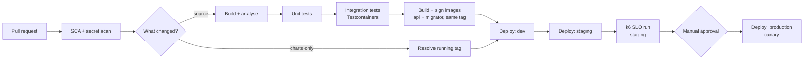

# 15. CI/CD and deployment

## 15.1 Pipeline



**Scanning runs before the fork, not after the build.** It sat downstream of
the image build, which put `deploy/**` — the directory most likely to receive a
pasted credential — on the only path that skipped it. Neither half needs a
build to run: the secret scan reads the diff, and the licence gate reads
`Directory.Packages.props` against [Appendix B](appendix-b-licences.md) as
text — which is the practical argument for central pinning that
[§4.4](04-solution-structure.md) makes on other grounds. Cheapest and least
dependent goes first.

Only services whose files changed are built and deployed. Path filters are what
make a monorepo practical at this size:

```yaml
- name: Detect changed services
  id: changes
  uses: dorny/paths-filter@v4
  with:
    # Without this, negated patterns are silently ignored: the default
    # quantifier ('some') never evaluates the exclusion below.
    predicate-quantifier: 'some-with-excludes'
    filters: |
      # Inputs shared by every service, including the three repo-root files.
      # A version bump in Directory.Packages.props changes every binary the
      # pipeline produces (§4.4) and matches no service path — without these
      # lines, the one change the pin file exists to control is the one change
      # CI never rebuilds or retests.
      shared: &shared
        - 'Directory.Build.props'
        - 'Directory.Packages.props'
        - 'global.json'
        - 'src/BuildingBlocks/**'
        # The contract suite (§12.6) guards compatibility BETWEEN services, so
        # it belongs to all of them. Owned by none, it would run for none.
        - 'tests/Platform.*/**'
      ordering:
        - *shared
        - 'src/Services/Ordering/**'
        - 'tests/Ordering.*/**'
      catalog:
        - *shared
        - 'src/Services/Catalog/**'
        - 'tests/Catalog.*/**'
      # inventory, payments, shipping and notifications repeat those three
      # lines. Every service has an entry — the list is exhaustive by
      # construction, which is the whole point of the check below, so an
      # elision here is a formatting choice and never a missing filter.
      # The gateway is a deployable like any other — its own image (§15.2),
      # its own chart (§15.3), its own Program.cs and route file. Left out of
      # this list, a change to that route file is never rebuilt — and the route
      # file is the one place in the platform where a policy name is resolved
      # at startup rather than at a call site (§10.2), so a bad one is a host
      # that refuses to boot on the first deploy that does build it.
      gateway:
        - *shared
        - 'src/Gateway/**'
      # The BFF is a deployable too, with its own image, chart and the
      # platform's only client secret.
      bff:
        - *shared
        - 'src/BFF/**'
      # A chart or values change produces no new image and must still reach
      # the cluster. See below — this path needs a tag it did not build.
      # deploy/compose/** is excluded: it reaches no cluster, and its own
      # workflow exercises it (see below).
      deploy:
        - 'deploy/**'
        - '!deploy/compose/**'
```

**A filter list is a deployable inventory, and it drifts the way inventories
do.** Every path under `src/` must be matched by **some** filter — the
deployables (`Gateway`, `BFF`, and each directory under `Services/`) by their
own, and `BuildingBlocks` by `shared`, which is the anchor every service
inherits rather than a filter of its own. Everything under `deploy/` except
`deploy/compose/**` is matched by `deploy`: charts are deliberately not
attached to a service, because a chart change deploys without building and
takes the second path through the pipeline — and the Compose tree is
excluded because it reaches no cluster, so a compose-only change must not
roll one.

The check is one line of CI and worth more than the convention it replaces:
assert that every immediate child of `src/`, and every immediate child of
`src/Services/`, appears in at least one filter — and fail on the one that does
not. Both halves are needed, because the two failures look nothing alike. A
missing top-level entry is what left `src/Gateway/**` and `src/BFF/**`
unfiltered, both deployables that CI never rebuilt. A missing entry *under*
`Services/` is quieter still: the parent directory is spoken for by its
siblings' filters, so the inventory looks complete right up until that one
service stops being deployed.

`tests/Ordering.*/**` covers `Ordering.TestSupport` as well as the three test
projects, so a service's test helpers belong to that service and not to
`shared`. A sibling's fixtures are not something Ordering compiles against, and
putting them in `shared` would redeploy every service whenever anyone touched
Catalog's test data builders.

**There is no smoke stage after the dev deploy**, for the reason E2E is absent
from [§12.1](12-test-strategy.md): a gate nobody has defined is a gate that gets configured to pass.
The readiness probes ([§13.5](13-observability.md)) already gate the rollout — a pod that fails
`/health/ready` never takes traffic — so a separate "smoke test" step would
re-assert what Kubernetes has already enforced, or assert something nobody has
written down. The first real gate after dev is the k6 SLO run against staging,
which names its tool, its target and its assertions (§13.7).

One `deploy/**` artefact is exercised by CI directly rather than deployed:
the Compose file. A separate workflow, path-filtered to
`deploy/compose/**` and to itself, runs `docker compose config -q`, then
`up --wait` — which fails if any healthcheck never passes, or a
container exits before the wait completes — then
`down -v` (PR-06 in [Appendix C](appendix-c-delivery-plan.md)). It is not
the smoke stage ruled out above: it deploys nothing and asserts only what
[§14.1](14-local-development.md) already defines, and it is what makes
[§14.2](14-local-development.md)'s "Compose runs in CI" true.

`BuildingBlocks` appears under every service, so a change there rebuilds
everything. That is correct, and it is also the reason to keep those projects
small.

**The filter answers a narrower question than the pipeline asks.** "Which
service's source changed" is not "what must be rebuilt, retested and
redeployed" — the two diverge for every file that is not under
`src/Services/<name>/`, which is precisely the set §4.4 spends a section
arguing for. The rule that keeps them aligned: **if changing a file can change
what a service ships, that file belongs in that service's filter.**

### A config-only deploy needs a tag it did not build

The `deploy` filter fires on a chart or values change, which skips the image
build — and `helm upgrade` then has no tag to pass. Left to the chart default
it would resolve to `image.tag: ""` (§15.3) and roll whatever that means, which
is a version nobody chose in a job nobody thought was a release.

The tag already in the cluster is the only correct answer, so read it back:

```yaml
- name: Resolve the running tag
  if: steps.changes.outputs.deploy == 'true' && steps.changes.outputs.ordering == 'false'
  run: |
    TAG=$(helm get values ordering -n "$NAMESPACE" -o json | jq -r '.image.tag')
    # Fail rather than default. A config deploy that cannot say which image is
    # running is a config deploy that must not proceed.
    [ -n "$TAG" ] && [ "$TAG" != "null" ] || exit 1
    echo "IMAGE_TAG=$TAG" >> "$GITHUB_ENV"
```

The invariant is worth stating because it is easy to lose: **a config-only
deploy must not change the running image.** It goes through the same
`helm upgrade`, the same canary (§15.5) and the same migration hook ([§7.4](07-persistence.md)) — the
hook is a no-op when the migrator image and its migrations are unchanged, which
is exactly why the hook has to be idempotent rather than merely correct once.

## 15.2 Container images

```dockerfile
# syntax=docker/dockerfile:1

# The tag names the exact patch global.json pins (§4.4), so a bump there is a
# bump here, in the same change.
FROM mcr.microsoft.com/dotnet/sdk:10.0.302-noble AS build
ARG BUILD_CONFIGURATION=Release
WORKDIR /src

# Project files first, so the restore layer really does survive source-only
# changes — a COPY of the whole trees before restore re-keys its layer on
# every .cs edit and the cache claim becomes fiction. global.json first among
# equals: with it copied in, a tag that has drifted off the pin is a restore
# error here rather than a silently different set of analysers in the one
# build whose output ships.
#
# **Every project in the transitive closure gets a line, and a missing one
# fails four steps later rather than here.** dotnet restore writes each
# project's own obj/project.assets.json; a csproj absent when it runs is
# simply not restored, and the --no-restore publish below then fails with
# NETSDK1004 naming a project this file never mentions. So a new
# ProjectReference anywhere in the chain is a line here too, and no CI job
# says so — the compose smoke that builds these images is path-filtered on
# deploy/compose/**, and a reference lands under src/.
COPY global.json Directory.Build.props Directory.Packages.props ./
COPY src/BuildingBlocks/Common.Domain/Common.Domain.csproj src/BuildingBlocks/Common.Domain/
COPY src/BuildingBlocks/Common.Application/Common.Application.csproj src/BuildingBlocks/Common.Application/
COPY src/BuildingBlocks/Common.Contracts/Common.Contracts.csproj src/BuildingBlocks/Common.Contracts/
COPY src/BuildingBlocks/Common.Infrastructure/Common.Infrastructure.csproj src/BuildingBlocks/Common.Infrastructure/
COPY src/BuildingBlocks/Common.Web/Common.Web.csproj src/BuildingBlocks/Common.Web/
COPY src/Services/Ordering/Ordering.Domain/Ordering.Domain.csproj src/Services/Ordering/Ordering.Domain/
COPY src/Services/Ordering/Ordering.Application/Ordering.Application.csproj src/Services/Ordering/Ordering.Application/
COPY src/Services/Ordering/Ordering.Infrastructure/Ordering.Infrastructure.csproj src/Services/Ordering/Ordering.Infrastructure/
COPY src/Services/Ordering/Ordering.Api/Ordering.Api.csproj src/Services/Ordering/Ordering.Api/
RUN dotnet restore src/Services/Ordering/Ordering.Api/Ordering.Api.csproj

# .editorconfig rides with the source, not the restore inputs: it is a build
# input under ADR-019 (EnforceCodeStyleInBuild reads it), and without it this
# publish would enforce a weaker style policy than every other build.
COPY .editorconfig ./
COPY src/BuildingBlocks/ src/BuildingBlocks/
COPY src/Services/Ordering/ src/Services/Ordering/
RUN dotnet publish src/Services/Ordering/Ordering.Api/Ordering.Api.csproj \
    -c $BUILD_CONFIGURATION -o /app/publish --no-restore /p:UseAppHost=false

FROM mcr.microsoft.com/dotnet/aspnet:10.0-noble-chiseled-extra AS final
WORKDIR /app
COPY --from=build /app/publish .

# Chiselled images ship no shell and run as a non-root user by default.
USER $APP_UID
EXPOSE 8080
ENTRYPOINT ["dotnet", "Ordering.Api.dll"]
```

Chiselled base images contain no package manager and no shell, which removes
most of the CVE surface that routine scans would otherwise report. The trade-off
is that `kubectl exec` into a running container gives you nothing — debugging
uses ephemeral debug containers instead.

The tag is `-extra`, and the suffix is load-bearing: the plain chiselled image
runs in globalization-invariant mode, and `Microsoft.Data.SqlClient` refuses to
open a connection under it — `Globalization Invariant Mode is not supported`,
at the first query rather than at build. Every service here talks to SQL
Server, so every image takes the variant. What `-extra` adds is ICU and
tzdata, nothing else; the shell and the package manager stay gone.

**Two of the fourteen open no connection at all** — the gateway ([§10.1](10-api-gateway.md)) and the
BFF, whose one synchronous hop is gRPC rather than SQL ([§9.7](09-messaging.md)) — so the sentence
above is the reason for twelve images and not for those two. Twelve because
each of the six services builds **two**, a host and a migrator (§4.1), and both
talk to SQL Server. The other two take the variant for uniformity: one base
across the platform means what a host does with a culture-sensitive comparison
never depends on which suffix somebody picked for its image, and the saving
from dropping ICU on two deployables does not pay for a second answer to that
question.

### Every service builds two images

The migration job (§7.4) is a Helm `pre-upgrade` hook, so its image must exist
**before** the deploy that uses it. A pipeline that builds only the API image
fails at the first step of every release, pulling a tag CI never pushed.

```dockerfile
# src/Services/Ordering/Ordering.Migrator/Dockerfile

# Pinned to the patch global.json names (§4.4), same as the API image.
FROM mcr.microsoft.com/dotnet/sdk:10.0.302-noble AS build
WORKDIR /src
# Project files first, same as the API image and for the same reason: restore
# in a layer that survives source-only changes, which is most changes. No
# Common.Web — the migrator's reference chain stops at Infrastructure. Every
# other project in that chain takes a line, for the reason the API image
# states above.
COPY global.json Directory.Build.props Directory.Packages.props ./
COPY src/BuildingBlocks/Common.Domain/Common.Domain.csproj src/BuildingBlocks/Common.Domain/
COPY src/BuildingBlocks/Common.Application/Common.Application.csproj src/BuildingBlocks/Common.Application/
COPY src/BuildingBlocks/Common.Contracts/Common.Contracts.csproj src/BuildingBlocks/Common.Contracts/
COPY src/BuildingBlocks/Common.Infrastructure/Common.Infrastructure.csproj src/BuildingBlocks/Common.Infrastructure/
COPY src/Services/Ordering/Ordering.Domain/Ordering.Domain.csproj src/Services/Ordering/Ordering.Domain/
COPY src/Services/Ordering/Ordering.Application/Ordering.Application.csproj src/Services/Ordering/Ordering.Application/
COPY src/Services/Ordering/Ordering.Infrastructure/Ordering.Infrastructure.csproj src/Services/Ordering/Ordering.Infrastructure/
COPY src/Services/Ordering/Ordering.Migrator/Ordering.Migrator.csproj src/Services/Ordering/Ordering.Migrator/
RUN dotnet restore src/Services/Ordering/Ordering.Migrator/Ordering.Migrator.csproj

# .editorconfig is a build input under ADR-019 — without it this publish
# enforces a weaker style policy than every other build.
COPY .editorconfig ./
COPY src/BuildingBlocks/ src/BuildingBlocks/
COPY src/Services/Ordering/ src/Services/Ordering/
RUN dotnet publish src/Services/Ordering/Ordering.Migrator/Ordering.Migrator.csproj \
    -c Release -o /app/publish --no-restore /p:UseAppHost=false

# Runtime, not aspnet — the migrator has no listener. -extra for the same
# reason as the API image: SqlClient needs ICU.
FROM mcr.microsoft.com/dotnet/runtime:10.0-noble-chiseled-extra AS final
WORKDIR /app
COPY --from=build /app/publish .
USER $APP_UID
ENTRYPOINT ["dotnet", "Ordering.Migrator.dll"]
```

```yaml
# Both images build from the same commit and share the tag Helm resolves.
- name: Build and push
  run: |
    for target in api migrator; do
      docker buildx build \
        --file "src/Services/Ordering/Ordering.${target^}/Dockerfile" \
        --tag "${REGISTRY}/ordering-${target}:${GIT_SHA}" \
        --push .
    done
```

Both images carry the **same tag**, which is what lets `values.yaml` hold one
`image.tag` and the Helm hook interpolate it into the migrator reference
(§7.4). A migrator built from a different commit than the API it precedes is
the exact failure the pre-upgrade hook exists to prevent.

## 15.3 Deployment

Each service gets a Helm chart; an umbrella chart deploys the platform.

```yaml
# deploy/helm/ordering/values.yaml
replicaCount: 3

image:
  # Registry namespace only. Each workload appends its own name, so the chart
  # can reference both the API and the migrator (§7.4) from one tag.
  registry: registry.example.com/commerce
  api: ordering-api
  migrator: ordering-migrator
  # Supplied by CI, never "latest"; both images share it. Deliberately empty
  # rather than a default: a deploy that cannot name its tag must fail, not
  # roll something. A config-only deploy reads the running value back
  # (§15.1) instead of falling through to this.
  tag: ""
  pullPolicy: IfNotPresent

resources:
  requests: { cpu: 100m, memory: 256Mi }
  limits:   { memory: 512Mi }          # No CPU limit — see note below.

autoscaling:
  enabled: true
  minReplicas: 3
  maxReplicas: 20
  targetCPUUtilizationPercentage: 70

podDisruptionBudget:
  enabled: true
  minAvailable: 2

probes:
  liveness:  { path: /health/live,  initialDelaySeconds: 10, periodSeconds: 10 }
  readiness: { path: /health/ready, initialDelaySeconds: 5,  periodSeconds: 5 }
  startup:   { path: /health/startup, failureThreshold: 30,  periodSeconds: 2 }

identity:
  # The authority, to validate incoming JWTs (§11.2) — and nothing else.
  # Identity:Client is what a host presents when it CALLS a peer (§11.5), and
  # Ordering calls none: prices come from a local projection (§6.4) and the
  # rest goes over the broker. No clientId here means no Keycloak client, no
  # secret in the vault and nothing to rotate.
  authority: https://id.example.com/realms/commerce
```

**Shipping and Notifications get the same chart minus the Service and the
Ingress.** They consume from the broker and expose no API, so their only
listener is the health endpoint §13.5 requires — which is a reason to keep
Kestrel bound and no reason at all to route to it. The probes address the pod
directly, because kubelet reaches a container port without a Service in front
of it, and telemetry is pushed to the collector rather than scraped (§13.2), so
nothing else needs a stable name for these pods either:

```yaml
# deploy/helm/shipping/values.yaml — the two keys that are the whole difference
service:
  enabled: false
ingress:
  enabled: false
```

Both are `false` rather than absent, so the diff against Ordering's chart shows
the decision instead of hiding it in what was deleted.

> The failure to design against is not an attacker finding a worker's `/health`.
> It is a well-meaning `helm` values copy that keeps `ingress.enabled: true`
> because it came from Ordering's chart, and publishes a host with no
> authentication middleware in front of it — because a service with no public
> API never needed any. **A worker's safety comes from having no route, so the
> absence of a route is the thing to assert** — which is why it is written down
> as `false` above rather than left out. A key that is missing looks the same
> whether it was considered or forgotten.

Exactly one chart in the platform carries client credentials, and the asymmetry
is the design rather than an oversight:

```yaml
# deploy/helm/web-bff/values.yaml — the only chart with an Identity:Client
identity:
  authority: https://id.example.com/realms/commerce
  # Required by ValidateOnStart (§15.4): this host does call a peer (§9.7).
  # The secret is a reference, never a value.
  clientId: web-bff
  scope: commerce-api
  clientSecretRef:
    name: web-bff-identity
    key: client-secret
```

> **A second chart growing an `identity.clientId` is a design change, not a
> configuration change.** It means a host started calling a peer synchronously,
> which is ADR-017's budget being spent — so the review question is not "does
> the secret exist" but "why is this call not an event".

The gateway's chart is not a service chart with the database parts deleted. It
has no migrator, no client credentials, and two keys no service has — and every
one of those differences is something it will not start without, or will start
wrongly without:

```yaml
# deploy/helm/gateway/values.yaml
replicaCount: 3

image:
  registry: registry.example.com/commerce
  api: gateway
  tag: ""
  # No migrator key: the gateway owns no database (§10.1), so the umbrella
  # chart's pre-upgrade hook (§7.4) has nothing to run for it.

resources:
  requests: { cpu: 200m, memory: 128Mi }
  limits:   { memory: 256Mi }

autoscaling:
  enabled: true
  minReplicas: 3
  maxReplicas: 30          # every external request passes through here
  targetCPUUtilizationPercentage: 70

podDisruptionBudget:
  enabled: true
  minAvailable: 2

probes:
  # The same three §13.5 defines, and the gateway needs them stated as much as
  # any service: MapCommonHealthEndpoints exposes the endpoints, and a chart
  # that never references them means nothing asks. Readiness is honest here
  # even though the set is empty (§4.2) — "the process is up" is exactly the
  # question, because the gateway owns no dependency to be un-ready for.
  liveness:  { path: /health/live,  initialDelaySeconds: 10, periodSeconds: 10 }
  readiness: { path: /health/ready, initialDelaySeconds: 5,  periodSeconds: 5 }
  startup:   { path: /health/startup, failureThreshold: 30,  periodSeconds: 2 }

identity:
  # Authority only. The gateway validates JWTs (§11.2) but calls nobody —
  # YARP forwards the caller's token — so there is no clientSecretRef here
  # and no gateway entry in External Secrets (§11.5, §15.4).
  authority: https://id.example.com/realms/commerce

ingress:
  # True in every Kubernetes environment: TLS terminates at the load balancer
  # or Ingress (§10.1), so RemoteIpAddress is the ingress on every request
  # until UseForwardedHeaders runs.
  enabled: true
  # Mandatory once enabled — GetRequiredSection, so a missing value is a
  # refusal to boot rather than a rate limiter that meters the ingress
  # controller as its only client. These are the ingress controller's pod
  # CIDRs, not the cluster's: anything trusted here can set X-Forwarded-For.
  trustedNetworks:
    - 10.42.0.0/16

cors:
  # Off. Browsers reach the platform through the CDN on the same origin
  # (§10.2), so no preflight ever arrives. Off is a complete configuration;
  # on without origins is not (§15.4).
  enabled: false
  # origins: [ "https://shop.example.com" ]  # becomes mandatory the moment
  # enabled flips to true — GetRequiredSection, so the chart fails the pod
  # rather than serving a policy that rejects every browser.
```

`ingress.enabled: true` in Kubernetes and `Ingress__Enabled: "false"` in Compose
([§14.1](14-local-development.md)) are not an inconsistency to reconcile — they are the same setting
correctly describing two different topologies, which is why it is a value and
not a constant.

Setting a **memory limit but no CPU limit** is deliberate. Memory is
incompressible — a leak must be bounded or it takes down the node. CPU is
compressible, and a CPU limit causes throttling that manifests as unexplained
p99 latency spikes well before the pod is actually short of capacity. Requests
still guarantee the scheduler reserves what the service needs.

`terminationGracePeriodSeconds` must exceed the longest in-flight operation, and
the application must handle `SIGTERM` by draining: stop accepting new work,
finish what is in progress, then exit. ASP.NET Core does this for HTTP requests
automatically; message consumers need `StopAsync` to be given time to finish the
current message.

## 15.4 Configuration and secrets

Every key a service requires, and where each comes from. **This table is the
inventory `ValidateOnStart` enforces** — a `[Required]` option missing from it
is a service that will not boot.

**Conditionally required is a real category, and it is not the same as
optional.** `Cors__Origins` is not needed when `Cors__Enabled` is false and is
mandatory when it is true — enabling a feature without configuring it is a
silent defect, while leaving it off is a valid topology. Writing such a key as
"optional with a fallback" collapses those two states into one, which is how
`WithOrigins([])` came to reject every browser request while starting cleanly.

**Required-for-some-hosts is a third category, and the mistake it invites runs
the other way.** `Identity__Client__*` is mandatory for a host that calls
another service and meaningless for one that does not — which in this blueprint
is **every host except the BFF**. The gateway forwards the caller's token rather
than minting its own; Ordering and Catalog talk over the broker and read local
projections ([§6.4](06-cqrs.md), ADR-002). One set of credentials in the whole platform is
what "async by default" looks like in the secrets inventory. Supplying the rest "for consistency" is not
harmless padding — it provisions a Keycloak client, a secret in the vault and a
mount, all of which must be rotated and audited, for credentials no code path
ever sends. Over-supply has no failing test to catch it, which is why it
survives longer than under-supply does.

The rule for the Kind column is mechanical: **if the value contains a
credential, it is a Secret.** Every connection string here does — SQL Server
carries a login, RabbitMQ a user, and Redis the per-service ACL user from [§8.1](08-caching-redis.md).
A connection string in a ConfigMap is a password readable by anyone with
namespace read access and unencrypted at rest.

| Key | Kind | Source | Required |
|---|---|---|---|
| `ConnectionStrings__Ordering` | Secret | External Secrets → runtime identity (§7.1) | ✓ |
| `ConnectionStrings__OrderingMigrator` | Secret | External Secrets → migrator Job only | ✓ (Job) |
| `ConnectionStrings__RedisCache` | **Secret** | External Secrets — carries the §8.1 ACL user and password | ✓ |
| `ConnectionStrings__RedisCoordination` | **Secret** | External Secrets — separate ACL user, `noeviction` instance | ✓ |
| `ConnectionStrings__RabbitMq` | Secret | External Secrets | ✓ |
| `Identity__Authority` | Config | Helm `identity.authority` → ConfigMap | ✓ — **every host**, including the gateway |
| `Identity__Client__ClientId` | Config | Helm `identity.clientId` | ✓ **BFF only** — the one host that calls a peer ([§9.7](09-messaging.md), [§11.5](11-identity-authorization.md)) |
| `Identity__Client__Scope` | Config | Helm `identity.scope` | ✓ **BFF only** |
| `Identity__Client__ClientSecret` | Secret | `web-bff-identity` secret | ✓ **BFF only** |
| `Cors__Enabled` | Config | Helm `cors.enabled` → ConfigMap — **gateway only** | ✓ |
| `Cors__Origins__0…n` | Config | Helm `cors.origins` → ConfigMap — **gateway only** | ✓ **when `Cors__Enabled`** |
| `Ingress__Enabled` | Config | Helm `ingress.enabled` → ConfigMap — **gateway only** | ✓ — true in Kubernetes, false only where the gateway is the edge (Compose) |
| `Ingress__TrustedNetworks__0…n` | Config | Helm `ingress.trustedNetworks` → ConfigMap — **gateway only** | ✓ **when `Ingress__Enabled`**; CIDRs of the LB/Ingress, without which the rate limiter partitions everyone together |
| `OTEL_EXPORTER_OTLP_ENDPOINT` | Config | ConfigMap | — defaults |

| Kind | Source | Example |
|---|---|---|
| Non-secret config | ConfigMap → environment variables | Log level, feature flags, timeouts |
| Secrets | External Secrets Operator → Kubernetes Secret | Connection strings, client secrets |
| Per-environment | Helm values file | Replica counts, resource sizing |

Environment variables use the .NET double-underscore convention, so
`ConnectionStrings__Ordering` binds to `ConnectionStrings:Ordering`. Validate
configuration at startup and fail fast — a service that starts with a missing
setting and fails on the first request is much harder to diagnose than one that
refuses to start.

**Every options type gets this — no exceptions, and it goes in the registration
helper that owns the consumer.** `IOptions<T>` always resolves: unbound, it
hands back a default-constructed instance. So a forgotten binding is invisible
to `ValidateOnBuild` (§4.2), the service starts clean, and the failure surfaces
as behaviour rather than as an error:

```csharp
// Web.Bff/Program.cs (§9.7) — the same place that registers CachingTokenClient
// and ClientCredentialsHandler, and the only host that registers any of the
// three. Unbound, the BFF requests a token with an empty scope and gets 401s
// it will read as Catalog's fault.
services
    .AddOptions<ServiceIdentityOptions>()
    .BindConfiguration("Identity:Client")
    .ValidateDataAnnotations()
    .ValidateOnStart();
```

**This is the only options type in the solution, and that is the point.** The
tempting next line is a `ServiceOptions`-shaped bag — batch sizes, poll
intervals, retry caps — bound to an `Ordering` section that no environment ever
sets. It costs nothing to write and it is not free: `ValidateOnStart` now gates
boot on a section nobody supplies, `[Required]` on any member stops every host,
and `[Required]` on none makes `ValidateDataAnnotations` decorative. There is no
third outcome, because a key that never varies has nothing to validate.

> **An options type needs at least one member that differs between
> environments.** If every value in it would be the same in Compose, in the test
> fixture and in production, it is not configuration — it is a constant that has
> been given a deployment obligation and four places to be forgotten. `MaxAttempts`
> (§9.4), the dispatcher's tick, the saga's four delays (§9.6) and
> `ServiceOptions.OperationTimeout` are all constants for exactly this reason.
> `Identity:Client` earns its options type by holding a secret that must differ
> per environment, and it is the only thing here that does.

Which helper matters as much as the call itself. Binding beside the consumer is
what makes "the gateway needs no client credentials" true *by construction*
rather than by remembering — the gateway calls neither helper, so it neither
binds `Identity:Client` nor demands it. A binding hoisted into `Common.Web` for
tidiness would re-impose the requirement on every host and put us back where
§15.3 started.

`[Required]` is what makes `ValidateDataAnnotations` do anything — a bound
options class with no annotations validates successfully while empty:

```csharp
public sealed class ServiceIdentityOptions
{
    [Required] public string ClientId { get; init; } = "";
    [Required] public string ClientSecret { get; init; } = "";
    [Required] public string Scope { get; init; } = "";
}
```

> **A required setting is a deployment obligation.** `ValidateOnStart` turns a
> missing value into a refusal to boot, which is the right trade — but only if
> every environment supplies it. Adding a `[Required]` field means editing
> **four** places in the same change: Compose (§14.1), the Aspire host (§14.2),
> the Helm values (§15.3) and the secrets inventory (below). A gate with nothing
> behind it does not harden the service; it stops it.
>
> **The integration-test fixture (§12.4) is the fifth, and it fails first.**
> `WebApplicationFactory` builds the real host, so `ValidateOnStart` runs there
> too — a missing key throws `OptionsValidationException` out of
> `InitializeAsync` and takes down the whole suite before one assertion runs.
> It is also the one environment where the correct value is a *fake*: the
> fixture must supply something that satisfies `[Required]` and is unmistakably
> not a credential, because a test that passes with a real secret in it is a
> test that will one day be run against something real.
>
> This is also the argument for *not* making things configuration. The service
> name is not in `ServiceIdentityOptions` or anywhere else — it comes from
> `IHostEnvironment.ApplicationName`, which is always populated, needs no
> binding, cannot drift from the name §13.2 puts on traces, and therefore
> cannot fail to start.

The service-wide constants that are genuinely not configuration stay static:

```csharp
public static class ServiceOptions
{
    // The ceiling §9.7's timeout hierarchy asserts against. Not bound, not
    // validated, not deployable — it is a compile-time invariant.
    public static readonly TimeSpan OperationTimeout = TimeSpan.FromSeconds(30);
}
```

## 15.5 Release strategy

Canary: route 5% of traffic to the new version, watch error rate and p99 for ten
minutes, then progress to 25%, 50%, 100%. Roll back automatically if either
metric regresses beyond threshold.

Because database migrations run ahead of the deploy and old code may still be
serving traffic, **every migration must be backward compatible with the previous
release** (section 7.4). A canary rollback with an incompatible schema change is
unrecoverable without downtime, which defeats the point of the canary.

Feature flags decouple deployment from release. Deploy the code dark, enable it
for internal users, then progressively for customers. This also gives you a
kill switch that does not require a rollback.

---

[← §14 Local development](14-local-development.md) · [Index](README.md) · [Appendix A →](appendix-a-adrs.md)
