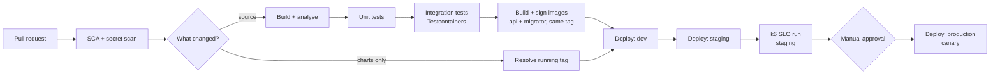

# 15. CI/CD and deployment

## 15.1 Pipeline



**Scanning runs before the fork, not after the build.** It sat downstream of
the image build, which put `deploy/**` — the directory most likely to receive a
pasted credential — on the only path that skipped it. Neither half needs a
build to run: the secret scan reads the working tree, and the licence gate
reads `Directory.Packages.props` and every `.csproj`, `.props` and `.targets`
against [Appendix B](appendix-b-licences.md) as text. Cheapest and least
dependent goes first.

**That reach is also why this seat is not an argument for central pinning**,
which is what this paragraph used to claim. The project files joined the
gate's subject precisely because central pinning is a convention a project can
opt out of ([§4.4](04-solution-structure.md), #50) — so citing the read as
evidence for the convention inverts it. The gate is early because everything
it reads is text, and it would still be early if central pinning were
abandoned tomorrow.

**The scan reads the tree and not the diff**, and the difference is one this
node's own position argues for. A diff scan is cheaper and answers a narrower
question — *did this change add a credential* — where the tree answers *does
this branch carry one*, which is the question a merge is about. A credential
added on one branch and merged on another is invisible to every diff scan
downstream of it and visible to this one on the next pull request that touches
anything.

> **The diagram is the target pipeline, and this repository runs the left half
> of it.** Everything up to and including the image build is live: the fork,
> the build, the three test stages and one `docker build` per changed service
> — two, where the service has a migrator (§15.2) — since PR-25, and both
> halves of the first node since #61 closed the secret scan. **That sentence
> named the scan among the live stages while no scanner existed** (#119): the
> word was doing the work of *the licence gate*, in the one callout written
> specifically to stop a reader inferring capability from a green pipeline.
> It is true now, which is a worse reason to leave it unexamined than a
> better one.
> **Signing is not** — it needs a registry and a key this
> repository has neither of, so what runs is the half that can run rather than
> a step that would have to be faked. Nor is any `Deploy:` node: there is no
> dev, staging or production environment, which is why §15.5's canary is
> `workflow_dispatch` only and why the k6 SLO run has a target that does not
> exist yet. Naming the split here is cheaper than letting a reader infer from
> a green pipeline that a deploy happened.

Only services whose files changed are built and deployed. Path filters are what
make a monorepo practical at this size:

```yaml
- name: Detect changed services
  id: changes
  uses: dorny/paths-filter@v4
  with:
    # Without this, negated patterns are silently ignored: the default
    # quantifier ('some') never evaluates the exclusion below.
    predicate-quantifier: 'some-with-excludes'
    filters: |
      # Inputs shared by every service, including the three repo-root files.
      # A version bump in Directory.Packages.props changes every binary the
      # pipeline produces (§4.4) and matches no service path — without these
      # lines, the one change the pin file exists to control is the one change
      # CI never rebuilds or retests.
      shared: &shared
        - 'Directory.Build.props'
        - 'Directory.Packages.props'
        - 'global.json'
        # An input to every `docker build .` and to nothing the solution build
        # can check: excluding a copied project here is a broken image, and
        # un-excluding a local secret is one with credentials in it. Neither is
        # visible to `dotnet build`.
        - '.dockerignore'
        # Copied into the publish stage by every application Dockerfile, and
        # ADR-019 makes it a build input rather than an editor hint.
        - '.editorconfig'
        - 'src/BuildingBlocks/**'
        # The contract suite (§12.6) guards compatibility BETWEEN services, so
        # it belongs to all of them. Owned by none, it would run for none.
        - 'tests/Platform.*/**'
      ordering:
        - *shared
        - 'src/Services/Ordering/**'
        - 'tests/Ordering.*/**'
      catalog:
        - *shared
        - 'src/Services/Catalog/**'
        - 'tests/Catalog.*/**'
      # inventory, payments, shipping and notifications repeat those three
      # lines. Every service has an entry — the list is exhaustive by
      # construction, which is the whole point of the check below, so an
      # elision here is a formatting choice and never a missing filter.
      # The gateway is a deployable like any other — its own image (§15.2),
      # its own chart (§15.3), its own Program.cs and route file. Left out of
      # this list, a change to that route file is never rebuilt — and the route
      # file is the one place in the platform where a policy name is resolved
      # at startup rather than at a call site (§10.2), so a bad one is a host
      # that refuses to boot on the first deploy that does build it.
      gateway:
        - *shared
        - 'src/Gateway/**'
      # The BFF is a deployable too, with its own image, chart and the
      # platform's only client secret.
      #
      # AND CATALOG'S PROTO — the one entry here that reaches into another
      # service's tree. Web.Bff compiles `pricing.proto` as a LINKED source
      # file (§9.7) and its Dockerfile copies that path, so a proto-only
      # change alters what the BFF ships while matching only `catalog`. That
      # is the rule below applied to the one host that compiles another
      # service's file, and it is easy to omit precisely because the filter
      # otherwise reads as "this service's own tree".
      bff:
        - *shared
        - 'src/BFF/**'
        - 'src/Services/Catalog/Catalog.Api/Protos/**'
      # A chart or values change produces no new image and must still reach
      # the cluster. See below — this path needs a tag it did not build.
      #
      # deploy/compose/** is excluded because it reaches NO cluster, and that
      # is the whole of the reason. It used to read "and its own workflow
      # exercises it", which stopped discriminating the moment PR-23 gave
      # deploy/helm/** a workflow of its own and did NOT exclude it: a chart
      # change has to roll, so it belongs here as well as there. Having a
      # dedicated workflow was never the test.
      deploy:
        - 'deploy/**'
        - '!deploy/compose/**'
```

**A filter list is a deployable inventory, and it drifts the way inventories
do.** Every path under `src/` must be matched by **some** filter — the
deployables (`Gateway`, `BFF`, and each directory under `Services/`) by their
own, and `BuildingBlocks` by `shared`, which is the anchor every service
inherits rather than a filter of its own. Everything under `deploy/` except
`deploy/compose/**` is matched by `deploy` — `deploy/helm/**` included, whose
own workflow renders the charts but deploys nothing. Charts are deliberately
not attached to a service, because a chart change deploys without building and
takes the second path through the pipeline — and the Compose tree is
excluded because it reaches no cluster, so a compose-only change must not
roll one.

The check is one line of CI and worth more than the convention it replaces:
assert that every immediate child of `src/`, and every immediate child of
`src/Services/`, appears in at least one filter — and fail on the one that does
not. Both halves are needed, because the two failures look nothing alike. A
missing top-level entry is what left `src/Gateway/**` and `src/BFF/**`
unfiltered, both deployables that CI never rebuilt. A missing entry *under*
`Services/` is quieter still: the parent directory is spoken for by its
siblings' filters, so the inventory looks complete right up until that one
service stops being deployed.

`tests/Ordering.*/**` covers `Ordering.TestSupport` as well as the three test
projects, so a service's test helpers belong to that service and not to
`shared`. A sibling's fixtures are not something Ordering compiles against, and
putting them in `shared` would redeploy every service whenever anyone touched
Catalog's test data builders.

**There is no smoke stage after the dev deploy**, for the reason E2E is absent
from [§12.1](12-test-strategy.md): a gate nobody has defined is a gate that gets configured to pass.
The readiness probes ([§13.5](13-observability.md)) already gate the rollout — a pod that fails
`/health/ready` never takes traffic — so a separate "smoke test" step would
re-assert what Kubernetes has already enforced, or assert something nobody has
written down. **That argument leant on a probe that could not fail, and no
longer does**: an empty predicate set is a passing predicate set, so a host
whose readiness checks were never wired up — or that lost them in a refactor —
answered `/health/ready` with 200 while it could reach nothing, and this
paragraph is what spent the reassurance. `MapCommonHealthEndpoints` now refuses
to start such a host unless it declares that it owns no *readiness*
dependency (§13.5),
which is what makes the probe a gate rather than a formality. The first real
gate after dev is the k6 SLO run against staging, which names its tool, its
target and its assertions (§13.7): it is
`deploy/observability/slo/slo.js` since PR-24, and it fails on an **absent**
series as well as on a breached one — a target with no data is the same silence
§13.6 spends a callout on, and reading it as "nothing wrong" would turn this
stage into the gate configured to pass that the paragraph above rules out.

**Four** `deploy/**` artefacts are exercised by CI directly rather than
deployed, one per subtree, each in its own path-filtered workflow. **None is the
smoke stage ruled out above**: all four deploy nothing and assert only what a
chapter already defines.

> **A count in prose is a claim to reconcile, and this one has now been wrong
> once.** It read *three* until PR-25 added a fourth subtree, which is the
> failure `deploy/helm/smoke.sh` spent three findings learning about its own
> inventory. It stays a number rather than becoming a list because the
> paragraphs below are the list — each names one subtree and what its gate
> asserts — so a fifth subtree that reached this section without a paragraph
> would be visible here in a way a missing row in a table is not.

The first is the Compose file. A workflow path-filtered to
`deploy/compose/**` and to itself runs `docker compose config -q`, then
`up --wait` — which fails if any healthcheck never passes, or a
container exits before the wait completes — then
`down -v` (PR-06 in [Appendix C](appendix-c-delivery-plan.md)). It is what
makes [§14.2](14-local-development.md)'s "Compose runs in CI" true.

The second is the Helm tree (PR-23). A workflow path-filtered to
`deploy/helm/**` runs `deploy/helm/smoke.sh`, which resolves the charts'
`file://` dependencies, lints each one, and then renders all five and asserts
what comes out: three probes per workload, a memory limit and no CPU limit, the
hook annotations of [§7.4](07-persistence.md), the ConfigMap/Secret split of
§15.4, and one client secret in the whole platform (§11.5). Rendering only — no
cluster is reached, so schema validation against a live API server stays a
deploy-time gate and is named in the script as not covered.

The third is the observability tree (PR-24). A workflow path-filtered to
`deploy/observability/**` runs `deploy/observability/check.py`, which pairs
[§13.9](13-observability.md)'s runbooks with §13.6's alerts in **both**
directions, asserts that every metric a loaded rule or a dashboard panel reads
is one this platform actually publishes, asserts that every metric in the
*awaiting-signal* file is published by nothing — the check that makes that file
self-clearing — and asserts that every service hosting §9.4's dispatcher either
publishes the outbox gauges or carries a stated exemption, which is the one
gap the metric-name checks structurally cannot see. Stdlib Python over text, so
it needs no restore and runs on the licence gate's terms. It reaches no Prometheus and no Grafana, and it does not
validate rule syntax: `promtool` would be the tool for that, and adding it is a
decision no chapter has taken.

The fourth is the canary (PR-25). A workflow path-filtered to
`deploy/canary/**` runs that tree's own suite and `canary.py check`, which
asserts §15.5's ladder climbs and ends at 100, that the rollout's absolute
thresholds are [§13.6](13-observability.md)'s alert thresholds **read out of
the rules file rather than restated**, that each workload's `serviceName` is an
entry assembly this solution actually builds — §13.2 takes `service.name` from
`ApplicationName`, so a query spelled from the deployment's vocabulary matches
no series — and that every metric its queries read is one a loaded alert reads,
which is what the observability gate has already proved is published. It
reaches no cluster and no Prometheus, and the weight arithmetic and the
promote/rollback decision have a suite because they are the parts a workflow
cannot be trusted with.

**Three of the four filters name files outside their own tree**, and none is an
oversight — each names an input its gate actually reads. Compose is the one
that stays inside, because its smoke starts the file and nothing else. The Helm
one is below; the observability one names `src/**`, because deciding whether an
alert's signal exists means reading every instrument declaration in C#, and
`docs/runbooks/**`, because a renamed runbook is an alert with no procedure
behind it; the canary one names `deploy/helm/**`, because its plan asserts each
workload's chart exists and can render a canary track, `src/**`, because it
checks each `serviceName` against a real entry assembly, and
`deploy/observability/**`, because it takes §13.6's thresholds out of the rules
file rather than restating them. **None of the three keeps that list in its own
YAML.** `smoke.sh`, `check.py` and `canary.py` each declare `SOURCE_INPUTS`
beside the reads, and each asserts that both of its workflow's triggers cover
every entry — a copy of a list drifts exactly as a copy of a number does, which
the Helm tree established at a cost of three findings and the observability
tree adopted before paying it once.

> **The canary tree paid for it anyway, and the shape of the failure is worth
> more than the fix.** Its list shipped naming `src` and `deploy/helm` and
> omitting `deploy/observability`, which two of its own checks open — so
> retuning an alert threshold was a green pull request on the gate that exists
> to keep the canary from being tuned looser than the alert it would then page
> about. **The assertion stayed green throughout**, because a list can only be
> compared against a workflow for the entries it already contains: a gate
> cannot see a read it was never told about. What closes it is a test whose
> subject is the reads rather than the list — the same shape as asserting a
> parser found anything at all.

Each of the Helm filter's outside paths is an input `smoke.sh` actually reads:

- §10.2's route file and `PricingHop.cs`, which hold their destination hosts as
  literals on the stated grounds that "the host is the Kubernetes Service
  name" — so renaming a destination without them is a green pull request that
  breaks the next deploy;
- Catalog's `appsettings.json`, which declares the Kestrel endpoints those
  Services forward to, so moving the h2c listener off 8081 would otherwise
  leave a Service pointing at a closed port with every assertion still passing;
- `Common.Web`'s `HealthCheckExtensions.cs`, which maps the three probe
  paths — the charts are the manifest [§12.4](12-test-strategy.md)'s health
  suite warns about by name, "a manifest no compiler reads", so the gate reads
  the routes from that file rather than holding a fourth copy of them;
- `.gitattributes`, which pins this tree to LF — without it a CRLF template
  renders a CR onto every line and the script's anchored greps match nothing on
  a Linux runner;
- `deploy/canary/canary.json`, which names a chart per workload — so a rollout
  can only target a chart that exists and renders a canary track, and the two
  halves of that agreement fail from either side rather than at deploy time.

**This passage is an argument, not an inventory, and the difference is what
finally stopped it drifting.** It said "two files", and was made wrong by the
change that added a third; then it omitted the fourth; then the fifth. A copy
of a list drifts exactly as a copy of a number does. The list now lives once —
`SOURCE_INPUTS` in `smoke.sh`, beside the reads it describes — and the gate
asserts that **both** of the workflow's triggers cover every entry, because a
merged change that skips the gate on `main` is the same defect one branch
later. What belongs here is why each kind of input matters, which is what the
bullets above give.

`BuildingBlocks` appears under every service, so a change there rebuilds
everything. That is correct, and it is also the reason to keep those projects
small.

**The filter answers a narrower question than the pipeline asks.** "Which
service's source changed" is not "what must be rebuilt, retested and
redeployed" — the two diverge for every file that is not under
`src/Services/<name>/`, which is precisely the set §4.4 spends a section
arguing for. The rule that keeps them aligned: **if changing a file can change
what a service ships, that file belongs in that service's filter.**

### A config-only deploy needs a tag it did not build

The `deploy` filter fires on a chart or values change, which skips the image
build — and `helm upgrade` then has no tag to pass. Left to the chart default
it would resolve to `image.tag: ""` (§15.3) and roll whatever that means, which
is a version nobody chose in a job nobody thought was a release.

**The release is named for the workload, not for the service**, and the two
had drifted: this sample read `helm get values ordering` while
`deploy/helm/README.md` installs `catalog-api` and `platform/values.yaml`
argues its ownership case with `catalog-api`. PR-25's canary made the
disagreement load-bearing rather than cosmetic — that rollout drives
`helm get values`, `helm upgrade --install` **and**
`kubectl scale deployment` from one string, and the last of those must be the
Kubernetes object name (`workload.name`). A release called `ordering` would
make `helm get values ordering-api` empty, and the canary would install
against chart defaults: a pod pointing at the wrong authority and the wrong
database, which is precisely the failure driving the canary from the stable
release's values exists to prevent. So the release name *is* `workload.name`,
here and in §15.3, and one identifier does both jobs.

The tag already in the cluster is the only correct answer, so read it back:

```yaml
- name: Resolve the running tag
  if: steps.changes.outputs.deploy == 'true' && steps.changes.outputs.ordering == 'false'
  run: |
    TAG=$(helm get values ordering-api -n "$NAMESPACE" -o json | jq -r '.image.tag')
    # Fail rather than default. A config deploy that cannot say which image is
    # running is a config deploy that must not proceed.
    [ -n "$TAG" ] && [ "$TAG" != "null" ] || exit 1
    echo "IMAGE_TAG=$TAG" >> "$GITHUB_ENV"
```

The invariant is worth stating because it is easy to lose: **a config-only
deploy must not change the running image.** It goes through the same
`helm upgrade`, the same canary (§15.5) and the same migration hook ([§7.4](07-persistence.md)) — the
hook is a no-op when the migrator image and its migrations are unchanged, which
is exactly why the hook has to be idempotent rather than merely correct once.

## 15.2 Container images

```dockerfile
# syntax=docker/dockerfile:1

# The tag names the exact patch global.json pins (§4.4), so a bump there is a
# bump here, in the same change.
FROM mcr.microsoft.com/dotnet/sdk:10.0.302-noble AS build
ARG BUILD_CONFIGURATION=Release
WORKDIR /src

# Project files first, so the restore layer really does survive source-only
# changes — a COPY of the whole trees before restore re-keys its layer on
# every .cs edit and the cache claim becomes fiction. global.json first among
# equals: with it copied in, a tag that has drifted off the pin is a restore
# error here rather than a silently different set of analysers in the one
# build whose output ships.
#
# **Every project in the transitive closure gets a line, and a missing one
# fails four steps later rather than here.** dotnet restore writes each
# project's own obj/project.assets.json; a csproj absent when it runs is
# simply not restored, and the --no-restore publish below then fails with
# NETSDK1004 naming a project this file never mentions. So a new
# ProjectReference anywhere in the chain is a line here too, and §15.1's
# `images` job is what says so — it builds every image a changed service
# ships, api and migrator alike, so
# a missing line fails on the pull request that added the reference rather
# than on the next compose one.
COPY global.json Directory.Build.props Directory.Packages.props ./
COPY src/BuildingBlocks/Common.Domain/Common.Domain.csproj src/BuildingBlocks/Common.Domain/
COPY src/BuildingBlocks/Common.Application/Common.Application.csproj src/BuildingBlocks/Common.Application/
COPY src/BuildingBlocks/Common.Contracts/Common.Contracts.csproj src/BuildingBlocks/Common.Contracts/
COPY src/BuildingBlocks/Common.Infrastructure/Common.Infrastructure.csproj src/BuildingBlocks/Common.Infrastructure/
COPY src/BuildingBlocks/Common.Web/Common.Web.csproj src/BuildingBlocks/Common.Web/
COPY src/Services/Ordering/Ordering.Domain/Ordering.Domain.csproj src/Services/Ordering/Ordering.Domain/
COPY src/Services/Ordering/Ordering.Application/Ordering.Application.csproj src/Services/Ordering/Ordering.Application/
COPY src/Services/Ordering/Ordering.Infrastructure/Ordering.Infrastructure.csproj src/Services/Ordering/Ordering.Infrastructure/
COPY src/Services/Ordering/Ordering.Api/Ordering.Api.csproj src/Services/Ordering/Ordering.Api/
RUN dotnet restore src/Services/Ordering/Ordering.Api/Ordering.Api.csproj

# .editorconfig rides with the source, not the restore inputs: it is a build
# input under ADR-019 (EnforceCodeStyleInBuild reads it), and without it this
# publish would enforce a weaker style policy than every other build.
COPY .editorconfig ./
COPY src/BuildingBlocks/ src/BuildingBlocks/
COPY src/Services/Ordering/ src/Services/Ordering/
RUN dotnet publish src/Services/Ordering/Ordering.Api/Ordering.Api.csproj \
    -c $BUILD_CONFIGURATION -o /app/publish --no-restore /p:UseAppHost=false

FROM mcr.microsoft.com/dotnet/aspnet:10.0-noble-chiseled-extra AS final
WORKDIR /app
COPY --from=build /app/publish .

# Chiselled images ship no shell and run as a non-root user by default.
USER $APP_UID
EXPOSE 8080
ENTRYPOINT ["dotnet", "Ordering.Api.dll"]
```

Chiselled base images contain no package manager and no shell, which removes
most of the CVE surface that routine scans would otherwise report. The trade-off
is that `kubectl exec` into a running container gives you nothing — debugging
uses ephemeral debug containers instead.

The tag is `-extra`, and the suffix is load-bearing: the plain chiselled image
runs in globalization-invariant mode, and `Microsoft.Data.SqlClient` refuses to
open a connection under it — `Globalization Invariant Mode is not supported`,
at the first query rather than at build. Every service here talks to SQL
Server, so every image takes the variant. What `-extra` adds is ICU and
tzdata, nothing else; the shell and the package manager stay gone.

**Two of the fourteen open no connection at all** — the gateway ([§10.1](10-api-gateway.md)) and the
BFF, whose one synchronous hop is gRPC rather than SQL ([§9.7](09-messaging.md)) — so the sentence
above is the reason for twelve images and not for those two. Twelve because
each of the six services builds **two**, a host and a migrator (§4.1), and both
talk to SQL Server. The other two take the variant for uniformity: one base
across the platform means what a host does with a culture-sensitive comparison
never depends on which suffix somebody picked for its image, and the saving
from dropping ICU on two deployables does not pay for a second answer to that
question.

### Every service builds two images

The migration job (§7.4) is a Helm `pre-install,pre-upgrade` hook, so its image
must exist **before** the deploy that uses it. A pipeline that builds only the
API image fails at the first step of every release, pulling a tag CI never
pushed.

**Both halves of that annotation, and the shorter spelling is a first deploy
that never migrates.** Helm runs `pre-upgrade` on `helm upgrade` and
`pre-install` on `helm install` — they are different events, not a range — so a
hook registered for the second alone is skipped on the release that creates the
namespace, and the first pods start against a database with no schema. That is
the exact moment §7.4's hook exists for, and the failure is silent in the
deploy log: no hook ran, so no hook failed.

> **The deploy command carries a `--timeout`, and the number is owed to §13.6
> rather than chosen here.** Helm blocks on a hook whatever `--wait` says, so
> the migration Job gets whatever `--timeout` allows and the default is five
> minutes. §13.6's `MigrationJobFailed` pages on a Job still active past 900
> seconds, plus `for: 1m` — sixteen minutes — so at the default Helm gives up
> first and a Job that finishes after it takes the gauge back to zero with
> nothing having fired: a failed release and no alert. `deploy/helm/README.md`
> sets `--timeout 20m` on both documented commands, and **20m > 16m is the
> constraint**; move either number and the other follows.

```dockerfile
# src/Services/Ordering/Ordering.Migrator/Dockerfile

# Pinned to the patch global.json names (§4.4), same as the API image.
FROM mcr.microsoft.com/dotnet/sdk:10.0.302-noble AS build
WORKDIR /src
# Project files first, same as the API image and for the same reason: restore
# in a layer that survives source-only changes, which is most changes. No
# Common.Web — the migrator's reference chain stops at Infrastructure. Every
# other project in that chain takes a line, for the reason the API image
# states above.
COPY global.json Directory.Build.props Directory.Packages.props ./
COPY src/BuildingBlocks/Common.Domain/Common.Domain.csproj src/BuildingBlocks/Common.Domain/
COPY src/BuildingBlocks/Common.Application/Common.Application.csproj src/BuildingBlocks/Common.Application/
COPY src/BuildingBlocks/Common.Contracts/Common.Contracts.csproj src/BuildingBlocks/Common.Contracts/
COPY src/BuildingBlocks/Common.Infrastructure/Common.Infrastructure.csproj src/BuildingBlocks/Common.Infrastructure/
COPY src/Services/Ordering/Ordering.Domain/Ordering.Domain.csproj src/Services/Ordering/Ordering.Domain/
COPY src/Services/Ordering/Ordering.Application/Ordering.Application.csproj src/Services/Ordering/Ordering.Application/
COPY src/Services/Ordering/Ordering.Infrastructure/Ordering.Infrastructure.csproj src/Services/Ordering/Ordering.Infrastructure/
COPY src/Services/Ordering/Ordering.Migrator/Ordering.Migrator.csproj src/Services/Ordering/Ordering.Migrator/
RUN dotnet restore src/Services/Ordering/Ordering.Migrator/Ordering.Migrator.csproj

# .editorconfig is a build input under ADR-019 — without it this publish
# enforces a weaker style policy than every other build.
COPY .editorconfig ./
COPY src/BuildingBlocks/ src/BuildingBlocks/
COPY src/Services/Ordering/ src/Services/Ordering/
RUN dotnet publish src/Services/Ordering/Ordering.Migrator/Ordering.Migrator.csproj \
    -c Release -o /app/publish --no-restore /p:UseAppHost=false

# Runtime, not aspnet — the migrator has no listener. -extra for the same
# reason as the API image: SqlClient needs ICU.
FROM mcr.microsoft.com/dotnet/runtime:10.0-noble-chiseled-extra AS final
WORKDIR /app
COPY --from=build /app/publish .
USER $APP_UID
ENTRYPOINT ["dotnet", "Ordering.Migrator.dll"]
```

```yaml
# Both images build from the same commit and share the tag Helm resolves.
- name: Build and push
  run: |
    for target in api migrator; do
      docker buildx build \
        --file "src/Services/Ordering/Ordering.${target^}/Dockerfile" \
        --tag "${REGISTRY}/ordering-${target}:${GIT_SHA}" \
        --push .
    done
```

Both images carry the **same tag**, which is what lets `values.yaml` hold one
`image.tag` and the Helm hook interpolate it into the migrator reference
(§7.4). A migrator built from a different commit than the API it precedes is
the exact failure the migration hook exists to prevent.

## 15.3 Deployment

Each service gets a Helm chart; an umbrella chart deploys the platform.

> **One release owns a RESOURCE, and that is what the two install modes
> cannot share.** Helm stamps `meta.helm.sh/release-name` onto everything it
> creates, and these charts render fixed names — the Service name is routing
> configuration and cannot carry a release prefix. So the umbrella and a
> per-service release cannot both own `catalog-api`: whichever installs second
> is rejected for ownership, in either order.
>
> **Not "one release per namespace", which would contradict the model
> immediately below.** Production is several per-service releases sharing one
> namespace, and that is fine — they own disjoint sets of objects. The conflict
> is overlap, not co-tenancy. **§15.1 settles which one production
> uses**: its config-only deploy reads `helm get values ordering-api`, a
> per-service release by name, because the pipeline builds and deploys per
> service. The
> umbrella's job is standing an environment up *whole* — a fresh cluster, a
> review environment — where one command is the point and nothing deploys
> independently afterwards. Nothing in a render can catch a mix; the conflict
> is an API-server error at install time.

**The templates live once, in a library chart.** `deploy/helm/common` is a
`type: library` chart every **deployable** chart takes as a `file://`
dependency, and each one's templates are one-line includes of it. The umbrella
is the exception and takes no such dependency: it depends on the deployable
charts, and reaches the library only through them — which is why they have to
be resolved first, or it packages a subchart whose templates are missing.

That is the same decision §4.5's scaffold takes for the solution — Catalog is
read at run time so there is one copy of the wiring rather than two that
drift — arrived at from the other side: without it, every deployable carries
its own copy of the probe block, and fixing a probe means finding all of them.
What differs per deployable is its values file, and that is what the fences
below show.

**No count in that sentence, deliberately**, and the sentence it replaces had
two that the tree falsified: "every other chart" included the umbrella, which
takes no library dependency, and "five charts" counted a sixth directory that
holds no templates at all. A number describing this tree is wrong on the PR
that adds Inventory; the rule is not.

**They are excerpts, and the comment at the top of each says so.** A fence
labelled with a path and then disagreeing with the file at that path is the
drift the one rule exists to close — a later edit to either side has nothing to
grep against. So each carries the keys the surrounding argument turns on and
names what it leaves out; the files themselves are the one `values.yaml` per
deployable chart, and `deploy/helm/smoke.sh` is what holds them to the claims
made here. `platform/values.yaml` is the fifth file in that tree and is
deliberately not one of them — it holds `{}`, and says at length why a value
there would silently win over the subchart that owns it.

The cost is one command: `file://` dependencies resolve from disk, but they
must be resolved before `helm lint` or `helm template` will run. `charts/` and
`Chart.lock` are generated and ignored, not committed —
`deploy/helm/README.md` argues both.

> **The workload's name is routing configuration, not a Helm convention.**
> Helm's `fullname` is `{{ .Release.Name }}-{{ .Chart.Name }}`, and that is
> wrong here: §10.2's route file resolves `http://catalog-api:8080/` and
> [§9.7](09-messaging.md)'s pricing hop resolves `http://catalog-api:8081`, both
> as literals in source, on the stated grounds that the host *is* the
> Kubernetes Service name. A release-derived name makes that false the moment
> the umbrella installs the same workload under its own release name, and the
> failure is a 502 rather than a template error. So every chart carries a
> required `workload.name`, the Service takes it verbatim, and the selector
> carries it and nothing release-scoped — because a selector is **workload
> identity** rather than release bookkeeping. These pods are found by the same
> name their callers dial, and a Deployment never lets that field change
> afterwards.
>
> **That last clause replaces a dead one, and the replacement is the point.**
> It read "a release-derived selector breaks on exactly the migration an
> umbrella chart exists to perform" — which the ownership rule above falsifies,
> since Helm rejects that adoption before the API server's immutable-selector
> check is ever reached. The conclusion outlived its argument. Keeping a reason
> a later paragraph has disproved is how a chapter starts contradicting itself
> from the inside.

```yaml
# deploy/helm/ordering/values.yaml — an excerpt. The file also carries `ports`,
# `migrationJob.resources` and `extraConfigMaps: []`, none of which this section
# argues about.
workload:
  # The Service's name, and therefore the string its callers already spell.
  name: ordering-api

replicaCount: 3

image:
  # Registry namespace only. Each workload appends its own name, so the chart
  # can reference both the API and the migrator (§7.4) from one tag.
  registry: registry.example.com/commerce
  api: ordering-api
  migrator: ordering-migrator
  # Supplied by CI, never "latest"; both images share it. Deliberately empty
  # rather than a default: a deploy that cannot name its tag must fail, not
  # roll something. A config-only deploy reads the running value back
  # (§15.1) instead of falling through to this.
  tag: ""
  pullPolicy: IfNotPresent

resources:
  requests: { cpu: 100m, memory: 256Mi }
  limits:   { memory: 512Mi }          # No CPU limit — see note below.

autoscaling:
  enabled: true
  minReplicas: 3
  maxReplicas: 20
  targetCPUUtilizationPercentage: 70

podDisruptionBudget:
  enabled: true
  minAvailable: 2

# Must exceed the host's own shutdown timeout — see the note below, where the
# number is measured rather than chosen.
terminationGracePeriodSeconds: 45

probes:
  # The container port every probe addresses. Named rather than numbered, and
  # `http` rather than `grpc`: Catalog's second endpoint is HTTP/2-only and
  # answers an HTTP/1.1 probe with a 400, which reads as a dead pod.
  probePort: http
  liveness:  { path: /health/live,  initialDelaySeconds: 10, periodSeconds: 10 }
  readiness: { path: /health/ready, initialDelaySeconds: 5,  periodSeconds: 5 }
  startup:   { path: /health/startup, failureThreshold: 30,  periodSeconds: 2 }

identity:
  # The authority, to validate incoming JWTs (§11.2) — and nothing else.
  # Identity:Client is what a host presents when it CALLS a peer (§11.5), and
  # Ordering calls none: prices come from a local projection (§6.4) and the
  # rest goes over the broker. No clientId here means no Keycloak client, no
  # secret in the vault and nothing to rotate.
  authority: https://id.example.com/realms/commerce

database:
  # The .NET configuration key, not the database name: Infrastructure calls
  # GetConnectionString("Ordering") and the Migrator calls
  # GetConnectionString("OrderingMigrator") — one key plus §7.1's suffix.
  # Two identities, two Secrets: the runtime login has DML only, and the
  # migrator login is mounted into the hook Job and nowhere else.
  enabled: true
  connectionName: Ordering
  runtimeSecretRef:  { name: ordering-database,        key: connection-string }
  migratorSecretRef: { name: ordering-migrator-secret, key: connection-string }

broker:
  enabled: true
  secretRef: { name: ordering-rabbitmq, key: connection-string }

observability:
  otlpEndpoint: http://otel-collector.observability:4317

service:
  # True: something dials this workload by name. False is the worker case
  # below, and it is the ONE key that separates Shipping's chart from this one.
  enabled: true

ingress:
  # False, and written down rather than omitted. Ordering is reached through
  # the gateway (§10.2); an Ingress here would be a second door past the edge's
  # rate limiting, CORS policy and forwarded-header handling.
  enabled: false
```

**The Kind column of §15.4 is the template, read down.** Everything it marks
Config is rendered into a ConfigMap the pod mounts with `envFrom`; everything
it marks Secret is an `env` entry with a `secretKeyRef`. The charts
**reference** Secrets and never create them — External Secrets Operator owns
the objects (§15.4), and a chart that templated a connection string would put a
password into `helm get values` and into every diff of the repository.

**The pod template hashes the chart's values, so a config-only deploy actually
rolls.** Changing a ConfigMap changes nothing a running pod reads — the
environment was bound at start — so without an annotation that moves with the
values, `helm upgrade` reports success and every pod carries on serving what it
started with. The hash covers **the whole of `.Values`**, not the rendered
ConfigMap, and the difference is the gateway: it renders a second ConfigMap
from its own template, so a narrower hash left `cors.origins` and
`ingress.trustedNetworks` — the two keys most likely to be edited without a
rebuild — changing a mounted object while the pod template stayed
byte-identical. The cost of the wider hash is a rollout on a key the container
never sees, such as `autoscaling.maxReplicas`, and that is the safe direction.

> **That hash covers values, and a rotated Secret is not one — this is owed.**
> Kubernetes snapshots a `secretKeyRef` into the container's environment when
> the container **starts**, and External Secrets rotating the underlying Secret
> changes nothing about a running pod. The chart's values are identical across
> that rotation, so the checksum is identical, so nothing rolls: every service
> keeps its previous database, broker and client credentials until some
> unrelated deploy restarts it — and revoking the old credential then takes the
> platform down at a moment nobody connected to a deploy.
>
> The interim procedure is explicit and manual: **a rotation is not complete
> until the consuming workloads have been restarted**, before the old
> credential is revoked. Closing it properly is a platform decision this
> chapter has not taken — a reload controller watching the Secret, versioned
> Secret names that change the pod spec, or projected-token-style remounting —
> and it belongs with PR-24's secrets work rather than being chosen here by a
> chart.

**`replicas` is omitted from the Deployment whenever the HPA is enabled**,
which is not the same as setting it to `minReplicas`. It is a managed field:
present, every `helm upgrade` writes the chart's value and the autoscaler
writes it back — so a config-only deploy (§15.1) scales the service down and it
climbs out again over the following minutes, with nothing in the deploy log
saying so.

**A key joins a chart when a host's code reads it, and not before.** That is
§14.1's rule for Compose blocks — an environment variable nothing reads is the
container form of an unused registration — and it is why no chart carried the
two Redis connection strings for as long as nothing called
`AddRedisConnections`.

**Catalog and Ordering now do**, because §8.5's `IdempotencyBehavior` claims a
`{service}:idem:` key before any protected command runs, so both charts carry a
`redis:` block on `broker`'s exact shape and §15.4's column is unconditional
for them. The gateway and the BFF declare `redis.enabled: false` — written down
rather than omitted, because a capability is a claim a chart makes rather than
one to infer from a missing key.

**Both keys are required together even though only the coordination one is read
today**, and the reason is the code's rather than the chart's:
`AddRedisConnections` is one call by design (§8.2) and reads both eagerly, so a
chart supplying one renders cleanly and produces a pod that will not start.
`deploy/helm/smoke.sh` asserts the two `secretKeyRef` keys **differ** as well as
being present — one key copied onto both rows passes every count and points
§8.5's claims at the `allkeys-lru` instance §8.1 exists to keep them off.

**No chart carries a seed key, and that is a statement rather than an
omission.** [§14.3](14-local-development.md) gates development seeding on an
explicit `Seed:Enabled` flag *and* a Development environment name, and this
chart supplies neither: the migration Job renders exactly one `env` entry —
the migrator connection string of §7.1 — and no template here sets an
environment name for any workload, so every deployed migrator runs as
`Production`. Turning seeding on in a cluster would therefore take a new entry
in the library chart's Job template as well as a `seed.enabled: true` in a
values file, both of them lines somebody reviews. That is this section's rule
that a key joins a chart when a host's code reads it, applied to the one
workload running with DDL rights: neither line belongs here until a
`*.Migrator` holds a seeder to switch on, and none does.

**Shipping and Notifications get the same chart minus the Service and the
Ingress.** They consume from the broker and expose no API, so their only
listener is the health endpoint §13.5 requires — which is a reason to keep
Kestrel bound and no reason at all to route to it. The probes address the pod
directly, because kubelet reaches a container port without a Service in front
of it, and telemetry is pushed to the collector rather than scraped (§13.2), so
nothing else needs a stable name for these pods either:

```yaml
# deploy/helm/shipping/values.yaml — both written down, one of them the
# difference from Ordering
service:
  enabled: false
ingress:
  enabled: false
```

**This paragraph said "the two keys that are the whole difference" and it is
one**, which PR-23 settled by shipping the charts rather than by arguing. Only
the gateway has `ingress.enabled: true`: Catalog, Ordering and the BFF are all
reached *through* the edge (§10.1, §10.2), so an Ingress on any of them would
publish a second door past the rate limiting, the CORS policy and the
forwarded-header handling that live there. Against Ordering, a worker differs
by `service.enabled` alone.

Both keys are still written down rather than left absent, and that half was
never about the diff. A key that is missing looks the same whether it was
considered or forgotten.

> The failure to design against is not an attacker finding a worker's `/health`.
> It is a well-meaning `helm` values copy that keeps `ingress.enabled: true`
> because it came from **the gateway's** chart — the one chart that has it, and
> the obvious thing to copy from when a new deployable needs an entry in
> `deploy/helm/` — and publishes a host with no authentication middleware in
> front of it, because a service with no public API never needed any. **A
> worker's safety comes from having no route, so the absence of a route is the
> thing to assert.**
>
> **This callout named Ordering until the charts existed, and the charts are
> what falsified it.** Copying a `true` out of a file that has `false` is not a
> mistake anybody can make; copying it out of the gateway's is the one they
> can. A safety argument aimed at a copy nobody would perform protects nothing,
> and reads as though it does.

Exactly one chart in the platform carries client credentials, and the asymmetry
is the design rather than an oversight:

```yaml
# deploy/helm/web-bff/values.yaml — the only chart with an Identity:Client
identity:
  authority: https://id.example.com/realms/commerce
  # Required by ValidateOnStart (§15.4): this host does call a peer (§9.7).
  # The secret is a reference, never a value.
  clientId: web-bff
  scope: commerce-api
  clientSecretRef:
    name: web-bff-identity
    key: client-secret
```

> **A second chart growing an `identity.clientId` is a design change, not a
> configuration change.** It means a host started calling a peer synchronously,
> which is ADR-017's budget being spent — so the review question is not "does
> the secret exist" but "why is this call not an event".

The gateway's chart is not a service chart with the database parts deleted. It
has no migrator, no client credentials, and two keys no service has — and every
one of those differences is something it will not start without, or will start
wrongly without:

```yaml
# deploy/helm/gateway/values.yaml — an excerpt, on the same terms as Ordering's
# above. The keys every chart shares are omitted here rather than repeated:
# `workload.name` (required, and `gateway`), `ports`, `probes.probePort`,
# `terminationGracePeriodSeconds`, `observability`, `image.pullPolicy`, and
# `database.enabled` / `broker.enabled`, both `false` because this host owns
# neither. `service.enabled` is NOT among them — it is in the fence below,
# because this section spends a page arguing that key must be written down.
replicaCount: 3

image:
  registry: registry.example.com/commerce
  api: gateway
  tag: ""
  # No migrator key: the gateway owns no database (§10.1), so §7.4's migration
  # hook has nothing to run for it. The hook belongs to each service
  # chart rather than to the umbrella — a subchart's hooks run in the parent's
  # release, so one deployable can be rolled on its own and still migrate.
  #
  # This chart also carries no migration template, so the absence is structural
  # and the missing key is the values half of the same statement. Either half
  # alone is a claim nothing checks, which is why smoke.sh asserts they agree.

resources:
  requests: { cpu: 200m, memory: 128Mi }
  limits:   { memory: 256Mi }

autoscaling:
  enabled: true
  minReplicas: 3
  maxReplicas: 30          # every external request passes through here
  targetCPUUtilizationPercentage: 70

podDisruptionBudget:
  enabled: true
  minAvailable: 2

probes:
  # The same three §13.5 defines, and the gateway needs them stated as much as
  # any service: MapCommonHealthEndpoints exposes the endpoints, and a chart
  # that never references them means nothing asks. Readiness is honest here
  # even though the set is empty (§4.2) — "the process is up" is exactly the
  # question, because no dependency of the gateway's gates its readiness. It
  # proxies four services and depends on all of them; what it does not do is
  # report unready when one is down, which would take the edge out of rotation
  # for a fault it is meant to pass through. The host declares that at the call
  # site rather than leaving the empty set to pass on its own:
  # MapCommonHealthEndpoints(ownsNoReadinessDependencies: true), which is what
  # stops "declared empty" and "was never wired up" reading identically from
  # out here.
  liveness:  { path: /health/live,  initialDelaySeconds: 10, periodSeconds: 10 }
  readiness: { path: /health/ready, initialDelaySeconds: 5,  periodSeconds: 5 }
  startup:   { path: /health/startup, failureThreshold: 30,  periodSeconds: 2 }

service:
  # True, and in the fence rather than in the omission list above, because this
  # is the chart a new deployable gets copied from — it is the one with an
  # Ingress — and `service.enabled` is the key a worker has to turn off.
  enabled: true

identity:
  # Authority only. The gateway validates JWTs (§11.2) but calls nobody —
  # YARP forwards the caller's token — so there is no clientSecretRef here
  # and no gateway entry in External Secrets (§11.5, §15.4).
  authority: https://id.example.com/realms/commerce

ingress:
  # True in every Kubernetes environment: TLS terminates at the load balancer
  # or Ingress (§10.1), so RemoteIpAddress is the ingress on every request
  # until UseForwardedHeaders runs.
  #
  # The key carries two meanings at once, deliberately: an Ingress object
  # exists, AND the host behind it is behind a proxy — which is what
  # Ingress__Enabled tells the forwarded-headers block. They are the same fact
  # about topology, which is why §14.1's Compose sets it false while the
  # gateway there IS the edge.
  enabled: true
  # An Ingress with no class is picked up by whichever controller claims the
  # default, which is not a deployment decision to leave to a cluster.
  className: nginx
  host: api.example.com
  # REQUIRED, not optional, and the chart refuses to render without it. TLS
  # terminates here (§10.1) and three separate arguments rest on that: the
  # gateway rewrites Request.Scheme from this hop's header, ADR-020's
  # compression decision reads that scheme, and §9.7's pricing hop uses plain
  # `http://` *because* the encrypted hop ended at this object. An overlay
  # clearing this key renders a valid plaintext Ingress and falsifies all
  # three silently, which is the one failure mode a template can refuse.
  tls:
    secretName: gateway-tls
  # Mandatory once enabled, and shipped EMPTY so the chart refuses to render
  # until an overlay supplies it. These are the ingress controller's pod
  # CIDRs, not the cluster's: anything trusted here can set X-Forwarded-For.
  #
  # A plausible default is worse than none. Too narrow and the real ingress is
  # untrusted, its forwarded header ignored, and §10.3's per-client limit
  # collapses into one global bucket; too broad and any pod in the range picks
  # its own rate-limit partition and its own client IP in the logs. Neither
  # shows up in a render or a rollout.
  trustedNetworks: []          # e.g. [ "10.42.0.0/16" ] — per environment

cors:
  # Off. Browsers reach the platform through the CDN on the same origin
  # (§10.2), so no preflight ever arrives. Off is a complete configuration;
  # on without origins is not (§15.4).
  enabled: false
  # origins: [ "https://shop.example.com" ]  # becomes mandatory the moment
  # enabled flips to true — GetRequiredSection, so the chart fails the pod
  # rather than serving a policy that rejects every browser.
  origins: []

# The gateway's own ConfigMap, rendered by a template only this chart has. The
# two keys above are read by Gateway.Api and by nothing else in the platform,
# so a shared template carrying them would put a conditional in every chart to
# describe one — which is this section's opening sentence, in YAML.
#
# A SUFFIX rather than a name: the mount and the ConfigMap's own metadata both
# derive from workload.name, so a renamed workload cannot mount one ConfigMap
# while rendering another.
extraConfigMaps:
  - edge
```

**Both flags fail the render rather than the pod.** `Ingress__TrustedNetworks`
and `Cors__Origins` are §15.4's *conditionally required* category, and the
host's own guards already refuse an empty one — but `GetRequiredSection` proves
a section exists and nothing more, so the failure arrives at startup naming a
key nobody set. The chart refuses to template instead, and says which chart
value is missing. `helm upgrade` never runs; nothing rolls.

**And blank counts as missing here too**, which an emptiness check does not
see: a list holding `" "` is truthy in a template, so it renders a blank value
and the host throws at startup — after the rollout has begun, which is exactly
what the render-time guard exists to prevent. That lesson was already recorded
against `Identity__Authority` and again against `Cors__Origins`, and it still
had to be applied a third time here. Each entry is checked, not just the list.

**Two more pairs cannot be set independently, and the chart says so.** An
Ingress needs `service.enabled`, because its backend *is* this workload's
Service — without one the release installs cleanly and the controller answers
503 for every request. And an Ingress needs `tls`, for the reason its fence
gives above. Both are the shape of a values file copied from a chart that meant
something different, which is the failure §15.3 opens by naming.

`ingress.enabled: true` in Kubernetes and `Ingress__Enabled: "false"` in Compose
([§14.1](14-local-development.md)) are not an inconsistency to reconcile — they are the same setting
correctly describing two different topologies, which is why it is a value and
not a constant.

Setting a **memory limit but no CPU limit** is deliberate. Memory is
incompressible — a leak must be bounded or it takes down the node. CPU is
compressible, and a CPU limit causes throttling that manifests as unexplained
p99 latency spikes well before the pod is actually short of capacity. Requests
still guarantee the scheduler reserves what the service needs.

`terminationGracePeriodSeconds` must exceed the longest in-flight operation, and
the application must handle `SIGTERM` by draining: stop accepting new work,
finish what is in progress, then exit. ASP.NET Core does this for HTTP requests
automatically; message consumers need `StopAsync` to be given time to finish the
current message.

**The longest in-flight operation is the framework's own ceiling, not a
per-service estimate, and that is what fixes the number at 45.**
`HostOptions.ShutdownTimeout` is what bounds the drain — the host waits up to
that long for every hosted service to stop and then exits regardless — and its
default is **30 seconds**, measured on the pinned SDK rather than read off a
documentation page, with nothing in this solution overriding it.
`ServiceOptions.OperationTimeout` (20 s, §15.4) sits inside that window, so the
ceiling subsumes it. Kubernetes' own default grace period is also 30, which is
the trap: **30 is not a margin over 30.** A pod left at the default is
`SIGKILL`ed at the instant the host would have finished draining, and the
symptom is a request or a message lost on every rolling deploy — attributed to
anything but the deploy, because nothing logs it.

## 15.4 Configuration and secrets

Every key a service requires, and where each comes from. **This table is the
inventory `ValidateOnStart` enforces** — a `[Required]` option missing from it
is a service that will not boot.

**`docs/secrets.md` is the operational half of this section**, on the terms
`docs/testing.md` holds for [§12](12-test-strategy.md): how a secret travels
from a vault into a pod, how each kind is rotated, and what the five places are
that a new required key has to reach. It carries the procedure and **not** the
inventory — the table below is the inventory, and a second copy would be a
second thing to reconcile. Where the two disagree, this section wins.

**Conditionally required is a real category, and it is not the same as
optional.** `Cors__Origins` is not needed when `Cors__Enabled` is false and is
mandatory when it is true — enabling a feature without configuring it is a
silent defect, while leaving it off is a valid topology. Writing such a key as
"optional with a fallback" collapses those two states into one, which is how
`WithOrigins([])` came to reject every browser request while starting cleanly.

**Required-for-some-hosts is a third category, and the mistake it invites runs
the other way.** `Identity__Client__*` is mandatory for a host that calls
another service and meaningless for one that does not — which in this blueprint
is **every host except the BFF**. The gateway forwards the caller's token rather
than minting its own; Ordering and Catalog talk over the broker and read local
projections ([§6.4](06-cqrs.md), ADR-002). One set of credentials in the whole platform is
what "async by default" looks like in the secrets inventory. Supplying the rest "for consistency" is not
harmless padding — it provisions a Keycloak client, a secret in the vault and a
mount, all of which must be rotated and audited, for credentials no code path
ever sends. Over-supply has no failing test to catch it, which is why it
survives longer than under-supply does.

**`OTEL_EXPORTER_OTLP_ENDPOINT` read `— defaults` and the chart refuses to
render without it**, and only one of those can describe a deployment
obligation. The SDK's default is the reason, not the exemption: unset,
`UseOtlpExporter` exports to `localhost:4317`, where nothing listens in a pod —
so the failure is a host that starts clean, reports healthy and emits its
telemetry into the loopback interface for as long as nobody looks at a
dashboard. That is the same shape as `WithOrigins([])` two paragraphs up, and
the same shape the Ingress and CORS flags were given a render-time failure for
in the PR that shipped the charts. A default that turns a missing value into
silence is worse than one that turns it into a refusal, which is why the column
now says required and the default is recorded here instead.

**The two Redis rows were a fourth category, and §8.5's PR is the one that
added the consumer.** They had been marked required outright while no host in
the solution called `AddRedisConnections` — so a chart honouring the table
would have mounted two Secrets nobody had created, and a `secretKeyRef` to a
missing Secret is a pod that never starts. That is worse than the over-supply
two paragraphs up, which merely provisions credentials nothing sends: this one
stops the service. The rule that resolved it is §14.1's, applied one deployment
target over — **a key joins when a host's code reads it**.

`IdempotencyBehavior` reads one, so Catalog and Ordering carry both rows
unconditionally and the gateway and the BFF carry neither. **Both, not just the
coordination one that is actually read**: `AddRedisConnections` is a single
call by design (§8.2) and reads both eagerly, so a host given one key throws
naming the other. The condition that remains is per chart rather than per
platform, and `deploy/helm/smoke.sh` derives it from `src/` rather than from
this table — a chart whose service calls `AddRedisConnections` must declare
`redis`.

The rule for the Kind column is mechanical: **if the value contains a
credential, it is a Secret.** Every connection string here does — SQL Server
carries a login, and RabbitMQ and Redis each carry a **per-service** account —
the broker's from [ADR-036](appendix-a-adrs.md#adr-036--the-broker-has-a-per-service-identity),
Redis's from [§8.1](08-caching-redis.md).
A connection string in a ConfigMap is a password readable by anyone with
namespace read access.

> **The Kind buys RBAC, and it does not buy encryption.** A Secret is a
> *separate resource*, so `get configmaps` and `get secrets` are separate verbs
> and the usual read-only role grants only the first — that separation is the
> whole reason the column exists. What it does **not** do is encrypt anything:
> a Secret's value is base64, which is an encoding, and Kubernetes stores it in
> etcd unencrypted unless an `EncryptionConfiguration` is enabled on the API
> server. **Encryption at rest is a cluster setting this platform depends on
> and does not configure**, and stating it as a property of the Kind is how a
> team ends up believing it is already on. See [`docs/secrets.md`](../secrets.md),
> which carries the operational half of this section.

| Key | Kind | Source | Required |
|---|---|---|---|
| `ConnectionStrings__Ordering` | Secret | External Secrets → runtime identity (§7.1) | ✓ |
| `ConnectionStrings__OrderingMigrator` | Secret | External Secrets → migrator Job only | ✓ (Job) |
| `ConnectionStrings__RedisCache` | **Secret** | External Secrets — carries the §8.1 ACL user and password | ✓ **when the host calls `AddRedisConnections`** — see below |
| `ConnectionStrings__RedisCoordination` | **Secret** | External Secrets — separate ACL user, `noeviction` instance | ✓ **when the host calls `AddRedisConnections`** — both or neither |
| `ConnectionStrings__RabbitMq` | Secret | External Secrets — carries the per-service broker account of [ADR-036](appendix-a-adrs.md#adr-036--the-broker-has-a-per-service-identity) | ✓ — the Secret is named per service (`catalog-rabbitmq`, `ordering-rabbitmq`) and never shared |
| `Identity__Authority` | Config | Helm `identity.authority` → ConfigMap | ✓ — **every host**, including the gateway |
| `Identity__Client__ClientId` | Config | Helm `identity.clientId` | ✓ **BFF only** — the one host that calls a peer ([§9.7](09-messaging.md), [§11.5](11-identity-authorization.md)) |
| `Identity__Client__Scope` | Config | Helm `identity.scope` | ✓ **BFF only** |
| `Identity__Client__ClientSecret` | Secret | `web-bff-identity` secret | ✓ **BFF only** |
| `Cors__Enabled` | Config | Helm `cors.enabled` → ConfigMap — **gateway only** | ✓ |
| `Cors__Origins__0…n` | Config | Helm `cors.origins` → ConfigMap — **gateway only** | ✓ **when `Cors__Enabled`** |
| `Ingress__Enabled` | Config | Helm `ingress.enabled` → ConfigMap — **gateway only** | ✓ — true in Kubernetes, false only where the gateway is the edge (Compose) |
| `Ingress__TrustedNetworks__0…n` | Config | Helm `ingress.trustedNetworks` → ConfigMap — **gateway only** | ✓ **when `Ingress__Enabled`**; CIDRs of the LB/Ingress, without which the rate limiter partitions everyone together |
| `OTEL_EXPORTER_OTLP_ENDPOINT` | Config | Helm `observability.otlpEndpoint` → ConfigMap | ✓ — **every host**. The SDK does default, which is the argument for requiring it rather than against — see below |
| `OTEL_RESOURCE_ATTRIBUTES` | Config | Helm — derived from `canary.enabled`, never set by hand | ✓ — **every host**, as `deployment.track=stable` or `=canary`. §15.5's rollout compares the two tracks and this is the only thing that tells them apart ([ADR-022](appendix-a-adrs.md#adr-022--the-canary-is-a-second-release-weighted-by-replicas)) |

| Kind | Source | Example |
|---|---|---|
| Non-secret config | ConfigMap → environment variables | Log level, feature flags, timeouts |
| Secrets | External Secrets Operator → Kubernetes Secret | Connection strings, client secrets |
| Per-environment | Helm values file | Replica counts, resource sizing |

Environment variables use the .NET double-underscore convention, so
`ConnectionStrings__Ordering` binds to `ConnectionStrings:Ordering`. Validate
configuration at startup and fail fast — a service that starts with a missing
setting and fails on the first request is much harder to diagnose than one that
refuses to start.

**Every options type gets this — no exceptions, and it goes in the registration
helper that owns the consumer.** `IOptions<T>` always resolves: unbound, it
hands back a default-constructed instance. So a forgotten binding is invisible
to `ValidateOnBuild` (§4.2), the service starts clean, and the failure surfaces
as behaviour rather than as an error:

```csharp
// Web.Bff/Program.cs (§9.7) — the same place that registers CachingTokenClient
// and ClientCredentialsHandler, and the only host that registers any of the
// three. Unbound, the BFF requests a token with an empty scope and gets 401s
// it will read as Catalog's fault.
services
    .AddOptions<ServiceIdentityOptions>()
    .BindConfiguration("Identity:Client")
    .ValidateDataAnnotations()
    .ValidateOnStart();
```

**This is the only options type in the solution, and that is the point.** The
tempting next line is a `ServiceOptions`-shaped bag — batch sizes, poll
intervals, retry caps — bound to an `Ordering` section that no environment ever
sets. It costs nothing to write and it is not free: `ValidateOnStart` now gates
boot on a section nobody supplies, `[Required]` on any member stops every host,
and `[Required]` on none makes `ValidateDataAnnotations` decorative. There is no
third outcome, because a key that never varies has nothing to validate.

> **An options type needs at least one member that differs between
> environments.** If every value in it would be the same in Compose, in the test
> fixture and in production, it is not configuration — it is a constant that has
> been given a deployment obligation and four places to be forgotten. `MaxAttempts`
> (§9.4), the dispatcher's tick, the saga's schedule delays (§9.6) and
> `ServiceOptions.OperationTimeout` are all constants for exactly this reason.
> `Identity:Client` earns its options type by holding a secret that must differ
> per environment, and it is the only thing here that does.

Which helper matters as much as the call itself. Binding beside the consumer is
what makes "the gateway needs no client credentials" true *by construction*
rather than by remembering — the gateway calls neither helper, so it neither
binds `Identity:Client` nor demands it. A binding hoisted into `Common.Web` for
tidiness would re-impose the requirement on every host and put us back where
§15.3 started.

`[Required]` is what makes `ValidateDataAnnotations` do anything — a bound
options class with no annotations validates successfully while empty:

```csharp
public sealed class ServiceIdentityOptions
{
    [Required] public string ClientId { get; init; } = "";
    [Required] public string ClientSecret { get; init; } = "";
    [Required] public string Scope { get; init; } = "";
}
```

> **A required setting is a deployment obligation.** `ValidateOnStart` turns a
> missing value into a refusal to boot, which is the right trade — but only if
> every environment supplies it. Adding a `[Required]` field means editing
> **four** places in the same change: Compose (§14.1), the Aspire host (§14.2),
> the Helm values (§15.3) and the secrets inventory (below). A gate with nothing
> behind it does not harden the service; it stops it.
>
> **The integration-test fixture (§12.4) is the fifth, and it fails first.**
> `WebApplicationFactory` builds the real host, so `ValidateOnStart` runs there
> too — a missing key throws `OptionsValidationException` out of
> `InitializeAsync` and takes down the whole suite before one assertion runs.
> It is also the one environment where the correct value is a *fake*: the
> fixture must supply something that satisfies `[Required]` and is unmistakably
> not a credential, because a test that passes with a real secret in it is a
> test that will one day be run against something real.
>
> This is also the argument for *not* making things configuration. The service
> name is not in `ServiceIdentityOptions` or anywhere else — it comes from
> `IHostEnvironment.ApplicationName`, which is always populated, needs no
> binding, cannot drift from the name §13.2 puts on traces, and therefore
> cannot fail to start.

The service-wide constants that are genuinely not configuration stay static:

```csharp
public static class ServiceOptions
{
    // The ceiling §9.7's timeout hierarchy asserts against. Not bound, not
    // validated, not deployable — it is a compile-time invariant.
    //
    // Twenty seconds is the MIDDLE of §9.7's 10–30 s band and not its top: a
    // gateway taking the floor of its own 30–60 s band is also at 30, and
    // §9.7's ordering is a strict decrease, so the two would tie.
    public static readonly TimeSpan OperationTimeout = TimeSpan.FromSeconds(20);
}
```

## 15.5 Release strategy

Canary: route 5% of traffic to the new version, watch error rate and p99 for ten
minutes, then progress to 25%, 50%, 100%. Roll back automatically if either
metric regresses beyond threshold.

**The mechanism is replica-weighted and it is
[ADR-022](appendix-a-adrs.md#adr-022--the-canary-is-a-second-release-weighted-by-replicas)**,
taken by PR-25 because building the rollout was what forced the choice. The
canary is a second Helm release of the same chart whose pods answer to the same
Service, so the share it serves is `canary / (stable + canary)`. No mesh and no
rollout controller — and no ingress-controller weight either, which is
disqualified by topology rather than taste: this platform has one Ingress, the
gateway's ([§10.1](10-api-gateway.md)), and everything behind it is reached by
Service name, so an edge weight cannot canary Catalog or Ordering at all.

**Two things the ladder above does not say, both found by building it.**

**The weights are ceilings, not targets, because a replica ratio is
quantised.** `deploy/canary/canary.py` takes the largest canary that stays
within the requested weight and **refuses** where even one pod overshoots,
naming the stable replica count that would satisfy the step. At §15.3's
`replicaCount: 3` a single canary pod already serves 25%, so the 5% rung above
is unreachable until the stable track is scaled to **19** — which the rollout
does, deliberately and before anything rolls, rather than quietly serving five
times the blast radius under a label that says 5%. `autoscaling.maxReplicas` is
20 on the three service charts, so on those 19 plus one canary is exactly the
ceiling. **The gateway's is 30** — every external request passes through it —
so there 19 is simply what 5% needs rather than all the chart allows, and its
autoscaler can still climb past the canary's stable count during a dwell. The
19 is a property of the weight, not of every HPA.

**The two tracks are told apart by `deployment.track`**, a resource attribute
the chart supplies through `OTEL_RESOURCE_ATTRIBUTES` (§15.4).
`service.version` is the obvious discriminator and is not one:
[§13.2](13-observability.md)'s `BuildInfo` strips the source-revision suffix on
purpose, and nothing in the solution sets an assembly version, so every build in
the platform reports `1.0.0`. Without a discriminator the analysis compares a
release against itself, which passes every time — including on a canary that is
on fire.

> **A canary that cannot be measured is worse than no canary**, and the failure
> is silent in one direction only. A query spelled with the wrong label matches
> no series; an absent series is read here as a rollback, never as health — the
> rule §15.1's SLO run already applies — so the mistake yields a rollout that
> can only ever fail, ten minutes at a time. That is the safe direction, and it
> is safe by construction rather than by luck.

Because database migrations run ahead of the deploy and old code may still be
serving traffic, **every migration must be backward compatible with the previous
release** (section 7.4). A canary rollback with an incompatible schema change is
unrecoverable without downtime, which defeats the point of the canary.

**The messaging equivalent is the same shape and it is owned by
[§9.2](09-messaging.md): consumer capability ships before the producer that
uses it.** A schema and its code are not the only pair the canary puts side by
side — two releases of the same chart consume the same queues, so a message
type or a vocabulary member the new build emits can be handed to the old one.
The rule is stated in §9.2 with both of its failure modes; what belongs here is
what it costs the ladder.

**A release that adds a binding to an existing endpoint *and starts publishing
on it* cannot be canaried, and that is a real limitation rather than a
caveat.** The two other rollout hazards
this chapter names are separable in time: a migration runs ahead of the deploy,
and a new vocabulary member can be taught to the consumer one release early.
A binding cannot, because the consumer and the producer are the same
deployable — the build that declares `Event<T>` is the build that starts
publishing `T`. So for the duration of the ladder the old track is bound to
neither, and every message of that type it is handed goes to `<queue>_skipped`.

Two ways out, and the choice is per release rather than settled here:

- **A non-overlapping cutover** — scale the stable track to zero before the new
  one takes traffic. This is not a canary and should not be called one: it
  trades the progressive-confidence property for correctness, and a release
  note that says so is worth more than a ladder that quietly loses messages.
- **Split the release in two** — one that declares the consumer and publishes
  nothing new, then one that starts publishing. This keeps the ladder for both
  halves and is the same expand/contract move §7.4 makes for a column. It costs
  a release and is usually the right answer.

**A third case is neither of those and is the one to recognise early: the
producer is another service.** Adding a binding for a type some *other* service
already publishes means the queue starts receiving it the moment the new
replica's bus starts, and the stable track — old build, same queue, no consumer
— skips its share for the rest of the ladder. Splitting this release does not
help, because the producer is in neither half of it. What works here is a
**new receive endpoint**: a queue of its own that old replicas never read from,
which is how this platform already separates `ordering-catalog-events`,
`ordering-stock-events` and `ordering-commands`. It is not available to a saga,
whose correlated events must share one queue — which is precisely why the split
is the saga's answer and a new endpoint is the cross-service one.

**Either way `<queue>_skipped` is alerted on ([§13.6](13-observability.md)), so
choosing wrong is meant to be loud rather than silent** — subject to the
deployment prerequisite
[ADR-026](appendix-a-adrs.md#adr-026--consumer-capability-is-a-release-ahead-of-the-producer-that-uses-it)
states, since per-queue broker metrics are not something this repository
configures. That alert is what makes this
section's rule enforceable; before it, a rollout that lost messages looked
exactly like one that did not.

Feature flags decouple deployment from release. Deploy the code dark, enable it
for internal users, then progressively for customers. This also gives you a
kill switch that does not require a rollback. **For the vocabulary case they
are an alternative to splitting the release**: emit the new code behind a flag
that stays off until every consumer is upgraded, which is the same ordering
bought with a runtime switch instead of a deploy.

---

[← §14 Local development](14-local-development.md) · [Index](README.md) · [Appendix A →](appendix-a-adrs.md)
