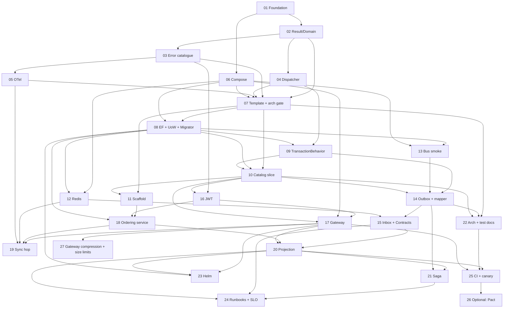

# Appendix C — Delivery plan

An architecture document that does not say what to build first is a description,
not a plan. This appendix sequences the work into independently reviewable pull
requests. Every PR leaves `main` building and green.

It says nothing about how long. That lives outside the blueprint, in the
[delivery roadmap](../roadmap.md) — one estimate per PR below, the calendar
they imply, and the assumptions holding it up.

## C.1 Service build order

Two orderings matter and they are different. The **platform** is built in the PR
sequence below. The **services** are built in this order, and not in parallel:

1. **Catalog** — simple domain, and the only service that owes nothing to
   another. Establishes the CQRS structure, caching and the query patterns, and
   is the first thing through the deployment pipeline (PR-10).
2. **Ordering** — the core domain. Rich aggregate and outbox (PR-18), saga
   (PR-21). The split matters because C.2 sequences them apart: PR-18 is the
   scaffold, the database and §11.4's ownership 404, and the state machine's
   later transitions have no caller until the saga drives them.
3. **Inventory and Payments** — concurrency and third-party integration, once
   the surrounding patterns have settled.
4. **Shipping** — depends on everything upstream being stable.
5. **Notifications** — last, and not because it is hard. It has no domain
   logic, no public API and publishes nothing: its entire subscription list is
   seven events belonging to Ordering, Payments and Shipping ([§3.2](03-bounded-contexts.md)). Built
   before them it is a consumer with no producers, which can be deployed but
   not exercised.

> **A pure consumer cannot be the thing that proves the pipeline.** An earlier
> version of this list put Notifications first, on the reasoning that a service
> with no domain logic proves messaging, observability and deployment end to
> end while there is nothing else to debug. The first half is true and the
> conclusion does not follow: end to end needs both ends, and every event
> Notifications reads is emitted by a service that would not exist yet. C.2 was
> never written that way — PR-10 is Catalog and PR-18 is "second service" —
> so the sequence below is what the plan always did.

The first service through the pipeline finds every gap in deployment,
observability and testing. Fixing those once is far cheaper than fixing them
again for each of the seven deployables behind it — the five remaining services
plus the gateway and the BFF, which take the same pipeline ([§15.1](15-cicd-deployment.md)).

## C.2 Pull request sequence

Phase names map to the `phase` column. Dependencies are PR numbers.

### Foundation

| PR | Title | Depends | Delivers |
|---|---|---|---|
| **01** | `chore: solution structure, SDK pin, central package management, CI skeleton` | — | `global.json`, `Directory.Build.props`, `Directory.Packages.props` with **exact** versions, `.editorconfig`, solution, CI running `dotnet test`, **licence allow-list gate** |
| **02** | `feat(common): Result, Error, and domain primitives` | 01 | `Result`/`Result<T>`, `Error`, `Entity<TId>`, `AggregateRoot<TId>`, `IDomainEvent`, typed-ID pattern. **Unit tests ship in this PR** — the convention starts here |
| **03** | `feat(common): ProblemDetails, error catalogue, correlation middleware` | 02 | RFC 9457 mapping, the status-code table from [§10.5](10-api-gateway.md), `X-Correlation-Id` middleware, `ToHttpResult()` |
| **04** | `feat(common): CQRS dispatcher and pipeline behaviours` | 02 | The dispatcher from [§6.2](06-cqrs.md), logging and validation behaviours, tests asserting behaviour **ordering**. No transaction behaviour yet |
| **05** | `feat(common): OpenTelemetry and structured logging defaults` | 03 | `Common.Web`: OTLP export, resource attributes, health endpoint wiring, log redaction policy |
| **06** | `feat(dev): Docker Compose — SQL Server, Redis, RabbitMQ, Keycloak, OTel` | 01 | The Compose file from [§14.1](14-local-development.md) — infrastructure at this PR, each application block with the PR that builds its image — `.env.example`, the placeholder realm and collector config it mounts, documented ports, healthchecks, and the path-filtered CI smoke that proves them (`config -q`, `up --wait`, `down -v`) |

### Service template

| PR | Title | Depends | Delivers |
|---|---|---|---|
| **07** | `feat(template): service skeleton and architecture test gate` | 02–06 | Compilable empty service across five projects ([§4.1](04-solution-structure.md)), Minimal API host, health endpoints, OpenAPI. **NetArchTest gate from this PR**: domain isolation, Application ↛ EF Core, endpoints ↛ Infrastructure, Application and Domain ↛ MassTransit (§4.2, [§9.3](09-messaging.md)) |
| **08** | `feat(template): EF Core, repositories, IUnitOfWork, migrator host` | 07, 06 | `DbContext` sealed in Infrastructure, `IUnitOfWork` port, `*.Migrator` project, **dual connection strings** ([§7.1](07-persistence.md)), Testcontainers smoke test |
| **09** | `feat(common): TransactionBehavior over IUnitOfWork` | 04, 08 | §6.3 behaviour. Tests proving `SaveChanges` is called once on success and never on failure, that a handler which writes through `ExecuteRawAsync` and then returns `Result.Failure` leaves no row, and that queries never open a transaction |
| **10** | `feat(catalog): first vertical slice — command, query, cursor pagination` | 07–09 | One aggregate, one command, one cursor-paginated query, the service's Dockerfile and Compose block, and the `docker-compose.infra-only.yml` override ([§14.1](14-local-development.md)) — the first containerised service, and the template PR-11's scaffold copies. **The write endpoint is deliberately unauthenticated and this is stated in the README** — closed by PR-16. The listing is not a gap and was never one: [§10.2](10-api-gateway.md)'s `catalog-public` route is GET-only and carries no policy, so a product listing is public at the edge and stays public here |
| **11** | `feat(tooling): new-service scaffold script` | 07, 10 | Copies and renames the template ([§4.5](04-solution-structure.md)): ports, database name, solution entries, Compose block. **The template is Catalog itself, read at run time** — one copy of the wiring, not two that drift — and the slice is excluded, so a new service inherits the wiring and none of the domain. Dogfooded by PR-18 |

### Data, cache, messaging

| PR | Title | Depends | Delivers |
|---|---|---|---|
| **12** | `feat(common): Redis helpers — HybridCache, key namespaces, distributed locks` | 06, 08 | Key-naming helper, **mandatory TTL enforced in code**, `{service}:cache\|lock\|idem\|denylist:` namespaces, the eviction-policy isolation from [§8.1](08-caching-redis.md), Testcontainers Redis tests |
| **13** | `feat(template): MassTransit RabbitMQ registration and harness smoke` | 08, 06 | Bus connects, publish/consume proven with the in-memory harness. **Split from the outbox deliberately** to keep the review readable |
| **14** | `feat(template): transactional outbox and allow-list event mapper` | 09, 13, 10 | Outbox table and dispatcher (§9.4), `IIntegrationEventMapper` allow-list, `IIntegrationEventPublisher` with the §9.3 contract. **`MessageTypeMap` and `OutboxJson` land here, not later**: both halves of what the `MessageType` and `Payload` columns mean, and a column whose format is decided after rows exist in it is a migration nobody wants. **`Common.Contracts` is created here too, with `IIntegrationEvent` and the one contract the allow-list maps to** — `Stage` reads that interface and `MessageTypeMap` selects on it, so neither compiles without it, and a mapper with an empty registry could not carry the test below. Integration tests proving aggregate row and outbox row commit in **one** transaction, that `Stage` copies the envelope's `MessageId`, and that every stageable domain event round-trips through the registered `OutboxJson` ([§12.4](12-test-strategy.md)) |
| **15** | `feat(messaging): Contracts, inbox consumers, inbox + outbox retention purge` | 14, 12 | The **remaining** versioned records in the `Common.Contracts` PR-14 created, inbox filter (§9.5), the `IntegrationEventConsumer<T>` adapter (§9.4), one purge hosted service covering **both** tables. **`Platform.IntegrationTests` starts here** with the §12.6 contract suite — no domain reference, versioned namespace, round-trip — because the rules arrive with the assembly they constrain |

### Edge and security

| PR | Title | Depends | Delivers |
|---|---|---|---|
| **16** | `feat(security): JWT bearer with mandatory per-service re-validation` | 03, 10 | Keycloak realm import, JWT validation in `Common.Web`, permission policies, test auth handler, and §11.4's `ICurrentUser` — common rather than per-service, the chapter amended to match. Closes PR-10's deliberately unauthenticated write path; the listing stays anonymous, because [§10.2](10-api-gateway.md)'s `catalog-public` route is GET-only and carries no policy. **Security tests: forged header without a token → 401, and a caller holding the wrong permission → 403.** The **404 half moves to PR-18**: hiding user B's resource from user A needs a resource with an owner, and Catalog has none — every product is public to every caller by design. Ordering's `CancelOrderHandler` is the first aggregate the check applies to |
| **17** | `feat(gateway): YARP routing, JWT, rate limiting, CORS` | 06, 16, 10 | The gateway from §10: [§10.2](10-api-gateway.md)'s whole route file — ahead of three of the four services it points at, because the tests below say nothing over one route — the rate-limit policies of §10.3 through `IProblemDetailsService`, the gateway's own `inventory:admin` authorization policy, the two conditional blocks of [§4.2](04-solution-structure.md), and correlation ID assignment. **Two config tests, both on `ReverseProxy:Routes`: every `AuthorizationPolicy` and `RateLimiterPolicy` named resolves, and every route's match minus its `PathRemovePrefix` is a prefix of the group its service maps (§10.2), which the in-process API tests cannot see.** Both were corrected by building it — an unresolvable policy stops the host rather than dropping the route silently, and Catalog's own route is why the second is a prefix rather than an equality. The dual-version pair stays an example in §10.2; what ships is the invariant that keeps its strips matched |
| **18** | `feat(ordering): second service from the scaffold` | 11, 08, 16 | Proves the scaffold. Own database, own migrator, and the Compose pair that makes §10.2's `ordering` route stop answering 502 — **the route itself is not a deliverable here**, because PR-17 shipped the whole route file ahead of three of its destinations and this is the first service to arrive behind one. A service PR that re-decides the route file is the mistake §10.2's dual-version trap describes. **Carries PR-16's deferred security test: user A cancelling user B's order → 404**, which is §11.4's ownership check and needs the first resource in the platform that has an owner — `CancelOrderHandler` is where the rule finally has something to apply to |
| **27** | `feat(gateway): response compression and request size limits` | 17 | The two entries of [§10.1](10-api-gateway.md)'s "It does" list PR-17 did not deliver, and the last outstanding piece of the gateway. **Neither is deferred for effort** — together they are perhaps five lines — but each needs a decision no chapter has taken. A body-size limit needs a **number**, and Kestrel's 30 MB is a framework default rather than a platform choice. Compression needs the **HTTPS** question settled, because `EnableForHttps` defaults to false against BREACH/CRIME and the edge is where every service's responses pass — so this PR carries an ADR for it. Numbered last and depending on PR-17 alone, so it may land at any point after it |

### Integration and operations

| PR | Title | Depends | Delivers |
|---|---|---|---|
| **19** | `feat(bff): the BFF host, its gRPC client and the one permitted sync hop` | 05, 12, 17, 18 | `Web.Bff` (§4.1), `AddStandardResilienceHandler` defaults, the timeout hierarchy asserted at startup, one deliberate **BFF → Catalog** pricing call demonstrating ADR-017. **The only host that gets an `Identity:Client`** ([§11.5](11-identity-authorization.md)) — the Keycloak client and secret arrive here and nowhere else |
| **20** | `feat(ordering): consume Catalog events into a local projection` | 15, 18, 17 | The full async path. Projection with **idempotent `MERGE` and the out-of-order guard** from §6.6 |
| **21** | `feat(ordering): order fulfilment saga` | 20, 14 | The state machine from §9.6, compensation paths, **a timeout on every wait state**, harness tests including the payment-declined compensation ordering |
| **22** | `test: expand architecture rules and document the test strategy` | 07, 10, 14 | Full composition-root rules, `docs/testing.md`, Testcontainers categories, coverage reported on the domain layer specifically |
| **23** | `feat(deploy): Helm charts, migration hooks, probes` | 17, 20, 08 | Chart per service, umbrella chart, migration job as a `pre-upgrade` hook, the probe and resource shape from §15.3 |
| **24** | `docs(ops): runbooks, secrets, dashboards-as-code, the SLO run` | 15, 20, 21 | The twelve runbooks from [§13.9](13-observability.md) — one per alert, checked both ways — per-lane outbox alerts (§13.6), `docs/secrets.md`, Grafana JSON in `deploy/observability/`, and the k6 **SLO run** against staging (§13.7, §15.1) — named for what it asserts, because §15.1 deliberately has no smoke stage |
| **25** | `ci: integration categories, canary deploy, quality gates` | 20, 22, 17 | Path-filtered per-service builds, containerised integration tests in CI, canary with automated rollback on error rate or p99 |

### Optional

| PR | Title | Depends | Delivers |
|---|---|---|---|
| **26** | `chore(optional): consumer-driven contract tests` | 25 | Pact, only if a consumer relationship becomes contentious. Not required for completeness |

## C.3 Dependency graph

The graph carries every edge in the tables above and no others. It is a
transcription, so it can drift silently — a missing edge suggests two PRs are
independent when the table says one blocks the other, which is the direction
that costs a wasted branch rather than a wrong build.

## C.4 Sequencing rules worth preserving

Three choices in the ordering above are deliberate and easy to lose in
replanning:

**PR-13 is split from PR-14.** Getting a bus connection working and getting the
outbox transactionally correct are separate problems. Reviewing them together
means the interesting half gets skimmed.

**PR-10 ships with unauthenticated endpoints, and says so.** Security lands in
PR-16. Naming a temporary gap in the README and scheduling its closure is
honest; discovering it in a pen test six months later is not. The alternative —
blocking the first vertical slice on the full auth stack — delays the feedback
that the slice exists to provide.

PR-16 closed it, and closing it settled a question the note could not: **only
the write path was a gap.** The listing is anonymous permanently, because
[§10.2](10-api-gateway.md)'s `catalog-public` route matches GET alone and
carries no authorization policy. A scheduled closure is worth having partly for
this — the PR that pays the debt is the one that reads the whole design and
finds out how much of it was ever owed.

**PR-11 is dogfooded by PR-18.** The scaffold script is proven by the next real
service, not by intent. If the script cannot produce Ordering, it is not
finished.

And one rule about the whole sequence: **from PR-02 onward, production code
lands with its tests in the same pull request.** Not "tests to follow" — the
follow-up PR is the one that gets deprioritised, and a test written after the
code has never been observed failing.

---

[← Appendix B](appendix-b-licences.md) · [Index](README.md) · [Appendix D →](appendix-d-type-inventory.md)
