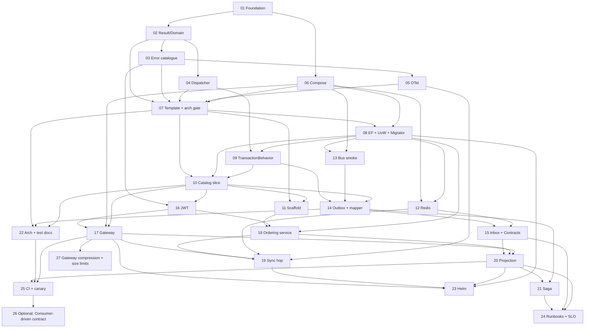

# Appendix C — Delivery plan

An architecture document that does not say what to build first is a description,
not a plan. This appendix sequences the work into independently reviewable pull
requests. Every PR leaves `main` building and green.

It says nothing about how long. That lives outside the blueprint, in the
[delivery roadmap](../roadmap.md) — one estimate per PR in the plan below, the
calendar they imply, and the assumptions holding it up. The *After the plan*
rows are the exception and carry no estimate anywhere: that file prices work
before it is built, and no row in that section was ever priced that way.

## C.1 Service build order

Two orderings matter and they are different. The **platform** is built in the PR
sequence below. The **services** are built in this order, and not in parallel:

1. **Catalog** — simple domain, and the only service that owes nothing to
   another. Establishes the CQRS structure, caching and the query patterns, and
   is the first thing through the deployment pipeline (PR-10).
2. **Ordering** — the core domain. Rich aggregate and outbox (PR-18), saga
   (PR-21). The split matters because C.2 sequences them apart: PR-18 is the
   scaffold, the database and §11.4's ownership 404, and the state machine's
   later transitions have no caller until the saga drives them.
3. **Inventory and Payments** — concurrency and third-party integration, once
   the surrounding patterns have settled.
4. **Shipping** — depends on everything upstream being stable.
5. **Notifications** — last, and not because it is hard. It has no domain
   logic, no public API and publishes nothing: its entire subscription list is
   seven events belonging to Ordering, Payments and Shipping ([§3.2](03-bounded-contexts.md)). Built
   before them it is a consumer with no producers, which can be deployed but
   not exercised.

> **A pure consumer cannot be the thing that proves the pipeline.** An earlier
> version of this list put Notifications first, on the reasoning that a service
> with no domain logic proves messaging, observability and deployment end to
> end while there is nothing else to debug. The first half is true and the
> conclusion does not follow: end to end needs both ends, and every event
> Notifications reads is emitted by a service that would not exist yet. C.2 was
> never written that way — PR-10 is Catalog and PR-18 is "second service" —
> so the sequence below is what the plan always did.

The first service through the pipeline finds every gap in deployment,
observability and testing. Fixing those once is far cheaper than fixing them
again for each of the seven deployables behind it — the five remaining services
plus the gateway and the BFF, which take the same pipeline ([§15.1](15-cicd-deployment.md)).

## C.2 Pull request sequence

Phase names map to the `phase` column. Dependencies are PR numbers.

### Foundation

| PR | Title | Depends | Delivers |
|---|---|---|---|
| **01** | `chore: solution structure, SDK pin, central package management, CI skeleton` | — | `global.json`, `Directory.Build.props`, `Directory.Packages.props` with **exact** versions, `.editorconfig`, solution, CI running `dotnet test`, **licence allow-list gate** |
| **02** | `feat(common): Result, Error, and domain primitives` | 01 | `Result`/`Result<T>`, `Error`, `Entity<TId>`, `AggregateRoot<TId>`, `IDomainEvent`, typed-ID pattern. **Unit tests ship in this PR** — the convention starts here |
| **03** | `feat(common): ProblemDetails, error catalogue, correlation middleware` | 02 | RFC 9457 mapping, the status-code table from [§10.5](10-api-gateway.md), `X-Correlation-Id` middleware, `ToHttpResult()` |
| **04** | `feat(common): CQRS dispatcher and pipeline behaviours` | 02 | The dispatcher from [§6.2](06-cqrs.md), logging and validation behaviours, tests asserting behaviour **ordering**. No transaction behaviour yet |
| **05** | `feat(common): OpenTelemetry and structured logging defaults` | 03 | `Common.Web`: OTLP export, resource attributes, health endpoint wiring, log redaction policy |
| **06** | `feat(dev): Docker Compose — SQL Server, Redis, RabbitMQ, Keycloak, OTel` | 01 | The Compose file from [§14.1](14-local-development.md) — infrastructure at this PR, each application block with the PR that builds its image — `.env.example`, the placeholder realm and collector config it mounts, documented ports, healthchecks, and the path-filtered CI smoke that proves them (`config -q`, `up --wait`, `down -v`) |

### Service template

| PR | Title | Depends | Delivers |
|---|---|---|---|
| **07** | `feat(template): service skeleton and architecture test gate` | 02–06 | Compilable empty service across five projects ([§4.1](04-solution-structure.md)), Minimal API host, health endpoints, OpenAPI. **The probes are anonymous and the document is not** — `MapOpenApi()` carries no authorization metadata, so once [ADR-030](appendix-a-adrs.md#adr-030--authorization-is-deny-by-default-in-the-building-block) made the fallback policy deny-by-default, `/openapi/v1.json` began requiring a caller. Taken deliberately: the document enumerates every route and schema the service has, and [§11.2](11-identity-authorization.md) assumes the network is hostile. **NetArchTest gate from this PR**: domain isolation, Application ↛ EF Core, endpoints ↛ Infrastructure, Application and Domain ↛ MassTransit (§4.2, [§9.3](09-messaging.md)) |
| **08** | `feat(template): EF Core, repositories, IUnitOfWork, migrator host` | 07, 06 | `DbContext` sealed in Infrastructure, `IUnitOfWork` port, `*.Migrator` project, **dual connection strings** ([§7.1](07-persistence.md)), Testcontainers smoke test |
| **09** | `feat(common): TransactionBehavior over IUnitOfWork` | 04, 08 | §6.3 behaviour. Tests proving `SaveChanges` is called once on success and never on failure, that a handler which writes through `ExecuteRawAsync` and then returns `Result.Failure` leaves no row, and that queries never open a transaction |
| **10** | `feat(catalog): first vertical slice — command, query, cursor pagination` | 07–09 | One aggregate, one command, one cursor-paginated query, the service's Dockerfile and Compose block, and the `docker-compose.infra-only.yml` override ([§14.1](14-local-development.md)) — the first containerised service, and the template PR-11's scaffold copies. **The write endpoint is deliberately unauthenticated and this is stated in the README** — closed by PR-16. The listing is not a gap and was never one: [§10.2](10-api-gateway.md)'s `catalog-public` route is GET-only and public by declaration — it names YARP's reserved `anonymous` value, which it did not have to before [ADR-030](appendix-a-adrs.md#adr-030--authorization-is-deny-by-default-in-the-building-block) made a route naming no policy inherit the fallback — so a product listing is public at the edge and stays public here |
| **11** | `feat(tooling): new-service scaffold script` | 07, 10 | Copies and renames the template ([§4.5](04-solution-structure.md)): ports, database name, solution entries, Compose block. **The template is Catalog itself, read at run time** — one copy of the wiring, not two that drift — and the slice is excluded, so a new service inherits the wiring and none of the domain. Dogfooded by PR-18 |

### Data, cache, messaging

| PR | Title | Depends | Delivers |
|---|---|---|---|
| **12** | `feat(common): Redis helpers — HybridCache, key namespaces, distributed locks` | 06, 08 | Key-naming helper, **mandatory TTL enforced in code**, `{service}:cache\|lock\|idem\|denylist:` namespaces, the eviction-policy isolation from [§8.1](08-caching-redis.md), Testcontainers Redis tests. **The fourth namespace is a reservation and its key builder is gone**: this PR did ship a `RedisKeys.Denylist(suffix)`, and [ADR-033](appendix-a-adrs.md#adr-033--revocation-is-bounded-by-the-token-lifetime-and-no-denylist-exists) removed it — the keyspace keeps its row in §8.1's table, the member does not, and anyone building this PR from the row today writes two key builders rather than three |
| **13** | `feat(template): MassTransit RabbitMQ registration and harness smoke` | 08, 06 | Bus connects, publish/consume proven with the in-memory harness. **Split from the outbox deliberately** to keep the review readable |
| **14** | `feat(template): transactional outbox and allow-list event mapper` | 09, 13, 10 | Outbox table and dispatcher (§9.4), `IIntegrationEventMapper` allow-list, `IIntegrationEventPublisher` with the §9.3 contract. **`MessageTypeMap` and `OutboxJson` land here, not later**: both halves of what the `MessageType` and `Payload` columns mean, and a column whose format is decided after rows exist in it is a migration nobody wants. **`Common.Contracts` is created here too, with `IIntegrationEvent` and the one contract the allow-list maps to** — `Stage` reads that interface and `MessageTypeMap` selects on it, so neither compiles without it, and a mapper with an empty registry could not carry the test below. Integration tests proving aggregate row and outbox row commit in **one** transaction, that `Stage` copies the envelope's `MessageId`, and that every stageable domain event round-trips through the registered `OutboxJson` ([§12.4](12-test-strategy.md)) |
| **15** | `feat(messaging): Contracts, inbox consumers, inbox + outbox retention purge` | 14, 12 | The **remaining** versioned records in the `Common.Contracts` PR-14 created, inbox filter (§9.5), the `IntegrationEventConsumer<T>` adapter (§9.4), one purge hosted service covering **both** tables. **`Platform.IntegrationTests` starts here** with the §12.6 contract suite — no domain reference, versioned namespace, round-trip — because the rules arrive with the assembly they constrain |

### Edge and security

| PR | Title | Depends | Delivers |
|---|---|---|---|
| **16** | `feat(security): JWT bearer with mandatory per-service re-validation` | 03, 10 | Keycloak realm import, JWT validation in `Common.Web`, permission policies, test auth handler, and §11.4's `ICurrentUser` — common rather than per-service, the chapter amended to match. Closes PR-10's deliberately unauthenticated write path; the listing stays anonymous, because [§10.2](10-api-gateway.md)'s `catalog-public` route is GET-only and names `anonymous`, YARP's reserved value for `AllowAnonymous` — the naming arrived with [ADR-030](appendix-a-adrs.md#adr-030--authorization-is-deny-by-default-in-the-building-block), whose fallback policy answers 401 to every path that says nothing, so a public one has to say so. The `authenticated` policy this PR registers is kept beside that fallback, because the gateway's route file names it. **Security tests: forged header without a token → 401, and a caller holding the wrong permission → 403.** The **404 half moves to PR-18**: hiding user B's resource from user A needs a resource with an owner, and Catalog has none — every product is public to every caller by design. Ordering's `CancelOrderHandler` is the first aggregate the check applies to |
| **17** | `feat(gateway): YARP routing, JWT, rate limiting, CORS` | 06, 16, 10 | The gateway from §10: [§10.2](10-api-gateway.md)'s whole route file — ahead of three of the four services it points at, because the tests below say nothing over one route — the rate-limit policies of §10.3 through `IProblemDetailsService`, the gateway's own `inventory:admin` authorization policy, the two conditional blocks of [§4.2](04-solution-structure.md), and correlation ID assignment. **Two config tests, both on `ReverseProxy:Routes`: every `AuthorizationPolicy` and `RateLimiterPolicy` named resolves, and every route's match minus its `PathRemovePrefix` is a prefix of the group its service maps (§10.2), which the in-process API tests cannot see.** The first subtracts YARP's two reserved authorization values, `anonymous` and `default`, and the exemption is not a convenience: YARP intercepts both names before `IAuthorizationPolicyProvider` sees them, so neither is registered anywhere and a test that did not subtract them would fail on a correct route file — while registering an "anonymous" policy to make it pass would register one that never runs. Both were corrected by building it — an unresolvable policy stops the host rather than dropping the route silently, and Catalog's own route is why the second is a prefix rather than an equality. The dual-version pair stays an example in §10.2; what ships is the invariant that keeps its strips matched |
| **18** | `feat(ordering): second service from the scaffold` | 11, 08, 16 | Proves the scaffold. Own database, own migrator, and the Compose pair that makes §10.2's `ordering` route stop answering 502 — **the route itself is not a deliverable here**, because PR-17 shipped the whole route file ahead of three of its destinations and this is the first service to arrive behind one. A service PR that re-decides the route file is the mistake §10.2's dual-version trap describes. **Carries PR-16's deferred security test: user A cancelling user B's order → 404**, which is §11.4's ownership check and needs the first resource in the platform that has an owner — `CancelOrderHandler` is where the rule finally has something to apply to |
| **27** | `feat(gateway): response compression and request size limits` | 17 | The two entries of [§10.1](10-api-gateway.md)'s "It does" list PR-17 did not deliver, and the last outstanding piece of the gateway. **Neither was deferred for effort** — together they are four lines — but each needed a decision no chapter had taken. The body-size limit is **one mebibyte** in `GatewayLimits`, two orders of magnitude above the largest body this platform can construct; the HTTPS question is settled by [ADR-020](appendix-a-adrs.md#adr-020--the-edge-compresses-over-tls-and-says-so), which sets `EnableForHttps = true` because that flag is what makes compression happen at all: TLS terminates upstream, but §4.2's forwarded-headers block rewrites `Request.Scheme` from the ingress's header and the middleware decides at the first write, so at the default a gateway behind an HTTPS ingress compresses nothing. **Four things were found by building it, and one of them by a review after that.** The 413 needs no exception handler, unlike §10.5's 400 and 409 rows: Kestrel's `BadHttpRequestException` carries the status and `ExceptionHandlerMiddleware` reads it off. The limit cannot be tested over `TestServer`, which implements none of the body-size features, so this is the first suite in the solution to drive `WebApplicationFactory.UseKestrel`. The compression middleware has **no** ordering rule a test can catch — measured, by moving it — where its absence is caught immediately. The ADR's first argument was inverted: it read the *hop's* scheme rather than the one the middleware reads, which made a load-bearing flag look decorative. And the edge was violating RFC 9111 §5.2.2.6 — ASP.NET Core's compression middleware ignores `Cache-Control: no-transform`, which an intermediary may not — so the PR carries `NoTransformResponseCompressionProvider`, the one piece of machinery here that is conformance rather than choice. Numbered last and depending on PR-17 alone, so it may land at any point after it |

### Integration and operations

| PR | Title | Depends | Delivers |
|---|---|---|---|
| **19** | `feat(bff): the BFF host, its gRPC client and the one permitted sync hop` | 05, 12, 17, 18 | `Web.Bff` (§4.1), `AddStandardResilienceHandler` defaults, the timeout hierarchy asserted at startup, one deliberate **BFF → Catalog** pricing call demonstrating ADR-017. **The only host that gets an `Identity:Client`** ([§11.5](11-identity-authorization.md)) — the Keycloak client and secret arrive here and nowhere else. Catalog gains the server half: `pricing.proto`, a `GetPrices` slice and a second, **HTTP/2-only Kestrel endpoint on 8081**, because a cleartext port cannot serve HTTP/1.1 and h2c at once |
| **20** | `feat(ordering): consume Catalog events into a local projection` | 15, 18, 17 | The full async path, and the producer `ordering.ProductPrices` has been waiting for since PR-18 shipped its reader. `ProductPriceProjection` with **idempotent `MERGE` and the out-of-order guard** from §6.6, all three of Catalog's events because §3.2 gives Ordering all three, and the `ordering-catalog-events` receive endpoint of [§9.8](09-messaging.md) — retry, inbox filter, in-memory outbox, in that order. **`OrderSummaries` is not here**: §6.6's other projection is fed mostly by Ordering's own domain events on the local lane and needs §13.3's `OrderMetrics` and the escalated history query with it, none of which this PR's title names. **Three things were found by building it.** §9.8's printed `e.UseInMemoryOutbox()` carries `CS0618` at the pinned version, so ADR-019 had made the chapter's line unbuildable since it was written. §6.6's `MERGE` wanted `WITH (HOLDLOCK)`, which no test catches — measured, at eight-way and sixty-four-way concurrency — so it is a reasoned claim and labelled as one. And `ConfigureEndpoints(context)`, left in both services by PR-13, turned out to manufacture a queue with neither the inbox filter nor the retry policy for any consumer whose explicit binding is missing; it is gone from Catalog's registration too, because that file is the scaffold's template. **Two things are named as owed rather than built.** Broker-fed read-model staleness has no SLO — `messaging.delivery.lag` is recorded before the handler runs, so it cannot cover it, and closing the gap needs a §13.3 instrument. And this projection has **no rebuild path**: Ordering holds no source of truth for prices, so §6.6's day-one rebuild script has to be Catalog republishing — carrying each product's *original* `OccurredAt`, because a fresh one re-lists everything ever discontinued |
| **21** | `feat(ordering): order fulfilment saga` | 20, 14 | The state machine from §9.6, compensation paths, **a timeout on every wait state**, harness tests including the payment-declined compensation ordering. Also the four command handlers the saga sends to and §9.4's `ordering-commands` endpoint, because a saga whose commands nothing accepts is a saga sending into silence — and §9.3's allow-list, empty since PR-18, since the saga starts on Ordering's own `OrderPlaced`. **Four things were found by building it.** No chapter had ever named a **message scheduler**, and §9.6's `Schedule` declarations do not work without one — [ADR-021](appendix-a-adrs.md#adr-021--saga-timeouts-are-scheduled-by-the-broker) settles it on the broker's delayed exchange, which makes §14.1's RabbitMQ the one infrastructure service that is built rather than pulled. §5.4's `Order.ConfirmStock` had **no caller and no way to acquire one**: the saga sends four commands and none of them advances the order out of `AwaitingStock`, so `ConfirmOrder` met an aggregate that refused it — closed by a fourth receive endpoint reading `StockReserved`, which §3.2 already grants, rather than by a fifth command it does not. §9.6's escalation insert was a read-then-write with no range lock, which is §6.6's `MERGE` finding one table over. And `ShippingAddressV1` silently dropped an address line, invisible until this PR became its first producer — the type has since been deleted by [ADR-035](appendix-a-adrs.md#adr-035--an-integration-event-carries-identifiers-not-personal-data), which does not retire the lesson: the PR that becomes a contract's first producer is still the last one that can fix its shape for free (§9.2) |
| **22** | `test: expand architecture rules and document the test strategy` | 07, 10, 14 | The rest of [§4.2](04-solution-structure.md)'s table as gates — the cross-service clause three of its five rows carry had no test at all, and the Migrator row had none of any kind — plus `docs/testing.md`, the `Category=Integration` split and the domain-layer coverage report. **Four things were decided by building it.** §4.2's composition-root rule granted host-level `*ServiceCollectionExtensions` an exemption the gate never implemented and no host ever wanted, so the prose narrows to the code rather than the gate widening to a hole nothing occupies. The cross-service rule cannot be a list of service names, because §4.5's scaffold renames the template's own name inside whatever it renders — so the gate asks a **measured** question instead: every package this platform pins is strong-named and none of its own projects is, `Dapper` alone excepted, which is a residual named rather than closed. The category goes on the `[CollectionDefinition]` and not on each test class, so joining the container collection *is* carrying the category and no reflection gate is owed — xUnit v3's propagation was measured, 10 and 71 out of 81 with no third state. And the coverage collector is the one `Microsoft.NET.Test.Sdk` already carries, so the figure cost no package and [Appendix B](appendix-b-licences.md) no entry |
| **23** | `feat(deploy): Helm charts, migration hooks, probes` | 17, 19, 20, 08 | Chart per service, umbrella chart, migration job as a `pre-install,pre-upgrade` hook, the probe and resource shape from §15.3 — plus `deploy/helm/smoke.sh`, which renders all five charts and asserts what comes out, and the second path-filtered workflow of §15.1. **Five things were found by building it.** Helm's `fullname` convention would have broken the platform's routing: §10.2's route file and §9.7's pricing hop hold their destination hosts as literals *on the stated grounds that the host is the Kubernetes Service name*, so a release-derived name is a 502 the moment the umbrella installs the same workload — the charts take a required `workload.name` instead, and the selector carries nothing release-scoped, because a selector is workload identity rather than release bookkeeping and a Deployment never lets that field change. §15.4's two Redis rows were marked required against a solution where no host called `AddRedisConnections`, which is not over-supply but a `secretKeyRef` to a Secret nobody created and therefore a pod that never starts; they were made conditional on the consumer existing, and PR-28 met that condition for Catalog and Ordering. `terminationGracePeriodSeconds` had a rule and no number, and the number is not free: `HostOptions.ShutdownTimeout` defaults to 30 s — measured, not read — and so does Kubernetes' grace period, so the default is a `SIGKILL` at the instant the drain would have finished. The pod template's rollout checksum hashed the ConfigMap the library renders and therefore missed the gateway's own, so editing `cors.origins` rewrote a mounted object and left the pod byte-identical — a config-only deploy that reports success and rolls nothing; it now hashes the whole of `.Values`. And the gate caught itself: "the gateway renders no migration Job" passed against a gateway that *declared* a migrator image, because that chart carries no migration template at all — the assertion is now about the two halves agreeing, and it was the **one** deliberate defect, of every one run through that gate, that failed to turn the run red |
| **24** | `docs(ops): runbooks, secrets, dashboards-as-code, the SLO run` | 15, 20, 21 | The runbooks from [§13.9](13-observability.md) — checked both ways, and not one per alert: §13.8's ownership split gives error rate two rules over one procedure — per-lane outbox alerts (§13.6), `docs/secrets.md`, Grafana JSON in `deploy/observability/`, and the k6 **SLO run** against staging (§13.7, §15.1) — named for what it asserts, because §15.1 deliberately has no smoke stage. **Five things were found by building it.** §13.6's conditions became files and **four of them read an instrument nothing publishes** — the saga age, the review queue, `orders.placed`, and the cache ratio, whose meter §13.2 *does* register while `Microsoft.Extensions.Caching.Hybrid` 10.0.0 publishes no meter at all — it reports EventCounters through `HybridCacheEventSource`, so wiring Redis would not light it either, and the row is owed an instrument. **That one was first diagnosed as owed only a consumer**, because nothing called `AddRedisConnections` at the time; a gate was written on that premise, observed red and removed once the package was read, which is the more useful half of the finding — a visible absence was taken for the cause. So those rules ship unloaded in `awaiting-signal.yaml` and the gate asserts their metrics are published by **nothing**, which is what makes the list self-clearing rather than a list of alerts nobody ever turned on. §13.6's `MetricsInitialiser` did not compile: unread primary-constructor parameters are CS9113 three times over and the discard-looking `_` names do not escape it, while `ct` is CA1725 against `IHostedService` — and CA1707, the rule a reader expects to fire on those names, does not. Its `OutboxStats` reached for an `IServiceScopeFactory` to avoid holding a `DbContext`, but §6.5's `IDbConnectionFactory` is a singleton holding a string, so the scope guarded against a dependency shape the code does not have. §13.6's saga alert excludes "one awaiting despatch" and there is no such state — `OrderFulfilmentSaga` arms the three-day timeout on the transition **into `Confirmed`**, so a selector spelled `AwaitingDespatch` would match no series, exclude nothing, and page on every confirmed order an hour after payment. And the gate's own instrument reader missed every gauge on its first run, because `CreateObservableGauge` infers its type argument and a pattern requiring `<…>` finds the histograms and the counters and silently skips the three types this PR added |
| **25** | `ci: integration categories, canary deploy, quality gates` | 20, 22, 17 | Path-filtered per-service builds, containerised integration tests in CI, canary with automated rollback on error rate or p99 — plus [§15.1](15-cicd-deployment.md)'s filter-inventory check, its per-service image build, and the fourth path-filtered `deploy/**` workflow. **Six things were found by building it.** §15.5 specified a canary and no chapter had chosen a **mechanism**, which [ADR-022](appendix-a-adrs.md#adr-022--the-canary-is-a-second-release-weighted-by-replicas) now records: an ingress-controller weight is disqualified by topology rather than taste, because this platform has one Ingress and everything behind it is dialled by Service name ([§10.2](10-api-gateway.md), [§9.7](09-messaging.md)) — so an edge weight cannot canary Catalog or Ordering at all. The two tracks then needed telling apart, and **`service.version` cannot do it**: `BuildInfo` strips the source-revision suffix on purpose and [§4.4](04-solution-structure.md) pins no assembly version, so every host in the platform reports `1.0.0` — a registered, exported, constant attribute, which is §13.6's own trap in a new place. `deployment.track` through `OTEL_RESOURCE_ATTRIBUTES` replaced it and **no production C# changed**, because the SDK's resource builder already honours the variable — established by a test against an exported resource rather than by reading the overload. §15.5's **5% is not expressible** at §15.3's `replicaCount: 3`, where one canary pod already serves 25%: it needs 19 stable replicas, and `autoscaling.maxReplicas` is 20 on the three service charts, so on those the smallest configuration in which the first rung is real is exactly the largest the chart allows — the gateway's is 30, so the coincidence is not platform-wide and the 19 is what the weight costs rather than what every HPA permits. The weight arithmetic was then **wrong in floating point at the one input the ladder starts from** — `19 * 0.05 / 0.95` is `1.0000000000000002`, so `ceil` bought two pods and served 9.5% under a label reading 5% — found by the test asserting that the function naming the required replica count and the function checking it agree, and fixed by doing the whole calculation in integers. `--logger trx`, which the stage gate counts from, **moves the coverage collector's output**: each stage then leaves the run's merged attachment *and* one partial per test project, so the single-file reporter had to become a merging one — and the union is worth having, at 257 lines against the unit stage's 253 and the integration stage's 192. And the Deployment's selector had to gain the track label, which is **immutable**: free today because nothing has installed these charts, and a downtime window if taken later |

### Optional

Optional describes how it entered the plan, not whether it happened. **PR-26's
condition was met and it has landed**; the row records what it delivered on the
same terms as every mandatory row above. It is still not required for
completeness, and nothing depends on it.

| PR | Title | Depends | Delivers |
|---|---|---|---|
| **26** | `chore(optional): consumer-driven contract tests` | 25 | A consumer-driven contract over [§9.7](09-messaging.md)'s one synchronous hop — `Web.Bff → Catalog` — as six interactions the consumer authors, its own suite drives and Catalog's suite verifies, plus [§12.6](12-test-strategy.md)'s second half. Delivered **without Pact**, which [ADR-023](appendix-a-adrs.md#adr-023--the-consumer-driven-contract-is-a-linked-file-not-pact) records, and therefore with **no package and no row in [Appendix B](appendix-b-licences.md)**. **Five things were found by building it.** The conditional was already satisfied and the evidence was sitting in the consumer's own suite: `StubCatalog` is a hand-written gRPC server modelling Catalog, and **four of its behaviours had drifted from the service it models** — it filtered currency case-sensitively where Catalog does not, echoed the *request's* spelling of the currency rather than its own stored one, formatted amounts at the test's scale rather than the column's `decimal(19,4)`, and enforced no request ceiling at all. **A stub is a second specification nobody verifies**, and the sharpest consequence was measured rather than argued: because the stub echoed the request, `CheckoutEndpoints`' `OrdinalIgnoreCase` currency comparison had never once been handed two spellings, so tightening it to `Ordinal` left all **62** of `Web.Bff.Tests`' pre-PR container-free tests green — the fast half, not the suite's 66 — over a change that answers 500 to every lower-case currency a customer types. Then the mechanism the row named **cannot reach the relationship the row made it conditional on**: PactNet 5.0.1 ships HTTP and message pacts only, gRPC is a plugin, and its .NET binding is `PactNet.Extensions.Grpc` — pull request 548 against `pact-foundation/pact-net`, opened 4 September 2025 and still open — while the out-of-band route costs a `pact_verifier_cli` and a platform-specific plugin binary that `Directory.Packages.props` cannot pin and the licence gate therefore cannot see. The stub's **single currency for the whole catalogue** made the interesting case inexpressible — one product priced in the requested currency beside one that is not is exactly the shape that fills `QuoteResponse.Unpriced` while still totalling the rest — so the currency moved onto the row, where Catalog keeps it. The request ceiling needs **both edges or neither**: a provider that quietly lowered `MaxProductIds` still refuses a hundred and one, and one that raised it still serves a hundred, so one interaction alone is satisfiable by a limit that has moved. And [§4.1](04-solution-structure.md) calls `Platform.IntegrationTests` the only suite that references every service, which reads as the obvious home and is the wrong one: a provider verification needs the provider *running*, so it would buy a sixth project a container set ([§12.4](12-test-strategy.md)'s stated price) to run six tests `Catalog.Api.Tests` runs over `ServiceFixture` for nothing |

### After the plan

**This section exists because the plan was complete and a specified mechanism
had no row in it**, which is a different failure from a PR being late. §8.5
specified six types, §4.2's composition root showed the line that wires one,
§6.3's pipeline gave it a seat and §12 shipped a test only its replay path can
satisfy — and `grep -in "idempotenc"` over the twenty-seven rows above returned
nothing. Five source files and four test files deferred to "§8.5's PR", so the
deferral read as a schedule while naming a row that did not exist.

**A row was the honest fix rather than a note.** The alternative was to declare
§8.5 specification-only, which no other section of a specified-and-built chapter
is, and which would have left `RedisKeys.Idempotency` a member named for work
nobody was going to do. **The lesson generalises past this row and belongs to
C.4**: a chapter that four other chapters cite is not covered by the plan
merely because the plan is finished — a deferral is a dead reference the moment
the thing it defers to is complete.

| PR | Title | Depends | Delivers |
|---|---|---|---|
| **28** | `feat(common): §8.5's idempotency behaviour and Redis store` | 12, 18, 10 | The six types §8.5 specifies — `IIdempotencyStore`, `IdempotencyEntry`, `IIdempotentCommand`, `IdempotencyBehavior<,>`, `ConcurrentRequestException`, `RedisIdempotencyStore` — the fourth pipeline seat in both services, and the two commands that opt in. **Four things were found by building it.** `AddRedisConnections` had **no caller anywhere in `src/`**: PR-12 built §8's whole Redis stack and wired it into no host, so the behaviour could not have resolved its store and this PR carries §8's deployment wiring too — Compose, both charts, both API fixtures. `IIdempotentCommand` gained the `static abstract OperationName` §8.5 had argued for and declined, because the argument for declining — that a member on the opted-in interface is a change to the contract every command implements — is true only once the interface *has* implementors, and this is the PR that declares it; deferring it would have meant paying the migration against live keys. The store went to `Common.Infrastructure.Redis` rather than the service's own Infrastructure that §8.5 printed, because `RedisDistributedLockFactory` sits one file over on the same connection with the same keying and two per-service copies of one Redis interaction drift. And the opt-in gate this PR adds **found a defect in this PR**: `PublishProductCommand` had been given the `CommandId` field and not the interface, so it compiled, passed every other test, and was dispatched unprotected — the exact silent state the gate exists for. **Two things are named as owed rather than built.** The SQL-side marker that closes the lost commit acknowledgement is §8.5's debt — **paid by PR-32 below, which is the only row in this section a row above it predicted** — and the stored payload still carries an implicit schema for the retention, so changing an idempotent command's result shape remains a migration |

**The second row is the same failure in a different direction, and it is worth
naming as such.** §8.5 was a mechanism no row delivered; §15.1's secret scan was
a *stage* no row delivered — drawn as the first node of the pipeline, argued for
that position in the chapter's own prose, and named as a requirement by §11.6 —
which said *enable secret scanning in CI* until this PR made that imperative
describe a scanner that already runs, and now states the scanner's reach
instead.
PR-01 delivered the CI skeleton and the licence half of that node and stopped
there, on the reading that the scan was out of its scope; `ci.yml` said so at
the job, and the sentence "joins this job when it lands" named no PR. So the
gap here was not a chapter the plan forgot but a **half of a node** the plan
split without saying who owned the other half.

**It had already produced the failure the callout guards against.** §15.1's own
"the diagram is the target pipeline" callout — written to stop a reader
inferring capability from a green pipeline — listed *the scan* among the live
stages while `docs/secrets.md` stated in as many words that no scanner existed
(#119). Two documents, opposite claims, and the one that reads as authoritative
was the wrong one.

| PR | Title | Depends | Delivers |
|---|---|---|---|
| **29** | `feat(ci): §15.1's secret scan, the other half of the first node` | 01 | `.github/secret-scan/` — twelve named rules over key blocks, provider-token shapes and credential-shaped assignments, each with its own positive case and its own near miss; an allow-list keyed on `path \| rule \| fingerprint \| reason` with **no globs and no inline pragma**; and a stale entry failing the build, on `awaiting-signal.yaml`'s argument that a list of known exceptions needs a gate asserting they are still exceptions. It joins the `licence-gate` job rather than taking one of its own, because it shares every property that job is arranged around and because §15.1 draws the two as one node. **Two limits are stated rather than closed**: it reads the working tree and not the history, so a credential committed and removed is still compromised and still invisible to it; and it is a pattern scanner, so the list of rules is the list of things it can find. **What building it cost was the allow-list**, not the rules: this repository deliberately commits local-development credentials (§14.1), and the narrow suppression — one entry per site rather than one per file — is what turns rotating one of them into a reconciliation the file lists |

**The third row is neither of those, and the difference is the point of
naming it.** PR-28 was a mechanism the plan never rowed; PR-29 was half a node
the plan split without saying who owned the other half. Both were gaps in
coverage. Nothing was missing here: [§9.8](09-messaging.md) printed
`e.UseInMemoryOutbox(context)` on every receive endpoint, PR-20 and PR-21 built
exactly that, and the plan delivered what it specified. **The specification was
wrong.** So this row records a *correction to a landed row* rather than a gap —
and it earns a row for a reason a commit body could not carry, because closing
the defect takes an exception to [§9.3](09-messaging.md)'s prohibition on a
second outbox table set, which is a rule four chapters rest on.

**A plan is where a reader finds out that a rule moved.**
[ADR-032](appendix-a-adrs.md#adr-032--the-sagas-outbox-is-masstransits-in-the-sagas-own-transaction)
carries the argument and the consequences, as an ADR should. What this row
carries is the fact that the platform's messaging shape changed *after* the
plan was complete — which a reader of the twenty-seven rows above, and of
every chapter they cite, would otherwise have no reason to look for.

| PR | Title | Depends | Delivers |
|---|---|---|---|
| **30** | `fix(ordering): the saga's transactional outbox` | 21 | `AddEntityFrameworkOutbox<OrderingDbContext>` and, on the `ordering-fulfilment-saga` endpoint alone, `UseEntityFrameworkOutbox<OrderingDbContext>(context)` in place of `UseInMemoryOutbox` — plus the three MassTransit tables it needs in the `ordering` schema and the migration that creates them — so the saga's sends and its scheduled timeout commit in the same transaction as the instance ([ADR-032](appendix-a-adrs.md#adr-032--the-sagas-outbox-is-masstransits-in-the-sagas-own-transaction)). **What it closes is a dual write §9.8 printed.** `EntityFrameworkRepository` commits the instance and the in-memory buffer flushes *after* it, so a crash in that window left an order in `AwaitingPayment` with stock reserved, no `AuthorisePayment` sent and — because the schedule sat in the same buffer — no `PaymentTimeout` to rescue it. [§9.5](09-messaging.md)'s inbox does not rescue it either: `InboxFilter` writes its row after the consumer returns, so the redelivery finds an instance that has already moved on and no transition accepts it. **It faults rather than being absorbed** — the machine's `Ignore(StockReserved)` sits `During(Compensating)` alone, so a `StockReserved` arriving in `AwaitingPayment` is genuinely unhandled: MassTransit's default raises, §9.8's five retries are spent, and the message lands in the error queue [§13.6](13-observability.md) pages on. **So the window was observable and still not repairable**, which is the distinction ADR-032 turns on: a page is not a repair, and nothing in the error queue recreates the `AuthorisePayment` that was never sent or the `PaymentTimeout` that would have rescued the order. **Three things were found by building it.** The alternative §9.3 dismissed — routing the saga's output through [§9.4](09-messaging.md)'s application outbox — is not merely more expensive but **unavailable**: the timeout is a delayed message and the delay is a transport feature ([ADR-021](appendix-a-adrs.md#adr-021--saga-timeouts-are-scheduled-by-the-broker)), so no dispatcher of ours can replay one it never held, and an application outbox would have closed half the window and left the half with no bound at all. `UseBusOutbox()` is deliberately **not** called: it intercepts publishes *outside* a consume context, which is the API request path §9.4 already owns, so calling it would put a third staging mechanism on a path that has no dual write. And the three entities are MassTransit's, mapped by `modelBuilder.AddTransactionalOutboxEntities()` because the library owns those mappings and its own queries read the tables through them — **not because the assembly scan could not reach a configuration of ours**, which it would, since `ApplyConfigurationsFromAssembly` selects on where the configuration is declared and never on where the entity type is. So this is the first artefact in `Ordering.Infrastructure` whose EF model no `IEntityTypeConfiguration<T>` describes and [§7.2](07-persistence.md)'s mapping rule gains a stated exception rather than a quiet one. **Two costs are taken rather than dodged.** The `ordering` schema now holds five messaging tables where the chapters describe two — MassTransit's singular against this platform's plural, which is a property of MassTransit's naming rather than a decision anybody took. And there are two retention policies, which is exactly what §9.3 warns about — though the second is one table rather than three: `InboxCleanupService<OrderingDbContext>` prunes `ordering.InboxState` alone, on the duplicate-detection window, where `ordering.OutboxMessage` is drained by the outbox middleware as each message reaches the transport and `ordering.OutboxState` is touched by nothing at all, since it belongs to the bus-side outbox and exists only to carry `OutboxMessage.OutboxId`'s foreign key. [§9.4](09-messaging.md)'s `RetentionPurgeService` prunes ours and reads none of the three, and folding them together was refused because deleting an `InboxState` row whose outbox messages have not been delivered turns a retention job into the message loss this row exists to close |

**The fourth row is a security control the plan never rowed, and it is PR-28's
shape rather than PR-30's.** Nothing here corrects a specification: [§9.4](09-messaging.md)
described `CommandOrigin` accurately, including its own callout that queue
arrival "is only as restrictive as the broker's authorisation" and that "this
chapter does not specify one". The chapter was right, the code matched it, and
the control it named as absent stayed absent — a gap the plan had no row for
because no row ever claimed to close it. That is PR-28's failure mode: a
mechanism four chapters lean on, deferred to a PR that did not exist.

**What earns it a row rather than a commit body is that a rule moved.**
[ADR-036](appendix-a-adrs.md#adr-036--the-broker-has-a-per-service-identity)
makes the broker an authorisation boundary, which reverses §9.4's callout,
re-scopes [§15.4](15-cicd-deployment.md)'s broker Secret from one to one per
service, and gives §4.5's scaffold a sixth shared file to edit. A reader of
the twenty-seven rows above would have no reason to look for any of that.

| PR | Title | Depends | Delivers |
|---|---|---|---|
| **31** | `fix(messaging): the broker has a per-service identity` | 21, 13 | Two RabbitMQ accounts and their permissions in `deploy/compose/rabbitmq/definitions.json`, imported at broker start by `20-commerce.conf`, plus `check_permissions.py` and a workflow of its own. **`guest` is gone**, and the mechanism is worth naming because it is not a deletion: RabbitMQ seeds the default user only when it boots with an empty database and skips that when definitions are imported — so a stale volume keeps the account, and `down -v` is what makes the removal true. **The permissions are a measurement.** Read off a running broker with both services connected and an order placed, then corrected three times by running it again: `Common.Contracts:IIntegrationEvent` is MassTransit's polymorphic exchange and a `Common\.Contracts\.` pattern misses it by one token; `MassTransit:ReceiveFault` never appears on a healthy stack, so a topology capture cannot show it — **a runtime capture shows what RAN, not what CAN run**, which is why `payments-commands` is derived from `Endpoints.cs` and not from a broker; and `queue.bind` takes `read` on the destination exchange, so sending to a peer's queue needs more than `write`. **The exploit was attempted rather than argued**: as `catalog-svc`, all four of `ConfirmOrder` onto `ordering-commands`, a forged `OrderPlaced`, a `ReserveStock` and a forged `PaymentAuthorised` were refused by the broker, with a positive control publishing Catalog's own contract to prove the credential worked. The first probe reported every attempt ACCEPTED and was wrong — `basic_publish` is fire-and-forget, so a refusal arrives as a channel exception after the close, and only the broker log said otherwise. **Three residuals are stated rather than closed**: `configure` cannot be exclusive, because a consumer declares the exchange it binds; `read` on a peer's command endpoint grants the consume along with the bind, because a RabbitMQ pattern cannot tell a queue from an exchange; and provisioning the accounts on a deployed broker is an obligation this repository states and does not check, on §15.4's own terms |

**The fifth row is the first one another row predicted, and that is what makes
it a kind of its own.** PR-28, PR-29 and PR-31 were gaps in coverage — a
mechanism no row delivered, half a node whose other half nobody owned, a control
the plan never claimed to close — and PR-30 was a correction to a landed row.
Nothing here is any of those. PR-28's row ends by naming two things it left
owed, and the first of them is exactly what this row delivers: *the SQL-side
marker that closes the lost commit acknowledgement is still §8.5's debt*. So
the gap was neither missing nor mis-specified — it was **declared, in the row
above, against an issue**
([#113](https://github.com/alexander-shamray/dotnet-ddd-blueprint/issues/113))
that had no row saying who would pay it.

**A named residual is the one kind of debt this section was already tracking,
and it still needed a row.** The alternative was to leave it in PR-28's
*Delivers* cell for ever, where a reader finds a sentence about work that is now
done and cannot tell from the plan whether it ever was. **A row is how a
residual stops being one**, and the test it has to pass is every other row's:
whether a rule moved.

[ADR-037](appendix-a-adrs.md#adr-037--the-idempotency-marker-is-a-row-in-the-commands-own-transaction)
moves one, and not a small one. §8.5's guarantee was *at most one commit per key
within `Retention`, except across a lost acknowledgement*; it is now *at most
one commit per key while the marker survives* — the exception goes, and the
bound moves off a Redis TTL onto a retention window this repository sets, which
is why that window is the only one of the three with a floor.
[§6.3](06-cqrs.md)'s transaction gains a read before the handler and a write
before the commit, [§10.5](10-api-gateway.md) gains a third producer of its 409,
[§9.5](09-messaging.md)'s purge gains a third table, and §4.5's scaffold gains a
migration, a configuration and a seventh shared file. A reader of the rows above
would have no reason to look for any of that.

| PR | Title | Depends | Delivers |
|---|---|---|---|
| **32** | `fix(common): §8.5's durable idempotency marker` | 28 | `IIdempotencyMarkerStore`, `IdempotencyContext`, `CommandAlreadyCommittedException` and `IdempotencyRetention` in `Common.Application`; `IdempotencyMarker`, `IdempotencyMarkerTable` and `EfIdempotencyMarkerStore` in `Common.Infrastructure`; `CommandAlreadyCommittedExceptionHandler` in `Common.Web`; and per service a mapped table, a migration, a third registered schema and a third retention purge with `RetentionPolicy.IdempotencyWindow` — the one window with a floor, because purging a marker early re-opens the duplicate at a boundary set by a housekeeping setting. **§6.3 does the reading and the writing**, and each of the three positions is argued rather than convenient: the key is captured **once** before the unit opens, because a nested dispatch would overwrite the scoped carrier mid-transaction; the marker is read **before** `next()`, so a command that already committed does no work rather than losing it to a constraint violation on the way out; and it is written **after** the failure guard and §2.3's aggregate-count check, so a command this transaction is about to refuse leaves nothing behind to refuse its retry with. **Holding the Redis claim was the cheaper alternative and does not work**: §8.5's own release table already says holding *postpones* the duplicate rather than preventing it — every entry has a TTL, so the attempt after expiry claims a free key and runs the command again — and it would cost every ordinary fault its retry for a day to buy that postponement. A row has no TTL. **Three things were found by building it.** The scaffold's `snapshot_from_designer` hard-coded `AddOutboxRetentionIndex` as the last template migration's class name, so a fifth migration made that literal the *second*-to-last and **every anchor in the function missed at once** — the run stopped, loudly, which was luck rather than design: it derives the name from the file the caller already holds now. And the two behaviours' broken forms are refused by the **build**, not by a test — deleting `idempotency.Claim(key)` is CS9113 for an unread primary-constructor parameter, and a `Claim` that assigns nothing is CA2245 or CA1822 — so the counterfactual for *is the key published at all* is the compiler, and the tests that needed a measured counterfactual are the ones about **where** each call sits. And **restoring a file with `shutil.copy2` restores its mtime along with its bytes**, so MSBuild found nothing to rebuild and the next `--no-build` run executed the assembly compiled from the broken version — five tests reported as failing against source that was already correct. That is the converse of this repository's existing rule about a counterfactual that does not rebuild, and it cost the most time of the three. It also closes [#161](https://github.com/alexander-shamray/dotnet-ddd-blueprint/issues/161), because one pull request is one row: §4.5's scaffold now runs the real secret scanner over what it has rendered and writes one accepted-finding line per distinct finding into `.github/secret-scan/allowed-secrets.txt` — the seventh shared file it edits, and the difference between a service that renders and a service that can be committed. The fingerprints are the gate's own; a scaffold that computed them would be a second implementation of which substring each rule matches, wrong in silence. It degrades to writing nothing where `.github/secret-scan/` is absent, which is the scaffold suite's synthetic root |

**The sixth row is PR-30's kind, and it corrects the row above it.** PR-32
delivered exactly what [§8.5](08-caching-redis.md) and
[ADR-037](appendix-a-adrs.md#adr-037--the-idempotency-marker-is-a-row-in-the-commands-own-transaction)
specified, and filed two issues against its own work on the way past —
[#167](https://github.com/alexander-shamray/dotnet-ddd-blueprint/issues/167)
and
[#168](https://github.com/alexander-shamray/dotnet-ddd-blueprint/issues/168),
the two terms its retention floor's five-minute allowance stood in for. So
nothing was missing from the plan's coverage and nothing was mis-delivered.
**The specification was wrong**, in the same way §9.8's was: it asked for a
margin where the ordering it wanted could be made structural.

**Three rules move, which is the test every row here has to pass.**
`RetentionPolicy.IdempotencyWindow`'s floor goes from *strictly greater than
the claim's window* to *equal admitted*, and `IdempotencyRetention` loses a
member. That window is the one setting this platform calls a correctness
setting rather than housekeeping, which is what makes its floor worth a row.
`IIdempotencyStore.CompleteAsync` loses a parameter, which is a change to an
application port §8.5 specifies and carries a cost a reader of
the rows above would have no reason to look for: an outcome now stays
replayable for the remainder of the window the claim opened rather than for a
full retention starting at the commit. And [§9.5](09-messaging.md)'s "the
registered clock rather than `DateTimeOffset.UtcNow`" gains a **stated
exception** — one of the three purge statements computes its cutoff in SQL and
one of the three tables is stamped by a column default
([ADR-038](appendix-a-adrs.md#adr-038--the-marker-and-its-claim-are-ordered-by-construction-not-a-margin)).
§4.5's scaffold gains a sixth migration with them, so the template's shape
changed too.

| PR | Title | Depends | Delivers |
|---|---|---|---|
| **33** | `fix(common): the marker and its claim are ordered by construction` | 32 | `IIdempotencyStore.CompleteAsync` without a retention, over a Lua `SET … KEEPTTL` — so a claim's window runs from `TryClaimAsync` and the completion never re-arms it. `IdempotencyMarker.CommittedAt` written by a `SYSDATETIMEOFFSET()` column default declared `ValueGeneratedOnAdd`, `EfIdempotencyMarkerStore` without its `TimeProvider`, and `RetentionPurgeService`'s marker statement computing `DATEADD(second, -@WindowSeconds, SYSDATETIMEOFFSET())` where the outbox's and the inbox's keep the `@Before` they were given. `IdempotencyRetention.MarkerLeadAllowance` retired and `MarkerFloor` reduced to `Window`, so a marker window equal to the claim's is admitted. Per service a migration, and §4.5's scaffold carrying it. **Both halves are needed and neither is sufficient**: a column default with an application-computed cutoff still compares two clocks, and a SQL cutoff against an application-stamped column does the same — which is why one row delivers both. **Two tests had to be inverted, and both were good tests.** One asserted that completing *re-armed* the TTL, and an earlier review round had already shortened the key first so that the assertion could fail; the other asserted that a window equal to the claim's was *refused*, and carried the argument in place. A test that pins a design correctly is the thing you edit when the design changes, which is the moment the change gets hidden — so each keeps its history in the comment, and the floor's test now also asserts that `MarkerFloor` equals `Window`, making its subject the relationship rather than a number. It also closes [#166](https://github.com/alexander-shamray/dotnet-ddd-blueprint/issues/166) and [#164](https://github.com/alexander-shamray/dotnet-ddd-blueprint/issues/164), because one pull request is one row: an inbox assertion that claimed both *the filter suppressed the duplicate* and *no other row exists anywhere in the schema* now reads by message id through the fixture helper every test calls, and §4.5's scaffold refuses a service name whose §7.1 connection key would collide with a §14.1 infrastructure one — by reading the environment keys back off the block it has just rendered rather than by holding a list of names that would go stale the first time the template gained a key |

## C.3 Dependency graph

**The graph is the plan and stops at PR-27. The *After the plan* rows are
excluded by rule, not left out.** A row lands in that section only because the
plan was already complete, so every pull request it depends on has already
been delivered — every entry in every `Depends` cell in that section — and
that is structural rather than a coincidence of the rows there today. **The
sentence used to enumerate them PR by PR, and was already a row short of its
own section before this one landed.** A node
whose predecessors are all landed cannot tell a reader anything they can act
on: it can neither free a branch to start nor warn that one is blocked.
Drawing them would buy one more transcription to keep in step, and another
next time, in exchange for no scheduling information at all. **This was filed
as #137 and closed this way**, rather than by adding the edges the issue
proposed.

**The roadmap half of #137 was closed on the same terms.** That file prices a
*plan* in ideal engineer-days and derives a calendar from the total, so a row
for work already delivered is either an invented estimate or a restated
actual, and it holds neither. It now carries an *After the plan* section that
names these rows and prices none of them, which is coverage without a number
nobody could check — and `/validate-blueprint` check 10 compares the two
documents row for row, so a row added here and not carried across is still
caught.

The rows above carry their `Depends` column, which is the part a reader acts
on. Saying so here is cheaper than a graph that is right for one row and
silently short of the next.

The graph carries every edge in the plan's tables above — PR-01 through
PR-27, the Optional row included — and no others. It is a transcription, so it
can drift silently — a missing edge suggests two PRs are independent when the
table says one blocks the other, which is the direction that costs a wasted
branch rather than a wrong build.

## C.4 Sequencing rules worth preserving

Three choices in the ordering above are deliberate and easy to lose in
replanning:

**PR-13 is split from PR-14.** Getting a bus connection working and getting the
outbox transactionally correct are separate problems. Reviewing them together
means the interesting half gets skimmed.

**PR-10 ships with unauthenticated endpoints, and says so.** Security lands in
PR-16. Naming a temporary gap in the README and scheduling its closure is
honest; discovering it in a pen test six months later is not. The alternative —
blocking the first vertical slice on the full auth stack — delays the feedback
that the slice exists to provide.

PR-16 closed it, and closing it settled a question the note could not: **only
the write path was a gap.** The listing is anonymous permanently, because
[§10.2](10-api-gateway.md)'s `catalog-public` route matches GET alone and names
YARP's reserved `anonymous` policy. A scheduled closure is worth having partly
for this — the PR that pays the debt is the one that reads the whole design and
finds out how much of it was ever owed.

**That route said the same thing by saying nothing until
[ADR-030](appendix-a-adrs.md#adr-030--authorization-is-deny-by-default-in-the-building-block),**
which made authorization deny by default in `Common.Web`: a route naming no
policy now inherits the fallback and answers 401, so the one public path in the
file has to name `anonymous` to stay public. The permanence above is unchanged
and the evidence for it is not — public by omission and public by decision read
identically, and only the second survives someone else's edit.

**PR-11 is dogfooded by PR-18.** The scaffold script is proven by the next real
service, not by intent. If the script cannot produce Ordering, it is not
finished.

And one rule about the whole sequence: **from PR-02 onward, production code
lands with its tests in the same pull request.** Not "tests to follow" — the
follow-up PR is the one that gets deprioritised, and a test written after the
code has never been observed failing.

---

[← Appendix B](appendix-b-licences.md) · [Index](README.md) · [Appendix D →](appendix-d-type-inventory.md)
